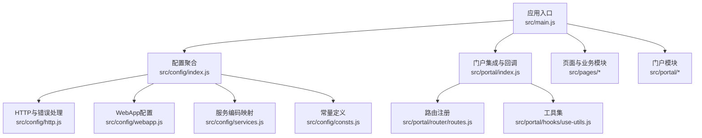
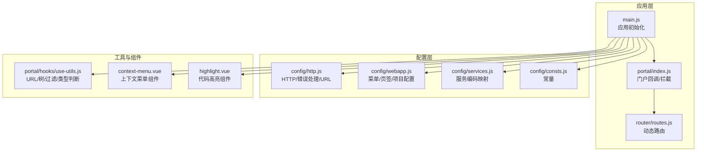
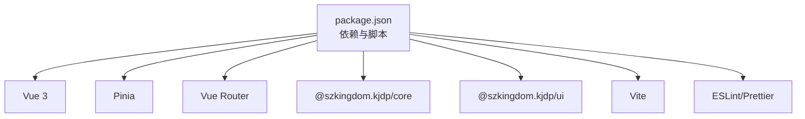

# API参考

<cite>
**本文引用的文件**
- [README.md](file://README.md)
- [package.json](file://package.json)
- [src/main.js](file://src/main.js)
- [src/config/index.js](file://src/config/index.js)
- [src/config/http.js](file://src/config/http.js)
- [src/config/webapp.js](file://src/config/webapp.js)
- [src/config/services.js](file://src/config/services.js)
- [src/config/consts.js](file://src/config/consts.js)
- [src/portal/index.js](file://src/portal/index.js)
- [src/portal/router/routes.js](file://src/portal/router/routes.js)
- [src/portal/hooks/use-utils.js](file://src/portal/hooks/use-utils.js)
- [src/portal/views/workbench/components/context-menu.vue](file://src/portal/views/workbench/components/context-menu.vue)
- [src/portal/modules/highlight/highlight.vue](file://src/portal/modules/highlight/highlight.vue)
- [src/pages/aoi/busi-views/Z0004/accept/org/org-corp-qual-view.vue](file://src/pages/aoi/busi-views/Z0004/accept/org/org-corp-qual-view.vue)
</cite>

## 目录
1. [简介](#简介)
2. [项目结构](#项目结构)
3. [核心组件](#核心组件)
4. [架构总览](#架构总览)
5. [详细组件分析](#详细组件分析)
6. [依赖关系分析](#依赖关系分析)
7. [性能考量](#性能考量)
8. [故障排查指南](#故障排查指南)
9. [结论](#结论)
10. [附录](#附录)

## 简介
本文件为 FS-AOI-WEB 的 API 参考文档，覆盖公共接口、组件 API、服务接口与工具函数的使用说明。内容基于项目源码梳理，面向开发者提供准确、可操作的技术参考。

## 项目结构
FS-AOI-WEB 是基于 Vue 3 + Vite 的前端应用，采用模块化组织方式，核心入口在 src/main.js，配置集中在 src/config，页面与业务模块位于 src/pages、src/portal、src/uas、src/cop 等目录；公共工具与钩子位于 src/portal/hooks。

图表来源
- [src/main.js](file://src/main.js#L1-L40)
- [src/config/index.js](file://src/config/index.js#L1-L8)
- [src/config/http.js](file://src/config/http.js#L1-L124)
- [src/config/webapp.js](file://src/config/webapp.js#L1-L254)
- [src/config/services.js](file://src/config/services.js#L1-L28)
- [src/config/consts.js](file://src/config/consts.js#L1-L120)
- [src/portal/index.js](file://src/portal/index.js#L1-L153)
- [src/portal/router/routes.js](file://src/portal/router/routes.js#L1-L78)
- [src/portal/hooks/use-utils.js](file://src/portal/hooks/use-utils.js#L1-L330)

章节来源
- [src/main.js](file://src/main.js#L1-L40)
- [src/config/index.js](file://src/config/index.js#L1-L8)

## 核心组件
本节概述项目对外暴露的公共接口与能力边界，便于快速定位 API 使用位置。

- 应用初始化与插件注入
  - 入口文件通过 createApp 创建应用实例，挂载 Pinia、KjdpCore、KjdpUI，并在回调中注册路由与挂载。
  - 参考路径：[应用入口](file://src/main.js#L1-L40)

- 配置导出
  - http 配置：统一 HTTP 请求与错误处理策略、加密开关、请求头扩展、URL 基础路径等。
  - webapp 配置：菜单映射、页签限制、项目行为、主题与高亮配置等。
  - 服务编码映射：各模块服务接口号配置。
  - 常量定义：菜单 ID、机构类型、流程状态、权限类型等。
  - 参考路径：
    - [HTTP配置](file://src/config/http.js#L1-L124)
    - [WebApp配置](file://src/config/webapp.js#L1-L254)
    - [服务编码映射](file://src/config/services.js#L1-L28)
    - [常量定义](file://src/config/consts.js#L1-L120)

- 门户与路由
  - 门户回调与拦截器：支持子系统模式、URL 加密密钥获取、消息监听与用户信息同步。
  - 路由注册：动态扫描 pages/* 目录生成路由，支持多门户子路由。
  - 参考路径：
    - [门户集成](file://src/portal/index.js#L1-L153)
    - [路由注册](file://src/portal/router/routes.js#L1-L78)

章节来源
- [src/main.js](file://src/main.js#L1-L40)
- [src/config/http.js](file://src/config/http.js#L1-L124)
- [src/config/webapp.js](file://src/config/webapp.js#L1-L254)
- [src/config/services.js](file://src/config/services.js#L1-L28)
- [src/config/consts.js](file://src/config/consts.js#L1-L120)
- [src/portal/index.js](file://src/portal/index.js#L1-L153)
- [src/portal/router/routes.js](file://src/portal/router/routes.js#L1-L78)

## 架构总览
FS-AOI-WEB 通过配置驱动实现门户、路由、菜单、主题等功能的统一管理；通过 KjdpCore/KjdpUI 提供 UI 与底层能力；通过 request/service 封装与 http 配置实现统一的服务调用与错误处理。

图表来源
- [src/main.js](file://src/main.js#L1-L40)
- [src/config/http.js](file://src/config/http.js#L1-L124)
- [src/config/webapp.js](file://src/config/webapp.js#L1-L254)
- [src/config/services.js](file://src/config/services.js#L1-L28)
- [src/config/consts.js](file://src/config/consts.js#L1-L120)
- [src/portal/index.js](file://src/portal/index.js#L1-L153)
- [src/portal/router/routes.js](file://src/portal/router/routes.js#L1-L78)
- [src/portal/hooks/use-utils.js](file://src/portal/hooks/use-utils.js#L1-L330)
- [src/portal/views/workbench/components/context-menu.vue](file://src/portal/views/workbench/components/context-menu.vue#L1-L86)
- [src/portal/modules/highlight/highlight.vue](file://src/portal/modules/highlight/highlight.vue#L1-L51)

## 详细组件分析

### 门户与路由 API
- 路由注册
  - 动态扫描 pages/* 目录，按 portalConfig 与 pagesConfig 组合生成子路由，支持重载与空组件占位。
  - 参考路径：[路由注册](file://src/portal/router/routes.js#L1-L78)

- 门户回调与拦截
  - appBeforeMount：并行初始化 URL 加密密钥、iframe 消息、用户信息、主题与 favicon，以及子系统模式校验。
  - appMounted：初始化主题与 favicon。
  - serviceInterceptors：服务请求拦截器，返回 isPass 控制请求放行。
  - 参考路径：[门户集成](file://src/portal/index.js#L109-L153)

- URL 工具
  - URL 解析/构建、查询串构建、URL 加密/解密、菜单链接格式化、树形数据转换、菜单过滤、类型判断等。
  - 参考路径：[URL工具集](file://src/portal/hooks/use-utils.js#L1-L330)

章节来源
- [src/portal/router/routes.js](file://src/portal/router/routes.js#L1-L78)
- [src/portal/index.js](file://src/portal/index.js#L109-L153)
- [src/portal/hooks/use-utils.js](file://src/portal/hooks/use-utils.js#L1-L330)

### HTTP 与服务接口 API
- HTTP 配置要点
  - 成功码判定：基于服务端 MSG_CODE 判定。
  - 加密开关：fsEncrypt 控制请求加密。
  - 错误处理：统一弹窗提示，支持 traceId 展示。
  - 请求头扩展：reqCommDataExtend 注入菜单上下文。
  - URL 基础：getReqBase/getServiceBase 提供服务与请求基础路径。
  - 参考路径：[HTTP配置](file://src/config/http.js#L27-L124)

- 服务编码映射
  - portal 模块：门户查询、菜单查询、常用菜单、字典、系统参数、省市区、机构等接口号。
  - 参考路径：[服务编码映射](file://src/config/services.js#L4-L26)

- 错误码与提示
  - 成功码：'0'、'100'
  - 错误弹窗：统一通过 KuiMessageBox.alert 展示，包含 MSG_TEXT、URL、traceId 等。
  - 参考路径：[错误处理](file://src/config/http.js#L6-L25)

- 会话与认证相关 URL
  - 用户会话、动态密钥、验证码、登录、登出、用户信息、通用上传/下载/删除等。
  - 参考路径：[URL配置](file://src/config/http.js#L100-L114)

章节来源
- [src/config/http.js](file://src/config/http.js#L27-L124)
- [src/config/services.js](file://src/config/services.js#L4-L26)

### Vue 组件 API

#### 上下文菜单组件（context-menu.vue）
- 暴露方法
  - open(event)：显示菜单并定位到鼠标位置，自动适配视窗边界。
  - close()：关闭菜单。
- 插槽
  - 默认插槽：接收 { close } 函数，用于在菜单项点击后关闭菜单。
- 行为特性
  - 点击外部区域或按下 Esc 键自动关闭。
  - 使用 Teleport 将菜单挂载到 body，避免层级问题。
- 参考路径：[上下文菜单组件](file://src/portal/views/workbench/components/context-menu.vue#L1-L86)

章节来源
- [src/portal/views/workbench/components/context-menu.vue](file://src/portal/views/workbench/components/context-menu.vue#L1-L86)

#### 代码高亮组件（highlight.vue）
- Props
  - code: 字符串，待高亮的代码文本。
  - language: 字符串，语言标识，默认 javascript。
  - autodetect: 布尔，是否自动检测语言，默认 true。
  - ignoreIllegals: 布尔，是否忽略非法语法，默认 true。
- 行为特性
  - 若无法检测语言，回退为纯文本转义输出。
  - 支持通过默认插槽传入代码内容。
- 参考路径：[代码高亮组件](file://src/portal/modules/highlight/highlight.vue#L1-L51)

章节来源
- [src/portal/modules/highlight/highlight.vue](file://src/portal/modules/highlight/highlight.vue#L1-L51)

#### 业务表单组件示例（org-corp-qual-view.vue）
- Props
  - data: 数组，初始表单数据。
- 暴露 API（expose）
  - validate()：校验表单。
  - getData()：获取表单数据。
- 行为特性
  - 使用 KuiGeneralForm 渲染企业资质相关字段，支持字典项与日期控件。
- 参考路径：[企业资质信息组件](file://src/pages/aoi/busi-views/Z0004/accept/org/org-corp-qual-view.vue#L1-L37)

章节来源
- [src/pages/aoi/busi-views/Z0004/accept/org/org-corp-qual-view.vue](file://src/pages/aoi/busi-views/Z0004/accept/org/org-corp-qual-view.vue#L1-L37)

### 工具函数 API

#### URL 工具（use-utils.js）
- 加密/解密
  - encryptUrlParam(param)：对字符串或对象序列化后加密。
  - decryptUrlParam(str)：对加密字符串解密并尝试 JSON.parse。
- 数据结构
  - arrayToTree(data, idField, parentIdField, childrenFieldName, ROOT_ID, neglectNullParent)：将扁平数组转为树形结构。
- URL 解析与构建
  - parseUrl(url)：解析 URL 为对象，支持解密 param 场景。
  - buildUrl(url, params, hash, opts)：构建带查询串与哈希的 URL，支持加密。
  - buildQueryString(obj, encodeFlag)：构建查询串。
  - formatUrl(row, busiData)：根据菜单数据格式化最终链接。
- 菜单过滤
  - filterTreeData(originData, options)：按配置过滤菜单树。
- 类型判断
  - isObject/isArray/isString/isNumber/isNull/isUndefined：类型判断辅助。
- 参考路径：[URL工具集](file://src/portal/hooks/use-utils.js#L1-L330)

章节来源
- [src/portal/hooks/use-utils.js](file://src/portal/hooks/use-utils.js#L1-L330)

## 依赖关系分析
- 框架与库
  - Vue 3、Pinia、Vue Router、@szkingdom.kjdp/core、@szkingdom.kjdp/ui 等。
- 构建与脚手架
  - Vite、ESLint、Prettier、Sass 等。
- 参考路径：
  - [项目依赖](file://package.json#L17-L40)
  - [脚本与引擎](file://package.json#L6-L16)

图表来源
- [package.json](file://package.json#L17-L40)

章节来源
- [package.json](file://package.json#L17-L40)

## 性能考量
- 路由懒加载与动态注册：通过 import.meta.glob 实现按需加载，减少首屏体积。
- URL 加密与解密：在需要时启用，避免不必要的加解密开销。
- 组件按需使用：高亮组件仅在需要时加载，上下文菜单组件按需显示。
- 配置集中管理：通过配置文件集中控制行为，避免重复逻辑。

## 故障排查指南
- 登录与会话
  - 子系统模式：检查子系统消息监听与 token 转换流程，确认回调与会话一致性。
  - 参考路径：[子系统模式与会话](file://src/portal/index.js#L17-L101)

- HTTP 错误与服务错误
  - 统一错误弹窗：检查 MSG_CODE、MSG_TEXT、traceId 是否正确透传。
  - 参考路径：[错误处理](file://src/config/http.js#L6-L25)

- URL 参数问题
  - URL 加密开关：确认 projectConfig.urlEncrypt 与 encryptUrlParam/decryptUrlParam 的使用。
  - 参考路径：[URL工具集](file://src/portal/hooks/use-utils.js#L6-L34)

- 菜单过滤与树形结构
  - arrayToTree 与 filterTreeData：确认字段映射与过滤条件。
  - 参考路径：[URL工具集](file://src/portal/hooks/use-utils.js#L36-L92)

章节来源
- [src/portal/index.js](file://src/portal/index.js#L17-L101)
- [src/config/http.js](file://src/config/http.js#L6-L25)
- [src/portal/hooks/use-utils.js](file://src/portal/hooks/use-utils.js#L6-L34)
- [src/portal/hooks/use-utils.js](file://src/portal/hooks/use-utils.js#L36-L92)

## 结论
本参考文档梳理了 FS-AOI-WEB 的应用初始化、配置体系、门户与路由、HTTP 与服务接口、Vue 组件 API 以及工具函数的使用方法与注意事项。建议在集成与扩展时优先遵循配置驱动与统一错误处理机制，确保系统稳定性与可维护性。

## 附录
- 环境要求与安装
  - Node.js 最低版本要求与依赖安装步骤。
  - 参考路径：[环境准备](file://README.md#L3-L55)

章节来源
- [README.md](file://README.md#L3-L55)