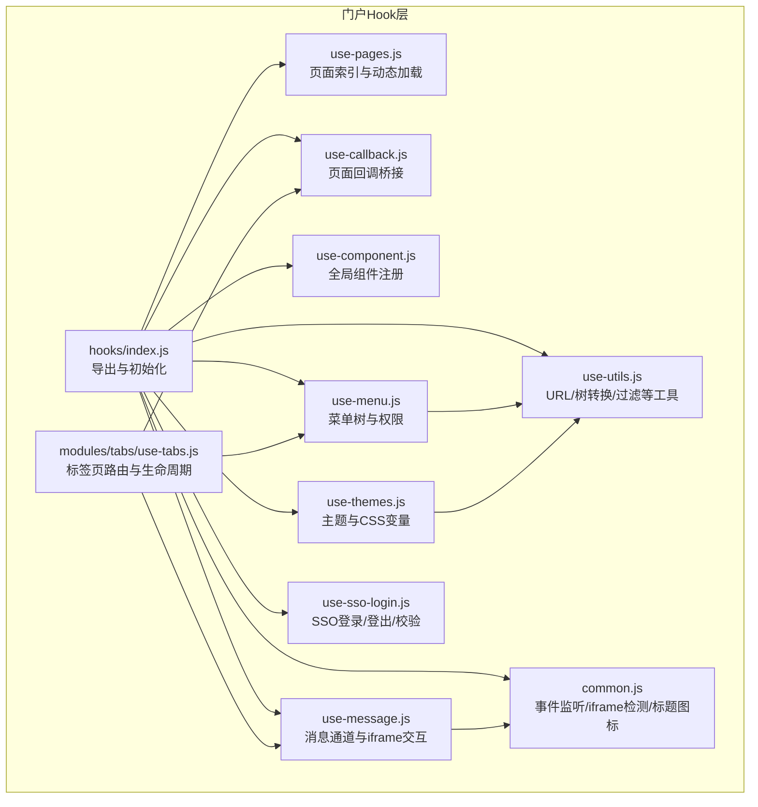
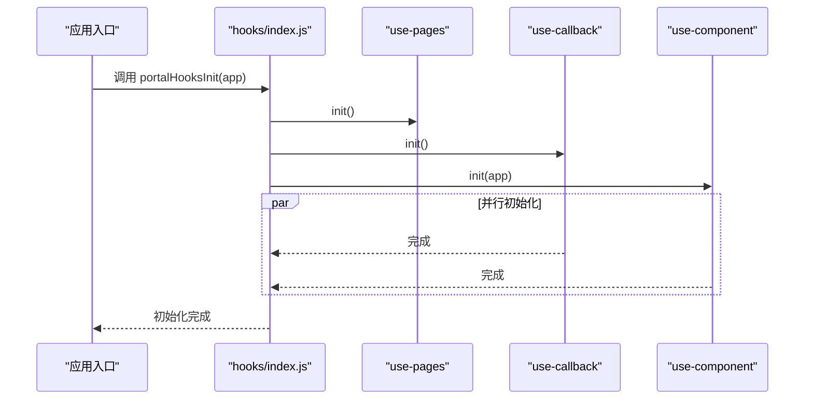
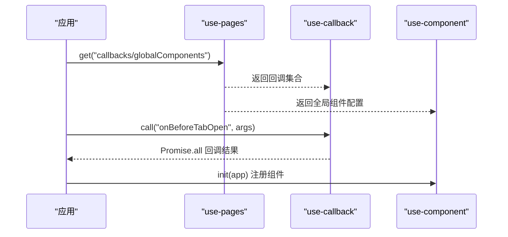
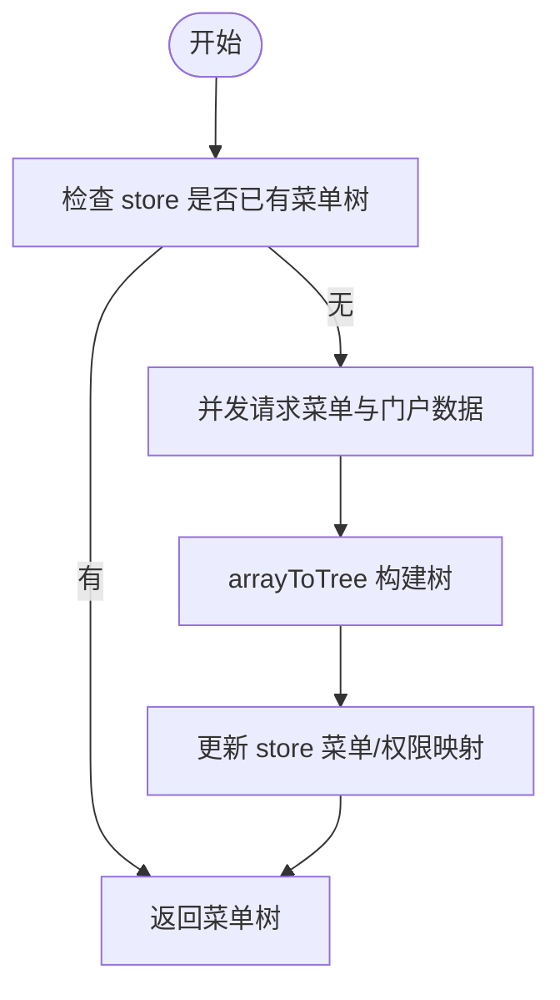
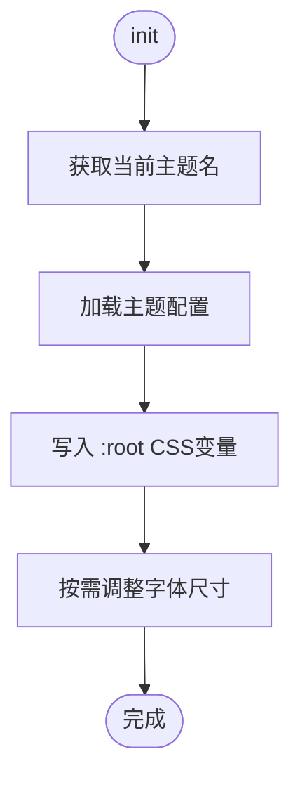
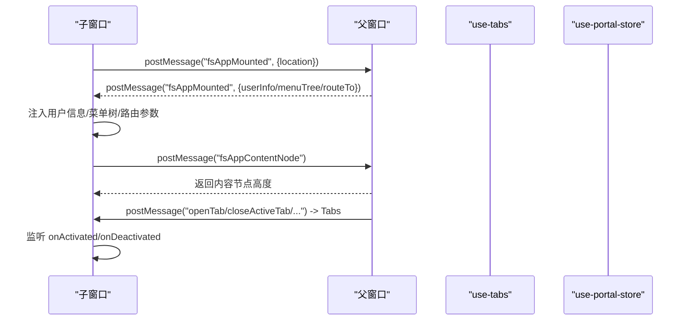
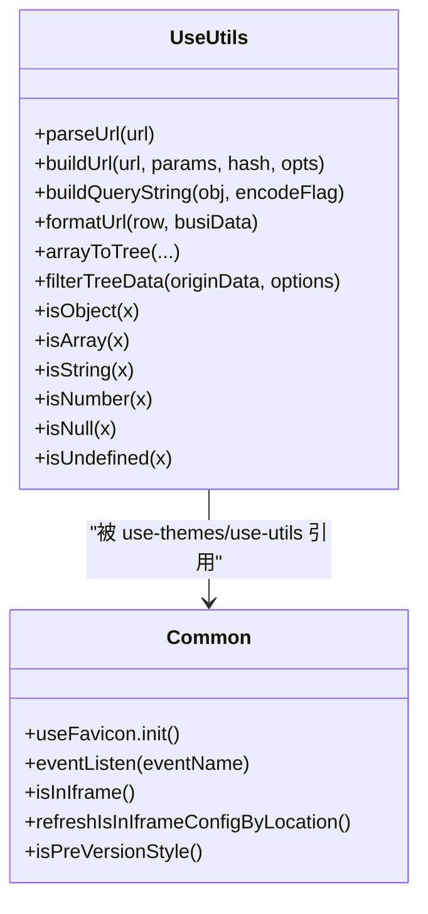
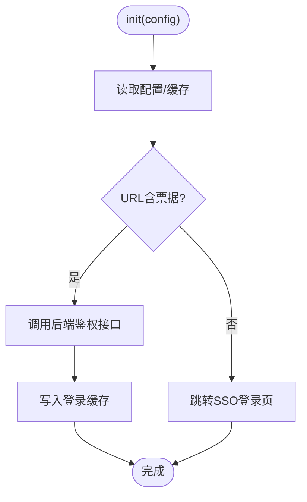
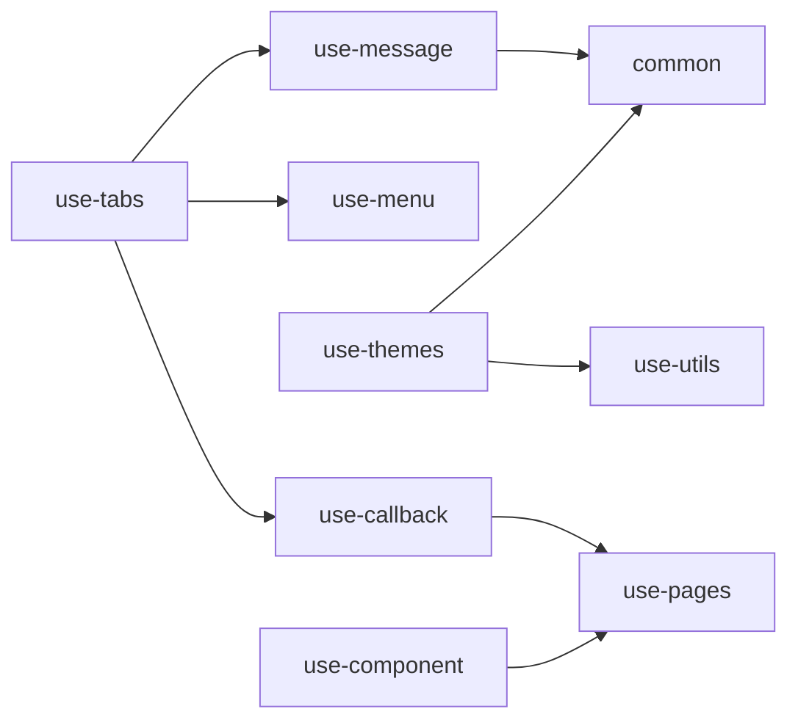

# Hook接口

<cite>
**本文引用的文件**   
- [src/portal/hooks/index.js](file://src/portal/hooks/index.js)
- [src/portal/hooks/use-pages.js](file://src/portal/hooks/use-pages.js)
- [src/portal/hooks/use-menu.js](file://src/portal/hooks/use-menu.js)
- [src/portal/hooks/use-themes.js](file://src/portal/hooks/use-themes.js)
- [src/portal/hooks/use-message.js](file://src/portal/hooks/use-message.js)
- [src/portal/hooks/use-callback.js](file://src/portal/hooks/use-callback.js)
- [src/portal/hooks/use-component.js](file://src/portal/hooks/use-component.js)
- [src/portal/hooks/common.js](file://src/portal/hooks/common.js)
- [src/portal/hooks/use-utils.js](file://src/portal/hooks/use-utils.js)
- [src/portal/hooks/use-sso-login.js](file://src/portal/hooks/use-sso-login.js)
- [src/portal/modules/tabs/use-tabs.js](file://src/portal/modules/tabs/use-tabs.js)
- [src/portal/hooks/import-all-pages.js](file://src/portal/hooks/import-all-pages.js)
</cite>

## 目录
1. [简介](#简介)
2. [项目结构](#项目结构)
3. [核心Hook](#核心hook)
4. [架构总览](#架构总览)
5. [详细Hook分析](#详细hook分析)
6. [依赖关系分析](#依赖关系分析)
7. [性能与可维护性](#性能与可维护性)
8. [故障排查指南](#故障排查指南)
9. [结论](#结论)
10. [附录：最佳实践与组合示例](#附录最佳实践与组合示例)

## 简介
本文件系统化梳理 FS-AOI-WEB 的 Hook 接口体系，覆盖页面管理、菜单处理、主题切换、消息提示、回调桥接、组件注册、通用工具与SSO登录等核心能力。文档面向不同技术背景的读者，既提供高层概览，也给出深入到实现细节的分析与可视化图表，帮助开发者正确使用、扩展与组合这些 Hook。

## 项目结构
FS-AOI-WEB 的 Hook 主要集中在门户模块的 hooks 目录，围绕“页面发现与加载”“菜单树构建与权限”“主题与样式变量”“消息通道与iframe交互”“回调桥接与全局组件注册”“通用工具与SSO登录”等维度组织。

**图表来源**
- [src/portal/hooks/index.js](file://src/portal/hooks/index.js#L1-L20)
- [src/portal/hooks/use-pages.js](file://src/portal/hooks/use-pages.js#L1-L21)
- [src/portal/hooks/use-callback.js](file://src/portal/hooks/use-callback.js#L1-L24)
- [src/portal/hooks/use-component.js](file://src/portal/hooks/use-component.js#L1-L37)
- [src/portal/hooks/use-menu.js](file://src/portal/hooks/use-menu.js#L1-L130)
- [src/portal/hooks/use-themes.js](file://src/portal/hooks/use-themes.js#L1-L197)
- [src/portal/hooks/use-message.js](file://src/portal/hooks/use-message.js#L1-L503)
- [src/portal/hooks/use-utils.js](file://src/portal/hooks/use-utils.js#L1-L330)
- [src/portal/hooks/common.js](file://src/portal/hooks/common.js#L1-L81)
- [src/portal/hooks/use-sso-login.js](file://src/portal/hooks/use-sso-login.js#L1-L84)
- [src/portal/modules/tabs/use-tabs.js](file://src/portal/modules/tabs/use-tabs.js#L1-L597)

**章节来源**
- [src/portal/hooks/index.js](file://src/portal/hooks/index.js#L1-L20)

## 核心Hook
- 页面管理：use-pages 动态收集页面索引，use-callback 统一触发页面回调，use-component 注册全局组件
- 菜单处理：use-menu 提供门户/菜单数据获取、树构建、权限类型判定、最近访问本地存储
- 主题切换：use-themes 初始化主题、变更主题、设置字体大小、设置CSS变量、列举主题名
- 消息提示与iframe交互：use-message 处理用户信息同步、内容节点高度、跨iframe消息、激活/失活观察、重载事件
- 通用工具：use-utils 提供URL解析/构建、菜单过滤、类型判断；common 提供事件监听、iframe检测、favicon/标题设置、旧版主题判断
- SSO登录：use-sso-login 提供SSO配置、登录/登出、票据提取与鉴权

**章节来源**
- [src/portal/hooks/use-pages.js](file://src/portal/hooks/use-pages.js#L1-L21)
- [src/portal/hooks/use-callback.js](file://src/portal/hooks/use-callback.js#L1-L24)
- [src/portal/hooks/use-component.js](file://src/portal/hooks/use-component.js#L1-L37)
- [src/portal/hooks/use-menu.js](file://src/portal/hooks/use-menu.js#L1-L130)
- [src/portal/hooks/use-themes.js](file://src/portal/hooks/use-themes.js#L1-L197)
- [src/portal/hooks/use-message.js](file://src/portal/hooks/use-message.js#L1-L503)
- [src/portal/hooks/use-utils.js](file://src/portal/hooks/use-utils.js#L1-L330)
- [src/portal/hooks/common.js](file://src/portal/hooks/common.js#L1-L81)
- [src/portal/hooks/use-sso-login.js](file://src/portal/hooks/use-sso-login.js#L1-L84)

## 架构总览
门户启动时通过 hooks/index.js 初始化各Hook，其中 usePages.init() 预热页面索引，Promise.all 并行初始化 useCallback 与 useComponent，确保回调与组件注册尽早可用。

**图表来源**
- [src/portal/hooks/index.js](file://src/portal/hooks/index.js#L12-L17)
- [src/portal/hooks/use-pages.js](file://src/portal/hooks/use-pages.js#L4-L6)
- [src/portal/hooks/use-callback.js](file://src/portal/hooks/use-callback.js#L6-L8)
- [src/portal/hooks/use-component.js](file://src/portal/hooks/use-component.js#L6-L8)

## 详细Hook分析

### 页面管理：use-pages 与 use-callback、use-component
- use-pages
  - 功能：扫描 pages 目录下 index.js，建立页面索引映射，按 key 返回页面导出集合
  - 关键点：import.meta.glob 动态导入，get(key) 支持多页面同名导出聚合
- use-callback
  - 功能：从 use-pages 获取页面回调集合，统一调用并并行等待结果
  - 关键点：call(funcName, args) 对每个页面的回调函数执行并聚合 Promise 结果
- use-component
  - 功能：注册两类全局组件
    - 门户级：来自 projectConfig 的组件声明，异步加载并注册
    - 页面级：从 use-pages 的 globalComponents 导出，批量异步注册

**图表来源**
- [src/portal/hooks/use-pages.js](file://src/portal/hooks/use-pages.js#L8-L17)
- [src/portal/hooks/use-callback.js](file://src/portal/hooks/use-callback.js#L10-L20)
- [src/portal/hooks/use-component.js](file://src/portal/hooks/use-component.js#L25-L33)

**章节来源**
- [src/portal/hooks/use-pages.js](file://src/portal/hooks/use-pages.js#L1-L21)
- [src/portal/hooks/use-callback.js](file://src/portal/hooks/use-callback.js#L1-L24)
- [src/portal/hooks/use-component.js](file://src/portal/hooks/use-component.js#L1-L37)

### 菜单处理：use-menu
- 功能要点
  - 门户与菜单数据获取：优先使用 store 中已有数据，否则请求服务端并更新 store
  - 树构建与适配：arrayToTree 构造菜单树，结合 portal 渲染类型与系统参数做兼容处理
  - 权限与类型判定：RIGHT_TYPE、MENU_OP_PER、iframe/router/tab 类型识别
  - 最近访问：基于 localStorage 的最近访问菜单缓存，支持清理与读取
- 使用场景
  - 首次进入时拉取并缓存菜单树
  - 根据菜单类型决定打开 iframe 或路由模式
  - 依据权限类型控制菜单展示与操作

**图表来源**
- [src/portal/hooks/use-menu.js](file://src/portal/hooks/use-menu.js#L19-L67)

**章节来源**
- [src/portal/hooks/use-menu.js](file://src/portal/hooks/use-menu.js#L1-L130)

### 主题切换：use-themes
- 功能要点
  - 主题选择：从 URL 参数或默认主题配置选择当前主题
  - CSS变量注入：将主题配置写入 :root，支持混合色阶与字体尺寸调整
  - 工具函数：颜色格式化、RGB转十进制、十六进制补全、色阶混合
  - 主题枚举：列出可用主题名，获取当前主题
- 使用场景
  - 应用启动时初始化主题
  - 用户切换主题时动态变更 CSS 变量
  - 根据主题调整全局字号以适配不同设备

**图表来源**
- [src/portal/hooks/use-themes.js](file://src/portal/hooks/use-themes.js#L140-L163)

**章节来源**
- [src/portal/hooks/use-themes.js](file://src/portal/hooks/use-themes.js#L1-L197)

### 消息提示与iframe交互：use-message
- 功能要点
  - iframe 模式用户信息同步：向父窗口发送/接收 fsAppMounted 消息，注入用户信息与服务配置
  - 内容节点高度探测：统计 router-view 区域高度与消息框高度，反馈给 iframe
  - 跨iframe标签页控制：接收 openTab/closeActiveTab/reloadTab/closeTab 等消息并转发至 use-tabs
  - 数据同步：接收 syncData 消息，写入缓存并触发回调
  - 激活/失活观察：定时检测 body 尺寸变化，上报 onActivated/onDeactivated
  - 路由跳转：接收 routeTo 消息，刷新当前路由参数
- 使用场景
  - 在 iframe 嵌入场景下，实现父子窗口间的状态同步与指令下发
  - 统一处理标签页的打开/关闭/刷新等操作

**图表来源**
- [src/portal/hooks/use-message.js](file://src/portal/hooks/use-message.js#L66-L205)
- [src/portal/hooks/use-message.js](file://src/portal/hooks/use-message.js#L207-L307)
- [src/portal/hooks/use-message.js](file://src/portal/hooks/use-message.js#L375-L400)
- [src/portal/modules/tabs/use-tabs.js](file://src/portal/modules/tabs/use-tabs.js#L292-L366)

**章节来源**
- [src/portal/hooks/use-message.js](file://src/portal/hooks/use-message.js#L1-L503)

### 通用工具与通用能力：use-utils 与 common
- use-utils
  - URL工具：parseUrl/buildUrl/buildQueryString/formatUrl
  - 菜单工具：arrayToTree、filterTreeData、filterMenu/filterMenuItem
  - 类型判断：isObject/isArray/isString/isNumber/isNull/isUndefined
- common
  - favicon/标题设置：根据系统参数动态更新
  - 事件监听：eventListen(eventName) 提供 mount/unmount
  - iframe检测：isInIframe/refreshIsInIframeConfigByLocation
  - 旧版主题判断：isPreVersionStyle

**图表来源**
- [src/portal/hooks/use-utils.js](file://src/portal/hooks/use-utils.js#L316-L329)
- [src/portal/hooks/common.js](file://src/portal/hooks/common.js#L10-L33)

**章节来源**
- [src/portal/hooks/use-utils.js](file://src/portal/hooks/use-utils.js#L1-L330)
- [src/portal/hooks/common.js](file://src/portal/hooks/common.js#L1-L81)

### SSO登录：use-sso-login
- 功能要点
  - 配置：url、formatParam、ticketKey、authUrl、authParam、cacheKey、redirectUrl
  - 流程：检查是否已配置SSO，提取票据，调用后端鉴权接口，登录成功写入缓存
  - 登出：调用SSO登出地址
  - 校验：通过接口检查是否启用SSO并写入缓存
- 使用场景
  - 统一接入SSO认证流程，简化登录/登出逻辑

**图表来源**
- [src/portal/hooks/use-sso-login.js](file://src/portal/hooks/use-sso-login.js#L73-L81)

**章节来源**
- [src/portal/hooks/use-sso-login.js](file://src/portal/hooks/use-sso-login.js#L1-L84)

## 依赖关系分析
- use-tabs 与 use-message 协作：use-tabs 在打开/关闭/刷新标签时，若为 iframe 菜单则委托 use-iframe 执行；同时通过 use-message 的 postMessage 机制与父窗口通信
- use-tabs 与 use-menu：根据菜单类型（iframe/router/tab）决定路由或iframe打开策略，并在路由前触发 useCallback 的页面回调
- use-themes 与 use-utils：use-themes 使用 use-utils 的 parseUrl 获取主题参数；common 提供旧版主题判断
- use-component 与 use-pages：use-component 从 use-pages 的 globalComponents 注册页面级全局组件
- use-callback 与 use-pages：use-callback 从 use-pages 的 callbacks 调用页面钩子

**图表来源**
- [src/portal/modules/tabs/use-tabs.js](file://src/portal/modules/tabs/use-tabs.js#L1-L11)
- [src/portal/hooks/use-themes.js](file://src/portal/hooks/use-themes.js#L1-L3)
- [src/portal/hooks/use-utils.js](file://src/portal/hooks/use-utils.js#L1-L4)
- [src/portal/hooks/use-component.js](file://src/portal/hooks/use-component.js#L1-L3)
- [src/portal/hooks/use-callback.js](file://src/portal/hooks/use-callback.js#L1-L3)

**章节来源**
- [src/portal/modules/tabs/use-tabs.js](file://src/portal/modules/tabs/use-tabs.js#L1-L597)
- [src/portal/hooks/use-themes.js](file://src/portal/hooks/use-themes.js#L1-L197)
- [src/portal/hooks/use-utils.js](file://src/portal/hooks/use-utils.js#L1-L330)
- [src/portal/hooks/use-component.js](file://src/portal/hooks/use-component.js#L1-L37)
- [src/portal/hooks/use-callback.js](file://src/portal/hooks/use-callback.js#L1-L24)

## 性能与可维护性
- 动态导入与并行初始化
  - use-pages 使用 import.meta.glob 预热页面索引，避免运行时重复扫描
  - hooks/index.js 通过 Promise.all 并行初始化 useCallback 与 use-component，缩短启动时间
- 菜单与主题
  - 菜单数据与主题配置均采用 store 缓存，减少重复请求
  - 主题切换仅写入 :root CSS 变量，避免全量重绘
- 回调与组件注册
  - useCallback 并行执行页面回调，提高响应速度
  - use-component 异步注册组件，避免阻塞主线程
- 建议
  - 对高频调用的回调与工具函数进行必要的防抖/节流
  - 对大型菜单树的过滤与转换尽量在服务端完成，前端仅做轻量处理

[本节为通用指导，无需具体文件分析]

## 故障排查指南
- 菜单无法打开/空白页
  - 检查 use-menu 的菜单类型与链接配置，确认 isIframeMenu/isRouterMenu 判定是否正确
  - 若为路由模式，确认 pageViews 中是否存在对应组件
- 主题切换无效
  - 检查 use-themes 的主题配置文件是否存在且导出默认配置
  - 确认 :root CSS 变量是否被覆盖
- iframe 通信异常
  - 确认 isInIframe 配置是否正确，以及 postMessage 的 topic 是否一致
  - 检查父窗口是否正确接收并转发消息
- 回调未生效
  - 确认 use-pages 的页面是否导出 callbacks 对象
  - 检查 useCallback 的 call 调用是否传入正确的函数名与参数

**章节来源**
- [src/portal/hooks/use-menu.js](file://src/portal/hooks/use-menu.js#L144-L196)
- [src/portal/modules/tabs/use-tabs.js](file://src/portal/modules/tabs/use-tabs.js#L144-L196)
- [src/portal/hooks/use-themes.js](file://src/portal/hooks/use-themes.js#L140-L163)
- [src/portal/hooks/use-message.js](file://src/portal/hooks/use-message.js#L375-L400)
- [src/portal/hooks/use-callback.js](file://src/portal/hooks/use-callback.js#L10-L20)

## 结论
FS-AOI-WEB 的 Hook 系统以“页面发现—菜单—主题—消息—回调—组件—工具—SSO”的链路形成完整的门户能力闭环。通过动态导入、并行初始化与store缓存，系统在保证灵活性的同时兼顾性能。开发者应遵循本文档的使用方式、状态管理与副作用处理建议，合理组合 Hook，提升开发效率与系统稳定性。

[本节为总结，无需具体文件分析]

## 附录：最佳实践与组合示例

- 页面管理最佳实践
  - 在应用启动阶段调用 portalHooksInit(app)，确保 usePages、useCallback、useComponent 初始化完成
  - 页面导出 callbacks 时，避免阻塞操作；对耗时任务使用异步回调
  - 页面导出 globalComponents 时，统一命名规范，避免冲突

- 菜单处理最佳实践
  - 使用 use-menu 的 isIframeMenu/isRouterMenu 判定菜单类型，分别走 iframe 或路由打开策略
  - 对于临时菜单（manualMenuChain），及时清理临时节点，避免内存泄漏
  - 使用 arrayToTree 与 filterTreeData 做菜单过滤时，注意深拷贝与性能

- 主题切换最佳实践
  - 在应用启动时调用 use-themes.init()，确保主题变量注入
  - 自定义主题文件需导出默认配置对象，字段命名与 use-themes 保持一致
  - 字体大小调整建议在主题配置中集中管理

- 消息与iframe交互最佳实践
  - 在 iframe 场景下，优先使用 use-message 的 postMessage 机制与父窗口通信
  - 对高频消息（如内容节点高度）进行节流处理
  - onActivated/onDeactivated 观察器仅在 iframe 下启用，避免影响主窗口性能

- 回调与组件注册最佳实践
  - useCallback 的回调函数应幂等，避免副作用累积
  - use-component 注册组件时，使用 defineAsyncComponent 做懒加载，减少首屏体积

- 组合使用示例（概念示意）
  - 打开标签页流程
    - use-tabs.open → formatRouteInfo → useCallback.call('onBeforeTabOpen') → 条件打开门户/卡片 → 路由跳转 → useCallback.call('onTabOpened')
  - iframe 菜单打开流程
    - use-tabs.open → isIframeMenu → use-iframe.open → use-message.getContentNodeInIframeMode

[本节为实践指导，无需具体文件分析]