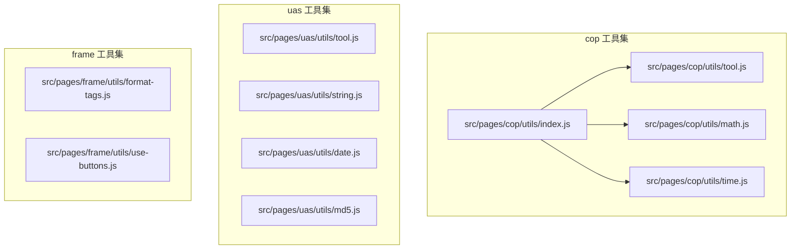
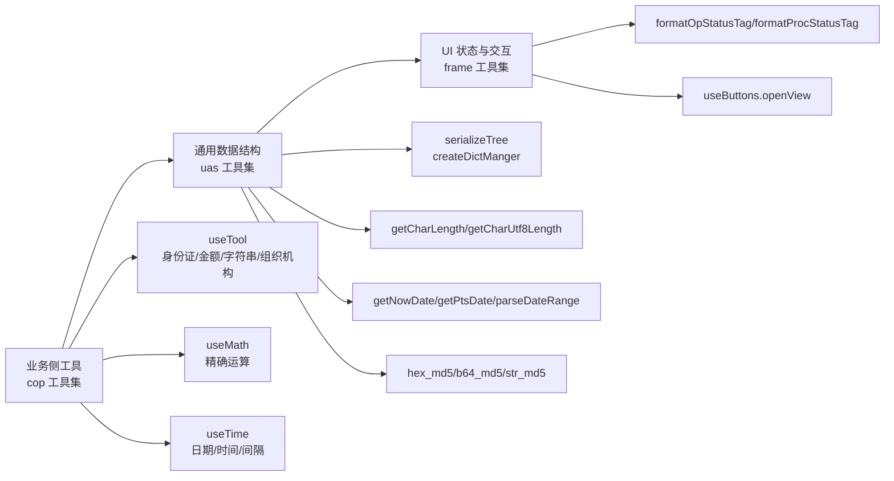
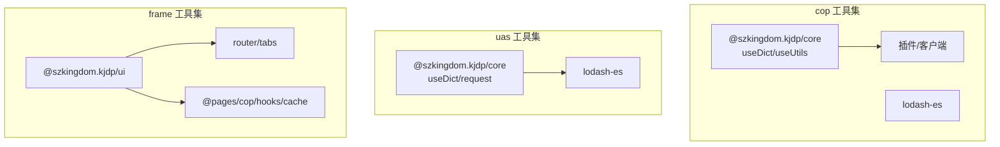

# 工具函数

<cite>
**本文引用的文件**
- [src/pages/cop/utils/index.js](file://src/pages/cop/utils/index.js)
- [src/pages/cop/utils/tool.js](file://src/pages/cop/utils/tool.js)
- [src/pages/cop/utils/math.js](file://src/pages/cop/utils/math.js)
- [src/pages/cop/utils/time.js](file://src/pages/cop/utils/time.js)
- [src/pages/uas/utils/tool.js](file://src/pages/uas/utils/tool.js)
- [src/pages/uas/utils/string.js](file://src/pages/uas/utils/string.js)
- [src/pages/uas/utils/date.js](file://src/pages/uas/utils/date.js)
- [src/pages/uas/utils/md5.js](file://src/pages/uas/utils/md5.js)
- [src/pages/frame/utils/format-tags.js](file://src/pages/frame/utils/format-tags.js)
- [src/pages/frame/utils/use-buttons.js](file://src/pages/frame/utils/use-buttons.js)
</cite>

## 目录
1. [简介](#简介)
2. [项目结构](#项目结构)
3. [核心组件](#核心组件)
4. [架构总览](#架构总览)
5. [详细组件分析](#详细组件分析)
6. [依赖分析](#依赖分析)
7. [性能考虑](#性能考虑)
8. [故障排查指南](#故障排查指南)
9. [结论](#结论)
10. [附录](#附录)

## 简介
本文件为 FS-AOI-WEB 的工具函数 API 文档，覆盖日期处理、字符串操作、数学计算、数据验证、字典与树结构、MD5 加解密、按钮与弹窗封装等常用能力。文档以“功能—参数—返回—使用场景—注意事项”的形式呈现，并提供组合使用建议与常见错误规避方法，帮助开发者快速定位并正确使用工具函数，提升开发效率。

## 项目结构
工具函数主要分布在以下模块：
- cop 工具集：读卡、身份证与统一社会信用代码校验、金额格式化、字符串长度计算、组织机构代码提取等
- uas 工具集：字典管理、树结构序列化、字符串长度统计、日期解析与格式化、MD5 哈希
- frame 工具集：状态标签样式映射、通用弹窗与页面打开封装

图表来源
- [src/pages/cop/utils/index.js](file://src/pages/cop/utils/index.js#L1-L4)
- [src/pages/cop/utils/tool.js](file://src/pages/cop/utils/tool.js#L351-L364)
- [src/pages/cop/utils/math.js](file://src/pages/cop/utils/math.js#L71-L78)
- [src/pages/cop/utils/time.js](file://src/pages/cop/utils/time.js#L322-L340)
- [src/pages/uas/utils/tool.js](file://src/pages/uas/utils/tool.js#L9-L53)
- [src/pages/uas/utils/string.js](file://src/pages/uas/utils/string.js#L1-L15)
- [src/pages/uas/utils/date.js](file://src/pages/uas/utils/date.js#L1-L102)
- [src/pages/uas/utils/md5.js](file://src/pages/uas/utils/md5.js#L21-L38)
- [src/pages/frame/utils/format-tags.js](file://src/pages/frame/utils/format-tags.js#L1-L36)
- [src/pages/frame/utils/use-buttons.js](file://src/pages/frame/utils/use-buttons.js#L1-L40)

章节来源
- [src/pages/cop/utils/index.js](file://src/pages/cop/utils/index.js#L1-L4)

## 核心组件
- cop 工具集（useTool）
  - 读卡与身份证/统一社会信用代码处理
  - 金额中文大写与千分位格式化
  - 字符串长度计算（按字节/字符）
  - 组织机构代码提取
- cop 数学工具集（useMath）
  - 精确加减乘除与四舍五入
- cop 时间工具集（useTime）
  - 日期格式化/解析、比较、间隔计算
  - 客户端日期/时间获取、特殊日期计算
  - 月/年/日偏移、系统时间获取
- uas 工具集（useUASTool）
  - 树结构序列化
  - 字典管理与翻译
- uas 字符串工具集（useUASString）
  - 中文字符长度统计（ASCII/UTF-8）
- uas 日期工具集（useUASDate）
  - 当前日期、清算日期、时间戳转换
  - 日期范围解析与格式化
- uas MD5 工具集（useUASMD5）
  - MD5/哈希/HMAC-MD5 计算
- frame 工具集
  - 状态标签样式映射
  - 弹窗与页面打开封装

章节来源
- [src/pages/cop/utils/tool.js](file://src/pages/cop/utils/tool.js#L351-L364)
- [src/pages/cop/utils/math.js](file://src/pages/cop/utils/math.js#L71-L78)
- [src/pages/cop/utils/time.js](file://src/pages/cop/utils/time.js#L322-L340)
- [src/pages/uas/utils/tool.js](file://src/pages/uas/utils/tool.js#L9-L53)
- [src/pages/uas/utils/string.js](file://src/pages/uas/utils/string.js#L1-L15)
- [src/pages/uas/utils/date.js](file://src/pages/uas/utils/date.js#L1-L102)
- [src/pages/uas/utils/md5.js](file://src/pages/uas/utils/md5.js#L21-L38)
- [src/pages/frame/utils/format-tags.js](file://src/pages/frame/utils/format-tags.js#L1-L36)
- [src/pages/frame/utils/use-buttons.js](file://src/pages/frame/utils/use-buttons.js#L1-L40)

## 架构总览
工具函数按“功能域”划分，通过统一命名空间导出，便于按需引入与组合使用。cop 工具集侧重业务侧数据处理与格式化；uas 工具集侧重通用数据结构与安全；frame 工具集提供 UI 层状态与交互封装。

图表来源
- [src/pages/cop/utils/tool.js](file://src/pages/cop/utils/tool.js#L351-L364)
- [src/pages/cop/utils/math.js](file://src/pages/cop/utils/math.js#L71-L78)
- [src/pages/cop/utils/time.js](file://src/pages/cop/utils/time.js#L322-L340)
- [src/pages/uas/utils/tool.js](file://src/pages/uas/utils/tool.js#L9-L53)
- [src/pages/uas/utils/string.js](file://src/pages/uas/utils/string.js#L1-L15)
- [src/pages/uas/utils/date.js](file://src/pages/uas/utils/date.js#L1-L102)
- [src/pages/uas/utils/md5.js](file://src/pages/uas/utils/md5.js#L21-L38)
- [src/pages/frame/utils/format-tags.js](file://src/pages/frame/utils/format-tags.js#L1-L36)
- [src/pages/frame/utils/use-buttons.js](file://src/pages/frame/utils/use-buttons.js#L1-L40)

## 详细组件分析

### cop 工具集（useTool）
- 功能概览
  - 读卡与身份证/统一社会信用代码处理
  - 金额中文大写与千分位格式化
  - 字符串长度计算（按字节/字符）
  - 组织机构代码提取

- API 一览
  - readIdCard(callback)
    - 参数：callback 函数（读卡成功回调，参数为格式化后的数据对象）
    - 返回：无（异步回调触发）
    - 使用场景：读取身份证信息并进行字段映射与性别/民族识别
    - 注意事项：依赖客户端插件，若插件不可用会输出警告
  - isIdCard(字符串)
    - 参数：字符串（待校验的身份证号）
    - 返回：布尔值
    - 使用场景：校验 15/18 位身份证格式与校验位
  - transIdCardTo18(字符串)
    - 参数：15 位身份证号
    - 返回：18 位身份证号（若输入无效则原样返回）
  - transIdCardTo15(字符串)
    - 参数：18 位身份证号
    - 返回：15 位身份证号（若输入无效则原样返回）
  - isUnifiedSocialCreditCode(字符串)
    - 参数：统一社会信用代码
    - 返回：布尔值
    - 使用场景：校验 18 位统一社会信用代码校验位
  - getStrByteLength(字符串)
    - 参数：字符串
    - 返回：数字（按字节长度计算，中文按 2 字节）
  - transformMoney(数值, 是否人民币大写)
    - 参数：数值（支持字符串/数字，逗号会被剔除），是否人民币大写（可选）
    - 返回：字符串（中文大写金额，含“整/圆”）
    - 使用场景：财务金额展示
  - paddingNum(数值)
    - 参数：数值（支持千分位格式字符串）
    - 返回：字符串（千分位格式）
  - getOrgIdCode(字符串)
    - 参数：18 位统一社会信用代码
    - 返回：组织机构代码（带分隔符）
    - 使用场景：从统一社会信用代码提取组织机构代码

- 组合使用建议
  - 身份证处理链路：先 isIdCard 校验，再根据长度决定 transIdCardTo18/transIdCardTo15，最后填充字段映射（性别/民族）
  - 金额展示：先 paddingNum 格式化千分位，再 transformMoney 转中文大写
  - 统一社会信用代码：先 isUnifiedSocialCreditCode 校验，再 getOrgIdCode 提取组织机构代码

- 常见错误
  - 读卡失败：未安装/初始化插件导致 callback 未触发
  - 身份证校验：15 位闰年/平年规则与出生日期格式需匹配
  - 金额中文大写：输入超出范围或包含非法字符将返回空串

章节来源
- [src/pages/cop/utils/tool.js](file://src/pages/cop/utils/tool.js#L9-L78)
- [src/pages/cop/utils/tool.js](file://src/pages/cop/utils/tool.js#L89-L195)
- [src/pages/cop/utils/tool.js](file://src/pages/cop/utils/tool.js#L201-L225)
- [src/pages/cop/utils/tool.js](file://src/pages/cop/utils/tool.js#L230-L256)
- [src/pages/cop/utils/tool.js](file://src/pages/cop/utils/tool.js#L258-L262)
- [src/pages/cop/utils/tool.js](file://src/pages/cop/utils/tool.js#L269-L311)
- [src/pages/cop/utils/tool.js](file://src/pages/cop/utils/tool.js#L317-L335)
- [src/pages/cop/utils/tool.js](file://src/pages/cop/utils/tool.js#L343-L350)
- [src/pages/cop/utils/tool.js](file://src/pages/cop/utils/tool.js#L351-L364)

### cop 数学工具集（useMath）
- 功能概览
  - 精确加减乘除与四舍五入，解决浮点精度问题

- API 一览
  - multi(a, b)
    - 返回：a × b（精确）
  - add(a, b)
    - 返回：a + b（精确）
  - sub(a, b)
    - 返回：a − b（精确）
  - divide(a, b)
    - 返回：a ÷ b（精确）
  - round(num, 保留小数位)
    - 返回：字符串（按指定位数四舍五入）

- 使用场景
  - 财务计算、汇率换算、批量统计汇总

- 性能与注意
  - 通过科学计数法与整数放缩避免精度丢失
  - round 返回字符串，便于 UI 展示与二次计算

章节来源
- [src/pages/cop/utils/math.js](file://src/pages/cop/utils/math.js#L6-L21)
- [src/pages/cop/utils/math.js](file://src/pages/cop/utils/math.js#L27-L60)
- [src/pages/cop/utils/math.js](file://src/pages/cop/utils/math.js#L66-L69)
- [src/pages/cop/utils/math.js](file://src/pages/cop/utils/math.js#L71-L78)

### cop 时间工具集（useTime）
- 功能概览
  - 日期格式化/解析、比较、间隔计算
  - 客户端日期/时间获取、特殊日期计算
  - 月/年/日偏移、系统时间获取

- API 一览
  - formatDate(日期, 格式)
    - 返回：字符串（按格式输出）
  - parseDate(字符串)
    - 返回：Date 对象
  - getClientDate()/getClientTime()/getClientDateTime()
    - 返回：当前客户端日期/时间字符串
  - getGapMonths(start, end)/getGapYears(start, end)/getGapDays(date1, date2)
    - 返回：月/年/天差值
  - isLeapYear(year)/getMonthDays(year, month)
    - 返回：布尔/天数
  - minuteToSecond(time)
    - 返回：秒数
  - getSysDateTime()
    - 返回：系统时间数据（异步）
  - getSpecialDate(format, separator)/getDateByMonth(months, dateTime)/getDateByDay(days, dateTime)
    - 返回：特殊日期/偏移日期字符串

- 使用场景
  - 表单日期选择、报表统计区间、业务日期推导

- 注意事项
  - parseDate 支持多种输入格式，注意时分秒缺失时的默认行为
  - getSpecialDate 依赖系统状态缓存，需确保缓存可用

章节来源
- [src/pages/cop/utils/time.js](file://src/pages/cop/utils/time.js#L11-L37)
- [src/pages/cop/utils/time.js](file://src/pages/cop/utils/time.js#L43-L75)
- [src/pages/cop/utils/time.js](file://src/pages/cop/utils/time.js#L308-L321)
- [src/pages/cop/utils/time.js](file://src/pages/cop/utils/time.js#L96-L102)
- [src/pages/cop/utils/time.js](file://src/pages/cop/utils/time.js#L109-L146)
- [src/pages/cop/utils/time.js](file://src/pages/cop/utils/time.js#L153-L168)
- [src/pages/cop/utils/time.js](file://src/pages/cop/utils/time.js#L173-L192)
- [src/pages/cop/utils/time.js](file://src/pages/cop/utils/time.js#L211-L214)
- [src/pages/cop/utils/time.js](file://src/pages/cop/utils/time.js#L219-L281)
- [src/pages/cop/utils/time.js](file://src/pages/cop/utils/time.js#L282-L287)
- [src/pages/cop/utils/time.js](file://src/pages/cop/utils/time.js#L292-L302)
- [src/pages/cop/utils/time.js](file://src/pages/cop/utils/time.js#L322-L340)

### uas 工具集（serializeTree/createDictManger）
- 功能概览
  - 将扁平数据序列化为树结构
  - 字典管理与多值翻译（支持机构维度）

- API 一览
  - serializeTree(rawData, props)
    - 返回：树形结构数组
  - createDictManger(dictNames)
    - 返回：字典管理器对象，包含 init、orgDataFormat、translate、translateIntOrg 方法
  - getDictData(dictName)/getDictsData(dictCodes)
    - 返回：字典数据或字典集合

- 使用场景
  - 机构树渲染、字典项展示、多值枚举翻译

- 注意事项
  - translate 支持多种分隔符（逗号/竖线/与符号），默认格式为“值-名称”

章节来源
- [src/pages/uas/utils/tool.js](file://src/pages/uas/utils/tool.js#L9-L53)
- [src/pages/uas/utils/tool.js](file://src/pages/uas/utils/tool.js#L61-L84)
- [src/pages/uas/utils/tool.js](file://src/pages/uas/utils/tool.js#L92-L199)

### uas 字符串工具集（useUASString）
- API 一览
  - getCharLength(字符串)
    - 返回：按 ASCII 计算的长度（中文每个字符占 2 位）
  - getCharUtf8Length(字符串)
    - 返回：按 UTF-8 计算的长度（中文每个字符占 3 位）

- 使用场景
  - 表单字符限制提示、字段长度校验

章节来源
- [src/pages/uas/utils/string.js](file://src/pages/uas/utils/string.js#L5-L14)

### uas 日期工具集（useUASDate）
- API 一览
  - getNowDate()
    - 返回：当前日期（YYYYMMDD）
  - getPtsDate()
    - 返回：清算日期数据（异步）
  - convertDateToTimestamp(字符串)
    - 返回：时间戳
  - parseDate(字符串)
    - 返回：Date 对象或 null
  - formatDate(Date)
    - 返回：YYYYMMDD
  - parseDateRange(字符串)
    - 返回：{ beg, end }（YYYYMMDD 或 '0'）

- 使用场景
  - 业务日期计算、报表日期范围解析

章节来源
- [src/pages/uas/utils/date.js](file://src/pages/uas/utils/date.js#L3-L16)
- [src/pages/uas/utils/date.js](file://src/pages/uas/utils/date.js#L18-L21)
- [src/pages/uas/utils/date.js](file://src/pages/uas/utils/date.js#L24-L34)
- [src/pages/uas/utils/date.js](file://src/pages/uas/utils/date.js#L36-L41)
- [src/pages/uas/utils/date.js](file://src/pages/uas/utils/date.js#L46-L52)
- [src/pages/uas/utils/date.js](file://src/pages/uas/utils/date.js#L54-L63)
- [src/pages/uas/utils/date.js](file://src/pages/uas/utils/date.js#L65-L101)

### uas MD5 工具集（useUASMD5）
- API 一览
  - hex_md5(str)/b64_md5(str)/str_md5(str)
  - hex_hmac_md5(key, data)/b64_hmac_md5(key, data)/str_hmac_md5(key, data)

- 使用场景
  - 密钥签名、数据完整性校验

- 注意事项
  - 该实现为纯前端 MD5/HMAC-MD5，仅用于前端展示/校验，不应用于敏感加密存储

章节来源
- [src/pages/uas/utils/md5.js](file://src/pages/uas/utils/md5.js#L21-L38)
- [src/pages/uas/utils/md5.js](file://src/pages/uas/utils/md5.js#L48-L131)
- [src/pages/uas/utils/md5.js](file://src/pages/uas/utils/md5.js#L135-L149)
- [src/pages/uas/utils/md5.js](file://src/pages/uas/utils/md5.js#L153-L164)
- [src/pages/uas/utils/md5.js](file://src/pages/uas/utils/md5.js#L169-L179)
- [src/pages/uas/utils/md5.js](file://src/pages/uas/utils/md5.js#L184-L189)
- [src/pages/uas/utils/md5.js](file://src/pages/uas/utils/md5.js#L193-L198)
- [src/pages/uas/utils/md5.js](file://src/pages/uas/utils/md5.js#L202-L211)
- [src/pages/uas/utils/md5.js](file://src/pages/uas/utils/md5.js#L215-L229)
- [src/pages/uas/utils/md5.js](file://src/pages/uas/utils/md5.js#L231)

### frame 工具集
- 状态标签样式映射（formatTags）
  - formatOpStatusTag(opStatus)
  - formatProcStatusTag(procStatus)
  - formatHandleStatusTag(handleStatus)
- 弹窗与页面打开封装（useButtons）
  - openView(options, callback, err)

- 使用场景
  - 流程状态展示、弹窗确认、新页面打开与关闭回调

章节来源
- [src/pages/frame/utils/format-tags.js](file://src/pages/frame/utils/format-tags.js#L3-L35)
- [src/pages/frame/utils/use-buttons.js](file://src/pages/frame/utils/use-buttons.js#L6-L36)

## 依赖分析
- cop 工具集
  - 依赖：@szkingdom.kjdp/core（字典）、@hooks（工具方法判定）、lodash-es（工具）
- uas 工具集
  - 依赖：@szkingdom.kjdp/core（字典）、lodash-es（工具）、@szkingdom.kjdp/core（服务请求）
- frame 工具集
  - 依赖：@szkingdom.kjdp/ui（消息框）、@pages/cop/hooks/cache（缓存）、router/tabs（路由与标签页）

图表来源
- [src/pages/cop/utils/tool.js](file://src/pages/cop/utils/tool.js#L1-L4)
- [src/pages/cop/utils/time.js](file://src/pages/cop/utils/time.js#L1-L5)
- [src/pages/uas/utils/tool.js](file://src/pages/uas/utils/tool.js#L1-L3)
- [src/pages/uas/utils/date.js](file://src/pages/uas/utils/date.js#L1-L2)
- [src/pages/frame/utils/use-buttons.js](file://src/pages/frame/utils/use-buttons.js#L1-L5)

## 性能考虑
- 精确数学运算
  - useMath 通过整数放缩与科学计数法避免浮点误差，适合高频财务计算
- 字符串长度计算
  - getCharLength/getCharUtf8Length 使用正则替换，复杂度 O(n)，建议在输入可控时使用
- 日期解析
  - parseDate/parseDateRange 采用正则与字符串拆分，注意避免频繁重复解析
- MD5 计算
  - 前端 MD5 仅用于轻量场景，大文本计算建议后端处理

## 故障排查指南
- 读卡失败
  - 现象：回调未触发，控制台出现“getClientPlugin 方法没有找到”警告
  - 排查：确认插件已注入且 open()/getDevState() 可用
- 身份证校验异常
  - 现象：15 位闰年/平年规则不一致导致失败
  - 排查：检查出生日期是否符合对应年份的二月天数
- 金额中文大写异常
  - 现象：超范围或非法字符导致空串
  - 排查：确保输入为合法数字且在允许范围内
- 字典翻译无效
  - 现象：translate 返回原始值
  - 排查：确认字典已初始化，分隔符与值匹配

章节来源
- [src/pages/cop/utils/tool.js](file://src/pages/cop/utils/tool.js#L10-L25)
- [src/pages/cop/utils/tool.js](file://src/pages/cop/utils/tool.js#L145-L156)
- [src/pages/cop/utils/tool.js](file://src/pages/cop/utils/tool.js#L277-L282)
- [src/pages/uas/utils/tool.js](file://src/pages/uas/utils/tool.js#L136-L165)

## 结论
FS-AOI-WEB 的工具函数体系覆盖了业务侧高频需求：数据校验、格式化、日期与数学运算、字典与树结构、安全与交互封装。通过清晰的命名空间与组合使用建议，开发者可快速搭建稳定可靠的前端逻辑。建议在生产环境中结合缓存与边界校验，确保性能与稳定性。

## 附录
- 组合使用最佳实践
  - 财务金额：先 paddingNum，再 transformMoney
  - 身份证：先 isIdCard，再按长度转换，最后字段映射
  - 字典翻译：createDictManger 初始化后统一使用 translate/translateIntOrg
  - 日期范围：parseDateRange 输出统一格式，再进行比较与区间计算
- 常见错误避免
  - 避免在循环中重复解析同一字符串
  - 使用 useMath 进行财务计算，避免直接使用原生浮点
  - MD5 仅用于前端校验，不替代后端加密