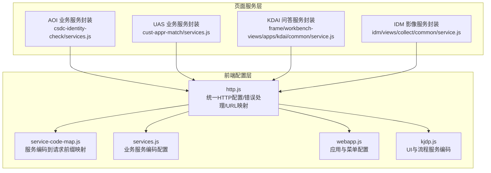
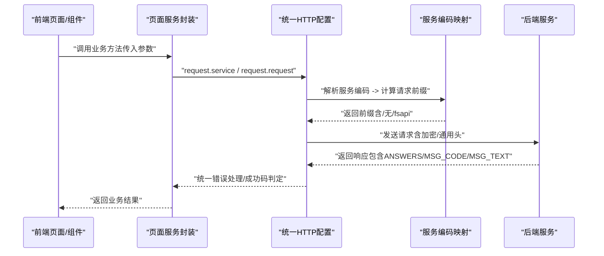
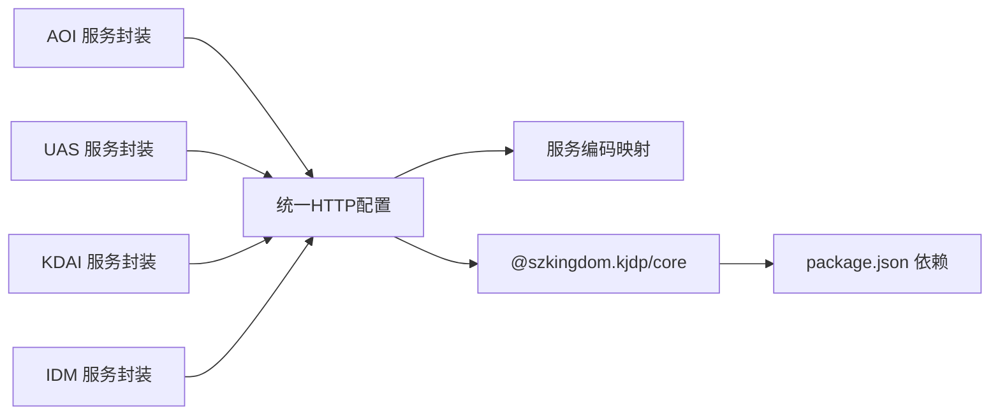

# 服务接口

<cite>
**本文引用的文件**
- [src/config/http.js](file://src/config/http.js)
- [src/config/service-code-map.js](file://src/config/service-code-map.js)
- [src/config/services.js](file://src/config/services.js)
- [src/config/webapp.js](file://src/config/webapp.js)
- [src/config/kjdp.js](file://src/config/kjdp.js)
- [src/pages/cop/modules/csdc-identity-check/services.js](file://src/pages/cop/modules/csdc-identity-check/services.js)
- [src/pages/cop/modules/cust-appr-match/services.js](file://src/pages/cop/modules/cust-appr-match/services.js)
- [src/pages/frame/workbench-views/apps/kdai/common/service.js](file://src/pages/frame/workbench-views/apps/kdai/common/service.js)
- [src/pages/idm/views/collect/common/service.js](file://src/pages/idm/views/collect/common/service.js)
- [package.json](file://package.json)
</cite>

## 目录
1. [简介](#简介)
2. [项目结构](#项目结构)
3. [核心组件](#核心组件)
4. [架构总览](#架构总览)
5. [详细组件分析](#详细组件分析)
6. [依赖关系分析](#依赖关系分析)
7. [性能考虑](#性能考虑)
8. [故障排查指南](#故障排查指南)
9. [结论](#结论)
10. [附录](#附录)

## 简介
本文件为 FS-AOI-WEB 的服务接口文档，面向前端开发者与集成方，系统性梳理后端服务调用的统一入口、认证与安全策略、请求头约定、错误处理机制，并给出典型接口调用流程与常见场景的参数说明。文档以仓库现有配置与服务封装为依据，避免臆测，确保可落地实施。

## 项目结构
FS-AOI-WEB 通过统一的 HTTP 配置与服务编码映射，集中管理服务请求前缀、加密开关、错误处理与通用请求头扩展。页面模块按功能域划分，如 AOI 业务、IDM 影像、UAS 流程等，均通过统一的 request.service/request.request 封装进行调用。

图表来源
- [src/config/http.js](file://src/config/http.js#L1-L124)
- [src/config/service-code-map.js](file://src/config/service-code-map.js#L1-L129)
- [src/config/services.js](file://src/config/services.js#L1-L28)
- [src/config/webapp.js](file://src/config/webapp.js#L1-L254)
- [src/config/kjdp.js](file://src/config/kjdp.js#L1-L59)
- [src/pages/cop/modules/csdc-identity-check/services.js](file://src/pages/cop/modules/csdc-identity-check/services.js#L1-L19)
- [src/pages/cop/modules/cust-appr-match/services.js](file://src/pages/cop/modules/cust-appr-match/services.js#L1-L19)
- [src/pages/frame/workbench-views/apps/kdai/common/service.js](file://src/pages/frame/workbench-views/apps/kdai/common/service.js#L1-L43)
- [src/pages/idm/views/collect/common/service.js](file://src/pages/idm/views/collect/common/service.js#L1-L244)

章节来源
- [src/config/http.js](file://src/config/http.js#L1-L124)
- [src/config/service-code-map.js](file://src/config/service-code-map.js#L1-L129)
- [src/config/services.js](file://src/config/services.js#L1-L28)
- [src/config/webapp.js](file://src/config/webapp.js#L1-L254)
- [src/config/kjdp.js](file://src/config/kjdp.js#L1-L59)

## 核心组件
- 统一 HTTP 配置与错误处理
  - 成功码判定：基于服务端返回的 MSG_CODE，常见为“0”“100”
  - 加密开关：fsEncrypt 控制请求是否加密
  - 错误处理：统一弹窗提示，包含 MSG_TEXT、MSG_CODE、traceId（从响应头读取）
  - 通用请求头扩展：可通过 reqCommDataExtend 注入菜单上下文
  - URL 映射：提供会话、认证、用户、上传下载等常用接口 URL
- 服务编码到请求前缀映射
  - 依据服务编码前缀自动拼接请求前缀（如 P00、D、I），并按需追加 /fsapi 后缀
  - 支持通过 sysName 参数或服务编码映射表覆盖默认前缀
  - 影像类接口固定前缀 /api/fs-idm
- 业务服务编码配置
  - 门户/菜单/字典/系统参数/省市区/机构等服务编码集中维护
  - UI 与流程相关服务编码集中维护（如流程定义、提交、校验等）
- 页面服务封装
  - 各模块通过 request.service 或 request.request 调用后端服务
  - 针对特定场景（如 IDM 影像上传）提供拦截器与响应格式化

章节来源
- [src/config/http.js](file://src/config/http.js#L27-L85)
- [src/config/service-code-map.js](file://src/config/service-code-map.js#L68-L121)
- [src/config/services.js](file://src/config/services.js#L4-L26)
- [src/config/kjdp.js](file://src/config/kjdp.js#L42-L55)

## 架构总览
下图展示了从前端调用到后端服务的整体链路，以及关键的错误处理与加密策略。

图表来源
- [src/config/http.js](file://src/config/http.js#L27-L85)
- [src/config/service-code-map.js](file://src/config/service-code-map.js#L85-L121)
- [src/pages/cop/modules/csdc-identity-check/services.js](file://src/pages/cop/modules/csdc-identity-check/services.js#L4-L6)
- [src/pages/cop/modules/cust-appr-match/services.js](file://src/pages/cop/modules/cust-appr-match/services.js#L4-L6)
- [src/pages/frame/workbench-views/apps/kdai/common/service.js](file://src/pages/frame/workbench-views/apps/kdai/common/service.js#L3-L7)
- [src/pages/idm/views/collect/common/service.js](file://src/pages/idm/views/collect/common/service.js#L17-L22)

## 详细组件分析

### 统一 HTTP 配置与错误处理
- 成功码与错误处理
  - 成功码：数组形式，常见为“0”“100”
  - 错误处理：弹窗提示，包含 MSG_TEXT、MSG_CODE、traceId（从响应头读取）
- 加密与拦截
  - fsEncrypt：控制请求是否加密
  - responseErrorInterceptor：在 KONE 环境下支持刷新令牌
- 通用请求头扩展
  - reqCommDataExtend：注入菜单上下文（F_MENU_ID/F_MENU_NAME）
- 常用 URL
  - 会话：/session/user、/session/encryptKey、/session/validateCode
  - 认证：/auth/login、/auth/logout、/auth/dynamicKey
  - 用户：/user/info
  - 上传下载：/kjdp_upload、/kjdp_download、/kjdp_delete

章节来源
- [src/config/http.js](file://src/config/http.js#L27-L85)
- [src/config/http.js](file://src/config/http.js#L100-L121)

### 服务编码到请求前缀映射
- 基础前缀规则
  - P00 开头：基于 getReqBase 返回前缀并追加 /fsapi
  - D 开头：固定 /api/fs-idm/fsapi
  - I 开头：固定 /api/fs-isc/fsapi
  - 其他：优先查服务编码映射表；若命中则追加 /fsapi；否则按 getReqBase 推导
- 特殊接口
  - job/list、job/add、job/update、job/delete、job/pause、job/resume、scheduleFlow/query、scheduleFlow/delete 不追加 /fsapi
- 影像前缀
  - 影像相关接口统一使用 /api/fs-idm

章节来源
- [src/config/service-code-map.js](file://src/config/service-code-map.js#L68-L121)
- [src/config/service-code-map.js](file://src/config/service-code-map.js#L124-L126)

### 业务服务编码配置
- 门户/菜单/常用菜单/字典/系统参数/省市区/机构等服务编码集中维护
- UI 与流程服务编码集中维护（如流程定义、提交、校验等）

章节来源
- [src/config/services.js](file://src/config/services.js#L4-L26)
- [src/config/kjdp.js](file://src/config/kjdp.js#L42-L55)

### 页面服务封装与调用示例

#### AOI 业务服务封装（身份核查、中登扩展查询等）
- 方法示例
  - isAcceptCheckTime(data): 请求编码 P001003825
  - getCustIdentityValidResult(data): 请求编码 YG210418
  - qryCsdcExtend(data, config): 请求编码 Y3000005
  - getOrgIdentityValidResult(data, config): 请求编码 YG210423
- 调用流程
  - 通过 request.service(serviceCode, data) 发送请求
  - 统一由 http.js 进行加密、成功码判定与错误处理

章节来源
- [src/pages/cop/modules/csdc-identity-check/services.js](file://src/pages/cop/modules/csdc-identity-check/services.js#L1-L19)
- [src/config/http.js](file://src/config/http.js#L27-L85)

#### UAS 业务服务封装（通用 LBM 调用、匹配与问卷等）
- 方法示例
  - commomLbmCall(data): 请求编码 Y3000001
  - qryInvestorSource(data): 请求编码 Y1192198
  - qryCustMatchData(data): 请求编码 Y1100140
  - qryCustSurveyData(data): 请求编码 YG003667
- 调用流程
  - 通过 request.service(serviceCode, data) 发送请求
  - 统一由 http.js 进行加密、成功码判定与错误处理

章节来源
- [src/pages/cop/modules/cust-appr-match/services.js](file://src/pages/cop/modules/cust-appr-match/services.js#L1-L19)
- [src/config/http.js](file://src/config/http.js#L27-L85)

#### KDAI 问答服务封装（消息发送、历史查询、问题详情等）
- 方法示例
  - sendMessage(params): 请求编码 D9999998
  - updateQuestionStatus(params): 请求编码 D9999100
  - fetchHistory(): 请求编码 D9999113
  - fetchQuestionDetail(serialNum): 请求编码 D9999114
  - updateQuestionTitle(params): 请求编码 D9999115
  - deleteQuestion(serialNum): 请求编码 D9999116
- 调用流程
  - 通过 sendRquest(serviceCode, params) -> request.service(serviceCode, params)
  - 统一由 http.js 进行加密、成功码判定与错误处理

章节来源
- [src/pages/frame/workbench-views/apps/kdai/common/service.js](file://src/pages/frame/workbench-views/apps/kdai/common/service.js#L1-L43)
- [src/config/http.js](file://src/config/http.js#L27-L85)

#### IDM 影像服务封装（上传、下载、保存、删除、进度查询等）
- 方法示例
  - requestIDM(service, args): 通用调用（内部将 data0 提取为返回值）
  - buildControllerInterface(url, args, full): 构建控制器接口 URL（前缀 /api/fs-idm）
  - getDownloadFilePath(imgData): 生成下载文件路径
  - uploadFileFication(fileData, busiData, clsData): 智能分拣上传
  - uploadImageFile(fileData, args): 普通上传
  - getImageData(imgSNO): 查询影像数据
  - uploadImageData(params): 更新影像数据
  - deletImageData(params): 删除影像
  - saveImageData(params): 保存影像数据
  - getUploadProgress(opts): 查询上传进度
  - saveKimdBusiData(busiData): 保存或更新业务数据，返回 B_SNO
  - getImageClassByBusi(busiData): 根据业务获取所需采集的影像类别
  - getBusiVoiceDef(params): 获取语音模板定义
  - imageMultiplexing(params): 影像复用
  - getMultipFramesImage(params): 获取多帧影像
  - getSignVideoData(busiImgData): 获取签名无纸化视频数据
  - getAllowAddImgClsData(): 获取可添加的影像类别
- 调用流程
  - 通过 request.service 或 request.request 发送请求
  - 影像接口统一走 /api/fs-idm 前缀
  - 上传场景通过 requestInterceptor 设置 multipart/form-data

章节来源
- [src/pages/idm/views/collect/common/service.js](file://src/pages/idm/views/collect/common/service.js#L1-L244)
- [src/config/service-code-map.js](file://src/config/service-code-map.js#L124-L126)

## 依赖关系分析
- 组件耦合
  - 页面服务封装依赖统一 HTTP 配置与服务编码映射
  - 影像模块显式使用 /api/fs-idm 前缀，降低与其他模块耦合
- 外部依赖
  - @szkingdom.kjdp/core 提供 request.service/request.request
  - 项目运行依赖 Vue3、Pinia、Vue Router 等

图表来源
- [src/pages/cop/modules/csdc-identity-check/services.js](file://src/pages/cop/modules/csdc-identity-check/services.js#L1-L2)
- [src/pages/cop/modules/cust-appr-match/services.js](file://src/pages/cop/modules/cust-appr-match/services.js#L1-L2)
- [src/pages/frame/workbench-views/apps/kdai/common/service.js](file://src/pages/frame/workbench-views/apps/kdai/common/service.js#L1-L2)
- [src/pages/idm/views/collect/common/service.js](file://src/pages/idm/views/collect/common/service.js#L1-L5)
- [src/config/http.js](file://src/config/http.js#L1-L4)
- [package.json](file://package.json#L17-L40)

章节来源
- [src/pages/cop/modules/csdc-identity-check/services.js](file://src/pages/cop/modules/csdc-identity-check/services.js#L1-L2)
- [src/pages/cop/modules/cust-appr-match/services.js](file://src/pages/cop/modules/cust-appr-match/services.js#L1-L2)
- [src/pages/frame/workbench-views/apps/kdai/common/service.js](file://src/pages/frame/workbench-views/apps/kdai/common/service.js#L1-L2)
- [src/pages/idm/views/collect/common/service.js](file://src/pages/idm/views/collect/common/service.js#L1-L5)
- [src/config/http.js](file://src/config/http.js#L1-L4)
- [package.json](file://package.json#L17-L40)

## 性能考虑
- 请求加密与网络开销
  - fsEncrypt 开启会增加加密处理与传输体积，建议仅在敏感接口开启
- 超时与重试
  - 当前未在统一配置中设置 axios timeout，建议在业务侧按接口特性补充
- 上传大文件
  - 影像上传采用 multipart/form-data，建议结合断点续传策略与进度上报
- 成功码判定
  - 建议在业务侧明确区分“0”“100”的语义差异，避免误判

## 故障排查指南
- 常见错误定位步骤
  - 查看弹窗提示中的 MSG_TEXT、MSG_CODE、traceId（从响应头读取）
  - 核对服务编码是否正确，确认请求前缀是否符合预期
  - 检查 reqCommDataExtend 注入的菜单上下文是否缺失
- 会话过期与令牌刷新
  - 在 KONE 环境下，响应异常时会尝试刷新令牌
- 上传失败
  - 确认 requestInterceptor 中 Content-Type 已设置为 multipart/form-data
  - 确认文件数据格式与后端期望一致

章节来源
- [src/config/http.js](file://src/config/http.js#L6-L25)
- [src/config/http.js](file://src/config/http.js#L43-L45)
- [src/pages/idm/views/collect/common/service.js](file://src/pages/idm/views/collect/common/service.js#L50-L65)

## 结论
FS-AOI-WEB 通过统一的 HTTP 配置与服务编码映射，实现了跨模块的一致化服务调用体验。开发者只需关注业务服务编码与参数构造，即可通过 request.service/request.request 完成与后端的交互。建议在实际开发中：
- 明确各接口的加密需求，合理开启 fsEncrypt
- 严格校验服务编码与请求前缀，避免路径错误
- 在业务侧完善超时与重试策略，提升稳定性
- 遇到异常时优先查看 MSG_CODE/MSG_TEXT/traceId，快速定位问题

## 附录

### 接口调用示例与参数说明（以模块为单位）

#### AOI 业务
- isAcceptCheckTime(data)
  - 说明：业务资源受理时间片检查
  - 服务编码：P001003825
  - 参数：由调用方传入业务参数对象
  - 返回：服务端返回的 ANSWERS[0] 数据
- getCustIdentityValidResult(data)
  - 说明：查询本地已有的客户身份信息验证结果
  - 服务编码：YG210418
  - 参数：由调用方传入业务参数对象
  - 返回：服务端返回的 ANSWERS[0] 数据
- qryCsdcExtend(data, config)
  - 说明：中登扩展查询
  - 服务编码：Y3000005
  - 参数：data（业务参数）、config（请求配置）
  - 返回：服务端返回的 ANSWERS[0] 数据
- getOrgIdentityValidResult(data, config)
  - 说明：中登账户业务查询（机构信息核查）
  - 服务编码：YG210423
  - 参数：data（业务参数）、config（请求配置）
  - 返回：服务端返回的 ANSWERS[0] 数据

章节来源
- [src/pages/cop/modules/csdc-identity-check/services.js](file://src/pages/cop/modules/csdc-identity-check/services.js#L4-L18)

#### UAS 业务
- commomLbmCall(data)
  - 说明：通用调用 LBm 查询功能
  - 服务编码：Y3000001
  - 参数：由调用方传入业务参数对象
  - 返回：服务端返回的 ANSWERS[0] 数据
- qryInvestorSource(data)
  - 说明：专业投资者资料结果查询
  - 服务编码：Y1192198
  - 参数：由调用方传入业务参数对象
  - 返回：服务端返回的 ANSWERS[0] 数据
- qryCustMatchData(data)
  - 说明：获取客户匹配信息
  - 服务编码：Y1100140
  - 参数：由调用方传入业务参数对象
  - 返回：服务端返回的 ANSWERS[0] 数据
- qryCustSurveyData(data)
  - 说明：获取客户风险测评题结果
  - 服务编码：YG003667
  - 参数：由调用方传入业务参数对象
  - 返回：服务端返回的 ANSWERS[0] 数据

章节来源
- [src/pages/cop/modules/cust-appr-match/services.js](file://src/pages/cop/modules/cust-appr-match/services.js#L4-L18)

#### KDAI 问答
- sendMessage(params)
  - 说明：发送消息
  - 服务编码：D9999998
  - 参数：ANSWER_DATA、SERIAL_NUMBER
  - 返回：ANSWERS[0] 的第一条记录
- updateQuestionStatus(params)
  - 说明：更新问题状态
  - 服务编码：D9999100
  - 参数：DETAIL_ID、STATE
  - 返回：ANSWERS[0] 的第一条记录
- fetchHistory()
  - 说明：查询所有历史记录
  - 服务编码：D9999113
  - 参数：无
  - 返回：ANSWERS[0] 的全部记录
- fetchQuestionDetail(serialNum)
  - 说明：查询问题详情
  - 服务编码：D9999114
  - 参数：SERIAL_NUMBER
  - 返回：ANSWERS[0] 的详情
- updateQuestionTitle(params)
  - 说明：更新问题标题
  - 服务编码：D9999115
  - 参数：SERIAL_NUMBER、TITLE
  - 返回：ANSWERS[0] 的结果
- deleteQuestion(serialNum)
  - 说明：删除指定问题
  - 服务编码：D9999116
  - 参数：SERIAL_NUMBER
  - 返回：ANSWERS[0] 的结果

章节来源
- [src/pages/frame/workbench-views/apps/kdai/common/service.js](file://src/pages/frame/workbench-views/apps/kdai/common/service.js#L9-L42)

#### IDM 影像
- requestIDM(service, args)
  - 说明：通用调用影像服务（内部提取 data0）
  - 服务编码：由调用方传入
  - 参数：SERVICE_CODE 与业务参数
  - 返回：data0
- buildControllerInterface(url, args, full)
  - 说明：构建控制器接口 URL（前缀 /api/fs-idm）
  - 参数：url、args、full（是否包含协议与主机）
  - 返回：拼接后的完整 URL
- getDownloadFilePath(imgData)
  - 说明：生成下载文件路径
  - 参数：IMG_CLS、RELA_IMG_CLS、B_SNO 或 IMG_SN、PAGE_NUM
  - 返回：下载 URL
- uploadFileFication(fileData, busiData, clsData)
  - 说明：智能分拣上传
  - 参数：fileData、busiData（含 B_SNO、ORG_CODE、BUSI_CODE、USER_TYPE、KIDM_SNO、IMG_CLSS 等）
  - 返回：上传结果
- uploadImageFile(fileData, args)
  - 说明：普通上传影像文件
  - 参数：fileData、args（含 CUST_CODE、KIDM_SNO、ORG_CODE、OP_CODE、IMG_CLS 等）
  - 返回：上传结果
- getImageData(imgSNO)
  - 说明：查询影像数据
  - 服务编码：D1001568
  - 参数：B_SNO
  - 返回：影像数据
- uploadImageData(params)
  - 说明：更新影像数据（类别及位置）
  - 服务编码：D1000639
  - 参数：OLD_IMG_CLS、NEW_IMG_CLS、OLD_PAGE_NUM、NEW_PAGE_NUM、B_SNO 等
  - 返回：更新结果
- deletImageData(params)
  - 说明：删除影像
  - 服务编码：D1000553
  - 参数：IMG_SN、PAGE_NUM、B_SNO
  - 返回：删除结果
- saveImageData(params)
  - 说明：保存影像数据
  - 服务编码：D1000602
  - 参数：KIDM_SNO、BUSI_CODE、IMG_SN、SYS_CUST_NO、CUST_NAME、ID_TYPE、IMG_CLS、IMG_FMT、OP_USER、OP_USER_CODE、OP_USER_NAME、ORG_CODE、ID_CARD、BUSI_DETAIL、SYS_CODE、RELA_IMG_CLS、OP_SITE、USER_TYPE、OBJECT_STORAGE_ID、OBJECT_STORAGE_POLICY、IS_DEFINED_CLS、PAGE_NUM、IS_SAVE_PDF_FILE、IMG_DATA、CHANNEL、RELA_PATH
  - 返回：保存结果
- getUploadProgress(opts)
  - 说明：查询上传进度
  - 服务编码：D9900012
  - 参数：KIDM_SNO、IMG_CLS、RELA_IMG_CLS
  - 返回：进度信息
- saveKimdBusiData(busiData)
  - 说明：保存或更新业务数据，返回 B_SNO
  - 服务编码：D1000596
  - 参数：业务参数（含 ACCEPT_PARAM、ID_CARD、CHANNEL、SYS_CODE 等）
  - 返回：B_SNO
- getImageClassByBusi(busiData)
  - 说明：根据业务获取所需采集的影像类别
  - 服务编码：P001002041
  - 参数：B_SNO、BUSI_SCOPE、DB_SOURCE
  - 返回：影像类别列表
- getBusiVoiceDef(params)
  - 说明：获取语音模板定义
  - 服务编码：YG003954
  - 参数：BUSI_CODE、ORG_CODE、USER_TYPE、CUST_CODE、OPEN_TYPE、B_SNO、CURR_B_SNO（为空）
  - 返回：语音模板定义
- imageMultiplexing(params)
  - 说明：影像复用
  - 服务编码：D1000569
  - 参数：IMG_CLS、BUSI_CODE、B_SNO、CHANNEL、ORG_CODE、CUST_NAME、ID_TYPE、ID_CARD、SYS_CODE、BUSI_DETAIL、CHANNEL
  - 返回：复用结果
- getMultipFramesImage(params)
  - 说明：获取多帧影像
  - 服务编码：D1000552
  - 参数：IMG_SN
  - 返回：多帧影像数据
- getSignVideoData(busiImgData)
  - 说明：获取签名无纸化视频数据
  - 服务编码：D1000592
  - 参数：B_SNO、IMG_CLS（固定为 0bs）、RELA_IMG_CLS
  - 返回：视频数据
- getAllowAddImgClsData()
  - 说明：获取可添加的影像类别
  - 服务编码：D1000711
  - 参数：IS_DEFINED_CLS（固定为 1）
  - 返回：影像类别列表

章节来源
- [src/pages/idm/views/collect/common/service.js](file://src/pages/idm/views/collect/common/service.js#L17-L244)

### 认证与请求头约定
- 认证方式
  - 登录：POST /auth/login
  - 登出：GET /auth/logout?isRedirect=false
  - 动态密钥：GET /auth/dynamicKey
- 请求头
  - 通用头扩展：F_MENU_ID、F_MENU_NAME（由 reqCommDataExtend 注入）
  - 上传场景：multipart/form-data（由 requestInterceptor 设置）
- 错误处理
  - 统一弹窗提示，包含 MSG_TEXT、MSG_CODE、traceId（从响应头读取）

章节来源
- [src/config/http.js](file://src/config/http.js#L100-L121)
- [src/config/http.js](file://src/config/http.js#L69-L75)
- [src/config/http.js](file://src/config/http.js#L57-L68)

### 状态码与成功判定
- 成功码：数组形式，常见为“0”“100”
- 失败时：弹窗提示 MSG_TEXT，同时记录 MSG_CODE 与 traceId

章节来源
- [src/config/http.js](file://src/config/http.js#L28-L28)
- [src/config/http.js](file://src/config/http.js#L6-L25)