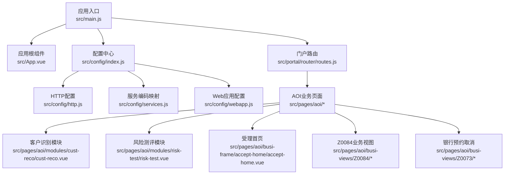
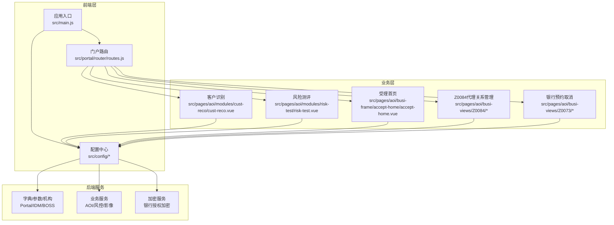
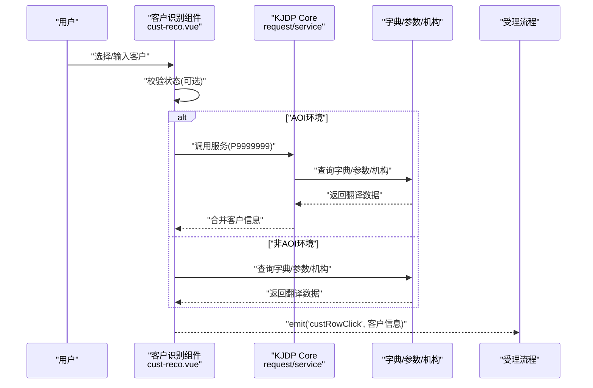
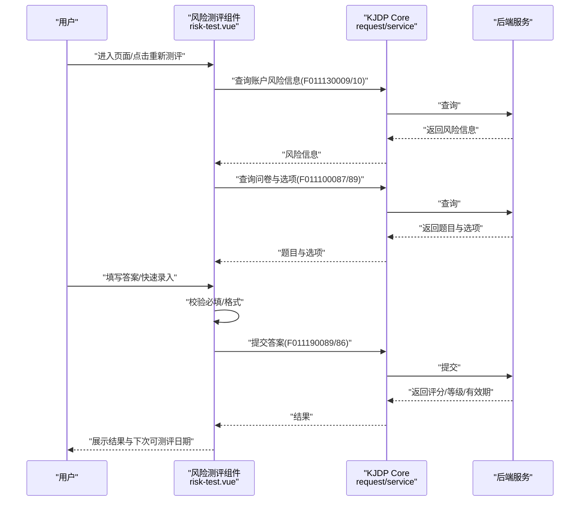
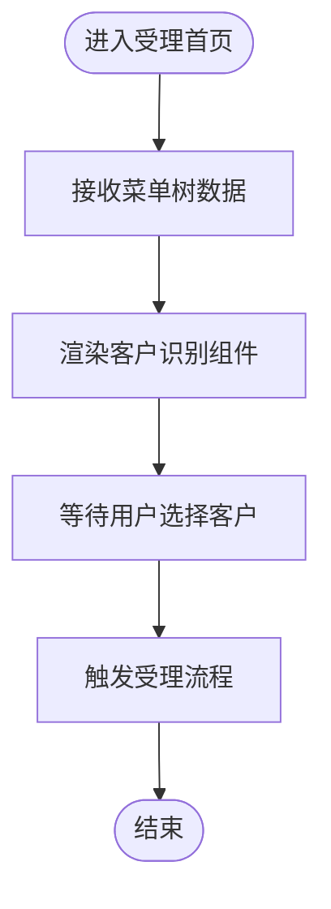
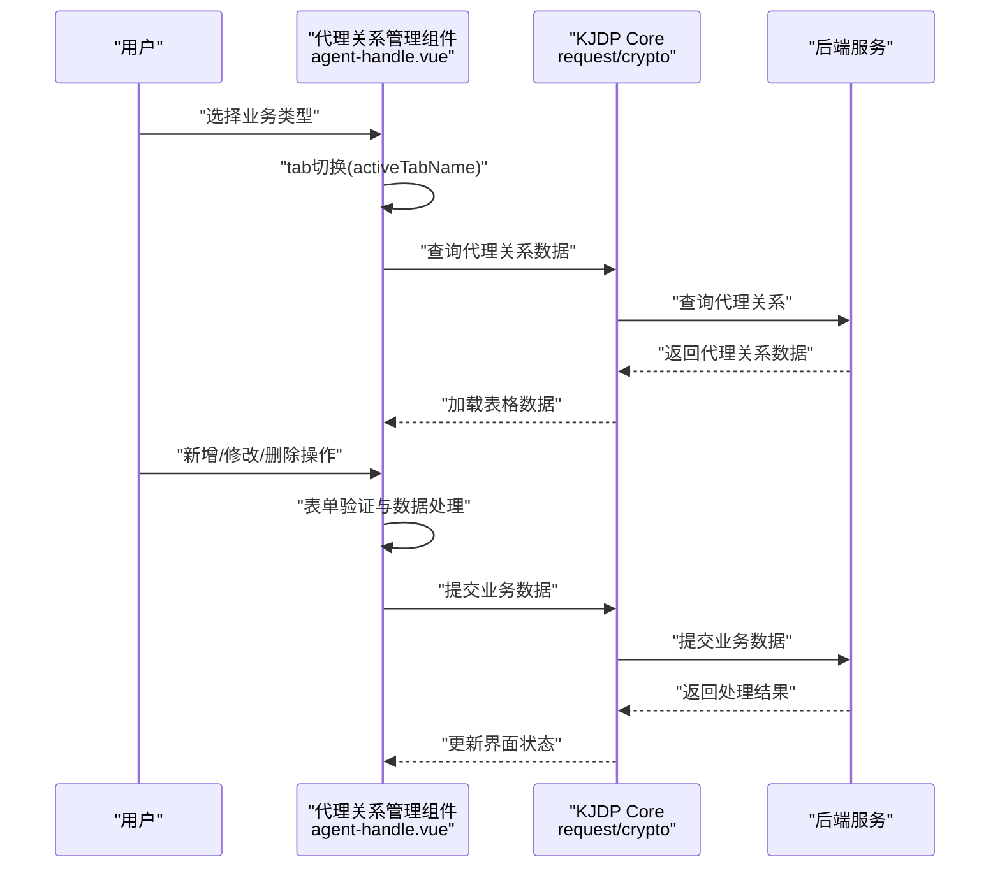
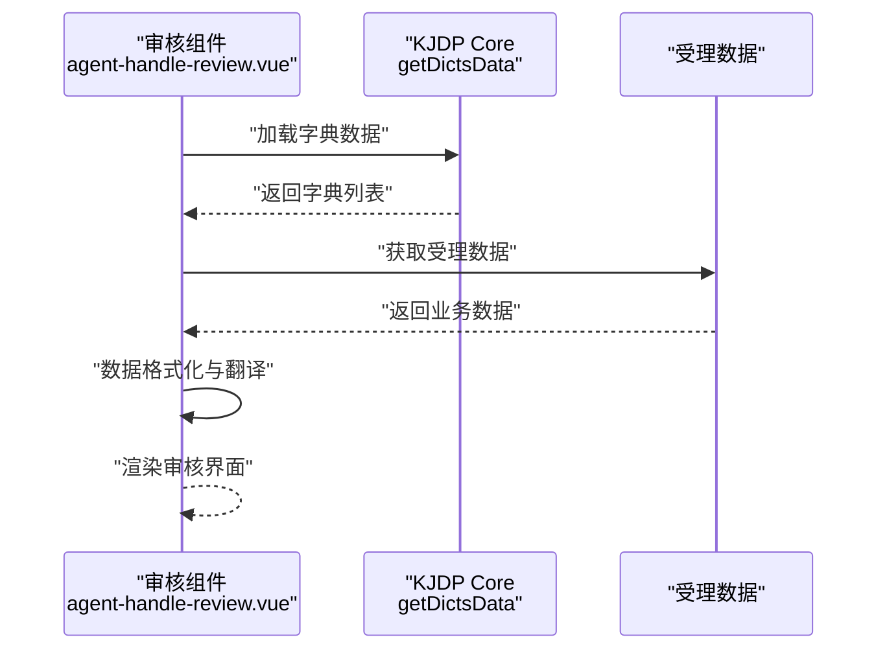
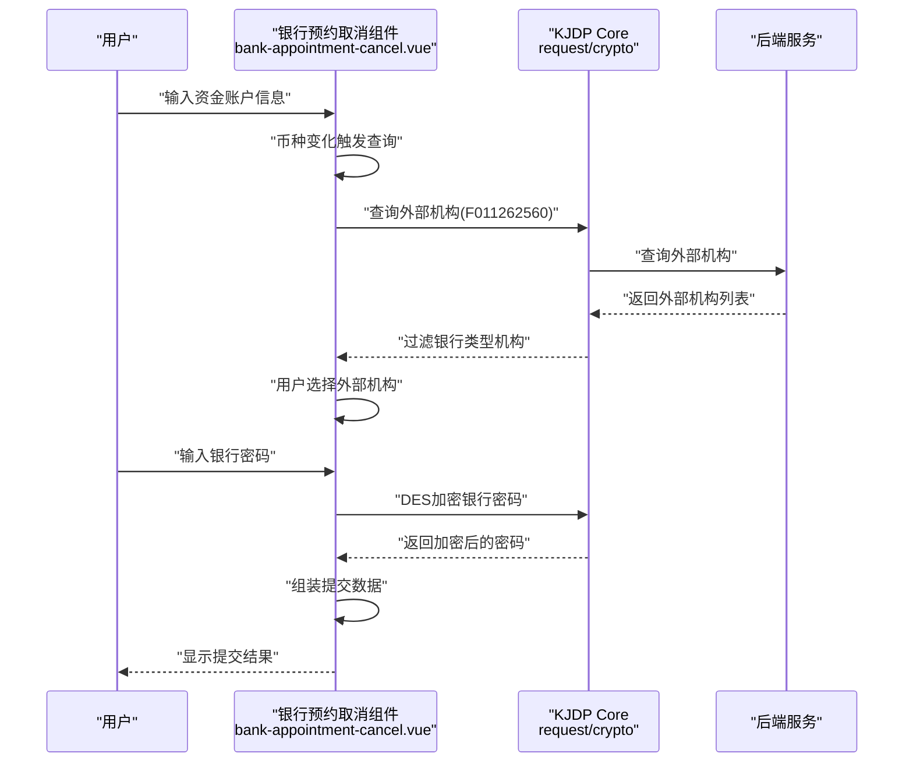
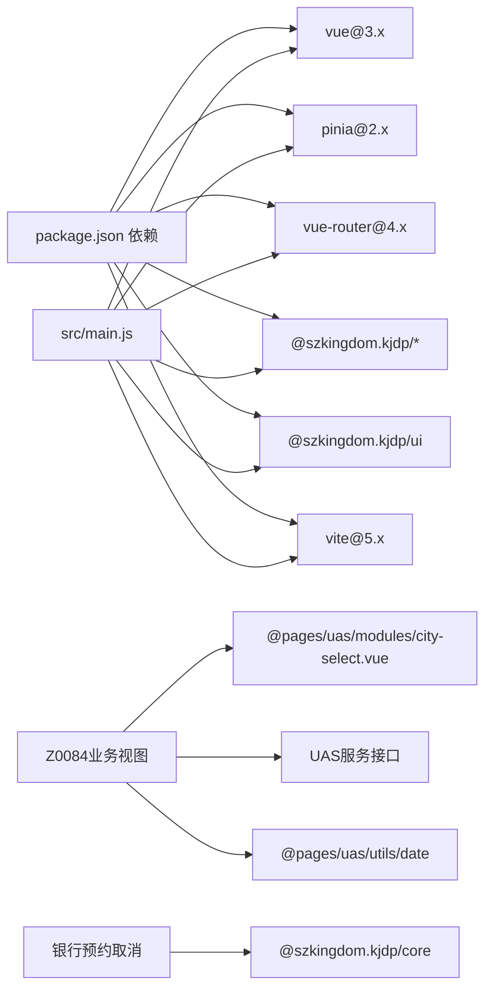

# 业务受理系统(AOI)

<cite>
**本文引用的文件**
- [README.md](file://README.md)
- [package.json](file://package.json)
- [src/main.js](file://src/main.js)
- [src/App.vue](file://src/App.vue)
- [src/config/index.js](file://src/config/index.js)
- [src/config/http.js](file://src/config/http.js)
- [src/config/services.js](file://src/config/services.js)
- [src/config/webapp.js](file://src/config/webapp.js)
- [src/portal/router/routes.js](file://src/portal/router/routes.js)
- [src/pages/aoi/modules/cust-reco/cust-reco.vue](file://src/pages/aoi/modules/cust-reco/cust-reco.vue)
- [src/pages/aoi/modules/risk-test/risk-test.vue](file://src/pages/aoi/modules/risk-test/risk-test.vue)
- [src/pages/aoi/busi-frame/accept-home/accept-home.vue](file://src/pages/aoi/busi-frame/accept-home/accept-home.vue)
- [src/pages/aoi/busi-views/busi-view-config.js](file://src/pages/aoi/busi-views/busi-view-config.js)
- [src/pages/aoi/busi-views/Z0084/accept/agent-handle.vue](file://src/pages/aoi/busi-views/Z0084/accept/agent-handle.vue)
- [src/pages/aoi/busi-views/Z0084/review/agent-handle-review.vue](file://src/pages/aoi/busi-views/Z0084/review/agent-handle-review.vue)
- [src/pages/aoi/busi-views/Z0073/accept/bank-appointment-cancel.vue](file://src/pages/aoi/busi-views/Z0073/accept/bank-appointment-cancel.vue)
- [src/pages/aoi/busi-views/Z0073/review/bank-appointment-cancel-review.vue](file://src/pages/aoi/busi-views/Z0073/review/bank-appointment-cancel-review.vue)
</cite>

## 更新摘要
**所做更改**
- 新增Z0084股票期权代理关系管理系统章节，包含接受和审核两个业务视图组件
- 更新银行预约取消流程章节，增加组织过滤和银行授权加密功能
- 扩展业务视图配置章节，添加新的业务类型支持
- 更新架构图和组件关系图，反映新增的业务功能

## 目录
1. [简介](#简介)
2. [项目结构](#项目结构)
3. [核心组件](#核心组件)
4. [架构总览](#架构总览)
5. [详细组件分析](#详细组件分析)
6. [新增业务功能](#新增业务功能)
7. [依赖关系分析](#依赖关系分析)
8. [性能考量](#性能考量)
9. [故障排查指南](#故障排查指南)
10. [结论](#结论)
11. [附录](#附录)

## 简介
本技术文档面向FS-AOI-WEB业务受理系统，围绕AOI业务架构、核心功能与实现原理展开，重点覆盖客户识别、业务流程处理、影像采集、风险控制等关键模块。文档解释系统与后端服务的集成方式、数据流转与业务逻辑处理，提供不同业务类型的处理流程、配置管理与权限控制机制说明，并给出具体业务场景示例与实现细节，帮助开发者理解与扩展业务功能。

**更新** 新增Z0084股票期权代理关系管理系统和银行预约取消流程的安全增强功能。

## 项目结构
AOI前端采用Vue 3 + Vite构建，基于KJDP前端框架与UI组件库，通过统一的配置中心对接门户、菜单、字典、系统参数等后端能力。应用入口在src/main.js中初始化Pinia、KJDP Core与UI，并挂载路由与应用实例。路由体系由portal模块负责，AOI业务页面位于src/pages/aoi目录，包含受理首页、客户识别、风险测评、业务视图等模块。

**图表来源**
- [src/main.js:1-40](file://src/main.js#L1-L40)
- [src/App.vue:1-8](file://src/App.vue#L1-L8)
- [src/config/index.js:1-8](file://src/config/index.js#L1-L8)
- [src/config/http.js:1-124](file://src/config/http.js#L1-L124)
- [src/config/services.js:1-28](file://src/config/services.js#L1-L28)
- [src/config/webapp.js:1-254](file://src/config/webapp.js#L1-L254)
- [src/portal/router/routes.js:1-78](file://src/portal/router/routes.js#L1-L78)
- [src/pages/aoi/modules/cust-reco/cust-reco.vue:1-195](file://src/pages/aoi/modules/cust-reco/cust-reco.vue#L1-L195)
- [src/pages/aoi/modules/risk-test/risk-test.vue:1-592](file://src/pages/aoi/modules/risk-test/risk-test.vue#L1-L592)
- [src/pages/aoi/busi-frame/accept-home/accept-home.vue:1-19](file://src/pages/aoi/busi-frame/accept-home/accept-home.vue#L1-L19)
- [src/pages/aoi/busi-views/Z0084/accept/agent-handle.vue:1-800](file://src/pages/aoi/busi-views/Z0084/accept/agent-handle.vue#L1-L800)
- [src/pages/aoi/busi-views/Z0073/accept/bank-appointment-cancel.vue:1-105](file://src/pages/aoi/busi-views/Z0073/accept/bank-appointment-cancel.vue#L1-L105)

**章节来源**
- [README.md:1-55](file://README.md#L1-L55)
- [package.json:1-61](file://package.json#L1-L61)
- [src/main.js:1-40](file://src/main.js#L1-L40)
- [src/App.vue:1-8](file://src/App.vue#L1-L8)
- [src/config/index.js:1-8](file://src/config/index.js#L1-L8)
- [src/config/http.js:1-124](file://src/config/http.js#L1-L124)
- [src/config/services.js:1-28](file://src/config/services.js#L1-L28)
- [src/config/webapp.js:1-254](file://src/config/webapp.js#L1-L254)
- [src/portal/router/routes.js:1-78](file://src/portal/router/routes.js#L1-L78)

## 核心组件
- 应用入口与初始化：创建Vue应用、注册Pinia、安装KJDP Core与UI、设置错误处理回调、按需挂载路由并挂载到DOM。
- 配置中心：集中导出HTTP配置、服务编码、Web应用配置与常量，供各模块按需使用。
- 门户路由：动态扫描pages目录，按portal配置组装路由树，支持登录页、门户布局、签名校验与采集界面等。
- AOI业务模块：
  - 客户识别：支持查询条件、客户状态校验、组织机构翻译、客户信息描述展示与事件透传。
  - 风险测评：支持快速录入、题目加载、答案校验、提交评分、结果展示与重新测评。
  - 受理首页：承载客户识别入口与菜单树数据注入。
  - **Z0084股票期权代理关系管理**：提供代理关系查询、代理账户业务设置、代理基金业务设置、代理交易业务设置和股票期权代理关系管理。
  - **银行预约取消**：增强组织过滤和银行授权加密功能，提升安全性。

**章节来源**
- [src/main.js:1-40](file://src/main.js#L1-L40)
- [src/config/index.js:1-8](file://src/config/index.js#L1-L8)
- [src/portal/router/routes.js:1-78](file://src/portal/router/routes.js#L1-L78)
- [src/pages/aoi/modules/cust-reco/cust-reco.vue:1-195](file://src/pages/aoi/modules/cust-reco/cust-reco.vue#L1-L195)
- [src/pages/aoi/modules/risk-test/risk-test.vue:1-592](file://src/pages/aoi/modules/risk-test/risk-test.vue#L1-L592)
- [src/pages/aoi/busi-frame/accept-home/accept-home.vue:1-19](file://src/pages/aoi/busi-frame/accept-home/accept-home.vue#L1-L19)
- [src/pages/aoi/busi-views/Z0084/accept/agent-handle.vue:1-800](file://src/pages/aoi/busi-views/Z0084/accept/agent-handle.vue#L1-L800)
- [src/pages/aoi/busi-views/Z0073/accept/bank-appointment-cancel.vue:1-105](file://src/pages/aoi/busi-views/Z0073/accept/bank-appointment-cancel.vue#L1-L105)

## 架构总览
AOI系统采用"门户路由 + 业务页面 + 统一配置"的分层架构。前端通过KJDP Core发起服务请求，HTTP配置统一处理加密、错误提示、请求头扩展与安全网关适配；Web应用配置提供菜单映射、URL格式化、主题与页签策略等；AOI业务模块按需调用字典、系统参数与组织机构数据，完成客户识别与风险控制等关键流程。

**图表来源**
- [src/main.js:1-40](file://src/main.js#L1-L40)
- [src/portal/router/routes.js:1-78](file://src/portal/router/routes.js#L1-L78)
- [src/config/index.js:1-8](file://src/config/index.js#L1-L8)
- [src/pages/aoi/modules/cust-reco/cust-reco.vue:1-195](file://src/pages/aoi/modules/cust-reco/cust-reco.vue#L1-L195)
- [src/pages/aoi/modules/risk-test/risk-test.vue:1-592](file://src/pages/aoi/modules/risk-test/risk-test.vue#L1-L592)
- [src/pages/aoi/busi-frame/accept-home/accept-home.vue:1-19](file://src/pages/aoi/busi-frame/accept-home/accept-home.vue#L1-L19)
- [src/pages/aoi/busi-views/Z0084/accept/agent-handle.vue:1-800](file://src/pages/aoi/busi-views/Z0084/accept/agent-handle.vue#L1-L800)
- [src/pages/aoi/busi-views/Z0073/accept/bank-appointment-cancel.vue:1-105](file://src/pages/aoi/busi-views/Z0073/accept/bank-appointment-cancel.vue#L1-L105)

## 详细组件分析

### 客户识别模块（cust-reco）
职责与流程
- 提供客户查询输入组件与结果展示，支持状态校验、组织机构翻译与客户信息描述。
- 根据系统环境决定是否调用后端服务补充客户信息，随后对关键字段进行字典翻译与机构全称解析。
- 将最终客户信息通过事件向上抛出，供受理流程使用。

**图表来源**
- [src/pages/aoi/modules/cust-reco/cust-reco.vue:32-79](file://src/pages/aoi/modules/cust-reco/cust-reco.vue#L32-L79)
- [src/config/http.js:27-85](file://src/config/http.js#L27-L85)

**章节来源**
- [src/pages/aoi/modules/cust-reco/cust-reco.vue:1-195](file://src/pages/aoi/modules/cust-reco/cust-reco.vue#L1-L195)

### 风险测评模块（risk-test）
职责与流程
- 支持快速录入与详细答题两种模式，自动同步答案模型。
- 加载测评试卷与选项，提交后返回评分、风险等级、有效期与下次可测评日期。
- 根据账户或客户+问卷参数加载上次测评记录，控制重新测评按钮显隐。

**图表来源**
- [src/pages/aoi/modules/risk-test/risk-test.vue:151-374](file://src/pages/aoi/modules/risk-test/risk-test.vue#L151-L374)
- [src/config/http.js:27-85](file://src/config/http.js#L27-L85)

**章节来源**
- [src/pages/aoi/modules/risk-test/risk-test.vue:1-592](file://src/pages/aoi/modules/risk-test/risk-test.vue#L1-L592)

### 受理首页（accept-home）
职责与流程
- 作为AOI受理入口，注入菜单树数据，承载客户识别组件，引导用户进入具体业务受理流程。

**图表来源**
- [src/pages/aoi/busi-frame/accept-home/accept-home.vue:1-19](file://src/pages/aoi/busi-frame/accept-home/accept-home.vue#L1-L19)

**章节来源**
- [src/pages/aoi/busi-frame/accept-home/accept-home.vue:1-19](file://src/pages/aoi/busi-frame/accept-home/accept-home.vue#L1-L19)

### 业务视图配置（busi-view-config）
职责与流程
- 提供受理流程初始化时的公共数据，需要尽量精简以避免影响整个流程组件的性能效率。
- 支持新增业务类型的配置扩展。

**章节来源**
- [src/pages/aoi/busi-views/busi-view-config.js:1-5](file://src/pages/aoi/busi-views/busi-view-config.js#L1-L5)

## 新增业务功能

### Z0084股票期权代理关系管理系统

#### 接受视图组件（agent-handle）
职责与流程
- 提供股票期权代理关系的完整管理功能，包括代理关系查询、代理账户业务设置、代理基金业务设置、代理交易业务设置和股票期权代理关系管理。
- 支持多标签页操作：代理关系、代理账户业务、代理资金业务、代理交易业务和股票期权代理关系。
- 实现数据表格的增删改查操作，支持批量操作和单行操作。
- 集成银行授权加密功能，确保敏感数据的安全传输。

**图表来源**
- [src/pages/aoi/busi-views/Z0084/accept/agent-handle.vue:64-309](file://src/pages/aoi/busi-views/Z0084/accept/agent-handle.vue#L64-L309)
- [src/pages/aoi/busi-views/Z0084/accept/agent-handle.vue:481-587](file://src/pages/aoi/busi-views/Z0084/accept/agent-handle.vue#L481-L587)

核心功能特性
- **多业务类型支持**：支持代理人资料变更、代理人销户、代理客户业务设置、股票期权代理关系设置四种业务类型。
- **表格操作增强**：支持行样式标记（待删除标红、待修改标黄）、批量选择、双击行进入修改模式。
- **数据验证**：实现开始日期与结束日期的相互验证，确保业务数据的有效性。
- **机构一致性检查**：确保代理人与客户必须属于同一机构，提升业务合规性。

#### 审核视图组件（agent-handle-review）
职责与流程
- 提供业务数据的审核展示功能，支持四种业务类型的差异化展示。
- 实现字典数据的动态翻译，包括业务操作类型、用户角色、业务类型等。
- 支持股票期权代理关系的特殊展示，包括期权业务类型和测试通过标识。

**图表来源**
- [src/pages/aoi/busi-views/Z0084/review/agent-handle-review.vue:147-168](file://src/pages/aoi/busi-views/Z0084/review/agent-handle-review.vue#L147-L168)

**章节来源**
- [src/pages/aoi/busi-views/Z0084/accept/agent-handle.vue:1-800](file://src/pages/aoi/busi-views/Z0084/accept/agent-handle.vue#L1-L800)
- [src/pages/aoi/busi-views/Z0084/review/agent-handle-review.vue:1-312](file://src/pages/aoi/busi-views/Z0084/review/agent-handle-review.vue#L1-L312)

### 银行预约取消流程增强

#### 接受视图组件（bank-appointment-cancel）
职责与流程
- 增强银行预约取消流程的安全性，实现组织过滤和银行授权加密功能。
- 支持外部组织银行类型验证，确保只能选择银行类型的外部机构。
- 实现银行密码的加密传输，保护客户敏感信息安全。

**图表来源**
- [src/pages/aoi/busi-views/Z0073/accept/bank-appointment-cancel.vue:24-78](file://src/pages/aoi/busi-views/Z0073/accept/bank-appointment-cancel.vue#L24-L78)

核心安全增强功能
- **组织过滤**：通过P000000200接口查询银行类型机构，只允许选择银行类型的外部组织。
- **银行授权加密**：使用DES算法对银行密码进行加密，确保传输过程中的数据安全。
- **动态数据加载**：根据币种变化动态查询外部机构，提升用户体验。

#### 审核视图组件（bank-appointment-cancel-review）
职责与流程
- 提供银行预约取消数据的审核展示，对银行密码进行脱敏处理。
- 展示币种、资金账户、外部机构和加密后的银行密码信息。

**章节来源**
- [src/pages/aoi/busi-views/Z0073/accept/bank-appointment-cancel.vue:1-105](file://src/pages/aoi/busi-views/Z0073/accept/bank-appointment-cancel.vue#L1-L105)
- [src/pages/aoi/busi-views/Z0073/review/bank-appointment-cancel-review.vue:1-25](file://src/pages/aoi/busi-views/Z0073/review/bank-appointment-cancel-review.vue#L1-L25)

## 依赖关系分析
- 应用依赖：Vue 3、Pinia、Vue Router、KJDP Core/UI、Element Plus暗色变量等。
- 构建工具：Vite，提供开发服务器、代理转发与压缩等能力。
- 业务依赖：通过KJDP Core的request/service封装与HTTP配置，统一访问后端服务；字典、系统参数、机构等通过useDict/useSysParam/useOrg等API获取。
- **新增依赖**：Z0084业务视图依赖城市选择组件、UAS服务接口和日期格式化工具；银行预约取消依赖加密服务。

**图表来源**
- [package.json:17-40](file://package.json#L17-L40)
- [src/main.js:1-40](file://src/main.js#L1-L40)
- [src/pages/aoi/busi-views/Z0084/accept/agent-handle.vue:5-9](file://src/pages/aoi/busi-views/Z0084/accept/agent-handle.vue#L5-L9)
- [src/pages/aoi/busi-views/Z0073/accept/bank-appointment-cancel.vue](file://src/pages/aoi/busi-views/Z0073/accept/bank-appointment-cancel.vue#L3)

**章节来源**
- [package.json:1-61](file://package.json#L1-L61)
- [src/main.js:1-40](file://src/main.js#L1-L40)

## 性能考量
- 组件懒加载与按需导入：路由与页面通过动态导入减少首屏体积。
- 数据缓存与字典复用：客户识别与风险测评模块复用字典与机构数据，避免重复请求。
- 表单模型同步：风险测评模块通过watch双向同步快速录入与详细表单模型，降低数据不一致带来的重渲染成本。
- 图片与样式：统一引入UI样式与主题，避免重复打包。
- **Z0084业务优化**：采用响应式对象存储业务数据，减少不必要的组件重渲染；表格数据采用分页加载策略。
- **银行预约取消优化**：外部机构查询采用防抖机制，避免频繁请求；加密操作异步执行，不影响用户交互。

## 故障排查指南
- HTTP错误处理：统一错误提示弹窗，包含错误码、接口URL与跟踪ID，便于定位问题。
- 会话过期与令牌刷新：在KONE环境下，响应异常拦截器支持令牌刷新，避免频繁手动登录。
- 请求头扩展：根据路由参数自动附加菜单ID与名称，便于后端审计与追踪。
- **Z0084业务故障排查**：
  - 代理关系查询失败时，检查代理人代码和客户代码的格式与有效性。
  - 业务数据提交失败时，确认必填字段和业务规则验证。
  - 表格操作异常时，检查OPERATION_TYPE字段的状态转换。
- **银行预约取消故障排查**：
  - 外部机构查询失败时，确认币种参数和组织代码的有效性。
  - 银行密码加密失败时，检查加密密钥和数据格式。
  - 银行类型验证失败时，确认外部机构的ORG_TYPE字段。

**章节来源**
- [src/config/http.js:6-25](file://src/config/http.js#L6-L25)
- [src/config/http.js:43-45](file://src/config/http.js#L43-L45)
- [src/config/http.js:69-75](file://src/config/http.js#L69-L75)

## 结论
AOI业务受理系统通过清晰的分层架构与统一配置中心，实现了客户识别、风险测评与受理流程的高效协同。依托KJDP框架的服务封装与UI组件，系统具备良好的可维护性与扩展性。

**更新** 新增的Z0084股票期权代理关系管理系统提供了完整的代理关系管理功能，支持多种业务类型的精细化操作。银行预约取消流程的安全增强功能显著提升了系统的安全性，通过组织过滤和银行授权加密保护了客户敏感信息。

建议在后续迭代中持续优化数据缓存策略、完善错误链路追踪与增强业务流程可视化，同时加强新增业务功能的监控与日志记录，以进一步提升用户体验与开发效率。

## 附录
- 开发与构建
  - Node版本要求：18+ LTS；首次运行或依赖变更时执行安装脚本。
  - 开发端口：在开发配置中设置本地调试端口；代理转发按需配置。
- 门户与路由
  - 门户路由动态组装，支持登录页、门户布局、签名校验与采集界面。
  - 菜单树字段映射、URL格式化与页签策略在Web应用配置中集中管理。
- **新增业务配置**
  - Z0084业务视图支持四种业务类型，需要在业务配置中正确注册。
  - 银行预约取消流程需要配置外部机构查询接口和银行类型验证逻辑。

**章节来源**
- [README.md:3-55](file://README.md#L3-L55)
- [src/portal/router/routes.js:1-78](file://src/portal/router/routes.js#L1-L78)
- [src/config/webapp.js:41-189](file://src/config/webapp.js#L41-L189)
- [src/pages/aoi/busi-views/Z0084/accept/agent-handle.vue:684-691](file://src/pages/aoi/busi-views/Z0084/accept/agent-handle.vue#L684-L691)
- [src/pages/aoi/busi-views/Z0073/accept/bank-appointment-cancel.vue:31-46](file://src/pages/aoi/busi-views/Z0073/accept/bank-appointment-cancel.vue#L31-L46)