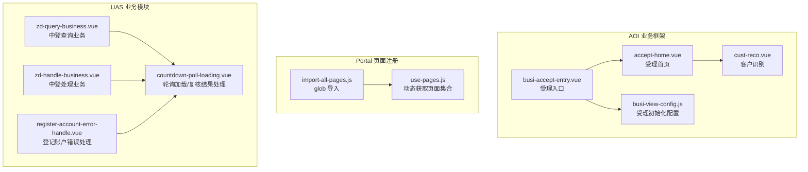
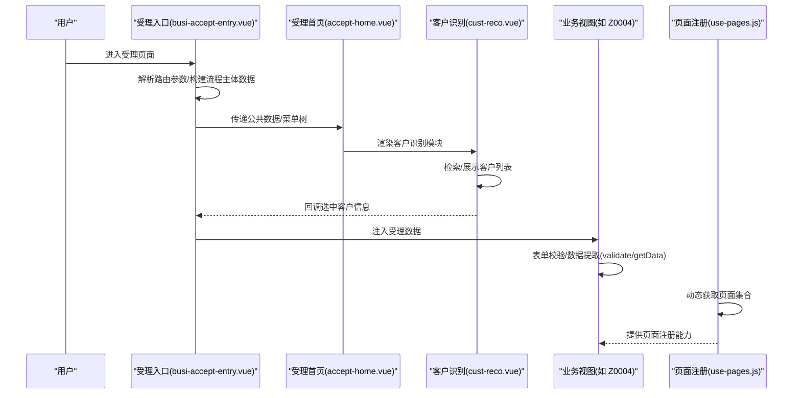
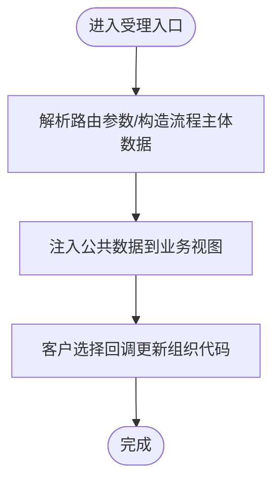
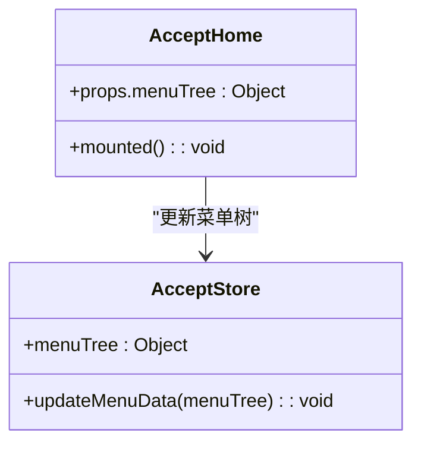
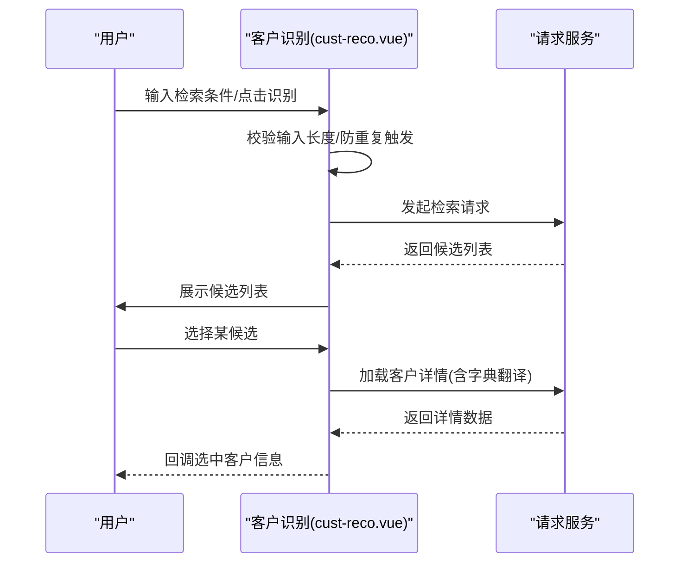
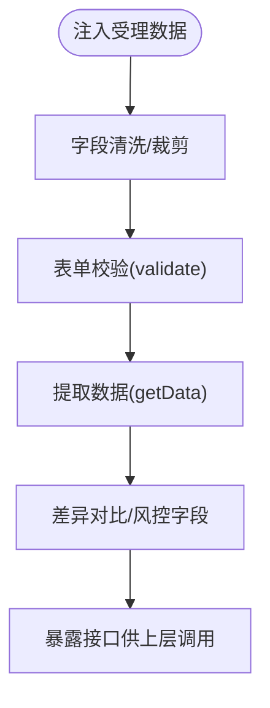
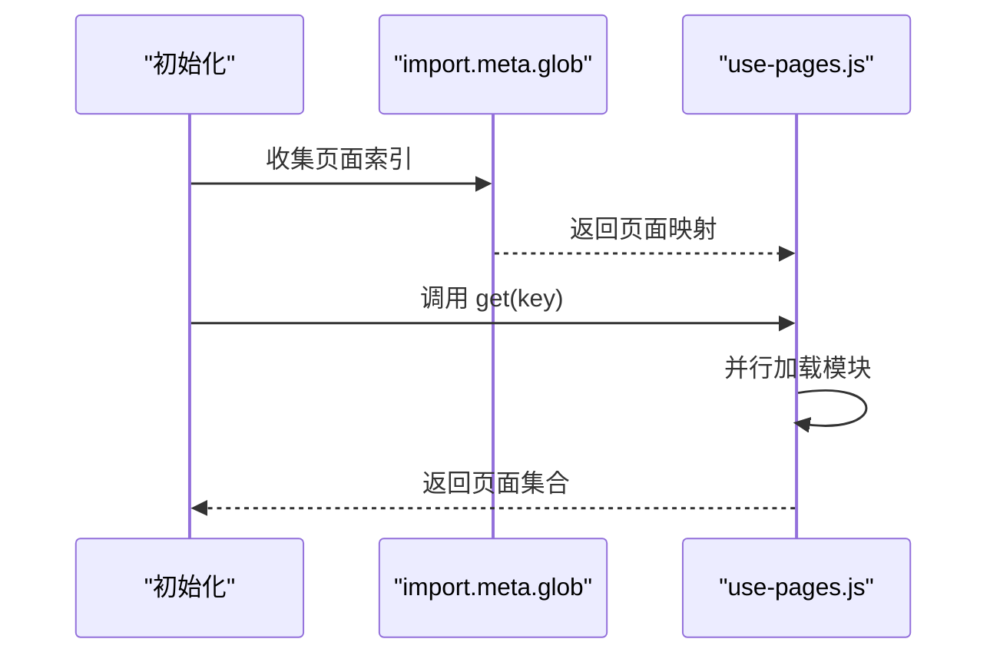
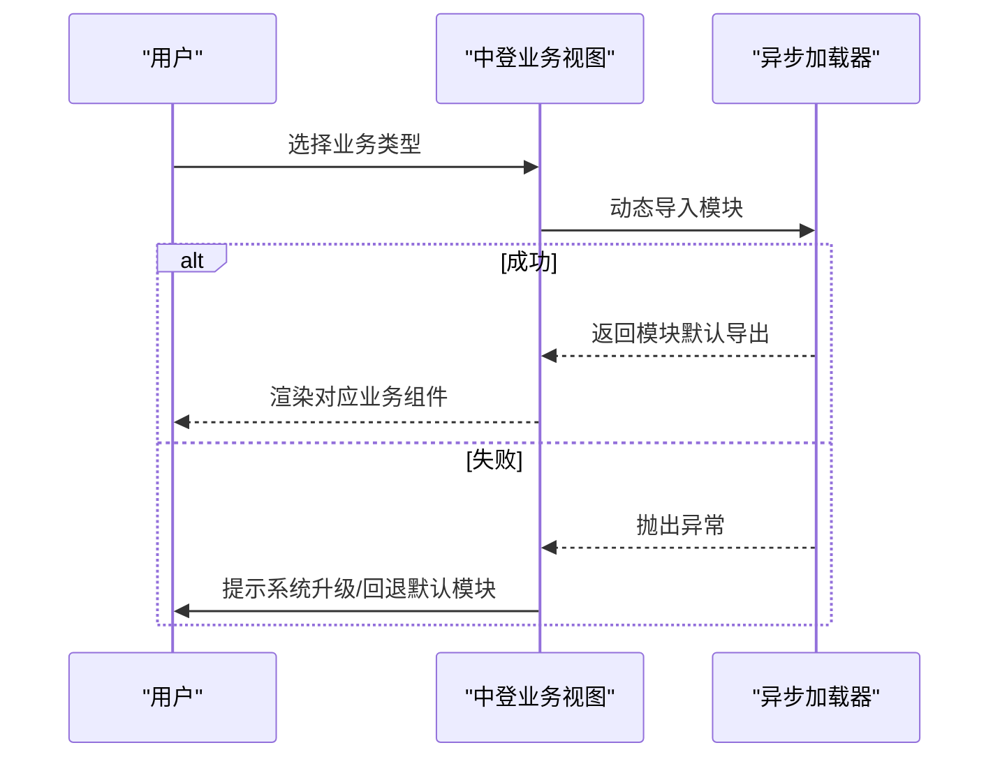
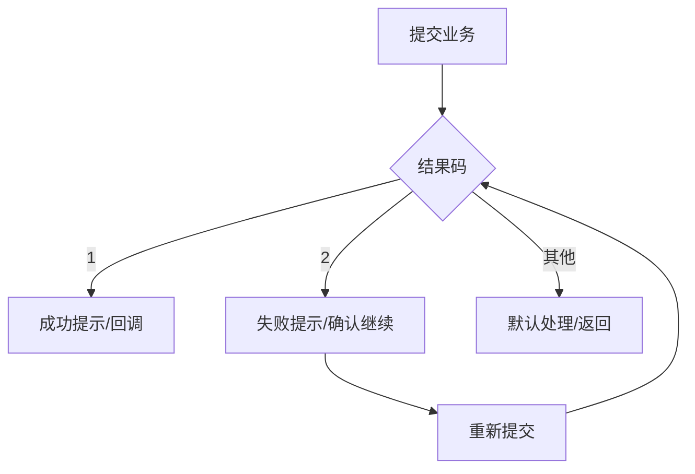
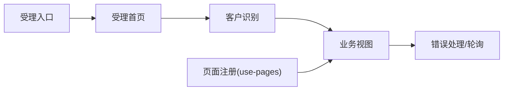

# 业务模块管理

<cite>
**本文引用的文件**
- [src/pages/aoi/index.js](file://src/pages/aoi/index.js)
- [src/pages/aoi/busi-views/busi-view-config.js](file://src/pages/aoi/busi-views/busi-view-config.js)
- [src/pages/aoi/busi-frame/accept-home/accept-home.vue](file://src/pages/aoi/busi-frame/accept-home/accept-home.vue)
- [src/pages/aoi/busi-frame/accept-home/accept-store.js](file://src/pages/aoi/busi-frame/accept-home/accept-store.js)
- [src/pages/aoi/busi-frame/cust-reco/cust-reco.vue](file://src/pages/aoi/busi-frame/cust-reco/cust-reco.vue)
- [src/pages/aoi/busi-views/Z0004/accept/cust/cust-basic-info-view.vue](file://src/pages/aoi/busi-views/Z0004/accept/cust/cust-basic-info-view.vue)
- [src/pages/aoi/busi-views/Z0004/accept/common/credit-record-view.vue](file://src/pages/aoi/busi-views/Z0004/accept/common/credit-record-view.vue)
- [src/pages/aoi/busi-views/busi-accept-entry.vue](file://src/pages/aoi/busi-views/busi-accept-entry.vue)
- [src/portal/hooks/import-all-pages.js](file://src/portal/hooks/import-all-pages.js)
- [src/portal/hooks/use-pages.js](file://src/portal/hooks/use-pages.js)
- [src/pages/uas/views/business/zd-business/zd-query-business.vue](file://src/pages/uas/views/business/zd-business/zd-query-business.vue)
- [src/pages/uas/views/business/zd-business/zd-handle-business.vue](file://src/pages/uas/views/business/zd-business/zd-handle-business.vue)
- [src/pages/uas/modules/countdown-poll-loading.vue](file://src/pages/uas/modules/countdown-poll-loading.vue)
- [src/pages/uas/views/business/register-account-error-handle.vue](file://src/pages/uas/views/business/register-account-error-handle.vue)
- [src/pages/uas/views/business/system-business-summary-maintenance.vue](file://src/pages/uas/views/business/system-business-summary-maintenance.vue)
- [src/pages/uas/views/business/sys-api-control/index.vue](file://src/pages/uas/views/business/sys-api-control/index.vue)
</cite>

## 目录
1. [引言](#引言)
2. [项目结构](#项目结构)
3. [核心组件](#核心组件)
4. [架构总览](#架构总览)
5. [详细组件分析](#详细组件分析)
6. [依赖分析](#依赖分析)
7. [性能考虑](#性能考虑)
8. [故障排查指南](#故障排查指南)
9. [结论](#结论)
10. [附录](#附录)

## 引言
本技术文档围绕 AOI 系统的“业务模块管理”主题，系统化阐述业务模块的配置管理、模块注册机制、动态加载方式；详解不同业务类型的配置规则、模块间依赖关系与通信机制；覆盖业务模块的生命周期管理、状态同步与错误处理策略；解释业务配置的数据结构、验证规则与更新机制，并提供新业务模块的开发指南与最佳实践。文档面向具备一定前端基础的读者，同时兼顾非技术背景用户的理解。

## 项目结构
AOI 业务模块主要分布在以下区域：
- AOI 业务框架与受理入口：位于 pages/aoi 下，包含受理首页、客户识别、业务视图配置与受理入口等。
- Portal 侧页面发现与注册：通过 import-all-pages 与 use-pages 实现页面索引与动态加载。
- UAS 侧业务模块与中登业务选择：通过组合式异步加载实现不同业务类型的动态切换。
- 业务模块通用能力：包括错误处理、轮询加载、业务参数字典翻译等。

图表来源
- [src/pages/aoi/busi-views/busi-accept-entry.vue](file://src/pages/aoi/busi-views/busi-accept-entry.vue#L1-L49)
- [src/pages/aoi/busi-frame/accept-home/accept-home.vue](file://src/pages/aoi/busi-frame/accept-home/accept-home.vue#L1-L19)
- [src/pages/aoi/busi-frame/cust-reco/cust-reco.vue](file://src/pages/aoi/busi-frame/cust-reco/cust-reco.vue#L1-L214)
- [src/pages/aoi/busi-views/busi-view-config.js](file://src/pages/aoi/busi-views/busi-view-config.js#L1-L5)
- [src/portal/hooks/import-all-pages.js](file://src/portal/hooks/import-all-pages.js#L1-L2)
- [src/portal/hooks/use-pages.js](file://src/portal/hooks/use-pages.js#L1-L21)
- [src/pages/uas/views/business/zd-business/zd-query-business.vue](file://src/pages/uas/views/business/zd-business/zd-query-business.vue#L54-L76)
- [src/pages/uas/views/business/zd-business/zd-handle-business.vue](file://src/pages/uas/views/business/zd-business/zd-handle-business.vue#L38-L70)
- [src/pages/uas/modules/countdown-poll-loading.vue](file://src/pages/uas/modules/countdown-poll-loading.vue#L732-L1062)
- [src/pages/uas/views/business/register-account-error-handle.vue](file://src/pages/uas/views/business/register-account-error-handle.vue#L264-L305)

章节来源
- [src/pages/aoi/busi-views/busi-accept-entry.vue](file://src/pages/aoi/busi-views/busi-accept-entry.vue#L1-L49)
- [src/pages/aoi/busi-frame/accept-home/accept-home.vue](file://src/pages/aoi/busi-frame/accept-home/accept-home.vue#L1-L19)
- [src/pages/aoi/busi-frame/cust-reco/cust-reco.vue](file://src/pages/aoi/busi-frame/cust-reco/cust-reco.vue#L1-L214)
- [src/pages/aoi/busi-views/busi-view-config.js](file://src/pages/aoi/busi-views/busi-view-config.js#L1-L5)
- [src/portal/hooks/import-all-pages.js](file://src/portal/hooks/import-all-pages.js#L1-L2)
- [src/portal/hooks/use-pages.js](file://src/portal/hooks/use-pages.js#L1-L21)
- [src/pages/uas/views/business/zd-business/zd-query-business.vue](file://src/pages/uas/views/business/zd-business/zd-query-business.vue#L54-L76)
- [src/pages/uas/views/business/zd-business/zd-handle-business.vue](file://src/pages/uas/views/business/zd-business/zd-handle-business.vue#L38-L70)
- [src/pages/uas/modules/countdown-poll-loading.vue](file://src/pages/uas/modules/countdown-poll-loading.vue#L732-L1062)
- [src/pages/uas/views/business/register-account-error-handle.vue](file://src/pages/uas/views/business/register-account-error-handle.vue#L264-L305)

## 核心组件
- 受理入口与数据注入
  - 受理入口组件负责接收路由参数、构建流程主体数据，并将公共数据注入到业务视图。
  - 关键路径参考：[受理入口](file://src/pages/aoi/busi-views/busi-accept-entry.vue#L1-L49)，[受理初始化配置](file://src/pages/aoi/busi-views/busi-view-config.js#L1-L5)。
- 受理首页与菜单树
  - 受理首页作为容器，接收并缓存菜单树，供子模块使用。
  - 关键路径参考：[受理首页](file://src/pages/aoi/busi-frame/accept-home/accept-home.vue#L1-L19)，[受理状态存储](file://src/pages/aoi/busi-frame/accept-home/accept-store.js#L1-L18)。
- 客户识别模块
  - 负责客户检索、结果展示与客户信息详情加载，提供选中回调给上层。
  - 关键路径参考：[客户识别](file://src/pages/aoi/busi-frame/cust-reco/cust-reco.vue#L1-L214)。
- 业务视图（以 Z0004 为例）
  - 业务视图通过依赖注入获取受理数据，完成表单校验与数据提取，暴露 validate/getData 接口。
  - 关键路径参考：[客户基本信息视图](file://src/pages/aoi/busi-views/Z0004/accept/cust/cust-basic-info-view.vue#L1-L214)，[信用记录视图](file://src/pages/aoi/busi-views/Z0004/accept/common/credit-record-view.vue#L1-L34)。
- 动态页面注册与加载
  - 通过 import.meta.glob 与 use-pages 组合实现页面索引与动态获取。
  - 关键路径参考：[glob 导入](file://src/portal/hooks/import-all-pages.js#L1-L2)，[动态获取页面集合](file://src/portal/hooks/use-pages.js#L1-L21)。
- 中登业务模块动态切换
  - 通过组合式异步加载实现不同业务类型的动态渲染与异常兜底。
  - 关键路径参考：[中登查询业务](file://src/pages/uas/views/business/zd-business/zd-query-business.vue#L54-L76)，[中登处理业务](file://src/pages/uas/views/business/zd-business/zd-handle-business.vue#L38-L70)。
- 业务模块通用错误处理与轮询
  - 提供统一的业务执行结果处理、失败提示与继续提交逻辑，以及轮询加载与复核结果处理。
  - 关键路径参考：[登记账户错误处理](file://src/pages/uas/views/business/register-account-error-handle.vue#L264-L305)，[轮询加载/复核结果处理](file://src/pages/uas/modules/countdown-poll-loading.vue#L732-L1062)。

章节来源
- [src/pages/aoi/busi-views/busi-accept-entry.vue](file://src/pages/aoi/busi-views/busi-accept-entry.vue#L1-L49)
- [src/pages/aoi/busi-frame/accept-home/accept-home.vue](file://src/pages/aoi/busi-frame/accept-home/accept-home.vue#L1-L19)
- [src/pages/aoi/busi-frame/accept-home/accept-store.js](file://src/pages/aoi/busi-frame/accept-home/accept-store.js#L1-L18)
- [src/pages/aoi/busi-frame/cust-reco/cust-reco.vue](file://src/pages/aoi/busi-frame/cust-reco/cust-reco.vue#L1-L214)
- [src/pages/aoi/busi-views/Z0004/accept/cust/cust-basic-info-view.vue](file://src/pages/aoi/busi-views/Z0004/accept/cust/cust-basic-info-view.vue#L1-L214)
- [src/pages/aoi/busi-views/Z0004/accept/common/credit-record-view.vue](file://src/pages/aoi/busi-views/Z0004/accept/common/credit-record-view.vue#L1-L34)
- [src/portal/hooks/import-all-pages.js](file://src/portal/hooks/import-all-pages.js#L1-L2)
- [src/portal/hooks/use-pages.js](file://src/portal/hooks/use-pages.js#L1-L21)
- [src/pages/uas/views/business/zd-business/zd-query-business.vue](file://src/pages/uas/views/business/zd-business/zd-query-business.vue#L54-L76)
- [src/pages/uas/views/business/zd-business/zd-handle-business.vue](file://src/pages/uas/views/business/zd-business/zd-handle-business.vue#L38-L70)
- [src/pages/uas/views/business/register-account-error-handle.vue](file://src/pages/uas/views/business/register-account-error-handle.vue#L264-L305)
- [src/pages/uas/modules/countdown-poll-loading.vue](file://src/pages/uas/modules/countdown-poll-loading.vue#L732-L1062)

## 架构总览
AOI 业务模块管理采用“受理入口 -> 框架容器 -> 视图组件 -> 动态加载”的分层架构。受理入口负责参数注入与公共数据准备；受理首页承载菜单树与上下文；业务视图通过依赖注入获取受理数据并完成表单校验与数据提取；动态加载机制通过 glob 与组合式异步加载实现模块级解耦与按需加载。

图表来源
- [src/pages/aoi/busi-views/busi-accept-entry.vue](file://src/pages/aoi/busi-views/busi-accept-entry.vue#L1-L49)
- [src/pages/aoi/busi-frame/accept-home/accept-home.vue](file://src/pages/aoi/busi-frame/accept-home/accept-home.vue#L1-L19)
- [src/pages/aoi/busi-frame/cust-reco/cust-reco.vue](file://src/pages/aoi/busi-frame/cust-reco/cust-reco.vue#L1-L214)
- [src/pages/aoi/busi-views/Z0004/accept/cust/cust-basic-info-view.vue](file://src/pages/aoi/busi-views/Z0004/accept/cust/cust-basic-info-view.vue#L1-L214)
- [src/portal/hooks/use-pages.js](file://src/portal/hooks/use-pages.js#L1-L21)

## 详细组件分析

### 受理入口与数据注入
- 职责
  - 解析路由参数，构造流程主体数据（如业务代码、组织代码、操作机构等），并将这些数据传递给后续模块。
  - 与门户 Tabs、Portal Store 协作，确保上下文一致。
- 关键点
  - 参数键集合定义与默认值设置，保证跨业务一致性。
  - 客户选择回调用于回填组织代码等字段。
- 路径参考
  - [受理入口](file://src/pages/aoi/busi-views/busi-accept-entry.vue#L1-L49)

图表来源
- [src/pages/aoi/busi-views/busi-accept-entry.vue](file://src/pages/aoi/busi-views/busi-accept-entry.vue#L1-L49)

章节来源
- [src/pages/aoi/busi-views/busi-accept-entry.vue](file://src/pages/aoi/busi-views/busi-accept-entry.vue#L1-L49)

### 受理首页与菜单树
- 职责
  - 作为受理流程的容器，接收并缓存菜单树，供导航与权限控制使用。
- 关键点
  - 使用 Pinia Store 缓存菜单树，避免重复计算与跨组件共享。
- 路径参考
  - [受理首页](file://src/pages/aoi/busi-frame/accept-home/accept-home.vue#L1-L19)
  - [受理状态存储](file://src/pages/aoi/busi-frame/accept-home/accept-store.js#L1-L18)

图表来源
- [src/pages/aoi/busi-frame/accept-home/accept-home.vue](file://src/pages/aoi/busi-frame/accept-home/accept-home.vue#L1-L19)
- [src/pages/aoi/busi-frame/accept-home/accept-store.js](file://src/pages/aoi/busi-frame/accept-home/accept-store.js#L1-L18)

章节来源
- [src/pages/aoi/busi-frame/accept-home/accept-home.vue](file://src/pages/aoi/busi-frame/accept-home/accept-home.vue#L1-L19)
- [src/pages/aoi/busi-frame/accept-home/accept-store.js](file://src/pages/aoi/busi-frame/accept-home/accept-store.js#L1-L18)

### 客户识别模块
- 职责
  - 支持多种输入条件检索客户，展示候选列表，加载客户详情并翻译字典项，最终回调上层。
- 关键点
  - 输入长度校验、并发识别控制、加载状态管理。
  - 字典翻译与组织信息拼接，提升用户体验。
- 路径参考
  - [客户识别](file://src/pages/aoi/busi-frame/cust-reco/cust-reco.vue#L1-L214)

图表来源
- [src/pages/aoi/busi-frame/cust-reco/cust-reco.vue](file://src/pages/aoi/busi-frame/cust-reco/cust-reco.vue#L1-L214)

章节来源
- [src/pages/aoi/busi-frame/cust-reco/cust-reco.vue](file://src/pages/aoi/busi-frame/cust-reco/cust-reco.vue#L1-L214)

### 业务视图（以 Z0004 为例）
- 职责
  - 通过依赖注入获取受理数据，完成表单校验与数据提取，暴露 validate/getData 接口供上层调用。
- 关键点
  - 数据清洗与字段裁剪，确保仅传递必要字段。
  - 差异对比逻辑，支持风控与合规要求。
- 路径参考
  - [客户基本信息视图](file://src/pages/aoi/busi-views/Z0004/accept/cust/cust-basic-info-view.vue#L1-L214)
  - [信用记录视图](file://src/pages/aoi/busi-views/Z0004/accept/common/credit-record-view.vue#L1-L34)

图表来源
- [src/pages/aoi/busi-views/Z0004/accept/cust/cust-basic-info-view.vue](file://src/pages/aoi/busi-views/Z0004/accept/cust/cust-basic-info-view.vue#L1-L214)
- [src/pages/aoi/busi-views/Z0004/accept/common/credit-record-view.vue](file://src/pages/aoi/busi-views/Z0004/accept/common/credit-record-view.vue#L1-L34)

章节来源
- [src/pages/aoi/busi-views/Z0004/accept/cust/cust-basic-info-view.vue](file://src/pages/aoi/busi-views/Z0004/accept/cust/cust-basic-info-view.vue#L1-L214)
- [src/pages/aoi/busi-views/Z0004/accept/common/credit-record-view.vue](file://src/pages/aoi/busi-views/Z0004/accept/common/credit-record-view.vue#L1-L34)

### 动态页面注册与加载
- 职责
  - 通过 import.meta.glob 收集页面索引，use-pages 动态聚合并返回指定键的页面集合。
- 关键点
  - 按需加载，减少初始包体；支持多页面模块化注册。
- 路径参考
  - [glob 导入](file://src/portal/hooks/import-all-pages.js#L1-L2)
  - [动态获取页面集合](file://src/portal/hooks/use-pages.js#L1-L21)

图表来源
- [src/portal/hooks/import-all-pages.js](file://src/portal/hooks/import-all-pages.js#L1-L2)
- [src/portal/hooks/use-pages.js](file://src/portal/hooks/use-pages.js#L1-L21)

章节来源
- [src/portal/hooks/import-all-pages.js](file://src/portal/hooks/import-all-pages.js#L1-L2)
- [src/portal/hooks/use-pages.js](file://src/portal/hooks/use-pages.js#L1-L21)

### 中登业务模块动态切换
- 职责
  - 根据业务类型动态加载对应模块，异常时回退至默认模块并提示系统升级。
- 关键点
  - 组合式异步加载与错误捕获，保障用户体验。
- 路径参考
  - [中登查询业务](file://src/pages/uas/views/business/zd-business/zd-query-business.vue#L54-L76)
  - [中登处理业务](file://src/pages/uas/views/business/zd-business/zd-handle-business.vue#L38-L70)

图表来源
- [src/pages/uas/views/business/zd-business/zd-query-business.vue](file://src/pages/uas/views/business/zd-business/zd-query-business.vue#L54-L76)
- [src/pages/uas/views/business/zd-business/zd-handle-business.vue](file://src/pages/uas/views/business/zd-business/zd-handle-business.vue#L38-L70)

章节来源
- [src/pages/uas/views/business/zd-business/zd-query-business.vue](file://src/pages/uas/views/business/zd-business/zd-query-business.vue#L54-L76)
- [src/pages/uas/views/business/zd-business/zd-handle-business.vue](file://src/pages/uas/views/business/zd-business/zd-handle-business.vue#L38-L70)

### 业务模块通用错误处理与轮询
- 职责
  - 统一处理业务执行结果：成功提示、失败提示并允许继续提交、默认分支处理；提供轮询加载与复核结果处理。
- 关键点
  - 结果码判断与递归处理，确保用户可控。
  - HANDLE_PARAMETER 的序列号提取，支撑后续跟踪。
- 路径参考
  - [登记账户错误处理](file://src/pages/uas/views/business/register-account-error-handle.vue#L264-L305)
  - [轮询加载/复核结果处理](file://src/pages/uas/modules/countdown-poll-loading.vue#L732-L1062)

图表来源
- [src/pages/uas/views/business/register-account-error-handle.vue](file://src/pages/uas/views/business/register-account-error-handle.vue#L264-L305)
- [src/pages/uas/modules/countdown-poll-loading.vue](file://src/pages/uas/modules/countdown-poll-loading.vue#L732-L1062)

章节来源
- [src/pages/uas/views/business/register-account-error-handle.vue](file://src/pages/uas/views/business/register-account-error-handle.vue#L264-L305)
- [src/pages/uas/modules/countdown-poll-loading.vue](file://src/pages/uas/modules/countdown-poll-loading.vue#L732-L1062)

## 依赖分析
- 组件耦合
  - 受理入口与业务视图通过依赖注入建立弱耦合；客户识别与业务视图通过回调建立松散耦合。
  - 受理首页与状态存储通过 Pinia 实现集中式状态管理。
- 动态加载依赖
  - use-pages 依赖 import.meta.glob 的页面索引；中登业务视图依赖组合式异步加载器。
- 错误处理依赖
  - 业务模块通用错误处理依赖消息框与确认对话框组件，形成统一交互体验。

图表来源
- [src/pages/aoi/busi-views/busi-accept-entry.vue](file://src/pages/aoi/busi-views/busi-accept-entry.vue#L1-L49)
- [src/pages/aoi/busi-frame/accept-home/accept-home.vue](file://src/pages/aoi/busi-frame/accept-home/accept-home.vue#L1-L19)
- [src/pages/aoi/busi-frame/cust-reco/cust-reco.vue](file://src/pages/aoi/busi-frame/cust-reco/cust-reco.vue#L1-L214)
- [src/pages/aoi/busi-views/Z0004/accept/cust/cust-basic-info-view.vue](file://src/pages/aoi/busi-views/Z0004/accept/cust/cust-basic-info-view.vue#L1-L214)
- [src/portal/hooks/use-pages.js](file://src/portal/hooks/use-pages.js#L1-L21)
- [src/pages/uas/views/business/register-account-error-handle.vue](file://src/pages/uas/views/business/register-account-error-handle.vue#L264-L305)
- [src/pages/uas/modules/countdown-poll-loading.vue](file://src/pages/uas/modules/countdown-poll-loading.vue#L732-L1062)

章节来源
- [src/pages/aoi/busi-views/busi-accept-entry.vue](file://src/pages/aoi/busi-views/busi-accept-entry.vue#L1-L49)
- [src/pages/aoi/busi-frame/accept-home/accept-home.vue](file://src/pages/aoi/busi-frame/accept-home/accept-home.vue#L1-L19)
- [src/pages/aoi/busi-frame/cust-reco/cust-reco.vue](file://src/pages/aoi/busi-frame/cust-reco/cust-reco.vue#L1-L214)
- [src/pages/aoi/busi-views/Z0004/accept/cust/cust-basic-info-view.vue](file://src/pages/aoi/busi-views/Z0004/accept/cust/cust-basic-info-view.vue#L1-L214)
- [src/portal/hooks/use-pages.js](file://src/portal/hooks/use-pages.js#L1-L21)
- [src/pages/uas/views/business/register-account-error-handle.vue](file://src/pages/uas/views/business/register-account-error-handle.vue#L264-L305)
- [src/pages/uas/modules/countdown-poll-loading.vue](file://src/pages/uas/modules/countdown-poll-loading.vue#L732-L1062)

## 性能考虑
- 按需加载
  - 通过 import.meta.glob 与组合式异步加载，避免一次性加载所有业务模块，降低首屏体积。
- 状态集中管理
  - 使用 Pinia 存储菜单树等共享状态，减少重复计算与跨组件通信成本。
- 请求与渲染优化
  - 客户识别模块在请求前后设置加载状态与防重复触发，提升交互流畅度。
- 数据最小化
  - 受理初始化配置强调“尽量精简”，避免将冗余数据注入业务视图，提高组件渲染效率。

## 故障排查指南
- 动态加载失败
  - 现象：选择业务类型后无响应或报错。
  - 排查：检查异步加载器是否正确返回模块，默认模块是否可用；查看控制台错误堆栈。
  - 参考路径：[中登查询业务](file://src/pages/uas/views/business/zd-business/zd-query-business.vue#L54-L76)，[中登处理业务](file://src/pages/uas/views/business/zd-business/zd-handle-business.vue#L38-L70)。
- 业务执行失败
  - 现象：提交后弹出失败提示，无法继续。
  - 排查：确认结果码处理逻辑，是否选择了“继续提交”；检查 HANDLE_PARAMETER 序列号提取。
  - 参考路径：[登记账户错误处理](file://src/pages/uas/views/business/register-account-error-handle.vue#L264-L305)，[轮询加载/复核结果处理](file://src/pages/uas/modules/countdown-poll-loading.vue#L732-L1062)。
- 页面注册未生效
  - 现象：use-pages 无法获取页面集合。
  - 排查：确认 import.meta.glob 是否正确扫描到页面；检查页面 index.js 导出键名是否匹配。
  - 参考路径：[glob 导入](file://src/portal/hooks/import-all-pages.js#L1-L2)，[动态获取页面集合](file://src/portal/hooks/use-pages.js#L1-L21)。

章节来源
- [src/pages/uas/views/business/zd-business/zd-query-business.vue](file://src/pages/uas/views/business/zd-business/zd-query-business.vue#L54-L76)
- [src/pages/uas/views/business/zd-business/zd-handle-business.vue](file://src/pages/uas/views/business/zd-business/zd-handle-business.vue#L38-L70)
- [src/pages/uas/views/business/register-account-error-handle.vue](file://src/pages/uas/views/business/register-account-error-handle.vue#L264-L305)
- [src/pages/uas/modules/countdown-poll-loading.vue](file://src/pages/uas/modules/countdown-poll-loading.vue#L732-L1062)
- [src/portal/hooks/import-all-pages.js](file://src/portal/hooks/import-all-pages.js#L1-L2)
- [src/portal/hooks/use-pages.js](file://src/portal/hooks/use-pages.js#L1-L21)

## 结论
AOI 业务模块管理通过“受理入口 -> 框架容器 -> 视图组件 -> 动态加载”的架构实现了高内聚、低耦合的模块化设计。借助依赖注入、Pinia 状态管理与组合式异步加载，系统在保证扩展性的同时提升了性能与用户体验。统一的错误处理与轮询机制进一步增强了业务执行的可靠性与可控性。建议在新增业务模块时遵循现有模式，确保配置最小化、接口标准化与错误处理一致化。

## 附录
- 新业务模块开发指南
  - 模块命名与目录规范：建议以业务代码命名（如 Z0004），在 pages/aoi/busi-views 下创建独立目录。
  - 视图组件规范：实现 validate/getData 接口，确保仅暴露必要字段；使用依赖注入获取受理数据。
  - 动态注册：在页面 index.js 中导出 callbacks 或通过 use-pages 注册；确保键名唯一。
  - 错误处理：遵循统一的结果码处理逻辑，提供“继续提交”与默认处理分支。
  - 配置最小化：受理初始化配置仅传递必要字段，避免影响组件性能。
- 最佳实践
  - 使用组合式异步加载替代静态导入，提升首屏性能。
  - 将共享状态放入 Pinia，避免跨组件重复计算。
  - 在业务视图中进行严格的字段清洗与校验，确保数据质量。
  - 统一错误提示与确认对话框，保持一致的用户体验。