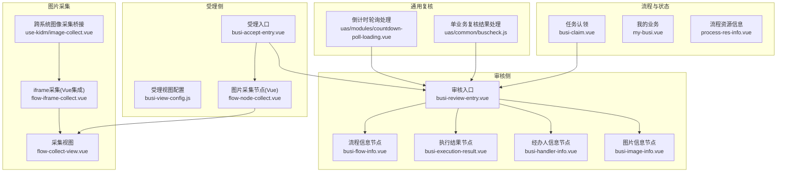
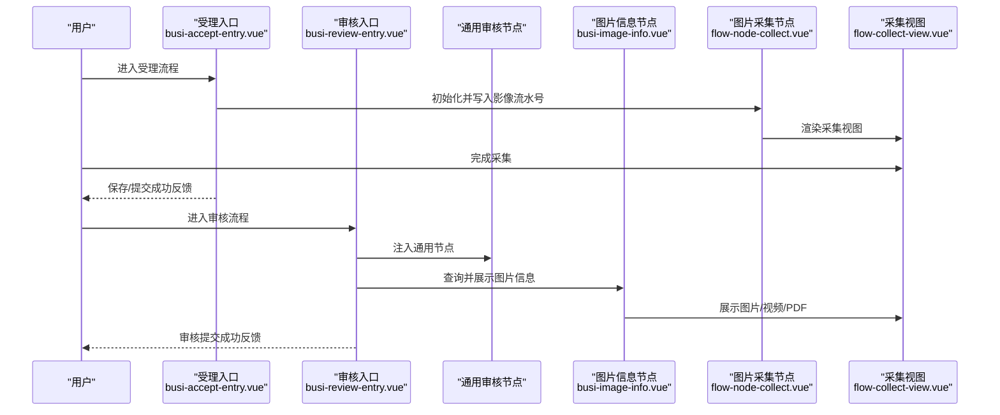
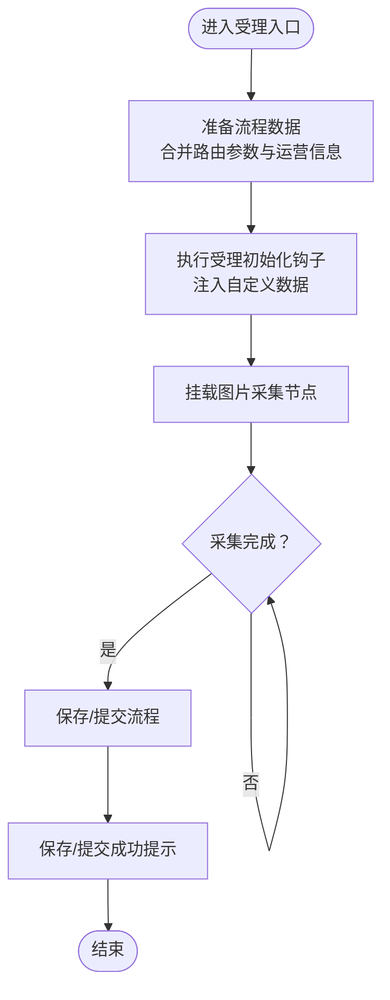
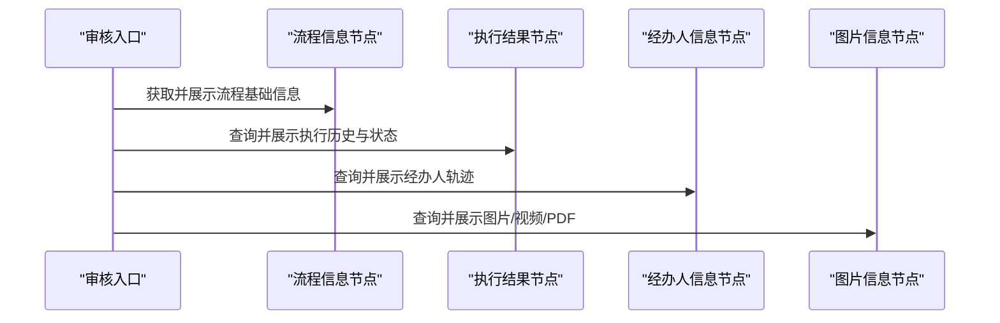
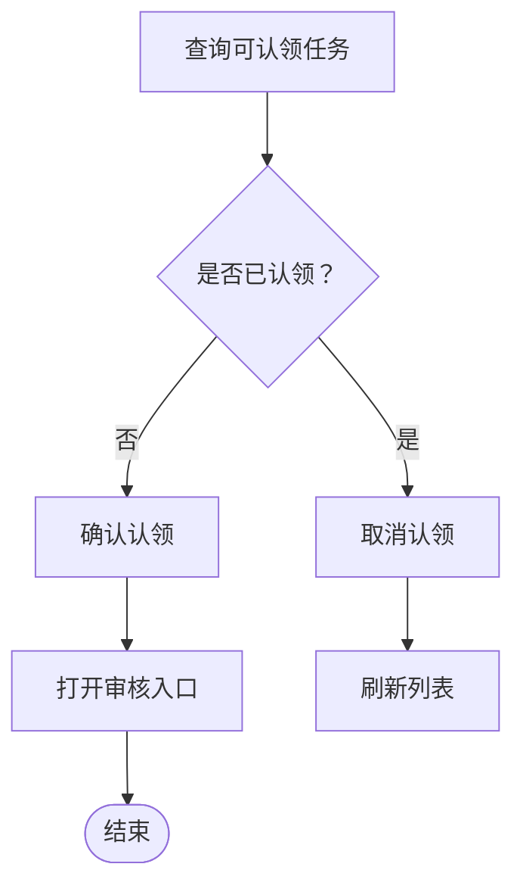
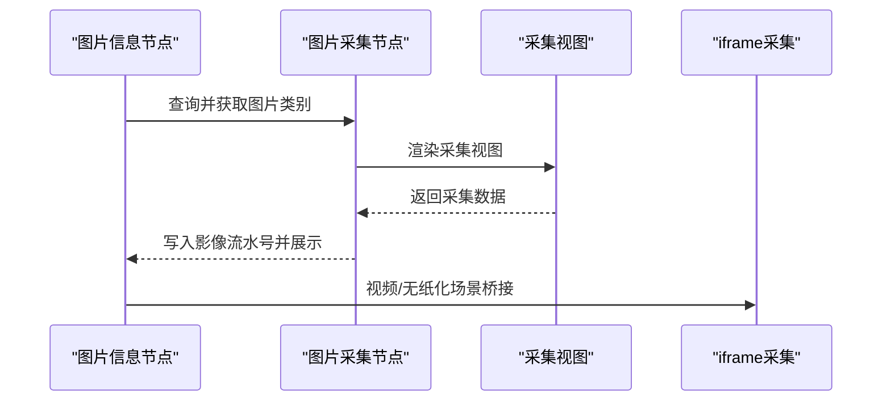
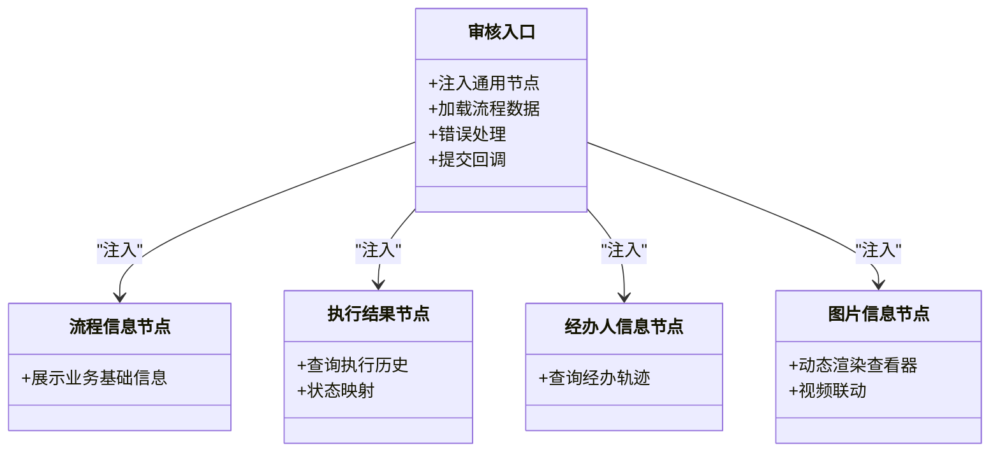
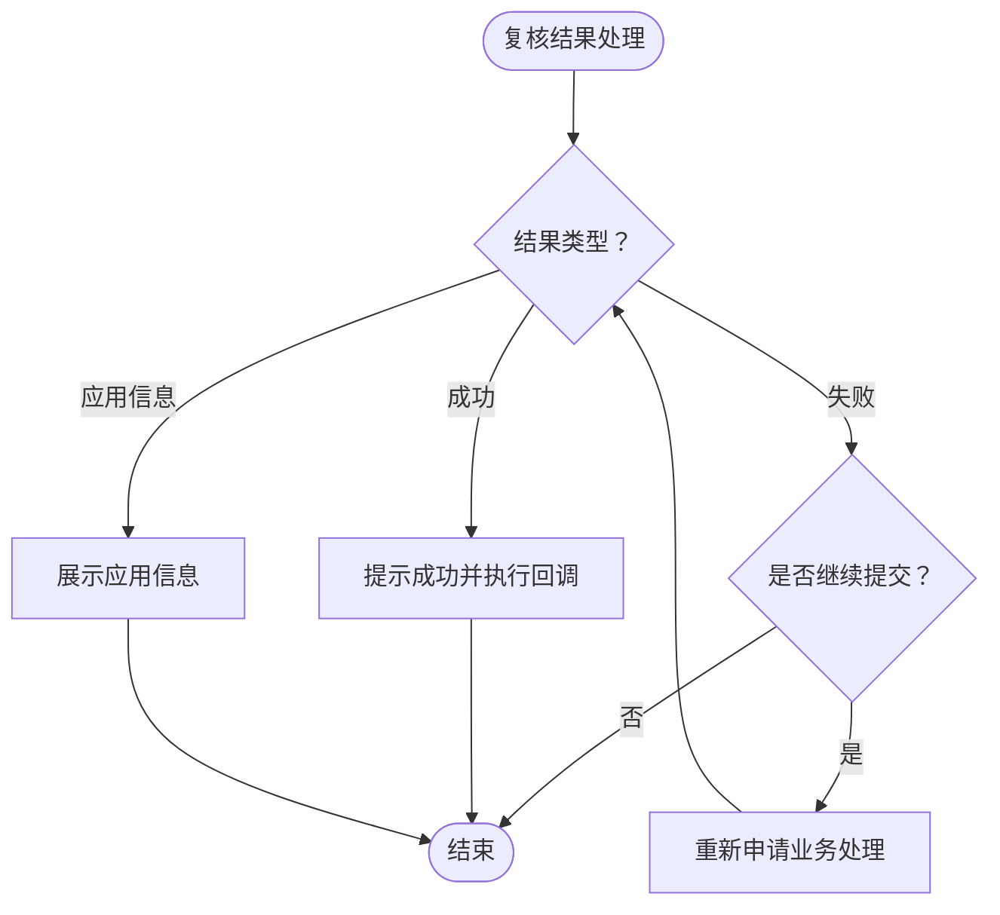
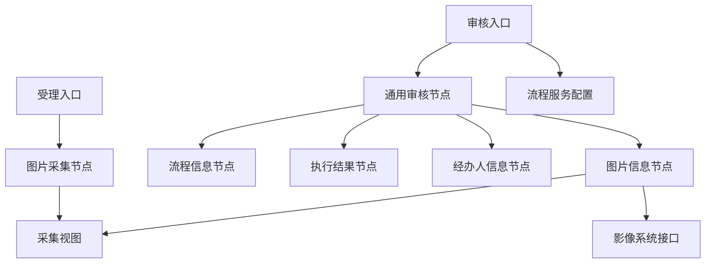

# 业务流程处理

<cite>
**本文引用的文件列表**
- [src/pages/aoi/busi-views/busi-accept-entry.vue](file://src/pages/aoi/busi-views/busi-accept-entry.vue)
- [src/pages/aoi/busi-views/busi-review-entry.vue](file://src/pages/aoi/busi-views/busi-review-entry.vue)
- [src/pages/aoi/busi-frame/busi-review-common-nodes/busi-flow-info.vue](file://src/pages/aoi/busi-frame/busi-review-common-nodes/busi-flow-info.vue)
- [src/pages/aoi/busi-frame/busi-review-common-nodes/busi-execution-result.vue](file://src/pages/aoi/busi-frame/busi-review-common-nodes/busi-execution-result.vue)
- [src/pages/aoi/busi-frame/busi-review-common-nodes/busi-handler-info.vue](file://src/pages/aoi/busi-frame/busi-review-common-nodes/busi-handler-info.vue)
- [src/pages/aoi/busi-frame/busi-review-common-nodes/busi-image-info.vue](file://src/pages/aoi/busi-frame/busi-review-common-nodes/busi-image-info.vue)
- [src/pages/aoi/views/process/busi-claim.vue](file://src/pages/aoi/views/process/busi-claim.vue)
- [src/pages/aoi/views/process/my-busi.vue](file://src/pages/aoi/views/process/my-busi.vue)
- [src/pages/aoi/views/process/flow/process-res-info.vue](file://src/pages/aoi/views/process/flow/process-res-info.vue)
- [src/pages/aoi/busi-views/busi-view-config.js](file://src/pages/aoi/busi-views/busi-view-config.js)
- [src/pages/idm/views/collect/flow-node-collect.vue](file://src/pages/idm/views/collect/flow-node-collect.vue)
- [src/pages/idm/views/collect/flow-collect-view.vue](file://src/pages/idm/views/collect/flow-collect-view.vue)
- [src/pages/idm/views/collect/flow-iframe-collect.vue](file://src/pages/idm/views/collect/flow-iframe-collect.vue)
- [src/pages/cop/modules/use-kidm/image-collect.vue](file://src/pages/cop/modules/use-kidm/image-collect.vue)
- [src/pages/cop/modules/kcop-business-review/index.vue](file://src/pages/cop/modules/kcop-business-review/index.vue)
- [src/pages/uas/common/buscheck.js](file://src/pages/uas/common/buscheck.js)
- [src/pages/uas/modules/countdown-poll-loading.vue](file://src/pages/uas/modules/countdown-poll-loading.vue)
</cite>

## 目录
1. [引言](#引言)
2. [项目结构](#项目结构)
3. [核心组件](#核心组件)
4. [架构总览](#架构总览)
5. [详细组件分析](#详细组件分析)
6. [依赖关系分析](#依赖关系分析)
7. [性能考量](#性能考量)
8. [故障排查指南](#故障排查指南)
9. [结论](#结论)
10. [附录](#附录)

## 引言
本技术文档围绕 AOI 系统的业务流程处理模块展开，重点覆盖业务流程引擎的集成方式、业务节点的处理逻辑与流程状态管理；详细对比受理流程与审核流程的差异与处理机制；阐述通用审核节点的设计模式、图片信息处理与执行结果记录；并提供业务流程的自定义配置与扩展方法。文档通过多幅图示展示流程图、节点跳转规则与数据传递机制，帮助读者快速理解并高效扩展业务流程能力。

## 项目结构
AOI 的业务流程处理主要分布在以下区域：
- 受理入口与视图配置：受理入口页面、受理视图配置导出方法
- 审核入口与通用节点：审核入口页面、流程信息、执行结果、经办人信息、图片信息等通用节点
- 流程任务与状态：任务认领、我的业务查询、流程资源信息查询
- 图片采集与节点：Vue 场景下的流程节点采集、iframe 集成采集、跨系统图像采集桥接
- 通用复核结果处理：单业务接口复核结果处理与轮询类处理

图表来源
- [src/pages/aoi/busi-views/busi-accept-entry.vue](file://src/pages/aoi/busi-views/busi-accept-entry.vue#L1-L133)
- [src/pages/aoi/busi-views/busi-review-entry.vue](file://src/pages/aoi/busi-views/busi-review-entry.vue#L1-L67)
- [src/pages/aoi/busi-frame/busi-review-common-nodes/busi-flow-info.vue](file://src/pages/aoi/busi-frame/busi-review-common-nodes/busi-flow-info.vue#L1-L26)
- [src/pages/aoi/busi-frame/busi-review-common-nodes/busi-execution-result.vue](file://src/pages/aoi/busi-frame/busi-review-common-nodes/busi-execution-result.vue#L1-L62)
- [src/pages/aoi/busi-frame/busi-review-common-nodes/busi-handler-info.vue](file://src/pages/aoi/busi-frame/busi-review-common-nodes/busi-handler-info.vue#L1-L40)
- [src/pages/aoi/busi-frame/busi-review-common-nodes/busi-image-info.vue](file://src/pages/aoi/busi-frame/busi-review-common-nodes/busi-image-info.vue#L1-L228)
- [src/pages/aoi/views/process/busi-claim.vue](file://src/pages/aoi/views/process/busi-claim.vue#L1-L188)
- [src/pages/aoi/views/process/my-busi.vue](file://src/pages/aoi/views/process/my-busi.vue#L1-L91)
- [src/pages/aoi/views/process/flow/process-res-info.vue](file://src/pages/aoi/views/process/flow/process-res-info.vue#L1-L49)
- [src/pages/idm/views/collect/flow-node-collect.vue](file://src/pages/idm/views/collect/flow-node-collect.vue#L1-L122)
- [src/pages/idm/views/collect/flow-collect-view.vue](file://src/pages/idm/views/collect/flow-collect-view.vue#L1-L32)
- [src/pages/idm/views/collect/flow-iframe-collect.vue](file://src/pages/idm/views/collect/flow-iframe-collect.vue#L1-L55)
- [src/pages/cop/modules/use-kidm/image-collect.vue](file://src/pages/cop/modules/use-kidm/image-collect.vue#L1-L77)
- [src/pages/uas/common/buscheck.js](file://src/pages/uas/common/buscheck.js#L395-L437)
- [src/pages/uas/modules/countdown-poll-loading.vue](file://src/pages/uas/modules/countdown-poll-loading.vue#L732-L1062)

章节来源
- [src/pages/aoi/busi-views/busi-accept-entry.vue](file://src/pages/aoi/busi-views/busi-accept-entry.vue#L1-L133)
- [src/pages/aoi/busi-views/busi-review-entry.vue](file://src/pages/aoi/busi-views/busi-review-entry.vue#L1-L67)

## 核心组件
- 受理入口组件：负责组装受理阶段的流程数据、触发受理初始化钩子、挂载图片采集节点，并在保存/提交后给出反馈。
- 审核入口组件：负责加载审核阶段的流程数据、注入通用节点（流程信息、图片信息、执行结果、经办人信息），并处理错误与提交后的回调。
- 通用审核节点：流程信息、执行结果、经办人信息、图片信息，分别承担基础信息展示、执行历史与状态、经办轨迹与结果、影像资料查看与视频联动。
- 图片采集节点：在 Vue 流程节点中完成影像流水号写入、采集类别拉取、系统参数注入与必采校验；支持 iframe 场景的跨窗口消息通信。
- 任务认领与我的业务：提供任务认领、状态筛选、打开审核入口的能力；提供我的业务查询与状态标签格式化。
- 流程资源信息：提供流程标识、节点类型、节点顺序等信息的查询与展示。
- 通用复核结果处理：封装单业务复核结果处理与轮询处理，支持成功提示、失败确认重试、应用信息展示与默认处理。

章节来源
- [src/pages/aoi/busi-views/busi-accept-entry.vue](file://src/pages/aoi/busi-views/busi-accept-entry.vue#L1-L133)
- [src/pages/aoi/busi-views/busi-review-entry.vue](file://src/pages/aoi/busi-views/busi-review-entry.vue#L1-L67)
- [src/pages/aoi/busi-frame/busi-review-common-nodes/busi-flow-info.vue](file://src/pages/aoi/busi-frame/busi-review-common-nodes/busi-flow-info.vue#L1-L26)
- [src/pages/aoi/busi-frame/busi-review-common-nodes/busi-execution-result.vue](file://src/pages/aoi/busi-frame/busi-review-common-nodes/busi-execution-result.vue#L1-L62)
- [src/pages/aoi/busi-frame/busi-review-common-nodes/busi-handler-info.vue](file://src/pages/aoi/busi-frame/busi-review-common-nodes/busi-handler-info.vue#L1-L40)
- [src/pages/aoi/busi-frame/busi-review-common-nodes/busi-image-info.vue](file://src/pages/aoi/busi-frame/busi-review-common-nodes/busi-image-info.vue#L1-L228)
- [src/pages/idm/views/collect/flow-node-collect.vue](file://src/pages/idm/views/collect/flow-node-collect.vue#L1-L122)
- [src/pages/idm/views/collect/flow-collect-view.vue](file://src/pages/idm/views/collect/flow-collect-view.vue#L1-L32)
- [src/pages/idm/views/collect/flow-iframe-collect.vue](file://src/pages/idm/views/collect/flow-iframe-collect.vue#L1-L55)
- [src/pages/aoi/views/process/busi-claim.vue](file://src/pages/aoi/views/process/busi-claim.vue#L1-L188)
- [src/pages/aoi/views/process/my-busi.vue](file://src/pages/aoi/views/process/my-busi.vue#L1-L91)
- [src/pages/aoi/views/process/flow/process-res-info.vue](file://src/pages/aoi/views/process/flow/process-res-info.vue#L1-L49)
- [src/pages/uas/common/buscheck.js](file://src/pages/uas/common/buscheck.js#L395-L437)
- [src/pages/uas/modules/countdown-poll-loading.vue](file://src/pages/uas/modules/countdown-poll-loading.vue#L732-L1062)

## 架构总览
AOI 业务流程处理采用“入口 + 通用节点 + 采集节点 + 状态管理”的分层设计：
- 入口层：受理入口与审核入口分别承载受理与审核阶段的数据与交互。
- 通用节点层：提供可复用的流程信息、执行结果、经办人信息、图片信息展示。
- 采集节点层：在流程节点内完成影像流水号写入、类别拉取与采集视图渲染，支持 iframe 场景的消息桥接。
- 状态与任务层：任务认领、我的业务查询、流程资源信息查询，支撑流程状态流转与可视化。
- 复核处理层：封装复核结果处理与轮询处理，统一处理成功/失败/应用信息等分支。

图表来源
- [src/pages/aoi/busi-views/busi-accept-entry.vue](file://src/pages/aoi/busi-views/busi-accept-entry.vue#L1-L133)
- [src/pages/aoi/busi-views/busi-review-entry.vue](file://src/pages/aoi/busi-views/busi-review-entry.vue#L1-L67)
- [src/pages/aoi/busi-frame/busi-review-common-nodes/busi-image-info.vue](file://src/pages/aoi/busi-frame/busi-review-common-nodes/busi-image-info.vue#L1-L228)
- [src/pages/idm/views/collect/flow-node-collect.vue](file://src/pages/idm/views/collect/flow-node-collect.vue#L1-L122)
- [src/pages/idm/views/collect/flow-collect-view.vue](file://src/pages/idm/views/collect/flow-collect-view.vue#L1-L32)

## 详细组件分析

### 受理流程处理
- 数据准备与键值映射：从路由 query 中提取并补全业务关键字段（如业务代码、机构代码、操作机构、流水号等），确保后续流程节点可用。
- 初始化钩子：通过受理视图配置导出的初始化方法注入自定义数据，避免冗余数据影响性能。
- 图片采集节点挂载：在受理阶段挂载图片采集节点，采集完成后将影像流水号回填至流程数据。
- 错误处理与回调：对受理阶段的异常进行分类处理；保存与提交成功后弹窗提示并关闭当前标签页。

图表来源
- [src/pages/aoi/busi-views/busi-accept-entry.vue](file://src/pages/aoi/busi-views/busi-accept-entry.vue#L1-L133)
- [src/pages/aoi/busi-views/busi-view-config.js](file://src/pages/aoi/busi-views/busi-view-config.js#L1-L5)
- [src/pages/idm/views/collect/flow-node-collect.vue](file://src/pages/idm/views/collect/flow-node-collect.vue#L1-L122)

章节来源
- [src/pages/aoi/busi-views/busi-accept-entry.vue](file://src/pages/aoi/busi-views/busi-accept-entry.vue#L1-L133)
- [src/pages/aoi/busi-views/busi-view-config.js](file://src/pages/aoi/busi-views/busi-view-config.js#L1-L5)
- [src/pages/idm/views/collect/flow-node-collect.vue](file://src/pages/idm/views/collect/flow-node-collect.vue#L1-L122)

### 审核流程处理
- 审核入口加载：从路由 query 中复制流程数据，注入通用节点（流程信息、图片信息、执行结果、经办人信息）。
- 通用节点职责：
  - 流程信息节点：展示业务名称、流水号、影像业务单号、用户信息、机构等。
  - 执行结果节点：查询并展示各任务执行状态、时间、结果代码与信息。
  - 经办人信息节点：展示经办员工工号、姓名、机构、联系方式、节点、起止时间、处理结果与备注。
  - 图片信息节点：根据采集模式动态渲染图片/视频/PDF 查看器，支持查看视频与无纸化附带视频联动。
- 错误处理与提交回调：对审核阶段的异常进行统一提示；提交成功后弹窗提示并关闭当前标签页。

图表来源
- [src/pages/aoi/busi-views/busi-review-entry.vue](file://src/pages/aoi/busi-views/busi-review-entry.vue#L1-L67)
- [src/pages/aoi/busi-frame/busi-review-common-nodes/busi-flow-info.vue](file://src/pages/aoi/busi-frame/busi-review-common-nodes/busi-flow-info.vue#L1-L26)
- [src/pages/aoi/busi-frame/busi-review-common-nodes/busi-execution-result.vue](file://src/pages/aoi/busi-frame/busi-review-common-nodes/busi-execution-result.vue#L1-L62)
- [src/pages/aoi/busi-frame/busi-review-common-nodes/busi-handler-info.vue](file://src/pages/aoi/busi-frame/busi-review-common-nodes/busi-handler-info.vue#L1-L40)
- [src/pages/aoi/busi-frame/busi-review-common-nodes/busi-image-info.vue](file://src/pages/aoi/busi-frame/busi-review-common-nodes/busi-image-info.vue#L1-L228)

章节来源
- [src/pages/aoi/busi-views/busi-review-entry.vue](file://src/pages/aoi/busi-views/busi-review-entry.vue#L1-L67)
- [src/pages/aoi/busi-frame/busi-review-common-nodes/busi-flow-info.vue](file://src/pages/aoi/busi-frame/busi-review-common-nodes/busi-flow-info.vue#L1-L26)
- [src/pages/aoi/busi-frame/busi-review-common-nodes/busi-execution-result.vue](file://src/pages/aoi/busi-frame/busi-review-common-nodes/busi-execution-result.vue#L1-L62)
- [src/pages/aoi/busi-frame/busi-review-common-nodes/busi-handler-info.vue](file://src/pages/aoi/busi-frame/busi-review-common-nodes/busi-handler-info.vue#L1-L40)
- [src/pages/aoi/busi-frame/busi-review-common-nodes/busi-image-info.vue](file://src/pages/aoi/busi-frame/busi-review-common-nodes/busi-image-info.vue#L1-L228)

### 任务认领与状态管理
- 任务认领：根据业务状态、客户类型、渠道等条件查询可认领任务；支持确认认领与取消认领；打开审核入口时根据配置决定使用本地 Vue 审核组件或外部模块链接。
- 我的业务：提供业务状态、业务名称、客户信息、资金账号、操作时间、合规状态等维度的查询与筛选。
- 流程资源信息：提供流程标识、节点类型、节点顺序等信息的查询与排序。

图表来源
- [src/pages/aoi/views/process/busi-claim.vue](file://src/pages/aoi/views/process/busi-claim.vue#L1-L188)
- [src/pages/aoi/views/process/my-busi.vue](file://src/pages/aoi/views/process/my-busi.vue#L1-L91)
- [src/pages/aoi/views/process/flow/process-res-info.vue](file://src/pages/aoi/views/process/flow/process-res-info.vue#L1-L49)

章节来源
- [src/pages/aoi/views/process/busi-claim.vue](file://src/pages/aoi/views/process/busi-claim.vue#L1-L188)
- [src/pages/aoi/views/process/my-busi.vue](file://src/pages/aoi/views/process/my-busi.vue#L1-L91)
- [src/pages/aoi/views/process/flow/process-res-info.vue](file://src/pages/aoi/views/process/flow/process-res-info.vue#L1-L49)

### 图片信息处理与节点跳转规则
- 图片信息节点根据采集模式动态选择图片/视频/PDF 查看器；支持查看视频与无纸化附带视频联动。
- 图片类别列表点击后切换当前查看项，并根据类型显示文件扩展名图标。
- 采集节点在 Vue 场景下完成影像流水号写入、类别拉取与系统参数注入；在 iframe 场景下通过消息通道与父窗口通信，实现验证、保存与设备关闭指令。

图表来源
- [src/pages/aoi/busi-frame/busi-review-common-nodes/busi-image-info.vue](file://src/pages/aoi/busi-frame/busi-review-common-nodes/busi-image-info.vue#L1-L228)
- [src/pages/idm/views/collect/flow-node-collect.vue](file://src/pages/idm/views/collect/flow-node-collect.vue#L1-L122)
- [src/pages/idm/views/collect/flow-collect-view.vue](file://src/pages/idm/views/collect/flow-collect-view.vue#L1-L32)
- [src/pages/idm/views/collect/flow-iframe-collect.vue](file://src/pages/idm/views/collect/flow-iframe-collect.vue#L1-L55)
- [src/pages/cop/modules/use-kidm/image-collect.vue](file://src/pages/cop/modules/use-kidm/image-collect.vue#L1-L77)

章节来源
- [src/pages/aoi/busi-frame/busi-review-common-nodes/busi-image-info.vue](file://src/pages/aoi/busi-frame/busi-review-common-nodes/busi-image-info.vue#L1-L228)
- [src/pages/idm/views/collect/flow-node-collect.vue](file://src/pages/idm/views/collect/flow-node-collect.vue#L1-L122)
- [src/pages/idm/views/collect/flow-collect-view.vue](file://src/pages/idm/views/collect/flow-collect-view.vue#L1-L32)
- [src/pages/idm/views/collect/flow-iframe-collect.vue](file://src/pages/idm/views/collect/flow-iframe-collect.vue#L1-L55)
- [src/pages/cop/modules/use-kidm/image-collect.vue](file://src/pages/cop/modules/use-kidm/image-collect.vue#L1-L77)

### 通用审核节点设计模式
- 设计模式：通过“入口 + 通用节点”解耦展示逻辑，节点间通过依赖注入共享流程数据上下文，降低耦合度，提升可维护性与可扩展性。
- 数据传递：节点通过注入的流程数据访问器获取当前流程数据，避免跨组件层层传递。
- 状态展示：执行结果节点对不同状态码映射为不同标签类型，便于用户直观识别执行状态。

图表来源
- [src/pages/aoi/busi-views/busi-review-entry.vue](file://src/pages/aoi/busi-views/busi-review-entry.vue#L1-L67)
- [src/pages/aoi/busi-frame/busi-review-common-nodes/busi-flow-info.vue](file://src/pages/aoi/busi-frame/busi-review-common-nodes/busi-flow-info.vue#L1-L26)
- [src/pages/aoi/busi-frame/busi-review-common-nodes/busi-execution-result.vue](file://src/pages/aoi/busi-frame/busi-review-common-nodes/busi-execution-result.vue#L1-L62)
- [src/pages/aoi/busi-frame/busi-review-common-nodes/busi-handler-info.vue](file://src/pages/aoi/busi-frame/busi-review-common-nodes/busi-handler-info.vue#L1-L40)
- [src/pages/aoi/busi-frame/busi-review-common-nodes/busi-image-info.vue](file://src/pages/aoi/busi-frame/busi-review-common-nodes/busi-image-info.vue#L1-L228)

章节来源
- [src/pages/aoi/busi-views/busi-review-entry.vue](file://src/pages/aoi/busi-views/busi-review-entry.vue#L1-L67)
- [src/pages/aoi/busi-frame/busi-review-common-nodes/busi-flow-info.vue](file://src/pages/aoi/busi-frame/busi-review-common-nodes/busi-flow-info.vue#L1-L26)
- [src/pages/aoi/busi-frame/busi-review-common-nodes/busi-execution-result.vue](file://src/pages/aoi/busi-frame/busi-review-common-nodes/busi-execution-result.vue#L1-L62)
- [src/pages/aoi/busi-frame/busi-review-common-nodes/busi-handler-info.vue](file://src/pages/aoi/busi-frame/busi-review-common-nodes/busi-handler-info.vue#L1-L40)
- [src/pages/aoi/busi-frame/busi-review-common-nodes/busi-image-info.vue](file://src/pages/aoi/busi-frame/busi-review-common-nodes/busi-image-info.vue#L1-L228)

### 业务节点配置与扩展
- 受理阶段扩展点：
  - 自定义初始化数据：通过受理视图配置导出的初始化方法注入自定义数据，避免冗余数据影响性能。
  - 图片采集节点路径：在受理入口中指定图片采集节点路径，便于替换或扩展采集能力。
- 审核阶段扩展点：
  - 通用节点注入：审核入口通过模板插槽注入通用节点，可按需增删节点。
  - 审核节点配置：任务认领时根据业务代码与用户类型查询审核节点配置，决定使用本地 Vue 审核组件或外部模块链接。
- 图片采集扩展：
  - Vue 场景：采集节点内部完成影像流水号写入、类别拉取与系统参数注入，支持必采校验。
  - iframe 场景：通过消息通道与父窗口通信，实现验证、保存与设备关闭指令。

章节来源
- [src/pages/aoi/busi-views/busi-view-config.js](file://src/pages/aoi/busi-views/busi-view-config.js#L1-L5)
- [src/pages/aoi/busi-views/busi-accept-entry.vue](file://src/pages/aoi/busi-views/busi-accept-entry.vue#L1-L133)
- [src/pages/aoi/busi-views/busi-review-entry.vue](file://src/pages/aoi/busi-views/busi-review-entry.vue#L1-L67)
- [src/pages/aoi/views/process/busi-claim.vue](file://src/pages/aoi/views/process/busi-claim.vue#L1-L188)
- [src/pages/idm/views/collect/flow-node-collect.vue](file://src/pages/idm/views/collect/flow-node-collect.vue#L1-L122)
- [src/pages/idm/views/collect/flow-iframe-collect.vue](file://src/pages/idm/views/collect/flow-iframe-collect.vue#L1-L55)

### 执行结果记录与复核处理
- 执行结果记录：执行结果节点查询并展示各任务的执行状态、时间、结果代码与信息，支持字典翻译与状态标签映射。
- 复核处理：
  - 单业务接口复核：根据处理结果（成功/失败/应用信息）进行相应处理，支持失败时的重试机制与成功后的回调执行。
  - 轮询处理：封装倒计时轮询处理，支持失败确认重试与参数解析。

图表来源
- [src/pages/uas/common/buscheck.js](file://src/pages/uas/common/buscheck.js#L395-L437)
- [src/pages/uas/modules/countdown-poll-loading.vue](file://src/pages/uas/modules/countdown-poll-loading.vue#L732-L1062)

章节来源
- [src/pages/uas/common/buscheck.js](file://src/pages/uas/common/buscheck.js#L395-L437)
- [src/pages/uas/modules/countdown-poll-loading.vue](file://src/pages/uas/modules/countdown-poll-loading.vue#L732-L1062)

## 依赖关系分析
- 组件耦合与内聚：
  - 受理入口与图片采集节点通过流程数据上下文耦合，但通过注入方式降低直接依赖。
  - 审核入口与通用节点通过模板插槽注入，保持高内聚低耦合。
- 直接与间接依赖：
  - 审核入口依赖通用节点；通用节点依赖流程数据访问器与服务请求。
  - 图片信息节点依赖采集节点与查看器组件；采集节点依赖系统参数与服务请求。
- 外部依赖与集成点：
  - 任务认领与审核入口依赖流程服务配置；图片信息节点依赖影像系统接口。
  - 跨系统图像采集通过 iframe 与消息通道实现桥接。

图表来源
- [src/pages/aoi/busi-views/busi-accept-entry.vue](file://src/pages/aoi/busi-views/busi-accept-entry.vue#L1-L133)
- [src/pages/aoi/busi-views/busi-review-entry.vue](file://src/pages/aoi/busi-views/busi-review-entry.vue#L1-L67)
- [src/pages/aoi/busi-frame/busi-review-common-nodes/busi-image-info.vue](file://src/pages/aoi/busi-frame/busi-review-common-nodes/busi-image-info.vue#L1-L228)
- [src/pages/idm/views/collect/flow-node-collect.vue](file://src/pages/idm/views/collect/flow-node-collect.vue#L1-L122)
- [src/pages/aoi/views/process/busi-claim.vue](file://src/pages/aoi/views/process/busi-claim.vue#L1-L188)

章节来源
- [src/pages/aoi/busi-views/busi-accept-entry.vue](file://src/pages/aoi/busi-views/busi-accept-entry.vue#L1-L133)
- [src/pages/aoi/busi-views/busi-review-entry.vue](file://src/pages/aoi/busi-views/busi-review-entry.vue#L1-L67)
- [src/pages/aoi/busi-frame/busi-review-common-nodes/busi-image-info.vue](file://src/pages/aoi/busi-frame/busi-review-common-nodes/busi-image-info.vue#L1-L228)
- [src/pages/idm/views/collect/flow-node-collect.vue](file://src/pages/idm/views/collect/flow-node-collect.vue#L1-L122)
- [src/pages/aoi/views/process/busi-claim.vue](file://src/pages/aoi/views/process/busi-claim.vue#L1-L188)

## 性能考量
- 受理视图配置导出方法应尽量精简，避免向流程组件传递冗余数据，减少不必要的渲染与计算。
- 图片采集节点在 Vue 场景下仅在必要时进行系统参数拉取与类别查询，避免重复请求。
- 通用节点在查询数据时采用懒加载与字典翻译，减少一次性渲染压力。
- 任务认领与我的业务查询建议结合分页与筛选条件，避免一次性加载过多数据。

## 故障排查指南
- 受理阶段常见问题：
  - 未查询到流水号：检查受理入口中的流程数据拼装逻辑与服务调用。
  - 图片采集未写入影像流水号：检查采集节点的保存与回填逻辑。
- 审核阶段常见问题：
  - 未查询到审核模块配置：检查任务认领时的配置查询与菜单打开逻辑。
  - 图片信息为空：检查影像系统接口与图片类别查询逻辑。
- 复核处理常见问题：
  - 复核失败：确认是否选择继续提交；若不继续，检查默认处理逻辑。
  - 应用信息展示：确认应用信息接口与展示逻辑。

章节来源
- [src/pages/aoi/busi-views/busi-accept-entry.vue](file://src/pages/aoi/busi-views/busi-accept-entry.vue#L1-L133)
- [src/pages/aoi/busi-views/busi-review-entry.vue](file://src/pages/aoi/busi-views/busi-review-entry.vue#L1-L67)
- [src/pages/aoi/views/process/busi-claim.vue](file://src/pages/aoi/views/process/busi-claim.vue#L1-L188)
- [src/pages/uas/common/buscheck.js](file://src/pages/uas/common/buscheck.js#L395-L437)

## 结论
AOI 业务流程处理模块通过“入口 + 通用节点 + 采集节点 + 状态管理 + 复核处理”的分层设计，实现了受理与审核流程的解耦与扩展。通用审核节点与图片信息节点提供了良好的可复用性与可维护性；图片采集节点在 Vue 与 iframe 场景下均具备完善的扩展能力；任务认领与我的业务查询完善了流程状态管理。通过合理的配置与扩展点，系统能够灵活适配不同业务场景并持续演进。

## 附录
- 业务流程自定义配置与扩展方法：
  - 受理阶段：通过受理视图配置导出的初始化方法注入自定义数据；在受理入口中指定图片采集节点路径以替换或扩展采集能力。
  - 审核阶段：通过模板插槽注入通用节点；在任务认领时根据业务代码与用户类型查询审核节点配置，决定使用本地 Vue 审核组件或外部模块链接。
  - 图片采集：在 Vue 场景下完成影像流水号写入、类别拉取与系统参数注入；在 iframe 场景下通过消息通道实现验证、保存与设备关闭指令。

章节来源
- [src/pages/aoi/busi-views/busi-view-config.js](file://src/pages/aoi/busi-views/busi-view-config.js#L1-L5)
- [src/pages/aoi/busi-views/busi-accept-entry.vue](file://src/pages/aoi/busi-views/busi-accept-entry.vue#L1-L133)
- [src/pages/aoi/busi-views/busi-review-entry.vue](file://src/pages/aoi/busi-views/busi-review-entry.vue#L1-L67)
- [src/pages/aoi/views/process/busi-claim.vue](file://src/pages/aoi/views/process/busi-claim.vue#L1-L188)
- [src/pages/idm/views/collect/flow-node-collect.vue](file://src/pages/idm/views/collect/flow-node-collect.vue#L1-L122)
- [src/pages/idm/views/collect/flow-iframe-collect.vue](file://src/pages/idm/views/collect/flow-iframe-collect.vue#L1-L55)