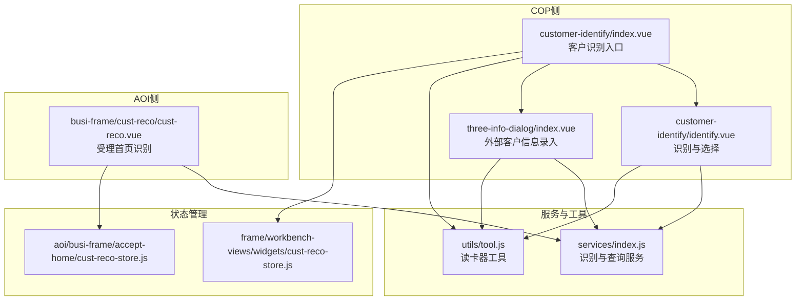
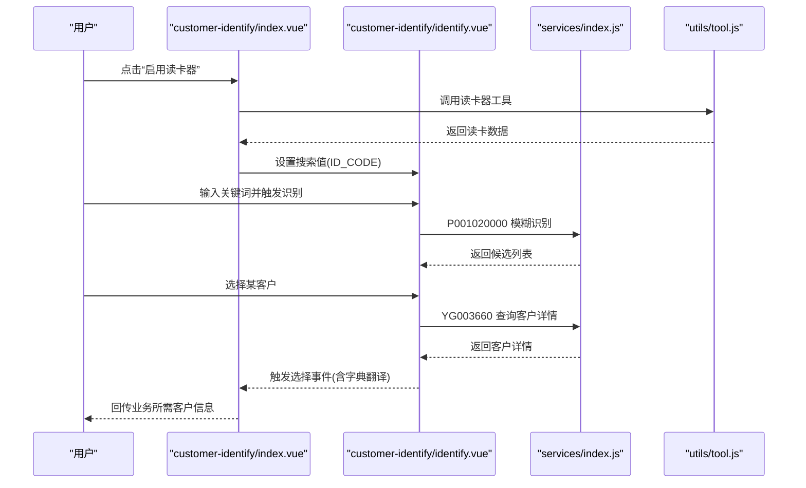
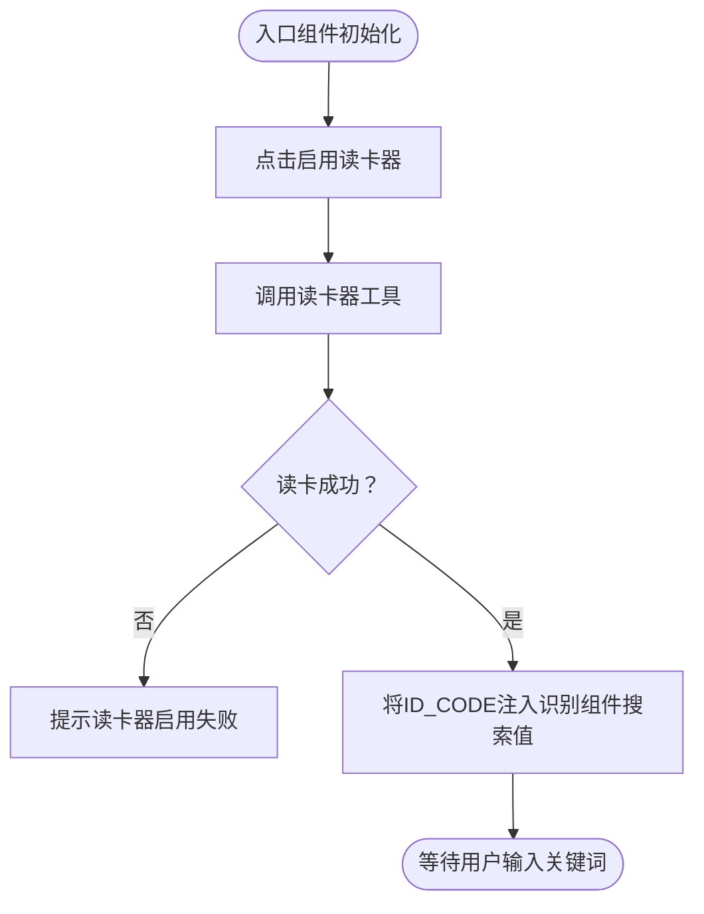
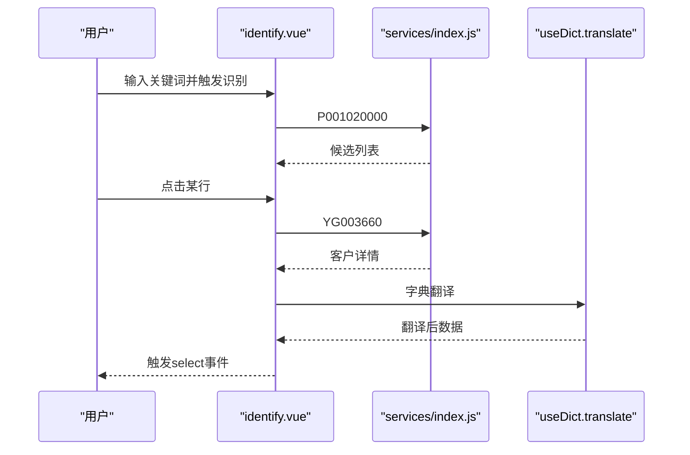
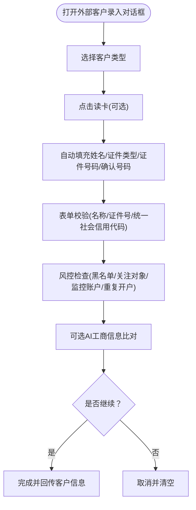
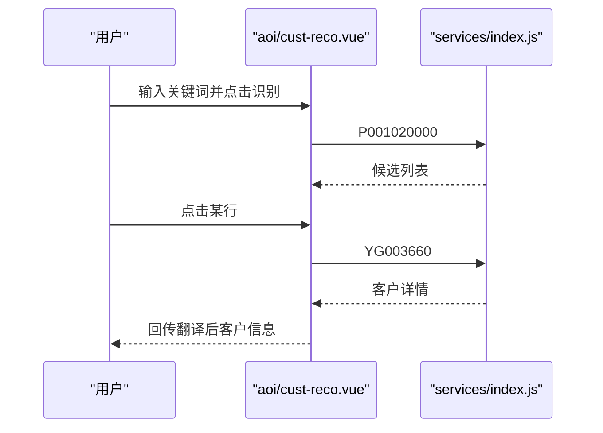
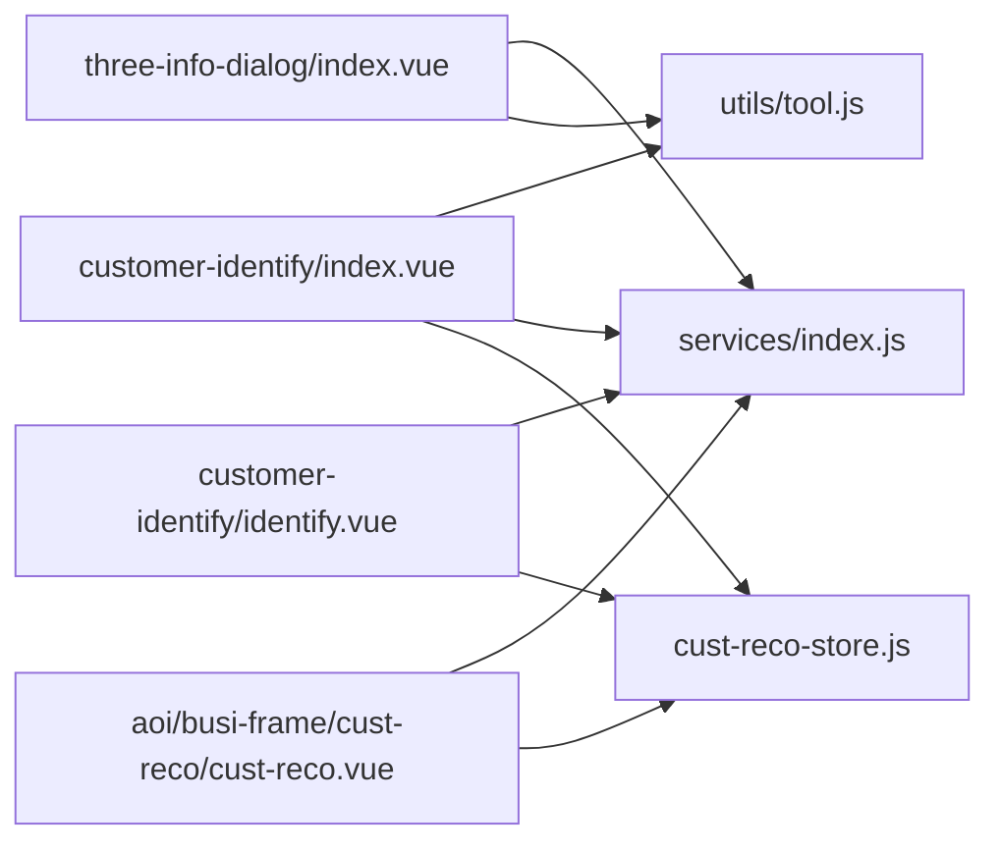

# 客户识别模块

<cite>
**本文档引用的文件**
- [src/pages/cop/modules/customer-identify/index.vue](file://src/pages/cop/modules/customer-identify/index.vue)
- [src/pages/cop/modules/customer-identify/identify.vue](file://src/pages/cop/modules/customer-identify/identify.vue)
- [src/pages/cop/modules/three-info-dialog/index.vue](file://src/pages/cop/modules/three-info-dialog/index.vue)
- [src/pages/aoi/busi-frame/cust-reco/cust-reco.vue](file://src/pages/aoi/busi-frame/cust-reco/cust-reco.vue)
- [src/pages/cop/services/index.js](file://src/pages/cop/services/index.js)
- [src/pages/cop/utils/tool.js](file://src/pages/cop/utils/tool.js)
- [src/pages/frame/workbench-views/widgets/cust-reco/cust-reco-store.js](file://src/pages/frame/workbench-views/widgets/cust-reco/cust-reco-store.js)
- [src/pages/aoi/busi-frame/accept-home/cust-reco/cust-reco-store.js](file://src/pages/aoi/busi-frame/accept-home/cust-reco/cust-reco-store.js)
</cite>

## 目录
1. [简介](#简介)
2. [项目结构](#项目结构)
3. [核心组件](#核心组件)
4. [架构总览](#架构总览)
5. [详细组件分析](#详细组件分析)
6. [依赖关系分析](#依赖关系分析)
7. [性能考虑](#性能考虑)
8. [故障排查指南](#故障排查指南)
9. [结论](#结论)
10. [附录](#附录)

## 简介
本技术文档面向AOI系统的客户识别模块，系统性阐述客户识别的实现原理、身份证读卡器集成、OCR识别现状、客户信息验证流程，以及客户信息的采集、验证、存储与展示机制。文档还覆盖状态管理、数据流转与错误处理策略，并给出典型业务场景示例（如客户信息录入、身份验证、风险评估），以及与系统其他模块的集成关系与数据交互方式。

## 项目结构
客户识别功能主要分布在以下位置：
- COP侧客户识别入口与识别逻辑：customer-identify 模块
- 外部客户信息录入与校验：three-info-dialog 模块
- AOI受理首页客户识别：busi-frame/cust-reco
- 服务封装与工具库：services/index.js、utils/tool.js
- 多处工作台/页面级状态管理：cust-reco-store.js

图表来源
- [src/pages/cop/modules/customer-identify/index.vue](file://src/pages/cop/modules/customer-identify/index.vue#L1-L117)
- [src/pages/cop/modules/customer-identify/identify.vue](file://src/pages/cop/modules/customer-identify/identify.vue#L1-L257)
- [src/pages/cop/modules/three-info-dialog/index.vue](file://src/pages/cop/modules/three-info-dialog/index.vue#L1-L603)
- [src/pages/aoi/busi-frame/cust-reco/cust-reco.vue](file://src/pages/aoi/busi-frame/cust-reco/cust-reco.vue#L1-L214)
- [src/pages/cop/services/index.js](file://src/pages/cop/services/index.js#L1-L36)
- [src/pages/cop/utils/tool.js](file://src/pages/cop/utils/tool.js#L1-L364)
- [src/pages/frame/workbench-views/widgets/cust-reco/cust-reco-store.js](file://src/pages/frame/workbench-views/widgets/cust-reco/cust-reco-store.js#L1-L20)
- [src/pages/aoi/busi-frame/accept-home/cust-reco/cust-reco-store.js](file://src/pages/aoi/busi-frame/accept-home/cust-reco/cust-reco-store.js#L1-L20)

章节来源
- [src/pages/cop/modules/customer-identify/index.vue](file://src/pages/cop/modules/customer-identify/index.vue#L1-L117)
- [src/pages/cop/modules/customer-identify/identify.vue](file://src/pages/cop/modules/customer-identify/identify.vue#L1-L257)
- [src/pages/cop/modules/three-info-dialog/index.vue](file://src/pages/cop/modules/three-info-dialog/index.vue#L1-L603)
- [src/pages/aoi/busi-frame/cust-reco/cust-reco.vue](file://src/pages/aoi/busi-frame/cust-reco/cust-reco.vue#L1-L214)
- [src/pages/cop/services/index.js](file://src/pages/cop/services/index.js#L1-L36)
- [src/pages/cop/utils/tool.js](file://src/pages/cop/utils/tool.js#L1-L364)
- [src/pages/frame/workbench-views/widgets/cust-reco/cust-reco-store.js](file://src/pages/frame/workbench-views/widgets/cust-reco/cust-reco-store.js#L1-L20)
- [src/pages/aoi/busi-frame/accept-home/cust-reco/cust-reco-store.js](file://src/pages/aoi/busi-frame/accept-home/cust-reco/cust-reco-store.js#L1-L20)

## 核心组件
- 客户识别入口组件：负责触发外部客户录入、OCR识别占位、启用读卡器，并将识别结果回传上层业务。
- 识别与选择组件：提供输入框与结果表格，执行模糊识别、字典翻译、客户详情查询与选择。
- 外部客户信息录入组件：支持个人/机构/产品三类客户类型，读卡器联动、统一社会信用代码自动推导、多维校验与风控检查。
- AOI受理首页识别组件：面向受理首页的快速识别入口，支持字典翻译与客户详情查询。
- 服务封装：统一暴露识别、选择、基础资料查询等服务。
- 工具库：读卡器调用、身份证/统一社会信用代码校验、字符串长度计算等。
- 状态管理：多处工作台/页面级store，维护“已识别”状态与客户信息。

章节来源
- [src/pages/cop/modules/customer-identify/index.vue](file://src/pages/cop/modules/customer-identify/index.vue#L1-L117)
- [src/pages/cop/modules/customer-identify/identify.vue](file://src/pages/cop/modules/customer-identify/identify.vue#L1-L257)
- [src/pages/cop/modules/three-info-dialog/index.vue](file://src/pages/cop/modules/three-info-dialog/index.vue#L1-L603)
- [src/pages/aoi/busi-frame/cust-reco/cust-reco.vue](file://src/pages/aoi/busi-frame/cust-reco/cust-reco.vue#L1-L214)
- [src/pages/cop/services/index.js](file://src/pages/cop/services/index.js#L1-L36)
- [src/pages/cop/utils/tool.js](file://src/pages/cop/utils/tool.js#L1-L364)
- [src/pages/frame/workbench-views/widgets/cust-reco/cust-reco-store.js](file://src/pages/frame/workbench-views/widgets/cust-reco/cust-reco-store.js#L1-L20)
- [src/pages/aoi/busi-frame/accept-home/cust-reco/cust-reco-store.js](file://src/pages/aoi/busi-frame/accept-home/cust-reco/cust-reco-store.js#L1-L20)

## 架构总览
客户识别整体采用“入口组件 -> 识别组件 -> 服务层 -> 工具库 -> 状态管理”的分层设计。入口组件负责用户交互与业务分支（外部客户、读卡器、OCR占位），识别组件负责输入校验、模糊匹配、字典翻译与详情查询，服务层封装BEX接口，工具库提供读卡器与校验能力，状态管理贯穿多个页面以保持识别结果的一致性。

图表来源
- [src/pages/cop/modules/customer-identify/index.vue](file://src/pages/cop/modules/customer-identify/index.vue#L25-L68)
- [src/pages/cop/modules/customer-identify/identify.vue](file://src/pages/cop/modules/customer-identify/identify.vue#L38-L113)
- [src/pages/cop/services/index.js](file://src/pages/cop/services/index.js#L6-L10)
- [src/pages/cop/utils/tool.js](file://src/pages/cop/utils/tool.js#L9-L25)

## 详细组件分析

### 客户识别入口组件（COP）
- 功能要点
  - 提供“外部客户”“OCR识别”“启用读卡器”三个入口按钮。
  - 通过读卡器工具回调，将读取到的身份证信息注入识别组件的搜索值。
  - 将识别结果映射为业务可用的客户信息（含业务范围BUSI_SCOPE、读卡标记等）。

图表来源
- [src/pages/cop/modules/customer-identify/index.vue](file://src/pages/cop/modules/customer-identify/index.vue#L31-L44)

章节来源
- [src/pages/cop/modules/customer-identify/index.vue](file://src/pages/cop/modules/customer-identify/index.vue#L1-L117)

### 识别与选择组件（COP）
- 功能要点
  - 输入校验：至少4个字符（中文按双字符计）。
  - 模糊识别：调用P001020000接口返回候选列表。
  - 结果展示：表格展示客户名称、客户代码、资金账号、开户时间、营业部。
  - 详情查询：调用YG003660接口获取客户基础信息，并进行字典翻译（如证件类型、客户状态、机构全称等）。
  - 选择回调：将翻译后的客户信息与Agent列表、LegalInfo回传给上层。

图表来源
- [src/pages/cop/modules/customer-identify/identify.vue](file://src/pages/cop/modules/customer-identify/identify.vue#L38-L113)
- [src/pages/cop/services/index.js](file://src/pages/cop/services/index.js#L6-L10)

章节来源
- [src/pages/cop/modules/customer-identify/identify.vue](file://src/pages/cop/modules/customer-identify/identify.vue#L1-L257)
- [src/pages/cop/services/index.js](file://src/pages/cop/services/index.js#L1-L36)

### 外部客户信息录入组件（COP）
- 功能要点
  - 支持个人/机构/产品三类客户类型，动态过滤可用证件类型。
  - 读卡器联动：读卡成功后自动填充姓名、证件类型、证件号码、确认证件号码，并推导组织机构代码证。
  - 多维校验：客户名称长度校验、两次证件号码一致性、身份证/统一社会信用代码格式校验。
  - 风控检查：第三方交易关联校验、黑名单校验、中登实名制关注对象、重点监控账户、重复开户提示等。
  - AI工商信息：可选开启天眼查工商信息比对，未命中时提供继续提示。

图表来源
- [src/pages/cop/modules/three-info-dialog/index.vue](file://src/pages/cop/modules/three-info-dialog/index.vue#L351-L460)

章节来源
- [src/pages/cop/modules/three-info-dialog/index.vue](file://src/pages/cop/modules/three-info-dialog/index.vue#L1-L603)

### AOI受理首页识别组件（AOI）
- 功能要点
  - 在受理首页提供快速识别入口，输入客户名称/客户代码/证件号码/资金账号等。
  - 调用P001020000进行模糊识别，点击候选行后调用YG003660获取详情，并进行字典翻译。
  - 将翻译后的客户信息回传给上层业务。

图表来源
- [src/pages/aoi/busi-frame/cust-reco/cust-reco.vue](file://src/pages/aoi/busi-frame/cust-reco/cust-reco.vue#L18-L91)
- [src/pages/cop/services/index.js](file://src/pages/cop/services/index.js#L6-L10)

章节来源
- [src/pages/aoi/busi-frame/cust-reco/cust-reco.vue](file://src/pages/aoi/busi-frame/cust-reco/cust-reco.vue#L1-L214)

### 服务封装与工具库
- 服务封装
  - customerIdentify：P001020000 模糊识别
  - customerIdentifySelect：YG003660 客户详情查询
  - getCustBaseData：YG003660 客户基础资料查询
- 工具库
  - 读卡器：readIdCard，格式化读卡数据formatIdCardData，输出包含证件类型、证件号码、姓名、地址、生日、有效期、性别、民族等字段。
  - 校验：isIdCard、transIdCardTo18/15、isUnifiedSocialCreditCode、getOrgIdCode等。
  - 辅助：getStrByteLength、transformMoney、paddingNum、isCommonChar等。

章节来源
- [src/pages/cop/services/index.js](file://src/pages/cop/services/index.js#L1-L36)
- [src/pages/cop/utils/tool.js](file://src/pages/cop/utils/tool.js#L1-L364)

### 状态管理
- 多处cust-reco-store.js用于维护“已识别”状态与客户信息，便于在不同页面间共享识别结果。
- store提供updateCustInfo与clearStore，确保识别结果与清理逻辑一致。

章节来源
- [src/pages/frame/workbench-views/widgets/cust-reco/cust-reco-store.js](file://src/pages/frame/workbench-views/widgets/cust-reco/cust-reco-store.js#L1-L20)
- [src/pages/aoi/busi-frame/accept-home/cust-reco/cust-reco-store.js](file://src/pages/aoi/busi-frame/accept-home/cust-reco/cust-reco-store.js#L1-L20)

## 依赖关系分析
- 组件耦合
  - 入口组件依赖工具库（读卡器）、服务封装（识别/查询）、状态管理（store）。
  - 识别组件依赖服务封装与字典翻译，最终通过事件向上回传。
  - 外部客户录入组件依赖服务封装、工具库、风控与AI信息校验。
- 外部依赖
  - 读卡器插件：window.getClientPlugin('idReader')，需浏览器端插件环境。
  - BEX服务：P001020000、YG003660等接口。
- 潜在循环依赖
  - 组件间通过事件与store解耦，未见明显循环依赖。

图表来源
- [src/pages/cop/modules/customer-identify/index.vue](file://src/pages/cop/modules/customer-identify/index.vue#L1-L117)
- [src/pages/cop/modules/customer-identify/identify.vue](file://src/pages/cop/modules/customer-identify/identify.vue#L1-L257)
- [src/pages/cop/modules/three-info-dialog/index.vue](file://src/pages/cop/modules/three-info-dialog/index.vue#L1-L603)
- [src/pages/aoi/busi-frame/cust-reco/cust-reco.vue](file://src/pages/aoi/busi-frame/cust-reco/cust-reco.vue#L1-L214)
- [src/pages/cop/services/index.js](file://src/pages/cop/services/index.js#L1-L36)
- [src/pages/cop/utils/tool.js](file://src/pages/cop/utils/tool.js#L1-L364)
- [src/pages/frame/workbench-views/widgets/cust-reco/cust-reco-store.js](file://src/pages/frame/workbench-views/widgets/cust-reco/cust-reco-store.js#L1-L20)
- [src/pages/aoi/busi-frame/accept-home/cust-reco/cust-reco-store.js](file://src/pages/aoi/busi-frame/accept-home/cust-reco/cust-reco-store.js#L1-L20)

## 性能考虑
- 识别请求节流：组件内已设置识别状态标志，避免重复触发；建议在输入端增加防抖策略，降低高频输入带来的请求压力。
- URL参数控制：详情查询时删除超长字段，避免URL过长导致异常。
- 字典翻译：一次性批量翻译关键字段，减少多次网络请求。
- 读卡器回调：仅在设备状态正常时注册回调，避免无效轮询。

## 故障排查指南
- 读卡器启用失败
  - 现象：提示“身份证阅读器启用失败”。
  - 排查：确认window.getClientPlugin存在、插件初始化成功、设备状态为可用。
  - 参考路径：[src/pages/cop/modules/customer-identify/index.vue](file://src/pages/cop/modules/customer-identify/index.vue#L32-L44)，[src/pages/cop/utils/tool.js](file://src/pages/cop/utils/tool.js#L9-L25)
- 识别结果为空
  - 现象：模糊识别无候选或详情查询无数据。
  - 排查：确认输入字符长度（至少4字符）、接口可用性、数据是否存在。
  - 参考路径：[src/pages/cop/modules/customer-identify/identify.vue](file://src/pages/cop/modules/customer-identify/identify.vue#L38-L77)，[src/pages/aoi/busi-frame/cust-reco/cust-reco.vue](file://src/pages/aoi/busi-frame/cust-reco/cust-reco.vue#L18-L51)
- 外部客户录入校验失败
  - 现象：客户名称长度不足、两次证件号码不一致、身份证/统一社会信用代码格式错误。
  - 排查：检查校验规则、读卡器联动是否正确填充、统一社会信用代码是否符合18位规则。
  - 参考路径：[src/pages/cop/modules/three-info-dialog/index.vue](file://src/pages/cop/modules/three-info-dialog/index.vue#L210-L242)，[src/pages/cop/utils/tool.js](file://src/pages/cop/utils/tool.js#L89-L195)，[src/pages/cop/utils/tool.js](file://src/pages/cop/utils/tool.js#L230-L256)
- 风控拦截
  - 现象：黑名单、关注对象、监控账户或重复开户提示。
  - 排查：核对风控参数配置、相关系统开关、是否允许跨机构/重复开户。
  - 参考路径：[src/pages/cop/modules/three-info-dialog/index.vue](file://src/pages/cop/modules/three-info-dialog/index.vue#L462-L536)

章节来源
- [src/pages/cop/modules/customer-identify/index.vue](file://src/pages/cop/modules/customer-identify/index.vue#L32-L44)
- [src/pages/cop/modules/customer-identify/identify.vue](file://src/pages/cop/modules/customer-identify/identify.vue#L38-L77)
- [src/pages/aoi/busi-frame/cust-reco/cust-reco.vue](file://src/pages/aoi/busi-frame/cust-reco/cust-reco.vue#L18-L51)
- [src/pages/cop/modules/three-info-dialog/index.vue](file://src/pages/cop/modules/three-info-dialog/index.vue#L210-L242)
- [src/pages/cop/utils/tool.js](file://src/pages/cop/utils/tool.js#L89-L195)
- [src/pages/cop/utils/tool.js](file://src/pages/cop/utils/tool.js#L230-L256)
- [src/pages/cop/modules/three-info-dialog/index.vue](file://src/pages/cop/modules/three-info-dialog/index.vue#L462-L536)

## 结论
客户识别模块通过清晰的分层设计与完善的工具链，实现了从输入校验、模糊识别、详情查询到字典翻译与风控校验的完整闭环。读卡器集成与外部客户录入流程提升了业务效率与准确性。建议在后续迭代中完善OCR识别能力、增强输入防抖与缓存策略，并持续优化风控参数与提示体验。

## 附录

### 业务场景示例
- 客户信息录入
  - 场景：外部客户首次录入，选择客户类型、读卡器联动、统一社会信用代码自动推导、多维校验与风控检查。
  - 关键路径：[src/pages/cop/modules/three-info-dialog/index.vue](file://src/pages/cop/modules/three-info-dialog/index.vue#L351-L460)
- 身份验证
  - 场景：受理前通过读卡器快速获取客户身份信息，结合字典翻译与业务范围映射。
  - 关键路径：[src/pages/cop/modules/customer-identify/index.vue](file://src/pages/cop/modules/customer-identify/index.vue#L31-L68)，[src/pages/cop/utils/tool.js](file://src/pages/cop/utils/tool.js#L32-L78)
- 风险评估
  - 场景：基于黑名单、关注对象、监控账户与重复开户策略进行风险拦截与提示。
  - 关键路径：[src/pages/cop/modules/three-info-dialog/index.vue](file://src/pages/cop/modules/three-info-dialog/index.vue#L462-L536)

### 与其他模块的集成关系
- 与工作台/受理首页：通过store共享识别状态与客户信息，保证跨页面一致性。
- 与风控与AI模块：外部客户录入阶段可选接入AI工商信息比对与风控检查。
- 与字典系统：识别与详情查询后进行字典翻译，提升展示与业务适配能力。

章节来源
- [src/pages/frame/workbench-views/widgets/cust-reco/cust-reco-store.js](file://src/pages/frame/workbench-views/widgets/cust-reco/cust-reco-store.js#L1-L20)
- [src/pages/aoi/busi-frame/accept-home/cust-reco/cust-reco-store.js](file://src/pages/aoi/busi-frame/accept-home/cust-reco/cust-reco-store.js#L1-L20)
- [src/pages/cop/modules/three-info-dialog/index.vue](file://src/pages/cop/modules/three-info-dialog/index.vue#L414-L460)