# 工作台视图

<cite>
**本文引用的文件**
- [workbench.vue](file://src/portal/views/workbench/workbench.vue)
- [workbench-store.js](file://src/portal/views/workbench/workbench-store.js)
- [use-workbench.js](file://src/portal/views/workbench/use-workbench.js)
- [desktop-view.vue](file://src/portal/views/workbench/desktop-view/desktop-view.vue)
- [desktop-bar.vue](file://src/portal/views/workbench/desktop-bar/desktop-bar.vue)
- [application-bar.vue](file://src/portal/views/workbench/application-bar/application-bar.vue)
- [main-view.vue](file://src/portal/views/workbench/application-view/main-view.vue)
- [setting-center.vue](file://src/portal/views/workbench/setting-center/setting-center.vue)
- [app-center.vue](file://src/pages/frame/workbench-views/apps/app-center/app-center.vue)
- [todo-list.vue](file://src/pages/frame/workbench-views/widgets/todo-list/todo-list.vue)
- [calendar-reminder.vue](file://src/pages/frame/workbench-views/widgets/calendar-reminder/calendar-reminder.vue)
- [my-busi.vue](file://src/pages/frame/workbench-views/widgets/my-busi/my-busi.vue)
- [org-daily-static.vue](file://src/pages/frame/workbench-views/widgets/org-daily-static/org-daily-static.vue)
- [busi-daily-static.vue](file://src/pages/frame/workbench-views/widgets/busi-daily-static/busi-daily-static.vue)
- [my-busi-charts.vue](file://src/pages/frame/workbench-views/widgets/my-busi-charts/my-busi-charts.vue)
- [cust-reco.vue](file://src/pages/frame/workbench-views/widgets/cust-reco/cust-reco.vue)
- [index.js](file://src/pages/frame/index.js)
</cite>

## 目录
1. [简介](#简介)
2. [项目结构](#项目结构)
3. [核心组件](#核心组件)
4. [架构总览](#架构总览)
5. [组件详解](#组件详解)
6. [依赖关系分析](#依赖关系分析)
7. [性能考量](#性能考量)
8. [故障排查指南](#故障排查指南)
9. [结论](#结论)
10. [附录：定制化开发指南](#附录定制化开发指南)

## 简介
本文件面向AOI系统工作台视图模块，系统性阐述工作台的布局设计、组件管理、视图切换机制，并深入解析各类小部件(widgets)的功能与实现，涵盖业务统计、待办事项、日历提醒等。同时，文档覆盖应用中心管理、桌面布局自定义、视图状态持久化策略，解释工作台与业务模块的集成方式、数据共享机制与权限控制要点，并提供可操作的定制化开发指南。

## 项目结构
工作台位于门户层与框架层之间，采用“视图容器 + 应用视图 + 小部件”的分层组织：
- 视图容器：工作台主入口、桌面视图、桌面导航条、应用状态栏、设置中心
- 应用视图：应用打开、最小化、拖拽、层级管理
- 小部件：业务统计、待办清单、日历提醒、客户识别等

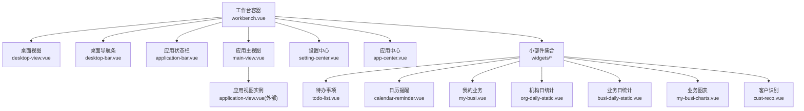

**图表来源**
- [workbench.vue](file://src/portal/views/workbench/workbench.vue#L129-L162)
- [desktop-view.vue](file://src/portal/views/workbench/desktop-view/desktop-view.vue#L94-L113)
- [desktop-bar.vue](file://src/portal/views/workbench/desktop-bar/desktop-bar.vue#L172-L226)
- [application-bar.vue](file://src/portal/views/workbench/application-bar/application-bar.vue#L1-L43)
- [main-view.vue](file://src/portal/views/workbench/application-view/main-view.vue#L168-L181)
- [setting-center.vue](file://src/portal/views/workbench/setting-center/setting-center.vue#L10-L15)
- [app-center.vue](file://src/pages/frame/workbench-views/apps/app-center/app-center.vue#L55-L94)
- [todo-list.vue](file://src/pages/frame/workbench-views/widgets/todo-list/todo-list.vue#L1-L313)
- [calendar-reminder.vue](file://src/pages/frame/workbench-views/widgets/calendar-reminder/calendar-reminder.vue#L1-L112)
- [my-busi.vue](file://src/pages/frame/workbench-views/widgets/my-busi/my-busi.vue#L1-L167)
- [org-daily-static.vue](file://src/pages/frame/workbench-views/widgets/org-daily-static/org-daily-static.vue#L1-L23)
- [busi-daily-static.vue](file://src/pages/frame/workbench-views/widgets/busi-daily-static/busi-daily-static.vue#L1-L23)
- [my-busi-charts.vue](file://src/pages/frame/workbench-views/widgets/my-busi-charts/my-busi-charts.vue#L1-L16)
- [cust-reco.vue](file://src/pages/frame/workbench-views/widgets/cust-reco/cust-reco.vue#L1-L381)

**章节来源**
- [workbench.vue](file://src/portal/views/workbench/workbench.vue#L1-L235)
- [desktop-view.vue](file://src/portal/views/workbench/desktop-view/desktop-view.vue#L1-L137)
- [desktop-bar.vue](file://src/portal/views/workbench/desktop-bar/desktop-bar.vue#L1-L409)
- [application-bar.vue](file://src/portal/views/workbench/application-bar/application-bar.vue#L1-L43)
- [main-view.vue](file://src/portal/views/workbench/application-view/main-view.vue#L1-L194)
- [setting-center.vue](file://src/portal/views/workbench/setting-center/setting-center.vue#L1-L46)
- [app-center.vue](file://src/pages/frame/workbench-views/apps/app-center/app-center.vue#L1-L175)
- [todo-list.vue](file://src/pages/frame/workbench-views/widgets/todo-list/todo-list.vue#L1-L313)
- [calendar-reminder.vue](file://src/pages/frame/workbench-views/widgets/calendar-reminder/calendar-reminder.vue#L1-L112)
- [my-busi.vue](file://src/pages/frame/workbench-views/widgets/my-busi/my-busi.vue#L1-L167)
- [org-daily-static.vue](file://src/pages/frame/workbench-views/widgets/org-daily-static/org-daily-static.vue#L1-L23)
- [busi-daily-static.vue](file://src/pages/frame/workbench-views/widgets/busi-daily-static/busi-daily-static.vue#L1-L23)
- [my-busi-charts.vue](file://src/pages/frame/workbench-views/widgets/my-busi-charts/my-busi-charts.vue#L1-L16)
- [cust-reco.vue](file://src/pages/frame/workbench-views/widgets/cust-reco/cust-reco.vue#L1-L381)

## 核心组件
- 工作台容器：负责初始化应用列表、固定应用、用户设置同步与主题切换；承载桌面视图、应用视图、应用状态栏、设置中心等子视图。
- 桌面视图：支持多桌面垂直滚动切换，应用拖拽排序与滚动边界控制。
- 桌面导航条：桌面标签拖拽排序、右键菜单、添加/编辑/删除桌面。
- 应用状态栏：打开的应用列表展示与点击跳转。
- 应用主视图：应用打开、最小化、拖拽、层级管理与焦点切换。
- 设置中心：统一入口弹出设置对话框，支持主题、字体、桌面背景等个性化配置。
- 应用中心：应用安装、分组浏览、添加至桌面。
- 小部件：业务统计、待办清单、日历提醒、客户识别等。

**章节来源**
- [workbench.vue](file://src/portal/views/workbench/workbench.vue#L1-L235)
- [workbench-store.js](file://src/portal/views/workbench/workbench-store.js#L1-L15)
- [use-workbench.js](file://src/portal/views/workbench/use-workbench.js#L1-L222)
- [desktop-view.vue](file://src/portal/views/workbench/desktop-view/desktop-view.vue#L1-L137)
- [desktop-bar.vue](file://src/portal/views/workbench/desktop-bar/desktop-bar.vue#L1-L409)
- [application-bar.vue](file://src/portal/views/workbench/application-bar/application-bar.vue#L1-L43)
- [main-view.vue](file://src/portal/views/workbench/application-view/main-view.vue#L1-L194)
- [setting-center.vue](file://src/portal/views/workbench/setting-center/setting-center.vue#L1-L46)
- [app-center.vue](file://src/pages/frame/workbench-views/apps/app-center/app-center.vue#L1-L175)

## 架构总览
工作台采用“容器-视图-小部件”三层架构，数据流自上而下：
- 初始化阶段：从服务端获取桌面、应用、固定应用与用户自定义设置，同步到本地设置存储并应用主题与字体。
- 运行阶段：桌面导航条与桌面视图联动，应用主视图管理应用窗口生命周期，应用状态栏展示已打开应用，设置中心提供个性化配置入口，应用中心提供应用安装与布局调整能力。
- 数据共享：通过事件总线与Pinia Store在组件间传递状态；小部件通过通用UI库与请求封装进行数据访问。

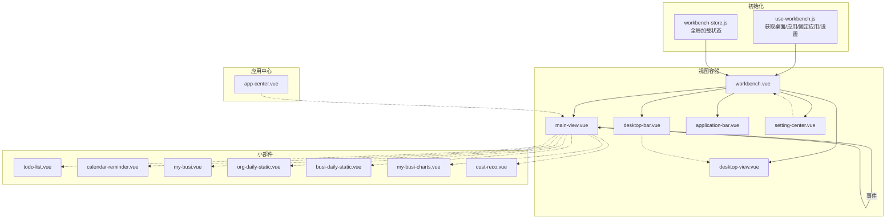

**图表来源**
- [use-workbench.js](file://src/portal/views/workbench/use-workbench.js#L4-L122)
- [workbench-store.js](file://src/portal/views/workbench/workbench-store.js#L1-L15)
- [workbench.vue](file://src/portal/views/workbench/workbench.vue#L52-L96)
- [desktop-bar.vue](file://src/portal/views/workbench/desktop-bar/desktop-bar.vue#L104-L147)
- [desktop-view.vue](file://src/portal/views/workbench/desktop-view/desktop-view.vue#L24-L87)
- [main-view.vue](file://src/portal/views/workbench/application-view/main-view.vue#L30-L86)
- [application-bar.vue](file://src/portal/views/workbench/application-bar/application-bar.vue#L21-L31)
- [setting-center.vue](file://src/portal/views/workbench/setting-center/setting-center.vue#L5-L7)
- [app-center.vue](file://src/pages/frame/workbench-views/apps/app-center/app-center.vue#L14-L53)
- [todo-list.vue](file://src/pages/frame/workbench-views/widgets/todo-list/todo-list.vue#L1-L313)
- [calendar-reminder.vue](file://src/pages/frame/workbench-views/widgets/calendar-reminder/calendar-reminder.vue#L1-L112)
- [my-busi.vue](file://src/pages/frame/workbench-views/widgets/my-busi/my-busi.vue#L1-L167)
- [org-daily-static.vue](file://src/pages/frame/workbench-views/widgets/org-daily-static/org-daily-static.vue#L1-L23)
- [busi-daily-static.vue](file://src/pages/frame/workbench-views/widgets/busi-daily-static/busi-daily-static.vue#L1-L23)
- [my-busi-charts.vue](file://src/pages/frame/workbench-views/widgets/my-busi-charts/my-busi-charts.vue#L1-L16)
- [cust-reco.vue](file://src/pages/frame/workbench-views/widgets/cust-reco/cust-reco.vue#L1-L381)

## 组件详解

### 工作台容器与初始化流程
- 初始化：并行拉取应用列表、固定应用与用户自定义设置，映射键值并更新设置存储，随后应用主题与字号。
- 用户事件：监听登录/登出事件以刷新页面；监听应用列表变更事件以更新桌面应用。
- 条件渲染：根据用户岗位显示客户识别与客户访问组件。

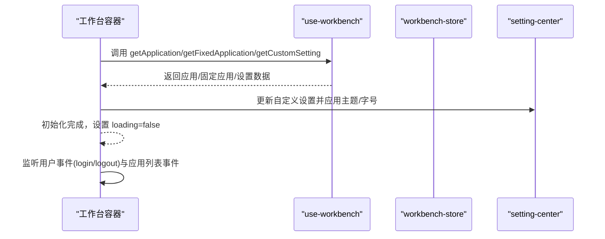

**图表来源**
- [workbench.vue](file://src/portal/views/workbench/workbench.vue#L52-L96)
- [use-workbench.js](file://src/portal/views/workbench/use-workbench.js#L16-L122)
- [use-workbench.js](file://src/portal/views/workbench/use-workbench.js#L167-L195)

**章节来源**
- [workbench.vue](file://src/portal/views/workbench/workbench.vue#L52-L117)
- [workbench-store.js](file://src/portal/views/workbench/workbench-store.js#L1-L15)
- [use-workbench.js](file://src/portal/views/workbench/use-workbench.js#L1-L222)

### 桌面视图与桌面导航条
- 桌面视图：支持多桌面垂直滚动切换，监听滚轮事件与滚动边界，动态计算高度与位移。
- 桌面导航条：桌面标签拖拽排序，右键菜单支持编辑/删除，浮动面板支持快速命名与添加桌面。

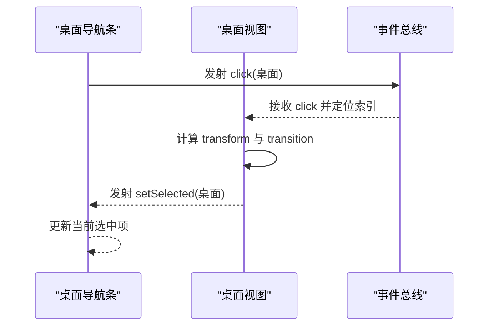

**图表来源**
- [desktop-bar.vue](file://src/portal/views/workbench/desktop-bar/desktop-bar.vue#L48-L110)
- [desktop-view.vue](file://src/portal/views/workbench/desktop-view/desktop-view.vue#L28-L87)

**章节来源**
- [desktop-view.vue](file://src/portal/views/workbench/desktop-view/desktop-view.vue#L1-L137)
- [desktop-bar.vue](file://src/portal/views/workbench/desktop-bar/desktop-bar.vue#L1-L409)

### 应用主视图与应用状态栏
- 应用主视图：集中管理已打开应用的层级、最小化、拖拽与焦点切换；根据应用用途决定是否需要客户识别与合规检查。
- 应用状态栏：聚合已打开应用，支持点击跳转至对应应用视图。

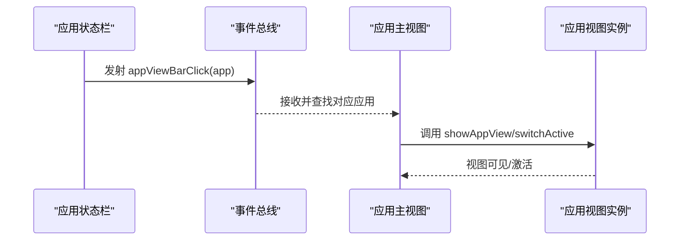

**图表来源**
- [application-bar.vue](file://src/portal/views/workbench/application-bar/application-bar.vue#L25-L31)
- [main-view.vue](file://src/portal/views/workbench/application-view/main-view.vue#L68-L76)

**章节来源**
- [application-bar.vue](file://src/portal/views/workbench/application-bar/application-bar.vue#L1-L43)
- [main-view.vue](file://src/portal/views/workbench/application-view/main-view.vue#L1-L194)

### 设置中心与个性化
- 设置中心：点击设置图标弹出设置对话框，支持主题、字体、桌面背景、应用图标尺寸、应用名称显示、桌面边栏位置、桌面内边距等。
- 自定义设置持久化：通过服务接口保存用户偏好，成功后通知提示。

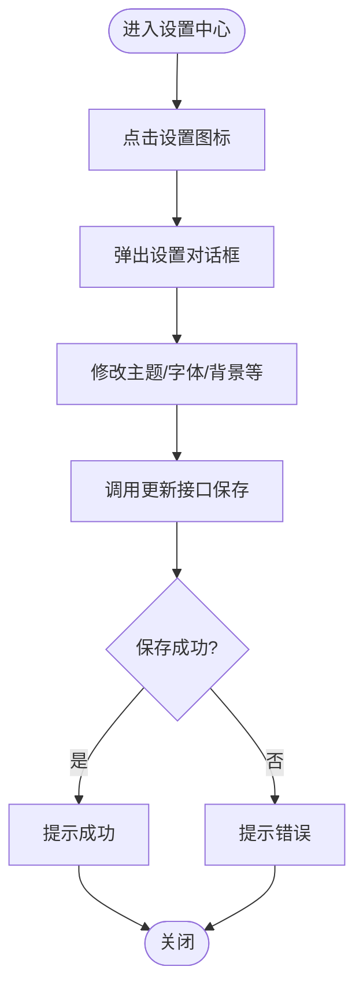

**图表来源**
- [setting-center.vue](file://src/portal/views/workbench/setting-center/setting-center.vue#L5-L7)
- [use-workbench.js](file://src/portal/views/workbench/use-workbench.js#L180-L195)

**章节来源**
- [setting-center.vue](file://src/portal/views/workbench/setting-center/setting-center.vue#L1-L46)
- [use-workbench.js](file://src/portal/views/workbench/use-workbench.js#L169-L195)

### 应用中心与桌面布局自定义
- 应用中心：按分组展示可用应用，支持搜索与添加；已添加应用禁用“添加”按钮。
- 桌面布局自定义：桌面导航条支持拖拽排序与右键菜单编辑/删除；桌面视图支持应用拖拽排序与滚动。

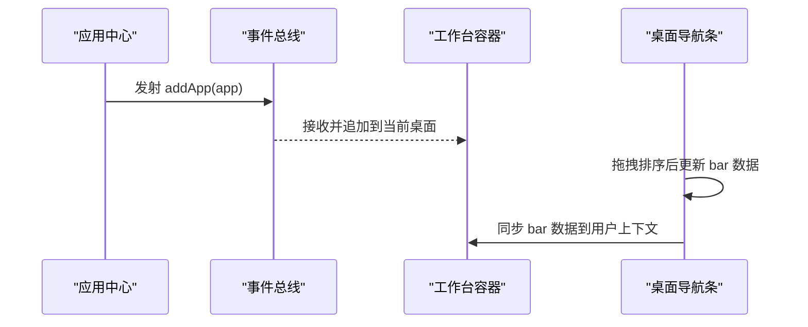

**图表来源**
- [app-center.vue](file://src/pages/frame/workbench-views/apps/app-center/app-center.vue#L49-L53)
- [workbench.vue](file://src/portal/views/workbench/workbench.vue#L120-L126)
- [desktop-bar.vue](file://src/portal/views/workbench/desktop-bar/desktop-bar.vue#L139-L147)

**章节来源**
- [app-center.vue](file://src/pages/frame/workbench-views/apps/app-center/app-center.vue#L1-L175)
- [desktop-bar.vue](file://src/portal/views/workbench/desktop-bar/desktop-bar.vue#L139-L147)
- [workbench.vue](file://src/portal/views/workbench/workbench.vue#L120-L126)

### 小部件：业务统计与待办事项
- 我的业务：展示当日待处理/已完成业务量与完成率，以及本周/本月累计业务量。
- 待办事项：本地持久化（基于用户标识），支持新增、标记完成、展开/折叠完成项、清理完成项。

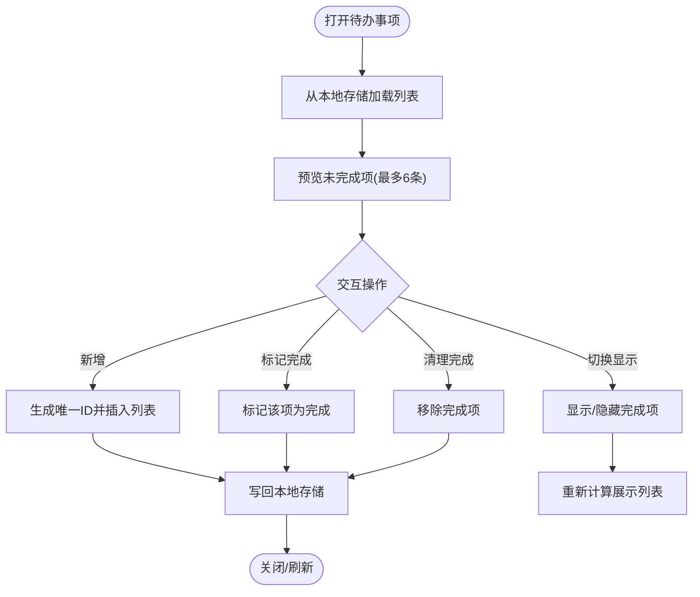

**图表来源**
- [todo-list.vue](file://src/pages/frame/workbench-views/widgets/todo-list/todo-list.vue#L7-L50)
- [todo-list.vue](file://src/pages/frame/workbench-views/widgets/todo-list/todo-list.vue#L63-L73)

**章节来源**
- [my-busi.vue](file://src/pages/frame/workbench-views/widgets/my-busi/my-busi.vue#L1-L167)
- [todo-list.vue](file://src/pages/frame/workbench-views/widgets/todo-list/todo-list.vue#L1-L313)

### 小部件：日历提醒与客户识别
- 日历提醒：点击卡片弹出日历对话框，展示当前日期与农历信息。
- 客户识别：输入检索条件，选择客户后输入密码校验，成功后展示客户基础信息并可跳转客户360。

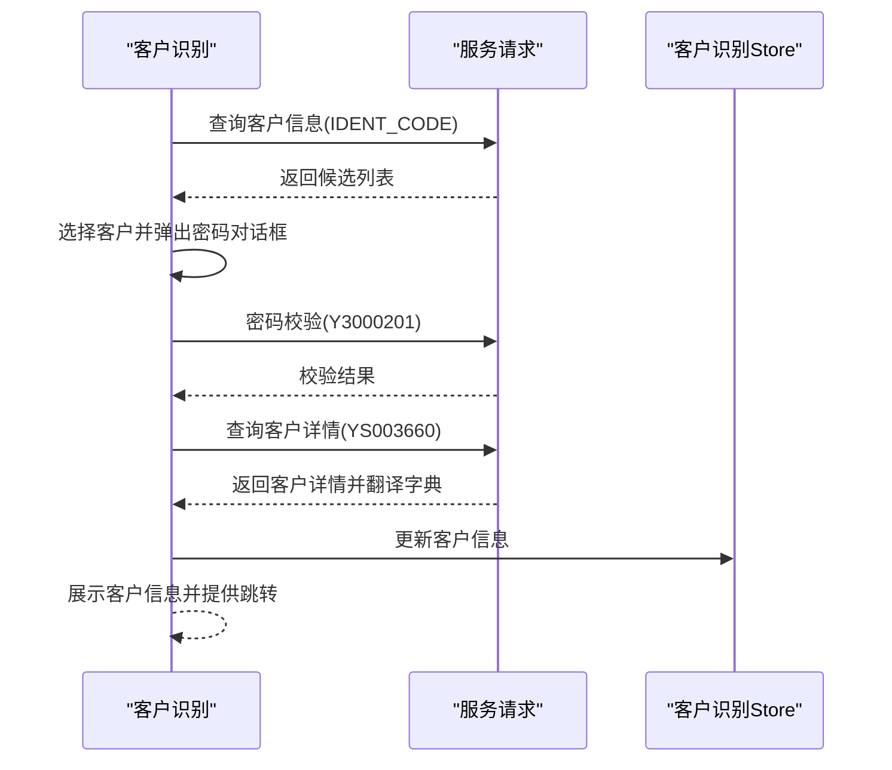

**图表来源**
- [cust-reco.vue](file://src/pages/frame/workbench-views/widgets/cust-reco/cust-reco.vue#L33-L49)
- [cust-reco.vue](file://src/pages/frame/workbench-views/widgets/cust-reco/cust-reco.vue#L71-L126)

**章节来源**
- [calendar-reminder.vue](file://src/pages/frame/workbench-views/widgets/calendar-reminder/calendar-reminder.vue#L1-L112)
- [cust-reco.vue](file://src/pages/frame/workbench-views/widgets/cust-reco/cust-reco.vue#L1-L381)

### 视图状态持久化与权限控制
- 视图状态持久化：应用中心添加应用、待办事项列表均使用本地存储；自定义设置通过服务接口持久化。
- 权限控制：应用主视图根据应用用途（如业务类）要求必须完成客户识别与合规检查，否则阻止打开并提示。

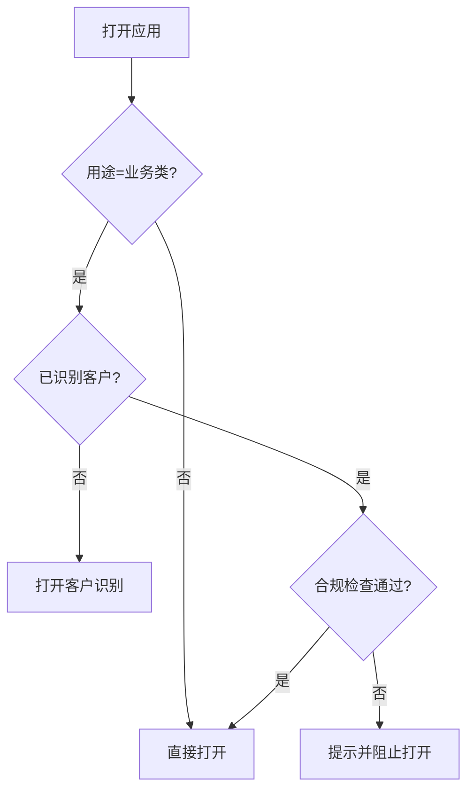

**图表来源**
- [main-view.vue](file://src/portal/views/workbench/application-view/main-view.vue#L30-L41)

**章节来源**
- [app-center.vue](file://src/pages/frame/workbench-views/apps/app-center/app-center.vue#L49-L53)
- [todo-list.vue](file://src/pages/frame/workbench-views/widgets/todo-list/todo-list.vue#L7-L34)
- [use-workbench.js](file://src/portal/views/workbench/use-workbench.js#L180-L195)
- [main-view.vue](file://src/portal/views/workbench/application-view/main-view.vue#L30-L41)

## 依赖关系分析
- 组件耦合：工作台容器对各子视图存在强依赖；桌面视图与桌面导航条通过事件总线解耦；应用主视图通过事件总线与应用状态栏解耦。
- 外部依赖：统一使用KJDP UI组件库与核心能力（请求、加密、系统参数、主题切换）；框架适配层提供兼容性桥接。

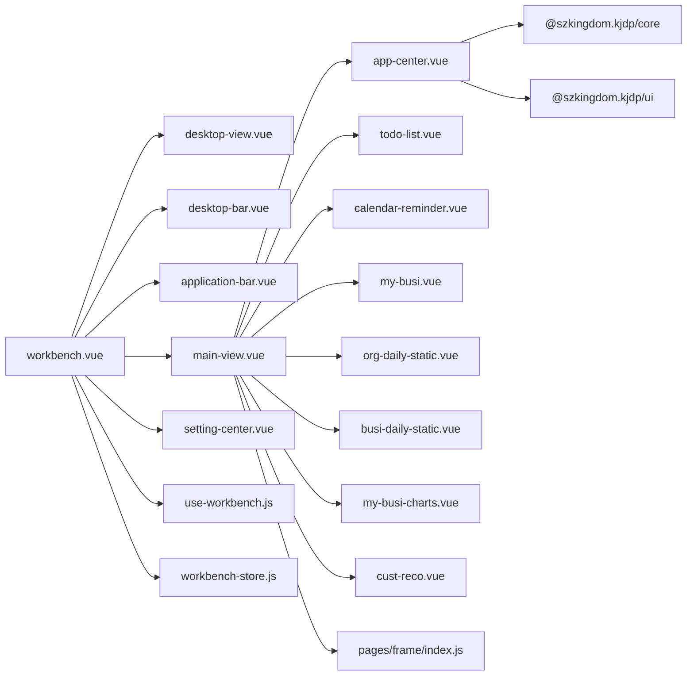

**图表来源**
- [workbench.vue](file://src/portal/views/workbench/workbench.vue#L1-L235)
- [desktop-view.vue](file://src/portal/views/workbench/desktop-view/desktop-view.vue#L1-L137)
- [desktop-bar.vue](file://src/portal/views/workbench/desktop-bar/desktop-bar.vue#L1-L409)
- [application-bar.vue](file://src/portal/views/workbench/application-bar/application-bar.vue#L1-L43)
- [main-view.vue](file://src/portal/views/workbench/application-view/main-view.vue#L1-L194)
- [setting-center.vue](file://src/portal/views/workbench/setting-center/setting-center.vue#L1-L46)
- [app-center.vue](file://src/pages/frame/workbench-views/apps/app-center/app-center.vue#L1-L175)
- [todo-list.vue](file://src/pages/frame/workbench-views/widgets/todo-list/todo-list.vue#L1-L313)
- [calendar-reminder.vue](file://src/pages/frame/workbench-views/widgets/calendar-reminder/calendar-reminder.vue#L1-L112)
- [my-busi.vue](file://src/pages/frame/workbench-views/widgets/my-busi/my-busi.vue#L1-L167)
- [org-daily-static.vue](file://src/pages/frame/workbench-views/widgets/org-daily-static/org-daily-static.vue#L1-L23)
- [busi-daily-static.vue](file://src/pages/frame/workbench-views/widgets/busi-daily-static/busi-daily-static.vue#L1-L23)
- [my-busi-charts.vue](file://src/pages/frame/workbench-views/widgets/my-busi-charts/my-busi-charts.vue#L1-L16)
- [cust-reco.vue](file://src/pages/frame/workbench-views/widgets/cust-reco/cust-reco.vue#L1-L381)
- [use-workbench.js](file://src/portal/views/workbench/use-workbench.js#L1-L222)
- [workbench-store.js](file://src/portal/views/workbench/workbench-store.js#L1-L15)
- [index.js](file://src/pages/frame/index.js#L36-L212)

**章节来源**
- [workbench.vue](file://src/portal/views/workbench/workbench.vue#L1-L235)
- [index.js](file://src/pages/frame/index.js#L36-L212)

## 性能考量
- 异步初始化：工作台初始化采用并行拉取应用与设置，减少首屏等待。
- 视图切换：桌面视图使用transform与transition实现平滑动画，避免频繁重排。
- 事件总线：通过事件总线解耦组件通信，降低直接依赖导致的重复渲染。
- 本地存储：待办事项等轻量数据本地化，减轻网络请求压力。
- 图标与背景：小部件使用CSS背景图，避免额外HTTP请求。

[本节为通用指导，无需列出具体文件来源]

## 故障排查指南
- 登录/登出无响应：检查用户事件监听与页面刷新逻辑。
- 应用无法打开：确认应用用途与客户识别/合规检查状态。
- 设置保存失败：检查自定义设置接口返回与通知提示。
- 桌面切换异常：检查滚轮事件与滚动边界判断逻辑。
- 应用中心添加无效：确认事件总线发射与桌面列表更新逻辑。

**章节来源**
- [workbench.vue](file://src/portal/views/workbench/workbench.vue#L113-L117)
- [main-view.vue](file://src/portal/views/workbench/application-view/main-view.vue#L30-L41)
- [use-workbench.js](file://src/portal/views/workbench/use-workbench.js#L180-L195)
- [desktop-view.vue](file://src/portal/views/workbench/desktop-view/desktop-view.vue#L53-L87)
- [app-center.vue](file://src/pages/frame/workbench-views/apps/app-center/app-center.vue#L49-L53)

## 结论
工作台视图模块通过清晰的分层架构与事件驱动机制，实现了桌面布局自定义、应用视图管理、小部件扩展与个性化设置的统一。结合服务端数据与本地存储，既保证了用户体验的一致性，也为业务模块的深度集成提供了稳定基础。

[本节为总结性内容，无需列出具体文件来源]

## 附录：定制化开发指南
- 新增小部件
  - 在widgets目录下创建新组件，遵循现有样式与交互模式。
  - 使用统一UI库与请求封装，确保一致的视觉与交互体验。
  - 如需持久化数据，建议采用本地存储或服务端接口。
- 扩展应用中心
  - 在应用中心中注册新应用分组与图标，确保与后端接口字段一致。
  - 添加应用时更新禁用状态与事件总线广播。
- 自定义桌面布局
  - 通过桌面导航条的拖拽排序与右键菜单实现桌面增删改。
  - 桌面视图中的应用拖拽排序由拖拽组件自动维护。
- 视图状态持久化
  - 对于用户偏好，使用自定义设置接口进行保存与读取。
  - 对于临时数据，使用本地存储并注意键名与用户标识的组合。
- 权限与合规
  - 对业务类应用，确保在打开前完成客户识别与合规检查。
  - 在应用主视图中根据用途拦截并引导用户完成必要流程。

[本节为通用指导，无需列出具体文件来源]