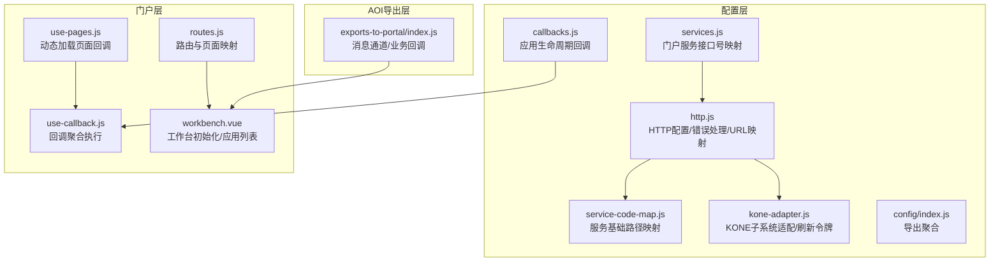
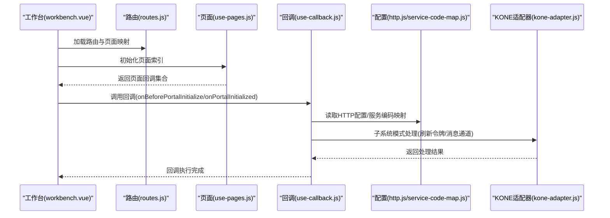
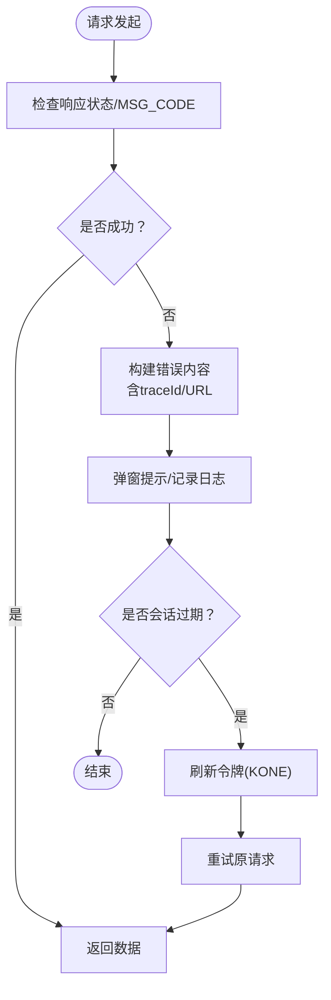
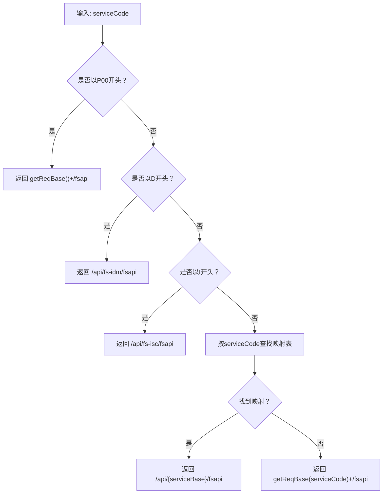
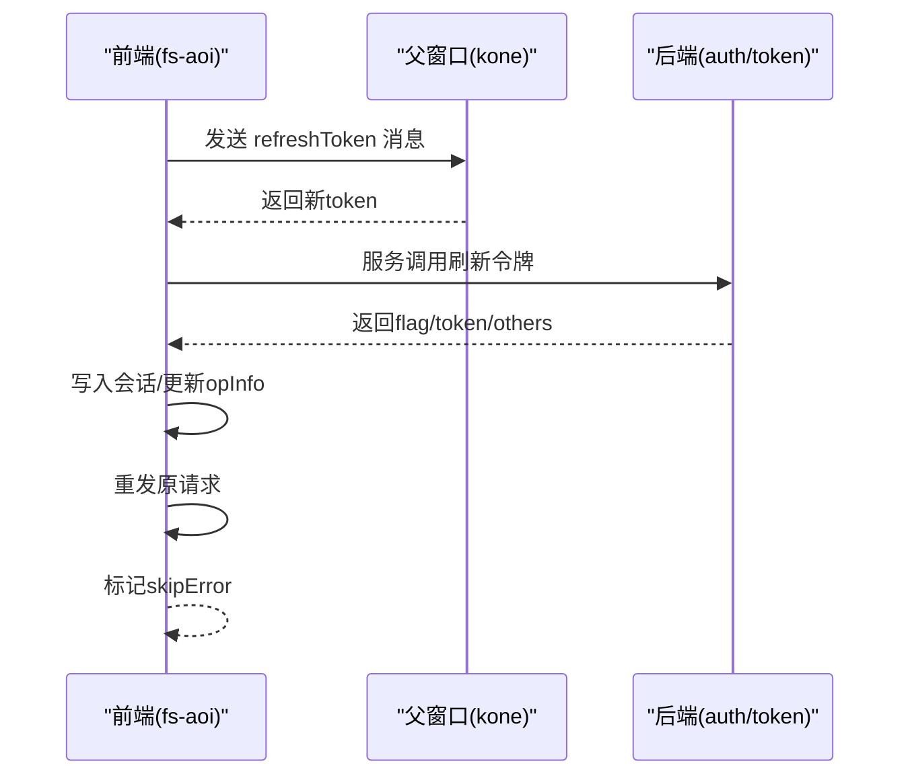
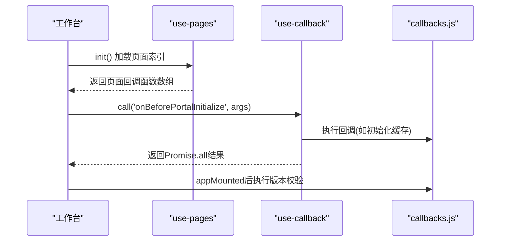
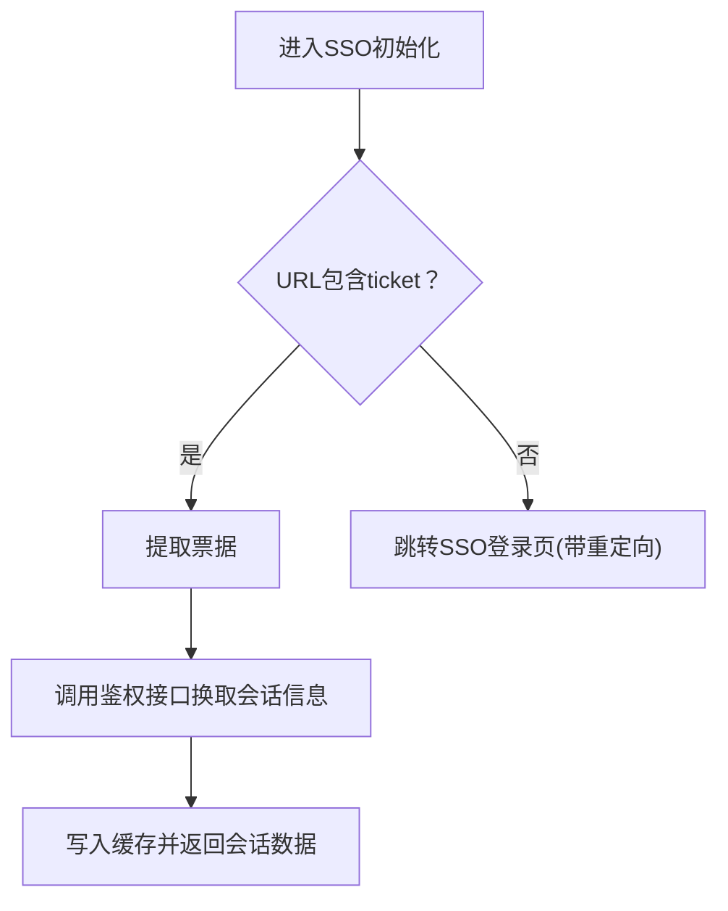
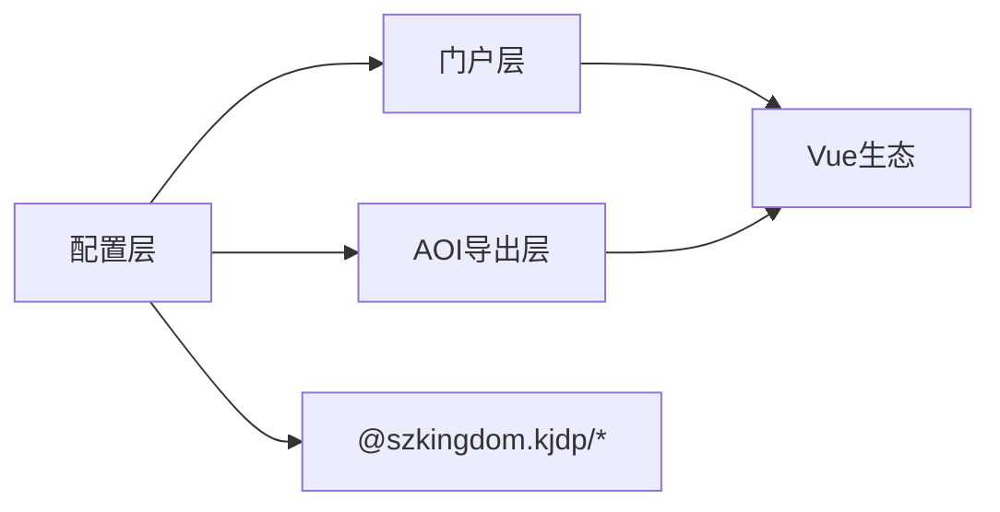

# 门户集成接口

<cite>
**本文引用的文件**
- [src/config/http.js](file://src/config/http.js)
- [src/config/service-code-map.js](file://src/config/service-code-map.js)
- [src/config/kone-adapter.js](file://src/config/kone-adapter.js)
- [src/config/services.js](file://src/config/services.js)
- [src/config/callbacks.js](file://src/config/callbacks.js)
- [src/config/index.js](file://src/config/index.js)
- [src/portal/hooks/use-callback.js](file://src/portal/hooks/use-callback.js)
- [src/portal/hooks/use-pages.js](file://src/portal/hooks/use-pages.js)
- [src/portal/hooks/use-sso-login.js](file://src/portal/hooks/use-sso-login.js)
- [src/portal/router/routes.js](file://src/portal/router/routes.js)
- [src/portal/views/workbench/workbench.vue](file://src/portal/views/workbench/workbench.vue)
- [src/pages/aoi/exports-to-portal/index.js](file://src/pages/aoi/exports-to-portal/index.js)
- [package.json](file://package.json)
</cite>

## 目录
1. [简介](#简介)
2. [项目结构](#项目结构)
3. [核心组件](#核心组件)
4. [架构总览](#架构总览)
5. [详细组件分析](#详细组件分析)
6. [依赖关系分析](#依赖关系分析)
7. [性能考虑](#性能考虑)
8. [故障排查指南](#故障排查指南)
9. [结论](#结论)
10. [附录](#附录)

## 简介
本技术文档面向AOI系统与门户系统的集成接口，聚焦以下方面：
- 接口设计与数据交换协议
- 认证与会话管理（含SSO、KONE子系统模式）
- 回调机制与页面生命周期钩子
- HTTP请求配置、接口版本与安全机制
- 性能优化、缓存策略与监控建议
- 最佳实践与常见问题解决方案

## 项目结构
门户集成涉及的核心目录与文件：
- 配置层：集中管理HTTP、服务编码映射、KONE适配器、SSO登录、回调等
- 门户层：路由、工作台视图、页面加载与回调聚合
- AOI导出层：向门户暴露业务回调与消息通道

图表来源
- [src/config/http.js](file://src/config/http.js#L1-L124)
- [src/config/service-code-map.js](file://src/config/service-code-map.js#L1-L129)
- [src/config/kone-adapter.js](file://src/config/kone-adapter.js#L1-L248)
- [src/config/services.js](file://src/config/services.js#L1-L28)
- [src/config/callbacks.js](file://src/config/callbacks.js#L1-L54)
- [src/portal/hooks/use-pages.js](file://src/portal/hooks/use-pages.js#L1-L21)
- [src/portal/hooks/use-callback.js](file://src/portal/hooks/use-callback.js#L1-L24)
- [src/portal/router/routes.js](file://src/portal/router/routes.js#L1-L78)
- [src/portal/views/workbench/workbench.vue](file://src/portal/views/workbench/workbench.vue#L1-L235)
- [src/pages/aoi/exports-to-portal/index.js](file://src/pages/aoi/exports-to-portal/index.js#L1-L122)

章节来源
- [src/config/http.js](file://src/config/http.js#L1-L124)
- [src/config/service-code-map.js](file://src/config/service-code-map.js#L1-L129)
- [src/config/kone-adapter.js](file://src/config/kone-adapter.js#L1-L248)
- [src/config/services.js](file://src/config/services.js#L1-L28)
- [src/config/callbacks.js](file://src/config/callbacks.js#L1-L54)
- [src/portal/hooks/use-pages.js](file://src/portal/hooks/use-pages.js#L1-L21)
- [src/portal/hooks/use-callback.js](file://src/portal/hooks/use-callback.js#L1-L24)
- [src/portal/router/routes.js](file://src/portal/router/routes.js#L1-L78)
- [src/portal/views/workbench/workbench.vue](file://src/portal/views/workbench/workbench.vue#L1-L235)
- [src/pages/aoi/exports-to-portal/index.js](file://src/pages/aoi/exports-to-portal/index.js#L1-L122)

## 核心组件
- HTTP配置与错误处理：统一的请求/响应拦截、错误弹窗、加密开关、菜单上下文扩展
- 服务编码映射：根据接口号/系统标识动态计算服务基础路径
- KONE适配器：子系统模式下的JWT刷新、消息通道、系统状态
- 门户回调：应用挂载前后、版本校验、多门户默认激活等
- 页面回调聚合：按页面索引收集并异步执行回调函数
- SSO登录：基于公共参数的SSO地址解析、票据获取、鉴权与登出
- 路由与工作台：路由扫描、页面映射、工作台初始化与应用列表加载

章节来源
- [src/config/http.js](file://src/config/http.js#L27-L85)
- [src/config/service-code-map.js](file://src/config/service-code-map.js#L24-L121)
- [src/config/kone-adapter.js](file://src/config/kone-adapter.js#L11-L162)
- [src/config/callbacks.js](file://src/config/callbacks.js#L15-L46)
- [src/portal/hooks/use-pages.js](file://src/portal/hooks/use-pages.js#L3-L17)
- [src/portal/hooks/use-sso-login.js](file://src/portal/hooks/use-sso-login.js#L1-L84)
- [src/portal/router/routes.js](file://src/portal/router/routes.js#L1-L78)
- [src/portal/views/workbench/workbench.vue](file://src/portal/views/workbench/workbench.vue#L52-L96)

## 架构总览
门户集成采用“配置驱动 + 门户钩子 + 导出回调”的分层架构：
- 配置层负责HTTP、服务映射、安全与错误处理
- 门户层负责页面加载、路由与工作台初始化
- AOI导出层负责与门户的消息通道与业务回调

图表来源
- [src/portal/views/workbench/workbench.vue](file://src/portal/views/workbench/workbench.vue#L52-L96)
- [src/portal/router/routes.js](file://src/portal/router/routes.js#L1-L78)
- [src/portal/hooks/use-pages.js](file://src/portal/hooks/use-pages.js#L3-L17)
- [src/portal/hooks/use-callback.js](file://src/portal/hooks/use-callback.js#L5-L20)
- [src/config/http.js](file://src/config/http.js#L27-L85)
- [src/config/service-code-map.js](file://src/config/service-code-map.js#L24-L121)
- [src/config/kone-adapter.js](file://src/config/kone-adapter.js#L124-L162)

## 详细组件分析

### HTTP配置与错误处理
- 成功码判定：以服务端返回的MSG_CODE为准，支持多值
- 错误弹窗：统一错误内容拼装，包含跟踪ID（traceId）与URL
- 加密开关：可开启请求侧加密
- 会话过期处理：在KONE环境下通过拦截器触发刷新令牌流程
- 请求上下文扩展：附加菜单ID/名称等通用字段
- URL配置：会话、认证、用户、上传下载等常用接口地址

图表来源
- [src/config/http.js](file://src/config/http.js#L6-L25)
- [src/config/http.js](file://src/config/http.js#L43-L45)
- [src/config/kone-adapter.js](file://src/config/kone-adapter.js#L124-L162)

章节来源
- [src/config/http.js](file://src/config/http.js#L27-L85)
- [src/config/kone-adapter.js](file://src/config/kone-adapter.js#L124-L162)

### 服务编码映射与接口版本
- 请求前缀推断：优先根据URL参数sysName或KONE环境映射；否则按接口号前缀归类
- 服务基础路径：支持fsapi后缀与无fsapi后缀的差异化路径
- 影像相关接口：固定使用IDM服务前缀
- UAS扩展映射：合并UAS侧服务编码映射

图表来源
- [src/config/service-code-map.js](file://src/config/service-code-map.js#L85-L121)

章节来源
- [src/config/service-code-map.js](file://src/config/service-code-map.js#L24-L121)

### KONE子系统适配与令牌刷新
- 子系统模式识别：通过URL参数判断
- 消息通道：监听来自kjdp/kone的消息，执行刷新令牌或回到登录
- 刷新流程：向后端请求新令牌，写入会话，更新操作人信息，并重发原请求
- 系统状态：版本、更新时间、运行状态的获取与初始化

图表来源
- [src/config/kone-adapter.js](file://src/config/kone-adapter.js#L46-L110)
- [src/config/kone-adapter.js](file://src/config/kone-adapter.js#L124-L162)

章节来源
- [src/config/kone-adapter.js](file://src/config/kone-adapter.js#L11-L162)

### 门户回调与页面生命周期
- 应用挂载前：初始化缓存（系统参数）
- 应用挂载后：版本校验与定时轮询
- 页面回调聚合：动态加载各页面的回调并并行执行
- 默认激活门户：可自定义多门户场景下的默认门户

图表来源
- [src/portal/hooks/use-pages.js](file://src/portal/hooks/use-pages.js#L3-L17)
- [src/portal/hooks/use-callback.js](file://src/portal/hooks/use-callback.js#L5-L20)
- [src/config/callbacks.js](file://src/config/callbacks.js#L15-L46)

章节来源
- [src/config/callbacks.js](file://src/config/callbacks.js#L1-L54)
- [src/portal/hooks/use-pages.js](file://src/portal/hooks/use-pages.js#L1-L21)
- [src/portal/hooks/use-callback.js](file://src/portal/hooks/use-callback.js#L1-L24)

### SSO登录与票据处理
- 配置项：SSO地址、票据键、鉴权接口号、重定向地址
- 流程：检测票据存在则换取会话信息并缓存；否则跳转至SSO登录页
- 登出：调用SSO登出并重定向回当前页面

图表来源
- [src/portal/hooks/use-sso-login.js](file://src/portal/hooks/use-sso-login.js#L37-L81)

章节来源
- [src/portal/hooks/use-sso-login.js](file://src/portal/hooks/use-sso-login.js#L1-L84)

### 路由与工作台初始化
- 路由扫描：按页面index.js导出的routes生成门户子路由
- 工作台：并行加载应用列表、固定应用与个性化设置，完成后渲染桌面与应用栏

章节来源
- [src/portal/router/routes.js](file://src/portal/router/routes.js#L1-L78)
- [src/portal/views/workbench/workbench.vue](file://src/portal/views/workbench/workbench.vue#L52-L96)

### AOI导出到门户的消息通道与业务回调
- 事件监听：接收来自外部的消息（如受理门户切换、续办/驳回、批量采集）
- 门户切换：在KONE子系统模式下通过openSystemMenu打开指定菜单
- 业务回调：通过iframe消息传递，实现跨页面业务联动
- 生命周期回调：onPortalInitialized用于初始化业务事件

章节来源
- [src/pages/aoi/exports-to-portal/index.js](file://src/pages/aoi/exports-to-portal/index.js#L11-L122)
- [src/config/kone-adapter.js](file://src/config/kone-adapter.js#L217-L234)

## 依赖关系分析
- 组件耦合
  - 配置层被门户与AOI导出层广泛依赖
  - 门户层通过钩子聚合页面回调，形成弱耦合扩展点
  - KONE适配器仅在子系统模式下生效，避免对非子系统场景的影响
- 外部依赖
  - @szkingdom.kjdp/core/ui 提供系统能力与UI组件
  - Vue生态（router、pinia、vueuse）支撑路由与状态管理

图表来源
- [src/config/index.js](file://src/config/index.js#L1-L8)
- [package.json](file://package.json#L17-L39)

章节来源
- [src/config/index.js](file://src/config/index.js#L1-L8)
- [package.json](file://package.json#L17-L39)

## 性能考虑
- 并行初始化：工作台应用列表、固定应用与个性化设置并行加载
- 动态导入：页面回调与组件均采用异步导入，降低首屏压力
- 缓存策略：系统参数与版本信息在应用挂载前初始化，后续定时轮询
- 请求优化：统一错误处理与重试策略，减少重复错误弹窗与无效请求

## 故障排查指南
- 会话过期
  - 现象：弹窗提示会话或认证过期
  - 处理：触发刷新令牌流程，重发原请求；若失败则回到登录
- 错误弹窗
  - 现象：统一错误弹窗，包含MSG_CODE、URL与traceId
  - 处理：根据traceId定位后端日志，核对请求参数与权限
- 子系统模式
  - 现象：消息通道未响应或刷新失败
  - 处理：确认URL参数subSysMode，确保父窗口消息通道可用
- SSO票据
  - 现象：无法自动登录或跳转循环
  - 处理：检查ticket键、SSO地址与重定向URL配置

章节来源
- [src/config/http.js](file://src/config/http.js#L6-L25)
- [src/config/kone-adapter.js](file://src/config/kone-adapter.js#L124-L162)
- [src/portal/hooks/use-sso-login.js](file://src/portal/hooks/use-sso-login.js#L37-L81)

## 结论
本集成方案通过配置驱动与钩子扩展，实现了AOI系统与门户系统的解耦对接。在保证安全性与可维护性的同时，提供了完善的错误处理、会话管理与性能优化策略。建议在生产环境中结合监控指标与日志追踪，持续优化接口延迟与用户体验。

## 附录
- 接口版本控制
  - 通过服务编码映射与请求前缀区分不同系统与版本
- 安全机制
  - 支持请求侧加密、KONE子系统令牌刷新、SSO票据验证
- 最佳实践
  - 使用统一HTTP配置与错误处理
  - 在应用挂载前完成必要的系统参数与版本校验
  - 通过消息通道与回调聚合实现业务解耦