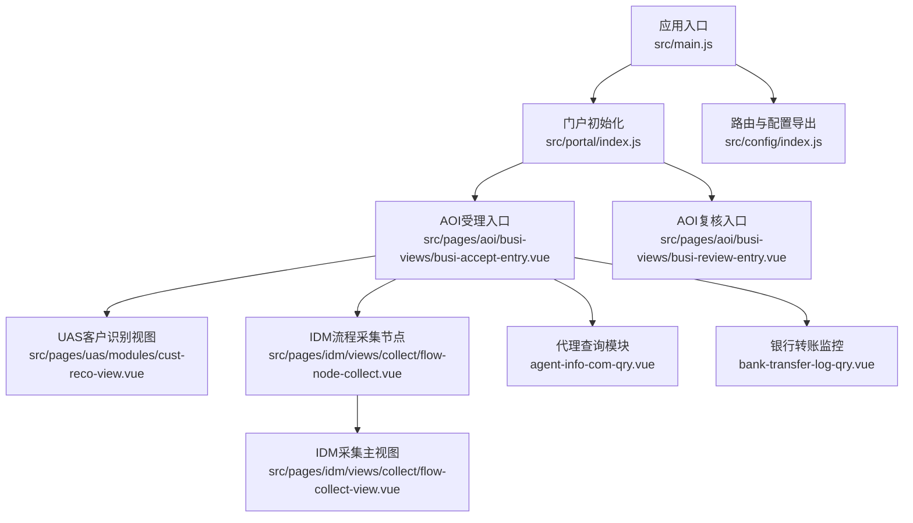
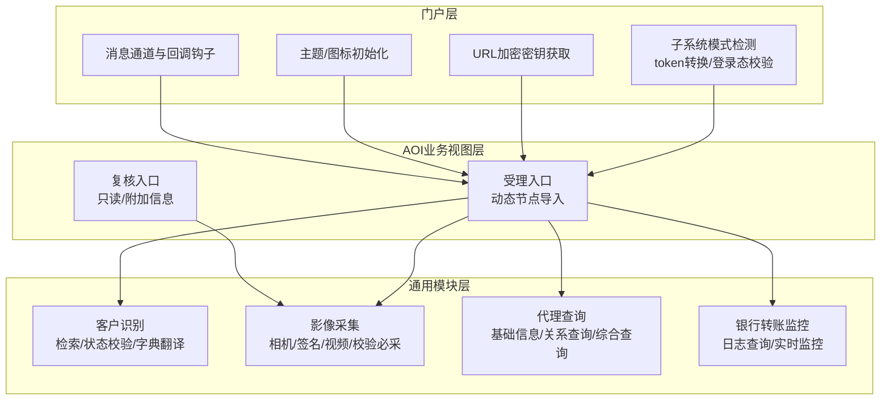
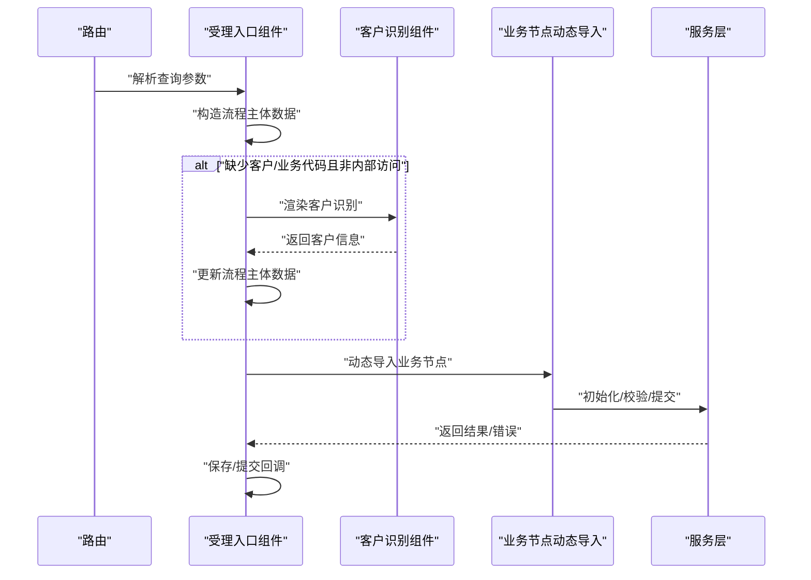
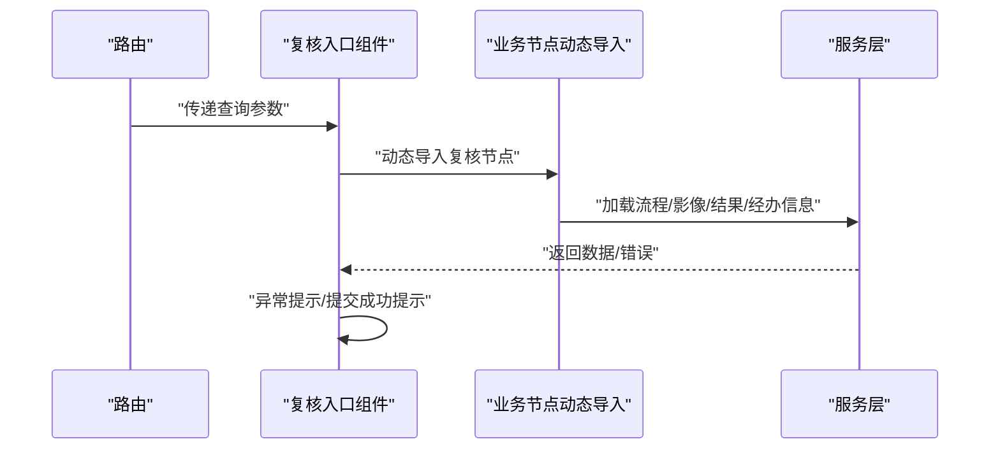
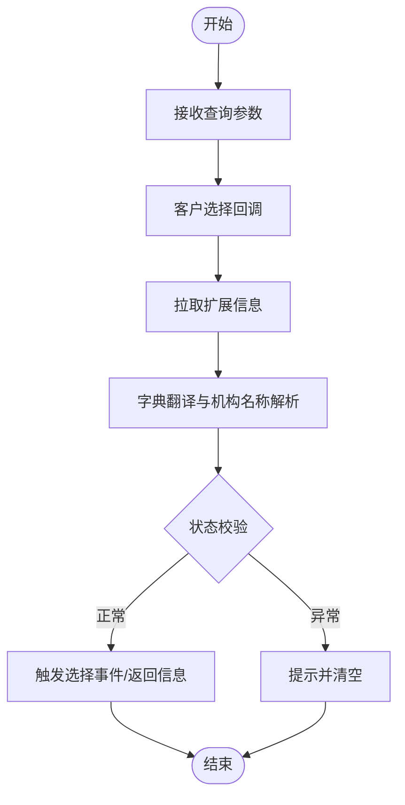
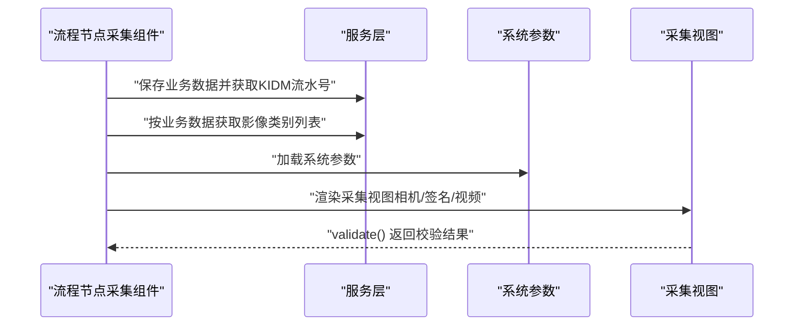
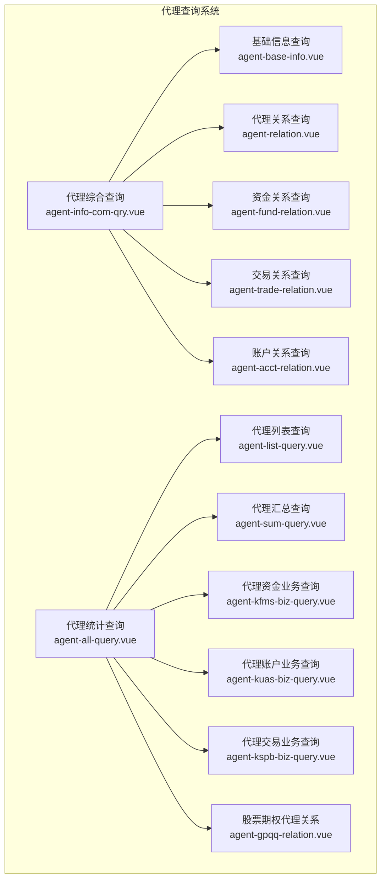
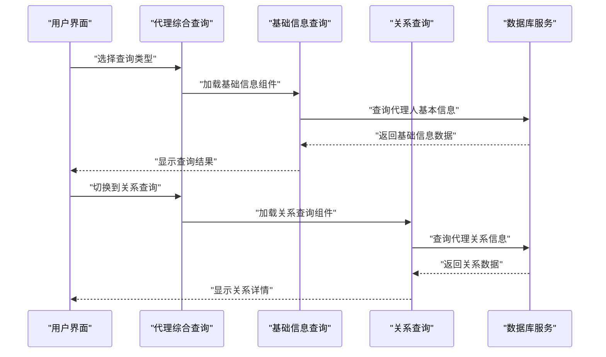
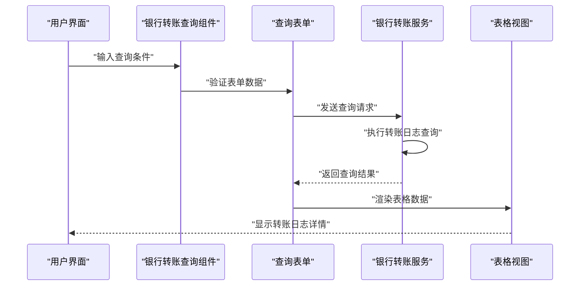
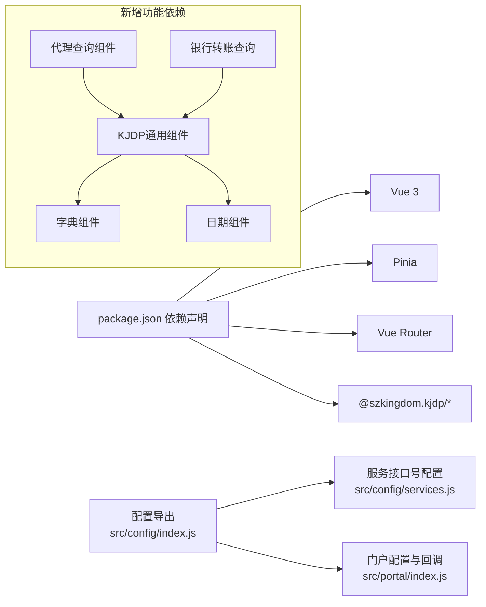

# 业务模块

<cite>
**本文引用的文件**
- [README.md](file://README.md)
- [package.json](file://package.json)
- [src/main.js](file://src/main.js)
- [src/App.vue](file://src/App.vue)
- [src/config/index.js](file://src/config/index.js)
- [src/config/services.js](file://src/config/services.js)
- [src/portal/index.js](file://src/portal/index.js)
- [src/pages/aoi/busi-views/busi-accept-entry.vue](file://src/pages/aoi/busi-views/busi-accept-entry.vue)
- [src/pages/aoi/busi-views/busi-review-entry.vue](file://src/pages/aoi/busi-views/busi-review-entry.vue)
- [src/pages/aoi/busi-views/busi-view-config.js](file://src/pages/aoi/busi-views/busi-view-config.js)
- [src/pages/uas/modules/cust-reco-view.vue](file://src/pages/uas/modules/cust-reco-view.vue)
- [src/pages/idm/views/collect/flow-collect-view.vue](file://src/pages/idm/views/collect/flow-collect-view.vue)
- [src/pages/idm/views/collect/flow-node-collect.vue](file://src/pages/idm/views/collect/flow-node-collect.vue)
- [src/pages/uas/views/business/agent-query/agent-base-info.vue](file://src/pages/uas/views/business/agent-query/agent-base-info.vue)
- [src/pages/uas/views/business/agent-query/agent-relation.vue](file://src/pages/uas/views/business/agent-query/agent-relation.vue)
- [src/pages/uas/views/business/agent-query/agent-fund-relation.vue](file://src/pages/uas/views/business/agent-query/agent-fund-relation.vue)
- [src/pages/uas/views/business/agent-query/agent-trade-relation.vue](file://src/pages/uas/views/business/agent-query/agent-trade-relation.vue)
- [src/pages/uas/views/business/agent-query/agent-acct-relation.vue](file://src/pages/uas/views/business/agent-query/agent-acct-relation.vue)
- [src/pages/uas/views/business/agent-query/agent-info-com-qry.vue](file://src/pages/uas/views/business/agent-query/agent-info-com-qry.vue)
- [src/pages/uas/views/business/agent-query/agent-all-query.vue](file://src/pages/uas/views/business/agent-query/agent-all-query.vue)
- [src/pages/uas/views/business/agent-query/agent-list-query.vue](file://src/pages/uas/views/business/agent-query/agent-list-query.vue)
- [src/pages/uas/views/business/agent-query/agent-sum-query.vue](file://src/pages/uas/views/business/agent-query/agent-sum-query.vue)
- [src/pages/uas/views/business/agent-query/agent-kfms-biz-query.vue](file://src/pages/uas/views/business/agent-query/agent-kfms-biz-query.vue)
- [src/pages/uas/views/business/agent-query/agent-kuas-biz-query.vue](file://src/pages/uas/views/business/agent-query/agent-kuas-biz-query.vue)
- [src/pages/uas/views/business/agent-query/agent-kspb-biz-query.vue](file://src/pages/uas/views/business/agent-query/agent-kspb-biz-query.vue)
- [src/pages/uas/views/business/agent-query/agent-gpqq-relation.vue](file://src/pages/uas/views/business/agent-query/agent-gpqq-relation.vue)
- [src/pages/uas/views/business/bank-transfer-log-qry.vue](file://src/pages/uas/views/business/bank-transfer-log-qry.vue)
- [src/pages/aoi/busi-views/Z0071/accept/bank-transfer-single-acct-open.vue](file://src/pages/aoi/busi-views/Z0071/accept/bank-transfer-single-acct-open.vue)
</cite>

## 更新摘要
**所做更改**
- 更新代理关系查询界面章节，反映UI增强变更：新增记录序号和期权测试标志列，优化代理人身份显示格式
- 更新代理查询组件UI优化章节，反映移除无效的Paging Phone列，确保界面只显示有效字段
- 新增股票期权代理关系查询组件的详细说明
- 更新代理查询系统架构图，体现最新的UI增强效果

## 目录
1. [简介](#简介)
2. [项目结构](#项目结构)
3. [核心组件](#核心组件)
4. [架构总览](#架构总览)
5. [详细组件分析](#详细组件分析)
6. [代理信息综合查询系统](#代理信息综合查询系统)
7. [代理关系查询界面UI增强](#代理关系查询界面ui增强)
8. [银行转账日志查询功能](#银行转账日志查询功能)
9. [依赖分析](#依赖分析)
10. [性能考虑](#性能考虑)
11. [故障排查指南](#故障排查指南)
12. [结论](#结论)
13. [附录](#附录)

## 简介
本文件面向FS-AOI-WEB业务模块系统，聚焦账户管理、客户维护、业务查询、影像采集、代理信息查询和银行转账监控等核心业务场景，系统化梳理模块职责、业务流程与实现方式，解释模块间关联关系、数据共享机制与业务规则，并提供配置管理、参数设置与流程定制方法，辅以实际案例与最佳实践，帮助业务人员与开发者快速理解并高效使用。

## 项目结构
FS-AOI-WEB采用前端微内核与模块化分层组织：
- 应用入口与框架集成：通过应用入口完成KJDP核心能力与UI能力的注册，挂载路由与全局错误处理。
- 门户层（portal）：负责子系统模式、主题与图标、URL加密密钥、消息通道与回调钩子等统一接入。
- AOI业务视图层：提供受理与复核入口，封装流程初始化、异常处理、结果回调与动态节点导入。
- UAS客户识别模块：提供客户检索、状态校验、字典翻译与信息展示。
- IDM影像采集模块：提供流程节点级影像采集视图、相机/签名/视频采集与系统参数联动。
- 代理查询模块：提供完整的代理信息查询体系，包括基础信息、关系查询、资金关系、交易关系、账户关系等多维度查询。
- 银行转账监控模块：提供银行转账日志查询和实时监控功能。



**图表来源**
- [src/main.js:1-40](file://src/main.js#L1-L40)
- [src/portal/index.js:1-153](file://src/portal/index.js#L1-L153)
- [src/pages/aoi/busi-views/busi-accept-entry.vue:1-133](file://src/pages/aoi/busi-views/busi-accept-entry.vue#L1-L133)
- [src/pages/aoi/busi-views/busi-review-entry.vue:1-67](file://src/pages/aoi/busi-views/busi-review-entry.vue#L1-L67)
- [src/pages/uas/modules/cust-reco-view.vue:1-220](file://src/pages/uas/modules/cust-reco-view.vue#L1-L220)
- [src/pages/idm/views/collect/flow-node-collect.vue:1-122](file://src/pages/idm/views/collect/flow-node-collect.vue#L1-L122)
- [src/pages/idm/views/collect/flow-collect-view.vue:1-79](file://src/pages/idm/views/collect/flow-collect-view.vue#L1-L79)
- [src/pages/uas/views/business/agent-query/agent-info-com-qry.vue:1-42](file://src/pages/uas/views/business/agent-query/agent-info-com-qry.vue#L1-L42)
- [src/pages/uas/views/business/bank-transfer-log-qry.vue:1-72](file://src/pages/uas/views/business/bank-transfer-log-qry.vue#L1-L72)

**章节来源**
- [src/main.js:1-40](file://src/main.js#L1-L40)
- [src/App.vue:1-8](file://src/App.vue#L1-L8)
- [src/config/index.js:1-8](file://src/config/index.js#L1-L8)
- [src/config/services.js:1-28](file://src/config/services.js#L1-L28)
- [src/portal/index.js:1-153](file://src/portal/index.js#L1-L153)

## 核心组件
- 应用入口与框架集成
  - 注册Pinia状态管理、KJDP核心与UI能力，挂载路由并设置全局错误处理。
- 门户初始化与回调
  - 支持子系统模式、URL加密密钥、iframe消息通道、主题与图标初始化、登录态与会话处理。
- AOI受理/复核入口
  - 动态导入业务节点，封装流程初始化、异常处理、保存/提交后回调。
- 客户识别（UAS）
  - 提供检索、状态校验、字典翻译与信息展示，支持清空与暴露查询结果。
- 影像采集（IDM）
  - 流程节点采集视图，对接业务数据与系统参数，按采集模式切换视图并校验必采。
- 代理查询（UAS）
  - 提供完整的代理信息查询体系，包括基础信息查询、代理关系查询、资金关系查询、交易关系查询、账户关系查询和综合查询。
- 银行转账监控（UAS）
  - 银行转账日志查询，支持多维度筛选和实时监控。

**章节来源**
- [src/main.js:1-40](file://src/main.js#L1-L40)
- [src/portal/index.js:17-101](file://src/portal/index.js#L17-L101)
- [src/pages/aoi/busi-views/busi-accept-entry.vue:1-133](file://src/pages/aoi/busi-views/busi-accept-entry.vue#L1-L133)
- [src/pages/aoi/busi-views/busi-review-entry.vue:1-67](file://src/pages/aoi/busi-views/busi-review-entry.vue#L1-L67)
- [src/pages/uas/modules/cust-reco-view.vue:1-220](file://src/pages/uas/modules/cust-reco-view.vue#L1-L220)
- [src/pages/idm/views/collect/flow-node-collect.vue:1-122](file://src/pages/idm/views/collect/flow-node-collect.vue#L1-L122)
- [src/pages/uas/views/business/agent-query/agent-base-info.vue:1-145](file://src/pages/uas/views/business/agent-query/agent-base-info.vue#L1-L145)
- [src/pages/uas/views/business/bank-transfer-log-qry.vue:1-72](file://src/pages/uas/views/business/bank-transfer-log-qry.vue#L1-L72)

## 架构总览
FS-AOI-WEB通过"门户层-业务视图层-通用模块层"的分层设计实现业务解耦与可扩展性。AOI受理/复核入口作为流程编排中心，动态导入各业务节点；UAS模块负责客户识别与基础信息校验；IDM模块在流程节点内完成影像采集与系统参数联动；新增的代理查询模块提供完整的代理信息查询体系；银行转账监控模块提供实时转账状态跟踪。



**图表来源**
- [src/portal/index.js:17-101](file://src/portal/index.js#L17-L101)
- [src/pages/aoi/busi-views/busi-accept-entry.vue:1-133](file://src/pages/aoi/busi-views/busi-accept-entry.vue#L1-L133)
- [src/pages/aoi/busi-views/busi-review-entry.vue:1-67](file://src/pages/aoi/busi-views/busi-review-entry.vue#L1-L67)
- [src/pages/uas/modules/cust-reco-view.vue:1-220](file://src/pages/uas/modules/cust-reco-view.vue#L1-L220)
- [src/pages/idm/views/collect/flow-collect-view.vue:1-79](file://src/pages/idm/views/collect/flow-collect-view.vue#L1-L79)
- [src/pages/uas/views/business/agent-query/agent-info-com-qry.vue:1-42](file://src/pages/uas/views/business/agent-query/agent-info-com-qry.vue#L1-L42)
- [src/pages/uas/views/business/bank-transfer-log-qry.vue:1-72](file://src/pages/uas/views/business/bank-transfer-log-qry.vue#L1-L72)

## 详细组件分析

### AOI受理入口（受理流程编排）
- 关键职责
  - 解析路由参数，构造流程主体数据（含业务代码、客户/机构/操作员等）。
  - 动态导入业务节点，注入采集节点路径，绑定初始化、异常、保存/提交回调。
  - 支持"内部访问"场景自动填充当前操作员信息。
- 数据流
  - 参数来源：路由查询参数与操作员信息。
  - 初始化：调用受理初始化处理器，合并自定义初始化数据。
  - 异常处理：针对特定错误码弹窗提示并关闭标签页。
  - 回调：保存/提交成功后弹窗提示并关闭当前标签页。
- 业务规则
  - 若缺少客户与业务代码且非内部访问，则先触发客户识别组件。
  - 内部访问时自动填充操作员信息并标记访问来源。



**图表来源**
- [src/pages/aoi/busi-views/busi-accept-entry.vue:1-133](file://src/pages/aoi/busi-views/busi-accept-entry.vue#L1-L133)

**章节来源**
- [src/pages/aoi/busi-views/busi-accept-entry.vue:1-133](file://src/pages/aoi/busi-views/busi-accept-entry.vue#L1-L133)
- [src/pages/aoi/busi-views/busi-view-config.js:1-5](file://src/pages/aoi/busi-views/busi-view-config.js#L1-L5)

### AOI复核入口（复核流程编排）
- 关键职责
  - 从路由参数构建流程数据，支持只读模式与附加信息模板。
  - 动态导入通用复核节点（流程信息、影像信息、执行结果、经办信息）。
  - 统一异常处理与提交后提示。
- 业务规则
  - 根据业务代码与用户类型匹配审核模块设置，缺失时提示并关闭标签页。



**图表来源**
- [src/pages/aoi/busi-views/busi-review-entry.vue:1-67](file://src/pages/aoi/busi-views/busi-review-entry.vue#L1-L67)

**章节来源**
- [src/pages/aoi/busi-views/busi-review-entry.vue:1-67](file://src/pages/aoi/busi-views/busi-review-entry.vue#L1-L67)

### 客户识别（UAS）
- 关键职责
  - 提供检索组件与选择回调，异步获取客户资金账号等扩展信息。
  - 对客户状态进行校验（默认仅允许正常状态），否则提示并清空。
  - 将字典值（证件类型、用户类型、机构全称）翻译为文本展示。
- 数据流
  - 查询参数透传至检索组件。
  - 选择客户后拉取扩展信息并合并翻译。
  - 暴露清空、查询结果获取与外部展示方法。



**图表来源**
- [src/pages/uas/modules/cust-reco-view.vue:1-220](file://src/pages/uas/modules/cust-reco-view.vue#L1-L220)

**章节来源**
- [src/pages/uas/modules/cust-reco-view.vue:1-220](file://src/pages/uas/modules/cust-reco-view.vue#L1-L220)

### 影像采集（IDM）
- 关键职责
  - 在流程节点内保存业务数据至影像系统，获取影像流水号并回填业务数据。
  - 根据业务数据获取需采集的影像类别列表，并加载系统参数（如是否必采、签名缩放、时间戳服务器等）。
  - 按采集模式切换相机/签名/视频等视图，并在必要时校验必采项。
- 数据流
  - 业务受理数据 + 业务配置参数 + 公共参数 → 保存业务数据 → 获取类别列表 → 加载系统参数 → 渲染采集视图。
  - 采集视图暴露校验方法，节点统一调用。



**图表来源**
- [src/pages/idm/views/collect/flow-node-collect.vue:1-122](file://src/pages/idm/views/collect/flow-node-collect.vue#L1-L122)
- [src/pages/idm/views/collect/flow-collect-view.vue:1-79](file://src/pages/idm/views/collect/flow-collect-view.vue#L1-L79)

**章节来源**
- [src/pages/idm/views/collect/flow-node-collect.vue:1-122](file://src/pages/idm/views/collect/flow-node-collect.vue#L1-L122)
- [src/pages/idm/views/collect/flow-collect-view.vue:1-79](file://src/pages/idm/views/collect/flow-collect-view.vue#L1-L79)

## 代理信息综合查询系统

FS-AOI-WEB新增了完整的代理信息综合查询系统，提供多维度、多层次的代理信息查询能力。该系统由6个专门的查询组件组成，每个组件专注于不同的代理信息维度。

### 代理查询组件体系

#### 基础信息查询（agent-base-info.vue）
- 功能特点
  - 支持按代理人代码精确查询代理人的基本信息
  - 提供数字字符过滤，确保输入规范性
  - 支持查询中状态显示和错误处理
  - 分为"基本信息"和"其他信息"两大字段组
- 字段分类
  - 基本信息：代理人类别、状态、开始/结束日期、机构编码、证件信息等
  - 其他信息：联系方式、地址信息、职业信息等

#### 代理关系查询（agent-relation.vue）
- 功能特点
  - 查询代理人与客户之间的代理关系
  - 支持多维度筛选：代理人代码、客户代码、代理业务范围等
  - 展示代理关系的有效期和业务范围
  - 包含联系信息和首选联系方式配置
- **更新** UI增强后的字段显示更加规范，移除了无效的Paging Phone列

#### 资金关系查询（agent-fund-relation.vue）
- 功能特点
  - 专门查询代理人的资金业务代理关系
  - 支持货币代码筛选和代理业务范围查询
  - 展示代理关系的时间范围和业务限制
  - 包含客户机构和账户信息关联

#### 交易关系查询（agent-trade-relation.vue）
- 功能特点
  - 查询代理人的证券交易代理关系
  - 支持交易板块、股东账户等细分维度
  - 展示证券类别和代理业务范围
  - 包含交易权限和有效期限管理

#### 账户关系查询（agent-acct-relation.vue）
- 功能特点
  - 查询代理人的账户业务代理关系
  - 支持代理账户业务类型的细分查询
  - 展示账户业务的起止日期和状态
  - 包含客户账户和代理机构信息

#### 综合查询入口（agent-info-com-qry.vue）
- 功能特点
  - 提供统一的代理信息查询入口
  - 通过标签页形式整合所有查询组件
  - 支持基本资料、关系查询、综合统计等功能
  - 实现组件间的统一管理和状态同步

### 股票期权代理关系查询（agent-gpqq-relation.vue）
- **新增** 股票期权代理关系查询组件，专门处理期权相关的代理关系
- 功能特点
  - 支持按代理人机构、代理人代码、客户代码等多维度查询
  - 新增"记录序号"列，便于数据定位和排序
  - 新增"期权测试标志"列，支持期权测试状态标识
  - 优化"代理人身份"显示格式，使用多选字典组件展示期权代理业务类型
  - 移除无效的Paging Phone列，确保界面只显示有效字段

### 代理查询系统架构



**图表来源**
- [src/pages/uas/views/business/agent-query/agent-info-com-qry.vue:1-42](file://src/pages/uas/views/business/agent-query/agent-info-com-qry.vue#L1-L42)
- [src/pages/uas/views/business/agent-query/agent-base-info.vue:1-145](file://src/pages/uas/views/business/agent-query/agent-base-info.vue#L1-L145)
- [src/pages/uas/views/business/agent-query/agent-relation.vue:1-47](file://src/pages/uas/views/business/agent-query/agent-relation.vue#L1-L47)
- [src/pages/uas/views/business/agent-query/agent-fund-relation.vue:1-34](file://src/pages/uas/views/business/agent-query/agent-fund-relation.vue#L1-L34)
- [src/pages/uas/views/business/agent-query/agent-trade-relation.vue:1-35](file://src/pages/uas/views/business/agent-query/agent-trade-relation.vue#L1-L35)
- [src/pages/uas/views/business/agent-query/agent-acct-relation.vue:1-35](file://src/pages/uas/views/business/agent-query/agent-acct-relation.vue#L1-L35)
- [src/pages/uas/views/business/agent-query/agent-all-query.vue:1-94](file://src/pages/uas/views/business/agent-query/agent-all-query.vue#L1-L94)
- [src/pages/uas/views/business/agent-query/agent-gpqq-relation.vue:1-47](file://src/pages/uas/views/business/agent-query/agent-gpqq-relation.vue#L1-L47)

### 代理查询业务流程



**图表来源**
- [src/pages/uas/views/business/agent-query/agent-info-com-qry.vue:1-42](file://src/pages/uas/views/business/agent-query/agent-info-com-qry.vue#L1-L42)
- [src/pages/uas/views/business/agent-query/agent-base-info.vue:14-26](file://src/pages/uas/views/business/agent-query/agent-base-info.vue#L14-L26)

**章节来源**
- [src/pages/uas/views/business/agent-query/agent-base-info.vue:1-145](file://src/pages/uas/views/business/agent-query/agent-base-info.vue#L1-L145)
- [src/pages/uas/views/business/agent-query/agent-relation.vue:1-47](file://src/pages/uas/views/business/agent-query/agent-relation.vue#L1-L47)
- [src/pages/uas/views/business/agent-query/agent-fund-relation.vue:1-34](file://src/pages/uas/views/business/agent-query/agent-fund-relation.vue#L1-L34)
- [src/pages/uas/views/business/agent-query/agent-trade-relation.vue:1-35](file://src/pages/uas/views/business/agent-query/agent-trade-relation.vue#L1-L35)
- [src/pages/uas/views/business/agent-query/agent-acct-relation.vue:1-35](file://src/pages/uas/views/business/agent-query/agent-acct-relation.vue#L1-L35)
- [src/pages/uas/views/business/agent-query/agent-info-com-qry.vue:1-42](file://src/pages/uas/views/business/agent-query/agent-info-com-qry.vue#L1-L42)
- [src/pages/uas/views/business/agent-query/agent-all-query.vue:1-94](file://src/pages/uas/views/business/agent-query/agent-all-query.vue#L1-L94)
- [src/pages/uas/views/business/agent-query/agent-list-query.vue:1-73](file://src/pages/uas/views/business/agent-query/agent-list-query.vue#L1-L73)
- [src/pages/uas/views/business/agent-query/agent-sum-query.vue:1-24](file://src/pages/uas/views/business/agent-query/agent-sum-query.vue#L1-L24)
- [src/pages/uas/views/business/agent-query/agent-kfms-biz-query.vue:1-55](file://src/pages/uas/views/business/agent-query/agent-kfms-biz-query.vue#L1-L55)
- [src/pages/uas/views/business/agent-query/agent-kuas-biz-query.vue:1-54](file://src/pages/uas/views/business/agent-query/agent-kuas-biz-query.vue#L1-L54)
- [src/pages/uas/views/business/agent-query/agent-kspb-biz-query.vue:1-74](file://src/pages/uas/views/business/agent-query/agent-kspb-biz-query.vue#L1-L74)
- [src/pages/uas/views/business/agent-query/agent-gpqq-relation.vue:1-47](file://src/pages/uas/views/business/agent-query/agent-gpqq-relation.vue#L1-L47)

## 代理关系查询界面UI增强

FS-AOI-WEB对代理关系查询界面进行了重要的UI增强，主要体现在以下几个方面：

### 新增记录序号列
- **agent-list-query.vue**：在代理人资料列表查询中新增"记录序号"列，宽度80像素，固定显示
- **agent-sum-query.vue**：在汇总查询中同样显示记录序号列
- **agent-kfms-biz-query.vue**：资金业务查询中新增记录序号列
- **agent-kuas-biz-query.vue**：账户业务查询中新增记录序号列
- **agent-kspb-biz-query.vue**：交易业务查询中新增记录序号列
- **agent-gpqq-relation.vue**：股票期权代理关系查询中新增记录序号列

### 新增期权测试标志列
- **agent-gpqq-relation.vue**：新增"期权测试标志"列，使用YES_NO字典组件，宽度120像素
- 支持期权测试状态的可视化标识，便于业务人员快速识别期权测试客户

### 优化代理人身份显示格式
- **agent-gpqq-relation.vue**：将"代理人身份"列改为"期权代理关系"，使用OPT_AGET_BIZ字典组件
- 支持多选显示多个期权代理业务类型，宽度300像素，提供更好的用户体验
- 使用multiple属性和seperator参数，确保多选值的清晰展示

### 移除无效的Paging Phone列
- **agent-relation.vue**：移除了原有的Paging Phone列，确保界面只显示有效字段
- 优化了表格布局，减少了冗余信息，提升了数据可读性
- 保留了必要的联系方式字段：家庭电话、公司电话、移动电话等

### 统一UI设计标准
- 所有查询组件均采用统一的列宽设置和固定显示策略
- 记录序号列统一设置为80像素宽度，便于数据定位
- 重要业务字段采用固定宽度显示，确保表格布局的稳定性
- 多选字典字段统一使用multiple属性，提供更好的用户体验

**章节来源**
- [src/pages/uas/views/business/agent-query/agent-list-query.vue:48-68](file://src/pages/uas/views/business/agent-query/agent-list-query.vue#L48-L68)
- [src/pages/uas/views/business/agent-query/agent-sum-query.vue:14-21](file://src/pages/uas/views/business/agent-query/agent-sum-query.vue#L14-L21)
- [src/pages/uas/views/business/agent-query/agent-kfms-biz-query.vue:29-51](file://src/pages/uas/views/business/agent-query/agent-kfms-biz-query.vue#L29-L51)
- [src/pages/uas/views/business/agent-query/agent-kuas-biz-query.vue:29-50](file://src/pages/uas/views/business/agent-query/agent-kuas-biz-query.vue#L29-L50)
- [src/pages/uas/views/business/agent-query/agent-kspb-biz-query.vue:29-71](file://src/pages/uas/views/business/agent-query/agent-kspb-biz-query.vue#L29-L71)
- [src/pages/uas/views/business/agent-query/agent-gpqq-relation.vue:28-43](file://src/pages/uas/views/business/agent-query/agent-gpqq-relation.vue#L28-L43)
- [src/pages/uas/views/business/agent-query/agent-relation.vue:15-43](file://src/pages/uas/views/business/agent-query/agent-relation.vue#L15-L43)

## 银行转账日志查询功能

FS-AOI-WEB新增了银行转账日志查询功能，提供全面的银行转账业务监控和审计能力。该功能通过专门的查询组件实现，支持多维度筛选和详细的数据展示。

### 银行转账日志查询组件

#### 组件功能特性
- **多维度筛选**：支持开始/结束日期、货币代码、银行代码、内部机构、客户代码、资产账户、业务标识、业务状态等多个筛选条件
- **实时数据展示**：提供详细的转账流水信息，包括内部机构、客户信息、银行账户、转账金额、资金余额等关键字段
- **状态监控**：支持业务状态筛选，便于追踪转账处理进度和异常情况
- **扩展信息**：包含外部信息代码、外部流水序号、备注信息等扩展字段，满足审计和合规需求

#### 查询字段详解
- **基础信息**：内部机构、客户代码、客户名称、资产账户、银行代码、银行账户
- **交易信息**：货币代码、转账金额、资金余额、业务标识、业务状态
- **时间信息**：清算日期、发生日期、发生时间、冲正标志
- **关联信息**：关联流水号、冲正流水号、关联标识、关联账号
- **扩展信息**：外部信息代码、外部信息内容、外部流水序号、备注信息

### 银行转账监控架构

```mermaid
graph TB
subgraph "银行转账监控系统"
BTQ["银行转账日志查询<br/>bank-transfer-log-qry.vue"]
QF["查询表单<br/>QueryForm"]
TV["表格视图<br/>TableView"]
TP["分页控件<br/>TablePagination"]
DB["银行转账服务<br/>F011280002"]
DICT["字典数据<br/>CURRENCY, ID_TYPE, STATUS"]
END["查询结果展示"]
```

**图表来源**
- [src/pages/uas/views/business/bank-transfer-log-qry.vue:1-72](file://src/pages/uas/views/business/bank-transfer-log-qry.vue#L1-L72)

### 银行转账查询流程



**图表来源**
- [src/pages/uas/views/business/bank-transfer-log-qry.vue:7-68](file://src/pages/uas/views/business/bank-transfer-log-qry.vue#L7-L68)

### 银行转账业务集成

银行转账日志查询功能与现有的银行转账业务流程紧密集成：

- **单边开户业务**：与Z0071业务流程结合，提供转账状态实时监控
- **业务状态跟踪**：通过业务状态字段监控转账处理进度
- **异常处理**：支持冲正标志和关联流水号追踪异常转账
- **合规审计**：提供完整的转账记录和扩展信息用于审计

**章节来源**
- [src/pages/uas/views/business/bank-transfer-log-qry.vue:1-72](file://src/pages/uas/views/business/bank-transfer-log-qry.vue#L1-L72)
- [src/pages/aoi/busi-views/Z0071/accept/bank-transfer-single-acct-open.vue:1-193](file://src/pages/aoi/busi-views/Z0071/accept/bank-transfer-single-acct-open.vue#L1-L193)

## 依赖分析
- 运行时依赖与版本约束
  - Node版本要求：18/20/22。
  - Vue 3、Pinia、Vue Router、@szkingdom.kjdp/* 系列UI与核心库。
- 项目配置
  - 门户/菜单/字典/系统参数等服务接口号集中配置，便于统一管理与替换.
  - 门户回调钩子提供应用挂载前后扩展点。
- 新增依赖
  - 代理查询系统依赖KJDP通用查询组件（QueryForm、TableView、TablePagination）
  - 银行转账监控依赖KJDP字典组件和日期组件
  - 所有查询组件都依赖统一的服务请求机制



**图表来源**
- [package.json:1-61](file://package.json#L1-L61)
- [src/config/index.js:1-8](file://src/config/index.js#L1-L8)
- [src/config/services.js:1-28](file://src/config/services.js#L1-L28)
- [src/portal/index.js:1-153](file://src/portal/index.js#L1-L153)

**章节来源**
- [package.json:1-61](file://package.json#L1-L61)
- [src/config/index.js:1-8](file://src/config/index.js#L1-L8)
- [src/config/services.js:1-28](file://src/config/services.js#L1-L28)
- [src/portal/index.js:1-153](file://src/portal/index.js#L1-L153)

## 性能考虑
- 组件懒加载与动态导入
  - AOI受理/复核入口与采集视图均采用异步组件与动态导入，降低首屏体积与提升交互响应。
  - 代理查询组件采用标签页懒加载，仅在用户切换时加载对应组件。
- 门户初始化并发
  - URL加密密钥、iframe消息通道、子系统模式检测等初始化任务并发执行，缩短启动等待时间。
- 数据精简与缓存
  - 受理初始化公共数据尽量精简，避免影响流程组件性能；系统参数按需加载。
  - 代理查询组件支持查询结果缓存，避免重复查询相同数据。
- 图标与样式
  - 统一引入UI样式与主题，减少重复样式计算与重绘。
- 银行转账查询优化
  - 支持分页查询，避免大量数据一次性加载
  - 提供查询条件验证，减少无效查询请求
- **更新** UI增强优化
  - 记录序号列采用固定显示，提升数据定位效率
  - 多选字典组件优化了渲染性能，减少DOM操作
  - 移除无效字段减少了表格渲染开销

**章节来源**
- [src/pages/aoi/busi-views/busi-accept-entry.vue:1-133](file://src/pages/aoi/busi-views/busi-accept-entry.vue#L1-L133)
- [src/pages/aoi/busi-views/busi-review-entry.vue:1-67](file://src/pages/aoi/busi-views/busi-review-entry.vue#L1-L67)
- [src/pages/idm/views/collect/flow-collect-view.vue:1-79](file://src/pages/idm/views/collect/flow-collect-view.vue#L1-L79)
- [src/portal/index.js:109-125](file://src/portal/index.js#L109-L125)
- [src/pages/uas/views/business/agent-query/agent-info-com-qry.vue:20-26](file://src/pages/uas/views/business/agent-query/agent-info-com-qry.vue#L20-L26)
- [src/pages/uas/views/business/bank-transfer-log-qry.vue:67-68](file://src/pages/uas/views/business/bank-transfer-log-qry.vue#L67-L68)

## 故障排查指南
- 子系统模式与登录态
  - 若进入子系统模式，需确保token转换成功并正确写入会话；若用户不一致需重新登录。
- 采集必采校验
  - 当系统参数"是否必采"开启时，采集视图必须通过校验；请检查采集类别与设备权限。
- 复核异常
  - 若提示未查询到流程信息或未匹配到审核模块设置，检查业务代码与用户类型参数是否正确。
- 客户状态异常
  - 客户状态非正常时将阻断业务；请先处理客户状态再继续。
- 代理查询异常
  - 代理人代码输入需为数字字符，长度符合要求；查询失败时检查网络连接和服务可用性。
  - 代理关系查询需确保代理人代码正确，相关业务数据完整。
  - **更新** UI增强相关问题：确认记录序号列显示正常，期权测试标志列功能正常。
- 银行转账查询异常
  - 查询日期格式需正确，货币代码和银行代码需在有效范围内。
  - 业务状态查询需注意状态码的含义，异常状态需进一步核查原因。

**章节来源**
- [src/portal/index.js:17-101](file://src/portal/index.js#L17-L101)
- [src/pages/idm/views/collect/flow-node-collect.vue:79-85](file://src/pages/idm/views/collect/flow-node-collect.vue#L79-L85)
- [src/pages/aoi/busi-views/busi-review-entry.vue:28-37](file://src/pages/aoi/busi-views/busi-review-entry.vue#L28-L37)
- [src/pages/uas/modules/cust-reco-view.vue:96-102](file://src/pages/uas/modules/cust-reco-view.vue#L96-L102)
- [src/pages/uas/views/business/agent-query/agent-base-info.vue:9-12](file://src/pages/uas/views/business/agent-query/agent-base-info.vue#L9-L12)
- [src/pages/uas/views/business/bank-transfer-log-qry.vue:10-23](file://src/pages/uas/views/business/bank-transfer-log-qry.vue#L10-L23)

## 结论
FS-AOI-WEB通过清晰的分层架构与模块化设计，实现了受理/复核流程的灵活编排、客户识别的状态校验与信息翻译、以及流程节点内的影像采集与参数联动。新增的代理信息综合查询系统提供了完整的代理信息查询能力，涵盖基础信息、关系查询、资金关系、交易关系、账户关系等多维度查询；银行转账日志查询功能则提供了全面的银行转账业务监控和审计能力。

**更新** 最新的UI增强显著提升了代理关系查询的用户体验，新增的记录序号和期权测试标志列提供了更好的数据定位和业务标识能力，同时移除无效字段优化了界面布局。股票期权代理关系查询组件的加入进一步完善了期权业务的查询能力。

依托门户层的统一接入与回调扩展点，系统具备良好的可配置性与可维护性。代理查询系统和银行转账监控功能的加入，进一步完善了FS-AOI-WEB的业务覆盖范围，为金融机构提供了更加全面的业务支撑能力。建议在业务定制时遵循"参数驱动+配置优先"的原则，充分利用系统参数与服务接口号配置，确保业务规则的一致性与可追溯性。

## 附录
- 业务配置管理
  - 服务接口号集中于配置文件，便于统一替换与灰度发布。
  - 系统参数通过系统参数服务按需加载，支持业务开关与行为控制。
  - 代理查询系统支持组件级别的配置和个性化定制。
- 参数设置与流程定制
  - 采集必采、签名缩放、时间戳服务器等参数直接影响采集体验与合规性，应在业务上线前完成验证。
  - 受理初始化公共数据应保持最小化，避免对流程性能造成影响。
  - 代理查询组件支持自定义字段显示和查询条件配置。
  - 银行转账查询支持灵活的筛选条件组合和结果排序。
  - **更新** UI增强配置：记录序号列宽度、期权测试标志列显示格式、代理人身份显示优化等。
- 实际案例与最佳实践
  - 客户识别：优先使用资金账号查询扩展信息，严格校验客户状态，异常时及时清空并提示。
  - 影像采集：在节点内统一保存业务数据并获取KIDM流水号，按采集模式切换视图，必要时开启必采校验。
  - 流程编排：受理/复核入口通过动态导入实现高扩展性，异常与回调处理要覆盖常见错误码。
  - 代理查询：合理使用代理查询组件，根据业务需求选择合适的查询维度，注意数据隐私保护。
  - 银行转账：建立完善的转账监控机制，定期检查转账状态和异常处理流程。
  - **更新** UI增强应用：利用记录序号列提升数据定位效率，使用期权测试标志快速识别特殊客户，优化的代理人身份显示提升业务理解度。

**章节来源**
- [src/config/services.js:1-28](file://src/config/services.js#L1-L28)
- [src/pages/idm/views/collect/flow-node-collect.vue:13-23](file://src/pages/idm/views/collect/flow-node-collect.vue#L13-L23)
- [src/pages/aoi/busi-views/busi-view-config.js:1-5](file://src/pages/aoi/busi-views/busi-view-config.js#L1-L5)
- [src/pages/uas/modules/cust-reco-view.vue:86-111](file://src/pages/uas/modules/cust-reco-view.vue#L86-L111)
- [src/pages/uas/views/business/agent-query/agent-info-com-qry.vue:10-17](file://src/pages/uas/views/business/agent-query/agent-info-com-qry.vue#L10-L17)
- [src/pages/uas/views/business/bank-transfer-log-qry.vue:8-31](file://src/pages/uas/views/business/bank-transfer-log-qry.vue#L8-L31)