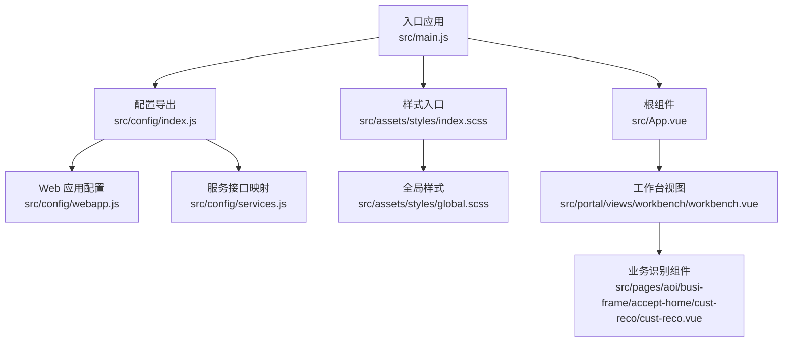
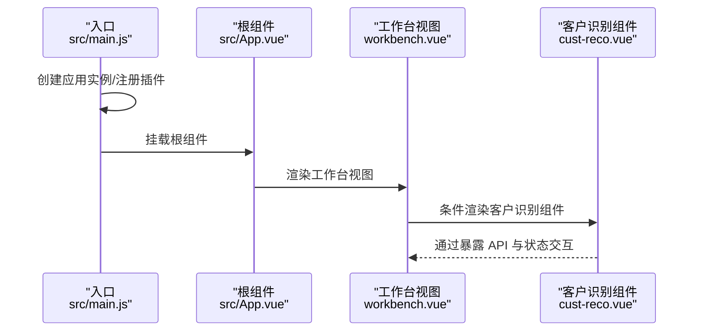
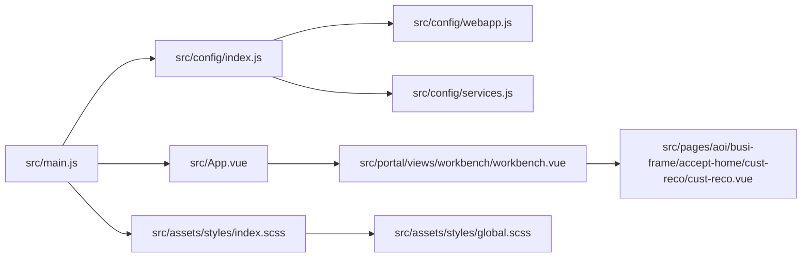

# 代码规范

<cite>
**本文引用的文件**
- [.eslintrc.js](file://.eslintrc.js)
- [package.json](file://package.json)
- [.prettierrc](file://.prettierrc)
- [README.md](file://README.md)
- [src/main.js](file://src/main.js)
- [src/App.vue](file://src/App.vue)
- [src/pages/aoi/busi-frame/accept-home/cust-reco/cust-reco.vue](file://src/pages/aoi/busi-frame/accept-home/cust-reco/cust-reco.vue)
- [src/portal/views/workbench/workbench.vue](file://src/portal/views/workbench/workbench.vue)
- [src/config/webapp.js](file://src/config/webapp.js)
- [src/config/services.js](file://src/config/services.js)
- [src/assets/styles/index.scss](file://src/assets/styles/index.scss)
- [src/assets/styles/global.scss](file://src/assets/styles/global.scss)
</cite>

## 目录
1. [引言](#引言)
2. [项目结构](#项目结构)
3. [核心组件](#核心组件)
4. [架构总览](#架构总览)
5. [详细组件分析](#详细组件分析)
6. [依赖关系分析](#依赖关系分析)
7. [性能考量](#性能考量)
8. [故障排查指南](#故障排查指南)
9. [结论](#结论)
10. [附录](#附录)

## 引言
本文件面向 FS-AOI-WEB 项目，基于现有 ESLint 与 Prettier 配置，系统化梳理 JavaScript/Vue 代码的编码规范与最佳实践，覆盖变量命名、函数定义、组件结构、文件组织、Props 定义、事件处理、生命周期管理、样式命名与组织等方面。同时解释关键 ESLint 规则的动机与配置含义，并提供“正确/错误”示例的路径指引，帮助团队统一风格、提升可维护性与一致性。

## 项目结构
FS-AOI-WEB 采用 Vue 3 + Vite 构建，源码位于 src 目录，按页面域划分（如 aoi/cop/uas），并通过 Portal 体系组织路由、菜单与工作台视图。样式通过 SCSS 组织，全局样式与 UI 组件库样式分层引入。

图表来源
- [src/main.js](file://src/main.js#L1-L40)
- [src/App.vue](file://src/App.vue#L1-L8)
- [src/config/index.js](file://src/config/index.js#L1-L8)
- [src/config/webapp.js](file://src/config/webapp.js#L1-L254)
- [src/config/services.js](file://src/config/services.js#L1-L28)
- [src/assets/styles/index.scss](file://src/assets/styles/index.scss#L1-L4)
- [src/assets/styles/global.scss](file://src/assets/styles/global.scss#L1-L98)
- [src/portal/views/workbench/workbench.vue](file://src/portal/views/workbench/workbench.vue#L1-L235)
- [src/pages/aoi/busi-frame/accept-home/cust-reco/cust-reco.vue](file://src/pages/aoi/busi-frame/accept-home/cust-reco/cust-reco.vue#L1-L353)

章节来源
- [README.md](file://README.md#L1-L55)
- [package.json](file://package.json#L1-L61)

## 核心组件
- 入口与应用初始化：在入口文件中完成应用创建、插件注册、全局样式引入与错误处理挂载，确保统一的启动流程与错误捕获策略。
- 根组件：通过 KeepAlive 包裹 RouterView，实现路由组件的缓存复用，减少重复渲染成本。
- 配置模块：集中管理菜单映射、URL 参数格式化、主题与系统参数等，便于跨模块共享与维护。
- 样式组织：全局样式与 UI 组件库样式分层引入，避免样式冲突与重复加载。

章节来源
- [src/main.js](file://src/main.js#L1-L40)
- [src/App.vue](file://src/App.vue#L1-L8)
- [src/config/webapp.js](file://src/config/webapp.js#L1-L254)
- [src/config/services.js](file://src/config/services.js#L1-L28)
- [src/assets/styles/index.scss](file://src/assets/styles/index.scss#L1-L4)
- [src/assets/styles/global.scss](file://src/assets/styles/global.scss#L1-L98)

## 架构总览
下图展示了从入口到组件的关键调用链与职责边界，体现“配置—视图—业务组件”的分层关系。

图表来源
- [src/main.js](file://src/main.js#L1-L40)
- [src/App.vue](file://src/App.vue#L1-L8)
- [src/portal/views/workbench/workbench.vue](file://src/portal/views/workbench/workbench.vue#L1-L235)
- [src/pages/aoi/busi-frame/accept-home/cust-reco/cust-reco.vue](file://src/pages/aoi/busi-frame/accept-home/cust-reco/cust-reco.vue#L1-L353)

## 详细组件分析

### ESLint 规则与配置解读
- 环境与解析器
  - 环境：浏览器、Node、ES2021，确保对现代语法与 DOM API 的支持。
  - 解析器：vue-eslint-parser，支持 .vue 单文件组件的 JS/TS/JSX 片段校验。
  - 解析选项：ECMAScript 2020，模块化源码，启用 JSX。
- 扩展规则集
  - eslint-plugin-vue 的 vue3-recommended，覆盖 Vue 3 场景的最佳实践。
  - eslint-config-prettier 与 eslint-plugin-prettier，消除 Prettier 与 ESLint 的样式冲突，统一格式化。
- 关键规则
  - no-console：生产环境警告，开发环境关闭；避免提交残留调试输出。
  - no-debugger：生产环境警告，开发环境关闭；防止调试代码进入生产。
  - vue/multi-word-component-names：关闭多词组件名强制，降低命名约束。
  - no-extend-native：允许扩展数组原型，其他原生对象扩展需显式声明例外。
  - no-eval：允许间接 eval，但明确风险；尽量避免使用。
  - no-var：强制使用 let/const，杜绝 var。
  - no-unused-vars：报告未使用变量，保持代码整洁。
  - prefer-const：优先使用 const，提升不可变性与可读性。
- 忽略模式
  - public 目录忽略，避免对第三方资源进行 ESLint 校验。

章节来源
- [.eslintrc.js](file://.eslintrc.js#L1-L35)

### JavaScript 编码规范
- 变量与作用域
  - 优先使用 const 声明不会重新赋值的标识符；仅在确需重新赋值时使用 let。
  - 避免使用 var，统一以 let/const 声明变量。
  - 未使用变量必须移除，保持代码简洁。
- 函数与模块
  - 尽量使用箭头函数表达式，保持上下文一致；具名函数用于递归或需要显式名称的场景。
  - 导出模块时，优先使用命名导出与默认导出分离，保持清晰的 API 边界。
- 错误处理
  - 生产环境避免使用 console 与 debugger；开发阶段可临时保留，但应在提交前清理。
  - 全局错误处理器统一捕获异常，避免未处理异常导致应用崩溃。

章节来源
- [.eslintrc.js](file://.eslintrc.js#L17-L32)
- [src/main.js](file://src/main.js#L29-L33)

### Vue 单文件组件规范
- 结构组织
  - 采用 <script setup> 语法，配合 defineProps、defineEmits、defineExpose 等编译器宏，提升组合式 API 的可读性与性能。
  - 模板与样式部分使用 scoped，避免样式污染；必要时使用深度选择器处理第三方组件样式。
- Props 定义
  - 显式声明 props 类型、默认值与验证规则，保证组件契约清晰。
  - 对外暴露的 API 通过 defineExpose 暴露，避免内部实现细节泄露。
- 事件处理
  - 使用 v-on 与事件处理器配合，避免在模板中直接调用副作用函数。
  - 通过 emit 与父组件通信，保持单向数据流。
- 生命周期管理
  - 在 onMounted/onUnmounted 等钩子中进行 DOM 访问与资源清理，避免在模板中直接操作 DOM。
  - 使用 KeepAlive 包裹 RouterView，减少重复渲染成本。
- 示例参考
  - 客户识别组件：展示 props 定义、事件处理、异步组件加载与状态管理。
  - 工作台视图：演示条件渲染、事件总线监听与异步初始化流程。

章节来源
- [src/pages/aoi/busi-frame/accept-home/cust-reco/cust-reco.vue](file://src/pages/aoi/busi-frame/accept-home/cust-reco/cust-reco.vue#L1-L353)
- [src/portal/views/workbench/workbench.vue](file://src/portal/views/workbench/workbench.vue#L1-L235)
- [src/App.vue](file://src/App.vue#L1-L8)

### 样式命名约定与组织方式
- 命名约定
  - SCSS 变量与混入遵循项目统一变量体系，避免硬编码颜色与尺寸。
  - 组件样式使用 scoped，类名采用语义化命名，避免使用无意义的通用类名。
- 组织方式
  - 全局样式集中于 global.scss，统一字体、列表、链接等基础样式。
  - 样式入口 index.scss 按需引入全局样式与 UI 组件库样式，避免重复加载。
- 作用域与隔离
  - 使用 scoped 限定样式作用域；对第三方组件样式，谨慎使用深度选择器，避免破坏组件封装性。

章节来源
- [src/assets/styles/index.scss](file://src/assets/styles/index.scss#L1-L4)
- [src/assets/styles/global.scss](file://src/assets/styles/global.scss#L1-L98)

### 配置与工具链
- Lint 与格式化脚本
  - lint：对 src 目录执行 ESLint 校验与 Prettier 格式检查。
  - lint:fix：自动修复可自动修复的问题，并对格式问题进行修正。
  - format：仅对格式进行统一修正。
- 依赖与版本
  - Node 版本要求：18+/20+/22+，确保与现代工具链兼容。
  - Vue 3、Pinia、Element Plus 等生态依赖已统一管理，避免版本冲突。

章节来源
- [package.json](file://package.json#L6-L12)
- [README.md](file://README.md#L3-L27)

## 依赖关系分析
- 入口依赖
  - main.js 依赖 App.vue、配置模块与 UI 组件库，负责应用初始化与错误处理。
- 组件依赖
  - workbench.vue 依赖多个子视图与业务组件，通过条件渲染与事件总线实现模块化组合。
  - cust-reco.vue 依赖请求服务、字典翻译与标签页工具，展示业务流程与状态管理。
- 样式依赖
  - index.scss 引入全局样式与 UI 组件库样式，确保一致的视觉与交互体验。

图表来源
- [src/main.js](file://src/main.js#L1-L40)
- [src/App.vue](file://src/App.vue#L1-L8)
- [src/config/index.js](file://src/config/index.js#L1-L8)
- [src/config/webapp.js](file://src/config/webapp.js#L1-L254)
- [src/config/services.js](file://src/config/services.js#L1-L28)
- [src/portal/views/workbench/workbench.vue](file://src/portal/views/workbench/workbench.vue#L1-L235)
- [src/pages/aoi/busi-frame/accept-home/cust-reco/cust-reco.vue](file://src/pages/aoi/busi-frame/accept-home/cust-reco/cust-reco.vue#L1-L353)
- [src/assets/styles/index.scss](file://src/assets/styles/index.scss#L1-L4)
- [src/assets/styles/global.scss](file://src/assets/styles/global.scss#L1-L98)

## 性能考量
- 组件缓存
  - 使用 KeepAlive 缓存路由组件，减少重复渲染与网络请求。
- 异步组件
  - 通过 defineAsyncComponent 按需加载大型组件，降低首屏体积与加载时间。
- 样式加载
  - 分离全局样式与组件样式，避免重复引入与阻塞渲染。
- 请求与状态
  - 合理使用防抖与节流，避免频繁触发副作用；在 finally 中恢复状态，确保 UI 一致性。

## 故障排查指南
- 提交前检查
  - 使用 npm run lint 或 npm run lint:fix，确保无 ESLint 错误与格式问题。
- 常见问题定位
  - 控制台残留 console：在生产构建前清理，避免影响用户体验。
  - 未使用变量：删除未使用变量与导入，保持代码整洁。
  - 样式冲突：检查 scoped 与深度选择器使用，避免全局污染。
- 运行时错误
  - 全局错误处理器会捕获异常，可在控制台查看堆栈信息并定位问题来源。

章节来源
- [.eslintrc.js](file://.eslintrc.js#L17-L32)
- [package.json](file://package.json#L10-L12)
- [src/main.js](file://src/main.js#L29-L33)

## 结论
本规范以 ESLint 与 Prettier 为核心，结合 Vue 3 组合式 API 与 SCSS 样式体系，形成从变量命名、函数定义到组件结构、文件组织的完整约束。通过明确规则与最佳实践，有助于提升代码质量、可维护性与团队协作效率。建议在日常开发中坚持“先 lint 再提交”，并在 PR 审查中重点关注规则合规性与样式一致性。

## 附录
- 正确/错误示例路径指引
  - 变量声明与命名
    - 正例：使用 const/let 声明变量，避免未使用变量
      - 参考：[src/pages/aoi/busi-frame/accept-home/cust-reco/cust-reco.vue](file://src/pages/aoi/busi-frame/accept-home/cust-reco/cust-reco.vue#L13-L20)
    - 错例：使用 var 声明变量
      - 参考：[.eslintrc.js](file://.eslintrc.js#L27-L27)
  - Props 定义
    - 正例：显式声明 props 类型与默认值
      - 参考：[src/pages/aoi/busi-views/Z0004/accept/org/org-corp-qual-view.vue](file://src/pages/aoi/busi-views/Z0004/accept/org/org-corp-qual-view.vue#L4-L6)
    - 错例：未声明 props 类型或默认值
      - 参考：[src/pages/aoi/busi-views/Z0004/accept/org/org-linkman-view.vue](file://src/pages/aoi/busi-views/Z0004/accept/org/org-linkman-view.vue#L4-L7)
  - 事件处理与暴露 API
    - 正例：通过 defineExpose 暴露受控 API
      - 参考：[src/pages/aoi/busi-views/Z0004/accept/org/org-corp-qual-view.vue](file://src/pages/aoi/busi-views/Z0004/accept/org/org-corp-qual-view.vue#L18-L22)
    - 错例：在模板中直接调用副作用函数
      - 参考：[src/pages/aoi/busi-frame/accept-home/cust-reco/cust-reco.vue](file://src/pages/aoi/busi-frame/accept-home/cust-reco/cust-reco.vue#L177-L178)
  - 样式命名与组织
    - 正例：使用 scoped 与语义化类名
      - 参考：[src/pages/aoi/busi-frame/accept-home/cust-reco/cust-reco.vue](file://src/pages/aoi/busi-frame/accept-home/cust-reco/cust-reco.vue#L243-L352)
    - 错例：全局污染或深度选择器滥用
      - 参考：[src/assets/styles/global.scss](file://src/assets/styles/global.scss#L1-L98)