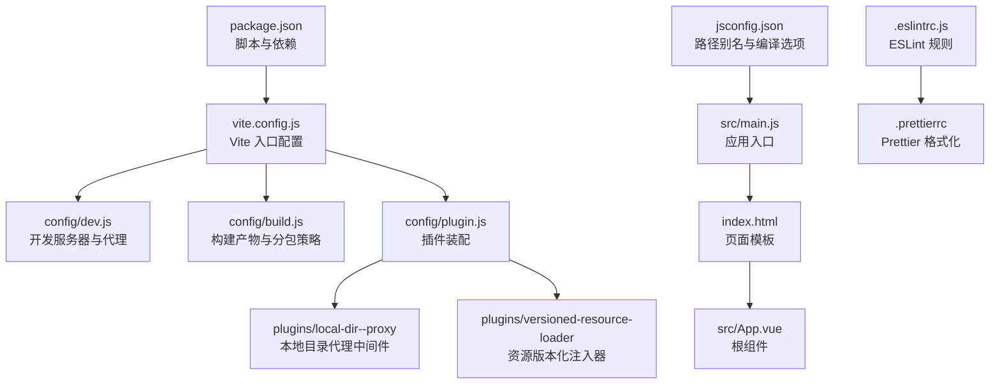
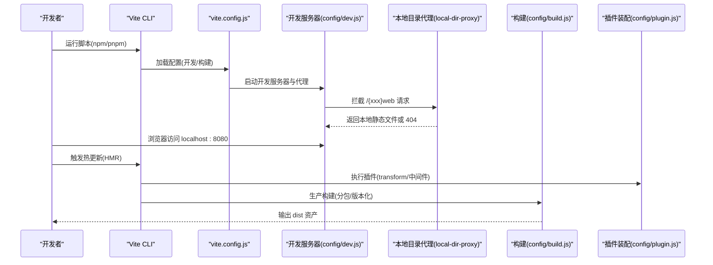
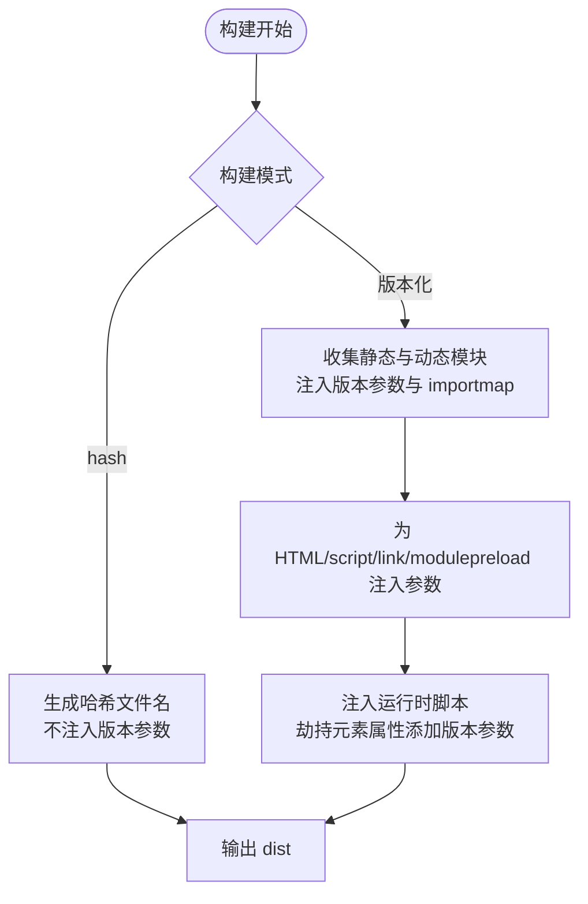
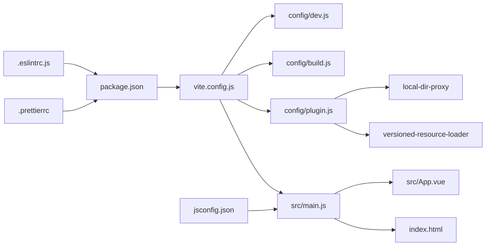

# 开发工具

<cite>
**本文引用的文件列表**
- [package.json](file://package.json)
- [vite.config.js](file://vite.config.js)
- [config/dev.js](file://config/dev.js)
- [config/build.js](file://config/build.js)
- [config/plugin.js](file://config/plugin.js)
- [config/plugins/local-dir--proxy/local-dir-proxy.js](file://config/plugins/local-dir--proxy/local-dir-proxy.js)
- [config/plugins/versioned-resource-loader/versioned-resource-loader.js](file://config/plugins/versioned-resource-loader/versioned-resource-loader.js)
- [.eslintrc.js](file://.eslintrc.js)
- [.prettierrc](file://.prettierrc)
- [jsconfig.json](file://jsconfig.json)
- [src/main.js](file://src/main.js)
- [index.html](file://index.html)
- [src/App.vue](file://src/App.vue)
- [README.md](file://README.md)
</cite>

## 目录
1. [简介](#简介)
2. [项目结构](#项目结构)
3. [核心组件](#核心组件)
4. [架构总览](#架构总览)
5. [详细组件分析](#详细组件分析)
6. [依赖关系分析](#依赖关系分析)
7. [性能与优化建议](#性能与优化建议)
8. [故障排查指南](#故障排查指南)
9. [结论](#结论)
10. [附录](#附录)

## 简介
本指南面向 FS-AOI-WEB 项目的前端开发者，聚焦于 Vite 构建工具的配置与使用、开发服务器与热重载机制、插件体系、脚本命令与依赖管理、IDE 推荐配置（VS Code 插件与格式化）、调试工具（浏览器开发者工具、Vue DevTools）以及开发环境优化与常见问题解决。内容基于仓库现有配置文件与代码结构整理，帮助快速上手并高效开发。

## 项目结构
该项目采用 Vite + Vue 3 的现代前端工程化方案，核心配置集中在根目录的 Vite 配置文件与 config 子目录中；开发与构建行为通过脚本命令统一管理；IDE 与代码质量工具通过 ESLint、Prettier、jsconfig.json 等进行规范约束。

图表来源
- [package.json](file://package.json#L6-L12)
- [vite.config.js](file://vite.config.js#L14-L79)
- [config/dev.js](file://config/dev.js#L4-L37)
- [config/build.js](file://config/build.js#L32-L103)
- [config/plugin.js](file://config/plugin.js#L5-L14)
- [config/plugins/local-dir--proxy/local-dir-proxy.js](file://config/plugins/local-dir--proxy/local-dir-proxy.js#L4-L38)
- [config/plugins/versioned-resource-loader/versioned-resource-loader.js](file://config/plugins/versioned-resource-loader/versioned-resource-loader.js#L3-L192)
- [src/main.js](file://src/main.js#L1-L40)
- [index.html](file://index.html#L1-L32)
- [src/App.vue](file://src/App.vue#L1-L8)
- [.eslintrc.js](file://.eslintrc.js#L1-L35)
- [.prettierrc](file://.prettierrc#L1-L12)
- [jsconfig.json](file://jsconfig.json#L1-L21)

章节来源
- [README.md](file://README.md#L44-L55)
- [package.json](file://package.json#L6-L12)
- [vite.config.js](file://vite.config.js#L14-L79)

## 核心组件
- Vite 配置中心：集中定义开发服务器、构建参数、路径别名、CSS 预处理、插件装配与 esbuild 行为。
- 开发服务器与代理：统一管理端口、host、跨域代理与本地目录直出能力。
- 构建策略：按包与页面维度拆分产物，支持哈希模式与版本化资源加载。
- 插件体系：Vue SFC 支持、本地目录代理中间件、生产环境资源版本化注入。
- 代码质量：ESLint + Prettier 统一风格与规则，jsconfig.json 提供路径别名与编译提示。
- 应用入口：Vue 3 + Pinia + KJDP 生态集成，路由挂载与错误处理。

章节来源
- [vite.config.js](file://vite.config.js#L31-L79)
- [config/dev.js](file://config/dev.js#L4-L37)
- [config/build.js](file://config/build.js#L32-L103)
- [config/plugin.js](file://config/plugin.js#L5-L14)
- [.eslintrc.js](file://.eslintrc.js#L16-L32)
- [.prettierrc](file://.prettierrc#L1-L12)
- [jsconfig.json](file://jsconfig.json#L7-L16)
- [src/main.js](file://src/main.js#L1-L40)

## 架构总览
下图展示从开发到构建的关键流程与组件交互。

图表来源
- [vite.config.js](file://vite.config.js#L31-L79)
- [config/dev.js](file://config/dev.js#L4-L37)
- [config/plugins/local-dir--proxy/local-dir-proxy.js](file://config/plugins/local-dir--proxy/local-dir-proxy.js#L8-L36)
- [config/build.js](file://config/build.js#L32-L103)
- [config/plugin.js](file://config/plugin.js#L5-L14)

## 详细组件分析

### Vite 配置与开发服务器
- 开发服务器与代理
  - 端口与主机：默认监听 8080，可对外访问。
  - 代理规则：对 /copweb、/uasweb、/idmweb、/api 等前缀进行目标地址转发，支持自定义 X-Real-IP 头。
  - 本地目录直出：当代理目标为本地绝对路径时，中间件直接读取文件返回，避免跨域与缓存问题。
- 热重载机制
  - 默认启用 HMR；若开发中出现频繁更新卡顿，可通过注释禁用 HMR 并配合禁用缓存使用。
- 路径别名与静态资源
  - 别名：@、@assets、@config、@pages、@portal、@hooks 等。
  - 静态资源路径：根据环境选择 public/static 或 static 目录。
- CSS 预处理与后处理
  - SCSS 现代编译 API，自动注入全局变量；PostCSS 移除 charset 规则，避免重复字符集声明。
- 构建与 esbuild
  - 生产构建开启 sourcemap；移除 console 与 debugger 语句，减小体积。
- 插件装配
  - Vue SFC 插件、本地目录代理中间件、生产环境资源版本化注入器（非 hash 模式启用）。

章节来源
- [vite.config.js](file://vite.config.js#L31-L79)
- [config/dev.js](file://config/dev.js#L4-L37)
- [config/plugins/local-dir--proxy/local-dir-proxy.js](file://config/plugins/local-dir--proxy/local-dir-proxy.js#L8-L36)

### 构建策略与产物组织
- 构建模式
  - 支持 hash 模式与版本化模式；版本化模式需提供 APP_VERSION 环境变量，否则构建终止。
- 分包与命名
  - 入口、JS/CSS/Chunk 文件名支持哈希；CSS 文件名策略区分内联样式与普通 CSS。
- 手动分包
  - 将第三方库按包名归类至 dependence 目录；对特定库（如 echarts、highlight.js、xlsx 等）进行异步分包，提升首屏性能。
- 页面级资源
  - src/pages 下的资源保留目录结构并对文件名做哈希处理，便于缓存控制与增量更新。

章节来源
- [vite.config.js](file://vite.config.js#L14-L29)
- [config/build.js](file://config/build.js#L32-L103)

### 插件系统
- Vue 插件
  - 支持 .vue 单文件组件编译与热更新。
- 本地目录代理中间件
  - 仅在 serve 模式生效，拦截形如 /{xxx}web 的请求，若目标为本地绝对路径则直接读取文件返回，否则放行。
- 版本化资源加载器（生产非 hash 模式）
  - 自动为 HTML 中的 script/link/modulepreload 注入版本参数；为动态导入的 JS chunk 注入 importmap；同时通过原型链劫持元素属性，确保运行时资源也带版本参数。

图表来源
- [config/plugin.js](file://config/plugin.js#L5-L14)
- [config/plugins/versioned-resource-loader/versioned-resource-loader.js](file://config/plugins/versioned-resource-loader/versioned-resource-loader.js#L37-L192)

章节来源
- [config/plugin.js](file://config/plugin.js#L5-L14)
- [config/plugins/versioned-resource-loader/versioned-resource-loader.js](file://config/plugins/versioned-resource-loader/versioned-resource-loader.js#L3-L192)

### 脚本命令与依赖管理
- 脚本命令
  - dev：启动开发服务器。
  - build：执行生产构建。
  - preview：预览构建产物。
  - lint：检查 ESLint 与 Prettier。
  - lint:fix：修复 ESLint 与 Prettier。
  - format：格式化代码。
- 依赖与引擎
  - Node 版本要求：^18 / ^20 / >=22。
  - 核心依赖：Vue 3、Pinia、Vue Router、KJDP UI 生态、第三方可视化与文档处理库等。
  - 开发依赖：Vite、@vitejs/plugin-vue、ESLint、Prettier、Rollup 压缩等。

章节来源
- [package.json](file://package.json#L6-L16)
- [package.json](file://package.json#L41-L59)

### IDE 推荐配置（VS Code）
- 必装插件
  - ESLint：提供实时规则检查与修复。
  - Prettier：统一代码风格，建议设置保存时自动格式化。
  - Vue Language Features (Volar)：提供 Vue 3 SFC 语法高亮与智能提示。
  - Auto Rename Tag：自动重命名成对标签，提升 HTML/模板维护效率。
- VS Code 设置建议
  - Editor: Format On Save：启用保存时格式化。
  - Editor: Insert Spaces：统一使用空格缩进。
  - ESLint: Fix on Save：保存时自动修复可修复的问题。
  - Path Alias：结合 jsconfig.json 的路径映射，获得更准确的导入补全。
- 与仓库配置的协同
  - ESLint 规则与 Prettier 配置已在仓库中定义，无需额外改动即可生效。

章节来源
- [.eslintrc.js](file://.eslintrc.js#L16-L32)
- [.prettierrc](file://.prettierrc#L1-L12)
- [jsconfig.json](file://jsconfig.json#L7-L16)

### 调试工具
- 浏览器开发者工具
  - Network：观察资源加载与版本参数注入情况；关注 JS/CSS 的缓存命中与版本化参数。
  - Sources：断点调试、查看打包后的映射；结合 sourcemap 定位源码。
  - Console：查看运行时错误与警告；注意生产环境对 console/debugger 的剔除策略。
- Vue DevTools
  - 安装浏览器扩展后，可查看组件树、状态、事件流与性能指标，辅助定位状态与渲染问题。
- 本地目录代理调试
  - 当代理目标指向本地绝对路径时，中间件会直接读取文件；若 404，检查路径是否正确与文件是否存在。

章节来源
- [config/plugins/local-dir--proxy/local-dir-proxy.js](file://config/plugins/local-dir--proxy/local-dir-proxy.js#L25-L34)

## 依赖关系分析

图表来源
- [package.json](file://package.json#L6-L12)
- [vite.config.js](file://vite.config.js#L3-L5)
- [config/dev.js](file://config/dev.js#L1-L39)
- [config/build.js](file://config/build.js#L1-L104)
- [config/plugin.js](file://config/plugin.js#L1-L17)
- [config/plugins/local-dir--proxy/local-dir-proxy.js](file://config/plugins/local-dir--proxy/local-dir-proxy.js#L1-L39)
- [config/plugins/versioned-resource-loader/versioned-resource-loader.js](file://config/plugins/versioned-resource-loader/versioned-resource-loader.js#L1-L193)
- [src/main.js](file://src/main.js#L1-L40)
- [src/App.vue](file://src/App.vue#L1-L8)
- [index.html](file://index.html#L1-L32)
- [.eslintrc.js](file://.eslintrc.js#L1-L35)
- [.prettierrc](file://.prettierrc#L1-L12)
- [jsconfig.json](file://jsconfig.json#L1-L21)

章节来源
- [package.json](file://package.json#L6-L12)
- [vite.config.js](file://vite.config.js#L3-L5)

## 性能与优化建议
- 构建模式选择
  - 生产构建建议使用版本化模式并提供 APP_VERSION，以实现强缓存与精准失效；如需快速迭代可临时使用 hash 模式。
- 异步分包
  - 对大体量第三方库（如 echarts、highlight.js、xlsx 等）采用异步分包，减少首屏 JS 体积。
- 资源版本化
  - 版本化注入器会为静态与动态资源追加版本参数，避免 CDN 缓存导致的旧版本问题。
- HMR 与缓存
  - 若 HMR 导致频繁卡顿，可在开发服务器配置中禁用 HMR 并配合禁用缓存策略。
- CSS 与字体
  - PostCSS 移除 charset 规则，避免重复字符集；SCSS 现代编译 API 提升兼容性与性能。

章节来源
- [config/build.js](file://config/build.js#L19-L30)
- [config/build.js](file://config/build.js#L60-L100)
- [config/plugins/versioned-resource-loader/versioned-resource-loader.js](file://config/plugins/versioned-resource-loader/versioned-resource-loader.js#L123-L187)
- [vite.config.js](file://vite.config.js#L6-L7)
- [vite.config.js](file://vite.config.js#L63-L76)

## 故障排查指南
- 构建失败：版本化模式缺少 APP_VERSION
  - 现象：构建时报错并退出。
  - 处理：提供 APP_VERSION 环境变量，或切换为 hash 模式。
- 本地静态资源 404
  - 现象：访问 /{xxx}web 路由返回 404。
  - 处理：确认代理目标是否为本地绝对路径；检查路径拼接与文件存在性。
- 热更新异常卡顿
  - 现象：频繁更新导致页面卡顿。
  - 处理：在开发服务器配置中禁用 HMR，并配合禁用缓存策略。
- ESLint/Prettier 报错
  - 现象：保存或执行 lint 命令报错。
  - 处理：使用 lint:fix 或 format 命令自动修复；必要时调整规则或忽略路径。
- 路径别名无效
  - 现象：导入 @/* 无法解析。
  - 处理：确保 jsconfig.json 正确配置；重启编辑器或重新加载工作区。

章节来源
- [vite.config.js](file://vite.config.js#L14-L29)
- [config/plugins/local-dir--proxy/local-dir-proxy.js](file://config/plugins/local-dir--proxy/local-dir-proxy.js#L25-L34)
- [config/dev.js](file://config/dev.js#L6-L6)
- [package.json](file://package.json#L10-L12)
- [jsconfig.json](file://jsconfig.json#L7-L16)

## 结论
本指南基于仓库现有配置，系统梳理了 Vite 的开发服务器、热重载、插件体系、构建策略与代码质量工具，并提供了 IDE 与调试工具的使用建议及常见问题解决方案。遵循本文档可显著提升开发效率与工程质量。

## 附录
- 快速命令清单
  - 启动开发：npm run dev 或 pnpm dev
  - 生产构建：npm run build 或 pnpm build（需提供 APP_VERSION）
  - 预览构建：npm run preview 或 pnpm preview
  - 代码检查：npm run lint 或 pnpm lint
  - 自动修复：npm run lint:fix 或 pnpm lint:fix
  - 格式化：npm run format 或 pnpm format

章节来源
- [package.json](file://package.json#L6-L12)