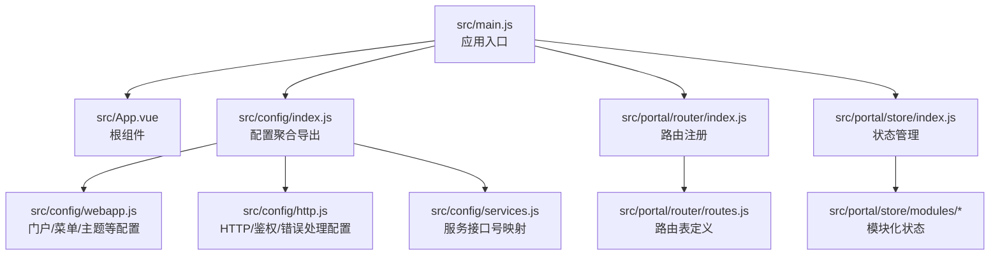
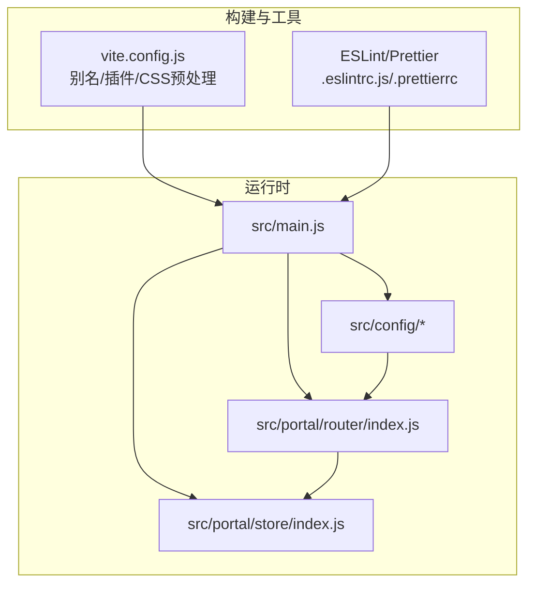
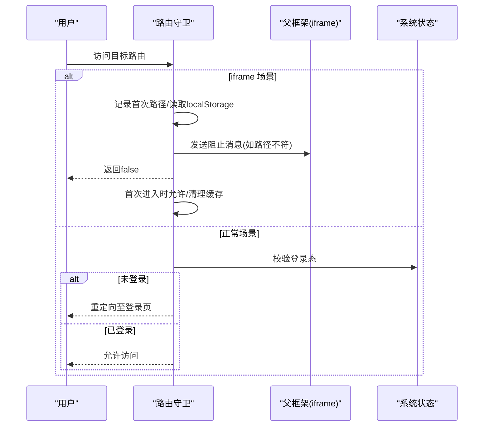
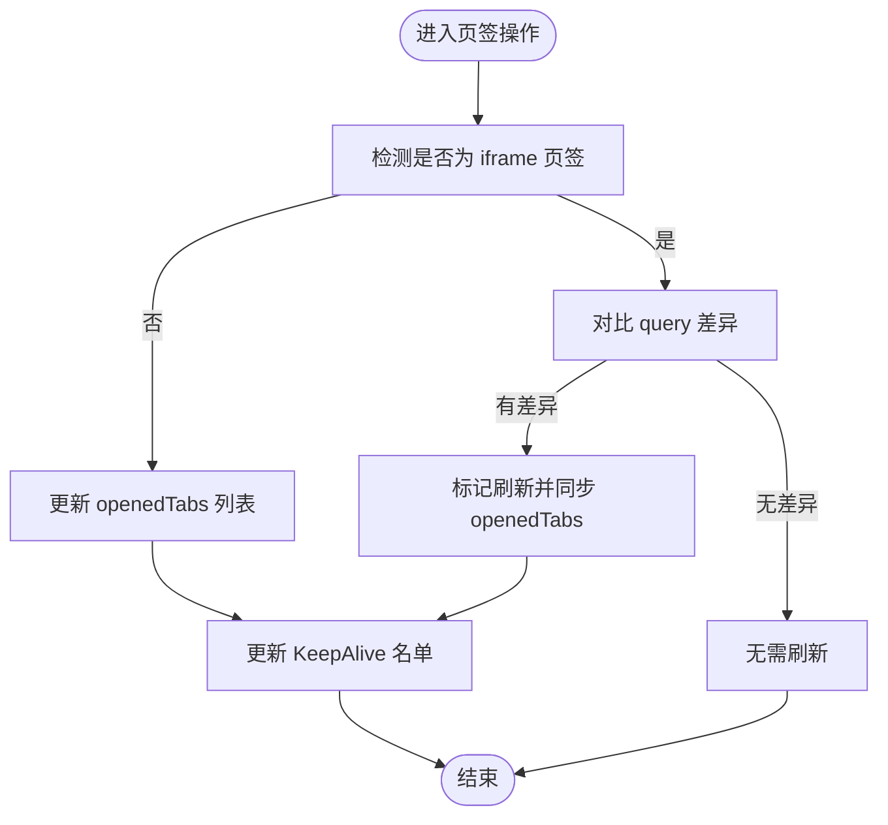
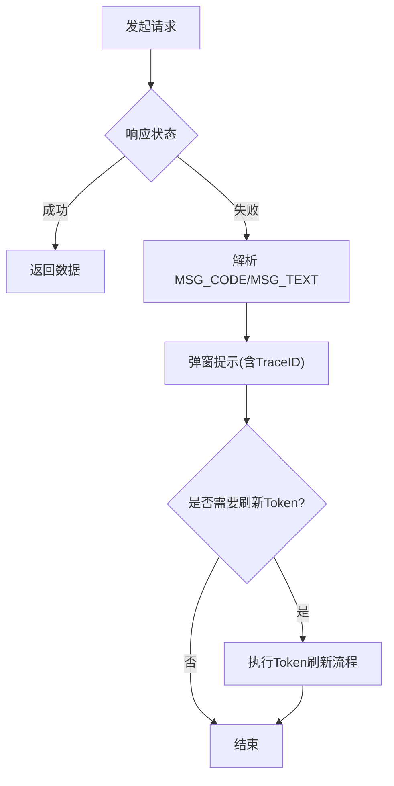
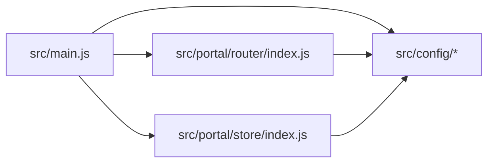

# 开发指南

<cite>
**本文引用的文件**   
- [package.json](file://package.json)
- [README.md](file://README.md)
- [vite.config.js](file://vite.config.js)
- [.eslintrc.js](file://.eslintrc.js)
- [.prettierrc](file://.prettierrc)
- [config/dev.js](file://config/dev.js)
- [config/build.js](file://config/build.js)
- [src/main.js](file://src/main.js)
- [src/App.vue](file://src/App.vue)
- [src/config/index.js](file://src/config/index.js)
- [src/config/webapp.js](file://src/config/webapp.js)
- [src/config/services.js](file://src/config/services.js)
- [src/config/http.js](file://src/config/http.js)
- [src/portal/router/index.js](file://src/portal/router/index.js)
- [src/portal/store/index.js](file://src/portal/store/index.js)
</cite>

## 目录
1. [简介](#简介)
2. [项目结构](#项目结构)
3. [核心组件](#核心组件)
4. [架构总览](#架构总览)
5. [详细组件分析](#详细组件分析)
6. [依赖关系分析](#依赖关系分析)
7. [性能考虑](#性能考虑)
8. [故障排查指南](#故障排查指南)
9. [结论](#结论)
10. [附录](#附录)

## 简介
本开发指南面向 FS-AOI-WEB 团队，系统化阐述开发规范、编码标准与最佳实践，覆盖 Vue 组件开发、状态管理、路由配置、样式编写、代码组织、文件命名与模块导入方式，并提供开发工具使用、调试技巧与性能优化建议。目标是统一团队开发体验，提升代码质量与交付效率。

## 项目结构
项目采用多页面/多子应用的组织方式，核心入口位于 src/main.js，通过 KJDP 框架能力完成 UI 注册、全局配置注入与路由挂载；配置层集中于 src/config，路由与状态管理分别位于 src/portal/router 与 src/portal/store；业务页面按域划分在 src/pages 与 src/portal/views 等目录。

图表来源
- [src/main.js](file://src/main.js#L1-L40)
- [src/App.vue](file://src/App.vue#L1-L8)
- [src/config/index.js](file://src/config/index.js#L1-L8)
- [src/config/webapp.js](file://src/config/webapp.js#L1-L254)
- [src/config/http.js](file://src/config/http.js#L1-L124)
- [src/config/services.js](file://src/config/services.js#L1-L28)
- [src/portal/router/index.js](file://src/portal/router/index.js#L1-L141)
- [src/portal/store/index.js](file://src/portal/store/index.js#L1-L226)

章节来源
- [src/main.js](file://src/main.js#L1-L40)
- [src/App.vue](file://src/App.vue#L1-L8)
- [src/config/index.js](file://src/config/index.js#L1-L8)

## 核心组件
- 应用入口与依赖注入
  - 创建 Vue 应用实例，注册 Pinia、KJDP Core 与 KJDP UI，注入全局配置，设置错误处理回调，按框架回调顺序挂载路由与应用。
- 根组件与缓存策略
  - 根组件使用 RouterView 包裹 KeepAlive，实现页面级组件缓存复用，降低重复渲染成本。
- 配置聚合
  - 将 HTTP、WebApp、服务接口号、常量与回调统一导出，便于各模块按需引入。

章节来源
- [src/main.js](file://src/main.js#L1-L40)
- [src/App.vue](file://src/App.vue#L1-L8)
- [src/config/index.js](file://src/config/index.js#L1-L8)

## 架构总览
FS-AOI-WEB 基于 Vite 构建，采用 Vue 3 + Pinia + Vue Router + KJDP UI 框架，通过统一配置中心与路由守卫实现菜单驱动的门户导航与安全控制；HTTP 层集成统一错误提示与会话处理，支持在 KONE 环境下的 Token 刷新策略。

图表来源
- [vite.config.js](file://vite.config.js#L1-L80)
- [.eslintrc.js](file://.eslintrc.js#L1-L35)
- [.prettierrc](file://.prettierrc#L1-L12)
- [src/main.js](file://src/main.js#L1-L40)
- [src/portal/router/index.js](file://src/portal/router/index.js#L1-L141)
- [src/portal/store/index.js](file://src/portal/store/index.js#L1-L226)
- [src/config/index.js](file://src/config/index.js#L1-L8)

## 详细组件分析

### 路由与导航
- 路由模式与参数编解码
  - 使用 Hash 模式，支持对 URL 参数进行可选加密/解密，避免明文参数泄露。
- 嵌入式场景与跨框架通信
  - 在 iframe 场景下，首次进入记录目标路径，后续同路径内跳转通过 postMessage 与父框架协商，防止非法 push 导致页面漂移。
- 登录态与重定向
  - 未登录时统一跳转至登录页；部分路由支持回退重定向，避免硬编码路径。
- 动态路由与刷新修复
  - 针对动态路由刷新首跳失败问题提供兼容处理。

图表来源
- [src/portal/router/index.js](file://src/portal/router/index.js#L46-L134)

章节来源
- [src/portal/router/index.js](file://src/portal/router/index.js#L1-L141)

### 状态管理（Pinia）
- Store 设计
  - 使用 defineStore 定义命名空间，集中维护门户数据、菜单树、常用菜单、已打开页签、KeepAlive 名单、iframe 引用等。
- 页签与缓存
  - 提供 updateOpenedTabs / deleteOpenedTab 与 KeepAlive 名单维护，确保页签切换与刷新行为可控。
- iframe 页签刷新策略
  - 基于 query 差异触发刷新，同时同步更新 openedTabs 与 KeepAlive 名单，避免重复渲染与数据陈旧。

图表来源
- [src/portal/store/index.js](file://src/portal/store/index.js#L110-L203)

章节来源
- [src/portal/store/index.js](file://src/portal/store/index.js#L1-L226)

### HTTP 与安全
- 统一错误处理
  - 基于响应头中的 MSG_CODE 与 MSG_TEXT 组合错误提示，支持 TraceID 输出，便于定位问题。
- 会话与加密
  - 支持请求加密开关；在 KONE 环境下集成 Token 刷新处理器；提供通用上传/下载/删除接口地址。
- 请求上下文扩展
  - 可扩展附加菜单上下文信息（菜单 ID/名称）到请求体，便于后端审计与追踪。

图表来源
- [src/config/http.js](file://src/config/http.js#L6-L25)
- [src/config/http.js](file://src/config/http.js#L43-L45)

章节来源
- [src/config/http.js](file://src/config/http.js#L1-L124)

### 配置体系
- WebApp 配置
  - 菜单字段映射、菜单过滤与记忆、顶部搜索配置、页签上限与栈模式、首页模板配置、主题默认值、流程图任务前缀、高亮主题等。
- 服务接口号映射
  - 门户/菜单/常用菜单/字典/系统参数/机构等接口号集中管理，便于替换与维护。
- 项目级参数
  - URL 加密开关、登录态键名、iframe 地址格式化规则、搜索行为、初始加载指示等。

章节来源
- [src/config/webapp.js](file://src/config/webapp.js#L1-L254)
- [src/config/services.js](file://src/config/services.js#L1-L28)
- [src/config/index.js](file://src/config/index.js#L1-L8)

### 构建与开发工具
- Vite 配置
  - 别名映射（@、@assets、@config、@pages、@portal、@hooks、@static），开发/生产差异化静态资源路径，CSS SCSS 全局注入与 PostCSS Charset 移除，构建时移除 console/debugger。
- 开发代理
  - 配置 /copweb、/uasweb、/idmweb、/api 等代理，支持跨域与 X-Real-IP 注入。
- 构建产物分包
  - 依据包名与目录结构生成独立 chunk，支持哈希模式与版本号模式，优化缓存与按需加载。
- Lint 与格式化
  - ESLint 规则：生产环境禁用 console/debugger，推荐 const/let，禁止未使用变量；Prettier 统一风格（缩进、单引号、尾逗号、分号等）。

章节来源
- [vite.config.js](file://vite.config.js#L1-L80)
- [config/dev.js](file://config/dev.js#L1-L39)
- [config/build.js](file://config/build.js#L1-L104)
- [.eslintrc.js](file://.eslintrc.js#L1-L35)
- [.prettierrc](file://.prettierrc#L1-L12)

## 依赖关系分析
- 模块耦合
  - main.js 作为中枢，依赖 config、router、store；router 与 store 通过回调与配置相互协作；config 提供统一的业务与技术参数。
- 外部依赖
  - Vue 3、Pinia、Vue Router、KJDP Core/UI、@vueuse、第三方可视化与文档处理库等；构建侧依赖 Vite、Rollup 插件与压缩插件。

图表来源
- [src/main.js](file://src/main.js#L1-L40)
- [src/portal/router/index.js](file://src/portal/router/index.js#L1-L141)
- [src/portal/store/index.js](file://src/portal/store/index.js#L1-L226)
- [src/config/index.js](file://src/config/index.js#L1-L8)

章节来源
- [src/main.js](file://src/main.js#L1-L40)
- [src/config/index.js](file://src/config/index.js#L1-L8)

## 性能考虑
- 构建优化
  - 按包与目录拆分 vendor chunk，减少重复依赖；对第三方库进行异步分包，按需加载；开启 SourceMap 便于定位问题。
  - 生产构建移除 console/debugger，降低体积与运行时开销。
- 运行时优化
  - KeepAlive 缓存高频页面组件，避免重复渲染；Pinia 精细化更新 openedTabs 与 KeepAlive 名单，减少不必要刷新。
  - 路由参数加密可降低敏感信息暴露风险，同时避免长参数导致的性能问题。
- 样式与资源
  - 全局 SCSS 注入与 PostCSS 处理，统一主题变量与字体图标；静态资源按目录结构输出，便于 CDN 缓存。

章节来源
- [config/build.js](file://config/build.js#L32-L103)
- [vite.config.js](file://vite.config.js#L38-L77)
- [src/portal/store/index.js](file://src/portal/store/index.js#L140-L150)
- [src/portal/router/index.js](file://src/portal/router/index.js#L12-L22)

## 故障排查指南
- 开发代理无法访问后端
  - 检查 config/dev.js 中代理 target 与 changeOrigin 设置，确认跨域与源站地址正确。
- 构建报错缺少 APP_VERSION
  - 使用 cross-env 设置 APP_VERSION 后再执行构建脚本。
- 登录后重定向异常
  - 查看路由守卫中登录态判断与重定向逻辑，确认回调与 meta.redirect 配置。
- 页签刷新无效
  - 确认 query 差异比对逻辑与 KeepAlive 名单更新是否生效。
- 错误提示缺失或不完整
  - 检查 MSG_CODE/MSG_TEXT 解析与弹窗提示逻辑，确认 TraceID 是否存在。

章节来源
- [config/dev.js](file://config/dev.js#L1-L39)
- [vite.config.js](file://vite.config.js#L14-L29)
- [src/portal/router/index.js](file://src/portal/router/index.js#L96-L129)
- [src/portal/store/index.js](file://src/portal/store/index.js#L179-L202)
- [src/config/http.js](file://src/config/http.js#L6-L25)

## 结论
本指南从工程化、架构与开发规范三个维度总结了 FS-AOI-WEB 的最佳实践：以 KJDP 框架为核心，配合统一配置与路由守卫实现菜单驱动的门户体验；通过 Pinia 精细化管理页签与缓存，提升交互性能；借助 Vite 与 ESLint/Prettier 确保构建效率与代码质量。团队在日常开发中应严格遵循本文档的规范与流程，持续优化与沉淀。

## 附录

### 开发规范与最佳实践
- 编码风格
  - 使用 ESLint 与 Prettier 统一风格；生产环境禁用 console/debugger；优先使用 const/let，避免 var。
- 文件命名
  - 组件文件使用 PascalCase（如 MyComponent.vue）；工具函数与常量使用 camelCase；配置文件使用小写加下划线（如 service_code_map.js）。
- 模块导入
  - 优先使用别名 @、@config、@pages、@portal、@hooks、@static，避免相对路径硬编码。
- 组件开发
  - 单文件组件按功能拆分模板、逻辑与样式；合理使用 KeepAlive 缓存；避免在模板中直接调用复杂逻辑。
- 状态管理
  - 将页面级状态收敛到 Pinia Store，避免跨组件滥用 props/$emit；对高频更新的数据进行浅比较与最小化更新。
- 路由配置
  - 路由命名使用小驼峰；meta 字段统一描述权限与重定向；参数尽量通过 query 传递，必要时启用加密。
- 样式编写
  - 使用 SCSS 变量与混入；组件样式作用域隔离；避免全局污染；主题切换通过变量控制。
- 开发工具
  - 使用 Vite 快速启动与热更新；通过代理联调后端；利用 ESLint 与 Prettier 自动修复；使用浏览器 DevTools 分析网络与性能。

章节来源
- [.eslintrc.js](file://.eslintrc.js#L17-L32)
- [.prettierrc](file://.prettierrc#L1-L12)
- [vite.config.js](file://vite.config.js#L40-L51)
- [src/portal/router/index.js](file://src/portal/router/index.js#L1-L141)
- [src/portal/store/index.js](file://src/portal/store/index.js#L1-L226)

### 常见开发场景与解决方案
- 新增业务页面
  - 在 pages 或 portal/views 下创建目录与入口文件；在路由表中新增条目；如需菜单可见，完善菜单字段映射与过滤配置。
- 集成第三方库
  - 在 config/build.js 中将库加入异步分包清单；在页面中按需 import；注意版本与兼容性。
- 调试与联调
  - 使用代理转发 /api 与静态资源；在开发配置中开启必要的日志；通过浏览器 Network 面板观察请求与响应。
- 代码质量保障
  - 提交前执行 lint 与 format；修复 ESLint 报错与 Prettier 格式问题；避免未使用变量与 console。

章节来源
- [config/build.js](file://config/build.js#L20-L30)
- [config/dev.js](file://config/dev.js#L9-L36)
- [package.json](file://package.json#L6-L12)