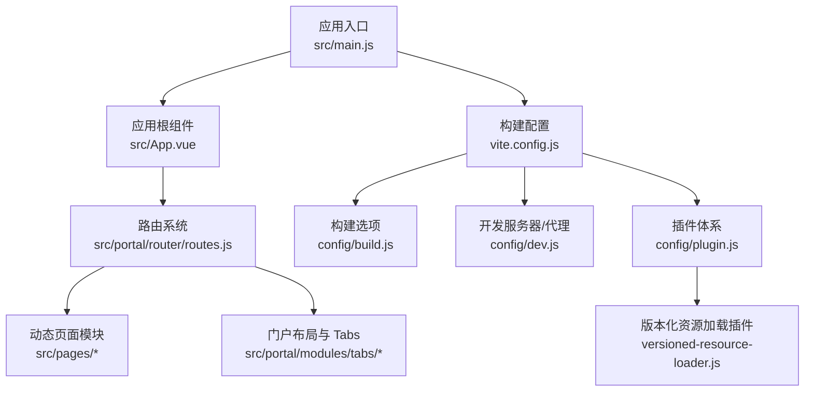
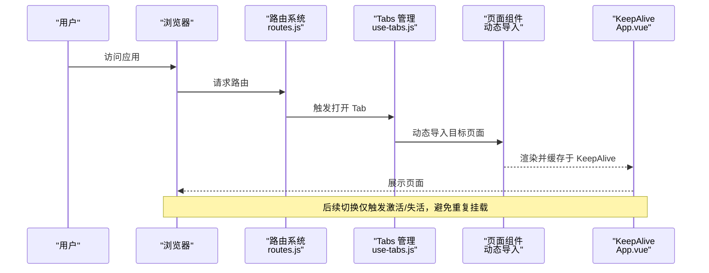
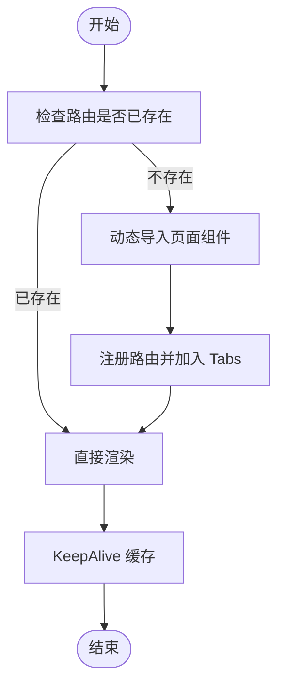
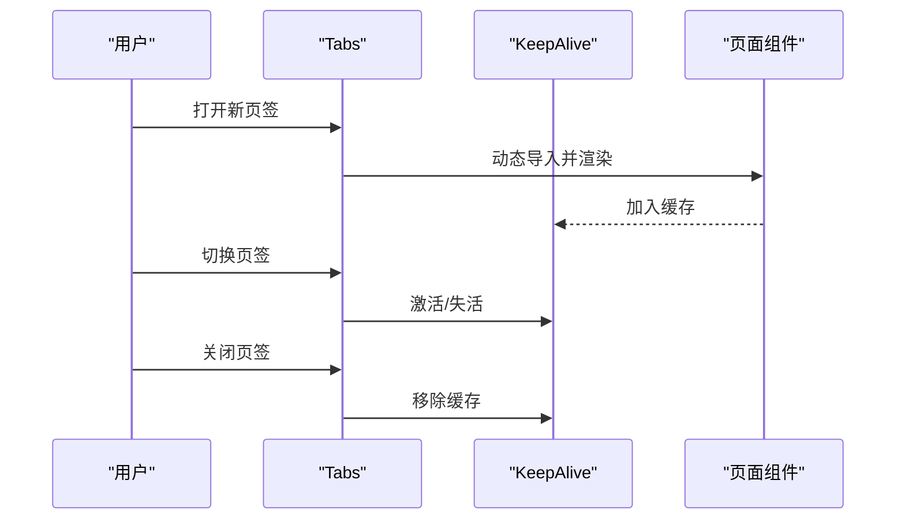
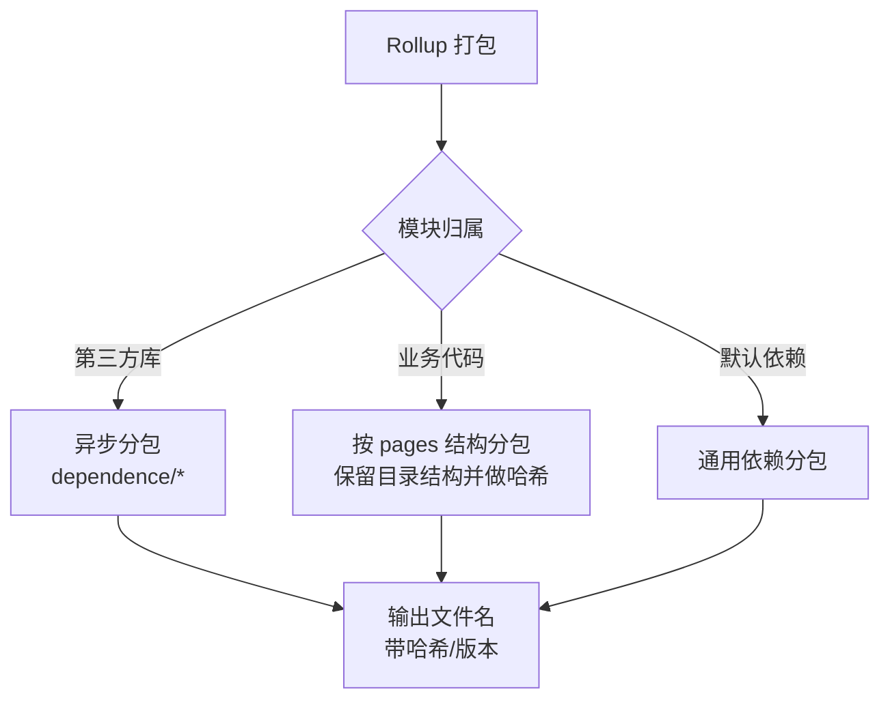
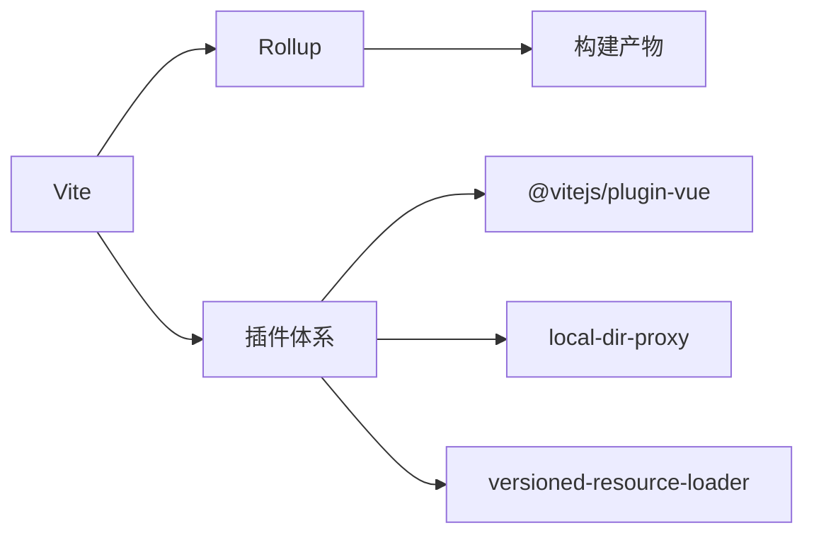

# 性能优化

<cite>
**本文引用的文件**   
- [vite.config.js](file://vite.config.js)
- [package.json](file://package.json)
- [config/build.js](file://config/build.js)
- [config/dev.js](file://config/dev.js)
- [config/plugin.js](file://config/plugin.js)
- [config/plugins/versioned-resource-loader/versioned-resource-loader.js](file://config/plugins/versioned-resource-loader/versioned-resource-loader.js)
- [src/main.js](file://src/main.js)
- [src/App.vue](file://src/App.vue)
- [src/portal/router/routes.js](file://src/portal/router/routes.js)
- [src/portal/hooks/use-pages.js](file://src/portal/hooks/use-pages.js)
- [src/portal/modules/tabs/use-tabs.js](file://src/portal/modules/tabs/use-tabs.js)
</cite>

## 目录
1. [简介](#简介)
2. [项目结构](#项目结构)
3. [核心组件](#核心组件)
4. [架构总览](#架构总览)
5. [详细组件分析](#详细组件分析)
6. [依赖分析](#依赖分析)
7. [性能考虑](#性能考虑)
8. [故障排查指南](#故障排查指南)
9. [结论](#结论)
10. [附录](#附录)

## 简介
本指南面向 FS-AOI-WEB 项目的前端性能优化，围绕代码分割与懒加载、组件缓存、构建优化与产物命名策略、图片与字体优化、CSS 优化、内存与 DOM/事件优化、性能监控与指标分析、以及常见问题诊断与解决展开。文档结合项目现有配置（Vite、Rollup、插件体系）进行落地建议，帮助在开发与生产环境中获得更佳的首屏速度、交互流畅度与长期稳定性。

## 项目结构
FS-AOI-WEB 采用 Vite + Vue 3 + Pinia 的现代前端架构，路由与页面按门户维度组织，大量使用动态导入实现按需加载；构建阶段通过 Rollup 的 manualChunks 进行细粒度分包，配合版本化资源加载插件提升缓存命中与灰度能力。

图表来源
- [src/main.js](file://src/main.js#L1-L40)
- [src/App.vue](file://src/App.vue#L1-L8)
- [src/portal/router/routes.js](file://src/portal/router/routes.js#L1-L78)
- [vite.config.js](file://vite.config.js#L1-L80)
- [config/build.js](file://config/build.js#L1-L104)
- [config/dev.js](file://config/dev.js#L1-L39)
- [config/plugin.js](file://config/plugin.js#L1-L17)
- [config/plugins/versioned-resource-loader/versioned-resource-loader.js](file://config/plugins/versioned-resource-loader/versioned-resource-loader.js#L1-L193)

章节来源
- [vite.config.js](file://vite.config.js#L1-L80)
- [config/build.js](file://config/build.js#L1-L104)
- [config/dev.js](file://config/dev.js#L1-L39)
- [config/plugin.js](file://config/plugin.js#L1-L17)
- [config/plugins/versioned-resource-loader/versioned-resource-loader.js](file://config/plugins/versioned-resource-loader/versioned-resource-loader.js#L1-L193)
- [src/main.js](file://src/main.js#L1-L40)
- [src/App.vue](file://src/App.vue#L1-L8)
- [src/portal/router/routes.js](file://src/portal/router/routes.js#L1-L78)

## 核心组件
- 应用入口与全局注册：在入口中完成应用实例创建、状态管理、UI 组件库与样式注入、路由挂载与错误处理回调，奠定全局性能基线。
- 根组件与 KeepAlive：根组件对 RouterView 使用 KeepAlive，减少重复渲染与组件重建成本，提升切换体验。
- 路由与动态导入：路由表通过动态导入实现页面级懒加载，结合 Tabs 管理打开的页面，避免一次性加载全部页面。
- 版本化资源加载插件：在生产非 hash 模式下，为静态资源与动态 chunk 注入版本参数，提升浏览器缓存命中与灰度控制能力。
- 构建分包策略：通过 manualChunks 将第三方依赖与业务代码分离，针对大体积库进行异步分包，降低首屏依赖体积。

章节来源
- [src/main.js](file://src/main.js#L1-L40)
- [src/App.vue](file://src/App.vue#L1-L8)
- [src/portal/router/routes.js](file://src/portal/router/routes.js#L1-L78)
- [config/plugin.js](file://config/plugin.js#L1-L17)
- [config/plugins/versioned-resource-loader/versioned-resource-loader.js](file://config/plugins/versioned-resource-loader/versioned-resource-loader.js#L1-L193)
- [config/build.js](file://config/build.js#L1-L104)

## 架构总览
以下序列图展示从用户访问到页面渲染的关键链路，强调懒加载与缓存策略如何影响首屏与后续交互性能。

图表来源
- [src/portal/router/routes.js](file://src/portal/router/routes.js#L1-L78)
- [src/portal/modules/tabs/use-tabs.js](file://src/portal/modules/tabs/use-tabs.js#L292-L366)
- [src/App.vue](file://src/App.vue#L1-L8)

## 详细组件分析

### 1) 代码分割与懒加载
- 路由级懒加载：路由表中使用动态导入加载页面组件，确保进入首页时不加载所有页面。
- Tabs 打开流程：打开新页签时才动态导入对应页面，避免一次性加载全部页面。
- 页面索引扫描：通过 import.meta.glob 预先收集页面索引，便于统一管理与扩展。

图表来源
- [src/portal/router/routes.js](file://src/portal/router/routes.js#L50-L75)
- [src/portal/modules/tabs/use-tabs.js](file://src/portal/modules/tabs/use-tabs.js#L167-L196)
- [src/portal/hooks/use-pages.js](file://src/portal/hooks/use-pages.js#L1-L21)

章节来源
- [src/portal/router/routes.js](file://src/portal/router/routes.js#L1-L78)
- [src/portal/modules/tabs/use-tabs.js](file://src/portal/modules/tabs/use-tabs.js#L292-L366)
- [src/portal/hooks/use-pages.js](file://src/portal/hooks/use-pages.js#L1-L21)

### 2) 组件缓存（KeepAlive）
- 根组件对 RouterView 使用 KeepAlive，避免重复挂载与销毁带来的性能损耗。
- Tabs 在关闭时删除 KeepAlive 缓存项，防止内存泄漏；在刷新时可选择性重建以保证数据一致性。

图表来源
- [src/App.vue](file://src/App.vue#L1-L8)
- [src/portal/modules/tabs/use-tabs.js](file://src/portal/modules/tabs/use-tabs.js#L380-L419)

章节来源
- [src/App.vue](file://src/App.vue#L1-L8)
- [src/portal/modules/tabs/use-tabs.js](file://src/portal/modules/tabs/use-tabs.js#L368-L419)

### 3) 构建优化与产物命名
- 分包策略：manualChunks 将 node_modules 中的大体积库（如图表、文档处理等）拆分为独立异步分包，降低首屏依赖体积。
- 文件命名：根据构建模式（hash/版本）生成稳定或带哈希的文件名，提升缓存命中与可追踪性。
- 版本化资源加载：在非 hash 生产模式下，为 JS/CSS/HTML 中的资源注入版本参数，便于灰度与回滚。

图表来源
- [config/build.js](file://config/build.js#L60-L100)
- [config/plugin.js](file://config/plugin.js#L8-L13)
- [config/plugins/versioned-resource-loader/versioned-resource-loader.js](file://config/plugins/versioned-resource-loader/versioned-resource-loader.js#L37-L106)

章节来源
- [config/build.js](file://config/build.js#L1-L104)
- [config/plugin.js](file://config/plugin.js#L1-L17)
- [config/plugins/versioned-resource-loader/versioned-resource-loader.js](file://config/plugins/versioned-resource-loader/versioned-resource-loader.js#L1-L193)

### 4) 图片优化
- 资源引入：优先使用打包器内联或按需加载，避免首屏阻塞。
- 延迟加载：对非首屏图片采用懒加载策略，减少初始渲染压力。
- 格式与尺寸：优先使用现代格式（WebP/AVIF），按设备像素比提供合适尺寸，避免超大图进入首屏。
- 缓存策略：结合版本化资源加载与 CDN 缓存头，确保静态资源长期有效。

[本节为通用实践说明，无需列出具体文件来源]

### 5) 字体优化
- 子集化与预加载：仅加载所需字形，使用 preload 提前拉取关键字体。
- 本地化与缓存：将常用字体置于本地或 CDN，配合版本参数与长缓存头。
- 回退与降级：设置合适的 font-display 与回退字体，避免 FOIT/FOUT 影响感知速度。

[本节为通用实践说明，无需列出具体文件来源]

### 6) CSS 优化
- 作用域与按需：使用作用域样式与按需引入，避免全局污染与冗余样式。
- PostCSS 插件：移除无用规则与 @charset，减少 CSS 体积。
- 动态样式：对动态生成的样式进行最小化与去重，避免重复注入。

章节来源
- [vite.config.js](file://vite.config.js#L55-L77)

### 7) 内存管理
- KeepAlive 生命周期：在关闭页签时及时清理缓存，避免组件实例与监听器残留。
- 事件解绑：在组件卸载时移除全局事件与定时器，防止内存泄漏。
- 大对象释放：对大数组/对象在不再使用时置空或替换，交由 GC 回收。

章节来源
- [src/portal/modules/tabs/use-tabs.js](file://src/portal/modules/tabs/use-tabs.js#L417-L425)

### 8) DOM 操作与事件处理优化
- 减少重排重绘：批量更新 DOM，合并多次样式修改，使用 transform/opacity 等 GPU 友好属性。
- 事件委托：优先使用事件委托，减少监听器数量。
- 防抖与节流：对滚动、输入、窗口 resize 等高频事件进行防抖/节流，降低主线程压力。

[本节为通用实践说明，无需列出具体文件来源]

### 9) 性能监控与指标分析
- 关键指标：FP、FCP、LCP、FID、CLS、TTI、INP 等，结合浏览器开发者工具与 Web Vitals。
- 实施建议：在应用入口与关键路由节点埋点，记录首屏时间、交互延迟与错误率。
- 工具推荐：Lighthouse、PageSpeed Insights、Sentry、自研埋点上报。

[本节为通用实践说明，无需列出具体文件来源]

## 依赖分析
- 开发与构建：Vite 作为开发服务器与打包器，Rollup 作为底层打包引擎；PostCSS、SCSS 预处理器参与样式处理。
- 运行时依赖：Vue 3、Pinia、UI 组件库与若干业务/第三方库，其中部分库（如图表、文档处理）已配置为异步分包。
- 插件生态：Vue SFC 插件、本地目录代理、版本化资源加载插件，分别服务于开发体验与生产缓存/灰度。

图表来源
- [vite.config.js](file://vite.config.js#L1-L80)
- [config/plugin.js](file://config/plugin.js#L1-L17)
- [package.json](file://package.json#L1-L61)

章节来源
- [vite.config.js](file://vite.config.js#L1-L80)
- [config/plugin.js](file://config/plugin.js#L1-L17)
- [package.json](file://package.json#L1-L61)

## 性能考虑
- 构建阶段
  - 保持 esbuild 删除 console/debugger，减少运行时开销。
  - 在生产开启压缩与资源版本化，结合 CDN 与缓存头策略。
  - 对大体积库进行异步分包，避免首屏阻塞。
- 运行时
  - 使用 KeepAlive 缓存页面，减少重复渲染。
  - 动态导入页面组件，按需加载。
  - 合理使用事件委托与防抖/节流，降低主线程压力。
- 资源与缓存
  - 为静态资源注入版本参数，提升缓存命中与灰度控制。
  - 对图片与字体进行格式优化与尺寸裁剪，减少传输体积。

章节来源
- [vite.config.js](file://vite.config.js#L38-L38)
- [config/build.js](file://config/build.js#L60-L100)
- [config/plugins/versioned-resource-loader/versioned-resource-loader.js](file://config/plugins/versioned-resource-loader/versioned-resource-loader.js#L1-L193)
- [src/App.vue](file://src/App.vue#L1-L8)
- [src/portal/router/routes.js](file://src/portal/router/routes.js#L50-L75)

## 故障排查指南
- 构建失败或版本参数缺失
  - 现象：生产构建提示需要提供版本号。
  - 排查：确认 BUILD_MODE 与 APP_VERSION 环境变量是否正确设置。
  - 解决：按提示设置 APP_VERSION 并重新构建。
- 资源未加版本参数
  - 现象：CDN 缓存未生效或灰度不生效。
  - 排查：确认非 hash 模式下插件已启用，includeGlobs 是否包含动态模块。
  - 解决：修正插件配置与 includeGlobs，确保 JS/CSS/HTML 资源被注入版本参数。
- 首屏缓慢
  - 现象：页面白屏时间长或交互卡顿。
  - 排查：检查路由懒加载是否生效、第三方库是否异步分包、是否存在大图/字体阻塞。
  - 解决：优化分包策略、启用图片/字体优化、减少首屏依赖。
- 内存增长
  - 现象：长时间使用后内存持续上升。
  - 排查：确认 Tabs 关闭时是否清理 KeepAlive 缓存、组件卸载时是否移除事件与定时器。
  - 解决：完善生命周期清理逻辑，避免监听器与实例残留。

章节来源
- [vite.config.js](file://vite.config.js#L14-L29)
- [config/plugin.js](file://config/plugin.js#L8-L13)
- [config/plugins/versioned-resource-loader/versioned-resource-loader.js](file://config/plugins/versioned-resource-loader/versioned-resource-loader.js#L1-L193)
- [src/portal/modules/tabs/use-tabs.js](file://src/portal/modules/tabs/use-tabs.js#L417-L425)

## 结论
通过合理的代码分割与懒加载、组件缓存、构建分包与版本化资源加载、以及图片/字体/CSS 优化，FS-AOI-WEB 可在保证开发效率的同时显著提升用户体验。建议在持续集成中加入性能基线与回归测试，确保每次发布都维持或改善性能表现。

## 附录
- 开发与构建脚本：参考 package.json 中 scripts 字段，使用 Vite 提供的 dev/build/preview 能力。
- 开发服务器与代理：参考 config/dev.js，按需调整端口、主机与代理规则。
- 版本化资源加载：参考 config/plugin.js 与 versioned-resource-loader 插件，确保生产环境资源具备版本参数。

章节来源
- [package.json](file://package.json#L6-L12)
- [config/dev.js](file://config/dev.js#L1-L39)
- [config/plugin.js](file://config/plugin.js#L1-L17)
- [config/plugins/versioned-resource-loader/versioned-resource-loader.js](file://config/plugins/versioned-resource-loader/versioned-resource-loader.js#L1-L193)