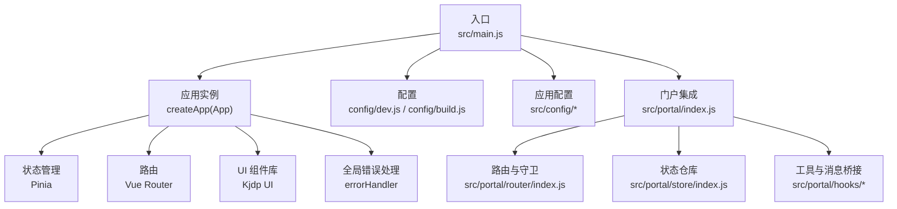
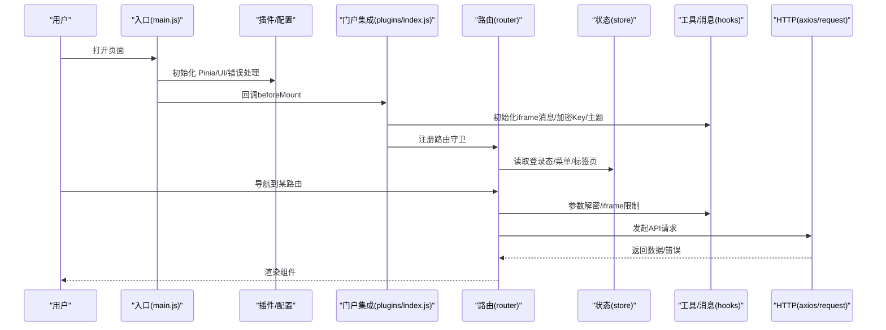
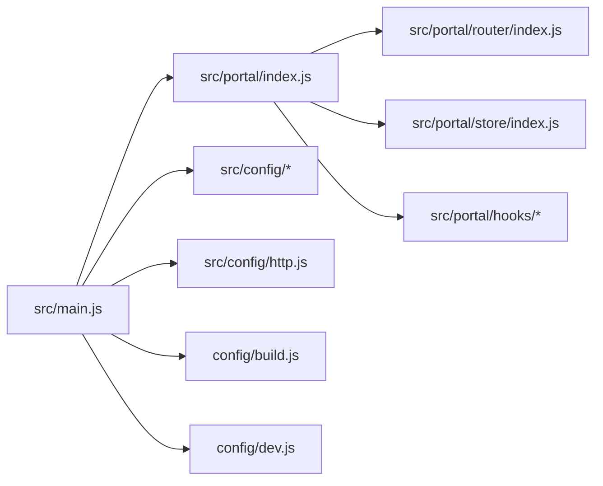

# 调试技巧

<cite>
**本文引用的文件**
- [package.json](file://package.json)
- [vite.config.js](file://vite.config.js)
- [src/main.js](file://src/main.js)
- [src/App.vue](file://src/App.vue)
- [config/dev.js](file://config/dev.js)
- [config/build.js](file://config/build.js)
- [src/config/http.js](file://src/config/http.js)
- [src/config/services.js](file://src/config/services.js)
- [src/portal/index.js](file://src/portal/index.js)
- [src/portal/router/index.js](file://src/portal/router/index.js)
- [src/portal/store/index.js](file://src/portal/store/index.js)
- [src/portal/hooks/use-utils.js](file://src/portal/hooks/use-utils.js)
- [src/portal/hooks/use-message.js](file://src/portal/hooks/use-message.js)
- [public/static/pdf/web/debugger.js](file://public/static/pdf/web/debugger.js)
- [public/static/pdf/build/pdf.js](file://public/static/pdf/build/pdf.js)
</cite>

## 目录
1. [简介](#简介)
2. [项目结构](#项目结构)
3. [核心组件](#核心组件)
4. [架构总览](#架构总览)
5. [详细组件分析](#详细组件分析)
6. [依赖关系分析](#依赖关系分析)
7. [性能考量](#性能考量)
8. [故障排查指南](#故障排查指南)
9. [结论](#结论)
10. [附录](#附录)

## 简介
本指南面向 FS-AOI-WEB 项目的前端调试实践，聚焦 Vue 应用的调试方法与工具使用，涵盖以下主题：
- Vue 应用调试：Vue DevTools 使用、组件状态检查、事件监听、路由与 Pinia 状态调试
- 浏览器开发者工具：网络请求调试、性能分析、内存泄漏检测、断点与日志
- 常见问题定位：组件渲染问题、数据流异常、API 调用失败、路由跳转异常
- 生产环境问题排查：错误收集、埋点与追踪、日志与指标

## 项目结构
FS-AOI-WEB 基于 Vite + Vue 3 + Pinia + Vue Router，采用模块化组织页面与功能模块，配置集中于 config 目录，入口在 src/main.js 中初始化应用、插件与全局错误处理。

图表来源
- [src/main.js](file://src/main.js#L1-L40)
- [config/dev.js](file://config/dev.js#L1-L39)
- [config/build.js](file://config/build.js#L1-L104)
- [src/portal/index.js](file://src/portal/index.js#L1-L153)
- [src/portal/router/index.js](file://src/portal/router/index.js#L1-L141)
- [src/portal/store/index.js](file://src/portal/store/index.js#L1-L226)
- [src/portal/hooks/use-utils.js](file://src/portal/hooks/use-utils.js#L1-L330)
- [src/portal/hooks/use-message.js](file://src/portal/hooks/use-message.js#L1-L503)

章节来源
- [package.json](file://package.json#L1-L61)
- [vite.config.js](file://vite.config.js#L1-L80)
- [src/main.js](file://src/main.js#L1-L40)

## 核心组件
- 应用入口与全局错误处理：在入口中注册 Pinia、UI 插件与全局错误处理器，确保异常可捕获与记录。
- 门户集成与回调：通过回调映射在挂载前后注入主题、图标、iframe 消息桥接、子系统模式校验等。
- 路由与参数加解密：基于项目配置决定 URL 加密策略，路由守卫中实现登录态校验、iframe 内路由限制与参数同步。
- 状态仓库：集中管理菜单、标签页、iframe 引用、URL 加密密钥等状态。
- 工具与消息桥接：提供 URL 参数编解码、DOM 结构探测、iframe 生命周期消息监听与标签页控制。
- HTTP 配置：统一错误提示、会话过期处理、请求头扩展、加密开关与错误反馈。

章节来源
- [src/main.js](file://src/main.js#L1-L40)
- [src/portal/index.js](file://src/portal/index.js#L1-L153)
- [src/portal/router/index.js](file://src/portal/router/index.js#L1-L141)
- [src/portal/store/index.js](file://src/portal/store/index.js#L1-L226)
- [src/portal/hooks/use-utils.js](file://src/portal/hooks/use-utils.js#L1-L330)
- [src/portal/hooks/use-message.js](file://src/portal/hooks/use-message.js#L1-L503)
- [src/config/http.js](file://src/config/http.js#L1-L124)

## 架构总览
FS-AOI-WEB 的调试关注点主要集中在“入口 -> 插件/配置 -> 门户集成 -> 路由/状态 -> 工具与消息 -> HTTP 层”的链路。

图表来源
- [src/main.js](file://src/main.js#L1-L40)
- [src/portal/index.js](file://src/portal/index.js#L1-L153)
- [src/portal/router/index.js](file://src/portal/router/index.js#L1-L141)
- [src/portal/store/index.js](file://src/portal/store/index.js#L1-L226)
- [src/portal/hooks/use-utils.js](file://src/portal/hooks/use-utils.js#L1-L330)
- [src/config/http.js](file://src/config/http.js#L1-L124)

## 详细组件分析

### Vue 应用调试与 Vue DevTools 使用
- 组件层级与状态检查
  - 在组件树中定位关键容器（如 RouterView 包裹的 KeepAlive），观察 props、data、computed、watchers 的变化。
  - 使用“组件”面板查看组件实例，核对 props 与 emits 的触发顺序，确认事件冒泡与拦截逻辑。
- 事件监听与派发
  - 在“事件”面板中筛选组件事件，结合路由守卫与消息桥接逻辑，验证导航钩子与 iframe 通信是否按预期触发。
- 路由与状态联动
  - 在“状态”面板中检查 Pinia store 的菜单、标签页、iframe 引用等字段，观察路由切换时的状态变化。
- KeepAlive 与渲染
  - 观察 RouterView + KeepAlive 的缓存行为，确认组件生命周期钩子（如 activated/deactivated）与 iframe 生命周期消息的配合。

章节来源
- [src/App.vue](file://src/App.vue#L1-L8)
- [src/portal/router/index.js](file://src/portal/router/index.js#L1-L141)
- [src/portal/store/index.js](file://src/portal/store/index.js#L1-L226)
- [src/portal/hooks/use-message.js](file://src/portal/hooks/use-message.js#L1-L503)

### 浏览器开发者工具应用
- 网络请求调试
  - 使用“网络”面板观察 API 请求的 URL、请求头、响应体与状态码；结合 HTTP 配置中的错误处理与会话过期拦截，定位失败原因。
  - 关注代理配置（开发环境）与 baseURL 设置，确保请求路径正确。
- 性能分析
  - 使用“性能”面板录制页面交互，观察主线程耗时、重排重绘与长任务；结合路由守卫与 KeepAlive 的使用评估渲染成本。
- 内存泄漏检测
  - 使用“内存”面板快照对比，排查未清理的事件监听器、定时器与 iframe 引用；关注消息监听器与路由守卫中的副作用清理。

章节来源
- [config/dev.js](file://config/dev.js#L1-L39)
- [src/config/http.js](file://src/config/http.js#L1-L124)
- [src/portal/hooks/use-message.js](file://src/portal/hooks/use-message.js#L1-L503)

### 断点调试、日志输出与错误追踪
- 断点调试
  - 在路由守卫、消息监听回调、store actions 中设置断点，逐步执行以定位状态变更时机与异常分支。
- 日志输出
  - 在关键流程（如 URL 加解密、iframe 消息处理、路由跳转）输出上下文日志，便于回溯。
- 错误追踪
  - 入口处的全局错误处理器负责捕获异常；结合浏览器控制台与网络面板，定位具体错误来源。

章节来源
- [src/main.js](file://src/main.js#L29-L33)
- [src/portal/hooks/use-utils.js](file://src/portal/hooks/use-utils.js#L1-L330)
- [src/portal/hooks/use-message.js](file://src/portal/hooks/use-message.js#L1-L503)

### 常见问题与调试思路

#### 组件渲染问题
- 症状：组件未更新、KeepAlive 缓存导致状态未刷新。
- 调试步骤：
  - 检查 RouterView + KeepAlive 的包裹与路由参数变化。
  - 在 store 中确认标签页与 iframe 状态是否更新，必要时强制刷新标识。
  - 使用 Vue DevTools 的“组件”面板观察组件实例与生命周期钩子。

章节来源
- [src/App.vue](file://src/App.vue#L1-L8)
- [src/portal/store/index.js](file://src/portal/store/index.js#L140-L203)

#### 数据流异常
- 症状：菜单/路由/标签页状态不一致。
- 调试步骤：
  - 在路由守卫中打印 to/from 与 query/params，确认参数来源与覆盖逻辑。
  - 在 store 的 actions 中核对状态合并与去重逻辑，避免重复项与引用污染。
  - 使用“状态”面板实时观察状态变化。

章节来源
- [src/portal/router/index.js](file://src/portal/router/index.js#L46-L134)
- [src/portal/store/index.js](file://src/portal/store/index.js#L110-L150)

#### API 调用失败
- 症状：接口报错、会话过期、加密参数异常。
- 调试步骤：
  - 查看网络面板的请求与响应，结合错误处理函数与会话过期拦截逻辑定位问题。
  - 核对请求头扩展、REQ_MSG_HDR 附加字段与加密开关。
  - 在开发环境下检查代理配置与跨域头设置。

章节来源
- [src/config/http.js](file://src/config/http.js#L1-L124)
- [config/dev.js](file://config/dev.js#L1-L39)

#### 路由跳转异常
- 症状：iframe 内路由被阻止、首次跳转失败、参数丢失。
- 调试步骤：
  - 在路由守卫中打印路由信息与 iframe 标记，确认是否命中限制逻辑。
  - 检查本地存储的 routeTo 缓存与参数合并逻辑。
  - 使用 Vue DevTools 的“事件”面板验证消息桥接是否正常。

章节来源
- [src/portal/router/index.js](file://src/portal/router/index.js#L46-L90)
- [src/portal/hooks/use-message.js](file://src/portal/hooks/use-message.js#L429-L482)

### PDF 调试辅助（可选）
- 若涉及 PDF 预览，可借助内置调试工具进行字体与性能分析。
- 使用方式：在 PDF 页面 URL 上添加调试参数以启用相关面板。

章节来源
- [public/static/pdf/web/debugger.js](file://public/static/pdf/web/debugger.js#L18-L612)
- [public/static/pdf/build/pdf.js](file://public/static/pdf/build/pdf.js#L7859-L7913)

## 依赖关系分析

图表来源
- [src/main.js](file://src/main.js#L1-L40)
- [src/portal/index.js](file://src/portal/index.js#L1-L153)
- [src/portal/router/index.js](file://src/portal/router/index.js#L1-L141)
- [src/portal/store/index.js](file://src/portal/store/index.js#L1-L226)
- [src/portal/hooks/use-utils.js](file://src/portal/hooks/use-utils.js#L1-L330)
- [src/portal/hooks/use-message.js](file://src/portal/hooks/use-message.js#L1-L503)
- [src/config/http.js](file://src/config/http.js#L1-L124)
- [config/build.js](file://config/build.js#L1-L104)
- [config/dev.js](file://config/dev.js#L1-L39)

章节来源
- [vite.config.js](file://vite.config.js#L1-L80)
- [package.json](file://package.json#L1-L61)

## 性能考量
- 构建优化
  - 开启 Source Map 便于定位运行时错误；按需拆分异步依赖，减少首屏体积。
- 运行时优化
  - 合理使用 KeepAlive 缓存，避免不必要的组件重建。
  - 控制消息监听器数量与作用域，及时清理事件与定时器。
- 路由与状态
  - 路由守卫中避免重型计算；store 中使用浅层更新与最小化状态切片。

章节来源
- [config/build.js](file://config/build.js#L1-L104)
- [src/portal/router/index.js](file://src/portal/router/index.js#L1-L141)
- [src/portal/store/index.js](file://src/portal/store/index.js#L1-L226)

## 故障排查指南
- 登录态与会话过期
  - 检查会话过期拦截与提示逻辑，确认错误码映射与反馈组件。
- URL 加密与路由参数
  - 核对 URL 加密开关与编解码函数，确保参数在 iframe 场景下的正确传递。
- iframe 消息与生命周期
  - 确认消息监听器挂载与清理、激活/失活事件、内容节点高度计算与同步。
- 生产环境问题
  - 通过全局错误处理器与网络面板定位异常；结合日志与追踪 ID（如 x-b3-traceid）进行链路追踪。

章节来源
- [src/config/http.js](file://src/config/http.js#L1-L124)
- [src/portal/hooks/use-utils.js](file://src/portal/hooks/use-utils.js#L1-L330)
- [src/portal/hooks/use-message.js](file://src/portal/hooks/use-message.js#L1-L503)

## 结论
本指南从入口、路由、状态、工具与 HTTP 五个维度梳理了 FS-AOI-WEB 的调试要点。建议在日常开发中：
- 使用 Vue DevTools 与浏览器开发者工具双管齐下；
- 在关键流程埋点与断点结合，快速定位问题；
- 重视路由与状态的一致性，避免缓存与消息桥接带来的副作用；
- 在生产环境启用错误追踪与日志采集，提升问题复盘效率。

## 附录
- 构建与开发配置
  - 开发服务器与代理配置，便于联调后端与静态资源。
  - 构建产物命名与分包策略，有助于定位资源与缓存问题。

章节来源
- [config/dev.js](file://config/dev.js#L1-L39)
- [config/build.js](file://config/build.js#L1-L104)
- [vite.config.js](file://vite.config.js#L1-L80)