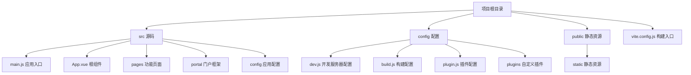
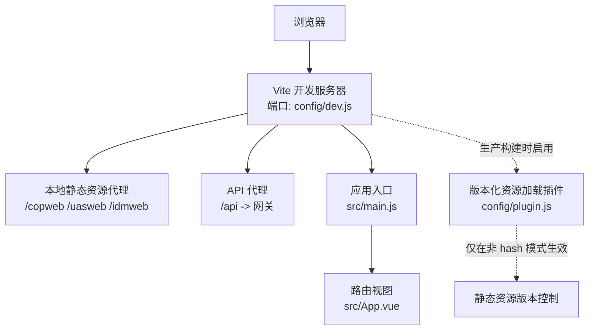
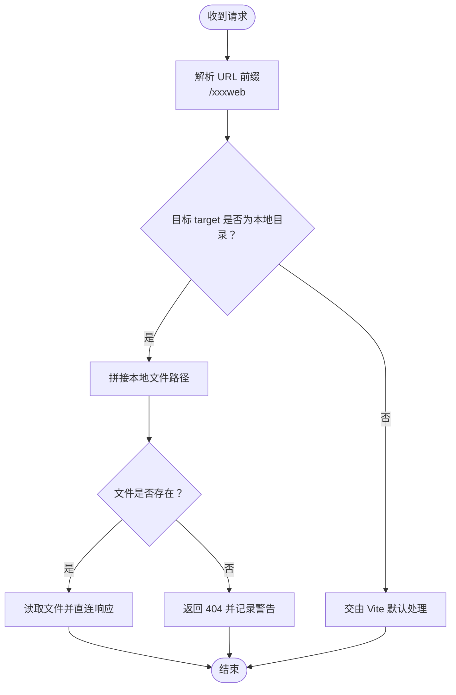
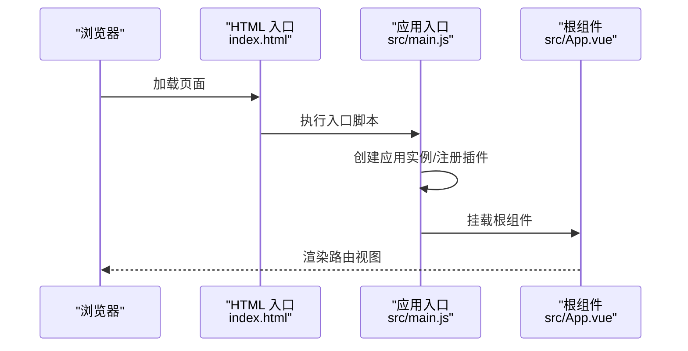
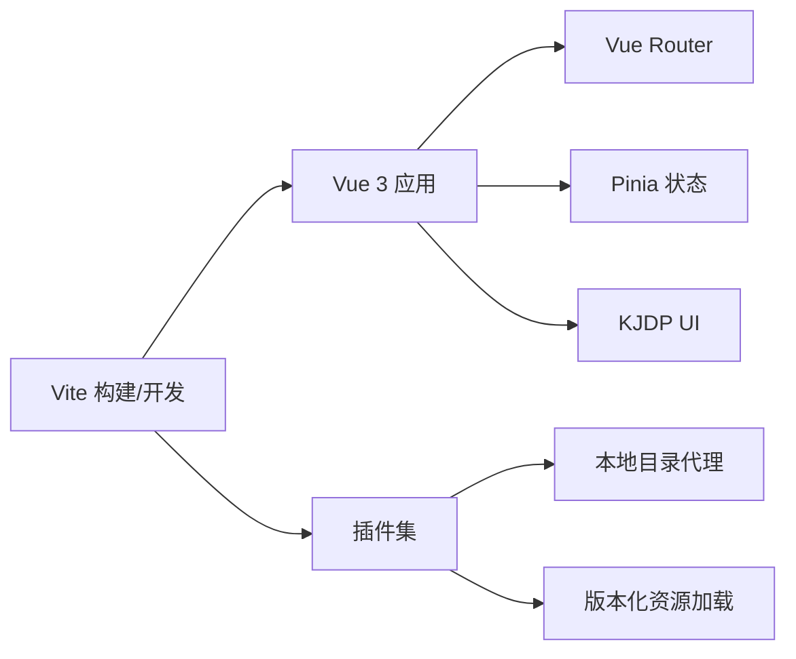

# 快速开始

<cite>
**本文引用的文件**
- [package.json](file://package.json)
- [README.md](file://README.md)
- [vite.config.js](file://vite.config.js)
- [config/dev.js](file://config/dev.js)
- [config/build.js](file://config/build.js)
- [config/plugin.js](file://config/plugin.js)
- [config/plugins/local-dir--proxy/local-dir-proxy.js](file://config/plugins/local-dir--proxy/local-dir-proxy.js)
- [src/main.js](file://src/main.js)
- [src/App.vue](file://src/App.vue)
- [index.html](file://index.html)
- [.prettierrc](file://.prettierrc)
</cite>

## 目录
1. [简介](#简介)
2. [项目结构](#项目结构)
3. [核心组件](#核心组件)
4. [架构总览](#架构总览)
5. [详细组件分析](#详细组件分析)
6. [依赖关系分析](#依赖关系分析)
7. [性能注意事项](#性能注意事项)
8. [故障排查指南](#故障排查指南)
9. [结论](#结论)
10. [附录](#附录)

## 简介
本指南面向新加入的开发者，帮助你在最短时间内完成 FS-AOI-WEB 项目的环境准备、依赖安装与开发服务器启动。你将获得：
- 环境要求（Node.js 版本、包管理器等）
- 克隆与安装步骤
- 开发环境搭建与代理配置
- 启动开发服务器与基础验证
- 常见问题与排错建议
- 项目结构与基本使用示例

## 项目结构
该项目采用 Vite + Vue 3 技术栈，通过模块化组织页面与功能模块，配置集中于 config 目录，公共资源位于 public/static。

图表来源
- [vite.config.js](file://vite.config.js#L1-L80)
- [src/main.js](file://src/main.js#L1-L40)
- [src/App.vue](file://src/App.vue#L1-L8)
- [config/dev.js](file://config/dev.js#L1-L39)
- [config/build.js](file://config/build.js#L1-L104)
- [config/plugin.js](file://config/plugin.js#L1-L17)

章节来源
- [vite.config.js](file://vite.config.js#L1-L80)
- [src/main.js](file://src/main.js#L1-L40)
- [src/App.vue](file://src/App.vue#L1-L8)

## 核心组件
- 应用入口与初始化
  - 应用入口文件负责创建 Vue 应用、注册状态管理、UI 组件库与全局样式，并挂载根组件。
  - 参考路径：[src/main.js](file://src/main.js#L1-L40)
- 根组件
  - 根组件通过路由视图包裹 KeepAlive，实现页面级缓存与复用。
  - 参考路径：[src/App.vue](file://src/App.vue#L1-L8)
- HTML 入口
  - HTML 文件设置缓存策略、图标、标题与初始加载指示器脚本，并在 body 中挂载应用。
  - 参考路径：[index.html](file://index.html#L1-L32)
- 构建与开发配置
  - Vite 配置集中导出开发与构建选项，并注入别名、CSS 预处理、插件与静态资源路径。
  - 参考路径：[vite.config.js](file://vite.config.js#L1-L80)
  - 开发服务器配置（端口、代理）：[config/dev.js](file://config/dev.js#L1-L39)
  - 构建产物命名与分包策略：[config/build.js](file://config/build.js#L1-L104)
  - 插件装配与按需启用：[config/plugin.js](file://config/plugin.js#L1-L17)
- 本地目录代理插件
  - 支持将特定前缀的静态资源请求直接映射到本地目录，便于联调其他子工程。
  - 参考路径：[config/plugins/local-dir--proxy/local-dir-proxy.js](file://config/plugins/local-dir--proxy/local-dir-proxy.js#L1-L39)

章节来源
- [src/main.js](file://src/main.js#L1-L40)
- [src/App.vue](file://src/App.vue#L1-L8)
- [index.html](file://index.html#L1-L32)
- [vite.config.js](file://vite.config.js#L1-L80)
- [config/dev.js](file://config/dev.js#L1-L39)
- [config/build.js](file://config/build.js#L1-L104)
- [config/plugin.js](file://config/plugin.js#L1-L17)
- [config/plugins/local-dir--proxy/local-dir-proxy.js](file://config/plugins/local-dir--proxy/local-dir-proxy.js#L1-L39)

## 架构总览
下图展示了从浏览器请求到本地开发服务器、再到后端网关的典型交互链路，以及本地静态资源代理与版本化资源加载插件的工作位置。

图表来源
- [config/dev.js](file://config/dev.js#L1-L39)
- [config/plugin.js](file://config/plugin.js#L1-L17)
- [src/main.js](file://src/main.js#L1-L40)
- [src/App.vue](file://src/App.vue#L1-L8)

## 详细组件分析

### 环境要求与安装
- Node.js 版本
  - 项目要求 Node.js 版本为 18、20 或更高版本；推荐使用长期支持（LTS）版本。
  - 参考路径：[package.json](file://package.json#L14-L16)
- 包管理器
  - 推荐使用 pnpm 或 npm；项目脚本基于 npm 的 cross-env 使用方式编写。
  - 参考路径：[package.json](file://package.json#L6-L12)
- 安装依赖
  - 首次运行或更新依赖后，需先切换到公司私有源并登录，再执行安装。
  - 参考路径：[README.md](file://README.md#L33-L42)

章节来源
- [package.json](file://package.json#L14-L16)
- [README.md](file://README.md#L33-L42)

### 开发服务器启动与端口配置
- 默认端口
  - 开发服务器默认监听 8080 端口，可通过配置文件调整。
  - 参考路径：[config/dev.js](file://config/dev.js#L4-L7)
- 启动命令
  - 使用 Vite 启动开发服务器。
  - 参考路径：[package.json](file://package.json#L6-L12)
- 代理配置
  - 提供多前缀代理规则，包括静态资源前缀与 API 前缀，并可附加自定义请求头。
  - 参考路径：[config/dev.js](file://config/dev.js#L9-L36)

章节来源
- [config/dev.js](file://config/dev.js#L4-L7)
- [config/dev.js](file://config/dev.js#L9-L36)
- [package.json](file://package.json#L6-L12)

### 本地静态资源代理工作流
当请求路径匹配特定前缀时，插件会尝试读取本地文件系统中的对应资源；若不存在则返回 404 并输出警告日志。

图表来源
- [config/plugins/local-dir--proxy/local-dir-proxy.js](file://config/plugins/local-dir--proxy/local-dir-proxy.js#L1-L39)

章节来源
- [config/plugins/local-dir--proxy/local-dir-proxy.js](file://config/plugins/local-dir--proxy/local-dir-proxy.js#L1-L39)

### 构建流程与产物组织
- 构建模式
  - 支持两种模式：普通模式与 hash 模式；普通模式需提供版本号环境变量。
  - 参考路径：[vite.config.js](file://vite.config.js#L14-L29)
- 版本号要求
  - 普通模式下必须设置 APP_VERSION，否则构建会终止并提示。
  - 参考路径：[vite.config.js](file://vite.config.js#L18-L26)
- 分包与命名
  - 通过 Rollup 手动分包策略，将第三方库与业务代码分离，并对文件名进行哈希或版本化处理。
  - 参考路径：[config/build.js](file://config/build.js#L32-L103)

章节来源
- [vite.config.js](file://vite.config.js#L14-L29)
- [config/build.js](file://config/build.js#L32-L103)

### 应用初始化与路由挂载
应用入口负责创建应用实例、注册状态管理与 UI 组件库、注入全局样式，并在挂载前触发回调，最后挂载到 DOM。

图表来源
- [index.html](file://index.html#L29-L31)
- [src/main.js](file://src/main.js#L21-L39)
- [src/App.vue](file://src/App.vue#L1-L8)

章节来源
- [index.html](file://index.html#L29-L31)
- [src/main.js](file://src/main.js#L21-L39)
- [src/App.vue](file://src/App.vue#L1-L8)

## 依赖关系分析
- 构建工具链
  - Vite 作为开发服务器与打包工具，配合 @vitejs/plugin-vue 与 Vue SFC 编译。
  - 参考路径：[package.json](file://package.json#L41-L59)
- 应用框架
  - Vue 3 + Vue Router + Pinia，提供响应式与状态管理能力。
  - 参考路径：[package.json](file://package.json#L34-L36)
- UI 与主题
  - KJDP UI 组件库与 Element Plus 暗色主题变量。
  - 参考路径：[src/main.js](file://src/main.js#L6-L12)
- 插件生态
  - 本地目录代理与版本化资源加载插件在开发与生产构建阶段分别启用。
  - 参考路径：[config/plugin.js](file://config/plugin.js#L1-L17)

图表来源
- [package.json](file://package.json#L34-L39)
- [config/plugin.js](file://config/plugin.js#L1-L17)

章节来源
- [package.json](file://package.json#L34-L39)
- [config/plugin.js](file://config/plugin.js#L1-L17)

## 性能注意事项
- 生产构建开启 Source Map，便于定位问题但会增大体积。
  - 参考路径：[config/build.js](file://config/build.js#L33-L33)
- CSS 预处理与 PostCSS 插件
  - 配置 SCSS 现代 API 与全局变量注入，PostCSS 移除 charset 规则避免重复声明。
  - 参考路径：[vite.config.js](file://vite.config.js#L55-L77)
- 代码压缩与调试信息剔除
  - 构建时移除 console 与 debugger，减少生产包体积与冗余信息。
  - 参考路径：[vite.config.js](file://vite.config.js#L38-L38)
- 代码格式化
  - Prettier 配置统一缩进、引号风格与换行策略，建议在提交前执行格式化。
  - 参考路径：[.prettierrc](file://.prettierrc#L1-L12)

章节来源
- [config/build.js](file://config/build.js#L33-L33)
- [vite.config.js](file://vite.config.js#L55-L77)
- [vite.config.js](file://vite.config.js#L38-L38)
- [.prettierrc](file://.prettierrc#L1-L12)

## 故障排查指南
- 无法启动开发服务器
  - 检查端口占用与防火墙设置；默认端口为 8080。
  - 参考路径：[config/dev.js](file://config/dev.js#L4-L7)
- 代理请求失败
  - 确认代理前缀与目标地址正确；如需本地目录直出，确保 target 指向有效路径。
  - 参考路径：[config/dev.js](file://config/dev.js#L9-L36)
  - 本地目录代理插件行为：[config/plugins/local-dir--proxy/local-dir-proxy.js](file://config/plugins/local-dir--proxy/local-dir-proxy.js#L1-L39)
- 构建失败（普通模式）
  - 未设置 APP_VERSION 导致构建中断，需提供版本号环境变量。
  - 参考路径：[vite.config.js](file://vite.config.js#L18-L26)
- 依赖安装失败
  - 切换至公司私有源并登录后再安装；首次安装需联网拉取依赖。
  - 参考路径：[README.md](file://README.md#L33-L42)
- 代码格式与校验
  - 使用提供的 lint 与 format 脚本修复或检查代码风格。
  - 参考路径：[package.json](file://package.json#L10-L12)

章节来源
- [config/dev.js](file://config/dev.js#L4-L7)
- [config/dev.js](file://config/dev.js#L9-L36)
- [config/plugins/local-dir--proxy/local-dir-proxy.js](file://config/plugins/local-dir--proxy/local-dir-proxy.js#L1-L39)
- [vite.config.js](file://vite.config.js#L18-L26)
- [README.md](file://README.md#L33-L42)
- [package.json](file://package.json#L10-L12)

## 结论
按照本指南完成环境准备与依赖安装后，你将能够顺利启动开发服务器并访问应用。遇到问题时，优先检查端口与代理配置、构建参数与依赖源设置。建议在提交前执行代码格式化与校验脚本，保持团队一致的编码规范。

## 附录

### 快速操作清单
- 环境准备
  - 安装 Node.js（18/20/22+），验证版本与 npm。
  - 参考路径：[README.md](file://README.md#L5-L27)
- 克隆与安装
  - 切换 npm 源至公司私有仓库并登录，执行安装。
  - 参考路径：[README.md](file://README.md#L33-L42)
- 启动开发服务器
  - 运行开发命令，默认端口 8080。
  - 参考路径：[package.json](file://package.json#L6-L12)，[config/dev.js](file://config/dev.js#L4-L7)
- 验证与常用命令
  - 访问本地地址确认页面渲染；使用 lint 与 format 脚本维护代码质量。
  - 参考路径：[package.json](file://package.json#L10-L12)

### 项目结构要点
- 源码组织
  - 应用入口与根组件位于 src 目录；页面与模块按功能划分在 pages 与 portal 下。
  - 参考路径：[src/main.js](file://src/main.js#L1-L40)，[src/App.vue](file://src/App.vue#L1-L8)
- 配置集中
  - 开发、构建与插件配置集中在 config 目录，便于维护与扩展。
  - 参考路径：[vite.config.js](file://vite.config.js#L1-L80)，[config/dev.js](file://config/dev.js#L1-L39)，[config/build.js](file://config/build.js#L1-L104)，[config/plugin.js](file://config/plugin.js#L1-L17)