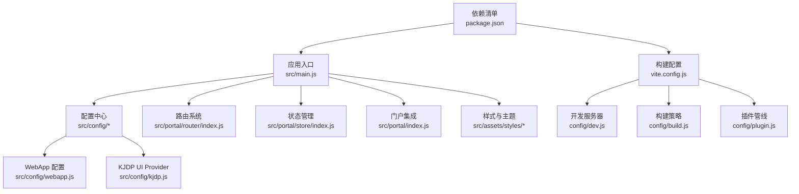
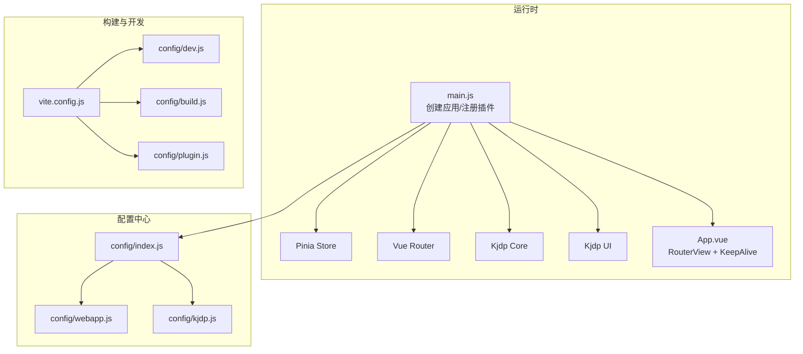
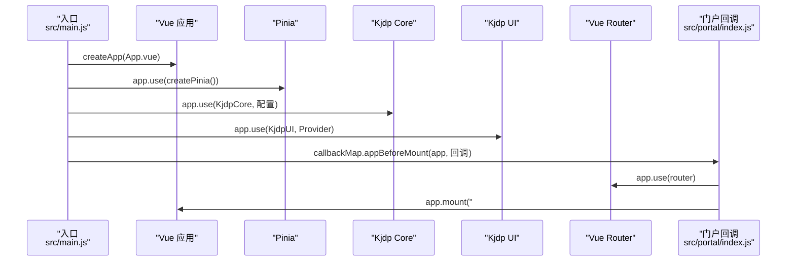
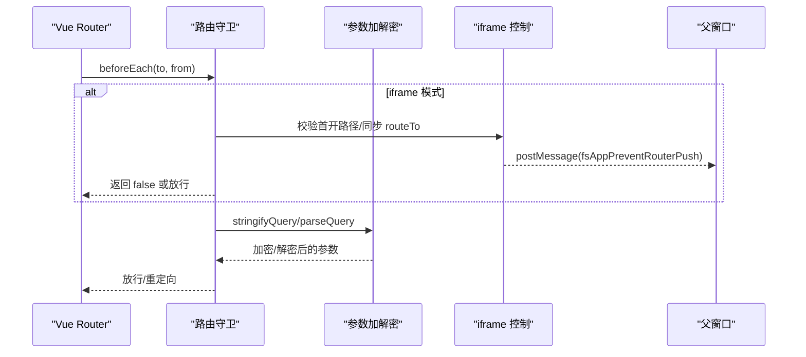
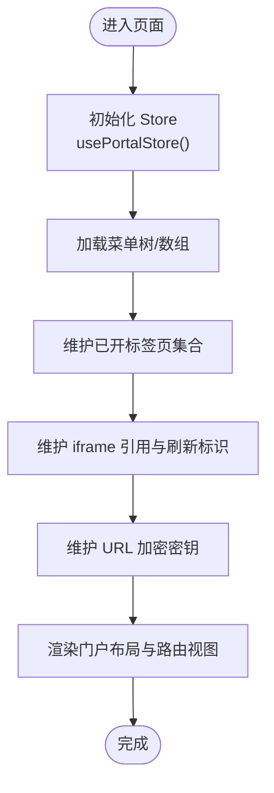
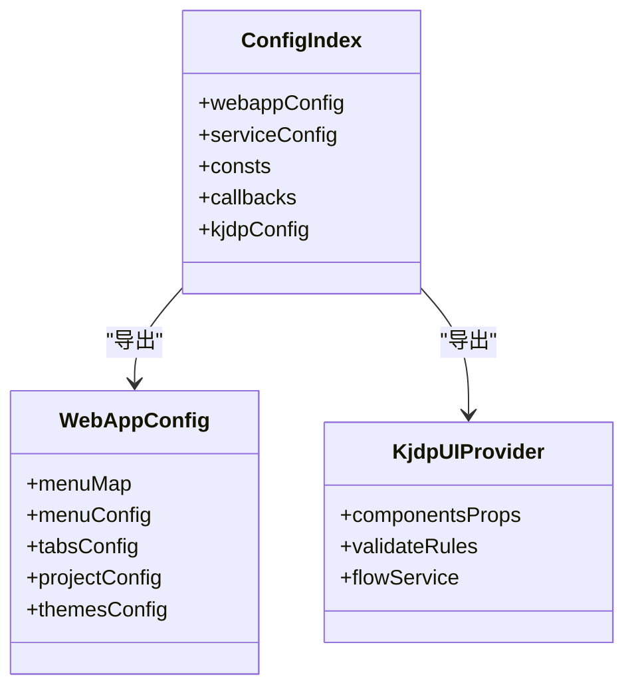
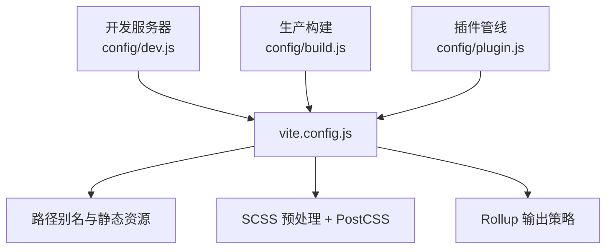
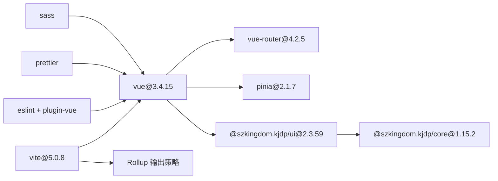

# 技术栈

<cite>
**本文引用的文件**
- [package.json](file://package.json)
- [vite.config.js](file://vite.config.js)
- [src/main.js](file://src/main.js)
- [src/App.vue](file://src/App.vue)
- [src/config/index.js](file://src/config/index.js)
- [src/config/webapp.js](file://src/config/webapp.js)
- [src/config/kjdp.js](file://src/config/kjdp.js)
- [src/portal/index.js](file://src/portal/index.js)
- [src/portal/router/index.js](file://src/portal/router/index.js)
- [src/portal/store/index.js](file://src/portal/store/index.js)
- [config/build.js](file://config/build.js)
- [config/dev.js](file://config/dev.js)
- [config/plugin.js](file://config/plugin.js)
- [.eslintrc.js](file://.eslintrc.js)
- [.prettierrc](file://.prettierrc)
</cite>

## 目录
1. [简介](#简介)
2. [项目结构](#项目结构)
3. [核心组件](#核心组件)
4. [架构总览](#架构总览)
5. [详细组件分析](#详细组件分析)
6. [依赖关系分析](#依赖关系分析)
7. [性能考量](#性能考量)
8. [故障排查指南](#故障排查指南)
9. [结论](#结论)
10. [附录](#附录)

## 简介
本技术栈文档面向 FS-AOI-WEB 项目，系统梳理并解释项目所采用的核心技术与框架，包括 Vue 3.4.15、KJDP UI 2.3.59、Pinia 2.1.7、Vue Router 4.2.5、Vite 5.0.8 等主要依赖；同时覆盖开发工具链、构建工具、样式处理器、代码质量工具等辅助技术。文档从“为什么选择该技术”“版本兼容性考虑”“在项目中的职责与集成方式”三个维度展开，并提供学习路径与资源建议，帮助开发者快速理解并高效参与项目。

## 项目结构
FS-AOI-WEB 采用以功能域分层的组织方式：
- 应用入口与运行时：src/main.js 创建应用实例，注册 Pinia、KJDP 核心与 UI、路由挂载等。
- 配置中心：src/config 下集中管理 HTTP、WebApp、KJDP UI Provider、常量与回调等。
- 门户框架：src/portal 提供路由、状态、消息通信、主题与图标等能力。
- 页面与模块：src/pages 下按业务域划分视图与模块，如 AOI、Cop、UAS、IDM 等。
- 构建与开发：根目录与 config 目录下的配置文件分别定义开发服务器、构建策略与插件。

图表来源
- [src/main.js](file://src/main.js#L1-L40)
- [src/config/index.js](file://src/config/index.js#L1-L8)
- [src/config/webapp.js](file://src/config/webapp.js#L1-L254)
- [src/config/kjdp.js](file://src/config/kjdp.js#L1-L59)
- [src/portal/index.js](file://src/portal/index.js#L1-L153)
- [src/portal/router/index.js](file://src/portal/router/index.js#L1-L141)
- [src/portal/store/index.js](file://src/portal/store/index.js#L1-L226)
- [vite.config.js](file://vite.config.js#L1-L80)
- [config/dev.js](file://config/dev.js#L1-L39)
- [config/build.js](file://config/build.js#L1-L104)
- [config/plugin.js](file://config/plugin.js#L1-L17)
- [package.json](file://package.json#L1-L61)

章节来源
- [src/main.js](file://src/main.js#L1-L40)
- [vite.config.js](file://vite.config.js#L1-L80)
- [package.json](file://package.json#L1-L61)

## 核心组件
本节聚焦项目的关键技术选型与在工程中的角色定位：

- Vue 3.4.15
  - 角色：应用框架，提供响应式与组合式 API，支撑页面与组件化开发。
  - 兼容性：与 VueUse、Pinia、Vue Router 等生态保持良好版本契合。
  - 在项目中的体现：应用实例创建、RouterView 包裹 KeepAlive、全局错误处理等。

- KJDP UI 2.3.59 与 KJDP Core 1.15.2
  - 角色：企业级 UI 组件库与核心能力（HTTP、消息、系统信息等）。
  - 在项目中的体现：通过 KjdpCore 注入配置，KjdpUI 注册全局样式与组件 Provider；统一校验规则与组件默认属性。

- Pinia 2.1.7
  - 角色：状态管理库，替代 Vuex，提供更简洁的 API 与 TypeScript 支持。
  - 在项目中的体现：集中管理门户菜单、标签页、操作员信息、加密密钥等状态。

- Vue Router 4.2.5
  - 角色：前端路由，支持哈希模式、参数加解密、跨 iframe 导航控制。
  - 在项目中的体现：路由守卫、参数序列化/反序列化、与门户框架联动。

- Vite 5.0.8
  - 角色：构建工具与开发服务器，提供快速冷启动与热更新。
  - 在项目中的体现：别名解析、SCSS 预处理、PostCSS 插件、生产构建产物命名与分包策略。

- 开发与质量工具
  - ESLint + Prettier：统一代码风格与质量基线。
  - Sass：样式预处理，现代编译 API。
  - PostCSS：charset 移除等后处理。

章节来源
- [package.json](file://package.json#L17-L39)
- [src/main.js](file://src/main.js#L1-L40)
- [src/config/kjdp.js](file://src/config/kjdp.js#L1-L59)
- [src/portal/router/index.js](file://src/portal/router/index.js#L1-L141)
- [src/portal/store/index.js](file://src/portal/store/index.js#L1-L226)
- [vite.config.js](file://vite.config.js#L55-L77)
- [.eslintrc.js](file://.eslintrc.js#L1-L35)
- [.prettierrc](file://.prettierrc#L1-L12)

## 架构总览
FS-AOI-WEB 的运行时由“应用入口 → 配置中心 → 门户框架 → 路由/状态 → UI 组件库”构成，构建期通过 Vite 与 Rollup 实现模块化打包与资源优化。

图表来源
- [src/main.js](file://src/main.js#L1-L40)
- [src/App.vue](file://src/App.vue#L1-L8)
- [src/config/index.js](file://src/config/index.js#L1-L8)
- [src/config/webapp.js](file://src/config/webapp.js#L1-L254)
- [src/config/kjdp.js](file://src/config/kjdp.js#L1-L59)
- [vite.config.js](file://vite.config.js#L1-L80)
- [config/dev.js](file://config/dev.js#L1-L39)
- [config/build.js](file://config/build.js#L1-L104)
- [config/plugin.js](file://config/plugin.js#L1-L17)

## 详细组件分析

### 应用入口与初始化流程
应用入口负责创建 Vue 实例、安装 Pinia、注入 KJDP 核心与 UI、注册路由与全局错误处理，并通过门户回调在挂载前完成加密键、消息监听、子系统模式等初始化。

图表来源
- [src/main.js](file://src/main.js#L1-L40)
- [src/portal/index.js](file://src/portal/index.js#L109-L125)

章节来源
- [src/main.js](file://src/main.js#L1-L40)
- [src/portal/index.js](file://src/portal/index.js#L109-L125)

### 路由与参数加解密
路由系统基于 Vue Router 4.2.5，采用哈希历史模式，并在配置中实现参数的加解密与 iframe 场景下的路由拦截与同步。

图表来源
- [src/portal/router/index.js](file://src/portal/router/index.js#L1-L141)

章节来源
- [src/portal/router/index.js](file://src/portal/router/index.js#L1-L141)

### 状态管理与门户数据流
Pinia Store 负责门户菜单树、标签页、iframe 引用、操作员信息、URL 加密密钥等状态的集中管理，并提供增删改查与联动逻辑。

图表来源
- [src/portal/store/index.js](file://src/portal/store/index.js#L1-L226)

章节来源
- [src/portal/store/index.js](file://src/portal/store/index.js#L1-L226)

### 配置中心与 UI Provider
配置中心将 WebApp 与 KJDP UI Provider 分离，前者定义菜单、头部、标签页、系统参数等，后者定义组件默认属性、校验规则与流程服务编码映射。

图表来源
- [src/config/index.js](file://src/config/index.js#L1-L8)
- [src/config/webapp.js](file://src/config/webapp.js#L1-L254)
- [src/config/kjdp.js](file://src/config/kjdp.js#L1-L59)

章节来源
- [src/config/index.js](file://src/config/index.js#L1-L8)
- [src/config/webapp.js](file://src/config/webapp.js#L1-L254)
- [src/config/kjdp.js](file://src/config/kjdp.js#L1-L59)

### 构建与开发配置
Vite 作为构建与开发核心，配合 Rollup 输出策略、SCSS 预处理与 PostCSS 插件，实现生产环境的资源命名、分包与压缩。

图表来源
- [vite.config.js](file://vite.config.js#L1-L80)
- [config/dev.js](file://config/dev.js#L1-L39)
- [config/build.js](file://config/build.js#L1-L104)
- [config/plugin.js](file://config/plugin.js#L1-L17)

章节来源
- [vite.config.js](file://vite.config.js#L1-L80)
- [config/dev.js](file://config/dev.js#L1-L39)
- [config/build.js](file://config/build.js#L1-L104)
- [config/plugin.js](file://config/plugin.js#L1-L17)

## 依赖关系分析
- 直接依赖
  - Vue 3.4.15 与 Vue Router 4.2.5：提供视图与路由能力。
  - Pinia 2.1.7：提供状态管理。
  - KJDP UI 2.3.59 与 KJDP Core 1.15.2：提供 UI 组件与核心能力。
  - Vite 5.0.8：提供构建与开发体验。
- 开发依赖
  - @vitejs/plugin-vue、sass、eslint、prettier 等：提升开发效率与代码质量。
- 版本兼容性
  - Vue 3.4.x 与 Vue Router 4.x、Pinia 2.x 生态兼容良好。
  - KJDP UI 与 KJDP Core 版本需与 Vue 3 保持一致，确保 Composition API 与组件生命周期兼容。
  - Vite 5.x 与现代浏览器特性匹配，结合 esbuild 去除 console/debugger 提升生产体积与安全性。

图表来源
- [package.json](file://package.json#L17-L39)
- [vite.config.js](file://vite.config.js#L55-L77)

章节来源
- [package.json](file://package.json#L17-L39)
- [vite.config.js](file://vite.config.js#L55-L77)

## 性能考量
- 构建产物命名与分包
  - 生产构建采用可选 hash 模式与手动分包策略，将第三方库与业务代码分离，减少缓存失效影响。
  - 对异步加载的依赖进行独立目录输出，便于 CDN 缓存与懒加载。
- 运行时体积优化
  - 生产环境移除 console 与 debugger，降低包体与运行时开销。
  - 按需加载第三方库（如图表、播放器、文档处理等），减少首屏负担。
- 资源版本化
  - 通过版本化资源加载插件，结合 APP_VERSION 实现强缓存与可控更新。

章节来源
- [config/build.js](file://config/build.js#L1-L104)
- [vite.config.js](file://vite.config.js#L38-L38)
- [config/plugin.js](file://config/plugin.js#L1-L17)

## 故障排查指南
- 开发代理与静态资源
  - 若本地联调静态资源或接口异常，检查开发服务器代理配置与目标地址可达性。
- 路由与 iframe
  - iframe 下路由被拦截或参数丢失，检查路由守卫中的首开路径与 routeTo 同步逻辑。
- 参数加解密
  - 参数加解密开关与加密键获取失败会导致路由参数无法正确解析，需确认项目配置与加密键初始化流程。
- 代码质量
  - ESLint/Prettier 报错可通过脚本自动修复，或在本地 IDE 中启用保存时格式化。

章节来源
- [config/dev.js](file://config/dev.js#L1-L39)
- [src/portal/router/index.js](file://src/portal/router/index.js#L46-L90)
- [src/portal/index.js](file://src/portal/index.js#L103-L107)
- [.eslintrc.js](file://.eslintrc.js#L1-L35)
- [.prettierrc](file://.prettierrc#L1-L12)

## 结论
FS-AOI-WEB 以 Vue 3 为核心，结合 KJDP 生态、Pinia、Vue Router 与 Vite，构建出高内聚、低耦合的前端架构。通过集中配置中心与门户框架，实现菜单、路由、状态与 UI 的统一治理；借助完善的构建与质量工具链，保障开发效率与运行性能。建议团队在后续迭代中持续关注生态版本演进，完善自动化测试与可观测性建设。

## 附录
- 学习路径与资源
  - Vue 3 官方文档与 Composition API 指南
  - Vue Router 4.x 进阶用法与路由守卫实践
  - Pinia 官方最佳实践与状态设计原则
  - Vite 官方插件生态与构建优化策略
  - KJDP UI 组件库与 Provider 配置说明
  - ESLint 与 Prettier 团队规范落地
  - SCSS 与 PostCSS 在企业级项目中的应用