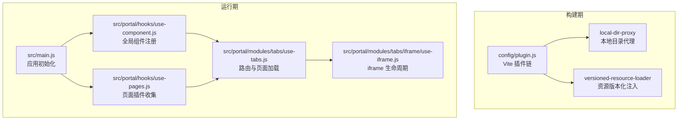
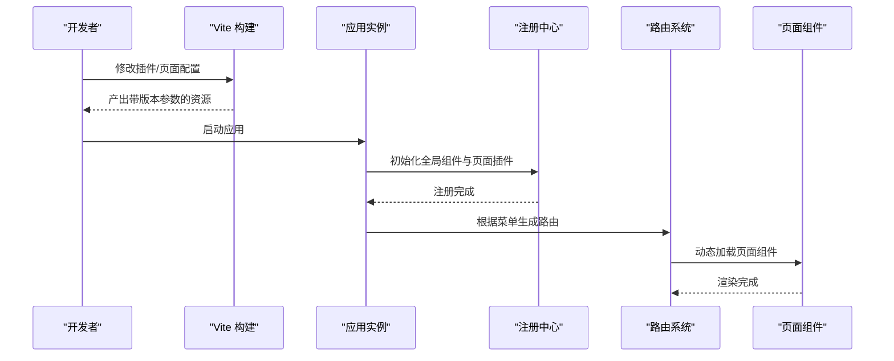
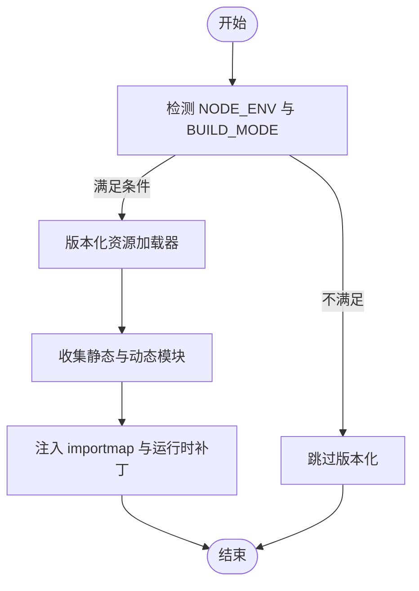
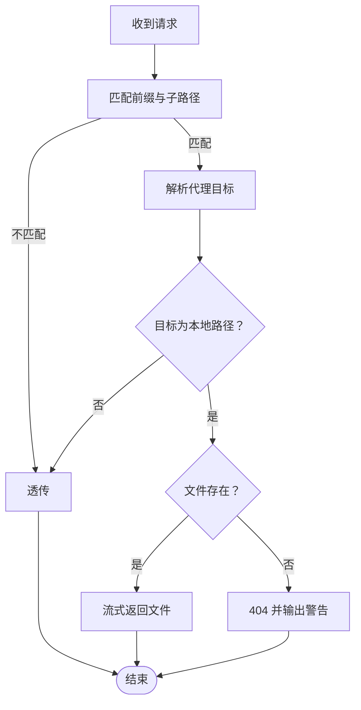
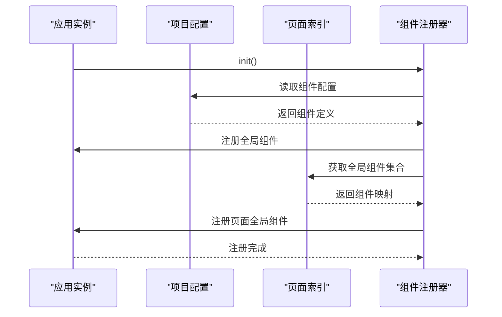
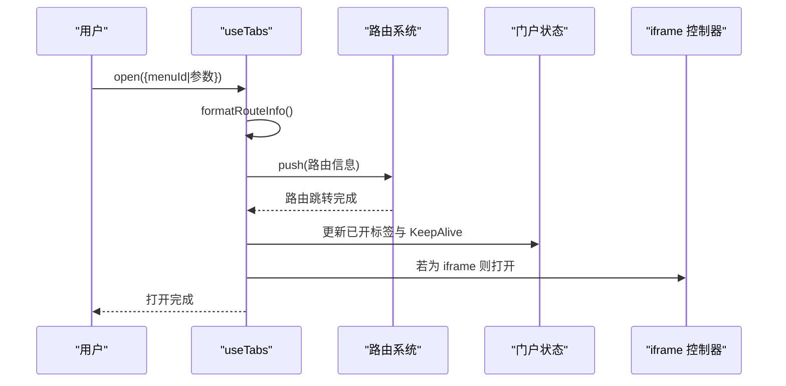
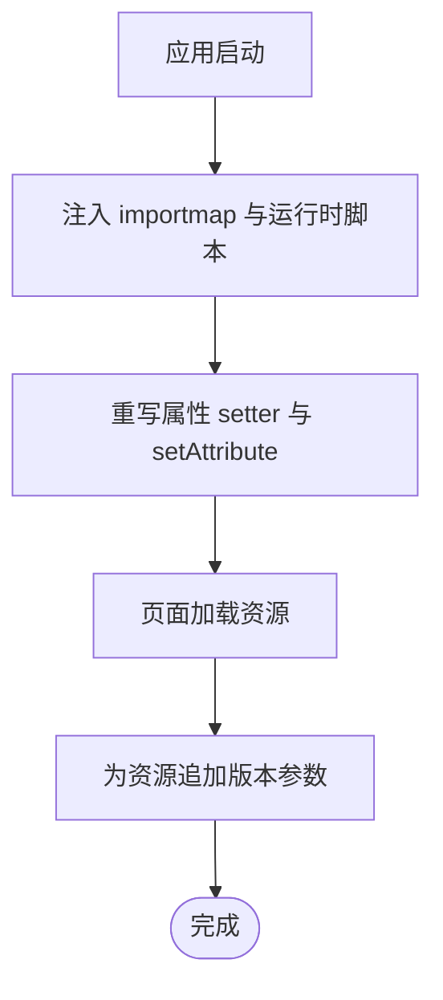
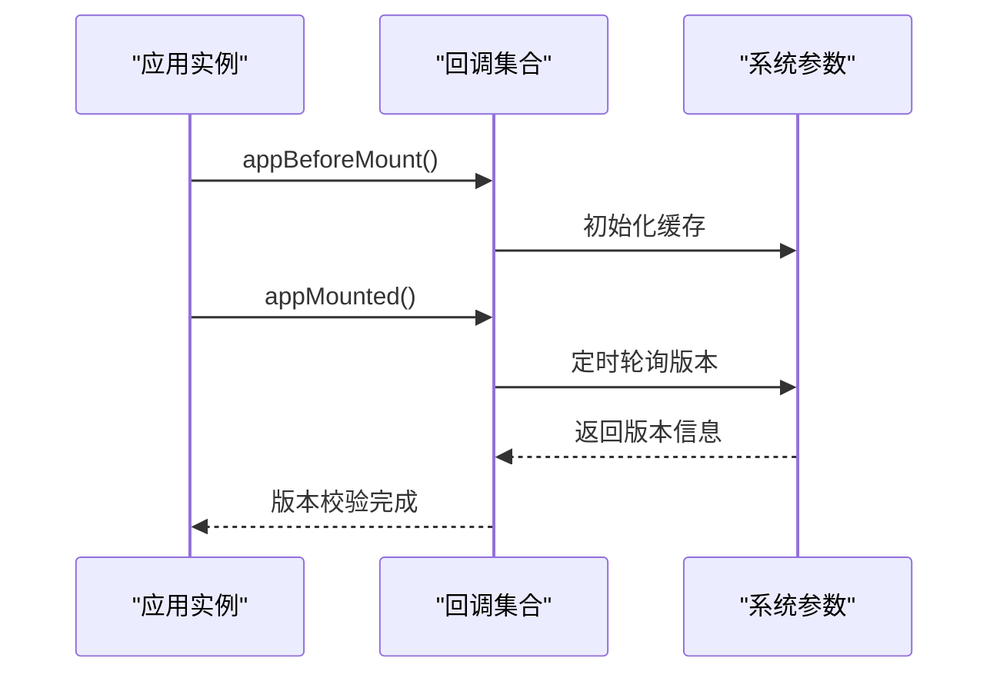
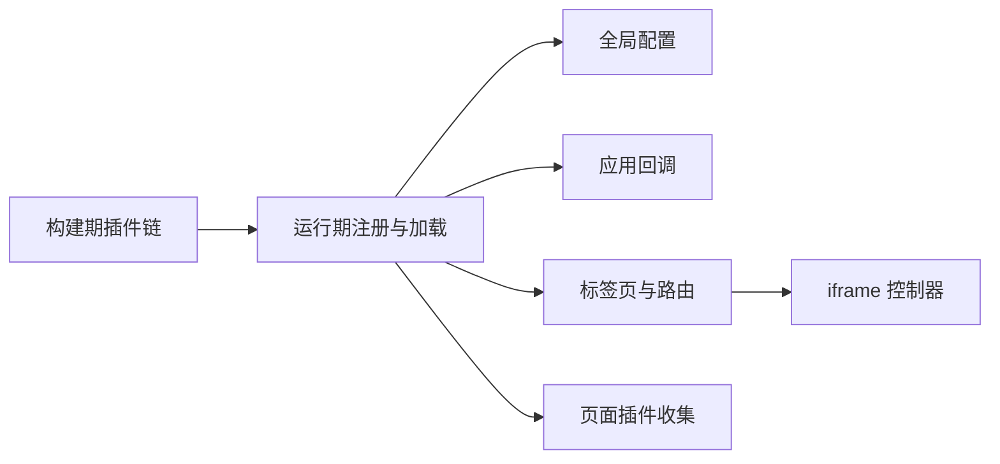

# 插件开发指南

<cite>
**本文引用的文件**
- [config/plugin.js](file://config/plugin.js)
- [config/plugins/local-dir--proxy/local-dir-proxy.js](file://config/plugins/local-dir--proxy/local-dir-proxy.js)
- [config/plugins/versioned-resource-loader/versioned-resource-loader.js](file://config/plugins/versioned-resource-loader/versioned-resource-loader.js)
- [src/portal/hooks/use-component.js](file://src/portal/hooks/use-component.js)
- [src/portal/hooks/use-pages.js](file://src/portal/hooks/use-pages.js)
- [src/portal/modules/tabs/use-tabs.js](file://src/portal/modules/tabs/use-tabs.js)
- [src/portal/modules/tabs/iframe/use-iframe.js](file://src/portal/modules/tabs/iframe/use-iframe.js)
- [src/config/webapp.js](file://src/config/webapp.js)
- [src/config/callbacks.js](file://src/config/callbacks.js)
- [src/main.js](file://src/main.js)
- [config/build.js](file://config/build.js)
- [public/static/flow/editor/editor-app/plugins.xml](file://public/static/flow/editor/editor-app/plugins.xml)
</cite>

## 目录
1. [简介](#简介)
2. [项目结构](#项目结构)
3. [核心组件](#核心组件)
4. [架构总览](#架构总览)
5. [详细组件分析](#详细组件分析)
6. [依赖关系分析](#依赖关系分析)
7. [性能考量](#性能考量)
8. [故障排查指南](#故障排查指南)
9. [结论](#结论)
10. [附录](#附录)

## 简介
本指南面向 FS-AOI-WEB 插件系统的开发者，系统性阐述插件体系的架构设计、开发规范与 API 接口，覆盖插件生命周期、注册机制、配置方式、自定义插件开发步骤、调试方法、最佳实践、性能优化与常见问题解决方案。目标是帮助开发者快速掌握插件开发技能并高效扩展系统功能。

## 项目结构
FS-AOI-WEB 的插件体系由“构建期插件”“运行期插件注册与加载”“页面与路由动态加载”三部分组成：
- 构建期插件：Vite 插件链，负责本地目录代理与资源版本化注入。
- 运行期插件注册：全局组件与页面级插件的动态注册。
- 页面与路由动态加载：基于 import.meta.glob 的异步组件加载与路由注册。

图表来源
- [config/plugin.js](file://config/plugin.js#L1-L17)
- [config/plugins/local-dir--proxy/local-dir-proxy.js](file://config/plugins/local-dir--proxy/local-dir-proxy.js#L1-L39)
- [config/plugins/versioned-resource-loader/versioned-resource-loader.js](file://config/plugins/versioned-resource-loader/versioned-resource-loader.js#L1-L193)
- [src/main.js](file://src/main.js#L1-L40)
- [src/portal/hooks/use-component.js](file://src/portal/hooks/use-component.js#L1-L37)
- [src/portal/hooks/use-pages.js](file://src/portal/hooks/use-pages.js#L1-L21)
- [src/portal/modules/tabs/use-tabs.js](file://src/portal/modules/tabs/use-tabs.js#L1-L597)
- [src/portal/modules/tabs/iframe/use-iframe.js](file://src/portal/modules/tabs/iframe/use-iframe.js#L1-L16)

章节来源
- [config/plugin.js](file://config/plugin.js#L1-L17)
- [src/main.js](file://src/main.js#L1-L40)

## 核心组件
- Vite 插件链：统一管理 Vue SFC 编译、本地目录代理与生产环境资源版本化。
- 版本化资源加载器：在 HTML 注入 importmap 与运行时补丁，为 JS/CSS/图片等资源追加版本参数，实现强缓存下的可控刷新。
- 本地目录代理：将特定前缀请求转发至本地文件系统，便于开发期联调外部静态资源。
- 全局组件注册：从项目配置与页面 index.js 中收集组件，按需异步注册。
- 页面插件收集：扫描 pages 子目录的 index.js，聚合页面级插件导出。
- 标签页与路由：根据菜单配置动态生成路由与页面组件，支持 iframe 与 SPA 两种模式。
- iframe 生命周期：封装 iframe 打开、刷新、关闭操作。

章节来源
- [config/plugins/versioned-resource-loader/versioned-resource-loader.js](file://config/plugins/versioned-resource-loader/versioned-resource-loader.js#L1-L193)
- [config/plugins/local-dir--proxy/local-dir-proxy.js](file://config/plugins/local-dir--proxy/local-dir-proxy.js#L1-L39)
- [src/portal/hooks/use-component.js](file://src/portal/hooks/use-component.js#L1-L37)
- [src/portal/hooks/use-pages.js](file://src/portal/hooks/use-pages.js#L1-L21)
- [src/portal/modules/tabs/use-tabs.js](file://src/portal/modules/tabs/use-tabs.js#L1-L597)
- [src/portal/modules/tabs/iframe/use-iframe.js](file://src/portal/modules/tabs/iframe/use-iframe.js#L1-L16)

## 架构总览
FS-AOI-WEB 插件系统采用“构建期增强 + 运行期动态注册”的双层架构：
- 构建期：通过 Vite 插件链对 HTML、JS、CSS、图片等资源进行版本化处理，并在开发期提供本地目录代理能力。
- 运行期：应用启动时注册全局组件与页面插件；根据菜单配置动态生成路由并加载对应页面；支持 SPA 与 iframe 两种页面承载方式。

图表来源
- [config/plugin.js](file://config/plugin.js#L1-L17)
- [src/main.js](file://src/main.js#L1-L40)
- [src/portal/hooks/use-component.js](file://src/portal/hooks/use-component.js#L1-L37)
- [src/portal/hooks/use-pages.js](file://src/portal/hooks/use-pages.js#L1-L21)
- [src/portal/modules/tabs/use-tabs.js](file://src/portal/modules/tabs/use-tabs.js#L1-L597)

## 详细组件分析

### 构建期插件链（Vite）
- 插件清单：Vue SFC 编译、本地目录代理、生产环境资源版本化。
- 应用条件：仅在生产且非哈希构建模式下启用版本化资源加载器。
- 版本化策略：对 HTML 中的 script/link/modulepreload 与 importmap 条目追加版本参数；对 JS/CSS/图片等资源进行协议与跨域跳过策略控制。

图表来源
- [config/plugin.js](file://config/plugin.js#L1-L17)
- [config/plugins/versioned-resource-loader/versioned-resource-loader.js](file://config/plugins/versioned-resource-loader/versioned-resource-loader.js#L1-L193)

章节来源
- [config/plugin.js](file://config/plugin.js#L1-L17)
- [config/plugins/versioned-resource-loader/versioned-resource-loader.js](file://config/plugins/versioned-resource-loader/versioned-resource-loader.js#L1-L193)

### 本地目录代理（开发期）
- 功能：拦截以特定前缀开头的请求，若代理目标为本地路径，则直接读取文件系统并返回；否则透传。
- 场景：开发期联调外部静态资源，无需额外服务。

图表来源
- [config/plugins/local-dir--proxy/local-dir-proxy.js](file://config/plugins/local-dir--proxy/local-dir-proxy.js#L1-L39)

章节来源
- [config/plugins/local-dir--proxy/local-dir-proxy.js](file://config/plugins/local-dir--proxy/local-dir-proxy.js#L1-L39)

### 全局组件注册
- 数据来源：项目配置中的组件定义与页面 index.js 导出的全局组件集合。
- 注册方式：使用 defineAsyncComponent 对组件进行异步注册，避免首屏阻塞。
- 错误处理：捕获注册异常，保证应用稳定启动。

图表来源
- [src/portal/hooks/use-component.js](file://src/portal/hooks/use-component.js#L1-L37)
- [src/portal/hooks/use-pages.js](file://src/portal/hooks/use-pages.js#L1-L21)

章节来源
- [src/portal/hooks/use-component.js](file://src/portal/hooks/use-component.js#L1-L37)
- [src/portal/hooks/use-pages.js](file://src/portal/hooks/use-pages.js#L1-L21)

### 页面与路由动态加载
- 页面扫描：通过 import.meta.glob 扫描 pages 目录下的 .vue 文件，形成页面映射。
- 路由生成：根据菜单配置判断页面类型（SPA/iframe），动态注册路由并加载对应组件。
- 参数拼装：合并菜单链接参数、扩展参数与传入参数，形成最终路由查询对象。
- 生命周期：提供打开、刷新、关闭等操作，并维护标签栈与 KeepAlive 状态。

图表来源
- [src/portal/modules/tabs/use-tabs.js](file://src/portal/modules/tabs/use-tabs.js#L1-L597)
- [src/portal/modules/tabs/iframe/use-iframe.js](file://src/portal/modules/tabs/iframe/use-iframe.js#L1-L16)

章节来源
- [src/portal/modules/tabs/use-tabs.js](file://src/portal/modules/tabs/use-tabs.js#L1-L597)
- [src/portal/modules/tabs/iframe/use-iframe.js](file://src/portal/modules/tabs/iframe/use-iframe.js#L1-L16)

### 版本化资源加载器（运行时补丁）
- HTML 注入：在 head 中注入 importmap 与运行时脚本，为 JS/CSS/图片等资源追加版本参数。
- 协议与跨域跳过：对 data:、blob:、javascript:、about: 等协议以及跨域资源进行跳过处理。
- 补丁机制：通过重写元素属性 setter 与 setAttribute，确保动态注入的资源也带上版本参数。

图表来源
- [config/plugins/versioned-resource-loader/versioned-resource-loader.js](file://config/plugins/versioned-resource-loader/versioned-resource-loader.js#L1-L193)

章节来源
- [config/plugins/versioned-resource-loader/versioned-resource-loader.js](file://config/plugins/versioned-resource-loader/versioned-resource-loader.js#L1-L193)

### 回调与应用生命周期
- 应用启动回调：在 appBeforeMount 与 appMounted 阶段分别执行初始化与版本校验。
- 版本校验：对比前端版本与后端版本，必要时弹窗提示用户清理缓存或重新登录。
- 缓存初始化：在启动阶段拉取系统参数缓存，供后续使用。

图表来源
- [src/config/callbacks.js](file://src/config/callbacks.js#L1-L54)
- [src/main.js](file://src/main.js#L1-L40)

章节来源
- [src/config/callbacks.js](file://src/config/callbacks.js#L1-L54)
- [src/main.js](file://src/main.js#L1-L40)

## 依赖关系分析
- 构建期依赖：Vite 插件链依赖 fast-glob 进行文件扫描，版本化加载器依赖 import.meta.glob 产物与 HTML 注入。
- 运行期依赖：应用初始化依赖全局配置与回调；标签页模块依赖路由系统与门户状态；iframe 控制器依赖门户状态存储。
- 页面与路由：use-tabs 依赖 import.meta.glob 生成的页面映射与菜单配置；use-pages 依赖 pages 目录结构。

图表来源
- [config/plugin.js](file://config/plugin.js#L1-L17)
- [src/portal/hooks/use-component.js](file://src/portal/hooks/use-component.js#L1-L37)
- [src/portal/hooks/use-pages.js](file://src/portal/hooks/use-pages.js#L1-L21)
- [src/portal/modules/tabs/use-tabs.js](file://src/portal/modules/tabs/use-tabs.js#L1-L597)
- [src/portal/modules/tabs/iframe/use-iframe.js](file://src/portal/modules/tabs/iframe/use-iframe.js#L1-L16)
- [src/config/webapp.js](file://src/config/webapp.js#L1-L254)
- [src/config/callbacks.js](file://src/config/callbacks.js#L1-L54)

章节来源
- [config/plugin.js](file://config/plugin.js#L1-L17)
- [src/portal/hooks/use-component.js](file://src/portal/hooks/use-component.js#L1-L37)
- [src/portal/hooks/use-pages.js](file://src/portal/hooks/use-pages.js#L1-L21)
- [src/portal/modules/tabs/use-tabs.js](file://src/portal/modules/tabs/use-tabs.js#L1-L597)
- [src/portal/modules/tabs/iframe/use-iframe.js](file://src/portal/modules/tabs/iframe/use-iframe.js#L1-L16)
- [src/config/webapp.js](file://src/config/webapp.js#L1-L254)
- [src/config/callbacks.js](file://src/config/callbacks.js#L1-L54)

## 性能考量
- 异步组件注册：使用 defineAsyncComponent 注册全局组件，避免首屏阻塞。
- 动态路由与页面加载：仅在需要时加载页面组件，减少初始包体。
- 版本化资源：通过版本参数实现强缓存下的可控刷新，降低重复下载成本。
- 构建优化：按目录与第三方库分类输出，减少 vendor 混合带来的缓存失效。
- KeepAlive：在标签页切换时复用组件实例，提升交互性能。

章节来源
- [src/portal/hooks/use-component.js](file://src/portal/hooks/use-component.js#L1-L37)
- [src/portal/modules/tabs/use-tabs.js](file://src/portal/modules/tabs/use-tabs.js#L1-L597)
- [config/plugins/versioned-resource-loader/versioned-resource-loader.js](file://config/plugins/versioned-resource-loader/versioned-resource-loader.js#L1-L193)
- [config/build.js](file://config/build.js#L32-L103)

## 故障排查指南
- 本地静态资源 404：检查本地目录代理的 target 配置与请求路径，确认文件是否存在。
- 资源未带版本参数：确认生产环境构建条件与版本化加载器是否启用，检查 HTML 注入的 importmap 与运行时脚本。
- 页面无法加载：检查菜单配置的链接与页面映射，确认 import.meta.glob 是否能正确识别 .vue 文件。
- iframe 打不开或刷新异常：检查门户配置中的 URL 格式化函数与 iframe 打开流程。
- 版本不一致告警：确认前端版本与后端版本一致，必要时清理缓存或重新登录。

章节来源
- [config/plugins/local-dir--proxy/local-dir-proxy.js](file://config/plugins/local-dir--proxy/local-dir-proxy.js#L1-L39)
- [config/plugins/versioned-resource-loader/versioned-resource-loader.js](file://config/plugins/versioned-resource-loader/versioned-resource-loader.js#L1-L193)
- [src/portal/modules/tabs/use-tabs.js](file://src/portal/modules/tabs/use-tabs.js#L1-L597)
- [src/portal/modules/tabs/iframe/use-iframe.js](file://src/portal/modules/tabs/iframe/use-iframe.js#L1-L16)
- [src/config/callbacks.js](file://src/config/callbacks.js#L1-L54)

## 结论
FS-AOI-WEB 插件系统通过构建期与运行期的协同，实现了灵活的页面与组件扩展能力。开发者可基于全局组件注册、页面插件收集与动态路由加载机制，快速扩展系统功能；同时借助版本化资源与 KeepAlive 等优化手段，保障性能与体验。建议在开发中遵循异步加载、最小依赖与可维护性的原则，结合本指南的最佳实践与故障排查方法，高效完成插件开发。

## 附录

### 开发步骤（自定义插件）
- 全局组件插件
  - 在项目配置中定义组件名称与路径，或在页面 index.js 中导出全局组件集合。
  - 应用启动时自动注册，无需手动调用。
- 页面插件
  - 在 pages 子目录下创建页面模块，并在该模块的 index.js 中导出插件配置。
  - 使用 use-pages.get('...') 收集插件，按需注册。
- 菜单与路由
  - 在菜单配置中设置链接与类型（SPA/iframe），use-tabs 将根据配置动态生成路由并加载页面。
  - 如需 iframe 承载，使用 use-iframe 控制打开、刷新与关闭。
- 构建与版本化
  - 生产环境启用版本化资源加载器，确保资源缓存可控。
  - 开发环境使用本地目录代理，联调外部静态资源。

章节来源
- [src/portal/hooks/use-component.js](file://src/portal/hooks/use-component.js#L1-L37)
- [src/portal/hooks/use-pages.js](file://src/portal/hooks/use-pages.js#L1-L21)
- [src/portal/modules/tabs/use-tabs.js](file://src/portal/modules/tabs/use-tabs.js#L1-L597)
- [src/portal/modules/tabs/iframe/use-iframe.js](file://src/portal/modules/tabs/iframe/use-iframe.js#L1-L16)
- [config/plugins/versioned-resource-loader/versioned-resource-loader.js](file://config/plugins/versioned-resource-loader/versioned-resource-loader.js#L1-L193)

### API 接口概览
- useTabs
  - open(args): 打开标签页，支持 menuId 或路由参数。
  - reload(tab): 刷新指定标签页。
  - close(tab, options): 关闭标签页，支持强制关闭。
  - closeOthers/closeLeft/closeRight/closeAll/clear/clearAll: 批量关闭标签页。
- useIframe
  - open/tab): 打开 iframe。
  - reload(tab): 刷新 iframe。
  - close(tab): 关闭 iframe。
- useComponent
  - init(app): 初始化全局组件与页面全局组件。
- usePages
  - get(key): 获取页面插件集合。
- callbacks
  - appBeforeMount/appMounted: 应用启动回调。
  - checkVersion: 版本校验与提示。

章节来源
- [src/portal/modules/tabs/use-tabs.js](file://src/portal/modules/tabs/use-tabs.js#L292-L597)
- [src/portal/modules/tabs/iframe/use-iframe.js](file://src/portal/modules/tabs/iframe/use-iframe.js#L1-L16)
- [src/portal/hooks/use-component.js](file://src/portal/hooks/use-component.js#L1-L37)
- [src/portal/hooks/use-pages.js](file://src/portal/hooks/use-pages.js#L1-L21)
- [src/config/callbacks.js](file://src/config/callbacks.js#L1-L54)

### 配置参考
- 项目配置（webapp.js）
  - 菜单映射、菜单配置、URL 参数扩展、头部配置、标签页限制、iframe URL 格式化、搜索配置等。
- 构建配置（build.js）
  - 分包策略、输出命名、第三方库分离、页面目录结构保留与哈希处理。

章节来源
- [src/config/webapp.js](file://src/config/webapp.js#L1-L254)
- [config/build.js](file://config/build.js#L32-L103)

### 历史插件参考
- 流程编辑器插件清单（plugins.xml）：展示了传统流程编辑器的插件组织方式，可作为理解插件化架构的参考。

章节来源
- [public/static/flow/editor/editor-app/plugins.xml](file://public/static/flow/editor/editor-app/plugins.xml#L1-L49)