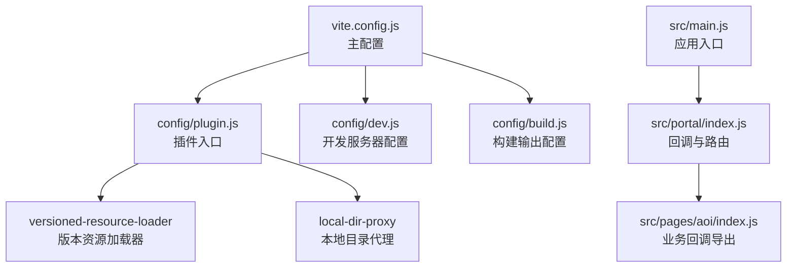
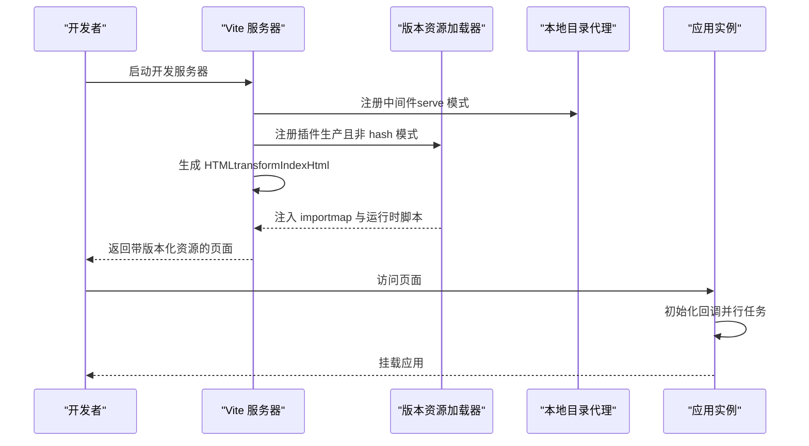
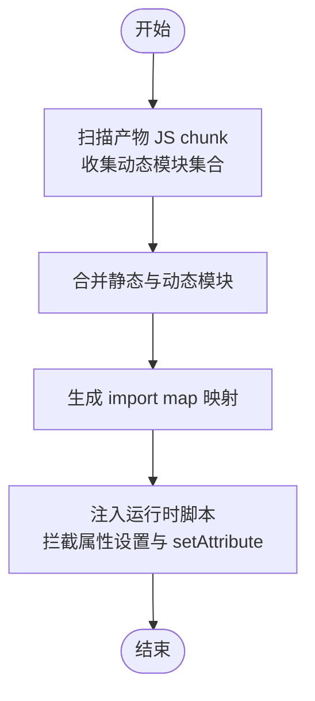
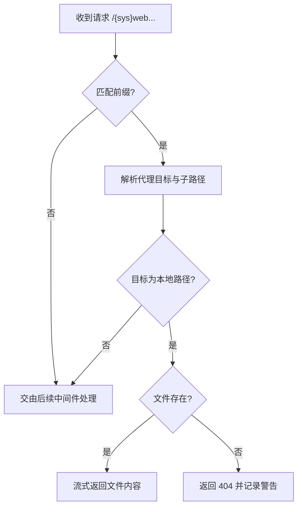
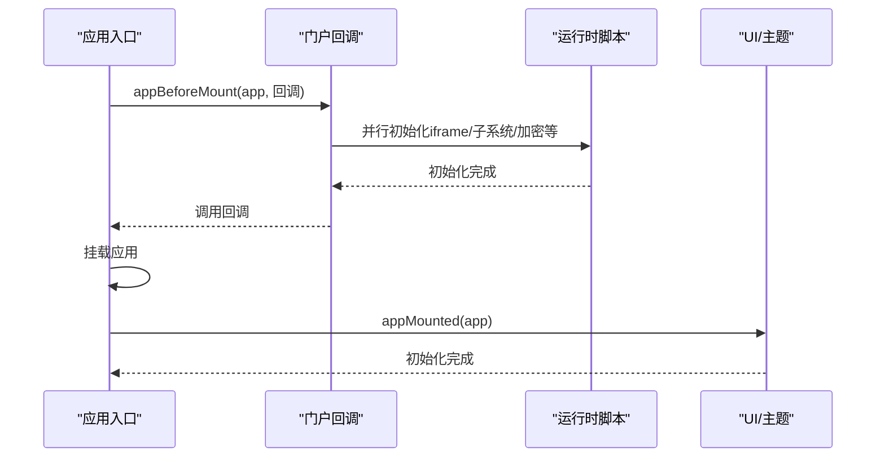
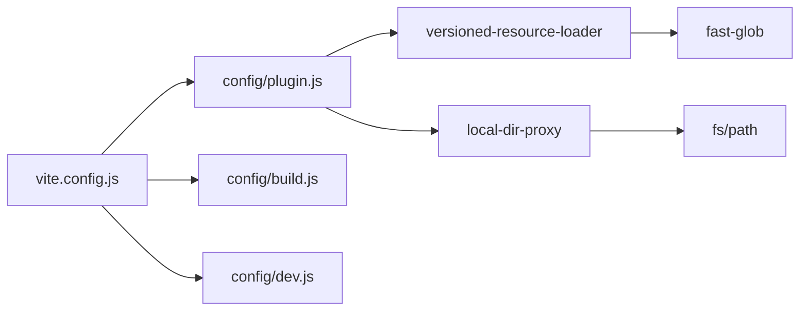

# 插件系统

<cite>
**本文引用的文件**
- [vite.config.js](file://vite.config.js)
- [config/plugin.js](file://config/plugin.js)
- [config/plugins/versioned-resource-loader/versioned-resource-loader.js](file://config/plugins/versioned-resource-loader/versioned-resource-loader.js)
- [config/plugins/local-dir--proxy/local-dir-proxy.js](file://config/plugins/local-dir--proxy/local-dir-proxy.js)
- [config/build.js](file://config/build.js)
- [config/dev.js](file://config/dev.js)
- [package.json](file://package.json)
- [src/main.js](file://src/main.js)
- [src/portal/index.js](file://src/portal/index.js)
- [src/pages/aoi/index.js](file://src/pages/aoi/index.js)
</cite>

## 目录
1. [简介](#简介)
2. [项目结构](#项目结构)
3. [核心组件](#核心组件)
4. [架构总览](#架构总览)
5. [组件详解](#组件详解)
6. [依赖关系分析](#依赖关系分析)
7. [性能考量](#性能考量)
8. [故障排查指南](#故障排查指南)
9. [结论](#结论)
10. [附录](#附录)

## 简介
本文件面向 FS-AOI-WEB 的插件系统，系统性阐述插件架构设计理念、内置插件（版本资源加载器、本地目录代理）的功能与使用方法、插件生命周期与注册机制、配置方式以及自定义插件的开发规范与最佳实践。通过 Vite 插件生态与运行时注入脚本协同工作，实现资源版本化缓存控制与本地静态资源直连代理，提升开发效率与生产环境稳定性。

## 项目结构
FS-AOI-WEB 的插件体系以 Vite 配置为中心，通过统一入口集中注册插件，并在不同构建模式下按需启用特定能力。关键位置如下：
- Vite 主配置：集中定义 base、别名、插件列表、开发服务器与构建选项
- 插件入口：集中导入并导出各内置插件
- 内置插件：版本资源加载器、本地目录代理
- 运行时回调：应用启动前后的钩子，用于初始化与集成

图表来源
- [vite.config.js](file://vite.config.js#L14-L53)
- [config/plugin.js](file://config/plugin.js#L1-L16)
- [config/plugins/versioned-resource-loader/versioned-resource-loader.js](file://config/plugins/versioned-resource-loader/versioned-resource-loader.js#L34-L192)
- [config/plugins/local-dir--proxy/local-dir-proxy.js](file://config/plugins/local-dir--proxy/local-dir-proxy.js#L4-L37)
- [config/dev.js](file://config/dev.js#L4-L36)
- [config/build.js](file://config/build.js#L32-L103)
- [src/main.js](file://src/main.js#L15-L39)
- [src/portal/index.js](file://src/portal/index.js#L109-L152)
- [src/pages/aoi/index.js](file://src/pages/aoi/index.js#L1-L3)

章节来源
- [vite.config.js](file://vite.config.js#L14-L53)
- [config/plugin.js](file://config/plugin.js#L1-L16)
- [config/dev.js](file://config/dev.js#L4-L36)
- [config/build.js](file://config/build.js#L32-L103)

## 核心组件
- 版本资源加载器（Vite 插件）
  - 功能：在构建阶段收集静态与动态模块，向 HTML 中注入运行时脚本与 import map，统一追加版本查询参数，屏蔽外部与特殊协议资源，确保同源资源可被浏览器缓存策略精准控制。
  - 关键点：支持 includeGlobs 手动声明动态模块；仅对 JS 资源生效；生成 import map 与运行时脚本，拦截元素属性设置，自动注入版本参数。
- 本地目录代理（Vite 插件）
  - 功能：在开发模式下，拦截以 /{sys}web 前缀的请求，将非 http 协议目标的静态资源直接从本地文件系统读取返回，避免跨域与代理复杂度。
  - 关键点：仅在 serve 模式生效；匹配 /{sys}web 前缀；校验目标路径存在性；命中即流式返回，否则 404 并记录警告。
- 应用回调与生命周期
  - 功能：在应用启动前后执行一系列异步初始化任务（如主题、图标、iframe 模式数据、子系统登录态），并提供请求拦截器扩展点。
  - 关键点：appBeforeMount 并行等待多个初始化任务完成后再挂载；appMounted 统一初始化 UI 与主题；serviceInterceptors 提供请求拦截扩展。

章节来源
- [config/plugins/versioned-resource-loader/versioned-resource-loader.js](file://config/plugins/versioned-resource-loader/versioned-resource-loader.js#L3-L192)
- [config/plugins/local-dir--proxy/local-dir-proxy.js](file://config/plugins/local-dir--proxy/local-dir-proxy.js#L4-L37)
- [src/portal/index.js](file://src/portal/index.js#L109-L152)

## 架构总览
下图展示从 Vite 启动到应用挂载的关键流程，包括插件注入、资源版本化与本地代理的工作时机。

图表来源
- [vite.config.js](file://vite.config.js#L31-L53)
- [config/plugin.js](file://config/plugin.js#L5-L14)
- [config/plugins/versioned-resource-loader/versioned-resource-loader.js](file://config/plugins/versioned-resource-loader/versioned-resource-loader.js#L71-L192)
- [config/plugins/local-dir--proxy/local-dir-proxy.js](file://config/plugins/local-dir--proxy/local-dir-proxy.js#L8-L36)
- [src/main.js](file://src/main.js#L35-L39)

## 组件详解

### 版本资源加载器（Vite 插件）
- 设计理念
  - 将资源版本化作为缓存控制的核心手段，避免浏览器缓存陈旧代码导致的逻辑错误。
  - 通过运行时脚本与 import map 双通道，确保静态与动态模块均能被统一注入版本参数。
- 生命周期与钩子
  - generateBundle：扫描产物 JS chunk，收集可被版本化的模块集合。
  - transformIndexHtml：改写 HTML 中的 script/link/modulepreload 等标签，注入版本参数；生成 import map 与运行时脚本。
- 数据结构与算法
  - 使用 Set 去重收集模块路径，includeGlobs 通过 fast-glob 支持通配符匹配。
  - 运行时脚本通过属性访问器劫持与 setAttribute 拦截，统一添加版本参数。
- 性能与安全
  - 跳过 data:, blob:, javascript: 等协议与跨域资源，避免无效请求与安全风险。
  - 仅对 JS 资源生效，减少不必要的处理开销。

图表来源
- [config/plugins/versioned-resource-loader/versioned-resource-loader.js](file://config/plugins/versioned-resource-loader/versioned-resource-loader.js#L37-L192)

章节来源
- [config/plugins/versioned-resource-loader/versioned-resource-loader.js](file://config/plugins/versioned-resource-loader/versioned-resource-loader.js#L3-L192)

### 本地目录代理（Vite 插件）
- 设计理念
  - 在开发阶段，将 /{sys}web 前缀请求映射到本地静态资源目录，绕过网络代理，提升本地联调效率。
- 工作流程
  - 识别 /{sys}web 前缀路径，解析子路径与目标代理配置。
  - 若目标为本地路径且文件存在，则直接读取并流式返回；否则返回 404 并记录警告。
- 安全与边界
  - 仅处理本地文件系统存在的资源；跳过 http 协议目标，避免代理链路污染。
  - 对路径进行解码与存在性校验，防止越权访问。

图表来源
- [config/plugins/local-dir--proxy/local-dir-proxy.js](file://config/plugins/local-dir--proxy/local-dir-proxy.js#L8-L36)

章节来源
- [config/plugins/local-dir--proxy/local-dir-proxy.js](file://config/plugins/local-dir--proxy/local-dir-proxy.js#L4-L37)

### 应用回调与生命周期
- 设计理念
  - 将应用启动过程拆分为“启动前”和“启动后”，分别承担初始化与收尾工作，便于扩展与测试。
- 关键回调
  - appBeforeMount：并行执行多类初始化任务（如主题、图标、iframe 模式数据、子系统登录态、加密密钥等），完成后挂载应用。
  - appMounted：统一初始化 UI 与主题。
  - serviceInterceptors：提供请求拦截扩展点，可阻断或放行请求。
- 与插件的关系
  - 回调在应用入口中被调用，与插件注入的运行时脚本共同作用于页面生命周期。

图表来源
- [src/main.js](file://src/main.js#L35-L39)
- [src/portal/index.js](file://src/portal/index.js#L109-L152)

章节来源
- [src/main.js](file://src/main.js#L15-L39)
- [src/portal/index.js](file://src/portal/index.js#L109-L152)

## 依赖关系分析
- 插件依赖
  - 版本资源加载器依赖 fast-glob 进行文件扫描，依赖 Vite 的 generateBundle 与 transformIndexHtml 钩子。
  - 本地目录代理依赖 Node 内置 fs 与 path 模块，依赖 Vite 的 configureServer 钩子。
- 构建与开发配置
  - 构建模式通过 BUILD_MODE 控制是否启用版本资源加载器；版本号通过 APP_VERSION 注入。
  - 开发服务器通过 proxy 配置与本地目录代理协作，实现多系统静态资源直连。

图表来源
- [vite.config.js](file://vite.config.js#L31-L53)
- [config/plugin.js](file://config/plugin.js#L1-L16)
- [config/plugins/versioned-resource-loader/versioned-resource-loader.js](file://config/plugins/versioned-resource-loader/versioned-resource-loader.js#L1-L1)
- [config/plugins/local-dir--proxy/local-dir-proxy.js](file://config/plugins/local-dir--proxy/local-dir-proxy.js#L1-L2)
- [config/build.js](file://config/build.js#L32-L103)
- [config/dev.js](file://config/dev.js#L4-L36)

章节来源
- [vite.config.js](file://vite.config.js#L14-L53)
- [config/plugin.js](file://config/plugin.js#L1-L16)
- [package.json](file://package.json#L53-L54)

## 性能考量
- 版本资源加载器
  - 仅对 JS 资源注入版本参数，减少 CSS 等资源的处理开销；通过 import map 与运行时脚本双通道降低重复处理成本。
  - 跳过跨域与特殊协议资源，避免无效请求与额外网络往返。
- 本地目录代理
  - 仅在开发 serve 模式启用，避免生产环境引入额外中间件开销。
  - 文件存在性检查与流式传输，减少内存占用与延迟。
- 构建优化
  - 通过手动分包与哈希命名策略，结合异步 vendor 目录组织，提升缓存命中率与并行加载效率。

章节来源
- [config/plugins/versioned-resource-loader/versioned-resource-loader.js](file://config/plugins/versioned-resource-loader/versioned-resource-loader.js#L108-L192)
- [config/plugins/local-dir--proxy/local-dir-proxy.js](file://config/plugins/local-dir--proxy/local-dir-proxy.js#L8-L36)
- [config/build.js](file://config/build.js#L19-L103)

## 故障排查指南
- 版本资源加载器未生效
  - 检查是否处于生产模式且 BUILD_MODE 非 hash；确认 APP_VERSION 环境变量已设置。
  - 确认 includeGlobs 是否覆盖到实际动态加载的模块路径。
- 本地目录代理 404
  - 确认 /{sys}web 前缀是否正确；确认代理目标 target 指向本地绝对路径且文件存在。
  - 检查代理配置是否为本地路径而非 http。
- 运行时脚本未注入
  - 确认 transformIndexHtml 是否被调用；检查 HTML 中是否包含 importmap 与注入脚本。
- 子系统登录态异常
  - 检查 iframe 模式消息通道与 token 转换流程；确认回调 appBeforeMount 是否完成。

章节来源
- [vite.config.js](file://vite.config.js#L14-L29)
- [config/plugin.js](file://config/plugin.js#L8-L13)
- [config/plugins/local-dir--proxy/local-dir-proxy.js](file://config/plugins/local-dir--proxy/local-dir-proxy.js#L18-L34)
- [src/portal/index.js](file://src/portal/index.js#L17-L100)

## 结论
FS-AOI-WEB 的插件系统以 Vite 为核心，通过“版本资源加载器”与“本地目录代理”两大内置插件，实现了资源版本化缓存控制与本地静态资源直连代理，显著提升了开发体验与生产稳定性。配合应用回调机制，系统在启动前后提供了清晰的扩展点，便于集成主题、图标、加密与子系统登录态等能力。建议在生产构建中始终启用版本资源加载器，并根据业务场景合理配置 includeGlobs 与代理目标，确保资源加载的准确性与安全性。

## 附录

### 自定义插件开发指南
- 插件注册
  - 在插件入口文件中导入并导出新插件，确保在开发与生产环境下按需启用。
- 生命周期钩子
  - 优先考虑 transformIndexHtml、generateBundle 等与 HTML/资源相关的钩子；若涉及中间件，选择 configureServer 并限定 apply 条件。
- 最佳实践
  - 明确插件适用场景（开发/生产/两者皆可），并通过环境变量或命令行参数控制启用条件。
  - 对外部协议与跨域资源保持谨慎，默认跳过处理，避免安全与性能问题。
  - 与现有回调机制协同，避免重复初始化同一资源。

章节来源
- [config/plugin.js](file://config/plugin.js#L5-L14)
- [vite.config.js](file://vite.config.js#L31-L53)