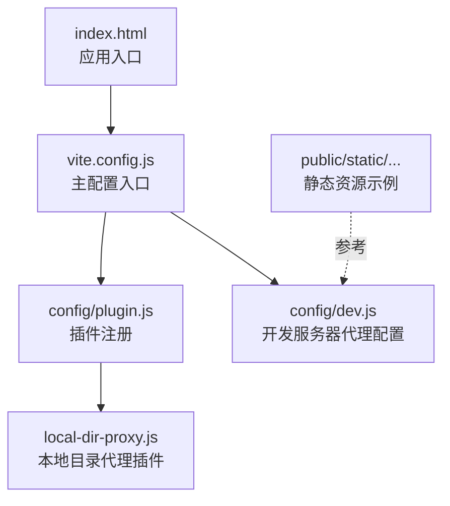
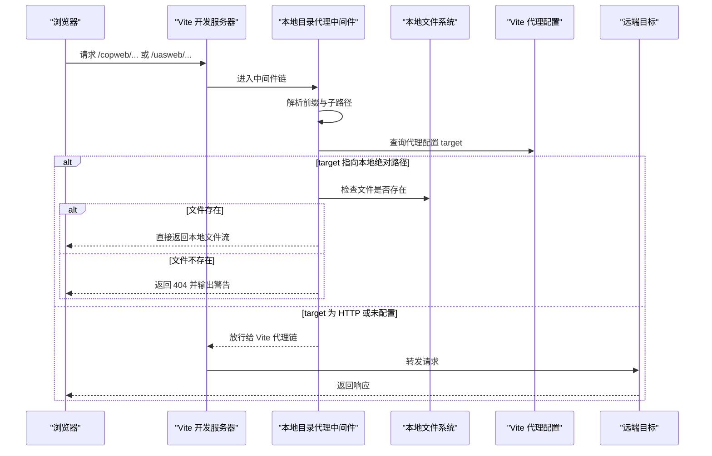
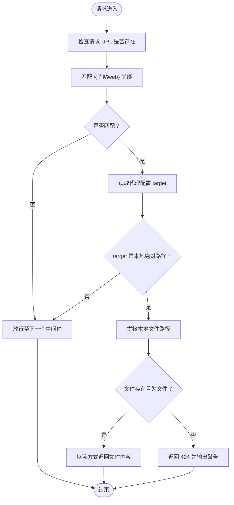
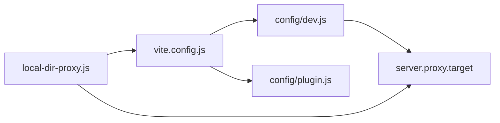

# 本地目录代理

<cite>
**本文引用的文件**
- [local-dir-proxy.js](file://config/plugins/local-dir--proxy/local-dir-proxy.js)
- [dev.js](file://config/dev.js)
- [plugin.js](file://config/plugin.js)
- [vite.config.js](file://vite.config.js)
- [package.json](file://package.json)
- [index.html](file://index.html)
- [plugins.xml](file://public/static/flow/editor/editor-app/plugins.xml)
</cite>

## 目录
1. [简介](#简介)
2. [项目结构](#项目结构)
3. [核心组件](#核心组件)
4. [架构总览](#架构总览)
5. [详细组件分析](#详细组件分析)
6. [依赖关系分析](#依赖关系分析)
7. [性能考量](#性能考量)
8. [故障排查指南](#故障排查指南)
9. [结论](#结论)
10. [附录](#附录)

## 简介
本技术文档面向 FS-AOI-WEB 的“本地目录代理”插件，系统性说明其在开发环境中的职责与能力：资源路径映射、热重载支持的协同机制、开发服务器代理的补充作用，以及如何通过代理规则与配置实现更高效的本地开发体验。文档同时覆盖跨域处理思路、资源访问优化建议与常见问题定位方法，帮助开发者在多子站（如 copweb、uasweb、idmweb）并行开发时，快速定位与解决问题。

## 项目结构
该插件位于独立的配置插件目录中，并由主配置统一注册到 Vite 开发服务器中。关键文件与职责如下：
- 插件实现：config/plugins/local-dir--proxy/local-dir-proxy.js
- 插件注册与条件启用：config/plugin.js
- 开发服务器代理配置：config/dev.js
- Vite 主配置入口：vite.config.js
- 依赖与脚本：package.json
- 入口 HTML（用于理解静态资源根路径）：index.html
- 静态资源示例（流程编辑器）：public/static/flow/editor/editor-app/plugins.xml

图表来源
- [vite.config.js](file://vite.config.js#L1-L80)
- [plugin.js](file://config/plugin.js#L1-L17)
- [local-dir-proxy.js](file://config/plugins/local-dir--proxy/local-dir-proxy.js#L1-L39)
- [dev.js](file://config/dev.js#L1-L39)
- [index.html](file://index.html#L1-L32)

章节来源
- [vite.config.js](file://vite.config.js#L1-L80)
- [plugin.js](file://config/plugin.js#L1-L17)
- [local-dir-proxy.js](file://config/plugins/local-dir--proxy/local-dir-proxy.js#L1-L39)
- [dev.js](file://config/dev.js#L1-L39)
- [index.html](file://index.html#L1-L32)

## 核心组件
- 本地目录代理插件（local-dir-proxy）
  - 作用：拦截以特定前缀开头的请求，将非 HTTP 目标的静态资源请求直接从本地文件系统读取并返回，避免不必要的网络往返。
  - 触发条件：仅在 serve（开发）阶段生效。
  - 匹配规则：以 /{子站web} 前缀开头的路径，例如 /copweb、/uasweb、/idmweb。
  - 代理策略：若代理配置中的 target 指向本地绝对路径，则优先走本地文件系统；若 target 为 HTTP 地址则放行给 Vite 代理链处理。
- 开发服务器代理（dev.js）
  - 提供 /copweb、/uasweb、/idmweb、/api 等前缀的代理规则，支持 changeOrigin、自定义请求头注入等。
  - 本地调试时可将 target 指向本地绝对路径，从而与本地目录代理配合，实现“本地直连 + 代理兜底”的双通道访问。
- 插件注册（plugin.js）
  - 将 local-dir-proxy 注册到 Vite 插件列表，并在生产且非 hash 模式下启用版本化资源加载插件（与本地目录代理无直接冲突）。
- Vite 主配置（vite.config.js）
  - 统一导出 serverOptions、buildOptions，并在开发模式下挂载 server 与 plugins。
  - 别名 @static 指向 static 或 public/static，便于在开发时通过别名访问静态资源。

章节来源
- [local-dir-proxy.js](file://config/plugins/local-dir--proxy/local-dir-proxy.js#L1-L39)
- [dev.js](file://config/dev.js#L1-L39)
- [plugin.js](file://config/plugin.js#L1-L17)
- [vite.config.js](file://vite.config.js#L1-L80)

## 架构总览
本地目录代理插件与 Vite 开发服务器的协作关系如下：

图表来源
- [local-dir-proxy.js](file://config/plugins/local-dir--proxy/local-dir-proxy.js#L8-L36)
- [dev.js](file://config/dev.js#L9-L36)
- [vite.config.js](file://vite.config.js#L34-L36)

## 详细组件分析

### 本地目录代理插件（local-dir-proxy）
- 功能要点
  - 仅在开发 serve 阶段生效，避免影响生产构建。
  - 通过正则匹配 /{子站web} 前缀，提取子路径并拼接到本地 target 目录下进行文件读取。
  - 若目标文件存在则直接以流方式返回，否则返回 404 并在控制台输出提示信息。
- 关键行为
  - 与 Vite 代理配置互不冲突：当 target 为本地绝对路径时走本地直连，HTTP 目标则走代理链。
  - 对查询参数进行解码处理，避免路径解析错误。
- 使用场景
  - 本地调试多个子站前端资源（copweb、uasweb、idmweb），无需启动额外静态服务器。
  - 在代理链不可用或网络不稳定时，作为本地直连的降级方案。

图表来源
- [local-dir-proxy.js](file://config/plugins/local-dir--proxy/local-dir-proxy.js#L9-L35)

章节来源
- [local-dir-proxy.js](file://config/plugins/local-dir--proxy/local-dir-proxy.js#L1-L39)

### 开发服务器代理配置（dev.js）
- 代理规则
  - /copweb、/uasweb、/idmweb：默认指向开发静态服务器地址，支持 changeOrigin。
  - /api：指向开发 API 网关，支持自定义请求头注入（如 X-Real-IP）。
- 本地调试建议
  - 当需要本地直连某子站资源时，可将对应前缀的 target 修改为本地绝对路径（mac/windows 示例已在注释中给出）。
  - 与本地目录代理配合：当 target 指向本地路径时，优先走本地直连；否则走代理链。
- 跨域与 Origin
  - 通过 changeOrigin 控制是否修改请求的 Origin，有助于解决部分后端对 Origin 的校验要求。

章节来源
- [dev.js](file://config/dev.js#L1-L39)

### 插件注册与条件启用（plugin.js）
- 注册逻辑
  - 将 local-dir-proxy 插件加入插件数组，确保在开发阶段生效。
  - 生产环境下，当 BUILD_MODE 不为 hash 时启用版本化资源加载插件（与本地目录代理无直接耦合）。
- 版本化资源加载插件
  - 用于在非 hash 构建模式下，为动态加载的页面资源附加版本号，提升缓存命中与更新可控性。

章节来源
- [plugin.js](file://config/plugin.js#L1-L17)

### Vite 主配置（vite.config.js）
- 别名配置
  - @static 指向 static 或 public/static，便于在开发时通过别名访问静态资源。
- 开发服务器
  - 导入 serverOptions 并挂载到 server 字段，统一管理代理与端口等。
- 构建选项
  - 构建阶段的输出命名与分包策略由 buildOptions 控制，与本地目录代理无直接关联。

章节来源
- [vite.config.js](file://vite.config.js#L1-L80)

### 入口 HTML 与静态资源参考（index.html、plugins.xml）
- 入口 HTML
  - 应用入口文件，用于理解静态资源根路径与模块入口位置。
- 静态资源示例（plugins.xml）
  - 流程编辑器的静态资源示例，可用于验证本地目录代理对静态资源的直连效果。

章节来源
- [index.html](file://index.html#L1-L32)
- [plugins.xml](file://public/static/flow/editor/editor-app/plugins.xml#L1-L73)

## 依赖关系分析
- 插件依赖
  - local-dir-proxy 依赖 Vite 的中间件机制与 server.proxy 配置。
  - 与 dev.js 中的代理配置强关联：target 决定“本地直连”还是“代理转发”。
- 运行时耦合
  - 在开发阶段，local-dir-proxy 与 Vite 代理链并行工作，前者负责本地直连，后者负责远程转发。
- 构建期影响
  - 本地目录代理仅在 serve 阶段生效，不影响 build 输出。

图表来源
- [local-dir-proxy.js](file://config/plugins/local-dir--proxy/local-dir-proxy.js#L18-L23)
- [dev.js](file://config/dev.js#L9-L36)
- [plugin.js](file://config/plugin.js#L5-L14)
- [vite.config.js](file://vite.config.js#L3-L5)

章节来源
- [local-dir-proxy.js](file://config/plugins/local-dir--proxy/local-dir-proxy.js#L1-L39)
- [dev.js](file://config/dev.js#L1-L39)
- [plugin.js](file://config/plugin.js#L1-L17)
- [vite.config.js](file://vite.config.js#L1-L80)

## 性能考量
- 本地直连优势
  - 避免网络往返，提升静态资源加载速度，尤其适用于大型静态资源（如图片、字体、视音频）。
- 缓存与版本
  - 在非 hash 构建模式下，结合版本化资源加载插件，可提升缓存命中率并减少重复下载。
- 资源路径优化
  - 使用 @static 别名访问静态资源，减少相对路径计算开销。
- 注意事项
  - 本地直连仅在 target 为本地绝对路径时生效；HTTP 目标仍需走代理链。

## 故障排查指南
- 症状：访问 /copweb/... 返回 404
  - 排查点：
    - 确认 dev.js 中 /copweb 的 target 是否指向本地绝对路径。
    - 确认本地文件路径是否存在且为文件（插件仅处理文件，不处理目录）。
    - 检查 URL 中的查询参数是否导致路径解析异常（插件会解码查询参数）。
  - 处理建议：
    - 将 target 修改为正确的本地绝对路径（mac/windows 示例见 dev.js 注释）。
    - 在控制台观察是否有“本地静态资源获取失败”的警告信息。
- 症状：代理链无法访问远端资源
  - 排查点：
    - 检查 /api 或其他前缀的 target 是否可达。
    - 确认 changeOrigin 设置是否符合后端要求。
- 症状：热重载失效或卡顿
  - 排查点：
    - dev.js 中的注释提供了禁用热重载的说明，可在必要时临时关闭以排除干扰。
  - 处理建议：
    - 临时将 hmr 设置为 false 并手动刷新页面，确认问题是否与热重载相关。
- 症状：跨域报错
  - 排查点：
    - 确认代理配置中是否启用了 changeOrigin。
    - 如需透传客户端真实 IP，可参考 /api 代理中的请求头注入示例。

章节来源
- [local-dir-proxy.js](file://config/plugins/local-dir--proxy/local-dir-proxy.js#L30-L34)
- [dev.js](file://config/dev.js#L6-L36)

## 结论
本地目录代理插件通过“本地直连 + 代理兜底”的双通道设计，在 FS-AOI-WEB 开发环境中显著提升了静态资源访问效率与稳定性。配合 dev.js 的代理配置与 Vite 的中间件机制，开发者可以灵活地在本地与远程之间切换，满足多子站并行开发的需求。建议在本地调试时优先使用本地直连，远程联调时启用代理链，并根据实际场景调整热重载与跨域策略。

## 附录
- 快速开始
  - 启动开发服务器：执行开发脚本。
  - 访问示例：浏览器访问 /copweb/...、/uasweb/...、/idmweb/...。
  - 本地调试：将对应前缀的 target 指向本地绝对路径。
- 常用配置项
  - serverOptions.port、host、proxy（前缀规则、target、changeOrigin、configure）
  - 插件注册：local-dir-proxy、versioned-resource-loader（按需启用）

章节来源
- [package.json](file://package.json#L6-L12)
- [vite.config.js](file://vite.config.js#L34-L36)
- [plugin.js](file://config/plugin.js#L5-L14)
- [dev.js](file://config/dev.js#L4-L36)