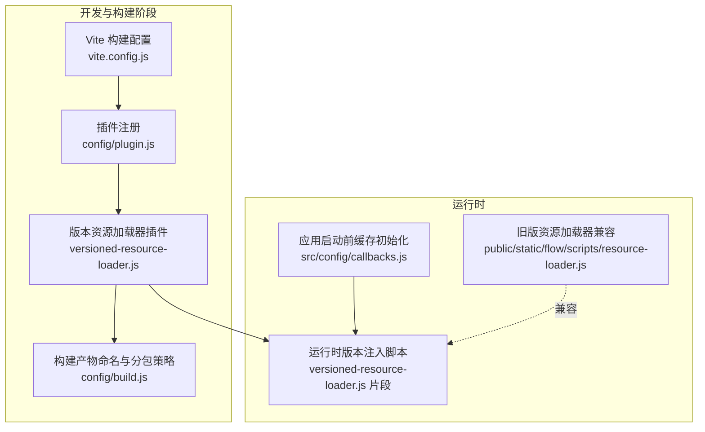
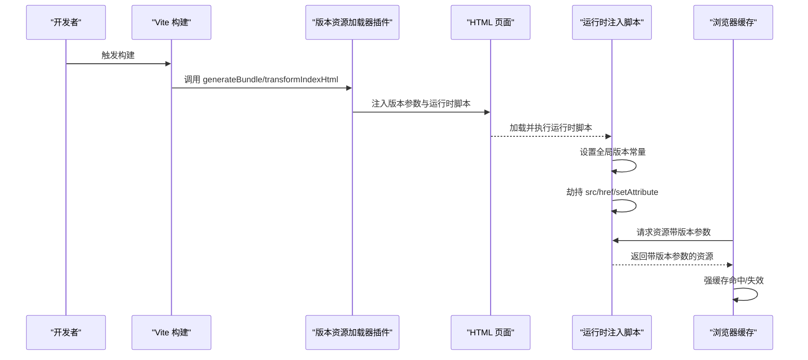
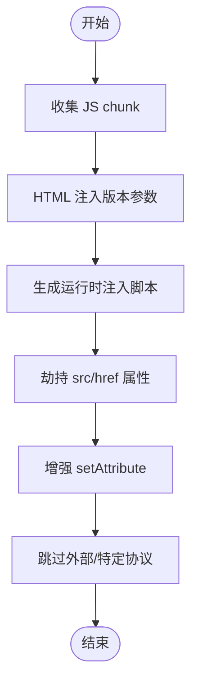
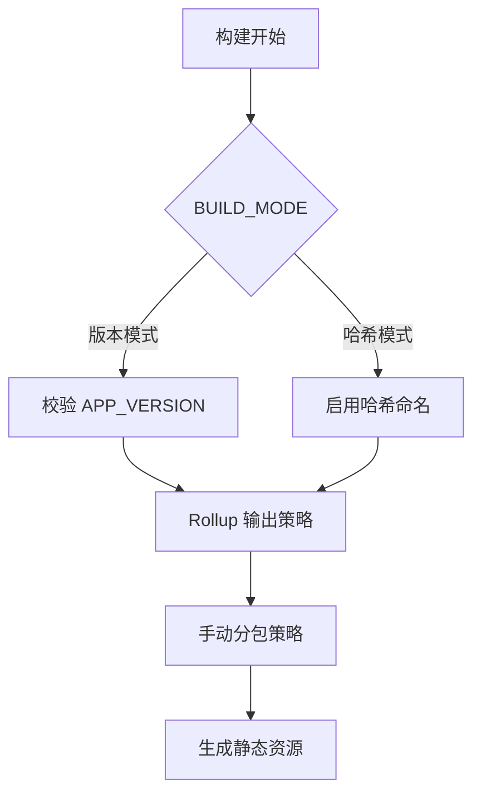
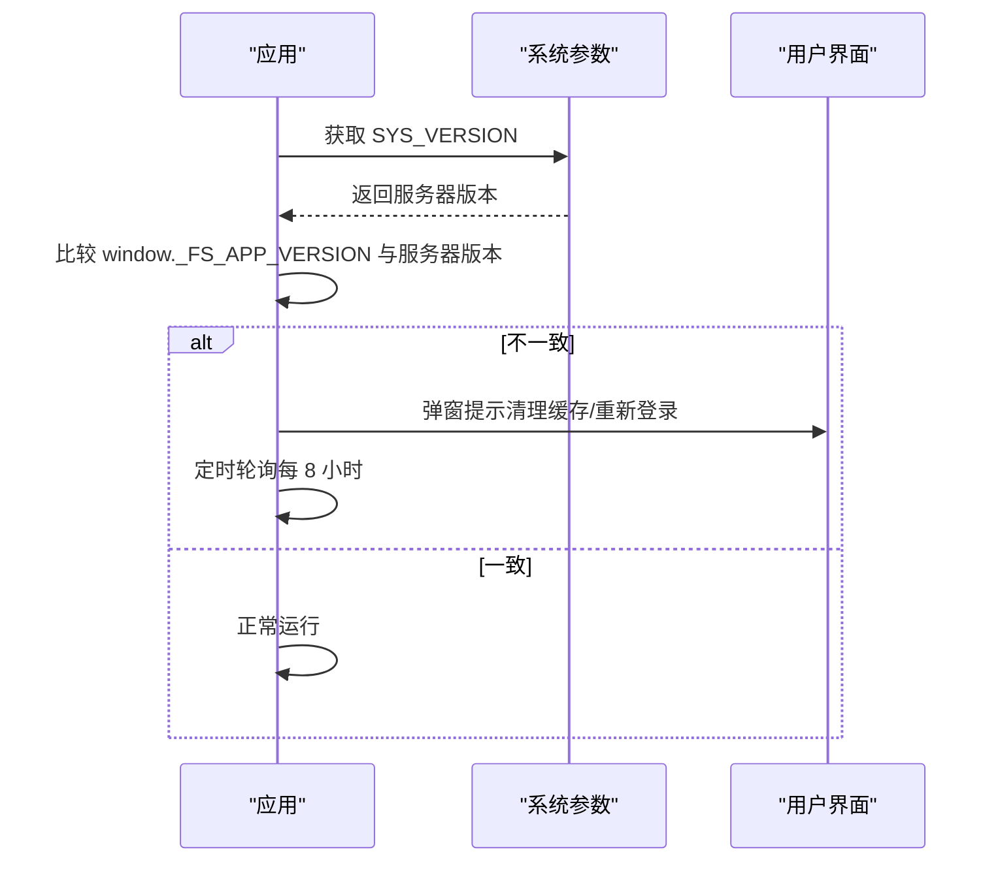
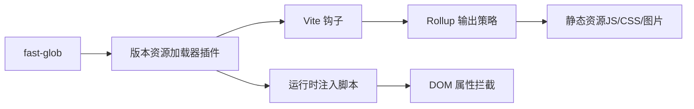

# 版本资源加载器

<cite>
**本文引用的文件列表**
- [versioned-resource-loader.js](file://config/plugins/versioned-resource-loader/versioned-resource-loader.js)
- [plugin.js](file://config/plugin.js)
- [build.js](file://config/build.js)
- [vite.config.js](file://vite.config.js)
- [callbacks.js](file://src/config/callbacks.js)
- [resource-loader.js](file://public/static/flow/scripts/resource-loader.js)
</cite>

## 目录
1. [简介](#简介)
2. [项目结构](#项目结构)
3. [核心组件](#核心组件)
4. [架构总览](#架构总览)
5. [详细组件分析](#详细组件分析)
6. [依赖关系分析](#依赖关系分析)
7. [性能考量](#性能考量)
8. [故障排查指南](#故障排查指南)
9. [结论](#结论)
10. [附录](#附录)

## 简介
本技术文档面向 FS-AOI-WEB 的“版本资源加载器”插件，系统性阐述其在生产构建中的作用：通过在静态资源 URL 上附加版本参数，实现静态资源的强缓存与精准失效；同时在运行时对动态注入的脚本、样式与图片等资源进行版本化处理，确保跨域与本地资源的一致性。文档涵盖工作原理、版本号生成规则、资源路径映射机制、缓存策略、配置项说明、使用方法与最佳实践，并提供可直接参考的配置示例与排障建议。

## 项目结构
版本资源加载器位于 Vite 插件体系中，与构建配置、打包策略及运行时校验共同构成完整的资源版本控制闭环：
- 插件入口：config/plugins/versioned-resource-loader/versioned-resource-loader.js
- 插件注册：config/plugin.js
- 构建配置：config/build.js、vite.config.js
- 运行时校验：src/config/callbacks.js
- 兼容旧版资源加载器：public/static/flow/scripts/resource-loader.js

图表来源
- [vite.config.js](file://vite.config.js#L14-L79)
- [plugin.js](file://config/plugin.js#L1-L17)
- [versioned-resource-loader.js](file://config/plugins/versioned-resource-loader/versioned-resource-loader.js#L3-L192)
- [build.js](file://config/build.js#L32-L103)
- [callbacks.js](file://src/config/callbacks.js#L1-L54)
- [resource-loader.js](file://public/static/flow/scripts/resource-loader.js#L1-L94)

章节来源
- [vite.config.js](file://vite.config.js#L14-L79)
- [plugin.js](file://config/plugin.js#L1-L17)
- [versioned-resource-loader.js](file://config/plugins/versioned-resource-loader/versioned-resource-loader.js#L3-L192)
- [build.js](file://config/build.js#L32-L103)
- [callbacks.js](file://src/config/callbacks.js#L1-L54)
- [resource-loader.js](file://public/static/flow/scripts/resource-loader.js#L1-L94)

## 核心组件
- 版本资源加载器插件：负责在构建期收集 JS chunk 并在 HTML 中注入版本参数；在运行时通过原型链劫持与属性拦截，确保动态注入的资源也带上版本参数。
- 构建配置与分包策略：通过 Rollup 输出策略与哈希命名，配合版本参数实现强缓存与失效控制。
- 运行时版本校验：在应用启动后定期检查运行版本与服务器版本一致性，提示用户清理缓存或重新登录。
- 旧版资源加载器兼容：保留对历史资源加载器的兼容逻辑，保证渐进迁移。

章节来源
- [versioned-resource-loader.js](file://config/plugins/versioned-resource-loader/versioned-resource-loader.js#L3-L192)
- [build.js](file://config/build.js#L32-L103)
- [callbacks.js](file://src/config/callbacks.js#L19-L46)
- [resource-loader.js](file://public/static/flow/scripts/resource-loader.js#L1-L94)

## 架构总览
版本资源加载器贯穿“构建期 + 运行时”的完整生命周期：
- 构建期：插件收集 JS chunk，为 HTML 中的 script/link/modulepreload 等资源追加版本参数；同时生成运行时注入脚本，设置全局版本常量。
- 运行时：注入脚本在 DOMContentLoaded 后执行，对 HTMLScriptElement、HTMLLinkElement、HTMLImageElement 的 src/href 属性进行拦截与改写；同时对 Element.prototype.setAttribute 进行增强，确保动态注入的资源也带版本参数。
- 缓存策略：结合构建输出的稳定命名与版本参数，浏览器可长期缓存静态资源；当版本变更时，URL 改变导致强制拉取新资源。

图表来源
- [versioned-resource-loader.js](file://config/plugins/versioned-resource-loader/versioned-resource-loader.js#L37-L192)
- [vite.config.js](file://vite.config.js#L14-L79)

## 详细组件分析

### 组件一：版本资源加载器插件（核心）
- 功能要点
  - 构建期收集 JS chunk，统一加上版本参数。
  - 在 HTML 中为 script、modulepreload 等资源追加版本参数。
  - 生成运行时注入脚本，设置全局版本常量，并对关键 DOM 属性进行拦截与改写。
  - 支持跳过外部资源与特定协议，避免对非同源资源产生副作用。
- 关键实现
  - 收集 JS chunk：遍历 bundle，将以 .js 结尾的文件加入集合，便于后续生成 importmap 与运行时处理。
  - HTML 注入：替换 script/src、modulepreload/href 等，追加版本参数；保留其他资源不变。
  - 运行时脚本：设置全局版本常量，定义 shouldSkip/addVersion/patch 等函数，对 src/href/setAttribute 进行拦截。
  - 安全过滤：跳过 data:、blob:、about:、javascript: 等协议；可配置是否跳过跨域资源。

图表来源
- [versioned-resource-loader.js](file://config/plugins/versioned-resource-loader/versioned-resource-loader.js#L37-L192)

章节来源
- [versioned-resource-loader.js](file://config/plugins/versioned-resource-loader/versioned-resource-loader.js#L3-L192)

### 组件二：构建配置与分包策略
- 构建模式
  - 支持两种模式：版本模式（默认）与哈希模式（BUILD_MODE=hash）。版本模式下需提供 APP_VERSION 环境变量，否则构建失败。
  - 基础路径 base: './'，适配相对路径与多级部署场景。
- 输出命名与分包
  - 入口、chunk、CSS 文件名采用统一策略，结合哈希或原始名称，确保缓存稳定性。
  - 手动分包：对第三方库按包名归类到固定目录，便于长期缓存。
  - 源码分包：src/pages 下内容保留目录结构并对文件名做哈希处理，保证页面级资源独立缓存。
- Rollup 选项
  - preserveEntrySignatures: 'exports-only'，确保入口导出签名稳定。
  - sourcemap: true，便于调试与回溯。

图表来源
- [vite.config.js](file://vite.config.js#L14-L79)
- [build.js](file://config/build.js#L32-L103)

章节来源
- [vite.config.js](file://vite.config.js#L14-L79)
- [build.js](file://config/build.js#L32-L103)

### 组件三：运行时版本校验
- 启动流程
  - 应用启动前初始化缓存，随后在 mounted 阶段检查运行版本与服务器版本是否一致。
  - 若不一致，弹窗提示用户清理缓存或重新登录。
  - 定时轮询（每 8 小时）再次检查，避免长时间缓存导致的版本不一致。
- 关键点
  - 使用全局窗口变量 window._FS_APP_VERSION 作为运行时版本标识。
  - 仅在非 dev 且存在服务器版本时进行比较。

图表来源
- [callbacks.js](file://src/config/callbacks.js#L19-L46)

章节来源
- [callbacks.js](file://src/config/callbacks.js#L19-L46)

### 组件四：旧版资源加载器兼容
- 旧版资源加载器用于在 Angular 启动前异步加载资源，通过延迟启动等待资源加载完成后再恢复启动。
- 与版本资源加载器的关系
  - 旧版资源加载器与新版运行时注入脚本可并存，但建议逐步迁移至新版以获得更全面的版本控制能力。
  - 新版运行时脚本对动态注入的资源具备更强的版本化能力，减少旧版资源加载器的耦合。

章节来源
- [resource-loader.js](file://public/static/flow/scripts/resource-loader.js#L1-L94)

## 依赖关系分析
- 插件依赖
  - fast-glob：用于扫描 includeGlobs 指定的动态模块路径。
  - Vite 生命周期钩子：generateBundle、transformIndexHtml。
- 构建依赖
  - Rollup 输出策略：entryFileNames、chunkFileNames、assetFileNames。
  - 自定义分包：manualChunks 对 node_modules 与 src 内容进行分类与哈希处理。
- 运行时依赖
  - DOM 原型属性拦截：HTMLScriptElement.prototype、HTMLLinkElement.prototype、HTMLImageElement.prototype。
  - Element.prototype.setAttribute 增强，确保动态注入资源也带版本参数。

图表来源
- [versioned-resource-loader.js](file://config/plugins/versioned-resource-loader/versioned-resource-loader.js#L1-L192)
- [build.js](file://config/build.js#L32-L103)

章节来源
- [versioned-resource-loader.js](file://config/plugins/versioned-resource-loader/versioned-resource-loader.js#L1-L192)
- [build.js](file://config/build.js#L32-L103)

## 性能考量
- 强缓存与失效控制
  - 构建输出采用稳定的命名策略（哈希或原始名），结合版本参数，浏览器可长期缓存静态资源；版本变更时 URL 改变，强制拉取新资源。
- 分包与懒加载
  - 第三方库与业务代码分离，减少首屏体积；页面级资源保留目录结构并做哈希，有利于细粒度缓存。
- 运行时注入开销
  - 运行时脚本仅在 DOMContentLoaded 后执行一次，对性能影响极小；劫持属性的判断逻辑简单高效。
- 资源加载顺序
  - 通过 modulepreload 与 importmap 提升关键资源的预加载优先级，改善首屏渲染。

章节来源
- [build.js](file://config/build.js#L32-L103)
- [versioned-resource-loader.js](file://config/plugins/versioned-resource-loader/versioned-resource-loader.js#L71-L192)

## 故障排查指南
- 构建失败：BUILD_MODE=hash 时未设置 APP_VERSION
  - 现象：构建时报错并终止。
  - 处理：在构建命令中设置 APP_VERSION 或切换 BUILD_MODE。
  - 参考：vite.config.js 中的错误提示与日志输出。
- 版本参数未生效
  - 确认插件在生产环境启用且 includeGlobs 正确匹配动态模块。
  - 检查 HTML 中 script/link/modulepreload 是否被正确注入版本参数。
- 跨域资源异常
  - 默认跳过跨域资源，如需对特定跨域资源加版本参数，可在运行时脚本中调整 shouldSkip 逻辑。
- 运行时版本不一致
  - 检查 window._FS_APP_VERSION 是否正确注入。
  - 确认服务器 SYS_VERSION 返回值与前端版本一致，必要时清理浏览器缓存或重新登录。

章节来源
- [vite.config.js](file://vite.config.js#L20-L28)
- [versioned-resource-loader.js](file://config/plugins/versioned-resource-loader/versioned-resource-loader.js#L71-L192)
- [callbacks.js](file://src/config/callbacks.js#L19-L46)

## 结论
版本资源加载器通过“构建期 + 运行时”的协同机制，实现了静态资源的强缓存与精准失效控制，显著提升了应用的加载性能与用户体验。结合合理的分包策略与版本参数，可有效降低缓存污染风险并简化版本管理。建议在生产环境中启用该插件，并配合运行时版本校验机制，确保版本一致性与稳定性。

## 附录

### 配置选项与使用方法
- 插件配置（config/plugin.js）
  - includeGlobs：动态模块通配符，用于收集可能被动态加载的文件路径。
  - defaultVersion：默认版本号，可通过环境变量覆盖。
  - 生产环境条件：仅在 NODE_ENV=production 且 BUILD_MODE!=hash 时启用。
- 构建配置（vite.config.js）
  - base: './'，适配多级部署。
  - APP_VERSION：版本模式构建必需的环境变量。
- 构建输出策略（config/build.js）
  - 入口、chunk、CSS 文件名命名规则。
  - manualChunks：第三方库与 src 内容的手动分包策略。
- 运行时脚本（versioned-resource-loader.js 片段）
  - 注入全局版本常量，劫持关键 DOM 属性，确保动态资源也带版本参数。
- 运行时版本校验（src/config/callbacks.js）
  - 应用启动后检查运行版本与服务器版本，提示用户清理缓存或重新登录。

章节来源
- [plugin.js](file://config/plugin.js#L8-L13)
- [vite.config.js](file://vite.config.js#L14-L29)
- [build.js](file://config/build.js#L32-L103)
- [versioned-resource-loader.js](file://config/plugins/versioned-resource-loader/versioned-resource-loader.js#L123-L192)
- [callbacks.js](file://src/config/callbacks.js#L19-L46)