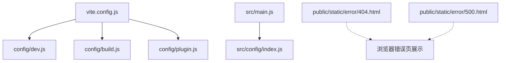
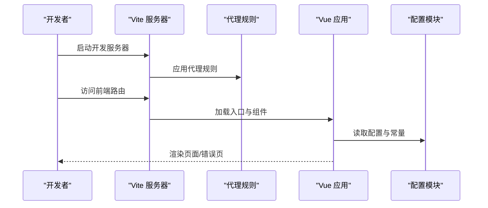
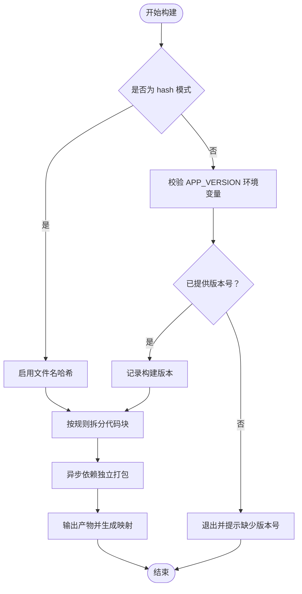
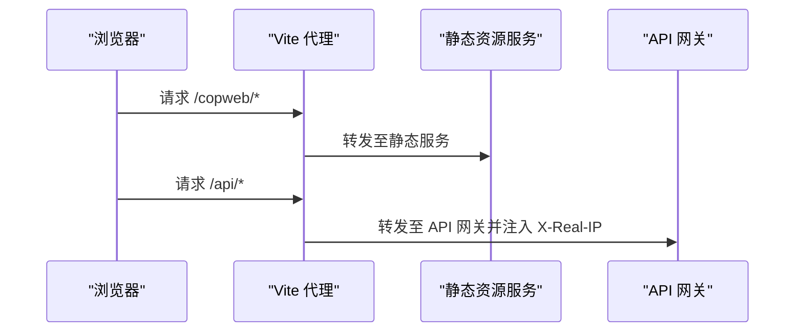
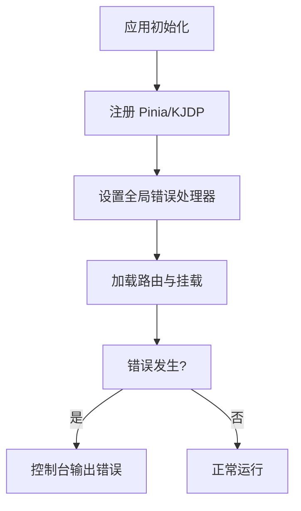
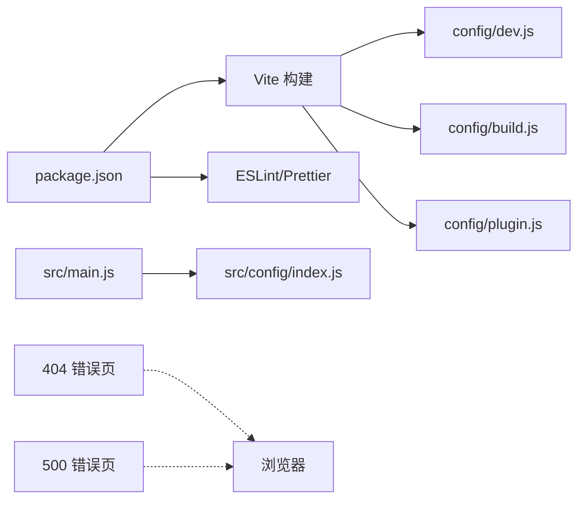

# 故障排除

<cite>
**本文引用的文件**
- [package.json](file://package.json)
- [README.md](file://README.md)
- [vite.config.js](file://vite.config.js)
- [config/dev.js](file://config/dev.js)
- [config/build.js](file://config/build.js)
- [.eslintrc.js](file://.eslintrc.js)
- [.prettierrc](file://.prettierrc)
- [config/plugin.js](file://config/plugin.js)
- [public/static/error/404.html](file://public/static/error/404.html)
- [public/static/error/500.html](file://public/static/error/500.html)
- [src/main.js](file://src/main.js)
- [src/config/index.js](file://src/config/index.js)
</cite>

## 目录
1. [简介](#简介)
2. [项目结构](#项目结构)
3. [核心组件](#核心组件)
4. [架构总览](#架构总览)
5. [详细组件分析](#详细组件分析)
6. [依赖关系分析](#依赖关系分析)
7. [性能考虑](#性能考虑)
8. [故障排除指南](#故障排除指南)
9. [结论](#结论)
10. [附录](#附录)

## 简介
本指南面向 FS-AOI-WEB 的开发者与运维人员，聚焦于开发、构建与运行阶段的常见问题与解决方案。内容覆盖环境配置、依赖安装、构建错误、运行时异常、日志分析、调试工具使用、性能优化与安全防护等，帮助快速定位并解决问题。

## 项目结构
本项目采用 Vite + Vue 3 技术栈，通过配置文件分层管理开发与构建行为；前端静态资源位于 public/static，错误页模板位于 public/static/error；核心入口在 src/main.js，配置聚合在 src/config。

图表来源
- [vite.config.js](file://vite.config.js#L1-L80)
- [config/dev.js](file://config/dev.js#L1-L39)
- [config/build.js](file://config/build.js#L1-L104)
- [config/plugin.js](file://config/plugin.js#L1-L17)
- [src/main.js](file://src/main.js#L1-L40)
- [src/config/index.js](file://src/config/index.js#L1-L8)
- [public/static/error/404.html](file://public/static/error/404.html#L1-L79)
- [public/static/error/500.html](file://public/static/error/500.html#L1-L79)

章节来源
- [vite.config.js](file://vite.config.js#L1-L80)
- [config/dev.js](file://config/dev.js#L1-L39)
- [config/build.js](file://config/build.js#L1-L104)
- [config/plugin.js](file://config/plugin.js#L1-L17)
- [src/main.js](file://src/main.js#L1-L40)
- [src/config/index.js](file://src/config/index.js#L1-L8)
- [public/static/error/404.html](file://public/static/error/404.html#L1-L79)
- [public/static/error/500.html](file://public/static/error/500.html#L1-L79)

## 核心组件
- 构建与开发配置
  - Vite 配置集中于 vite.config.js，按命令区分开发与构建参数，设置别名、插件、CSS 预处理与后处理等。
  - 开发配置 dev.js 提供端口、主机与代理规则，便于联调后端网关与静态资源。
  - 构建配置 build.js 控制产物命名、分包策略与异步依赖拆分。
  - 插件配置 plugin.js 注入 Vue、本地目录代理与版本化资源加载器（生产且非 hash 模式启用）。
- 代码质量与格式
  - ESLint 规则在 .eslintrc.js 中定义，区分开发与生产环境的告警级别。
  - Prettier 规则在 .prettierrc 中统一格式风格。
- 运行时与错误页
  - 入口文件 src/main.js 初始化应用、注册 Pinia、KJDP 核心与 UI 组件，并设置全局错误处理器。
  - 错误页模板 404/500 位于 public/static/error，用于兜底展示。

章节来源
- [vite.config.js](file://vite.config.js#L14-L79)
- [config/dev.js](file://config/dev.js#L4-L38)
- [config/build.js](file://config/build.js#L32-L103)
- [config/plugin.js](file://config/plugin.js#L5-L16)
- [.eslintrc.js](file://.eslintrc.js#L1-L35)
- [.prettierrc](file://.prettierrc#L1-L12)
- [src/main.js](file://src/main.js#L29-L39)
- [public/static/error/404.html](file://public/static/error/404.html#L1-L79)
- [public/static/error/500.html](file://public/static/error/500.html#L1-L79)

## 架构总览
下图展示了从启动到运行的关键流程与组件交互：

图表来源
- [vite.config.js](file://vite.config.js#L34-L36)
- [config/dev.js](file://config/dev.js#L9-L36)
- [src/main.js](file://src/main.js#L15-L39)
- [src/config/index.js](file://src/config/index.js#L1-L8)

## 详细组件分析

### 构建配置组件分析
- 分包与产物命名
  - 通过 manualChunks 将第三方库与业务代码分离，异步依赖按包名生成独立目录，提升缓存命中率。
  - 支持 hash 与非 hash 两种模式，非 hash 模式需提供版本号以启用资源版本化加载器。
- 异步依赖拆分
  - 对 echarts、highlight.js、xgplayer、xlsx、markdown-it 等进行独立打包，按需加载，降低首屏体积。
- 源码映射与压缩
  - 构建开启 sourcemap，便于定位问题；同时可结合压缩插件减少体积。

图表来源
- [vite.config.js](file://vite.config.js#L14-L29)
- [config/build.js](file://config/build.js#L32-L103)
- [config/plugin.js](file://config/plugin.js#L8-L13)

章节来源
- [config/build.js](file://config/build.js#L32-L103)
- [config/plugin.js](file://config/plugin.js#L8-L13)
- [vite.config.js](file://vite.config.js#L14-L29)

### 开发代理组件分析
- 代理目标
  - 静态资源与 API 网关分别指向不同后端地址，便于联调。
- 代理行为
  - changeOrigin 与自定义请求头注入，确保跨域与真实 IP 透传。
- 本地资源代理
  - 可将静态资源代理到本地目录，便于离线或本地开发。

图表来源
- [config/dev.js](file://config/dev.js#L9-L36)

章节来源
- [config/dev.js](file://config/dev.js#L4-L38)

### 运行时错误处理与全局配置
- 全局错误处理器
  - 在入口处设置 errorHandler，捕获并打印 Error 实例，便于排查。
- 配置聚合导出
  - src/config/index.js 聚合 http/webapp/services/consts/callbacks/kjdp 等配置，统一对外暴露。

图表来源
- [src/main.js](file://src/main.js#L23-L39)
- [src/config/index.js](file://src/config/index.js#L1-L8)

章节来源
- [src/main.js](file://src/main.js#L29-L39)
- [src/config/index.js](file://src/config/index.js#L1-L8)

## 依赖关系分析
- 语言与工具链
  - Node 版本要求与脚本命令由 package.json 定义；ESLint 与 Prettier 规则在 .eslintrc.js 与 .prettierrc 中约束。
- 构建与运行依赖
  - Vite、Vue 3、Pinia、KJDP 生态等在 package.json 中声明，影响构建与运行稳定性。
- 代理与插件
  - 代理规则与版本化资源加载器在 config 层集中管理，避免分散配置带来的维护成本。

图表来源
- [package.json](file://package.json#L6-L16)
- [.eslintrc.js](file://.eslintrc.js#L1-L35)
- [.prettierrc](file://.prettierrc#L1-L12)
- [vite.config.js](file://vite.config.js#L3-L53)
- [config/dev.js](file://config/dev.js#L1-L39)
- [config/build.js](file://config/build.js#L1-L104)
- [config/plugin.js](file://config/plugin.js#L1-L17)
- [src/main.js](file://src/main.js#L15-L39)
- [src/config/index.js](file://src/config/index.js#L1-L8)
- [public/static/error/404.html](file://public/static/error/404.html#L1-L79)
- [public/static/error/500.html](file://public/static/error/500.html#L1-L79)

章节来源
- [package.json](file://package.json#L6-L16)
- [.eslintrc.js](file://.eslintrc.js#L1-L35)
- [.prettierrc](file://.prettierrc#L1-L12)
- [vite.config.js](file://vite.config.js#L3-L53)
- [config/dev.js](file://config/dev.js#L1-L39)
- [config/build.js](file://config/build.js#L1-L104)
- [config/plugin.js](file://config/plugin.js#L1-L17)
- [src/main.js](file://src/main.js#L15-L39)
- [src/config/index.js](file://src/config/index.js#L1-L8)
- [public/static/error/404.html](file://public/static/error/404.html#L1-L79)
- [public/static/error/500.html](file://public/static/error/500.html#L1-L79)

## 性能考虑
- 构建优化
  - 使用异步依赖拆分与 manualChunks，减少重复依赖与提升缓存命中。
  - 在非 hash 模式下提供版本号，启用资源版本化加载器，避免缓存污染。
- 运行时优化
  - 生产环境移除 console 与 debugger，降低运行时开销。
  - 启用 sourcemap 便于定位问题，但注意仅在开发环境使用或严格控制发布范围。
- 代码质量
  - ESLint 与 Prettier 统一规范，减少因格式与潜在问题导致的性能退化。

章节来源
- [config/build.js](file://config/build.js#L32-L103)
- [vite.config.js](file://vite.config.js#L38-L38)
- [.eslintrc.js](file://.eslintrc.js#L17-L32)
- [.prettierrc](file://.prettierrc#L1-L12)

## 故障排除指南

### 一、环境配置问题
- 症状
  - 执行 npm/pnpm 脚本报错，提示 Node 版本不满足要求。
- 排查步骤
  - 检查 package.json 中 engines 字段与当前 Node 版本是否匹配。
  - 若版本不符，升级或切换 Node 版本后再试。
- 参考
  - [package.json](file://package.json#L14-L16)

章节来源
- [package.json](file://package.json#L14-L16)

### 二、依赖安装问题
- 症状
  - 安装失败、依赖缺失或安装缓慢。
- 排查步骤
  - 切换到公司私有源并登录后重试安装。
  - 清理缓存并重装依赖。
  - 如网络受限，尝试更换镜像源或离线安装。
- 参考
  - [README.md](file://README.md#L33-L42)

章节来源
- [README.md](file://README.md#L33-L42)

### 三、开发服务器与代理问题
- 症状
  - 无法访问本地开发页面、接口 404 或跨域失败。
- 排查步骤
  - 确认开发端口与主机绑定是否正确。
  - 检查代理规则是否匹配请求前缀，目标地址是否可达。
  - 如需本地静态资源，确认本地目录代理路径是否正确。
- 参考
  - [config/dev.js](file://config/dev.js#L4-L38)

章节来源
- [config/dev.js](file://config/dev.js#L4-L38)

### 四、构建错误
- 症状
  - 构建失败、产物缺失或版本号缺失。
- 排查步骤
  - 非 hash 模式必须提供 APP_VERSION 环境变量，否则会直接退出并提示。
  - 检查 BUILD_MODE 与 APP_VERSION 的组合是否符合预期。
  - 确认异步依赖拆分与分包策略未引入循环依赖。
- 参考
  - [vite.config.js](file://vite.config.js#L14-L29)
  - [config/build.js](file://config/build.js#L32-L103)
  - [config/plugin.js](file://config/plugin.js#L8-L13)

章节来源
- [vite.config.js](file://vite.config.js#L14-L29)
- [config/build.js](file://config/build.js#L32-L103)
- [config/plugin.js](file://config/plugin.js#L8-L13)

### 五、运行时异常
- 症状
  - 页面白屏、组件渲染异常或控制台报错。
- 排查步骤
  - 查看浏览器控制台与网络面板，确认静态资源与接口请求状态。
  - 检查全局错误处理器是否捕获到异常并输出日志。
  - 核对路由与配置加载顺序，确保在挂载前完成必要初始化。
- 参考
  - [src/main.js](file://src/main.js#L29-L39)

章节来源
- [src/main.js](file://src/main.js#L29-L39)

### 六、错误页兜底
- 症状
  - 访问不存在页面或服务端异常时，展示默认错误页。
- 排查步骤
  - 检查 public/static/error 下的 404/500 模板是否被正确加载。
  - 确认静态资源路径与 base 配置一致。
- 参考
  - [public/static/error/404.html](file://public/static/error/404.html#L1-L79)
  - [public/static/error/500.html](file://public/static/error/500.html#L1-L79)
  - [vite.config.js](file://vite.config.js#L31-L32)

章节来源
- [public/static/error/404.html](file://public/static/error/404.html#L1-L79)
- [public/static/error/500.html](file://public/static/error/500.html#L1-L79)
- [vite.config.js](file://vite.config.js#L31-L32)

### 七、日志分析与调试工具
- 日志分析
  - 构建期：关注控制台输出的版本号与模式提示，确认构建参数传递正确。
  - 运行期：利用全局错误处理器输出的堆栈信息定位异常来源。
- 调试工具
  - 浏览器开发者工具：Network/Console/Source 面板定位资源与脚本报错。
  - ESLint/Prettier：在本地执行 lint 与格式化修复，保持一致性。
- 参考
  - [vite.config.js](file://vite.config.js#L14-L29)
  - [src/main.js](file://src/main.js#L29-L39)
  - [.eslintrc.js](file://.eslintrc.js#L10-L16)
  - [.prettierrc](file://.prettierrc#L1-L12)

章节来源
- [vite.config.js](file://vite.config.js#L14-L29)
- [src/main.js](file://src/main.js#L29-L39)
- [.eslintrc.js](file://.eslintrc.js#L10-L16)
- [.prettierrc](file://.prettierrc#L1-L12)

### 八、性能问题识别与优化
- 识别
  - 首屏加载慢、路由切换卡顿、资源体积过大。
- 优化建议
  - 启用异步依赖拆分与分包策略，减少单文件体积。
  - 在生产环境移除 console 与 debugger，降低运行时开销。
  - 使用 sourcemap 仅限开发环境，避免泄露源码与增大体积。
- 参考
  - [config/build.js](file://config/build.js#L32-L103)
  - [vite.config.js](file://vite.config.js#L38-L38)

章节来源
- [config/build.js](file://config/build.js#L32-L103)
- [vite.config.js](file://vite.config.js#L38-L38)

### 九、安全问题防护
- 防护要点
  - 限制代理目标与路径，避免代理到不受控的外部地址。
  - 生产环境禁用调试语句与敏感日志输出。
  - 使用 HTTPS 与安全的静态资源托管，防止中间人攻击。
- 参考
  - [config/dev.js](file://config/dev.js#L9-L36)
  - [vite.config.js](file://vite.config.js#L38-L38)

章节来源
- [config/dev.js](file://config/dev.js#L9-L36)
- [vite.config.js](file://vite.config.js#L38-L38)

## 结论
通过梳理构建、开发、运行与错误兜底等关键环节，结合日志与调试工具，可高效定位并解决 FS-AOI-WEB 在开发、构建与运行中的常见问题。建议在团队内固化环境与依赖安装流程，持续使用 ESLint/Prettier 保障代码质量，并基于异步拆分与分包策略优化性能与安全性。

## 附录
- 快速检查清单
  - Node 版本满足要求
  - 私有源登录与依赖安装成功
  - 开发端口与代理规则正确
  - 构建参数（APP_VERSION/BUILD_MODE）齐全
  - 错误页与静态资源路径正确
  - ESLint/Prettier 本地检查通过
  - 生产环境移除调试语句与敏感日志