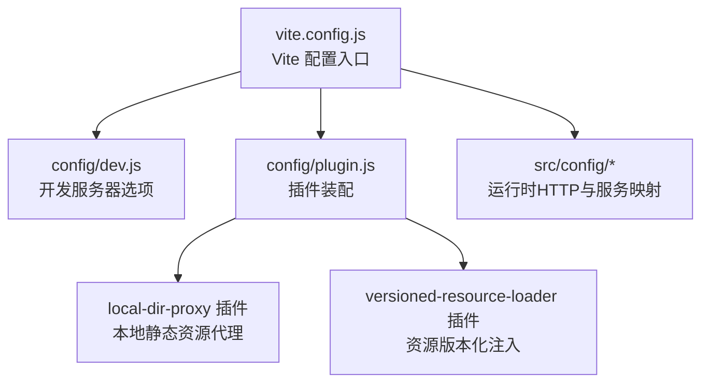
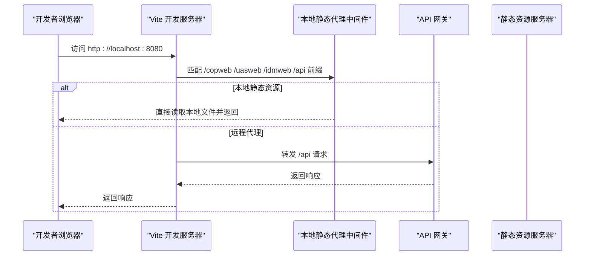
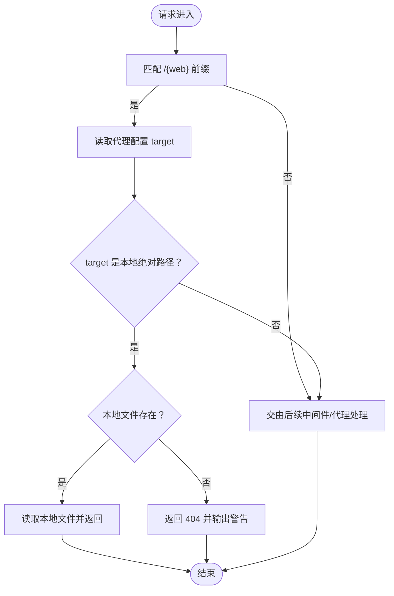
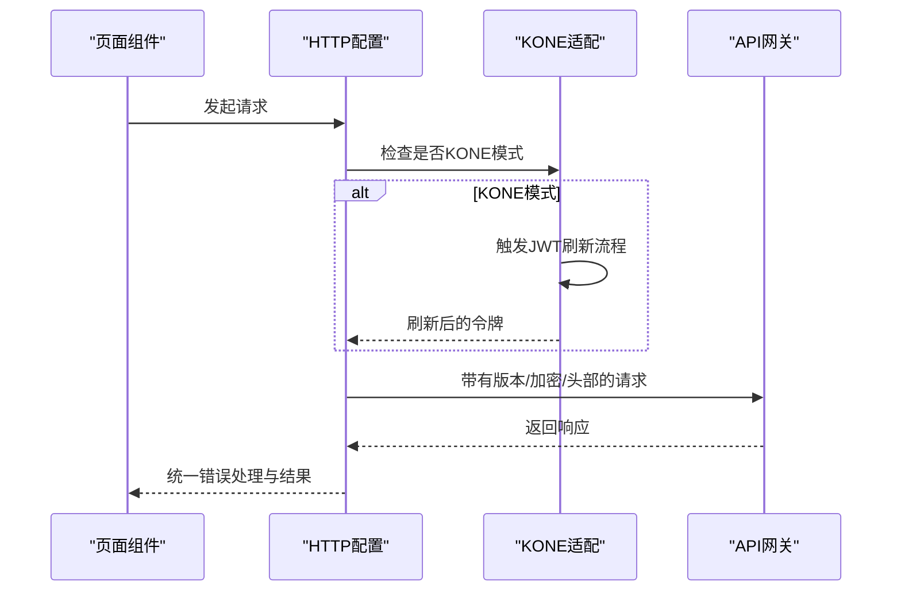
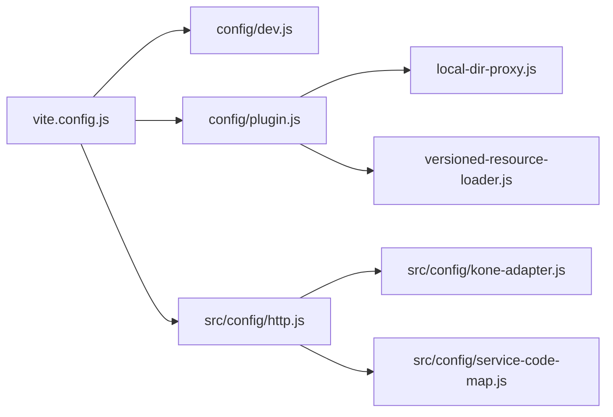

# 开发服务器

<cite>
**本文引用的文件**
- [vite.config.js](file://vite.config.js)
- [config/dev.js](file://config/dev.js)
- [config/plugin.js](file://config/plugin.js)
- [config/plugins/local-dir--proxy/local-dir-proxy.js](file://config/plugins/local-dir--proxy/local-dir-proxy.js)
- [config/plugins/versioned-resource-loader/versioned-resource-loader.js](file://config/plugins/versioned-resource-loader/versioned-resource-loader.js)
- [src/config/http.js](file://src/config/http.js)
- [src/config/kone-adapter.js](file://src/config/kone-adapter.js)
- [src/config/service-code-map.js](file://src/config/service-code-map.js)
- [package.json](file://package.json)
- [README.md](file://README.md)
- [.eslintrc.js](file://.eslintrc.js)
- [.prettierrc](file://.prettierrc)
</cite>

## 目录
1. [简介](#简介)
2. [项目结构](#项目结构)
3. [核心组件](#核心组件)
4. [架构总览](#架构总览)
5. [详细组件分析](#详细组件分析)
6. [依赖关系分析](#依赖关系分析)
7. [性能考虑](#性能考虑)
8. [故障排除指南](#故障排除指南)
9. [结论](#结论)
10. [附录](#附录)

## 简介
本文件面向 FS-AOI-WEB 的前端开发团队，提供一套完整、可操作的“开发服务器”配置与使用说明。内容覆盖：
- 端口与主机绑定、热重载机制、代理配置与API转发规则
- 本地静态资源代理与跨域处理策略
- 安全与会话处理（含KONE模式与JWT刷新）
- 开发工具链（ESLint、Prettier）与脚本命令
- 性能优化建议与常见问题排查

## 项目结构
本项目采用 Vite 作为开发服务器与构建工具，开发配置集中在 config/dev.js，通过 vite.config.js 引入；同时提供自定义插件以增强本地开发体验。

图表来源
- [vite.config.js](file://vite.config.js#L1-L80)
- [config/dev.js](file://config/dev.js#L1-L39)
- [config/plugin.js](file://config/plugin.js#L1-L17)
- [config/plugins/local-dir--proxy/local-dir-proxy.js](file://config/plugins/local-dir--proxy/local-dir-proxy.js#L1-L39)
- [config/plugins/versioned-resource-loader/versioned-resource-loader.js](file://config/plugins/versioned-resource-loader/versioned-resource-loader.js#L1-L193)

章节来源
- [vite.config.js](file://vite.config.js#L1-L80)
- [config/dev.js](file://config/dev.js#L1-L39)
- [config/plugin.js](file://config/plugin.js#L1-L17)
- [README.md](file://README.md#L44-L55)

## 核心组件
- 开发服务器配置：端口、主机、代理、HMR开关等
- 本地静态资源代理：将特定前缀路由直接指向本地文件系统
- 版本化资源加载器：在生产构建中为资源注入版本参数，开发阶段按需启用
- 运行时HTTP与服务映射：统一请求前缀、错误处理、KONE模式适配
- 插件体系：Vue SFC支持、本地代理中间件、资源版本化

章节来源
- [config/dev.js](file://config/dev.js#L4-L37)
- [config/plugins/local-dir--proxy/local-dir-proxy.js](file://config/plugins/local-dir--proxy/local-dir-proxy.js#L4-L38)
- [config/plugins/versioned-resource-loader/versioned-resource-loader.js](file://config/plugins/versioned-resource-loader/versioned-resource-loader.js#L3-L193)
- [src/config/http.js](file://src/config/http.js#L27-L85)
- [src/config/service-code-map.js](file://src/config/service-code-map.js#L25-L66)

## 架构总览
开发服务器工作流概览如下：

图表来源
- [vite.config.js](file://vite.config.js#L34-L34)
- [config/dev.js](file://config/dev.js#L9-L36)
- [config/plugins/local-dir--proxy/local-dir-proxy.js](file://config/plugins/local-dir--proxy/local-dir-proxy.js#L8-L36)

## 详细组件分析

### 开发服务器与端口设置
- 端口与主机：开发服务器默认监听 0.0.0.0:8080，便于容器或局域网访问
- 热重载（HMR）：默认开启；如遇频繁更新导致卡顿，可在配置中临时关闭并配合手动刷新
- 主机绑定：host 设置为 0.0.0.0，允许来自其他设备的访问

章节来源
- [config/dev.js](file://config/dev.js#L4-L8)
- [README.md](file://README.md#L46-L51)

### 代理配置与API转发规则
- 代理目标
  - /copweb → 账户运营公共开发环境静态资源网关
  - /uasweb → 同上
  - /idmweb → 同上
  - /api → 账户运营公共开发环境 API 网关
- 代理行为
  - changeOrigin: true，解决CORS与Host头问题
  - /api 代理额外注入 X-Real-IP 请求头，便于后端定位客户端真实IP
- 本地静态资源代理
  - 当 target 配置为本地绝对路径时，中间件优先读取本地文件并返回
  - 若文件不存在，返回 404 并输出警告日志

章节来源
- [config/dev.js](file://config/dev.js#L9-L36)
- [config/plugins/local-dir--proxy/local-dir-proxy.js](file://config/plugins/local-dir--proxy/local-dir-proxy.js#L8-L36)

### 本地静态资源代理中间件
- 匹配规则：以 /{web} 前缀开头的路径，如 /copweb、/uasweb、/idmweb
- 优先级：当代理目标为本地绝对路径时，优先读取本地文件
- 错误处理：文件不存在时返回 404 并记录警告

图表来源
- [config/plugins/local-dir--proxy/local-dir-proxy.js](file://config/plugins/local-dir--proxy/local-dir-proxy.js#L8-L36)

章节来源
- [config/plugins/local-dir--proxy/local-dir-proxy.js](file://config/plugins/local-dir--proxy/local-dir-proxy.js#L1-L39)

### 版本化资源加载器（开发阶段按需启用）
- 作用：在生产构建中为JS/CSS等资源注入版本参数，避免缓存问题
- 开发阶段：仅在生产模式且非 hash 模式时启用
- 行为：改写HTML中的脚本与样式链接，注入版本查询参数；同时注入运行时逻辑，对动态加载的资源也追加版本参数

章节来源
- [config/plugin.js](file://config/plugin.js#L8-L13)
- [config/plugins/versioned-resource-loader/versioned-resource-loader.js](file://config/plugins/versioned-resource-loader/versioned-resource-loader.js#L3-L193)

### 运行时HTTP与服务映射
- 统一错误处理：集中处理HTTP错误与业务错误，支持弹窗提示与TraceID展示
- 会话与加密：支持请求加密、动态密钥、KONE模式下的JWT刷新
- 服务前缀映射：根据系统名或服务编码动态计算请求前缀，兼容多子系统

图表来源
- [src/config/http.js](file://src/config/http.js#L27-L85)
- [src/config/kone-adapter.js](file://src/config/kone-adapter.js#L124-L162)
- [src/config/service-code-map.js](file://src/config/service-code-map.js#L25-L66)

章节来源
- [src/config/http.js](file://src/config/http.js#L1-L124)
- [src/config/kone-adapter.js](file://src/config/kone-adapter.js#L1-L248)
- [src/config/service-code-map.js](file://src/config/service-code-map.js#L1-L129)

### 插件体系与开发工具集成
- Vue 插件：支持 .vue 单文件组件开发
- 本地目录代理插件：开发阶段可直接挂载本地静态资源目录
- 版本化资源加载器：生产构建时注入版本参数
- ESLint 与 Prettier：统一代码风格与质量控制

章节来源
- [config/plugin.js](file://config/plugin.js#L1-L17)
- [.eslintrc.js](file://.eslintrc.js#L1-L35)
- [.prettierrc](file://.prettierrc#L1-L12)

## 依赖关系分析
- vite.config.js 作为入口，组合 serverOptions、buildOptions 与插件列表
- config/dev.js 提供 serverOptions，包含端口、host、代理与HMR开关
- 插件装配在 config/plugin.js 中完成，分别引入 Vue、本地目录代理与版本化资源加载器
- 运行时配置位于 src/config，负责HTTP、服务映射与KONE适配

图表来源
- [vite.config.js](file://vite.config.js#L1-L80)
- [config/dev.js](file://config/dev.js#L1-L39)
- [config/plugin.js](file://config/plugin.js#L1-L17)
- [config/plugins/local-dir--proxy/local-dir-proxy.js](file://config/plugins/local-dir--proxy/local-dir-proxy.js#L1-L39)
- [config/plugins/versioned-resource-loader/versioned-resource-loader.js](file://config/plugins/versioned-resource-loader/versioned-resource-loader.js#L1-L193)
- [src/config/http.js](file://src/config/http.js#L1-L124)
- [src/config/kone-adapter.js](file://src/config/kone-adapter.js#L1-L248)
- [src/config/service-code-map.js](file://src/config/service-code-map.js#L1-L129)

章节来源
- [vite.config.js](file://vite.config.js#L1-L80)
- [config/plugin.js](file://config/plugin.js#L1-L17)

## 性能考虑
- 热重载（HMR）：默认开启，提升开发效率；若遇到频繁更新卡顿，可临时关闭HMR并配合手动刷新
- 代理与本地资源：优先使用本地绝对路径直出静态资源，减少网络往返
- 构建优化：生产构建开启sourcemap与异步分包策略，有助于调试与加载性能
- 代码质量：ESLint与Prettier统一规范，降低维护成本

章节来源
- [config/dev.js](file://config/dev.js#L6-L6)
- [config/build.js](file://config/build.js#L32-L103)
- [.eslintrc.js](file://.eslintrc.js#L16-L32)
- [.prettierrc](file://.prettierrc#L1-L12)

## 故障排除指南
- 本地静态资源 404
  - 现象：访问 /copweb、/uasweb 或 /idmweb 时返回 404
  - 排查：确认代理 target 是否为本地绝对路径；确认文件路径是否存在
  - 参考：本地代理中间件对本地文件存在性进行校验并输出警告
- API 请求跨域或鉴权失败
  - 现象：/api 请求返回跨域或鉴权错误
  - 排查：确认代理目标与changeOrigin配置；检查后端是否要求特定头部（如X-Real-IP）
  - 参考：/api 代理已注入X-Real-IP，确保后端可识别真实客户端IP
- KONE 模式下会话过期
  - 现象：触发JWT刷新或提示重新登录
  - 排查：确认KONE消息通道是否正常；检查刷新令牌流程与父窗口通信
  - 参考：KONE适配器提供刷新令牌与重发请求逻辑
- 端口占用或无法访问
  - 现象：端口 8080 被占用或外部设备无法访问
  - 排查：修改 config/dev.js 中的 port/host；确认防火墙与网络策略
  - 参考：host 设为 0.0.0.0，便于局域网访问

章节来源
- [config/plugins/local-dir--proxy/local-dir-proxy.js](file://config/plugins/local-dir--proxy/local-dir-proxy.js#L27-L34)
- [config/dev.js](file://config/dev.js#L27-L36)
- [src/config/kone-adapter.js](file://src/config/kone-adapter.js#L124-L162)
- [config/dev.js](file://config/dev.js#L4-L8)

## 结论
本开发服务器配置围绕“端口与主机绑定、代理与本地资源直出、版本化资源注入、运行时HTTP与KONE适配”五大方面展开，既满足多子系统开发需求，又兼顾性能与可维护性。建议在团队内统一遵循代理规则与端口约定，配合ESLint/Prettier与脚本命令，形成高效稳定的开发流水线。

## 附录
- 脚本命令
  - 开发：vite（或 npm run dev）
  - 预览：vite preview（或 npm run preview）
  - 构建：vite build（或 npm run build），需提供 APP_VERSION 环境变量
  - 代码检查与格式化：npm run lint、npm run lint:fix、npm run format
- 环境要求
  - Node.js 版本：18+（推荐LTS）

章节来源
- [package.json](file://package.json#L6-L12)
- [README.md](file://README.md#L3-L27)
- [vite.config.js](file://vite.config.js#L14-L29)