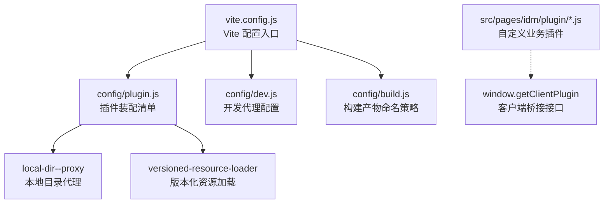
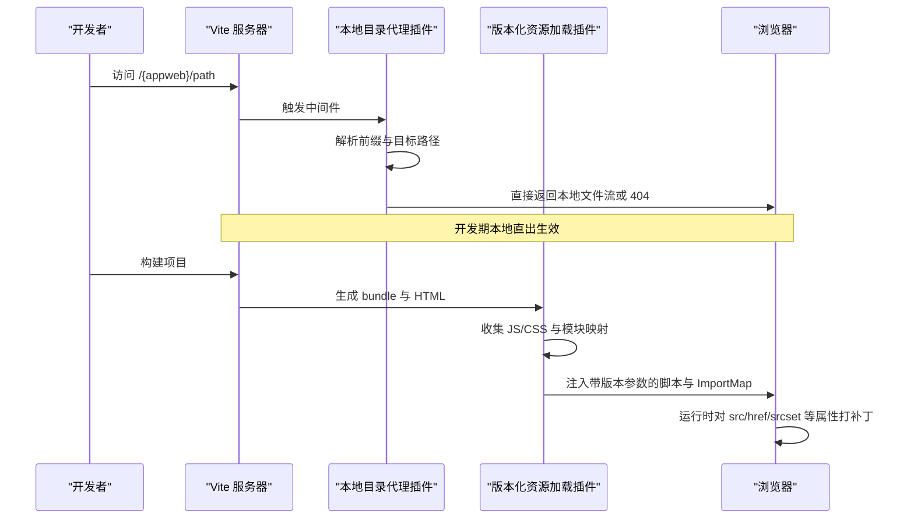
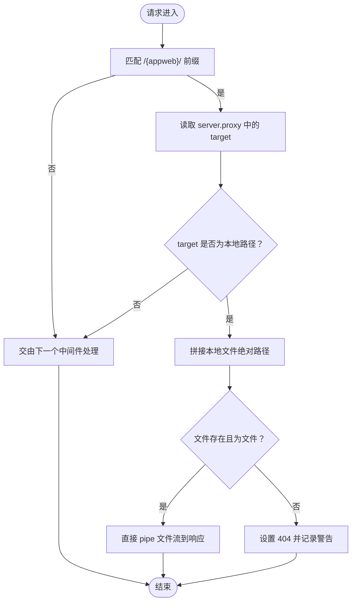
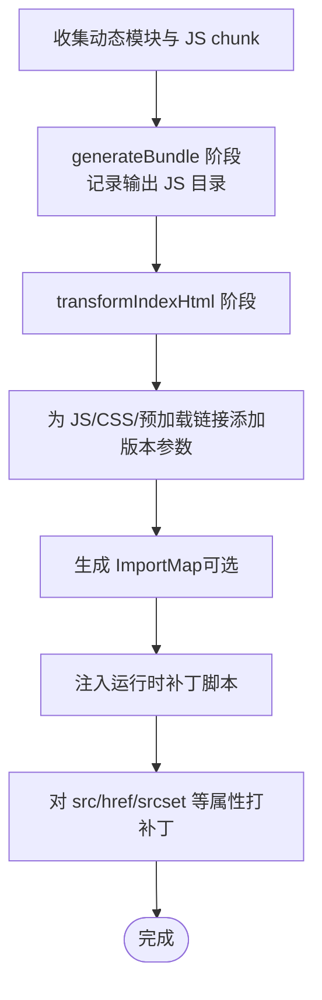
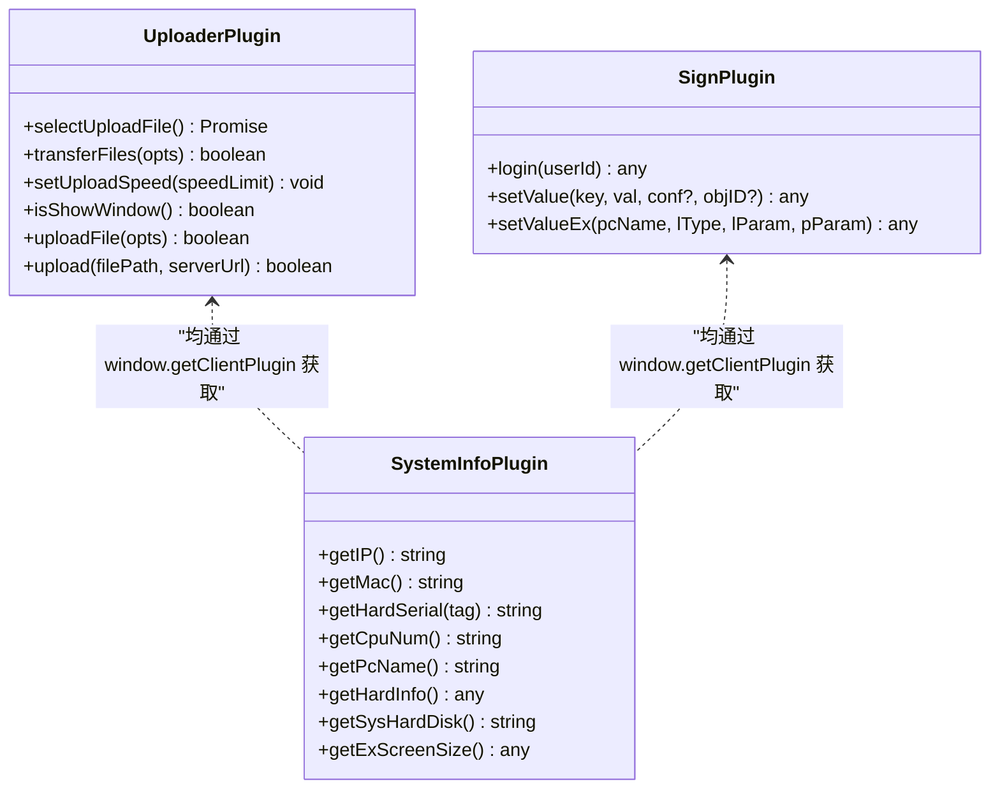
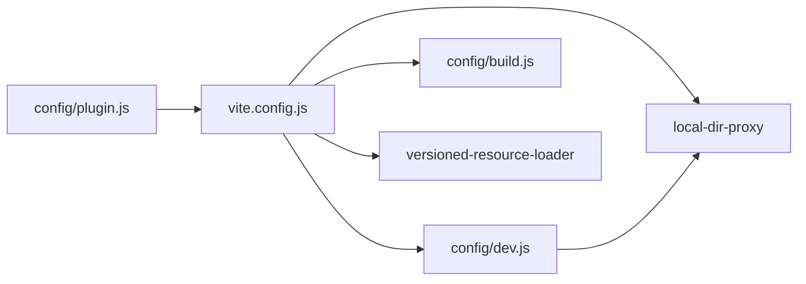

# 插件系统

<cite>
**本文引用的文件**
- [vite.config.js](file://vite.config.js)
- [config/plugin.js](file://config/plugin.js)
- [config/plugins/local-dir--proxy/local-dir-proxy.js](file://config/plugins/local-dir--proxy/local-dir-proxy.js)
- [config/plugins/versioned-resource-loader/versioned-resource-loader.js](file://config/plugins/versioned-resource-loader/versioned-resource-loader.js)
- [config/build.js](file://config/build.js)
- [config/dev.js](file://config/dev.js)
- [package.json](file://package.json)
- [src/pages/idm/plugin/uploader.js](file://src/pages/idm/plugin/uploader.js)
- [src/pages/idm/plugin/system-info.js](file://src/pages/idm/plugin/system-info.js)
- [src/pages/idm/plugin/sign-dj.js](file://src/pages/idm/plugin/sign-dj.js)
</cite>

## 目录
1. [简介](#简介)
2. [项目结构](#项目结构)
3. [核心组件](#核心组件)
4. [架构总览](#架构总览)
5. [组件详解](#组件详解)
6. [依赖关系分析](#依赖关系分析)
7. [性能考量](#性能考量)
8. [故障排除指南](#故障排除指南)
9. [结论](#结论)
10. [附录](#附录)

## 简介
本文件系统性阐述 FS-AOI-WEB 的插件体系，覆盖 Vite 插件注册与生命周期、内置插件（本地目录代理、版本化资源加载）的工作原理、自定义插件开发规范与最佳实践，以及扩展与排障方法。目标是帮助开发者快速理解并安全地扩展该前端工程的插件能力。

## 项目结构
FS-AOI-WEB 的插件系统主要由三部分组成：
- Vite 插件装配入口：集中声明并按环境启用插件
- 内置 Vite 插件：本地目录代理与版本化资源加载
- 自定义业务插件：基于客户端桥接能力封装的业务功能模块

图表来源
- [vite.config.js](file://vite.config.js#L1-L80)
- [config/plugin.js](file://config/plugin.js#L1-L17)
- [config/plugins/local-dir--proxy/local-dir-proxy.js](file://config/plugins/local-dir--proxy/local-dir-proxy.js#L1-L39)
- [config/plugins/versioned-resource-loader/versioned-resource-loader.js](file://config/plugins/versioned-resource-loader/versioned-resource-loader.js#L1-L193)
- [config/dev.js](file://config/dev.js#L1-L39)
- [config/build.js](file://config/build.js#L1-L104)

章节来源
- [vite.config.js](file://vite.config.js#L1-L80)
- [config/plugin.js](file://config/plugin.js#L1-L17)

## 核心组件
- Vite 插件装配清单：统一导出插件数组，按开发/生产环境条件启用
- 本地目录代理插件：在开发阶段拦截特定前缀路径，将静态资源从本地目录直出
- 版本化资源加载插件：在构建阶段为 JS/CSS 资源注入版本参数，并在运行时对资源 URL 进行补丁
- 自定义业务插件：通过 window.getClientPlugin 获取客户端能力，封装上传、系统信息、签名等业务能力

章节来源
- [config/plugin.js](file://config/plugin.js#L1-L17)
- [config/plugins/local-dir--proxy/local-dir-proxy.js](file://config/plugins/local-dir--proxy/local-dir-proxy.js#L1-L39)
- [config/plugins/versioned-resource-loader/versioned-resource-loader.js](file://config/plugins/versioned-resource-loader/versioned-resource-loader.js#L1-L193)
- [src/pages/idm/plugin/uploader.js](file://src/pages/idm/plugin/uploader.js#L1-L85)
- [src/pages/idm/plugin/system-info.js](file://src/pages/idm/plugin/system-info.js#L1-L47)
- [src/pages/idm/plugin/sign-dj.js](file://src/pages/idm/plugin/sign-dj.js#L1-L46)

## 架构总览
FS-AOI-WEB 的插件系统围绕 Vite 生命周期展开，开发期通过代理与中间件实现本地直出与资源补丁，构建期通过 Rollup 输出策略与 HTML 注入实现资源版本化与缓存控制。

图表来源
- [config/plugins/local-dir--proxy/local-dir-proxy.js](file://config/plugins/local-dir--proxy/local-dir-proxy.js#L8-L36)
- [config/plugins/versioned-resource-loader/versioned-resource-loader.js](file://config/plugins/versioned-resource-loader/versioned-resource-loader.js#L37-L190)
- [vite.config.js](file://vite.config.js#L14-L79)

## 组件详解

### 本地目录代理插件（local-dir-proxy）
- 作用：在开发阶段拦截形如 /{appweb}/... 的请求，将静态资源从本地目录直出，避免跨域与代理复杂度
- 关键点
  - 仅在 serve 模式应用
  - 通过 server.proxy 配置中的前缀定位目标目录
  - 对匹配到的本地文件直接 pipe 到响应流；否则透传给后续中间件
  - 对不存在的文件返回 404 并输出警告日志
- 使用场景：本地联调多子站静态资源，无需维护复杂代理规则

图表来源
- [config/plugins/local-dir--proxy/local-dir-proxy.js](file://config/plugins/local-dir--proxy/local-dir-proxy.js#L8-L36)

章节来源
- [config/plugins/local-dir--proxy/local-dir-proxy.js](file://config/plugins/local-dir--proxy/local-dir-proxy.js#L1-L39)
- [config/dev.js](file://config/dev.js#L9-L36)

### 版本化资源加载插件（versioned-resource-loader）
- 作用：在构建阶段为 JS/CSS 资源注入版本参数，并在运行时对资源 URL 打补丁，实现强缓存与精准失效
- 关键点
  - 收集动态模块（通过 includeGlobs 指定）、构建产物 JS chunk，形成待加版本参数的集合
  - 在 transformIndexHtml 阶段
    - 为 script/link/modulepreload 等标签追加版本参数
    - 生成 ImportMap（当前注释掉，保留扩展能力）
    - 注入运行时补丁脚本，对 HTMLScriptElement/HTMLLinkElement/HTMLImageElement 的 src/href/srcset 属性进行拦截与改写
  - 运行时补丁逻辑
    - 跳过外部协议与 data: blob: 等特殊协议
    - 若已带有版本参数则跳过
    - 对同源资源统一追加版本参数
- 生产构建要求
  - 必须提供 APP_VERSION 环境变量，否则构建直接退出并提示如何设置

图表来源
- [config/plugins/versioned-resource-loader/versioned-resource-loader.js](file://config/plugins/versioned-resource-loader/versioned-resource-loader.js#L37-L190)
- [vite.config.js](file://vite.config.js#L14-L29)

章节来源
- [config/plugins/versioned-resource-loader/versioned-resource-loader.js](file://config/plugins/versioned-resource-loader/versioned-resource-loader.js#L1-L193)
- [vite.config.js](file://vite.config.js#L14-L29)

### 自定义业务插件（IDM 模块）
- 作用：通过 window.getClientPlugin 获取客户端桥接能力，封装上传、系统信息、签名等业务能力
- 典型插件
  - 上传插件：断点续传、速度限制、弹窗控制、兼容不同壳子参数格式
  - 系统信息插件：获取 IP/MAC/硬盘序列号/CPU 序列号/计算机名/分区信息/系统卷标号/扩展屏信息
  - 签名插件：封装点聚签名能力，设置参数、登录、启用鼠标模式等
- 设计要点
  - 插件实例延迟初始化，首次使用时才通过 window.getClientPlugin 获取
  - 参数校验与错误提示，避免空参数导致调用失败
  - 对不同壳子（如 ElectronXC）的参数格式差异进行兼容处理

图表来源
- [src/pages/idm/plugin/uploader.js](file://src/pages/idm/plugin/uploader.js#L1-L85)
- [src/pages/idm/plugin/system-info.js](file://src/pages/idm/plugin/system-info.js#L1-L47)
- [src/pages/idm/plugin/sign-dj.js](file://src/pages/idm/plugin/sign-dj.js#L1-L46)

章节来源
- [src/pages/idm/plugin/uploader.js](file://src/pages/idm/plugin/uploader.js#L1-L85)
- [src/pages/idm/plugin/system-info.js](file://src/pages/idm/plugin/system-info.js#L1-L47)
- [src/pages/idm/plugin/sign-dj.js](file://src/pages/idm/plugin/sign-dj.js#L1-L46)

## 依赖关系分析
- 插件装配与环境控制
  - config/plugin.js 导出插件数组，按 NODE_ENV 与 BUILD_MODE 条件启用版本化资源加载插件
  - vite.config.js 引入 config/plugin.js，并在构建阶段校验 APP_VERSION
- 构建产物命名策略
  - config/build.js 定义异步 vendor 分包与文件名哈希策略，配合版本化资源加载实现缓存优化
- 开发代理与本地直出
  - config/dev.js 提供 /copweb、/uasweb、/idmweb、/api 等代理规则，local-dir-proxy 作为中间件在开发期拦截并直出本地资源

图表来源
- [config/plugin.js](file://config/plugin.js#L1-L17)
- [vite.config.js](file://vite.config.js#L14-L53)
- [config/dev.js](file://config/dev.js#L9-L36)
- [config/build.js](file://config/build.js#L32-L103)

章节来源
- [config/plugin.js](file://config/plugin.js#L1-L17)
- [vite.config.js](file://vite.config.js#L14-L53)
- [config/dev.js](file://config/dev.js#L1-L39)
- [config/build.js](file://config/build.js#L1-L104)

## 性能考量
- 异步分包与缓存
  - 通过 config/build.js 将第三方库拆分为独立目录，结合版本化资源加载，可实现更细粒度的缓存控制
- 构建产物命名
  - 在 hash 模式下启用短哈希，减少文件名长度；在版本模式下启用长版本参数，确保强缓存命中与精准失效
- 运行时补丁开销
  - 版本化资源加载插件在运行时对属性访问器进行拦截，属于轻量级操作；建议避免在高频渲染场景中大量重复创建元素

章节来源
- [config/build.js](file://config/build.js#L19-L103)
- [config/plugins/versioned-resource-loader/versioned-resource-loader.js](file://config/plugins/versioned-resource-loader/versioned-resource-loader.js#L123-L187)

## 故障排除指南
- 本地静态资源 404
  - 现象：访问 /{appweb}/... 返回 404
  - 排查：确认 server.proxy 中对应前缀的 target 是否为本地路径；确认文件是否存在且为文件
  - 参考
    - [config/plugins/local-dir--proxy/local-dir-proxy.js](file://config/plugins/local-dir--proxy/local-dir-proxy.js#L25-L34)
    - [config/dev.js](file://config/dev.js#L9-L36)
- 版本模式构建失败
  - 现象：构建时报错并退出，提示必须提供 APP_VERSION
  - 排查：确保设置 APP_VERSION 环境变量；参考构建日志中的示例命令
  - 参考
    - [vite.config.js](file://vite.config.js#L14-L29)
- 资源未命中版本参数
  - 现象：JS/CSS 未附加版本参数
  - 排查：确认 includeGlobs 是否包含相关文件；确认构建模式是否为版本模式
  - 参考
    - [config/plugin.js](file://config/plugin.js#L8-L13)
    - [config/plugins/versioned-resource-loader/versioned-resource-loader.js](file://config/plugins/versioned-resource-loader/versioned-resource-loader.js#L19-L29)
- 上传插件参数缺失
  - 现象：调用上传接口返回告警
  - 排查：检查必填字段（如 filePath、serverUrl）是否传入；区分不同壳子的参数格式
  - 参考
    - [src/pages/idm/plugin/uploader.js](file://src/pages/idm/plugin/uploader.js#L28-L34)
    - [src/pages/idm/plugin/uploader.js](file://src/pages/idm/plugin/uploader.js#L55-L84)

章节来源
- [config/plugins/local-dir--proxy/local-dir-proxy.js](file://config/plugins/local-dir--proxy/local-dir-proxy.js#L25-L34)
- [config/dev.js](file://config/dev.js#L9-L36)
- [vite.config.js](file://vite.config.js#L14-L29)
- [config/plugin.js](file://config/plugin.js#L8-L13)
- [config/plugins/versioned-resource-loader/versioned-resource-loader.js](file://config/plugins/versioned-resource-loader/versioned-resource-loader.js#L19-L29)
- [src/pages/idm/plugin/uploader.js](file://src/pages/idm/plugin/uploader.js#L28-L34)
- [src/pages/idm/plugin/uploader.js](file://src/pages/idm/plugin/uploader.js#L55-L84)

## 结论
FS-AOI-WEB 的插件系统以 Vite 为核心，结合本地直出与版本化资源加载两大内置能力，既简化了开发期的资源联调，又强化了生产期的缓存与更新控制。自定义业务插件通过 window.getClientPlugin 与客户端能力解耦，具备良好的可扩展性与兼容性。遵循本文的开发规范与排障建议，可高效地扩展与维护插件体系。

## 附录

### 插件接口规范与最佳实践
- Vite 插件开发
  - 明确 apply 条件（serve/build），避免在不适用的环境下执行
  - 在 transformIndexHtml 中进行 HTML 级别的资源改写，确保与构建产物一致
  - 对运行时补丁保持最小侵入，优先使用属性访问器拦截
- 自定义业务插件
  - 通过 window.getClientPlugin 延迟初始化，避免页面加载即触发客户端调用
  - 对必填参数进行显式校验，提供明确的错误提示
  - 针对不同壳子的参数差异进行兼容处理，保证跨环境可用

章节来源
- [config/plugins/versioned-resource-loader/versioned-resource-loader.js](file://config/plugins/versioned-resource-loader/versioned-resource-loader.js#L34-L69)
- [src/pages/idm/plugin/uploader.js](file://src/pages/idm/plugin/uploader.js#L1-L85)
- [src/pages/idm/plugin/system-info.js](file://src/pages/idm/plugin/system-info.js#L1-L47)
- [src/pages/idm/plugin/sign-dj.js](file://src/pages/idm/plugin/sign-dj.js#L1-L46)