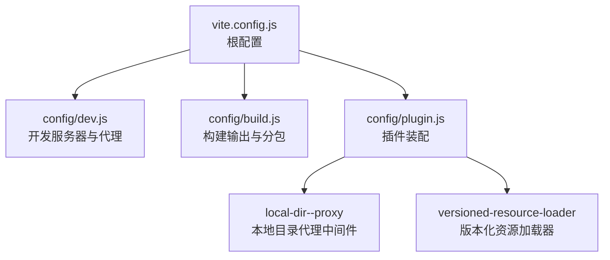
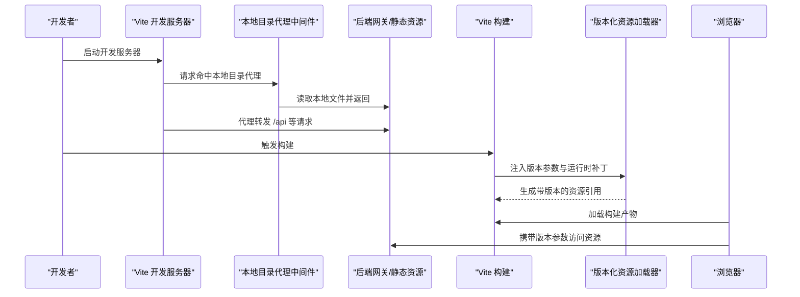
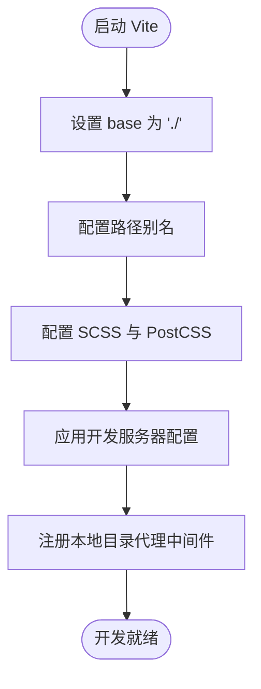
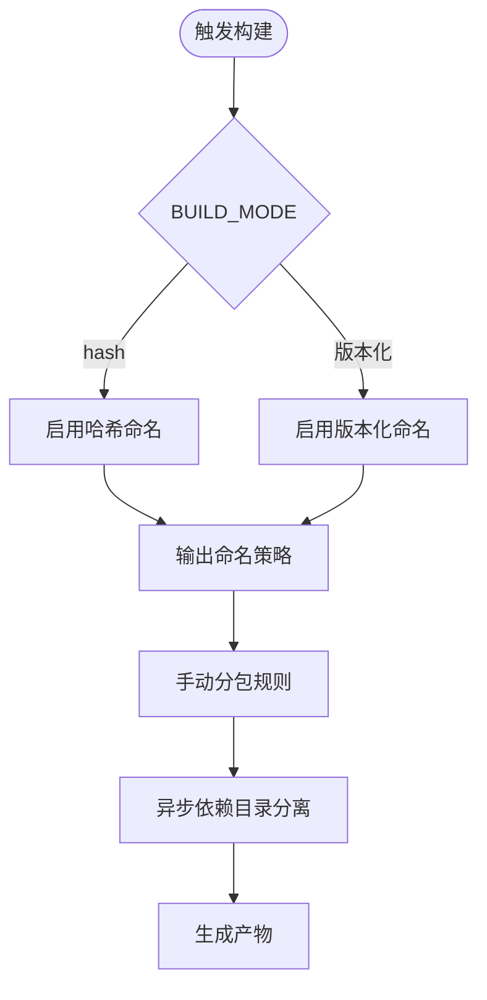
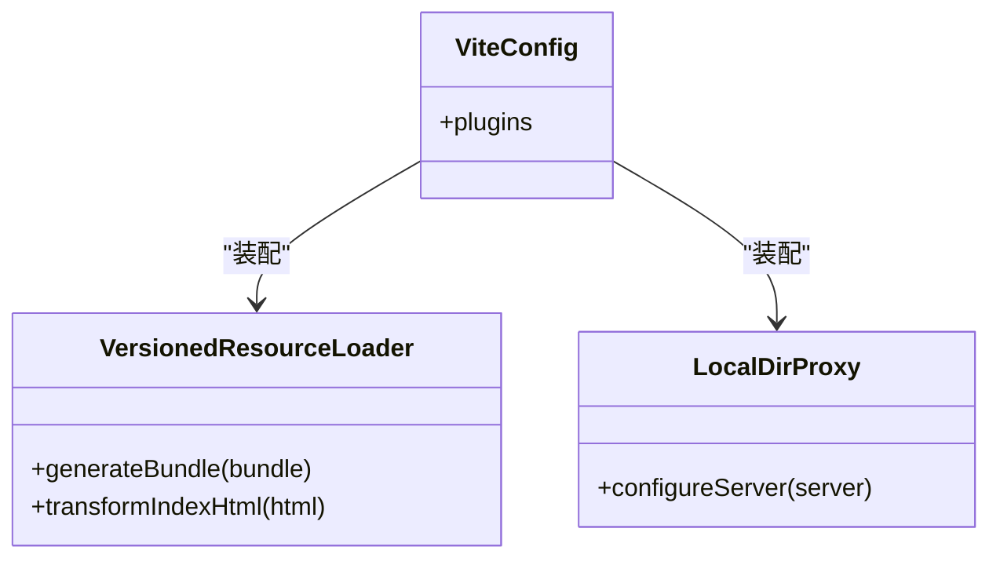
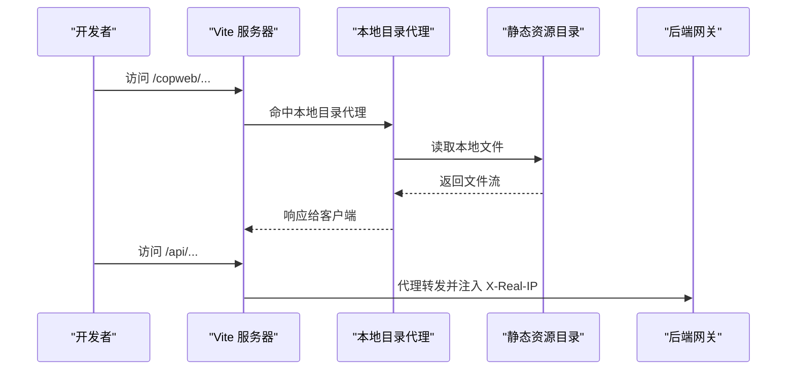
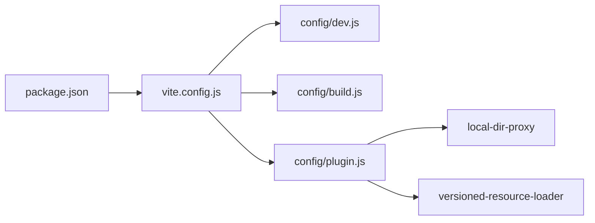

# 构建与部署

<cite>
**本文引用的文件**
- [package.json](file://package.json)
- [vite.config.js](file://vite.config.js)
- [config/build.js](file://config/build.js)
- [config/dev.js](file://config/dev.js)
- [config/plugin.js](file://config/plugin.js)
- [config/plugins/local-dir--proxy/local-dir-proxy.js](file://config/plugins/local-dir--proxy/local-dir-proxy.js)
- [config/plugins/versioned-resource-loader/versioned-resource-loader.js](file://config/plugins/versioned-resource-loader/versioned-resource-loader.js)
- [.eslintrc.js](file://.eslintrc.js)
- [README.md](file://README.md)
</cite>

## 目录
1. [简介](#简介)
2. [项目结构](#项目结构)
3. [核心组件](#核心组件)
4. [架构总览](#架构总览)
5. [详细组件分析](#详细组件分析)
6. [依赖关系分析](#依赖关系分析)
7. [性能考量](#性能考量)
8. [故障排除指南](#故障排除指南)
9. [结论](#结论)
10. [附录](#附录)

## 简介
本文件面向 FS-AOI-WEB 的前端工程，提供从开发到生产的完整构建与部署指南。内容覆盖 Vite 构建配置、开发服务器设置、生产环境优化、构建产物结构、部署要求、CI/CD 集成建议、环境配置与安全注意事项，以及常见问题排查。

## 项目结构
该工程采用 Vite 作为构建与开发服务器，通过分层配置管理开发、构建与插件逻辑：
- 根级配置：入口与基础路径、别名、CSS 预处理与后处理、插件装配等
- 开发配置：端口、主机、代理规则与请求头注入
- 构建配置：产物命名、分包策略、哈希模式与版本化资源加载
- 插件体系：Vue SFC 支持、本地目录代理、版本化资源加载器

图表来源
- [vite.config.js](file://vite.config.js#L1-L80)
- [config/dev.js](file://config/dev.js#L1-L39)
- [config/build.js](file://config/build.js#L1-L104)
- [config/plugin.js](file://config/plugin.js#L1-L17)

章节来源
- [vite.config.js](file://vite.config.js#L1-L80)
- [config/dev.js](file://config/dev.js#L1-L39)
- [config/build.js](file://config/build.js#L1-L104)
- [config/plugin.js](file://config/plugin.js#L1-L17)

## 核心组件
- 构建脚本与引擎约束：通过根级脚本与 engines 约束 Node 版本范围，确保开发与 CI 环境一致性。
- Vite 根配置：统一管理 base、server、build、resolve、plugins、css 等关键项。
- 开发服务器：端口、主机、代理与请求头注入，支持本地目录直连与跨域场景。
- 构建输出：产物命名策略、分包与异步依赖目录、可选哈希模式。
- 插件体系：Vue SFC、本地目录代理、生产环境版本化资源加载。

章节来源
- [package.json](file://package.json#L1-L61)
- [vite.config.js](file://vite.config.js#L14-L79)
- [config/dev.js](file://config/dev.js#L4-L38)
- [config/build.js](file://config/build.js#L32-L103)
- [config/plugin.js](file://config/plugin.js#L5-L14)

## 架构总览
下图展示从开发到生产的整体流程与关键交互点：

图表来源
- [vite.config.js](file://vite.config.js#L3-L53)
- [config/dev.js](file://config/dev.js#L9-L35)
- [config/plugins/local-dir--proxy/local-dir-proxy.js](file://config/plugins/local-dir--proxy/local-dir-proxy.js#L8-L36)
- [config/plugins/versioned-resource-loader/versioned-resource-loader.js](file://config/plugins/versioned-resource-loader/versioned-resource-loader.js#L34-L190)

## 详细组件分析

### Vite 根配置与开发服务器
- 基础路径与别名：base 设置为相对路径，便于多部署场景；通过 alias 将常用路径映射到源代码目录，提升开发体验。
- 解析与兼容：preserveSymlinks 适配 npm 用户代理；静态资源路径根据 NODE_ENV 动态指向 public/static 或 static。
- CSS 预处理与后处理：SCSS 现代 API 与全局变量注入；PostCSS 移除 charset 规则避免重复字符集声明。
- 开发服务器：端口、主机、代理与请求头注入；本地目录代理中间件按前缀路由到本地绝对路径或远程目标。

图表来源
- [vite.config.js](file://vite.config.js#L31-L77)
- [config/dev.js](file://config/dev.js#L4-L38)
- [config/plugins/local-dir--proxy/local-dir-proxy.js](file://config/plugins/local-dir--proxy/local-dir-proxy.js#L4-L38)

章节来源
- [vite.config.js](file://vite.config.js#L14-L79)
- [config/dev.js](file://config/dev.js#L1-L39)
- [config/plugins/local-dir--proxy/local-dir-proxy.js](file://config/plugins/local-dir--proxy/local-dir-proxy.js#L1-L39)

### 构建配置与产物组织
- 源映射与签名：开启 sourcemap；preserveEntrySignatures 保证导出签名。
- 产物命名：入口、资源与异步 chunk 的命名策略；支持哈希模式与版本化命名。
- 分包策略：异步依赖独立目录、第三方库分包、源代码按 pages 结构映射并做哈希处理。
- 手动分包：对特定包进行自定义输出目录，便于缓存与更新控制。

图表来源
- [vite.config.js](file://vite.config.js#L14-L29)
- [config/build.js](file://config/build.js#L32-L103)

章节来源
- [config/build.js](file://config/build.js#L1-L104)
- [vite.config.js](file://vite.config.js#L14-L29)

### 插件体系与版本化资源加载
- Vue 插件：支持 .vue 单文件组件编译。
- 本地目录代理：当代理目标为本地绝对路径时，直接读取文件系统并返回，减少跨域与网络开销。
- 版本化资源加载器：在生产且非 hash 模式下启用，为 HTML 中的 JS 引用与 modulepreload 注入版本参数，并在运行时对元素属性进行补丁，确保同源资源带上版本参数。

图表来源
- [config/plugin.js](file://config/plugin.js#L5-L14)
- [config/plugins/versioned-resource-loader/versioned-resource-loader.js](file://config/plugins/versioned-resource-loader/versioned-resource-loader.js#L34-L190)
- [config/plugins/local-dir--proxy/local-dir-proxy.js](file://config/plugins/local-dir--proxy/local-dir-proxy.js#L4-L38)

章节来源
- [config/plugin.js](file://config/plugin.js#L1-L17)
- [config/plugins/versioned-resource-loader/versioned-resource-loader.js](file://config/plugins/versioned-resource-loader/versioned-resource-loader.js#L1-L193)
- [config/plugins/local-dir--proxy/local-dir-proxy.js](file://config/plugins/local-dir--proxy/local-dir-proxy.js#L1-L39)

### 开发环境热重载与代理机制
- 热重载：Vite 默认启用 HMR；若遇到频繁更新导致卡顿，可通过注释禁用 HMR 并手动刷新。
- 代理规则：针对不同业务前缀（如 /copweb、/uasweb、/idmweb）代理至静态资源服务器；/api 代理至后端网关并注入 X-Real-IP。
- 本地目录直连：当代理目标为本地绝对路径时，中间件直接读取文件系统，避免跨域与网络延迟。

图表来源
- [config/dev.js](file://config/dev.js#L9-L35)
- [config/plugins/local-dir--proxy/local-dir-proxy.js](file://config/plugins/local-dir--proxy/local-dir-proxy.js#L8-L36)

章节来源
- [config/dev.js](file://config/dev.js#L1-L39)
- [config/plugins/local-dir--proxy/local-dir-proxy.js](file://config/plugins/local-dir--proxy/local-dir-proxy.js#L1-L39)

### 生产环境优化策略
- 产物命名与缓存：入口、资源与异步 chunk 的命名策略，结合哈希或版本参数实现强缓存与精准失效。
- 分包与懒加载：异步依赖独立目录，降低首屏体积；源代码按 pages 结构映射，便于增量更新。
- 运行时版本注入：通过版本化资源加载器在 HTML 与运行时补丁中注入版本参数，确保浏览器与 CDN 缓存一致。
- 清理控制台：esbuild 阶段移除 console 与 debugger，减小产物体积并避免调试信息泄露。

章节来源
- [config/build.js](file://config/build.js#L32-L103)
- [config/plugins/versioned-resource-loader/versioned-resource-loader.js](file://config/plugins/versioned-resource-loader/versioned-resource-loader.js#L34-L190)
- [vite.config.js](file://vite.config.js#L38-L38)

## 依赖关系分析
- 组件耦合：根配置集中装配开发、构建与插件；插件之间职责清晰，互不干扰。
- 外部依赖：Vite、Vue、ESLint、Prettier、Rollup 插件等；版本由 package.json 管控。
- 环境变量：BUILD_MODE 控制构建模式；APP_VERSION 提供版本化资源加载所需版本号。

图表来源
- [package.json](file://package.json#L1-L61)
- [vite.config.js](file://vite.config.js#L1-L80)
- [config/plugin.js](file://config/plugin.js#L1-L17)

章节来源
- [package.json](file://package.json#L1-L61)
- [vite.config.js](file://vite.config.js#L1-L80)
- [config/plugin.js](file://config/plugin.js#L1-L17)

## 性能考量
- 构建阶段
  - 启用 sourcemap 便于调试但增大体积，生产可按需关闭。
  - esbuild 移除 console 与 debugger，减少冗余代码。
  - 分包策略降低缓存失效范围，提升缓存命中率。
- 运行阶段
  - 版本化资源加载确保缓存与更新同步，避免陈旧资源。
  - 本地目录代理减少跨域与网络往返，提升开发体验。
- 代码质量
  - ESLint 与 Prettier 规范统一，减少维护成本与潜在错误。

[本节为通用指导，无需列出具体文件来源]

## 故障排除指南
- 构建失败（版本模式缺少版本号）
  - 现象：版本模式构建提示必须提供 APP_VERSION。
  - 处理：在构建命令中设置 APP_VERSION，或切换为 hash 模式。
  - 参考
    - [vite.config.js](file://vite.config.js#L14-L29)
- 本地静态资源 404
  - 现象：本地目录代理返回 404。
  - 排查：确认代理目标路径是否存在且为文件；检查路径大小写与编码。
  - 参考
    - [config/plugins/local-dir--proxy/local-dir-proxy.js](file://config/plugins/local-dir--proxy/local-dir-proxy.js#L25-L34)
- 开发时 HMR 卡顿
  - 现象：组件频繁更新导致卡顿。
  - 处理：可临时禁用 HMR 并手动刷新，同时禁用浏览器缓存。
  - 参考
    - [config/dev.js](file://config/dev.js#L6-L6)
- 代理未生效
  - 现象：/api 或业务前缀请求未转发。
  - 排查：确认代理目标 URL、changeOrigin 与请求头注入逻辑。
  - 参考
    - [config/dev.js](file://config/dev.js#L9-L35)
- ESLint/Prettier 报错
  - 现象：代码格式或规则不满足规范。
  - 处理：执行 lint 修复脚本或调整规则。
  - 参考
    - [package.json](file://package.json#L6-L12)
    - [.eslintrc.js](file://.eslintrc.js#L16-L34)

章节来源
- [vite.config.js](file://vite.config.js#L14-L29)
- [config/plugins/local-dir--proxy/local-dir-proxy.js](file://config/plugins/local-dir--proxy/local-dir-proxy.js#L25-L34)
- [config/dev.js](file://config/dev.js#L6-L6)
- [package.json](file://package.json#L6-L12)
- [.eslintrc.js](file://.eslintrc.js#L16-L34)

## 结论
本项目通过 Vite 实现高效的开发与构建体验，配合本地目录代理与版本化资源加载，在保证开发效率的同时兼顾生产环境的缓存与更新策略。遵循本文档的配置与最佳实践，可在不同部署场景中稳定交付高质量前端产物。

[本节为总结性内容，无需列出具体文件来源]

## 附录

### A. 构建与部署流程清单
- 开发
  - 安装依赖与切换私有源（如适用）
  - 启动开发服务器
  - 配置代理与本地目录代理
- 构建
  - 选择构建模式（hash 或版本化）
  - 设置版本号（版本化模式）
  - 执行构建并预览
- 部署
  - 上传构建产物至静态服务器或 CDN
  - 配置缓存与回源策略
  - 验证资源加载与版本参数生效

章节来源
- [README.md](file://README.md#L3-L55)
- [package.json](file://package.json#L6-L12)
- [vite.config.js](file://vite.config.js#L14-L29)

### B. CI/CD 集成建议
- 触发条件：分支保护、PR/MR 合并、标签推送
- 步骤建议：
  - 安装 Node 与包管理器（按 engines 约束）
  - 安装依赖（可缓存依赖目录）
  - 代码检查（ESLint + Prettier）
  - 构建（设置 BUILD_MODE 与 APP_VERSION）
  - 产物归档与发布（制品库/CDN）
- 安全建议：
  - 限制 CI 密钥权限
  - 对构建产物进行完整性校验
  - 仅允许受信分支触发构建

[本节为通用指导，无需列出具体文件来源]

### C. 环境变量与配置要点
- BUILD_MODE：控制构建模式（hash 或版本化）
- APP_VERSION：版本化模式下的版本号
- NODE_ENV：影响插件启用与运行时行为
- 代理目标：支持远程 URL 或本地绝对路径

章节来源
- [vite.config.js](file://vite.config.js#L14-L29)
- [config/plugin.js](file://config/plugin.js#L8-L13)