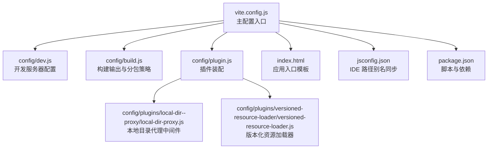
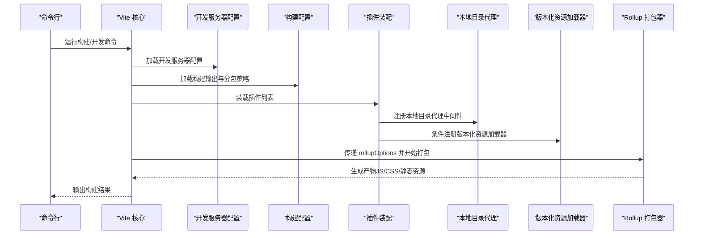
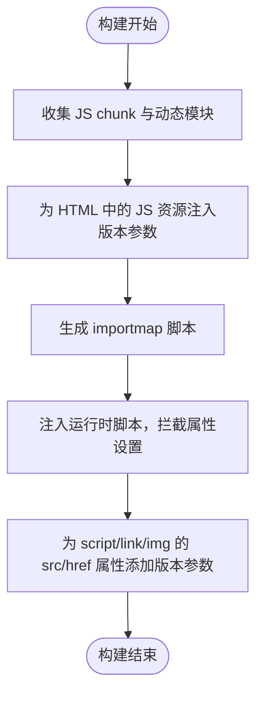
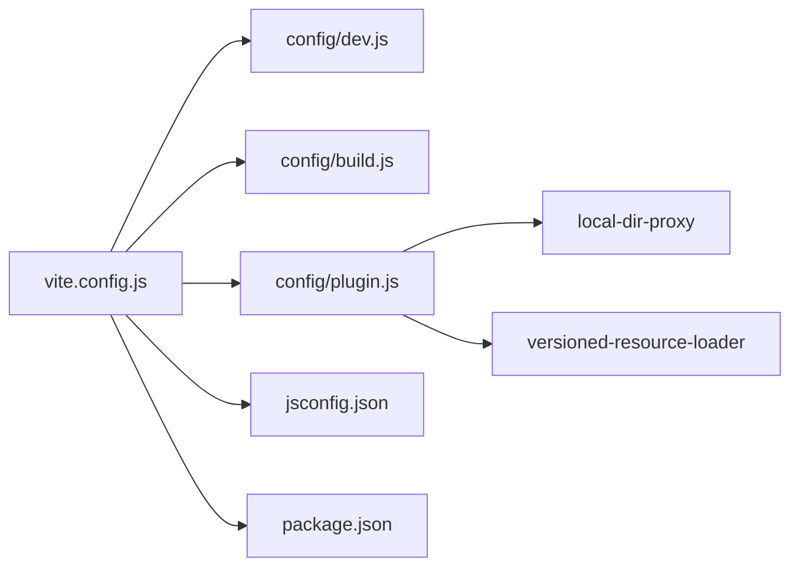

# 构建配置

<cite>
**本文引用的文件**
- [vite.config.js](file://vite.config.js)
- [config/build.js](file://config/build.js)
- [config/dev.js](file://config/dev.js)
- [config/plugin.js](file://config/plugin.js)
- [config/plugins/local-dir--proxy/local-dir-proxy.js](file://config/plugins/local-dir--proxy/local-dir-proxy.js)
- [config/plugins/versioned-resource-loader/versioned-resource-loader.js](file://config/plugins/versioned-resource-loader/versioned-resource-loader.js)
- [package.json](file://package.json)
- [index.html](file://index.html)
- [jsconfig.json](file://jsconfig.json)
</cite>

## 目录
1. [简介](#简介)
2. [项目结构](#项目结构)
3. [核心组件](#核心组件)
4. [架构总览](#架构总览)
5. [详细组件分析](#详细组件分析)
6. [依赖关系分析](#依赖关系分析)
7. [性能考量](#性能考量)
8. [故障排查指南](#故障排查指南)
9. [结论](#结论)
10. [附录](#附录)

## 简介
本文件系统性梳理 FS-AOI-WEB 的 Vite 构建配置，重点覆盖以下方面：
- 基础路径与别名配置
- CSS 预处理器与 PostCSS 插件
- ESBuild 优化设置
- 开发模式与生产模式差异
- 构建模式选择（hash 模式 vs 版本模式）及影响
- 静态资源路径处理与插件体系
- 构建优化策略与最佳实践
- 常见问题与排错建议

## 项目结构
该工程采用 Vite 作为构建工具，通过单一入口配置文件集中管理开发服务器、构建参数、插件与 CSS 配置；同时将构建策略拆分为独立模块，便于在不同模式下灵活组合。

图表来源
- [vite.config.js](file://vite.config.js#L1-L80)
- [config/dev.js](file://config/dev.js#L1-L39)
- [config/build.js](file://config/build.js#L1-L104)
- [config/plugin.js](file://config/plugin.js#L1-L17)
- [config/plugins/local-dir--proxy/local-dir-proxy.js](file://config/plugins/local-dir--proxy/local-dir-proxy.js#L1-L39)
- [config/plugins/versioned-resource-loader/versioned-resource-loader.js](file://config/plugins/versioned-resource-loader/versioned-resource-loader.js#L1-L193)
- [index.html](file://index.html#L1-L32)
- [jsconfig.json](file://jsconfig.json#L1-L21)
- [package.json](file://package.json#L1-L61)

章节来源
- [vite.config.js](file://vite.config.js#L1-L80)
- [config/dev.js](file://config/dev.js#L1-L39)
- [config/build.js](file://config/build.js#L1-L104)
- [config/plugin.js](file://config/plugin.js#L1-L17)
- [config/plugins/local-dir--proxy/local-dir-proxy.js](file://config/plugins/local-dir--proxy/local-dir-proxy.js#L1-L39)
- [config/plugins/versioned-resource-loader/versioned-resource-loader.js](file://config/plugins/versioned-resource-loader/versioned-resource-loader.js#L1-L193)
- [index.html](file://index.html#L1-L32)
- [jsconfig.json](file://jsconfig.json#L1-L21)
- [package.json](file://package.json#L1-L61)

## 核心组件
- 基础路径与别名
  - 基础路径 base 固定为相对路径 "./"，确保产物在任意子路径部署时可正确解析。
  - 别名通过 resolve.alias 统一映射到 src 子目录，包含 @、@assets、@config、@pages、@portal、@hooks、@static 等，提升导入一致性与可维护性。
  - @static 动态指向 public/static 或 static，以适配开发与生产环境。
- CSS 预处理器与后处理
  - SCSS 使用 modern 编译 API，并注入全局变量模块，减少重复引入。
  - PostCSS 移除 charset 规则，避免重复字符集声明带来的兼容性问题。
- ESBuild 优化
  - 自动移除代码中的 console 与 debugger，降低生产体积与调试信息泄露风险。
- 插件体系
  - Vue SFC 支持、本地目录代理中间件、生产环境下按版本注入资源加载器。
- 构建策略
  - 通过 BUILD_MODE 控制 hash 模式或版本模式，结合 APP_VERSION 注入版本参数，实现强缓存与精准失效控制。

章节来源
- [vite.config.js](file://vite.config.js#L31-L78)
- [config/build.js](file://config/build.js#L32-L103)
- [config/plugin.js](file://config/plugin.js#L1-L17)

## 架构总览
下图展示从命令执行到构建产物的关键流程，以及各配置模块之间的协作关系。

图表来源
- [vite.config.js](file://vite.config.js#L14-L78)
- [config/dev.js](file://config/dev.js#L4-L37)
- [config/build.js](file://config/build.js#L32-L103)
- [config/plugin.js](file://config/plugin.js#L5-L14)
- [config/plugins/local-dir--proxy/local-dir-proxy.js](file://config/plugins/local-dir--proxy/local-dir-proxy.js#L4-L37)
- [config/plugins/versioned-resource-loader/versioned-resource-loader.js](file://config/plugins/versioned-resource-loader/versioned-resource-loader.js#L34-L190)

## 详细组件分析

### 基础路径与别名配置
- 基础路径 base: "./"，保证在子路径部署时资源路径正确解析。
- 别名 alias：
  - @ 指向 src
  - @assets 指向 src/assets
  - @config 指向 src/config
  - @pages 指向 src/pages
  - @portal 指向 src/portal
  - @hooks 指向 src/portal/hooks
  - @static 指向 public/static（生产）或 static（开发），用于指向静态资源目录
- preserveSymlinks：根据 npm 用户代理判断是否保留符号链接，解决某些包管理器下的依赖解析问题。

章节来源
- [vite.config.js](file://vite.config.js#L31-L51)

### CSS 预处理器与 PostCSS
- SCSS 配置
  - 使用 modern 编译 API，提升兼容性与性能
  - additionalData 注入全局变量模块，统一主题与变量
  - 关闭 charset，避免重复字符集规则
- PostCSS 插件
  - 自定义 internal:charset-removal 插件，移除 @charset 规则，确保样式文件无重复字符集声明

章节来源
- [vite.config.js](file://vite.config.js#L55-L77)

### ESBuild 优化设置
- 自动移除 console 与 debugger，降低生产体积与调试信息泄露风险
- 适用于生产构建，有助于减小最终包体并提升加载速度

章节来源
- [vite.config.js](file://vite.config.js#L38)

### 开发模式配置
- 端口与主机：端口 8080，host 允许外部访问
- 代理规则：
  - /copweb、/uasweb、/idmweb 代理至静态资源服务器
  - /api 代理至后端网关，并在请求头中注入 X-Real-IP
- 本地目录代理中间件：
  - 当代理目标为本地绝对路径时，优先读取本地文件并返回，若不存在则返回 404
  - 用于联调时直接读取本地静态资源，无需远程网络

章节来源
- [config/dev.js](file://config/dev.js#L4-L37)
- [config/plugins/local-dir--proxy/local-dir-proxy.js](file://config/plugins/local-dir--proxy/local-dir-proxy.js#L4-L37)

### 生产模式构建策略
- 构建模式选择
  - hash 模式：通过 SHAKE256 的部分输出对文件名进行短哈希，便于缓存与增量更新
  - 版本模式：通过 APP_VERSION 注入版本参数，配合版本化资源加载器实现精确失效控制
- 构建输出命名
  - 入口 JS：index.[hash].js 或 index.js
  - 静态资源：static/vendors/[文件名][.hash].[扩展名]
  - CSS：按文件名或 Vue 单文件样式规则命名
  - 异步 chunk：按包名与层级结构生成目录，便于按需加载
- 分包策略
  - 识别异步依赖包（如 echarts、highlight.js、xgplayer、xlsx 等）并输出到 dependence 目录
  - 自定义包名映射（注释区预留）可进一步精细化分包
  - 业务源码按 pages 结构保留目录结构并对文件名做哈希处理，src/ 其余代码归入统一框架分组

章节来源
- [vite.config.js](file://vite.config.js#L14-L29)
- [config/build.js](file://config/build.js#L32-L103)

### 插件系统配置
- 插件装配
  - Vue SFC 支持
  - 本地目录代理中间件（仅开发 serve）
  - 版本化资源加载器（仅生产且非 hash 模式）
- 版本化资源加载器工作原理
  - 在 generateBundle 阶段收集 JS chunk 与动态模块路径
  - 在 transformIndexHtml 阶段为静态与动态 JS 资源追加版本查询参数
  - 注入运行时脚本，拦截元素属性设置，自动为 src/href/src 属性添加版本参数
  - 通过 importmap 与运行时补丁，确保跨域与协议跳过策略生效

图表来源
- [config/plugin.js](file://config/plugin.js#L5-L14)
- [config/plugins/versioned-resource-loader/versioned-resource-loader.js](file://config/plugins/versioned-resource-loader/versioned-resource-loader.js#L34-L190)

章节来源
- [config/plugin.js](file://config/plugin.js#L1-L17)
- [config/plugins/versioned-resource-loader/versioned-resource-loader.js](file://config/plugins/versioned-resource-loader/versioned-resource-loader.js#L1-L193)

### 静态资源路径处理
- @static 别名在开发与生产环境分别指向 static 与 public/static，确保开发时可直接访问静态资源
- 本地目录代理中间件优先读取本地文件，若不存在则回退到代理目标
- index.html 中的静态资源引用遵循 base: "./"，确保在子路径部署时仍能正确加载

章节来源
- [vite.config.js](file://vite.config.js#L7-L12)
- [vite.config.js](file://vite.config.js#L49)
- [config/plugins/local-dir--proxy/local-dir-proxy.js](file://config/plugins/local-dir--proxy/local-dir-proxy.js#L25-L34)
- [index.html](file://index.html#L9-L29)

## 依赖关系分析
- Vite 主配置依赖开发服务器、构建策略与插件装配
- 插件装配依赖本地目录代理与版本化资源加载器
- 构建策略依赖 BUILD_MODE 与 APP_VERSION 环境变量
- IDE 路径别名与 jsconfig.json 保持一致，提升开发体验

图表来源
- [vite.config.js](file://vite.config.js#L1-L80)
- [config/dev.js](file://config/dev.js#L1-L39)
- [config/build.js](file://config/build.js#L1-L104)
- [config/plugin.js](file://config/plugin.js#L1-L17)
- [config/plugins/local-dir--proxy/local-dir-proxy.js](file://config/plugins/local-dir--proxy/local-dir-proxy.js#L1-L39)
- [config/plugins/versioned-resource-loader/versioned-resource-loader.js](file://config/plugins/versioned-resource-loader/versioned-resource-loader.js#L1-L193)
- [jsconfig.json](file://jsconfig.json#L1-L21)
- [package.json](file://package.json#L1-L61)

章节来源
- [vite.config.js](file://vite.config.js#L1-L80)
- [config/plugin.js](file://config/plugin.js#L1-L17)
- [config/plugins/local-dir--proxy/local-dir-proxy.js](file://config/plugins/local-dir--proxy/local-dir-proxy.js#L1-L39)
- [config/plugins/versioned-resource-loader/versioned-resource-loader.js](file://config/plugins/versioned-resource-loader/versioned-resource-loader.js#L1-L193)
- [jsconfig.json](file://jsconfig.json#L1-L21)
- [package.json](file://package.json#L1-L61)

## 性能考量
- 代码压缩与清理
  - ESBuild 自动移除 console 与 debugger，减少生产体积
- 资源命名策略
  - hash 模式：短哈希文件名，利于浏览器缓存与增量更新
  - 版本模式：通过版本参数实现精确失效控制，适合 CDN 缓存场景
- 分包与懒加载
  - 将大体量第三方库拆分到独立目录，按需加载，降低首屏体积
- CSS 与 PostCSS
  - 移除 charset 规则，避免重复声明带来的体积与兼容性问题
- 开发体验
  - 代理与本地目录代理中间件减少网络往返，提升联调效率

[本节为通用性能建议，不直接分析具体文件]

## 故障排查指南
- 构建模式错误
  - 版本模式必须提供 APP_VERSION 环境变量，否则构建会直接退出并提示示例命令
  - 建议使用 cross-env 设置环境变量，确保跨平台兼容
- 本地静态资源 404
  - 检查本地目录代理的 target 是否为本地绝对路径且文件存在
  - 若 target 为 HTTP 地址，则不会走本地读取逻辑
- 资源未注入版本参数
  - 确认当前为生产模式且非 hash 模式
  - 确认 includeGlobs 正确匹配到动态加载的页面文件
- 路径解析异常
  - 确保 base: "./" 与 @static 别名指向正确的静态资源目录
  - 检查 jsconfig.json 的路径别名与实际目录结构一致

章节来源
- [vite.config.js](file://vite.config.js#L14-L29)
- [config/dev.js](file://config/dev.js#L10-L35)
- [config/plugins/local-dir--proxy/local-dir-proxy.js](file://config/plugins/local-dir--proxy/local-dir-proxy.js#L21-L34)
- [config/plugin.js](file://config/plugin.js#L8-L13)
- [config/plugins/versioned-resource-loader/versioned-resource-loader.js](file://config/plugins/versioned-resource-loader/versioned-resource-loader.js#L19-L29)

## 结论
本项目通过 Vite 实现了高度可配置的构建体系：以单一入口集中管理开发与构建配置，借助插件系统实现本地资源代理与版本化资源加载；通过灵活的构建模式（hash/版本）与精细的分包策略，兼顾缓存友好与按需加载需求。配合 CSS 预处理与 PostCSS 清理，整体构建产物具备良好的可维护性与性能表现。

[本节为总结性内容，不直接分析具体文件]

## 附录

### 构建模式选择与影响
- hash 模式
  - 文件名包含短哈希，适合 CDN 缓存与快速增量更新
  - 不注入版本参数，资源路径稳定
- 版本模式
  - 通过 APP_VERSION 注入版本参数，实现精确失效控制
  - 适用于需要严格缓存策略与版本追踪的场景

章节来源
- [vite.config.js](file://vite.config.js#L14-L29)
- [config/build.js](file://config/build.js#L3-L5)
- [config/plugin.js](file://config/plugin.js#L8-L13)
- [config/plugins/versioned-resource-loader/versioned-resource-loader.js](file://config/plugins/versioned-resource-loader/versioned-resource-loader.js#L12-L15)

### 最佳实践清单
- 明确区分开发与生产环境的代理策略，必要时启用本地目录代理
- 在生产环境中优先使用版本模式，确保缓存与失效可控
- 保持 jsconfig.json 与 Vite 别名一致，提升 IDE 与团队协作体验
- 对第三方库进行合理分包，避免单个包过大影响首屏性能
- 定期清理不必要的 console 与调试语句，利用 ESBuild 自动移除

[本节为通用建议，不直接分析具体文件]