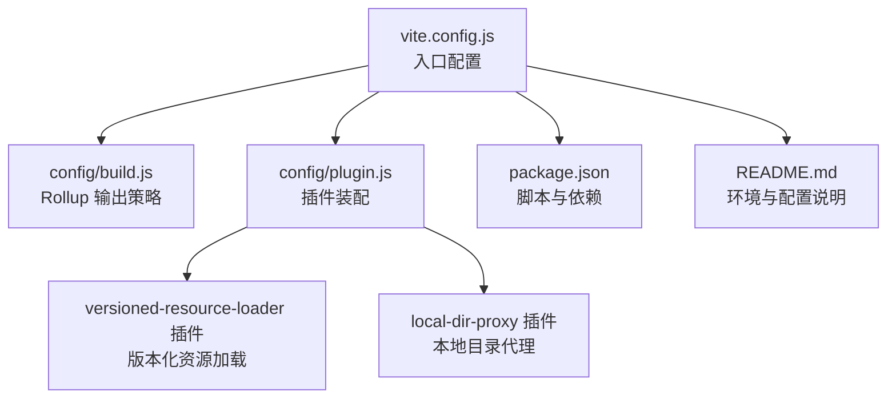
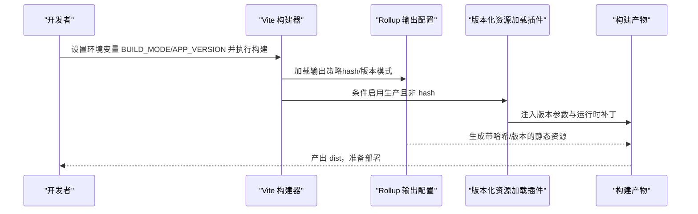
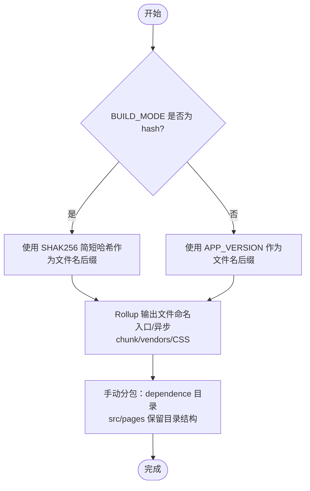
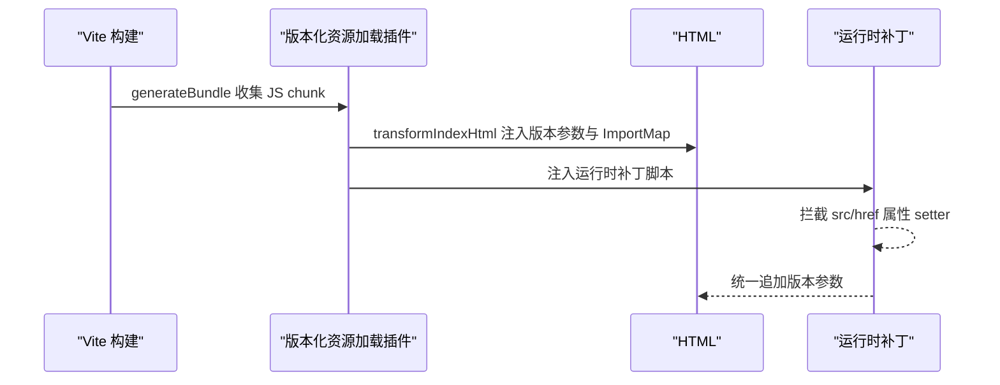
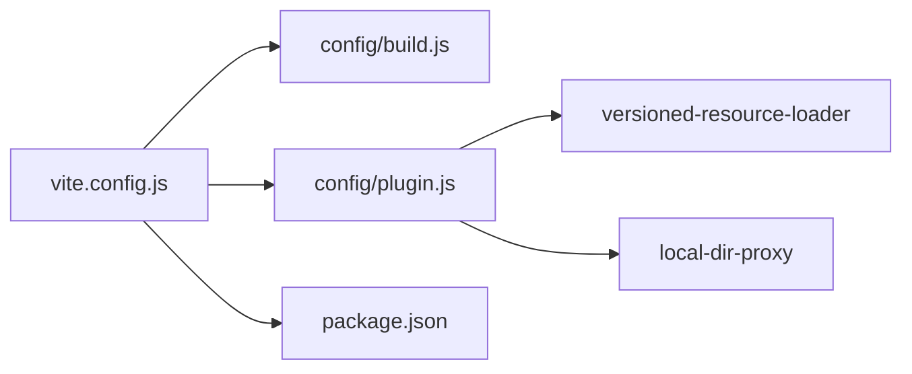

# 生产构建

<cite>
**本文引用的文件**
- [package.json](file://package.json)
- [vite.config.js](file://vite.config.js)
- [config/build.js](file://config/build.js)
- [config/plugin.js](file://config/plugin.js)
- [config/plugins/versioned-resource-loader/versioned-resource-loader.js](file://config/plugins/versioned-resource-loader/versioned-resource-loader.js)
- [config/plugins/local-dir--proxy/local-dir-proxy.js](file://config/plugins/local-dir--proxy/local-dir-proxy.js)
- [README.md](file://README.md)
</cite>

## 目录
1. [简介](#简介)
2. [项目结构](#项目结构)
3. [核心组件](#核心组件)
4. [架构总览](#架构总览)
5. [详细组件分析](#详细组件分析)
6. [依赖关系分析](#依赖关系分析)
7. [性能考量](#性能考量)
8. [故障排查指南](#故障排查指南)
9. [结论](#结论)
10. [附录](#附录)

## 简介
本文件面向 FS-AOI-WEB 的生产构建，系统性阐述构建模式选择（hash 模式 vs 版本模式）、产物命名与缓存策略、代码压缩与混淆、构建产物分析与优化、以及部署准备与质量保障。通过明确的环境变量配置、Rollup 输出规则与自定义插件机制，确保构建产物具备强缓存能力与可追踪性，满足生产环境对稳定性与性能的要求。

## 项目结构
FS-AOI-WEB 使用 Vite 作为构建工具，采用“按需拆分 + 自定义命名”的 Rollup 输出策略，并通过自定义插件在生产环境下注入版本化资源加载逻辑，以实现强缓存与灰度/回滚控制。

图表来源
- [vite.config.js](file://vite.config.js#L1-L80)
- [config/build.js](file://config/build.js#L1-L104)
- [config/plugin.js](file://config/plugin.js#L1-L17)
- [config/plugins/versioned-resource-loader/versioned-resource-loader.js](file://config/plugins/versioned-resource-loader/versioned-resource-loader.js#L1-L193)
- [config/plugins/local-dir--proxy/local-dir-proxy.js](file://config/plugins/local-dir--proxy/local-dir-proxy.js#L1-L39)
- [package.json](file://package.json#L1-L61)
- [README.md](file://README.md#L1-L55)

章节来源
- [vite.config.js](file://vite.config.js#L1-L80)
- [config/build.js](file://config/build.js#L1-L104)
- [config/plugin.js](file://config/plugin.js#L1-L17)
- [config/plugins/versioned-resource-loader/versioned-resource-loader.js](file://config/plugins/versioned-resource-loader/versioned-resource-loader.js#L1-L193)
- [config/plugins/local-dir--proxy/local-dir-proxy.js](file://config/plugins/local-dir--proxy/local-dir-proxy.js#L1-L39)
- [package.json](file://package.json#L1-L61)
- [README.md](file://README.md#L1-L55)

## 核心组件
- 构建入口与模式判定
  - 通过环境变量 BUILD_MODE 切换构建模式；hash 模式用于快速迭代，版本模式用于生产发布。
  - 版本模式要求提供 APP_VERSION，否则构建直接失败并给出示例命令。
- Rollup 输出策略
  - 统一 base: './'，适配多级目录部署。
  - 动态生成文件名：入口、异步 chunk、第三方 vendors 与 CSS，均支持 hash 或版本号后缀。
  - 手动分包策略：将大体积依赖拆分为独立目录，提升缓存命中率。
- 版本化资源加载插件
  - 在生产且非 hash 模式下启用，自动为 HTML 中的 JS/CSS 与打包产物追加版本查询参数，同时注入运行时补丁，拦截静态资源 src/href 属性，统一注入版本参数。
- 本地目录代理插件
  - 仅在 serve 模式生效，支持将特定前缀路由代理到本地文件系统，便于联调静态资源。

章节来源
- [vite.config.js](file://vite.config.js#L14-L29)
- [config/build.js](file://config/build.js#L32-L103)
- [config/plugin.js](file://config/plugin.js#L5-L14)
- [config/plugins/versioned-resource-loader/versioned-resource-loader.js](file://config/plugins/versioned-resource-loader/versioned-resource-loader.js#L34-L190)
- [config/plugins/local-dir--proxy/local-dir-proxy.js](file://config/plugins/local-dir--proxy/local-dir-proxy.js#L4-L38)

## 架构总览
下图展示生产构建的关键流程：模式判定 → 插件装配 → Rollup 输出 → 版本化资源注入。

图表来源
- [vite.config.js](file://vite.config.js#L14-L29)
- [config/build.js](file://config/build.js#L32-L103)
- [config/plugin.js](file://config/plugin.js#L5-L14)
- [config/plugins/versioned-resource-loader/versioned-resource-loader.js](file://config/plugins/versioned-resource-loader/versioned-resource-loader.js#L34-L190)

## 详细组件分析

### 构建模式与环境变量
- 模式选择
  - BUILD_MODE=hash：产物不带版本号，适合快速迭代与本地预览。
  - 默认（未设置或非 hash）：进入“版本模式”，必须提供 APP_VERSION，否则构建失败。
- 环境变量示例
  - 使用 cross-env 设置 APP_VERSION 后执行构建脚本。
- 行为差异
  - hash 模式：Rollup 输出文件名不带版本后缀；版本化资源插件不注入。
  - 版本模式：Rollup 输出文件名带版本后缀；插件注入版本参数与运行时补丁。

章节来源
- [vite.config.js](file://vite.config.js#L14-L29)
- [config/plugin.js](file://config/plugin.js#L8-L13)

### Rollup 输出策略与命名规则
- 基础配置
  - base: './'，适配多级目录部署。
  - sourcemap: true，便于定位问题。
- 文件命名
  - 入口文件：入口名 + hash 或版本后缀。
  - 异步 chunk：按包名拆分至 dependence 目录，文件名含 hash 或版本后缀。
  - 第三方 vendors：vendors 目录下，CSS 与 JS 分离命名，CSS 保留部分原始命名特征。
  - CSS：除特殊 Vue 样式外，其余 CSS 文件名含 hash 或版本后缀。
- 手动分包
  - 将大体积依赖（如 echarts、highlight.js、xgplayer 等）拆分为独立目录，提升缓存命中率。
  - 对 src/pages 下的页面资源，保留目录结构并对文件名做 hash 处理，避免缓存污染。

图表来源
- [config/build.js](file://config/build.js#L1-L104)

章节来源
- [config/build.js](file://config/build.js#L32-L103)

### 版本化资源加载插件（生产专用）
- 启用条件
  - 仅在生产环境且 BUILD_MODE 非 hash 时启用。
  - 从 includeGlobs 收集动态模块，从打包产物收集 JS chunk，统一注入版本参数。
- HTML 注入
  - 替换 <script src="*.js"> 与 <link rel="modulepreload" href="*.js"> 的链接，追加版本查询参数。
- 运行时补丁
  - 注入脚本，拦截 HTMLScriptElement/HTMLLinkElement/HTMLImageElement 的 src/href 属性 setter，统一追加版本参数。
  - 通过 ImportMap 注入 JS 模块映射，确保动态加载模块也携带版本参数。
- 版本参数
  - 参数名与值经清洗与编码，避免非法字符与协议跳过。

图表来源
- [config/plugin.js](file://config/plugin.js#L5-L14)
- [config/plugins/versioned-resource-loader/versioned-resource-loader.js](file://config/plugins/versioned-resource-loader/versioned-resource-loader.js#L34-L190)

章节来源
- [config/plugin.js](file://config/plugin.js#L5-L14)
- [config/plugins/versioned-resource-loader/versioned-resource-loader.js](file://config/plugins/versioned-resource-loader/versioned-resource-loader.js#L34-L190)

### 本地目录代理插件（开发专用）
- 适用场景
  - 仅在 serve 模式生效，将特定前缀路由代理到本地文件系统，便于联调静态资源。
- 核心逻辑
  - 解析路径前缀，拼接本地绝对路径，若存在则直接流式返回，否则返回 404。

章节来源
- [config/plugins/local-dir--proxy/local-dir-proxy.js](file://config/plugins/local-dir--proxy/local-dir-proxy.js#L4-L38)

## 依赖关系分析
- 构建链路
  - vite.config.js 作为入口，加载 config/build.js 与 config/plugin.js。
  - config/plugin.js 条件装配版本化资源加载插件与本地目录代理插件。
  - config/build.js 提供 Rollup 输出策略与手动分包规则。
- 外部依赖
  - Vite、Rollup、PostCSS、Vue 插件等由 package.json 管理。
  - 构建脚本通过 cross-env 设置环境变量。

图表来源
- [vite.config.js](file://vite.config.js#L1-L80)
- [config/build.js](file://config/build.js#L1-L104)
- [config/plugin.js](file://config/plugin.js#L1-L17)
- [package.json](file://package.json#L1-L61)

章节来源
- [vite.config.js](file://vite.config.js#L1-L80)
- [config/build.js](file://config/build.js#L1-L104)
- [config/plugin.js](file://config/plugin.js#L1-L17)
- [package.json](file://package.json#L1-L61)

## 性能考量
- 缓存策略
  - hash 模式：文件名含短哈希，适合频繁变更的资源；但无法跨版本持久缓存。
  - 版本模式：文件名含 APP_VERSION，强缓存可控，利于灰度与回滚。
- 产物体积
  - 通过 manualChunks 将大依赖拆分至独立目录，减少单文件体积，提升缓存命中。
- 资源加载
  - 版本化插件确保动态加载模块与静态资源均携带版本参数，避免缓存污染。
- Source Map
  - 生产环境开启 sourcemap，便于问题定位与回溯。

章节来源
- [config/build.js](file://config/build.js#L32-L103)
- [config/plugins/versioned-resource-loader/versioned-resource-loader.js](file://config/plugins/versioned-resource-loader/versioned-resource-loader.js#L34-L190)

## 故障排查指南
- 构建失败：未设置 APP_VERSION
  - 现象：构建直接退出并打印错误信息。
  - 处理：使用 cross-env 正确设置 APP_VERSION 后再次构建。
- 本地资源 404
  - 现象：本地目录代理返回 404。
  - 排查：确认 target 路径是否存在、文件是否可读、路径解码是否正确。
- 版本参数未生效
  - 现象：动态资源未携带版本参数。
  - 排查：确认插件启用条件、includeGlobs 是否包含目标模块、运行时补丁是否注入。

章节来源
- [vite.config.js](file://vite.config.js#L19-L28)
- [config/plugins/local-dir--proxy/local-dir-proxy.js](file://config/plugins/local-dir--proxy/local-dir-proxy.js#L25-L34)
- [config/plugin.js](file://config/plugin.js#L8-L13)
- [config/plugins/versioned-resource-loader/versioned-resource-loader.js](file://config/plugins/versioned-resource-loader/versioned-resource-loader.js#L113-L187)

## 结论
FS-AOI-WEB 的生产构建通过“版本模式 + 手动分包 + 版本化资源加载”形成完整的缓存与可追踪体系。hash 模式适用于开发阶段，版本模式则满足生产环境的强缓存与灰度需求。配合合理的 Rollup 输出策略与插件机制，可在保证性能的同时提升可维护性与可观测性。

## 附录
- 构建命令与环境变量
  - 使用 cross-env 设置 APP_VERSION 后执行构建脚本。
- 开发与生产差异
  - 开发：启用本地目录代理插件，便于联调静态资源。
  - 生产：根据 BUILD_MODE 决定是否启用版本化资源加载插件与文件名后缀策略。

章节来源
- [package.json](file://package.json#L6-L12)
- [vite.config.js](file://vite.config.js#L14-L29)
- [config/plugin.js](file://config/plugin.js#L5-L14)
- [README.md](file://README.md#L44-L55)