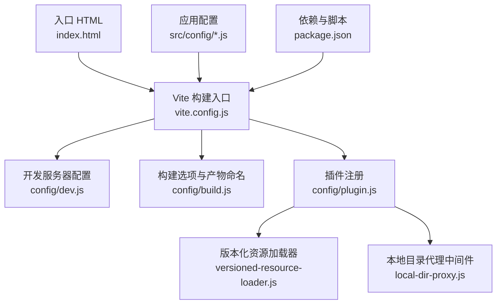
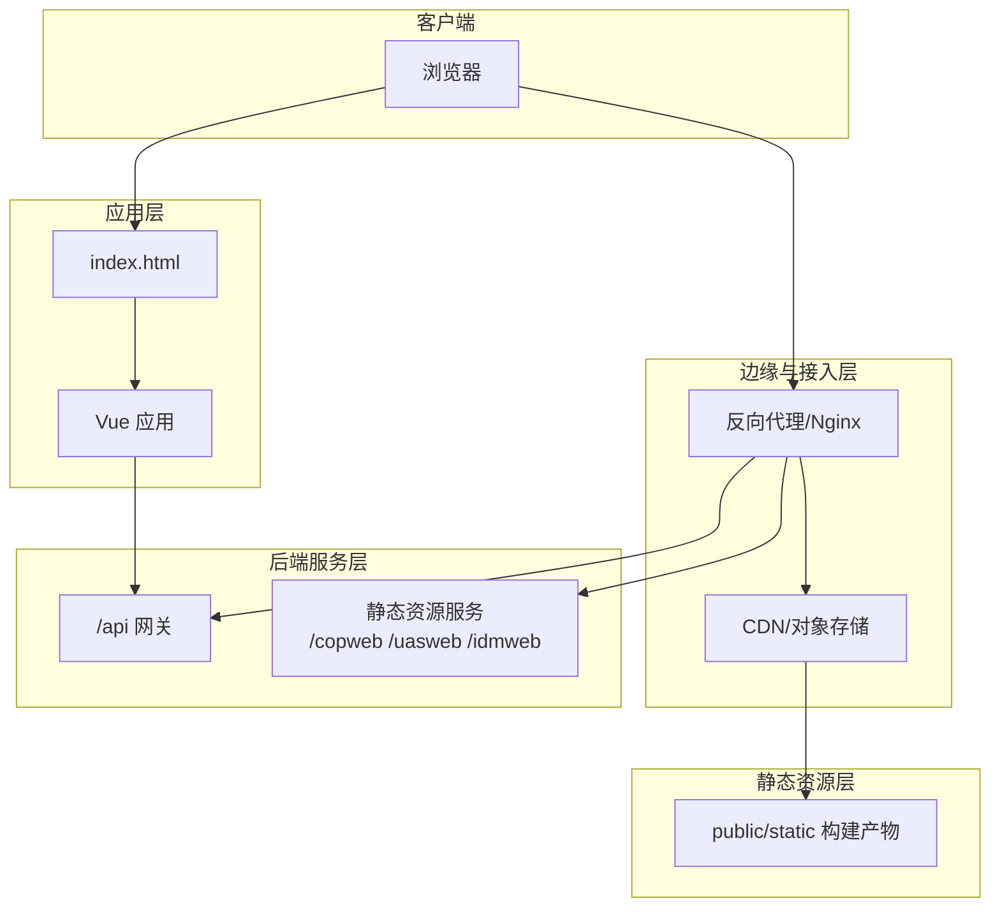
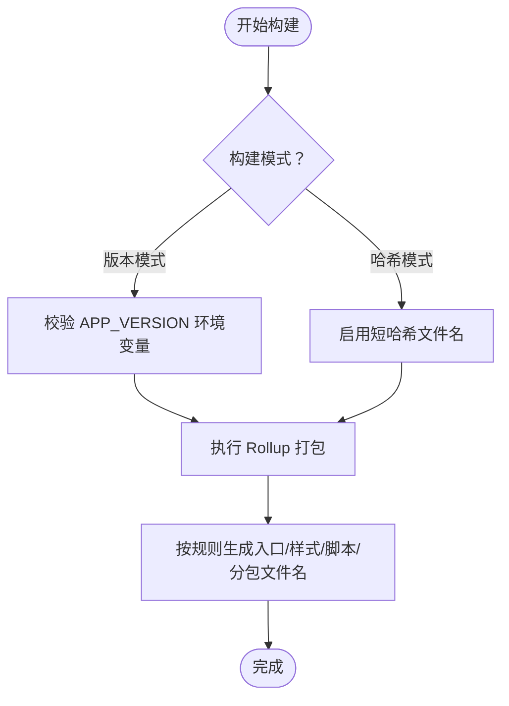
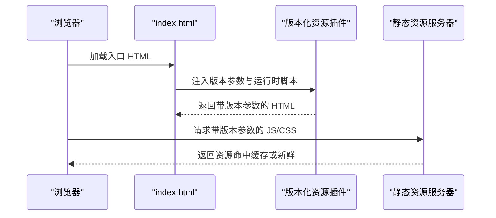
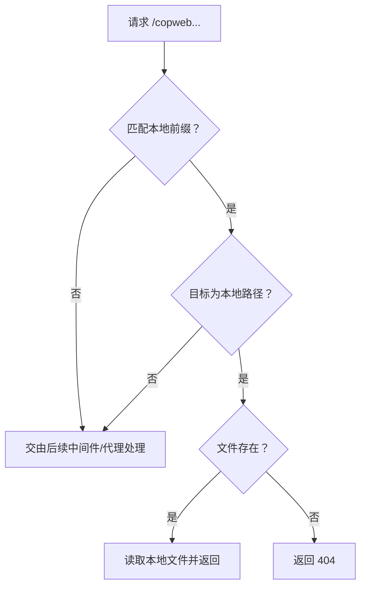
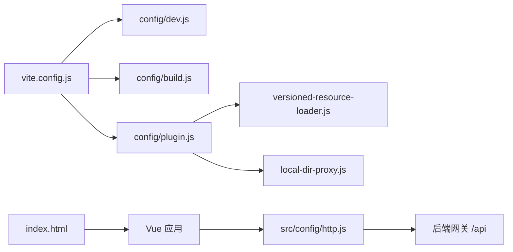

# 部署指南

<cite>
**本文引用的文件**
- [package.json](file://package.json)
- [vite.config.js](file://vite.config.js)
- [config/build.js](file://config/build.js)
- [config/dev.js](file://config/dev.js)
- [config/plugin.js](file://config/plugin.js)
- [config/plugins/versioned-resource-loader/versioned-resource-loader.js](file://config/plugins/versioned-resource-loader/versioned-resource-loader.js)
- [config/plugins/local-dir--proxy/local-dir-proxy.js](file://config/plugins/local-dir--proxy/local-dir-proxy.js)
- [index.html](file://index.html)
- [README.md](file://README.md)
- [src/config/webapp.js](file://src/config/webapp.js)
- [src/config/http.js](file://src/config/http.js)
- [src/config/services.js](file://src/config/services.js)
</cite>

## 目录
1. [简介](#简介)
2. [项目结构](#项目结构)
3. [核心组件](#核心组件)
4. [架构总览](#架构总览)
5. [详细组件分析](#详细组件分析)
6. [依赖关系分析](#依赖关系分析)
7. [性能考量](#性能考量)
8. [故障排查指南](#故障排查指南)
9. [结论](#结论)
10. [附录](#附录)

## 简介
本指南面向 FS-AOI-WEB 的部署团队与运维人员，覆盖多环境部署策略（开发、测试、预发布、生产）、静态资源服务与反向代理、容器化与 Kubernetes 部署、CDN 缓存与版本化资源、负载均衡、部署前后检查与回滚策略、安全配置与性能监控等。文档基于仓库内现有配置与构建脚本进行说明，确保可操作性与一致性。

## 项目结构
FS-AOI-WEB 是基于 Vite 的前端工程，采用 Vue 3 技术栈，通过 Vite 进行开发与构建，产物输出至 public/static 目录，供静态 Web 服务器或 CDN 提供服务。关键目录与文件如下：
- 构建与开发配置：vite.config.js、config/dev.js、config/build.js、config/plugin.js
- 版本化资源插件：config/plugins/versioned-resource-loader/versioned-resource-loader.js
- 本地目录代理中间件：config/plugins/local-dir--proxy/local-dir-proxy.js
- 应用配置：src/config/webapp.js、src/config/http.js、src/config/services.js
- 入口页面：index.html
- 依赖与脚本：package.json
- 开发与部署说明：README.md

图表来源
- [vite.config.js](file://vite.config.js#L1-L80)
- [config/dev.js](file://config/dev.js#L1-L39)
- [config/build.js](file://config/build.js#L1-L104)
- [config/plugin.js](file://config/plugin.js#L1-L17)
- [config/plugins/versioned-resource-loader/versioned-resource-loader.js](file://config/plugins/versioned-resource-loader/versioned-resource-loader.js#L1-L193)
- [config/plugins/local-dir--proxy/local-dir-proxy.js](file://config/plugins/local-dir--proxy/local-dir-proxy.js#L1-L39)
- [index.html](file://index.html#L1-L32)
- [package.json](file://package.json#L1-L61)

章节来源
- [vite.config.js](file://vite.config.js#L1-L80)
- [config/build.js](file://config/build.js#L1-L104)
- [config/dev.js](file://config/dev.js#L1-L39)
- [config/plugin.js](file://config/plugin.js#L1-L17)
- [config/plugins/versioned-resource-loader/versioned-resource-loader.js](file://config/plugins/versioned-resource-loader/versioned-resource-loader.js#L1-L193)
- [config/plugins/local-dir--proxy/local-dir-proxy.js](file://config/plugins/local-dir--proxy/local-dir-proxy.js#L1-L39)
- [index.html](file://index.html#L1-L32)
- [package.json](file://package.json#L1-L61)

## 核心组件
- 构建与产物组织
  - Vite 构建模式支持两种：哈希模式与版本模式。版本模式需提供 APP_VERSION 环境变量；哈希模式下文件名包含短哈希，便于缓存控制。
  - 产物命名规则：入口、CSS、JS、异步分包等均按规则生成，支持按包与页面结构进行手动分包。
- 版本化资源加载器
  - 在生产且非哈希模式下启用，为 HTML 中的 JS/CSS 与动态模块注入版本参数，实现强缓存与精准更新。
- 本地目录代理中间件
  - 将特定前缀的请求（如 /copweb、/uasweb、/idmweb）映射到本地目录，便于开发联调静态资源。
- 应用配置
  - 门户、菜单、iframe 打开策略、主题、高亮主题等配置集中管理。
  - HTTP 层配置包含错误处理、会话与加密开关、请求头扩展等。

章节来源
- [vite.config.js](file://vite.config.js#L14-L30)
- [config/build.js](file://config/build.js#L32-L103)
- [config/plugin.js](file://config/plugin.js#L8-L13)
- [config/plugins/versioned-resource-loader/versioned-resource-loader.js](file://config/plugins/versioned-resource-loader/versioned-resource-loader.js#L3-L193)
- [config/plugins/local-dir--proxy/local-dir-proxy.js](file://config/plugins/local-dir--proxy/local-dir-proxy.js#L4-L38)
- [src/config/webapp.js](file://src/config/webapp.js#L1-L254)
- [src/config/http.js](file://src/config/http.js#L1-L124)

## 架构总览
FS-AOI-WEB 的部署架构分为三层：
- 前端静态层：Vite 构建产物（public/static），由 Nginx 或 CDN 提供静态服务。
- 应用层：Vue 应用通过入口 HTML 初始化，按需加载模块与资源。
- 后端服务层：通过反向代理转发 /api 至后端网关，静态资源前缀（如 /copweb、/uasweb、/idmweb）可指向后端或本地目录。

图表来源
- [index.html](file://index.html#L1-L32)
- [config/dev.js](file://config/dev.js#L9-L36)
- [config/plugin.js](file://config/plugin.js#L1-L17)

## 详细组件分析

### 构建与产物组织（Vite + Rollup）
- 构建模式
  - 版本模式：要求提供 APP_VERSION 环境变量，产物文件名不含哈希，但通过版本参数实现更新控制。
  - 哈希模式：文件名包含短哈希，适合 CDN 强缓存策略。
- 产物命名与分包
  - 入口、CSS、JS、异步分包均有独立命名规则；异步第三方库按包拆分到 dependence 子目录，便于缓存与更新。
- 代码剔除
  - 生产构建移除 console 与 debugger，减少体积与调试信息泄露风险。

图表来源
- [vite.config.js](file://vite.config.js#L14-L29)
- [config/build.js](file://config/build.js#L32-L103)

章节来源
- [vite.config.js](file://vite.config.js#L14-L29)
- [config/build.js](file://config/build.js#L32-L103)

### 版本化资源加载器（生产强缓存与精准更新）
- 功能要点
  - 为 HTML 中的 script、modulepreload 等注入版本参数；动态模块与输出 JS chunk 也统一追加版本参数。
  - 通过运行时脚本拦截元素属性设置，确保运行时加载的资源也带有版本参数。
- 使用场景
  - 生产环境启用，避免缓存导致的版本陈旧；开发环境禁用，便于快速迭代。

图表来源
- [config/plugin.js](file://config/plugin.js#L8-L13)
- [config/plugins/versioned-resource-loader/versioned-resource-loader.js](file://config/plugins/versioned-resource-loader/versioned-resource-loader.js#L71-L190)

章节来源
- [config/plugin.js](file://config/plugin.js#L8-L13)
- [config/plugins/versioned-resource-loader/versioned-resource-loader.js](file://config/plugins/versioned-resource-loader/versioned-resource-loader.js#L3-L193)

### 本地目录代理中间件（开发联调）
- 功能要点
  - 将 /copweb、/uasweb、/idmweb 前缀请求映射到本地目录，若目标为本地路径且文件存在则直接读取返回，否则返回 404。
- 使用场景
  - 本地联调静态资源，无需启动额外静态服务器。

图表来源
- [config/plugins/local-dir--proxy/local-dir-proxy.js](file://config/plugins/local-dir--proxy/local-dir-proxy.js#L8-L36)

章节来源
- [config/plugins/local-dir--proxy/local-dir-proxy.js](file://config/plugins/local-dir--proxy/local-dir-proxy.js#L4-L38)

### 应用配置与运行时行为
- 门户与菜单
  - 菜单字段映射、菜单过滤、记忆与自动关闭父菜单等配置集中管理。
- iframe 打开策略
  - 支持根据菜单类型与 BASE_PATH 动态拼接 URL，兼容 KONE 环境。
- HTTP 配置
  - 成功码、错误处理、会话过期处理、请求头扩展、加密开关等。
- 服务接口号映射
  - 门户、菜单、字典、系统参数等接口号集中维护。

章节来源
- [src/config/webapp.js](file://src/config/webapp.js#L1-L254)
- [src/config/http.js](file://src/config/http.js#L1-L124)
- [src/config/services.js](file://src/config/services.js#L1-L28)

## 依赖关系分析
- 构建链路
  - vite.config.js 导入 dev/build/plugin 配置，按 NODE_ENV 与 BUILD_MODE 决定行为。
  - 插件在生产启用版本化资源加载器，开发启用本地目录代理中间件。
- 运行链路
  - index.html 作为入口，加载初始脚本与应用；应用通过 HTTP 配置访问后端接口；静态资源通过反向代理或 CDN 提供。

图表来源
- [vite.config.js](file://vite.config.js#L3-L5)
- [config/plugin.js](file://config/plugin.js#L1-L17)
- [config/plugins/versioned-resource-loader/versioned-resource-loader.js](file://config/plugins/versioned-resource-loader/versioned-resource-loader.js#L1-L193)
- [config/plugins/local-dir--proxy/local-dir-proxy.js](file://config/plugins/local-dir--proxy/local-dir-proxy.js#L1-L39)
- [index.html](file://index.html#L1-L32)
- [src/config/http.js](file://src/config/http.js#L1-L124)

章节来源
- [vite.config.js](file://vite.config.js#L3-L5)
- [config/plugin.js](file://config/plugin.js#L1-L17)

## 性能考量
- 缓存策略
  - 版本模式：通过版本参数实现“不可变缓存”，CDN/浏览器可长期缓存；更新时更换版本参数。
  - 哈希模式：文件名包含短哈希，适合 CDN 强缓存与滚动更新。
- 分包与懒加载
  - 异步第三方库按包拆分，降低首屏体积；页面级资源按目录结构生成稳定文件名，利于缓存命中。
- 构建优化
  - 移除 console 与 debugger，减小体积并降低调试信息泄露风险。
- 静态资源服务
  - 使用 Nginx 提供 gzip/br 压缩、缓存头设置与 HTTPS；CDN 可进一步提升全球访问性能。

章节来源
- [config/build.js](file://config/build.js#L32-L103)
- [vite.config.js](file://vite.config.js#L38-L38)

## 故障排查指南
- 构建阶段
  - 版本模式缺少 APP_VERSION：构建会报错并提示示例命令；请在构建命令中设置 APP_VERSION。
  - 产物文件名异常：检查 BUILD_MODE 与 APP_VERSION 设置，确认是否符合预期。
- 开发阶段
  - 本地静态资源 404：确认 local-dir-proxy 的 target 路径是否存在且为文件；检查前缀是否匹配 /copweb、/uasweb、/idmweb。
  - 代理转发问题：检查 config/dev.js 中 /api 与静态资源前缀代理配置，确认目标地址与 changeOrigin 设置。
- 运行阶段
  - 资源版本陈旧：确认生产环境启用版本化资源加载器，且浏览器未强制刷新；检查版本参数是否随版本更新。
  - 接口错误：查看 HTTP 配置中的错误处理与会话过期处理逻辑，确认后端返回码与前端拦截策略一致。

章节来源
- [vite.config.js](file://vite.config.js#L15-L29)
- [config/plugins/local-dir--proxy/local-dir-proxy.js](file://config/plugins/local-dir--proxy/local-dir-proxy.js#L25-L34)
- [config/dev.js](file://config/dev.js#L9-L36)
- [config/plugin.js](file://config/plugin.js#L8-L13)
- [src/config/http.js](file://src/config/http.js#L6-L25)

## 结论
FS-AOI-WEB 的部署以 Vite 构建为核心，结合版本化资源加载器与本地开发代理中间件，形成从开发到生产的完整闭环。通过合理的缓存策略、分包与压缩配置，可在保证更新可控的同时获得良好的用户体验。建议在生产环境优先采用版本模式并配合 CDN，同时完善反向代理与安全配置，确保稳定性与安全性。

## 附录

### 多环境部署策略
- 开发环境
  - 使用 Vite 开发服务器，端口与代理在 config/dev.js 中配置；本地静态资源可通过 local-dir-proxy 直接读取。
- 测试/预发布/生产环境
  - 使用版本模式构建并提供 APP_VERSION；通过 Nginx 或 CDN 提供静态资源；/api 请求经反向代理转发至后端网关。

章节来源
- [config/dev.js](file://config/dev.js#L4-L37)
- [vite.config.js](file://vite.config.js#L14-L29)

### Nginx 配置要点（示意）
- 静态资源服务
  - 根路径指向 public/static；设置 expires、gzip/br、ETag/Last-Modified。
- 反向代理
  - /api 转发至后端网关；/copweb、/uasweb、/idmweb 可转发至静态资源或本地目录（开发）。
- 安全与性能
  - 启用 HTTPS、HSTS、CSP；开启缓存与压缩；限制上传大小与速率。

### 容器化与 Kubernetes 部署
- 容器镜像
  - 基于 Nginx 镜像，将 public/static 作为静态站点根目录；或使用 Node/PM2 运行静态服务。
- Kubernetes
  - 使用 Deployment + Service + Ingress；Ingress 配置 TLS 与缓存头；HPA 根据 CPU/内存或 QPS 扩缩容。
  - ConfigMap/Secret 管理环境变量（如 APP_VERSION、BUILD_MODE）与后端网关地址。

### CDN 集成与缓存策略
- 版本模式：通过版本参数实现“不可变缓存”；更新时更换版本参数。
- 哈希模式：文件名包含短哈希，适合 CDN 强缓存与滚动更新。
- 缓存头：静态资源设置长缓存，HTML 设置较短缓存或 no-cache。

### 负载均衡与高可用
- 多副本部署：前端多副本并行，结合 CDN 与就近调度。
- 健康检查：暴露健康探针，结合滚动更新与就绪探针。
- 灰度发布：通过 Ingress 规则或 CDN 策略逐步放量。

### 部署前检查清单
- 环境变量
  - 生产构建：设置 APP_VERSION；选择 BUILD_MODE（版本/哈希）。
- 代理与网关
  - /api 与静态资源前缀代理正确；目标地址可达。
- 缓存与版本
  - 版本化资源加载器启用状态与版本参数一致。
- 安全
  - HTTPS、CSP、X-Frame-Options、X-Content-Type-Options 等头部配置。

### 部署后验证步骤
- 页面加载
  - 首屏加载正常，无 404/403；控制台无明显错误。
- 资源版本
  - JS/CSS 带版本参数；更新后版本参数变化。
- 接口连通
  - /api 请求成功；错误提示按配置显示。
- 缓存效果
  - 静态资源命中率高；更新后能及时获取新版本。

### 回滚策略
- 快速回滚
  - 切换 CDN/反向代理指向上一版本构建目录；或回退 Docker 镜像标签。
- 版本回退
  - 版本模式：将 APP_VERSION 回退至上一版本；重新构建并发布。
- 渐进回滚
  - 通过 Ingress/CDN 策略逐步回退流量，观察指标后再全量回滚。

### 安全配置与合规
- 配置建议
  - 启用 HTTPS 与 HSTS；设置 CSP；限制嵌套与点击劫持；最小权限原则管理密钥与凭据。
- 日志与审计
  - 记录访问日志与错误日志；定期审计敏感信息与异常请求。

### 性能监控与运维最佳实践
- 监控指标
  - 页面加载时延、首屏时间、TTFB、缓存命中率、错误率、响应时间。
- 运维最佳实践
  - 滚动更新与灰度发布；自动化测试与发布流水线；变更评审与应急预案。