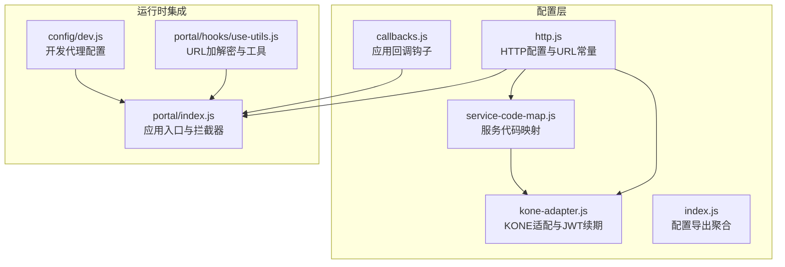
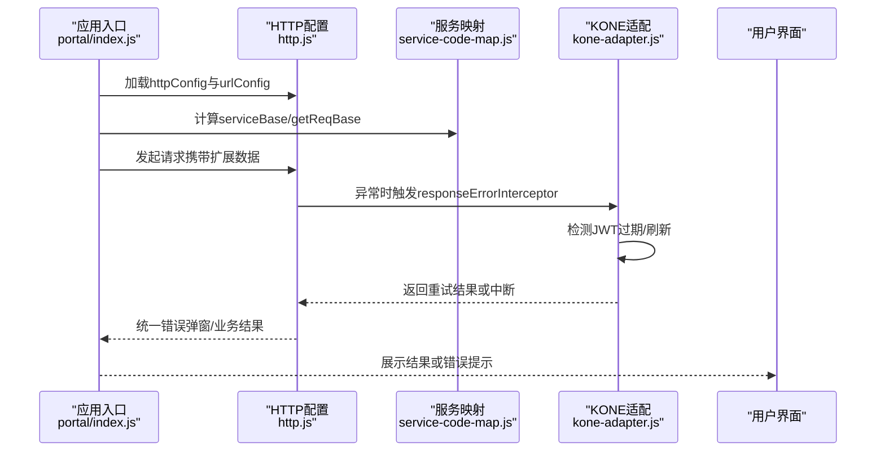
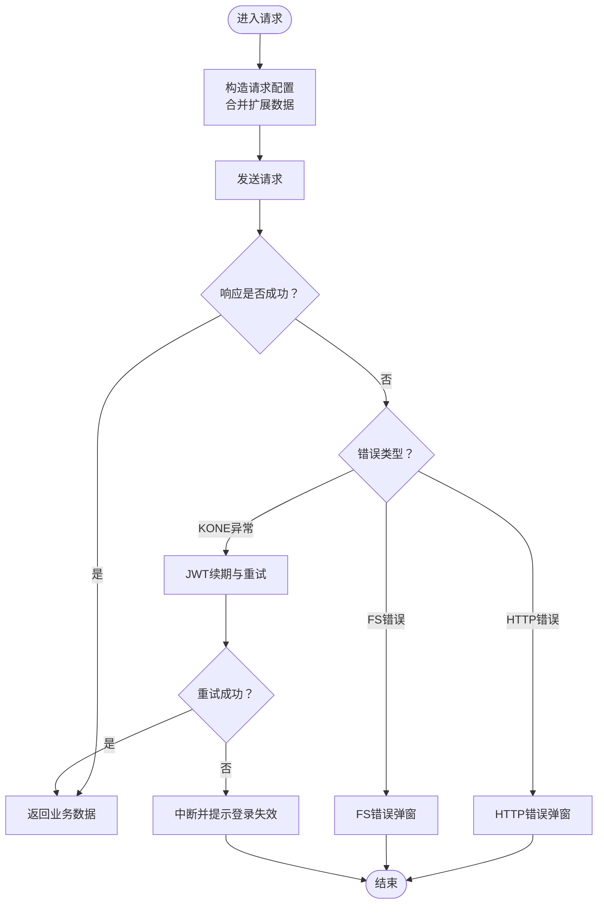
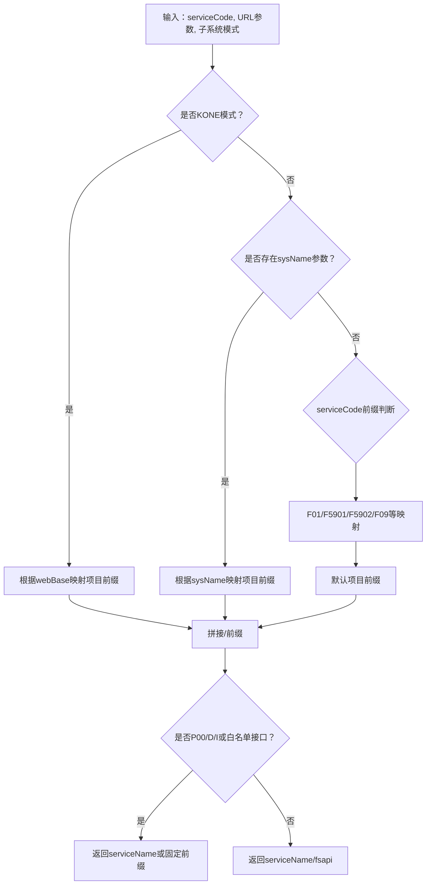
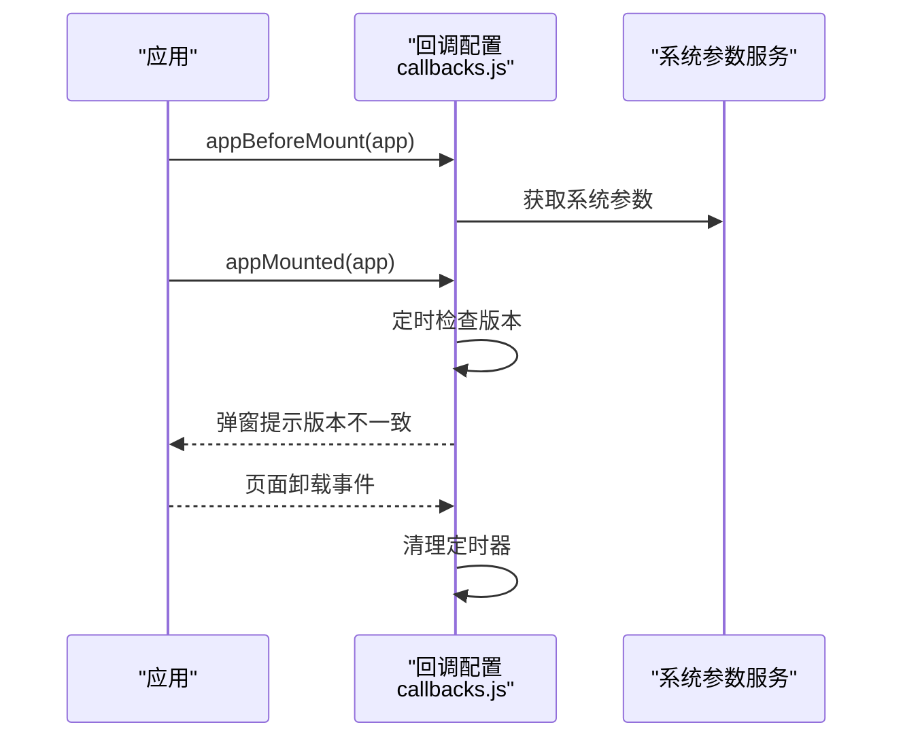
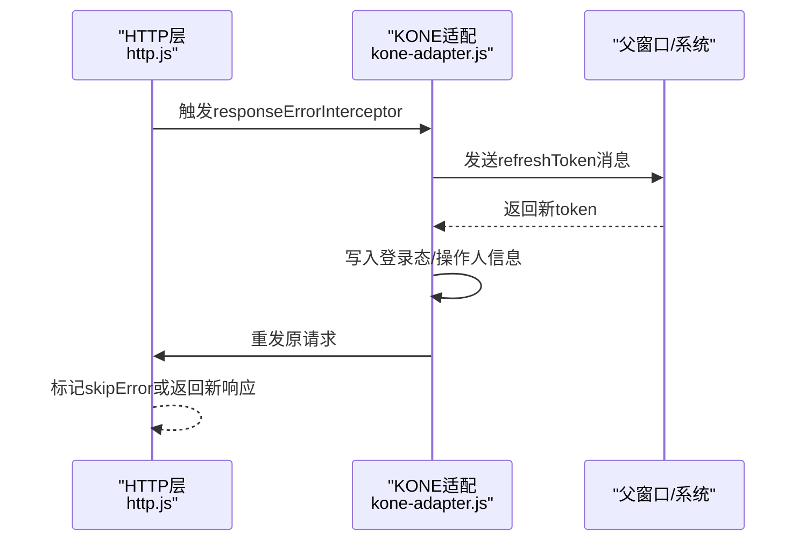
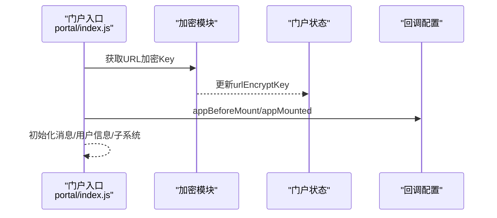
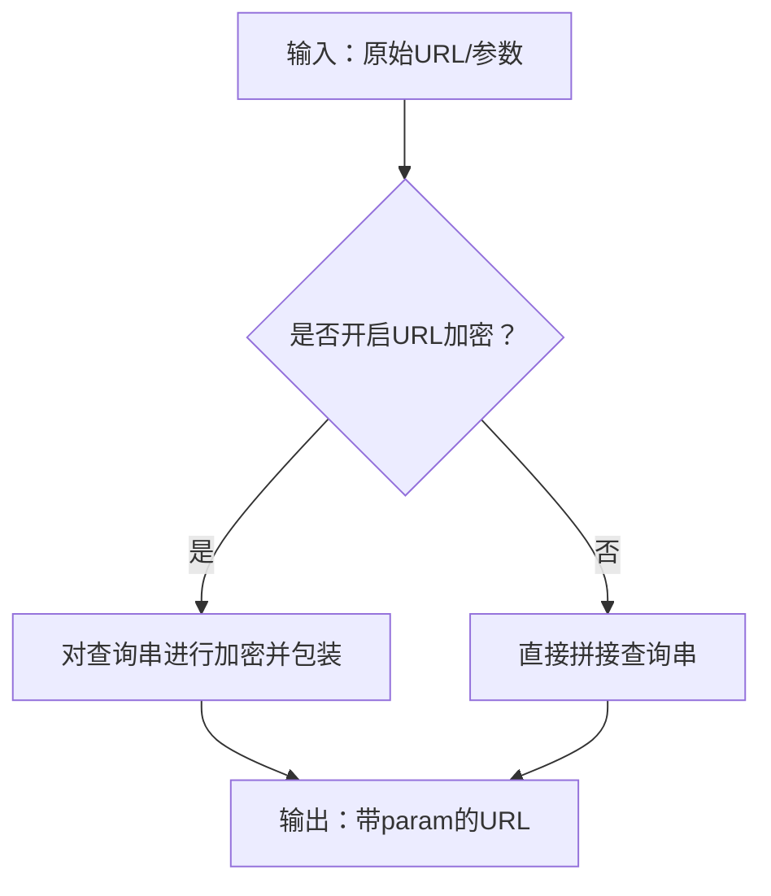
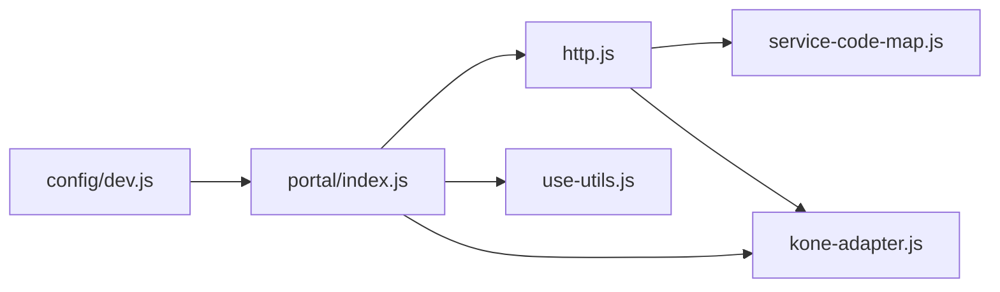

# HTTP配置

<cite>
**本文引用的文件**
- [src/config/http.js](file://src/config/http.js)
- [src/config/callbacks.js](file://src/config/callbacks.js)
- [src/config/service-code-map.js](file://src/config/service-code-map.js)
- [src/config/kone-adapter.js](file://src/config/kone-adapter.js)
- [src/config/index.js](file://src/config/index.js)
- [src/portal/index.js](file://src/portal/index.js)
- [src/portal/hooks/use-utils.js](file://src/portal/hooks/use-utils.js)
- [src/config/services.js](file://src/config/services.js)
- [config/dev.js](file://config/dev.js)
</cite>

## 目录
1. [简介](#简介)
2. [项目结构](#项目结构)
3. [核心组件](#核心组件)
4. [架构总览](#架构总览)
5. [详细组件分析](#详细组件分析)
6. [依赖关系分析](#依赖关系分析)
7. [性能考量](#性能考量)
8. [故障排查指南](#故障排查指南)
9. [结论](#结论)
10. [附录](#附录)

## 简介
本文件面向FS-AOI-WEB的HTTP配置模块，系统性梳理http.js中的HTTP请求配置、callbacks.js中的回调函数配置、以及service-code-map.js中的服务代码映射机制。重点覆盖以下方面：
- HTTP请求配置：请求拦截器、响应处理、错误处理、生命周期与中间件机制
- 回调函数配置：应用挂载前后、版本校验、门户激活等钩子
- 服务代码映射：基于URL参数、子系统模式与服务编码的服务前缀推导
- 异常处理策略：KONE子系统下的JWT续期与重试、通用错误弹窗
- 最佳实践、性能优化建议与常见问题解决方案
- 具体配置示例与使用场景

## 项目结构
HTTP配置相关的核心文件位于src/config目录，配合portal入口与工具模块共同构成完整的HTTP配置体系。

**图表来源**
- [src/config/http.js](file://src/config/http.js#L1-L124)
- [src/config/service-code-map.js](file://src/config/service-code-map.js#L1-L129)
- [src/config/callbacks.js](file://src/config/callbacks.js#L1-L54)
- [src/config/kone-adapter.js](file://src/config/kone-adapter.js#L1-L248)
- [src/config/index.js](file://src/config/index.js#L1-L8)
- [src/portal/index.js](file://src/portal/index.js#L1-L152)
- [src/portal/hooks/use-utils.js](file://src/portal/hooks/use-utils.js#L1-L330)
- [config/dev.js](file://config/dev.js#L1-L38)

**章节来源**
- [src/config/http.js](file://src/config/http.js#L1-L124)
- [src/config/service-code-map.js](file://src/config/service-code-map.js#L1-L129)
- [src/config/callbacks.js](file://src/config/callbacks.js#L1-L54)
- [src/config/kone-adapter.js](file://src/config/kone-adapter.js#L1-L248)
- [src/config/index.js](file://src/config/index.js#L1-L8)
- [src/portal/index.js](file://src/portal/index.js#L1-L152)
- [src/portal/hooks/use-utils.js](file://src/portal/hooks/use-utils.js#L1-L330)
- [config/dev.js](file://config/dev.js#L1-L38)

## 核心组件
- HTTP配置中心（http.js）
  - 成功码判定、服务基础路径、加密开关、错误处理器、请求扩展数据、Axios默认配置
  - KONE子系统下的响应异常拦截器（JWT续期与重试）
  - 常用URL常量（会话、认证、用户、上传下载等）
- 服务代码映射（service-code-map.js）
  - 基于URL参数、子系统模式、服务编码推导请求前缀
  - 支持多项目/多子系统的差异化前缀
- 回调函数配置（callbacks.js）
  - 应用挂载前缓存初始化、版本校验与轮询、默认激活门户、同步数据处理
- KONE适配（kone-adapter.js）
  - 子系统检测、消息通道、JWT刷新、重发请求、系统状态与时间获取
- 门户入口与拦截器（portal/index.js）
  - 应用生命周期回调、service请求拦截器、URL加密Key获取
- URL工具（use-utils.js）
  - URL参数加解密、URL解析与构建、菜单链接格式化

**章节来源**
- [src/config/http.js](file://src/config/http.js#L27-L124)
- [src/config/service-code-map.js](file://src/config/service-code-map.js#L24-L128)
- [src/config/callbacks.js](file://src/config/callbacks.js#L4-L53)
- [src/config/kone-adapter.js](file://src/config/kone-adapter.js#L11-L162)
- [src/portal/index.js](file://src/portal/index.js#L109-L150)
- [src/portal/hooks/use-utils.js](file://src/portal/hooks/use-utils.js#L6-L34)

## 架构总览
下图展示了HTTP配置在系统中的关键交互路径：应用入口加载配置与回调，请求通过HTTP配置与服务映射生成最终URL，KONE适配在异常时进行JWT续期与重试，错误处理统一弹窗提示。

**图表来源**
- [src/portal/index.js](file://src/portal/index.js#L1-L152)
- [src/config/http.js](file://src/config/http.js#L27-L85)
- [src/config/service-code-map.js](file://src/config/service-code-map.js#L24-L128)
- [src/config/kone-adapter.js](file://src/config/kone-adapter.js#L124-L162)

## 详细组件分析

### HTTP配置（http.js）深度解析
- 成功码与错误处理
  - successCodes：用于判定FS服务返回是否成功的MSG_CODE集合
  - errorConfig.messageHandler：统一错误弹窗处理器，支持traceId追踪
- 服务基础路径与请求扩展
  - serviceBase：动态计算服务前缀（结合服务编码与子系统）
  - reqCommDataExtend：从路由query扩展菜单上下文（菜单ID/名称）
- KONE子系统拦截器
  - responseErrorInterceptor：在KONE模式下拦截响应异常，执行JWT刷新与重试
- Axios默认配置
  - axiosConfig：可设置baseURL、headers、timeout等（当前保留注释便于扩展）

**图表来源**
- [src/config/http.js](file://src/config/http.js#L6-L25)
- [src/config/http.js](file://src/config/http.js#L43-L45)
- [src/config/kone-adapter.js](file://src/config/kone-adapter.js#L124-L162)

**章节来源**
- [src/config/http.js](file://src/config/http.js#L27-L85)
- [src/config/http.js](file://src/config/http.js#L100-L124)

### 服务代码映射（service-code-map.js）
- getReqBase：根据URL参数、子系统模式、服务编码推导项目级请求前缀
- getServiceBase：在getReqBase基础上追加/fsapi或特定服务前缀，支持特殊接口白名单
- getKidmServiceBase：影像相关接口固定前缀
- 与UAS模块的映射合并，确保跨模块服务编码一致性

**图表来源**
- [src/config/service-code-map.js](file://src/config/service-code-map.js#L24-L128)

**章节来源**
- [src/config/service-code-map.js](file://src/config/service-code-map.js#L1-L129)

### 回调函数配置（callbacks.js）
- appBeforeMount：应用挂载前初始化系统参数缓存
- appMounted：版本校验与定时轮询，监听页面卸载清理定时器
- defaultActivePortal：自定义默认激活门户（预留）
- handleSyncData：数据同步处理（预留）
- 版本校验：对比前端版本与后端版本，不一致时弹窗提示

**图表来源**
- [src/config/callbacks.js](file://src/config/callbacks.js#L4-L46)

**章节来源**
- [src/config/callbacks.js](file://src/config/callbacks.js#L1-L54)

### KONE适配与JWT续期（kone-adapter.js）
- isInKone：检测是否处于KONE子系统模式
- handleKjdpToken：接收来自kjdp的刷新令牌消息并回执
- refreshToken：向后端请求新令牌，更新登录态与操作人信息
- responseErrorInterceptor增强：拦截JWT相关错误，执行刷新与重发，否则中断并提示登录失效

**图表来源**
- [src/config/kone-adapter.js](file://src/config/kone-adapter.js#L124-L162)
- [src/config/http.js](file://src/config/http.js#L43-L45)

**章节来源**
- [src/config/kone-adapter.js](file://src/config/kone-adapter.js#L1-L248)

### 门户入口与拦截器（portal/index.js）
- appBeforeMount：获取URL加密Key、初始化消息与用户信息、检查子系统模式、执行回调
- appMounted：初始化favicon与主题、执行回调
- serviceInterceptors：service请求拦截器（预留扩展点）

**图表来源**
- [src/portal/index.js](file://src/portal/index.js#L109-L150)

**章节来源**
- [src/portal/index.js](file://src/portal/index.js#L1-L152)

### URL加解密与工具（use-utils.js）
- encryptUrlParam/decryptUrlParam：对URL参数进行DES加解密
- parseUrl/buildUrl：解析与构建URL，支持加密参数自动解密
- formatUrl：根据菜单配置格式化链接，注入BUSI_CODE与菜单ID等

**图表来源**
- [src/portal/hooks/use-utils.js](file://src/portal/hooks/use-utils.js#L6-L34)
- [src/portal/hooks/use-utils.js](file://src/portal/hooks/use-utils.js#L100-L173)

**章节来源**
- [src/portal/hooks/use-utils.js](file://src/portal/hooks/use-utils.js#L1-L330)

## 依赖关系分析
- http.js依赖service-code-map.js提供的服务前缀推导，并在KONE模式下依赖kone-adapter.js的拦截器
- portal/index.js聚合配置与回调，负责应用生命周期与拦截器注册
- use-utils.js与portal/store协作实现URL加密Key的获取与更新
- config/dev.js提供开发代理配置，便于联调

**图表来源**
- [src/config/http.js](file://src/config/http.js#L1-L124)
- [src/config/service-code-map.js](file://src/config/service-code-map.js#L1-L129)
- [src/config/kone-adapter.js](file://src/config/kone-adapter.js#L1-L248)
- [src/portal/index.js](file://src/portal/index.js#L1-L152)
- [src/portal/hooks/use-utils.js](file://src/portal/hooks/use-utils.js#L1-L330)
- [config/dev.js](file://config/dev.js#L1-L38)

**章节来源**
- [src/config/index.js](file://src/config/index.js#L1-L8)

## 性能考量
- 请求超时与序列化
  - axiosConfig可配置timeout与paramsSerializer，避免长链路阻塞与参数体积过大
- 动态加密与密钥更新
  - fsDynamicEncrypt与dynamicKeyUpdateTime可用于降低密钥泄露风险，但需权衡重加密开销
- 错误处理与弹窗
  - 统一错误弹窗减少重复处理逻辑，但应避免在高频错误场景下造成UI抖动
- URL加密
  - 在高并发场景下，建议对敏感参数采用服务端签名而非纯加密，以减少前端计算压力

[本节为通用指导，无需具体文件分析]

## 故障排查指南
- 会话过期/认证失效
  - 现象：KONE模式下出现“会话或认证过期，请重新登录”
  - 处理：检查responseErrorInterceptor是否生效；确认JWT刷新流程与父窗口消息通道
- 错误弹窗缺失或异常
  - 现象：请求失败无提示或提示不完整
  - 处理：核对errorConfig.messageHandler与traceId提取逻辑
- 服务前缀错误
  - 现象：请求404或跨项目访问失败
  - 处理：检查getReqBase与getServiceBase的分支条件，确认URL参数与子系统模式
- URL参数异常
  - 现象：菜单链接参数丢失或乱码
  - 处理：确认buildUrl/parseUrl与encryptUrlParam/decryptUrlParam的配合

**章节来源**
- [src/config/kone-adapter.js](file://src/config/kone-adapter.js#L124-L162)
- [src/config/http.js](file://src/config/http.js#L6-L25)
- [src/config/service-code-map.js](file://src/config/service-code-map.js#L24-L128)
- [src/portal/hooks/use-utils.js](file://src/portal/hooks/use-utils.js#L6-L34)

## 结论
FS-AOI-WEB的HTTP配置模块通过清晰的职责划分与可插拔的适配层，实现了：
- 统一的请求配置与错误处理
- 基于多维度规则的服务前缀推导
- KONE子系统下的JWT续期与重试机制
- 应用生命周期回调与URL加解密工具的协同
建议在生产环境中启用必要的安全与性能配置，并结合监控与日志完善异常追踪能力。

[本节为总结性内容，无需具体文件分析]

## 附录

### 配置项速查表
- http.js
  - successCodes：业务成功码集合
  - serviceBase：服务基础路径函数
  - fsEncrypt：请求是否加密
  - responseErrorInterceptor：响应异常拦截器（KONE模式）
  - errorConfig.messageHandler：错误弹窗处理器
  - reqCommDataExtend：扩展请求数据
  - axiosConfig：Axios默认配置
- service-code-map.js
  - getReqBase：项目级请求前缀
  - getServiceBase：服务前缀（含/fsapi）
  - getKidmServiceBase：影像服务前缀
- callbacks.js
  - appBeforeMount/appMounted：应用生命周期回调
  - defaultActivePortal/handleSyncData：门户与数据处理预留
- kone-adapter.js
  - isInKone：子系统检测
  - refreshToken：JWT刷新
  - koneRefreshTokenHandler：异常拦截与重试

**章节来源**
- [src/config/http.js](file://src/config/http.js#L27-L85)
- [src/config/service-code-map.js](file://src/config/service-code-map.js#L24-L128)
- [src/config/callbacks.js](file://src/config/callbacks.js#L4-L53)
- [src/config/kone-adapter.js](file://src/config/kone-adapter.js#L11-L162)