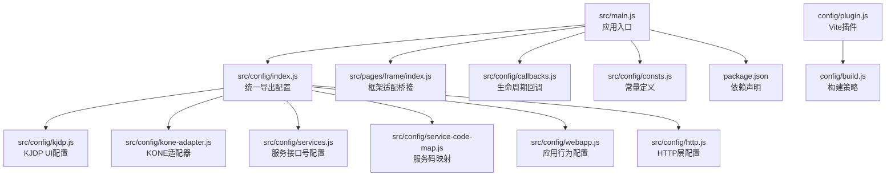
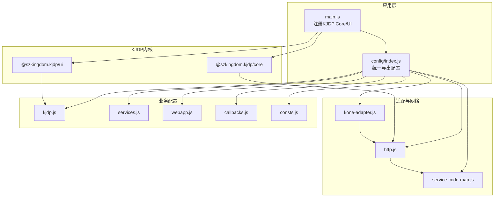
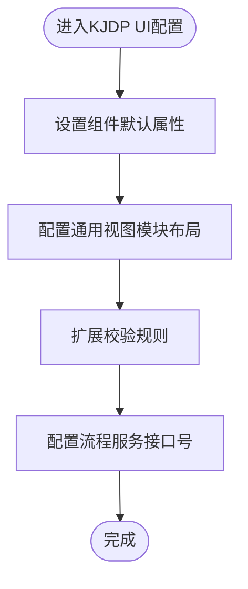
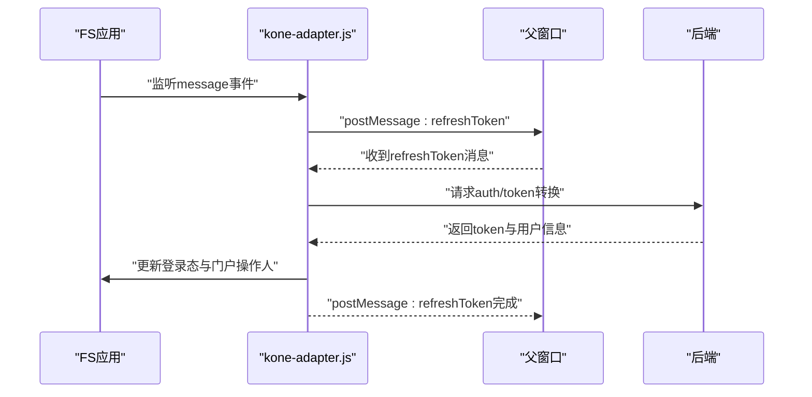
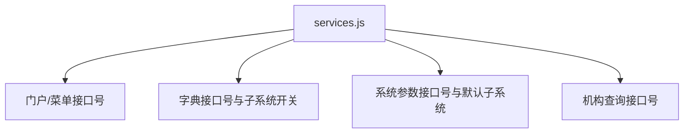
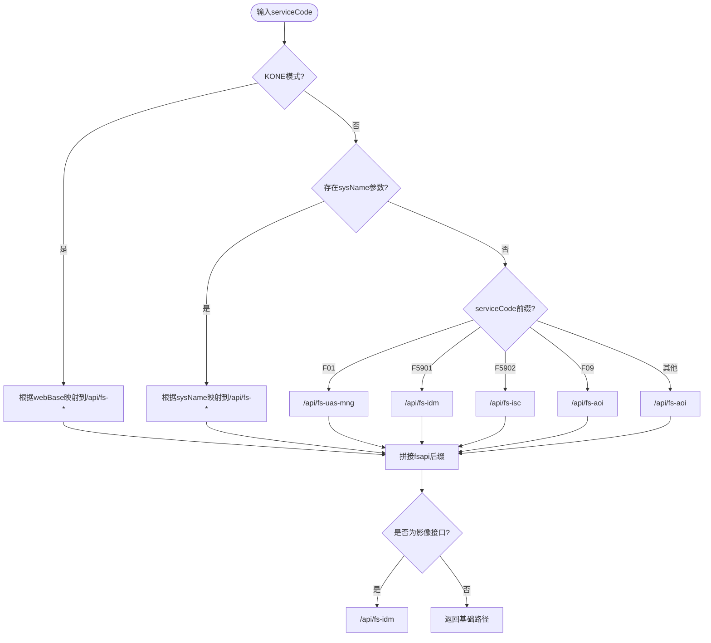
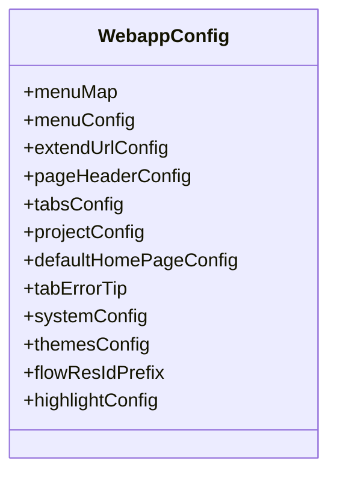
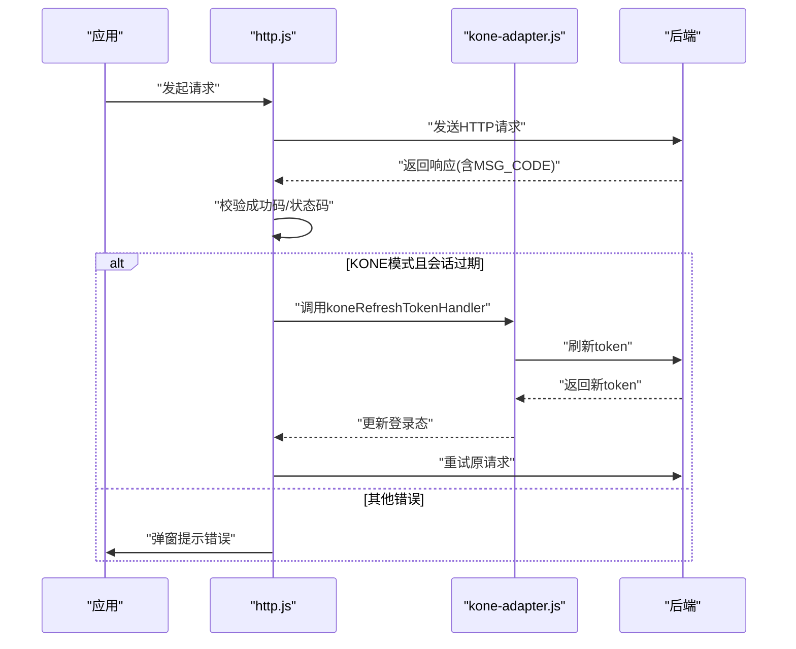
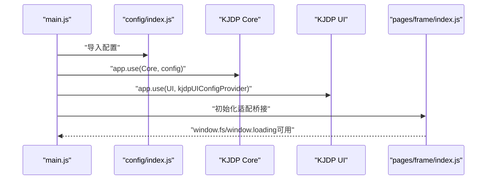
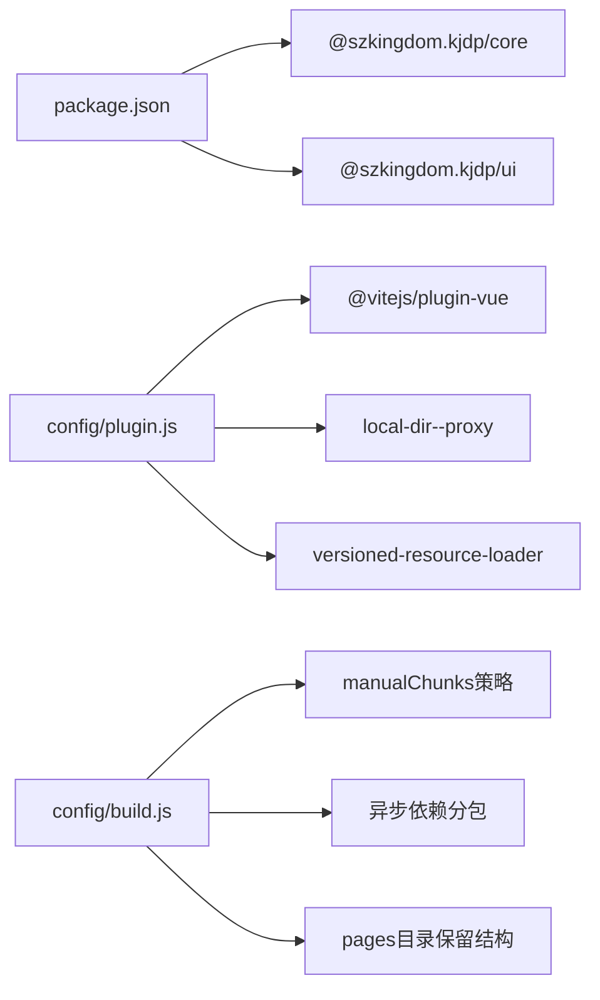

# KJDP框架配置

<cite>
**本文档引用的文件**
- [src/config/kjdp.js](file://src/config/kjdp.js)
- [src/config/kone-adapter.js](file://src/config/kone-adapter.js)
- [src/config/services.js](file://src/config/services.js)
- [src/config/service-code-map.js](file://src/config/service-code-map.js)
- [src/config/webapp.js](file://src/config/webapp.js)
- [src/config/http.js](file://src/config/http.js)
- [src/config/index.js](file://src/config/index.js)
- [src/main.js](file://src/main.js)
- [package.json](file://package.json)
- [src/pages/frame/index.js](file://src/pages/frame/index.js)
- [src/config/callbacks.js](file://src/config/callbacks.js)
- [src/config/consts.js](file://src/config/consts.js)
- [config/plugin.js](file://config/plugin.js)
- [config/build.js](file://config/build.js)
</cite>

## 目录
1. [简介](#简介)
2. [项目结构](#项目结构)
3. [核心组件](#核心组件)
4. [架构总览](#架构总览)
5. [详细组件分析](#详细组件分析)
6. [依赖关系分析](#依赖关系分析)
7. [性能考虑](#性能考虑)
8. [故障排查指南](#故障排查指南)
9. [结论](#结论)
10. [附录](#附录)

## 简介
本文件面向FS-AOI-WEB的KJDP框架配置模块，系统性阐述KJDP核心配置（UI组件、插件系统、框架行为）与集成方式，详解适配器与服务接口配置，提供扩展指南、适配器开发教程与性能调优建议，并给出可复用的配置示例与集成案例。

## 项目结构
KJDP配置模块位于src/config目录，围绕“核心配置”“适配器”“服务映射”“应用配置”“HTTP层”展开；入口在src/main.js中注册KJDP Core与UI，并通过src/config/index.js统一导出。

**图表来源**
- [src/main.js](file://src/main.js#L1-L39)
- [src/config/index.js](file://src/config/index.js#L1-L8)
- [src/config/kjdp.js](file://src/config/kjdp.js#L1-L59)
- [src/config/kone-adapter.js](file://src/config/kone-adapter.js#L1-L248)
- [src/config/services.js](file://src/config/services.js#L1-L28)
- [src/config/service-code-map.js](file://src/config/service-code-map.js#L1-L129)
- [src/config/webapp.js](file://src/config/webapp.js#L1-L254)
- [src/config/http.js](file://src/config/http.js#L1-L124)
- [src/pages/frame/index.js](file://src/pages/frame/index.js#L1-L48)
- [src/config/callbacks.js](file://src/config/callbacks.js#L1-L54)
- [src/config/consts.js](file://src/config/consts.js#L1-L120)
- [package.json](file://package.json#L1-L61)
- [config/plugin.js](file://config/plugin.js#L1-L17)
- [config/build.js](file://config/build.js#L1-L104)

**章节来源**
- [src/main.js](file://src/main.js#L1-L39)
- [src/config/index.js](file://src/config/index.js#L1-L8)

## 核心组件
- KJDP UI配置（kjdp.js）：定义UI组件默认属性、校验规则扩展、通用视图模块布局与流程服务接口号映射。
- KONE适配器（kone-adapter.js）：处理KONE模式下的会话续期、消息通信、系统状态、菜单打开等适配逻辑。
- 服务接口配置（services.js）：集中管理门户/菜单/字典/系统参数等平台级接口号。
- 服务码映射（service-code-map.js）：根据服务码/系统名/URL参数推导请求前缀与fsapi后缀。
- 应用行为配置（webapp.js）：菜单字段映射、菜单过滤与记忆、URL格式化、首页模板、主题与高亮配置等。
- HTTP层配置（http.js）：统一错误处理、会话过期处理、请求/响应拦截、安全网关与登录相关URL。
- 集成入口（main.js）：注册KJDP Core/UI，注入配置对象。
- 生命周期回调（callbacks.js）：应用挂载前后缓存初始化、版本校验。
- 常量定义（consts.js）：菜单、组织、流程、权限等常量枚举。
- 构建与插件（plugin.js、build.js）：Vite插件链与Rollup分包策略。

**章节来源**
- [src/config/kjdp.js](file://src/config/kjdp.js#L1-L59)
- [src/config/kone-adapter.js](file://src/config/kone-adapter.js#L1-L248)
- [src/config/services.js](file://src/config/services.js#L1-L28)
- [src/config/service-code-map.js](file://src/config/service-code-map.js#L1-L129)
- [src/config/webapp.js](file://src/config/webapp.js#L1-L254)
- [src/config/http.js](file://src/config/http.js#L1-L124)
- [src/main.js](file://src/main.js#L1-L39)
- [src/config/callbacks.js](file://src/config/callbacks.js#L1-L54)
- [src/config/consts.js](file://src/config/consts.js#L1-L120)
- [config/plugin.js](file://config/plugin.js#L1-L17)
- [config/build.js](file://config/build.js#L1-L104)

## 架构总览
KJDP框架通过main.js注入配置，KJDP Core负责能力内核，KJDP UI负责组件库样式与默认行为；KONE适配器在KONE模式下接管会话与消息；HTTP层统一处理错误与会话续期；服务码映射决定后端接口前缀；应用配置控制菜单、URL、主题等行为。

**图表来源**
- [src/main.js](file://src/main.js#L1-L39)
- [src/config/index.js](file://src/config/index.js#L1-L8)
- [src/config/kjdp.js](file://src/config/kjdp.js#L1-L59)
- [src/config/kone-adapter.js](file://src/config/kone-adapter.js#L1-L248)
- [src/config/services.js](file://src/config/services.js#L1-L28)
- [src/config/service-code-map.js](file://src/config/service-code-map.js#L1-L129)
- [src/config/webapp.js](file://src/config/webapp.js#L1-L254)
- [src/config/http.js](file://src/config/http.js#L1-L124)
- [src/config/callbacks.js](file://src/config/callbacks.js#L1-L54)
- [src/config/consts.js](file://src/config/consts.js#L1-L120)

## 详细组件分析

### KJDP UI配置（kjdp.js）
- 组件默认属性：为KuiInput/KuiDialog/KuiTable等组件设置全局默认属性，如clearable、stripe、closeOnClickModal等，减少重复配置。
- 通用视图模块布局：通过QueryForm/TableView/TableDialog/TableButtons的order与align控制布局顺序与对齐方式。
- 校验规则扩展：预留validateRules扩展点，便于按需增加校验器与消息。
- 流程服务接口号：集中定义流程相关服务码（如获取业务定义、提交、审查等），便于统一维护与替换。

**图表来源**
- [src/config/kjdp.js](file://src/config/kjdp.js#L1-L59)

**章节来源**
- [src/config/kjdp.js](file://src/config/kjdp.js#L1-L59)

### KONE适配器（kone-adapter.js）
- 消息通信：监听来自kjdp的消息（如refreshToken、backToLogin），并在KONE模式下与父窗口通信。
- 会话续期：当检测到会话过期或JWT刷新需求时，向后端发起token转换请求，更新登录态与门户操作人信息。
- 系统状态：提供版本、日期、状态等信息的异步获取与初始化。
- 菜单打开：封装openSystemMenu，向父窗口发送打开菜单的消息。
- 工具函数：isInKone判断当前是否处于KONE模式；handleKjdpToken处理来自框架的token刷新消息。

**图表来源**
- [src/config/kone-adapter.js](file://src/config/kone-adapter.js#L17-L110)

**章节来源**
- [src/config/kone-adapter.js](file://src/config/kone-adapter.js#L1-L248)

### 服务接口配置（services.js）
- 门户与菜单：集中定义门户查询、菜单查询、常用菜单等接口号。
- 字典与系统参数：定义字典与系统参数的默认接口号及是否启用子系统功能。
- 机构查询：提供默认机构查询接口号。
- 扩展点：可通过新增键值对扩展更多平台级接口号。

**图表来源**
- [src/config/services.js](file://src/config/services.js#L1-L28)

**章节来源**
- [src/config/services.js](file://src/config/services.js#L1-L28)

### 服务码映射（service-code-map.js）
- URL参数解析：从URL查询串提取参数，支持不同系统名映射到请求前缀。
- 请求前缀推导：根据服务码前缀（如F01/F09/F59）或系统名参数推导/api/{service}。
- 服务基础路径：针对P/I/D开头的服务码分别映射到fs-aoi/fs-uas-mng/fs-idm/fs-isc等；无fsapi后缀的特殊接口直接返回服务名。
- 影像相关：提供独立的影像服务前缀获取。

**图表来源**
- [src/config/service-code-map.js](file://src/config/service-code-map.js#L24-L121)

**章节来源**
- [src/config/service-code-map.js](file://src/config/service-code-map.js#L1-L129)

### 应用行为配置（webapp.js）
- 菜单字段映射：定义菜单树字段名称与选项值映射。
- 菜单配置：支持菜单过滤、自动关闭父菜单、菜单记忆。
- URL扩展：为特定菜单ID附加URL参数。
- Header与Tab配置：搜索屏蔽/可搜父级菜单、Tab数量限制与栈模式。
- 项目配置：是否嵌套iframe、登录态键名、URL格式化策略、搜索行为、首页加载、全屏显示。
- 默认首页模板：收藏/历史菜单展示与优先级。
- 异常菜单提示：菜单缺失/链接缺失/状态禁用/时间限制提示文案。
- 系统默认配置：机构代码、机构名称、系统环境与名称。
- 主题配置：是否显示主题切换、默认主题。
- 流程图任务标识前缀：受理/审核/自动/差错任务前缀。
- 高亮插件配置：默认主题。

**图表来源**
- [src/config/webapp.js](file://src/config/webapp.js#L41-L254)

**章节来源**
- [src/config/webapp.js](file://src/config/webapp.js#L1-L254)

### HTTP层配置（http.js）
- 成功码与基础路径：定义成功码集合与服务基础路径解析函数。
- 会话过期处理：在KONE模式下使用koneRefreshTokenHandler拦截并处理会话过期。
- 错误处理：统一错误弹窗，包含MSG_CODE、URL、TraceID等信息。
- 请求扩展数据：从路由query扩展菜单ID/名称到请求体。
- 安全网关与登录URL：集中管理会话、认证、用户信息、上传下载等URL。

**图表来源**
- [src/config/http.js](file://src/config/http.js#L27-L85)
- [src/config/kone-adapter.js](file://src/config/kone-adapter.js#L124-L162)

**章节来源**
- [src/config/http.js](file://src/config/http.js#L1-L124)
- [src/config/kone-adapter.js](file://src/config/kone-adapter.js#L124-L162)

### 集成入口与适配桥接（main.js、pages/frame/index.js）
- main.js：注册Pinia、KJDP Core与KJDP UI，注入配置对象；在挂载前执行回调。
- pages/frame/index.js：提供window.fs与window.loading兼容，标记isInKone，供旧版代码兼容。

**图表来源**
- [src/main.js](file://src/main.js#L15-L39)
- [src/config/index.js](file://src/config/index.js#L1-L8)
- [src/pages/frame/index.js](file://src/pages/frame/index.js#L36-L48)

**章节来源**
- [src/main.js](file://src/main.js#L1-L39)
- [src/pages/frame/index.js](file://src/pages/frame/index.js#L1-L48)

### 生命周期回调与常量（callbacks.js、consts.js）
- callbacks.js：应用挂载前初始化系统参数缓存；应用挂载后定时检查版本并提示。
- consts.js：定义菜单ID、机构代码、子系统、权限类型、组织类型、流程状态与处理状态等常量。

**章节来源**
- [src/config/callbacks.js](file://src/config/callbacks.js#L1-L54)
- [src/config/consts.js](file://src/config/consts.js#L1-L120)

## 依赖关系分析
- 依赖声明：package.json中明确@szkingdom.kjdp/core与@szkingdom.kjdp/ui为核心依赖。
- 插件系统：Vite插件链包含Vue与本地目录代理，生产环境可选版本化资源加载插件。
- 构建策略：Rollup手动分包，区分第三方依赖、异步依赖与源码目录，支持哈希命名与目录结构保留。

**图表来源**
- [package.json](file://package.json#L17-L40)
- [config/plugin.js](file://config/plugin.js#L1-L17)
- [config/build.js](file://config/build.js#L32-L103)

**章节来源**
- [package.json](file://package.json#L1-L61)
- [config/plugin.js](file://config/plugin.js#L1-L17)
- [config/build.js](file://config/build.js#L1-L104)

## 性能考虑
- 组件默认属性：通过kjdp.js集中设置组件默认属性，减少重复配置带来的渲染成本。
- 会话续期与重试：在KONE模式下，http.js与kone-adapter.js配合实现透明续期与请求重试，避免频繁弹窗导致的用户体验下降。
- 构建分包：build.js对异步依赖与源码目录进行精细化分包，降低首屏体积并提升缓存命中率。
- URL格式化：webapp.js的projectConfig.urlEncrypt与formatUrl策略可减少无效请求与重复加载。
- 加载提示：pages/frame/index.js的loading实例管理，避免多层加载叠加造成卡顿。

[本节为通用指导，无需列出具体文件来源]

## 故障排查指南
- 会话过期/认证失败
  - 现象：请求返回状态码或MSG_CODE表示会话过期。
  - 处理：检查http.js中的responseErrorInterceptor与kone-adapter.js中的koneRefreshTokenHandler；确认KONE模式下消息通道是否正常。
  - 参考
    - [src/config/http.js](file://src/config/http.js#L43-L45)
    - [src/config/kone-adapter.js](file://src/config/kone-adapter.js#L124-L162)
- JWT刷新失败
  - 现象：刷新token后仍提示过期。
  - 处理：检查kone-adapter.js中refreshToken流程与父窗口postMessage交互；确认后端auth/token接口返回结构。
  - 参考
    - [src/config/kone-adapter.js](file://src/config/kone-adapter.js#L46-L110)
- 接口前缀错误
  - 现象：请求路径不正确或404。
  - 处理：检查service-code-map.js中的getReqBase与getServiceBase逻辑，确认sysName参数与服务码前缀映射。
  - 参考
    - [src/config/service-code-map.js](file://src/config/service-code-map.js#L24-L121)
- 组件默认属性未生效
  - 现象：组件未按预期显示或行为异常。
  - 处理：检查kjdp.js中的componentsProps配置，确认组件名与属性键是否正确。
  - 参考
    - [src/config/kjdp.js](file://src/config/kjdp.js#L21-L41)
- 版本不一致提示
  - 现象：应用提示版本不一致。
  - 处理：检查callbacks.js中的版本检查逻辑与系统参数缓存初始化。
  - 参考
    - [src/config/callbacks.js](file://src/config/callbacks.js#L19-L46)

**章节来源**
- [src/config/http.js](file://src/config/http.js#L43-L45)
- [src/config/kone-adapter.js](file://src/config/kone-adapter.js#L46-L110)
- [src/config/service-code-map.js](file://src/config/service-code-map.js#L24-L121)
- [src/config/kjdp.js](file://src/config/kjdp.js#L21-L41)
- [src/config/callbacks.js](file://src/config/callbacks.js#L19-L46)

## 结论
本配置体系以KJDP为核心，通过UI配置、适配器、服务映射与应用行为配置形成完整的前端框架能力。结合HTTP层的统一错误与会话处理，以及构建与插件系统的优化，能够稳定支撑AOI业务场景的快速迭代与扩展。

[本节为总结性内容，无需列出具体文件来源]

## 附录

### 扩展指南
- 扩展UI组件默认属性
  - 在kjdp.js的componentsProps中新增组件属性，确保覆盖范围与默认值合理。
  - 参考
    - [src/config/kjdp.js](file://src/config/kjdp.js#L21-L41)
- 新增流程服务接口号
  - 在kjdp.js的flowService中添加新的服务码映射，保持命名清晰。
  - 参考
    - [src/config/kjdp.js](file://src/config/kjdp.js#L42-L55)
- 新增平台级服务接口号
  - 在services.js中新增接口号与子系统开关，便于统一管理。
  - 参考
    - [src/config/services.js](file://src/config/services.js#L1-L28)
- 自定义服务码映射
  - 在service-code-map.js中扩展getReqBase或getServiceBase逻辑，满足新系统接入。
  - 参考
    - [src/config/service-code-map.js](file://src/config/service-code-map.js#L24-L121)
- 自定义应用行为
  - 在webapp.js中调整菜单字段映射、URL格式化策略、主题与高亮配置。
  - 参考
    - [src/config/webapp.js](file://src/config/webapp.js#L41-L254)
- 自定义HTTP处理
  - 在http.js中扩展errorConfig、reqCommDataExtend或axiosConfig，满足业务定制。
  - 参考
    - [src/config/http.js](file://src/config/http.js#L27-L85)

### 适配器开发教程
- 消息通信
  - 监听window.message事件，识别from/topic，执行对应逻辑（如refreshToken/backToLogin）。
  - 参考
    - [src/config/kone-adapter.js](file://src/config/kone-adapter.js#L17-L40)
- 会话续期
  - 实现refreshToken流程，向父窗口请求刷新，接收后端返回并更新登录态。
  - 参考
    - [src/config/kone-adapter.js](file://src/config/kone-adapter.js#L46-L110)
- 系统状态与菜单
  - 提供系统版本、日期、状态初始化方法；封装openSystemMenu打开菜单。
  - 参考
    - [src/config/kone-adapter.js](file://src/config/kone-adapter.js#L168-L247)

### 性能调优建议
- 组件层面：利用kjdp.js集中设置默认属性，减少重复渲染。
- 网络层面：启用http.js中的统一错误处理与会话续期，避免频繁弹窗。
- 构建层面：使用config/build.js的manualChunks策略，拆分异步依赖与源码目录。
- URL层面：在webapp.js中优化formatUrl策略，减少无效请求。
- 加载层面：通过pages/frame/index.js的loading实例管理，避免多层叠加。

**章节来源**
- [src/config/kjdp.js](file://src/config/kjdp.js#L21-L41)
- [src/config/kone-adapter.js](file://src/config/kone-adapter.js#L168-L247)
- [src/config/http.js](file://src/config/http.js#L27-L85)
- [config/build.js](file://config/build.js#L60-L103)
- [src/config/webapp.js](file://src/config/webapp.js#L139-L178)
- [src/pages/frame/index.js](file://src/pages/frame/index.js#L7-L48)