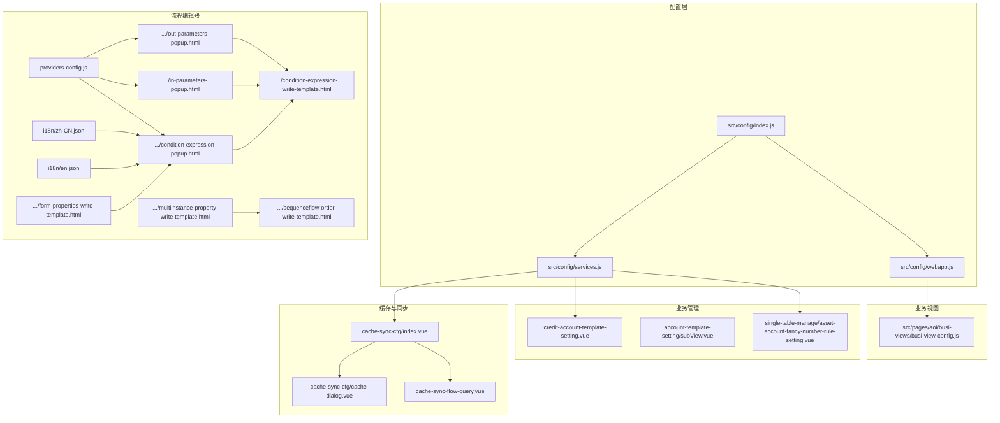
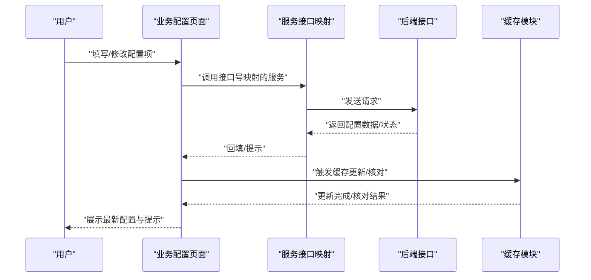
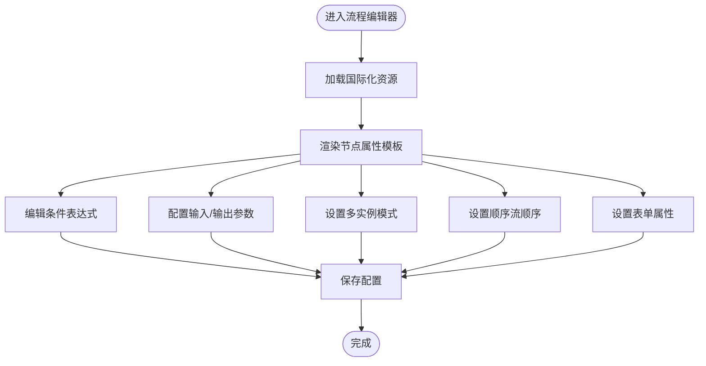
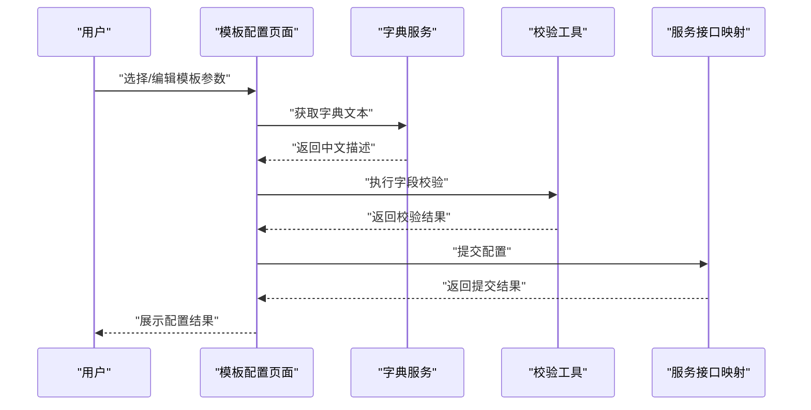
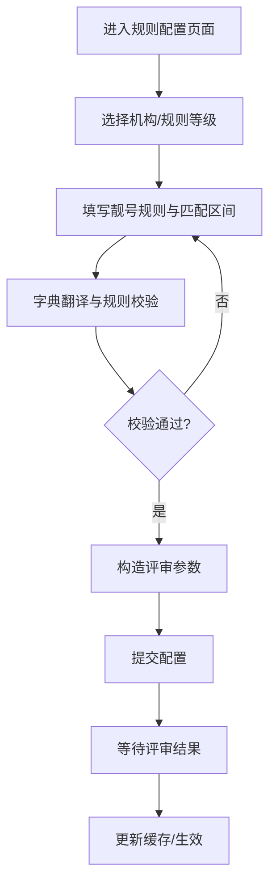
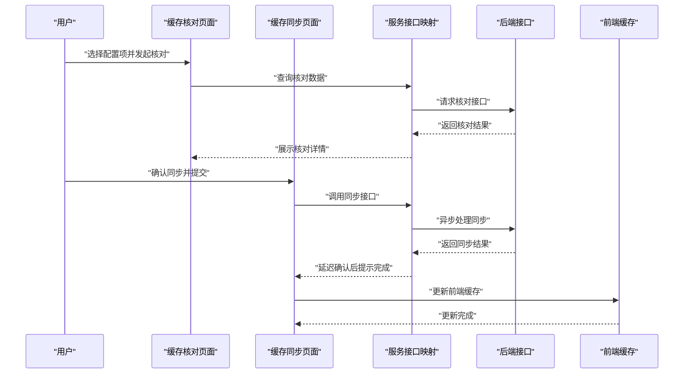
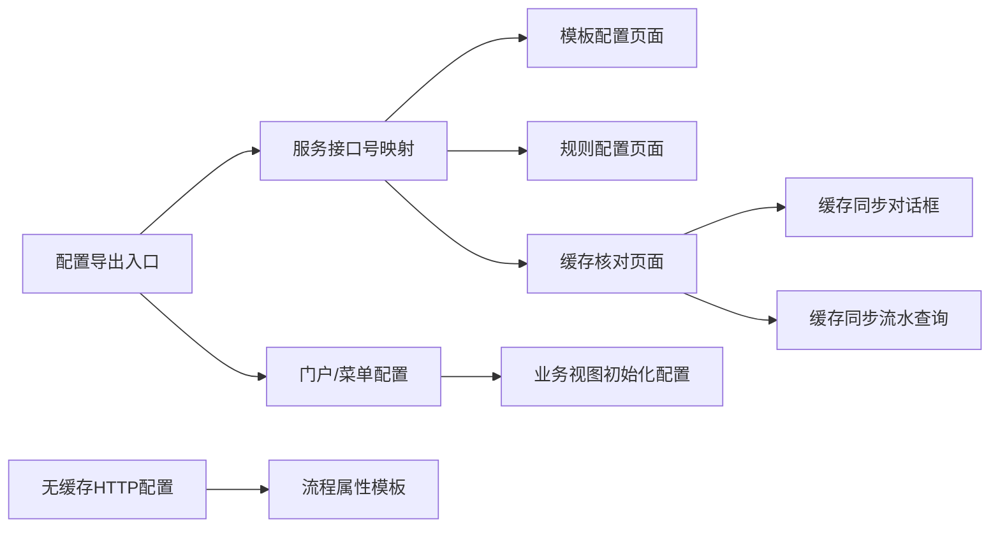

# 业务配置

<cite>
**本文引用的文件**
- [src/config/index.js](file://src/config/index.js)
- [src/config/webapp.js](file://src/config/webapp.js)
- [src/config/services.js](file://src/config/services.js)
- [src/pages/aoi/busi-views/busi-view-config.js](file://src/pages/aoi/busi-views/busi-view-config.js)
- [src/pages/uas/views/business/cache-sync-cfg/index.vue](file://src/pages/uas/views/business/cache-sync-cfg/index.vue)
- [src/pages/uas/views/business/cache-sync-cfg/cache-dialog.vue](file://src/pages/uas/views/business/cache-sync-cfg/cache-dialog.vue)
- [src/pages/uas/views/business/cache-sync-flow-query.vue](file://src/pages/uas/views/business/cache-sync-flow-query.vue)
- [src/pages/uas/views/business/single-table-manage/asset-account-fancy-number-rule-setting.vue](file://src/pages/uas/views/business/single-table-manage/asset-account-fancy-number-rule-setting.vue)
- [src/pages/uas/views/business/credit-account-template-setting.vue](file://src/pages/uas/views/business/credit-account-template-setting.vue)
- [src/pages/uas/views/business/account-template-setting/subView.vue](file://src/pages/uas/views/business/account-template-setting/subView.vue)
- [src/pages/uas/utils/business.js](file://src/pages/uas/utils/business.js)
- [src/pages/cop/hooks/cache/index.js](file://src/pages/cop/hooks/cache/index.js)
- [src/pages/cop/hooks/cache/store.js](file://src/pages/cop/hooks/cache/store.js)
- [public/static/flow/scripts/common/providers-config.js](file://public/static/flow/scripts/common/providers-config.js)
- [public/static/flow/editor/i18n/zh-CN.json](file://public/static/flow/editor/i18n/zh-CN.json)
- [public/static/flow/editor/i18n/en.json](file://public/static/flow/editor/i18n/en.json)
- [public/static/flow/editor/editor-app/configuration/properties/condition-expression-popup.html](file://public/static/flow/editor/editor-app/configuration/properties/condition-expression-popup.html)
- [public/static/flow/editor/editor-app/configuration/properties/condition-expression-write-template.html](file://public/static/flow/editor/editor-app/configuration/properties/condition-expression-write-template.html)
- [public/static/flow/editor/editor-app/configuration/properties/in-parameters-popup.html](file://public/static/flow/editor/editor-app/configuration/properties/in-parameters-popup.html)
- [public/static/flow/editor/editor-app/configuration/properties/out-parameters-popup.html](file://public/static/flow/editor/editor-app/configuration/properties/out-parameters-popup.html)
- [public/static/flow/editor/editor-app/configuration/properties/multiinstance-property-write-template.html](file://public/static/flow/editor/editor-app/configuration/properties/multiinstance-property-write-template.html)
- [public/static/flow/editor/editor-app/configuration/properties/sequenceflow-order-write-template.html](file://public/static/flow/editor/editor-app/configuration/properties/sequenceflow-order-write-template.html)
- [public/static/flow/editor/editor-app/configuration/properties/form-properties-write-template.html](file://public/static/flow/editor/editor-app/configuration/properties/form-properties-write-template.html)
</cite>

## 目录
1. [引言](#引言)
2. [项目结构](#项目结构)
3. [核心组件](#核心组件)
4. [架构总览](#架构总览)
5. [详细组件分析](#详细组件分析)
6. [依赖关系分析](#依赖关系分析)
7. [性能考量](#性能考量)
8. [故障排查指南](#故障排查指南)
9. [结论](#结论)
10. [附录](#附录)

## 引言
本文件面向FS-AOI-WEB业务配置模块，系统化阐述AOI系统中的业务配置管理，覆盖业务流程配置、业务参数配置与业务规则配置三大部分。文档从数据结构、配置项含义、配置变更影响范围入手，解释加载机制、缓存策略与实时生效机制，并提供维护指南、配置模板与最佳实践，辅以具体示例与操作步骤，帮助业务与技术人员高效理解与落地。

## 项目结构
AOI-WEB前端采用模块化组织，业务配置相关内容主要分布在以下区域：
- 配置层：全局配置导出、门户与菜单配置、服务接口号映射
- 业务视图：受理/复核流程入口与通用配置
- 业务管理：模板与规则配置页面
- 缓存与同步：缓存核对与同步流程
- 流程编辑器：流程节点属性配置（条件表达式、输入输出参数、多实例、顺序流等）

图表来源
- [src/config/index.js](file://src/config/index.js#L1-L8)
- [src/config/webapp.js](file://src/config/webapp.js#L1-L254)
- [src/config/services.js](file://src/config/services.js#L1-L28)
- [src/pages/aoi/busi-views/busi-view-config.js](file://src/pages/aoi/busi-views/busi-view-config.js#L1-L5)
- [src/pages/uas/views/business/cache-sync-cfg/index.vue](file://src/pages/uas/views/business/cache-sync-cfg/index.vue#L55-L350)
- [src/pages/uas/views/business/cache-sync-cfg/cache-dialog.vue](file://src/pages/uas/views/business/cache-sync-cfg/cache-dialog.vue#L228-L273)
- [src/pages/uas/views/business/cache-sync-flow-query.vue](file://src/pages/uas/views/business/cache-sync-flow-query.vue#L1-L43)
- [src/pages/uas/views/business/credit-account-template-setting.vue](file://src/pages/uas/views/business/credit-account-template-setting.vue#L37-L190)
- [src/pages/uas/views/business/account-template-setting/subView.vue](file://src/pages/uas/views/business/account-template-setting/subView.vue#L1-L44)
- [src/pages/uas/views/business/single-table-manage/asset-account-fancy-number-rule-setting.vue](file://src/pages/uas/views/business/single-table-manage/asset-account-fancy-number-rule-setting.vue#L35-L115)
- [public/static/flow/scripts/common/providers-config.js](file://public/static/flow/scripts/common/providers-config.js#L1-L27)
- [public/static/flow/editor/i18n/zh-CN.json](file://public/static/flow/editor/i18n/zh-CN.json#L1083-L1212)
- [public/static/flow/editor/i18n/en.json](file://public/static/flow/editor/i18n/en.json#L1083-L1212)
- [public/static/flow/editor/editor-app/configuration/properties/condition-expression-popup.html](file://public/static/flow/editor/editor-app/configuration/properties/condition-expression-popup.html#L1-L26)
- [public/static/flow/editor/editor-app/configuration/properties/condition-expression-write-template.html](file://public/static/flow/editor/editor-app/configuration/properties/condition-expression-write-template.html#L1-L4)
- [public/static/flow/editor/editor-app/configuration/properties/in-parameters-popup.html](file://public/static/flow/editor/editor-app/configuration/properties/in-parameters-popup.html#L18-L37)
- [public/static/flow/editor/editor-app/configuration/properties/out-parameters-popup.html](file://public/static/flow/editor/editor-app/configuration/properties/out-parameters-popup.html#L18-L37)
- [public/static/flow/editor/editor-app/configuration/properties/multiinstance-property-write-template.html](file://public/static/flow/editor/editor-app/configuration/properties/multiinstance-property-write-template.html#L1-L8)
- [public/static/flow/editor/editor-app/configuration/properties/sequenceflow-order-write-template.html](file://public/static/flow/editor/editor-app/configuration/properties/sequenceflow-order-write-template.html#L1-L4)
- [public/static/flow/editor/editor-app/configuration/properties/form-properties-write-template.html](file://public/static/flow/editor/editor-app/configuration/properties/form-properties-write-template.html#L1-L4)

章节来源
- [src/config/index.js](file://src/config/index.js#L1-L8)
- [src/config/webapp.js](file://src/config/webapp.js#L1-L254)
- [src/config/services.js](file://src/config/services.js#L1-L28)

## 核心组件
- 配置导出与聚合
  - 通过统一导出入口整合HTTP、WebApp、服务接口号、常量与回调等配置，便于模块间共享与替换。
- 门户与菜单配置
  - 定义菜单字段映射、过滤规则、URL参数扩展、页签限制与默认首页模板等，支撑业务入口与导航行为。
- 服务接口号映射
  - 将前端调用的服务编号与后端接口号对应，便于集中维护与变更。
- 业务视图初始化配置
  - 提供受理流程初始化时的公共数据注入点，强调“尽量精简”，避免影响流程组件性能。
- 业务模板与规则配置页面
  - 覆盖模板配置、子配置、规则配置等场景，提供字典翻译、校验规则与提交评审流程。
- 缓存核对与同步
  - 提供按配置项维度的缓存核对、批量刷新与流水查询能力，保障配置变更的可追溯与一致性。
- 流程编辑器属性配置
  - 通过弹窗与写入模板定义流程节点属性（条件表达式、输入输出参数、多实例、顺序流、表单属性等），支撑业务流程配置。

章节来源
- [src/config/index.js](file://src/config/index.js#L1-L8)
- [src/config/webapp.js](file://src/config/webapp.js#L38-L254)
- [src/config/services.js](file://src/config/services.js#L1-L28)
- [src/pages/aoi/busi-views/busi-view-config.js](file://src/pages/aoi/busi-views/busi-view-config.js#L1-L5)
- [src/pages/uas/views/business/credit-account-template-setting.vue](file://src/pages/uas/views/business/credit-account-template-setting.vue#L37-L190)
- [src/pages/uas/views/business/account-template-setting/subView.vue](file://src/pages/uas/views/business/account-template-setting/subView.vue#L1-L44)
- [src/pages/uas/views/business/single-table-manage/asset-account-fancy-number-rule-setting.vue](file://src/pages/uas/views/business/single-table-manage/asset-account-fancy-number-rule-setting.vue#L35-L115)
- [src/pages/uas/views/business/cache-sync-cfg/index.vue](file://src/pages/uas/views/business/cache-sync-cfg/index.vue#L55-L350)
- [src/pages/uas/views/business/cache-sync-cfg/cache-dialog.vue](file://src/pages/uas/views/business/cache-sync-cfg/cache-dialog.vue#L228-L273)
- [src/pages/uas/views/business/cache-sync-flow-query.vue](file://src/pages/uas/views/business/cache-sync-flow-query.vue#L1-L43)
- [public/static/flow/editor/editor-app/configuration/properties/condition-expression-popup.html](file://public/static/flow/editor/editor-app/configuration/properties/condition-expression-popup.html#L1-L26)
- [public/static/flow/editor/editor-app/configuration/properties/in-parameters-popup.html](file://public/static/flow/editor/editor-app/configuration/properties/in-parameters-popup.html#L18-L37)
- [public/static/flow/editor/editor-app/configuration/properties/out-parameters-popup.html](file://public/static/flow/editor/editor-app/configuration/properties/out-parameters-popup.html#L18-L37)
- [public/static/flow/editor/editor-app/configuration/properties/multiinstance-property-write-template.html](file://public/static/flow/editor/editor-app/configuration/properties/multiinstance-property-write-template.html#L1-L8)
- [public/static/flow/editor/editor-app/configuration/properties/sequenceflow-order-write-template.html](file://public/static/flow/editor/editor-app/configuration/properties/sequenceflow-order-write-template.html#L1-L4)
- [public/static/flow/editor/editor-app/configuration/properties/form-properties-write-template.html](file://public/static/flow/editor/editor-app/configuration/properties/form-properties-write-template.html#L1-L4)

## 架构总览
业务配置在AOI-WEB中贯穿“配置定义—加载—缓存—生效—核对—同步”的闭环链路。前端通过配置层与服务层对接后端，业务页面基于统一的字典与校验工具进行配置项渲染与提交，流程编辑器提供可视化配置能力，缓存模块保障配置变更的实时性与一致性。

图表来源
- [src/config/services.js](file://src/config/services.js#L1-L28)
- [src/pages/uas/views/business/cache-sync-cfg/index.vue](file://src/pages/uas/views/business/cache-sync-cfg/index.vue#L55-L350)
- [src/pages/uas/views/business/cache-sync-cfg/cache-dialog.vue](file://src/pages/uas/views/business/cache-sync-cfg/cache-dialog.vue#L228-L273)

## 详细组件分析

### 业务流程配置
- 流程节点属性配置
  - 条件表达式：通过弹窗模板定义静态表达式，支持显示与编辑。
  - 输入/输出参数：通过弹窗模板配置参数源与表达式，支持增删与占位提示。
  - 多实例：通过写入模板选择并联动变更。
  - 顺序流顺序：通过写入模板配置顺序。
  - 表单属性：通过写入模板配置表单相关属性。
- 加载机制
  - 流程编辑器通过国际化资源与模板渲染节点属性，确保配置项在流程图中可读可改。
- 影响范围
  - 节点属性直接影响流程执行分支、数据传递与表单渲染，需谨慎配置并进行充分测试。

图表来源
- [public/static/flow/editor/i18n/zh-CN.json](file://public/static/flow/editor/i18n/zh-CN.json#L1083-L1212)
- [public/static/flow/editor/i18n/en.json](file://public/static/flow/editor/i18n/en.json#L1083-L1212)
- [public/static/flow/editor/editor-app/configuration/properties/condition-expression-popup.html](file://public/static/flow/editor/editor-app/configuration/properties/condition-expression-popup.html#L1-L26)
- [public/static/flow/editor/editor-app/configuration/properties/in-parameters-popup.html](file://public/static/flow/editor/editor-app/configuration/properties/in-parameters-popup.html#L18-L37)
- [public/static/flow/editor/editor-app/configuration/properties/out-parameters-popup.html](file://public/static/flow/editor/editor-app/configuration/properties/out-parameters-popup.html#L18-L37)
- [public/static/flow/editor/editor-app/configuration/properties/multiinstance-property-write-template.html](file://public/static/flow/editor/editor-app/configuration/properties/multiinstance-property-write-template.html#L1-L8)
- [public/static/flow/editor/editor-app/configuration/properties/sequenceflow-order-write-template.html](file://public/static/flow/editor/editor-app/configuration/properties/sequenceflow-order-write-template.html#L1-L4)
- [public/static/flow/editor/editor-app/configuration/properties/form-properties-write-template.html](file://public/static/flow/editor/editor-app/configuration/properties/form-properties-write-template.html#L1-L4)

章节来源
- [public/static/flow/scripts/common/providers-config.js](file://public/static/flow/scripts/common/providers-config.js#L1-L27)
- [public/static/flow/editor/i18n/zh-CN.json](file://public/static/flow/editor/i18n/zh-CN.json#L1083-L1212)
- [public/static/flow/editor/i18n/en.json](file://public/static/flow/editor/i18n/en.json#L1083-L1212)
- [public/static/flow/editor/editor-app/configuration/properties/condition-expression-popup.html](file://public/static/flow/editor/editor-app/configuration/properties/condition-expression-popup.html#L1-L26)
- [public/static/flow/editor/editor-app/configuration/properties/in-parameters-popup.html](file://public/static/flow/editor/editor-app/configuration/properties/in-parameters-popup.html#L18-L37)
- [public/static/flow/editor/editor-app/configuration/properties/out-parameters-popup.html](file://public/static/flow/editor/editor-app/configuration/properties/out-parameters-popup.html#L18-L37)
- [public/static/flow/editor/editor-app/configuration/properties/multiinstance-property-write-template.html](file://public/static/flow/editor/editor-app/configuration/properties/multiinstance-property-write-template.html#L1-L8)
- [public/static/flow/editor/editor-app/configuration/properties/sequenceflow-order-write-template.html](file://public/static/flow/editor/editor-app/configuration/properties/sequenceflow-order-write-template.html#L1-L4)
- [public/static/flow/editor/editor-app/configuration/properties/form-properties-write-template.html](file://public/static/flow/editor/editor-app/configuration/properties/form-properties-write-template.html#L1-L4)

### 业务参数配置
- 模板配置
  - 信用账户模板设置：支持用户类型、客户类别、客户分组、规范标志、风险因素、操作渠道等参数的组合配置与字典翻译。
  - 子配置：针对模板的子项配置，如货币代码、资产账户存管标志、利率编码等。
- 参数含义与约束
  - 字段多选翻译、长度限制、必填校验、过滤规则等由页面统一校验与提示。
- 影响范围
  - 模板参数决定业务受理/复核流程中的默认值与可用选项，直接影响用户体验与合规性。

图表来源
- [src/pages/uas/views/business/credit-account-template-setting.vue](file://src/pages/uas/views/business/credit-account-template-setting.vue#L37-L190)
- [src/pages/uas/views/business/account-template-setting/subView.vue](file://src/pages/uas/views/business/account-template-setting/subView.vue#L1-L44)
- [src/pages/uas/utils/business.js](file://src/pages/uas/utils/business.js#L1-L236)
- [src/config/services.js](file://src/config/services.js#L1-L28)

章节来源
- [src/pages/uas/views/business/credit-account-template-setting.vue](file://src/pages/uas/views/business/credit-account-template-setting.vue#L37-L190)
- [src/pages/uas/views/business/account-template-setting/subView.vue](file://src/pages/uas/views/business/account-template-setting/subView.vue#L1-L44)
- [src/pages/uas/utils/business.js](file://src/pages/uas/utils/business.js#L1-L236)
- [src/config/services.js](file://src/config/services.js#L1-L28)

### 业务规则配置
- 靓号规则配置
  - 支持机构、靓号规则、规则等级、匹配区间等字段的配置与校验，提交前进行字典翻译与评审参数构造。
- 规则校验与字典映射
  - 通过字典管理器对规则值与规则类型进行翻译，确保规则含义清晰。
- 影响范围
  - 规则直接影响账户号码生成与校验，需严格控制规则值域与边界。

图表来源
- [src/pages/uas/views/business/single-table-manage/asset-account-fancy-number-rule-setting.vue](file://src/pages/uas/views/business/single-table-manage/asset-account-fancy-number-rule-setting.vue#L35-L115)
- [src/pages/uas/views/business/cache-sync-cfg/sundry.js](file://src/pages/uas/views/business/cache-sync-cfg/sundry.js#L1-L49)

章节来源
- [src/pages/uas/views/business/single-table-manage/asset-account-fancy-number-rule-setting.vue](file://src/pages/uas/views/business/single-table-manage/asset-account-fancy-number-rule-setting.vue#L35-L115)
- [src/pages/uas/views/business/cache-sync-cfg/sundry.js](file://src/pages/uas/views/business/cache-sync-cfg/sundry.js#L1-L49)

### 缓存策略与实时生效
- 缓存核对与同步
  - 提供按配置项维度的核对与批量刷新能力，支持服务名、实例、缓存名等筛选，刷新后延迟确认以保证后端同步完成。
- 缓存同步流水查询
  - 支持按服务名查询实例与缓存名列表，便于定位与追踪同步状态。
- 前端缓存
  - 通过Pinia Store提供轻量内存缓存能力，便于页面内快速访问与临时存储。

图表来源
- [src/pages/uas/views/business/cache-sync-cfg/index.vue](file://src/pages/uas/views/business/cache-sync-cfg/index.vue#L55-L350)
- [src/pages/uas/views/business/cache-sync-cfg/cache-dialog.vue](file://src/pages/uas/views/business/cache-sync-cfg/cache-dialog.vue#L228-L273)
- [src/pages/uas/views/business/cache-sync-flow-query.vue](file://src/pages/uas/views/business/cache-sync-flow-query.vue#L1-L43)
- [src/pages/cop/hooks/cache/index.js](file://src/pages/cop/hooks/cache/index.js#L1-L10)
- [src/pages/cop/hooks/cache/store.js](file://src/pages/cop/hooks/cache/store.js#L1-L14)

章节来源
- [src/pages/uas/views/business/cache-sync-cfg/index.vue](file://src/pages/uas/views/business/cache-sync-cfg/index.vue#L55-L350)
- [src/pages/uas/views/business/cache-sync-cfg/cache-dialog.vue](file://src/pages/uas/views/business/cache-sync-cfg/cache-dialog.vue#L228-L273)
- [src/pages/uas/views/business/cache-sync-flow-query.vue](file://src/pages/uas/views/business/cache-sync-flow-query.vue#L1-L43)
- [src/pages/cop/hooks/cache/index.js](file://src/pages/cop/hooks/cache/index.js#L1-L10)
- [src/pages/cop/hooks/cache/store.js](file://src/pages/cop/hooks/cache/store.js#L1-L14)

## 依赖关系分析
- 配置层依赖
  - 配置导出入口依赖各配置模块，形成统一配置面。
- 业务页面依赖
  - 业务模板与规则页面依赖服务接口映射与字典工具，实现参数校验与提交。
- 缓存模块依赖
  - 缓存核对与同步页面依赖服务接口映射与前端缓存Store。
- 流程编辑器依赖
  - 属性配置依赖国际化资源与模板，确保跨语言与可配置性。

图表来源
- [src/config/index.js](file://src/config/index.js#L1-L8)
- [src/config/webapp.js](file://src/config/webapp.js#L1-L254)
- [src/config/services.js](file://src/config/services.js#L1-L28)
- [src/pages/aoi/busi-views/busi-view-config.js](file://src/pages/aoi/busi-views/busi-view-config.js#L1-L5)
- [src/pages/uas/views/business/cache-sync-cfg/index.vue](file://src/pages/uas/views/business/cache-sync-cfg/index.vue#L55-L350)
- [src/pages/uas/views/business/cache-sync-cfg/cache-dialog.vue](file://src/pages/uas/views/business/cache-sync-cfg/cache-dialog.vue#L228-L273)
- [src/pages/uas/views/business/cache-sync-flow-query.vue](file://src/pages/uas/views/business/cache-sync-flow-query.vue#L1-L43)
- [public/static/flow/scripts/common/providers-config.js](file://public/static/flow/scripts/common/providers-config.js#L1-L27)

章节来源
- [src/config/index.js](file://src/config/index.js#L1-L8)
- [src/config/webapp.js](file://src/config/webapp.js#L1-L254)
- [src/config/services.js](file://src/config/services.js#L1-L28)
- [src/pages/aoi/busi-views/busi-view-config.js](file://src/pages/aoi/busi-views/busi-view-config.js#L1-L5)
- [src/pages/uas/views/business/cache-sync-cfg/index.vue](file://src/pages/uas/views/business/cache-sync-cfg/index.vue#L55-L350)
- [src/pages/uas/views/business/cache-sync-cfg/cache-dialog.vue](file://src/pages/uas/views/business/cache-sync-cfg/cache-dialog.vue#L228-L273)
- [src/pages/uas/views/business/cache-sync-flow-query.vue](file://src/pages/uas/views/business/cache-sync-flow-query.vue#L1-L43)
- [public/static/flow/scripts/common/providers-config.js](file://public/static/flow/scripts/common/providers-config.js#L1-L27)

## 性能考量
- 初始化数据最小化
  - 受理流程初始化公共数据应尽量精简，避免影响组件性能。
- 缓存策略
  - 前端缓存适用于页面内短期访问，避免重复请求；后端缓存需结合核对与同步机制，确保一致性。
- HTTP请求
  - 通过禁用缓存头确保流程编辑器与配置页面获取最新数据，减少因缓存导致的配置不一致问题。

章节来源
- [src/pages/aoi/busi-views/busi-view-config.js](file://src/pages/aoi/busi-views/busi-view-config.js#L1-L5)
- [public/static/flow/scripts/common/providers-config.js](file://public/static/flow/scripts/common/providers-config.js#L1-L27)

## 故障排查指南
- 配置提交失败
  - 检查字段校验与字典翻译是否正确，确认服务接口号映射是否匹配。
- 缓存不同步
  - 使用缓存核对页面核对差异，确认同步对话框提交成功后再查看前端缓存更新。
- 流程属性异常
  - 检查国际化资源与模板是否正确加载，确认条件表达式、输入输出参数、多实例与顺序流配置是否符合预期。

章节来源
- [src/pages/uas/views/business/cache-sync-cfg/index.vue](file://src/pages/uas/views/business/cache-sync-cfg/index.vue#L55-L350)
- [src/pages/uas/views/business/cache-sync-cfg/cache-dialog.vue](file://src/pages/uas/views/business/cache-sync-cfg/cache-dialog.vue#L228-L273)
- [public/static/flow/editor/i18n/zh-CN.json](file://public/static/flow/editor/i18n/zh-CN.json#L1083-L1212)
- [public/static/flow/editor/editor-app/configuration/properties/condition-expression-popup.html](file://public/static/flow/editor/editor-app/configuration/properties/condition-expression-popup.html#L1-L26)

## 结论
AOI-WEB业务配置模块通过配置层、业务页面、流程编辑器与缓存同步的协同，实现了从“定义—加载—缓存—生效—核对—同步”的完整闭环。遵循本文档的数据结构说明、加载与缓存策略、实时生效机制与最佳实践，可有效提升业务配置的准确性、一致性与可维护性。

## 附录

### 业务配置维护指南
- 维护原则
  - 最小化初始化数据、严格字段校验、明确字典翻译、及时缓存核对与同步。
- 常见问题
  - 配置项缺失或错误：优先检查字典与服务接口号映射。
  - 缓存不一致：使用核对与同步功能定位并修复。
  - 流程属性异常：检查国际化与模板加载情况。

### 配置模板与示例
- 模板配置示例
  - 信用账户模板设置：用户类型、客户类别、客户分组、规范标志、风险因素、操作渠道等。
  - 子配置示例：货币代码、资产账户存管标志、利率编码等。
- 规则配置示例
  - 靓号规则：机构、靓号规则、规则等级、匹配区间等。

章节来源
- [src/pages/uas/views/business/credit-account-template-setting.vue](file://src/pages/uas/views/business/credit-account-template-setting.vue#L37-L190)
- [src/pages/uas/views/business/account-template-setting/subView.vue](file://src/pages/uas/views/business/account-template-setting/subView.vue#L1-L44)
- [src/pages/uas/views/business/single-table-manage/asset-account-fancy-number-rule-setting.vue](file://src/pages/uas/views/business/single-table-manage/asset-account-fancy-number-rule-setting.vue#L35-L115)

### 配置变更操作步骤
- 模板配置
  - 选择模板参数 → 字典翻译 → 校验字段 → 提交配置 → 查看结果。
- 规则配置
  - 选择机构/规则等级 → 填写规则与匹配区间 → 校验与翻译 → 构造评审参数 → 提交 → 更新缓存。
- 缓存同步
  - 选择配置项 → 发起核对 → 确认同步 → 等待后端处理 → 延迟确认 → 查看前端缓存更新。

章节来源
- [src/pages/uas/views/business/credit-account-template-setting.vue](file://src/pages/uas/views/business/credit-account-template-setting.vue#L37-L190)
- [src/pages/uas/views/business/single-table-manage/asset-account-fancy-number-rule-setting.vue](file://src/pages/uas/views/business/single-table-manage/asset-account-fancy-number-rule-setting.vue#L35-L115)
- [src/pages/uas/views/business/cache-sync-cfg/index.vue](file://src/pages/uas/views/business/cache-sync-cfg/index.vue#L55-L350)
- [src/pages/uas/views/business/cache-sync-cfg/cache-dialog.vue](file://src/pages/uas/views/business/cache-sync-cfg/cache-dialog.vue#L228-L273)