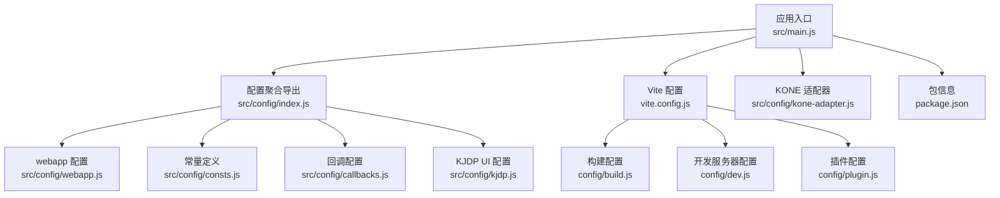
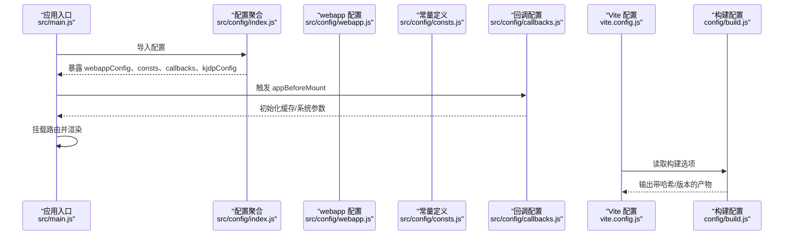
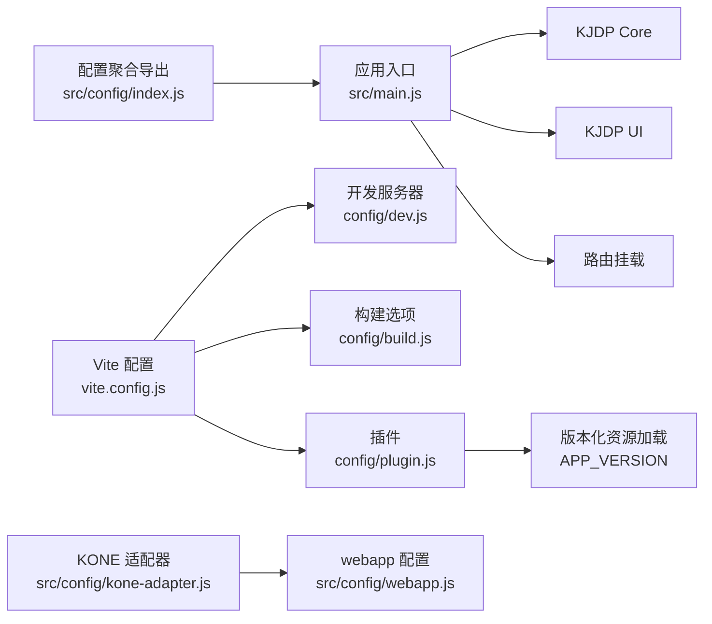

# 应用配置

<cite>
**本文引用的文件**
- [webapp.js](file://src/config/webapp.js)
- [consts.js](file://src/config/consts.js)
- [index.js](file://src/config/index.js)
- [main.js](file://src/main.js)
- [package.json](file://package.json)
- [vite.config.js](file://vite.config.js)
- [plugin.js](file://config/plugin.js)
- [build.js](file://config/build.js)
- [dev.js](file://config/dev.js)
- [kone-adapter.js](file://src/config/kone-adapter.js)
- [callbacks.js](file://src/config/callbacks.js)
- [kjdp.js](file://src/config/kjdp.js)
</cite>

## 目录
1. [简介](#简介)
2. [项目结构](#项目结构)
3. [核心组件](#核心组件)
4. [架构总览](#架构总览)
5. [详细组件分析](#详细组件分析)
6. [依赖分析](#依赖分析)
7. [性能考虑](#性能考虑)
8. [故障排查指南](#故障排查指南)
9. [结论](#结论)
10. [附录](#附录)

## 简介
本文件面向 FS-AOI-WEB 应用的“配置模块”，聚焦以下目标：
- 解释 webapp.js 中的应用基本信息配置（如应用名称、版本、描述等）与运行期行为配置（菜单、头部、Tab、项目、主题、流程标识前缀、高亮主题等）。
- 说明 consts.js 中的常量定义与业务常量配置，帮助开发者理解菜单、组织、权限、流程状态等枚举的含义与取值。
- 解释配置文件的加载机制、优先级规则与继承关系，以及如何在不同环境（开发/生产）中生效。
- 提供配置项的具体含义、默认值与自定义方法，并给出实际配置示例与最佳实践。

## 项目结构
配置模块位于 src/config 目录，核心文件包括：
- webapp.js：应用运行期配置（菜单映射、菜单过滤、头部搜索、Tab 限制、项目行为、系统默认信息、主题、流程标识前缀、高亮主题等）。
- consts.js：业务常量定义（菜单 ID、机构代码、子系统编码、对象类型、操作状态、权限类型、组织类型、流程状态与处理状态等）。
- index.js：配置聚合导出，统一暴露给应用入口。
- callbacks.js：应用生命周期回调（挂载前初始化、版本校验、卸载清理等）。
- kjdp.js：KJDP UI 框架的全局组件默认属性与流程服务接口号配置。
- 其他：vite.config.js、plugin.js、build.js、dev.js、kone-adapter.js、package.json 等共同构成配置加载与构建时的上下文。

图表来源
- [main.js](file://src/main.js#L15-L28)
- [index.js](file://src/config/index.js#L1-L8)
- [webapp.js](file://src/config/webapp.js#L202-L204)
- [consts.js](file://src/config/consts.js#L1-L120)
- [callbacks.js](file://src/config/callbacks.js#L1-L54)
- [kjdp.js](file://src/config/kjdp.js#L1-L59)
- [vite.config.js](file://vite.config.js#L14-L78)
- [build.js](file://config/build.js#L32-L103)
- [dev.js](file://config/dev.js#L4-L38)
- [plugin.js](file://config/plugin.js#L5-L14)
- [kone-adapter.js](file://src/config/kone-adapter.js#L9-L247)
- [package.json](file://package.json#L1-L61)

章节来源
- [main.js](file://src/main.js#L15-L28)
- [index.js](file://src/config/index.js#L1-L8)

## 核心组件
- webapp.js：集中定义菜单字段映射、菜单过滤与记忆、头部搜索范围控制、Tab 数量限制与栈模式、项目行为（登录键名、iframe 格式化、搜索行为、首页加载）、系统默认信息（单位、系统名、环境文本）、主题默认配置、流程任务标识前缀、高亮主题等。
- consts.js：集中定义菜单 ID、机构代码、子系统编码、对象类型、操作状态、权限类型、组织类型、流程状态与处理状态等业务常量，便于跨模块统一引用。
- callbacks.js：应用生命周期回调，包括挂载前初始化缓存、版本校验与轮询、卸载清理定时器等。
- kjdp.js：KJDP UI 框架的全局组件默认属性与流程服务接口号配置，便于统一风格与接口约定。
- 构建与开发配置：vite.config.js、plugin.js、build.js、dev.js、kone-adapter.js、package.json 共同决定配置在不同环境下的加载与生效方式。

章节来源
- [webapp.js](file://src/config/webapp.js#L202-L204)
- [consts.js](file://src/config/consts.js#L1-L120)
- [callbacks.js](file://src/config/callbacks.js#L1-L54)
- [kjdp.js](file://src/config/kjdp.js#L1-L59)
- [vite.config.js](file://vite.config.js#L14-L78)
- [plugin.js](file://config/plugin.js#L5-L14)
- [build.js](file://config/build.js#L32-L103)
- [dev.js](file://config/dev.js#L4-L38)
- [kone-adapter.js](file://src/config/kone-adapter.js#L9-L247)
- [package.json](file://package.json#L1-L61)

## 架构总览
应用启动时，入口文件将配置聚合导出并注入到 KJDP Core/ UI 中，随后按回调顺序挂载路由并渲染页面。配置项通过模块化导出与导入的方式在运行期生效，同时构建脚本与插件负责在生产环境注入版本号与资源命名策略。

图表来源
- [main.js](file://src/main.js#L15-L39)
- [index.js](file://src/config/index.js#L1-L8)
- [webapp.js](file://src/config/webapp.js#L202-L204)
- [consts.js](file://src/config/consts.js#L1-L120)
- [callbacks.js](file://src/config/callbacks.js#L15-L46)
- [vite.config.js](file://vite.config.js#L14-L78)
- [build.js](file://config/build.js#L32-L103)

## 详细组件分析

### webapp.js：应用基本信息与运行期配置
- 应用基本信息
  - 系统默认信息：包含单位代码、单位名称、系统环境文本、系统名称等，用于界面展示与系统识别。
  - 主题默认配置：是否显示主题切换入口、默认主题名称。
- 菜单与头部
  - 菜单字段映射：定义菜单 ID、名称、子节点、图标、父 ID、链接、类型、用途、首页标记等字段名映射，确保与后端返回结构一致。
  - 菜单过滤与记忆：可按用途过滤菜单列表；支持父菜单无可用子菜单时自动关闭；支持菜单记忆。
  - 顶部头部搜索：可配置搜索屏蔽的菜单与可搜索父级菜单。
- Tab 页签
  - 最大打开数量限制、排除计算的菜单集合、关闭后是否回到上次打开的 Tab。
- 项目行为
  - 登录键名（登录数据与 Token），是否在 iframe 中运行，URL 参数是否加密。
  - iframe 链接格式化：根据菜单链接前缀、BASE_PATH、KONE 环境参数动态拼装 URL；支持 ksot-sync/kotc-sync 前缀。
  - 搜索行为：是否过滤页签路由、失去焦点后清空、是否可删除历史。
  - 首页加载：是否启用初始加载指示。
  - 全屏显示：是否显示门户导航栏放大按钮。
- 默认首页模板
  - 收藏菜单与历史菜单展示开关、菜单链接优先展示策略。
- 异常菜单提示
  - 未查询到菜单配置、未查询到链接、菜单未启用、交易日/普通日时段限制等提示文案。
- 流程与高亮
  - 流程图用户任务标识前缀（受理、审核、自动、差错）。
  - highlight.js 主题配置。

章节来源
- [webapp.js](file://src/config/webapp.js#L25-L254)

### consts.js：常量定义与业务常量
- 菜单 ID：管理门户、我的门户、常用菜单设置等菜单编号。
- 机构代码：多家券商的机构代码映射，便于跨机构适配。
- 子系统编码：基础框架、账户系统、后台业务系统、经纪订单系统、资金管理系统、OTC、个股期权、影像、Win/U版交易、视频见证、统一认证等子系统编码。
- 对象类型：员工、岗位。
- 操作状态：正常、锁定、冻结、挂失、不合格、休眠、注销。
- 权限类型：新增、修改、删除、查询、执行、授权、受理、审核、管理、质检、导入、导出、下载、打印、收藏、特殊。
- 组织类型：内部机构、银行、交易所/登记机构、基金公司、期货公司。
- 流程状态与处理状态：受理、待审核、审核中、待差错处理、差错处理中、驳回、完成、作废、跑批中；未处理、处理中、处理完成、作废。

章节来源
- [consts.js](file://src/config/consts.js#L1-L120)

### 配置加载机制、优先级与继承关系
- 加载机制
  - 应用入口通过统一导出的配置对象注入到 KJDP Core/UI，实现配置在运行期生效。
  - 构建阶段由 Vite 读取配置，插件在生产且非 hash 模式下注入版本号，作为资源加载的版本标识。
- 优先级规则
  - 运行期配置：webapp.js 中的默认配置可被业务代码覆盖；例如菜单过滤、头部搜索、Tab 限制等均可在业务层按需调整。
  - 构建期配置：APP_VERSION 环境变量决定版本注入；hash 模式影响产物命名策略。
- 继承关系
  - 配置聚合导出 index.js 将 webapp、consts、callbacks、kjdp 等配置统一暴露，避免重复导入。
  - KONE 适配器在 KONE 环境下动态调整 URL 格式化与会话处理，与 webapp 的 iframe 格式化逻辑协同。

章节来源
- [index.js](file://src/config/index.js#L1-L8)
- [main.js](file://src/main.js#L15-L28)
- [vite.config.js](file://vite.config.js#L14-L78)
- [plugin.js](file://config/plugin.js#L5-L14)
- [build.js](file://config/build.js#L32-L103)
- [kone-adapter.js](file://src/config/kone-adapter.js#L9-L247)

### 配置项含义、默认值与自定义方法
- 应用基本信息
  - systemConfig：默认单位代码、单位名称、系统环境文本、系统名称，可在业务层按需覆盖。
  - themesConfig：默认是否显示主题切换入口、默认主题名称，可在业务层按需覆盖。
- 菜单与头部
  - menuMap：字段映射默认值，若后端字段变更，需同步调整。
  - menuConfig.menuListFilter：默认为空，按用途过滤菜单；可通过添加过滤条件实现业务定制。
  - pageHeaderConfig.searchMaskMenu/searchParentMenu：默认为空数组，按需添加屏蔽/可搜索菜单 ID。
- Tab 页签
  - tabsConfig.maxNum：默认 10，可根据业务并发需求调整。
  - tabsConfig.excludeMenu：默认空数组，可排除特定菜单计入上限。
  - tabsConfig.stackMode：默认 true，关闭 Tab 后回到上次打开的 Tab。
- 项目行为
  - projectConfig.login.loginDataKey/loginTokenKey：默认键名，建议与后端一致。
  - projectConfig.isInIframe/urlEncrypt：默认 false，按部署环境调整。
  - projectConfig.iframe.formatUrl：默认格式化逻辑，支持 http、ksot-sync/kotc-sync、BASE_PATH 等场景；可在业务层扩展。
  - projectConfig.search.filterTabMenu/clearOnBlur/removeHistory：默认 false/true/false，按用户体验调整。
  - projectConfig.index.enableInitialLoading：默认 false，按首屏体验调整。
  - projectConfig.showFullScreen：默认 true，按门户设计调整。
- 默认首页模板
  - defaultHomePageConfig.showFavMenu/showHisMenu/menuLinkFirst：默认 true/false/false，按首页布局调整。
- 异常菜单提示
  - tabErrorTip：默认文案，可按国际化与业务规范调整。
- 流程与高亮
  - flowResIdPrefix：默认受理/审核/自动/差错前缀，按流程规范调整。
  - highlightConfig.theme：默认 github-dark，按主题风格调整。

章节来源
- [webapp.js](file://src/config/webapp.js#L25-L254)

### 实际配置示例与最佳实践
- 示例：自定义菜单过滤
  - 在业务模块中引入 webappConfig，设置 menuConfig.menuListFilter.MENU_PUR 为 '1'，以屏蔽用途为 '1' 的菜单。
- 示例：自定义 iframe 链接格式化
  - 在业务模块中重写 projectConfig.iframe.formatUrl，增加自定义前缀或参数拼装逻辑。
- 示例：启用主题切换
  - 将 themesConfig.isShowThemeChange 设为 true，并在主题目录中提供对应主题文件。
- 示例：限制 Tab 数量
  - 将 tabsConfig.maxNum 调整为 8，并在 excludeMenu 中加入不计入上限的菜单 ID。
- 示例：注入版本号
  - 生产构建时设置 APP_VERSION 环境变量，确保资源版本化与缓存失效可控。
- 最佳实践
  - 将与后端约定的字段映射集中在 menuMap，避免散落配置。
  - 将业务常量集中在 consts.js，跨模块统一引用，减少魔法字符串。
  - 在 KONE 环境下，遵循 KONE 适配器的 URL 格式化与会话处理逻辑。
  - 构建时使用版本化资源，避免缓存问题；在开发环境保持简洁可调试。

章节来源
- [webapp.js](file://src/config/webapp.js#L65-L189)
- [consts.js](file://src/config/consts.js#L1-L120)
- [kone-adapter.js](file://src/config/kone-adapter.js#L9-L247)
- [vite.config.js](file://vite.config.js#L14-L78)
- [plugin.js](file://config/plugin.js#L5-L14)

## 依赖分析
- 配置聚合导出
  - index.js 将 webapp、consts、callbacks、kjdp 等配置统一导出，降低入口文件复杂度。
- 应用入口依赖
  - main.js 使用 KjdpCore/KjdpUI 注入配置，并在回调中挂载路由与渲染。
- 构建与插件
  - vite.config.js 读取 dev/build/plugin 配置；plugin.js 在生产且非 hash 模式下注入版本号；build.js 控制产物命名与分包策略。
- KONE 适配
  - kone-adapter.js 提供 KONE 环境下的 URL 格式化、会话续期与消息处理，与 webapp 的 iframe 格式化逻辑协同。

图表来源
- [index.js](file://src/config/index.js#L1-L8)
- [main.js](file://src/main.js#L15-L39)
- [vite.config.js](file://vite.config.js#L14-L78)
- [dev.js](file://config/dev.js#L4-L38)
- [build.js](file://config/build.js#L32-L103)
- [plugin.js](file://config/plugin.js#L5-L14)
- [kone-adapter.js](file://src/config/kone-adapter.js#L9-L247)
- [webapp.js](file://src/config/webapp.js#L202-L204)

章节来源
- [index.js](file://src/config/index.js#L1-L8)
- [main.js](file://src/main.js#L15-L39)
- [vite.config.js](file://vite.config.js#L14-L78)
- [plugin.js](file://config/plugin.js#L5-L14)
- [build.js](file://config/build.js#L32-L103)
- [dev.js](file://config/dev.js#L4-L38)
- [kone-adapter.js](file://src/config/kone-adapter.js#L9-L247)

## 性能考虑
- 构建产物命名与缓存
  - 使用 hash 模式或版本化资源，避免浏览器缓存导致的样式/脚本不一致。
  - 分包策略按第三方库与页面模块拆分，提升缓存命中率。
- 开发体验
  - 开发服务器代理配置清晰，便于联调后端接口与静态资源。
- 运行期性能
  - 通过 callbacks 的版本轮询与缓存初始化，减少不必要的网络请求与重复初始化。
  - Tabs 数量限制与排除策略有助于控制页面并发，避免内存与渲染压力。

## 故障排查指南
- 版本不一致告警
  - appMounted 中定期检查版本，若前端版本与后端版本不一致，弹窗提示用户清理缓存或退出客户端。
- 会话过期处理
  - 在 KONE 环境下，当响应状态码或错误码匹配会话过期时，触发刷新 JWT 并重试请求。
- iframe 链接异常
  - 检查 projectConfig.iframe.formatUrl 的 BASE_PATH、菜单链接前缀与 KONE 环境参数，确保 URL 拼装正确。
- 菜单不可见或无法打开
  - 检查 menuConfig.menuListFilter 与 menuMap 字段映射，确认用途过滤与字段名一致。
- Tab 数量超限
  - 调整 tabsConfig.maxNum 与 excludeMenu，确保关键菜单不被排除。

章节来源
- [callbacks.js](file://src/config/callbacks.js#L19-L46)
- [kone-adapter.js](file://src/config/kone-adapter.js#L124-L162)
- [webapp.js](file://src/config/webapp.js#L138-L170)
- [webapp.js](file://src/config/webapp.js#L65-L84)
- [webapp.js](file://src/config/webapp.js#L122-L126)

## 结论
FS-AOI-WEB 的配置模块通过模块化导出与运行期注入，实现了菜单、头部、Tab、项目行为、系统默认信息、主题、流程标识与高亮主题等多维度的统一配置。结合 Vite 构建与插件机制，可在不同环境下灵活控制资源版本与加载策略。建议在业务开发中遵循统一的字段映射与常量定义，合理利用回调与适配器能力，确保配置的一致性与可维护性。

## 附录
- 关键配置项速查
  - systemConfig：单位代码、单位名称、系统环境文本、系统名称
  - themesConfig：是否显示主题切换、默认主题
  - menuMap：菜单字段映射
  - menuConfig：菜单过滤、自动关闭父菜单、菜单记忆
  - pageHeaderConfig：头部搜索屏蔽与父级搜索
  - tabsConfig：最大数量、排除菜单、栈模式
  - projectConfig：登录键名、iframe 格式化、搜索行为、首页加载、全屏显示
  - defaultHomePageConfig：收藏/历史展示与链接优先
  - flowResIdPrefix：流程任务标识前缀
  - highlightConfig：高亮主题
- 常量定义速查
  - 菜单 ID、机构代码、子系统编码、对象类型、操作状态、权限类型、组织类型、流程状态与处理状态