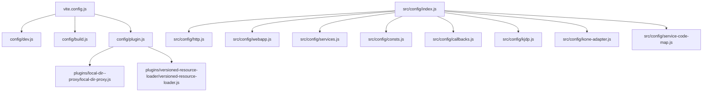
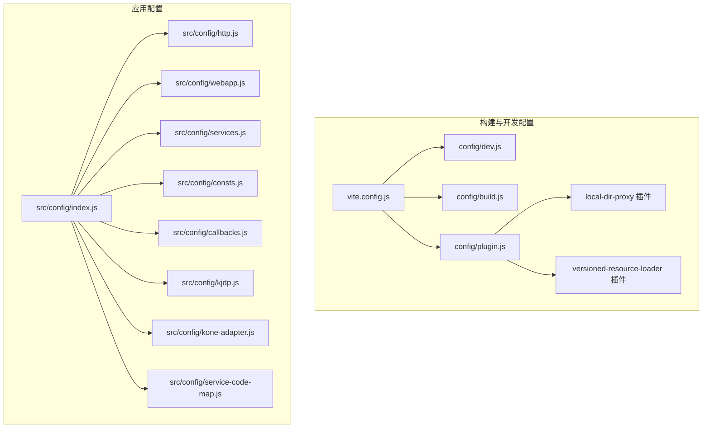
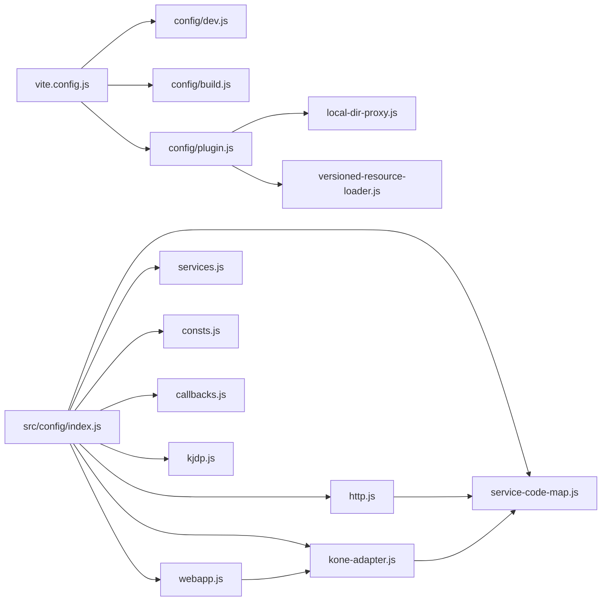

# 配置系统

<cite>
**本文引用的文件**
- [vite.config.js](file://vite.config.js)
- [package.json](file://package.json)
- [config/dev.js](file://config/dev.js)
- [config/build.js](file://config/build.js)
- [config/plugin.js](file://config/plugin.js)
- [config/plugins/local-dir--proxy/local-dir-proxy.js](file://config/plugins/local-dir--proxy/local-dir-proxy.js)
- [config/plugins/versioned-resource-loader/versioned-resource-loader.js](file://config/plugins/versioned-resource-loader/versioned-resource-loader.js)
- [src/config/index.js](file://src/config/index.js)
- [src/config/http.js](file://src/config/http.js)
- [src/config/webapp.js](file://src/config/webapp.js)
- [src/config/services.js](file://src/config/services.js)
- [src/config/consts.js](file://src/config/consts.js)
- [src/config/callbacks.js](file://src/config/callbacks.js)
- [src/config/kjdp.js](file://src/config/kjdp.js)
- [src/config/kone-adapter.js](file://src/config/kone-adapter.js)
- [src/config/service-code-map.js](file://src/config/service-code-map.js)
</cite>

## 目录
1. [简介](#简介)
2. [项目结构](#项目结构)
3. [核心组件](#核心组件)
4. [架构总览](#架构总览)
5. [详细组件分析](#详细组件分析)
6. [依赖关系分析](#依赖关系分析)
7. [性能考量](#性能考量)
8. [故障排查指南](#故障排查指南)
9. [结论](#结论)
10. [附录](#附录)

## 简介
本文件面向 FS-AOI-WEB 配置系统，系统性梳理配置架构、配置文件组织与配置管理机制。文档覆盖应用配置、服务配置、常量配置、HTTP 配置、构建与开发配置、插件配置等，解释配置加载顺序、优先级与继承机制，给出配置项含义、默认行为与自定义方法，并提供扩展指南与最佳实践，帮助开发者高效理解与维护配置体系。

## 项目结构
FS-AOI-WEB 的配置体系分为两大层面：
- 构建与开发配置：位于 config/ 目录，通过 Vite 配置文件集中加载，控制开发服务器、构建产物命名与分包策略、插件装配等。
- 应用配置：位于 src/config/ 目录，按职责拆分为 HTTP 配置、Web 应用配置、服务接口号映射、常量、回调钩子、KJDP UI 扩展、KONE 适配器、服务编码映射等模块，统一导出入口便于消费。

图表来源
- [vite.config.js](file://vite.config.js#L1-L80)
- [config/dev.js](file://config/dev.js#L1-L39)
- [config/build.js](file://config/build.js#L1-L104)
- [config/plugin.js](file://config/plugin.js#L1-L17)
- [config/plugins/local-dir--proxy/local-dir-proxy.js](file://config/plugins/local-dir--proxy/local-dir-proxy.js#L1-L39)
- [config/plugins/versioned-resource-loader/versioned-resource-loader.js](file://config/plugins/versioned-resource-loader/versioned-resource-loader.js#L1-L193)
- [src/config/index.js](file://src/config/index.js#L1-L8)

章节来源
- [vite.config.js](file://vite.config.js#L1-L80)
- [package.json](file://package.json#L1-L61)

## 核心组件
- 构建与开发配置
  - 开发服务器与代理：dev.js 提供端口、主机、代理规则与请求头注入。
  - 构建选项：build.js 控制 sourcemap、输出命名、分包策略、异步依赖目录与命名。
  - 插件装配：plugin.js 组合 Vue 插件、本地目录代理插件、生产版本化资源加载插件。
  - 插件实现：local-dir-proxy 实现本地静态资源直返；versioned-resource-loader 在 HTML 与模块中注入版本参数并改写资源 URL。
- 应用配置
  - HTTP 配置：统一错误处理、加密开关、请求/响应拦截、URL 映射与验证码配置。
  - Web 应用配置：菜单映射、菜单过滤与记忆、页签限制、门户与 iframe 打开策略、搜索与首页配置、主题与高亮配置。
  - 服务接口号映射：以服务编码映射到具体服务基础路径，支持多系统与动态前缀。
  - 常量配置：组织菜单 ID、机构代码、子系统、对象类型、操作状态、权限类型、组织类型、流程与处理状态等。
  - 回调钩子：应用挂载前后、版本校验、默认激活门户等生命周期回调。
  - KJDP UI 扩展：全局组件默认属性、校验规则、流程服务接口号。
  - KONE 适配器：KONE 模式下的 JWT 刷新、消息通信、系统状态与菜单打开。
  - 服务编码映射：根据服务编码推导请求前缀与 fsapi 后缀，兼容特殊接口。

章节来源
- [config/dev.js](file://config/dev.js#L1-L39)
- [config/build.js](file://config/build.js#L1-L104)
- [config/plugin.js](file://config/plugin.js#L1-L17)
- [config/plugins/local-dir--proxy/local-dir-proxy.js](file://config/plugins/local-dir--proxy/local-dir-proxy.js#L1-L39)
- [config/plugins/versioned-resource-loader/versioned-resource-loader.js](file://config/plugins/versioned-resource-loader/versioned-resource-loader.js#L1-L193)
- [src/config/http.js](file://src/config/http.js#L1-L124)
- [src/config/webapp.js](file://src/config/webapp.js#L1-L254)
- [src/config/services.js](file://src/config/services.js#L1-L28)
- [src/config/consts.js](file://src/config/consts.js#L1-L120)
- [src/config/callbacks.js](file://src/config/callbacks.js#L1-L54)
- [src/config/kjdp.js](file://src/config/kjdp.js#L1-L59)
- [src/config/kone-adapter.js](file://src/config/kone-adapter.js#L1-L248)
- [src/config/service-code-map.js](file://src/config/service-code-map.js#L1-L129)

## 架构总览
FS-AOI-WEB 的配置系统遵循“构建配置驱动应用配置”的原则：
- Vite 通过 vite.config.js 加载 config/ 下的开发与构建配置，并装配插件。
- 应用层通过 src/config/index.js 统一导出各类配置模块，供业务页面与服务模块按需导入。
- 插件在开发阶段增强本地资源访问能力，在生产阶段为资源注入版本参数，提升缓存命中与灰度能力。

图表来源
- [vite.config.js](file://vite.config.js#L1-L80)
- [config/dev.js](file://config/dev.js#L1-L39)
- [config/build.js](file://config/build.js#L1-L104)
- [config/plugin.js](file://config/plugin.js#L1-L17)
- [src/config/index.js](file://src/config/index.js#L1-L8)

## 详细组件分析

### 构建与开发配置

#### 开发服务器与代理（dev.js）
- 端口与主机：可被外部访问，便于联调。
- 代理规则：对 copweb、uasweb、idmweb 与 api 前缀分别代理至静态服务器与网关，支持跨域与自定义请求头注入。
- 适用场景：本地联调多子系统前端与后端接口。

章节来源
- [config/dev.js](file://config/dev.js#L1-L39)

#### 构建选项（build.js）
- Source Map：开启以辅助定位问题。
- 输出命名：支持 hash 模式与非 hash 模式，区分入口、资源与分包文件命名。
- 分包策略：将异步依赖打包到独立目录，自定义第三方包分组，将 src 内容按目录结构进行哈希处理，提升缓存命中。
- 适用场景：生产构建优化资源体积与缓存策略。

章节来源
- [config/build.js](file://config/build.js#L1-L104)

#### 插件装配（plugin.js）
- 组合 Vue 插件与两个自研插件：本地目录代理与版本化资源加载。
- 条件启用：仅在生产且非 hash 模式下启用版本化资源加载插件。
- 适用场景：开发阶段本地直返静态资源，生产阶段资源版本化以提升缓存与灰度能力。

章节来源
- [config/plugin.js](file://config/plugin.js#L1-L17)

#### 本地目录代理插件（local-dir-proxy）
- 作用：当代理目标为本地绝对路径时，直接读取文件系统并返回，避免跨域与代理失败。
- 规则：匹配 /{子系统web}/... 形式的 URL，解析目标路径并读取文件，不存在时返回 404。
- 适用场景：本地调试多子系统前端资源。

章节来源
- [config/plugins/local-dir--proxy/local-dir-proxy.js](file://config/plugins/local-dir--proxy/local-dir-proxy.js#L1-L39)

#### 版本化资源加载插件（versioned-resource-loader）
- 作用：在 HTML 与模块中为 JS 资源注入版本参数，改写 script/link/img 等元素的 src/href，确保浏览器拉取最新资源。
- 参数：默认版本、参数名、跳过协议、包含的动态模块通配符。
- 适用场景：生产环境资源缓存控制与灰度发布。

章节来源
- [config/plugins/versioned-resource-loader/versioned-resource-loader.js](file://config/plugins/versioned-resource-loader/versioned-resource-loader.js#L1-L193)

### 应用配置

#### HTTP 配置（http.js）
- 成功码：基于服务端返回的 MSG_CODE 判定请求成功与否。
- 服务基础路径：通过服务编码映射函数动态获取。
- 加密与安全：支持请求加密开关与响应异常拦截（KONE 模式下自动刷新 Token）。
- 错误处理：统一错误弹窗，支持 traceId 展示。
- 通用请求数据扩展：从路由 query 注入菜单上下文。
- URL 映射：会话、认证、用户、上传下载等常用接口地址。
- 验证码：登录失败触发验证码的开关与 msgCode 列表。
- 适用场景：统一前后端交互规范与错误处理。

章节来源
- [src/config/http.js](file://src/config/http.js#L1-L124)

#### Web 应用配置（webapp.js）
- 菜单映射：定义菜单树字段映射与类型枚举。
- 菜单过滤与记忆：支持过滤特定 PUR 类型菜单、自动关闭无可用子菜单的父菜单、菜单记忆。
- 页签限制：最大页签数、排除菜单、关闭后恢复上次打开页签。
- 项目配置：登录数据键名、iframe 打开策略（格式化 URL 与前缀）、搜索行为、初始加载、全屏按钮显示。
- 默认首页模板：收藏菜单、历史菜单展示与链接优先策略。
- 系统默认值：机构代码、机构名称、系统环境与名称。
- 主题与高亮：主题切换开关与默认主题、highlight.js 主题。
- 适用场景：门户菜单、页签与首页行为的统一配置。

章节来源
- [src/config/webapp.js](file://src/config/webapp.js#L1-L254)

#### 服务接口号映射（services.js）
- 以服务编码映射到具体接口号，支持门户、菜单、常用菜单、字典、系统参数、省市区、机构等模块。
- 子系统开关与默认值：可按需启用子系统功能并设置默认子系统。
- 适用场景：业务模块与后端接口对接时的编码一致性。

章节来源
- [src/config/services.js](file://src/config/services.js#L1-L28)

#### 常量配置（consts.js）
- 菜单 ID：门户与我的菜单、常用菜单设置等。
- 机构代码：多家券商的机构代码映射。
- 子系统：多个子系统的标识。
- 对象类型、操作状态、权限类型、组织类型：统一枚举。
- 流程与处理状态：受理、审核、完成、作废等状态码。
- 适用场景：前端路由跳转、菜单检索、状态判断与权限控制。

章节来源
- [src/config/consts.js](file://src/config/consts.js#L1-L120)

#### 回调钩子（callbacks.js）
- 应用挂载前：初始化系统参数缓存。
- 应用挂载后：定时检查版本差异并提示升级。
- 默认激活门户：可自定义默认激活的门户。
- 同步数据：预留同步数据处理回调。
- 适用场景：应用生命周期内的初始化与版本管理。

章节来源
- [src/config/callbacks.js](file://src/config/callbacks.js#L1-L54)

#### KJDP UI 扩展（kjdp.js）
- 全局组件默认属性：如输入框可清空、对话框点击遮罩关闭策略、表格尺寸与条纹等。
- 校验规则扩展：预留手机号等校验规则。
- 流程服务接口号：受理、审核、保存、提交等流程相关接口号。
- 适用场景：统一 UI 组件风格与流程交互。

章节来源
- [src/config/kjdp.js](file://src/config/kjdp.js#L1-L59)

#### KONE 适配器（kone-adapter.js）
- KONE 模式识别：通过 URL 参数判断是否处于 KONE 环境。
- Token 刷新：监听来自 KJDP 的刷新消息，向后端请求新 Token 并更新会话。
- 请求重发：在刷新 Token 后重试原请求。
- 系统状态：版本、更新时间、运行状态与日期。
- 适用场景：在 KONE 容器内统一认证与会话管理。

章节来源
- [src/config/kone-adapter.js](file://src/config/kone-adapter.js#L1-L248)

#### 服务编码映射（service-code-map.js）
- 请求前缀推导：根据 URL 参数 sysName 或服务编码推导基础路径，支持多系统映射。
- 服务基础路径：根据服务编码映射到具体服务名并拼接 fsapi 后缀，兼容无 fsapi 的特殊接口。
- 影像系统前缀：单独提供 IDI 前缀。
- 适用场景：多系统接口统一前缀与路径拼接。

章节来源
- [src/config/service-code-map.js](file://src/config/service-code-map.js#L1-L129)

### 统一导出入口（src/config/index.js）
- 将 HTTP、Web 应用、服务、常量、回调、KJDP 配置统一导出，便于业务模块按需导入。
- 适用场景：减少重复导入与命名冲突。

章节来源
- [src/config/index.js](file://src/config/index.js#L1-L8)

## 依赖关系分析

图表来源
- [vite.config.js](file://vite.config.js#L1-L80)
- [config/dev.js](file://config/dev.js#L1-L39)
- [config/build.js](file://config/build.js#L1-L104)
- [config/plugin.js](file://config/plugin.js#L1-L17)
- [config/plugins/local-dir--proxy/local-dir-proxy.js](file://config/plugins/local-dir--proxy/local-dir-proxy.js#L1-L39)
- [config/plugins/versioned-resource-loader/versioned-resource-loader.js](file://config/plugins/versioned-resource-loader/versioned-resource-loader.js#L1-L193)
- [src/config/index.js](file://src/config/index.js#L1-L8)
- [src/config/http.js](file://src/config/http.js#L1-L124)
- [src/config/webapp.js](file://src/config/webapp.js#L1-L254)
- [src/config/services.js](file://src/config/services.js#L1-L28)
- [src/config/consts.js](file://src/config/consts.js#L1-L120)
- [src/config/callbacks.js](file://src/config/callbacks.js#L1-L54)
- [src/config/kjdp.js](file://src/config/kjdp.js#L1-L59)
- [src/config/kone-adapter.js](file://src/config/kone-adapter.js#L1-L248)
- [src/config/service-code-map.js](file://src/config/service-code-map.js#L1-L129)

## 性能考量
- 构建分包与缓存：通过 build.js 的 manualChunks 与哈希命名策略，将第三方库与业务代码分离，提升缓存命中率。
- 生产资源版本化：versioned-resource-loader 在 JS 资源注入版本参数，避免浏览器缓存导致的灰度失败。
- 代理直返本地资源：local-dir-proxy 在开发阶段避免代理失败与跨域问题，提升调试效率。
- 日志与告警：HTTP 配置中的错误弹窗与 traceId 有助于快速定位问题，降低排障成本。

## 故障排查指南
- 开发代理 404
  - 现象：访问 /{子系统web}/... 返回 404。
  - 排查：确认 dev.js 中代理 target 是否指向本地绝对路径，且文件存在。
  - 参考
    - [config/dev.js](file://config/dev.js#L9-L36)
    - [config/plugins/local-dir--proxy/local-dir-proxy.js](file://config/plugins/local-dir--proxy/local-dir-proxy.js#L25-L34)
- 生产资源缓存问题
  - 现象：更新资源后浏览器仍使用旧版本。
  - 排查：确认是否启用版本化资源加载插件，检查 APP_VERSION 环境变量是否正确传入。
  - 参考
    - [vite.config.js](file://vite.config.js#L14-L29)
    - [config/plugin.js](file://config/plugin.js#L8-L13)
    - [config/plugins/versioned-resource-loader/versioned-resource-loader.js](file://config/plugins/versioned-resource-loader/versioned-resource-loader.js#L123-L187)
- HTTP 请求失败
  - 现象：接口返回错误或弹窗提示。
  - 排查：检查 http.js 中的 errorConfig.messageHandler 与 successCodes，确认服务编码映射与 baseURL。
  - 参考
    - [src/config/http.js](file://src/config/http.js#L67-L85)
    - [src/config/service-code-map.js](file://src/config/service-code-map.js#L85-L121)
- KONE 模式下会话过期
  - 现象：提示会话或认证过期并要求重新登录。
  - 排查：确认 KONE 模式识别与 Token 刷新流程，检查 response 中的 MSG_CODE 与 http 状态码。
  - 参考
    - [src/config/kone-adapter.js](file://src/config/kone-adapter.js#L124-L162)
    - [src/config/kone-adapter.js](file://src/config/kone-adapter.js#L46-L110)

章节来源
- [config/dev.js](file://config/dev.js#L9-L36)
- [config/plugins/local-dir--proxy/local-dir-proxy.js](file://config/plugins/local-dir--proxy/local-dir-proxy.js#L25-L34)
- [vite.config.js](file://vite.config.js#L14-L29)
- [config/plugin.js](file://config/plugin.js#L8-L13)
- [config/plugins/versioned-resource-loader/versioned-resource-loader.js](file://config/plugins/versioned-resource-loader/versioned-resource-loader.js#L123-L187)
- [src/config/http.js](file://src/config/http.js#L67-L85)
- [src/config/service-code-map.js](file://src/config/service-code-map.js#L85-L121)
- [src/config/kone-adapter.js](file://src/config/kone-adapter.js#L124-L162)
- [src/config/kone-adapter.js](file://src/config/kone-adapter.js#L46-L110)

## 结论
FS-AOI-WEB 配置系统以 Vite 为核心，结合本地代理与资源版本化插件，实现了开发与生产的高效协同；应用层通过统一导出入口整合 HTTP、Web 应用、服务编码、常量、回调、UI 扩展与 KONE 适配器，形成清晰的配置分层与职责边界。建议在扩展新配置时遵循“按模块拆分、统一导出、最小暴露”的原则，并在生产构建中严格校验版本参数与分包策略，确保稳定性与可维护性。

## 附录

### 配置加载顺序与优先级
- 构建阶段
  - Vite 读取 vite.config.js，按命令与模式输出日志与警告。
  - 开发模式：加载 dev.js 的 serverOptions，装配插件。
  - 生产模式：加载 build.js 的 buildOptions，按 BUILD_MODE 决定是否启用版本化资源加载插件。
- 应用阶段
  - 业务模块通过 src/config/index.js 导入所需配置，按需组合使用。

章节来源
- [vite.config.js](file://vite.config.js#L14-L29)
- [config/dev.js](file://config/dev.js#L1-L39)
- [config/build.js](file://config/build.js#L1-L104)
- [config/plugin.js](file://config/plugin.js#L1-L17)
- [src/config/index.js](file://src/config/index.js#L1-L8)

### 配置项含义、默认值与自定义方法
- 开发服务器与代理
  - 端口与主机：默认 8080 与 0.0.0.0，可按需调整。
  - 代理：支持多前缀与跨域，可自定义请求头注入。
  - 参考
    - [config/dev.js](file://config/dev.js#L4-L36)
- 构建输出与分包
  - 命名策略：支持 hash 与非 hash，入口、资源与分包文件命名可定制。
  - 分包：第三方库与业务代码分离，异步依赖独立目录。
  - 参考
    - [config/build.js](file://config/build.js#L32-L102)
- 插件
  - 本地目录代理：将代理目标为本地绝对路径时直返文件。
  - 版本化资源加载：在 JS 资源注入版本参数，避免缓存污染。
  - 参考
    - [config/plugins/local-dir--proxy/local-dir-proxy.js](file://config/plugins/local-dir--proxy/local-dir-proxy.js#L8-L36)
    - [config/plugins/versioned-resource-loader/versioned-resource-loader.js](file://config/plugins/versioned-resource-loader/versioned-resource-loader.js#L3-L16)
- HTTP 配置
  - 成功码、错误处理、加密开关、通用请求数据扩展、URL 映射、验证码。
  - 参考
    - [src/config/http.js](file://src/config/http.js#L27-L121)
- Web 应用配置
  - 菜单映射、过滤与记忆、页签限制、门户与 iframe 打开策略、搜索与首页配置、主题与高亮。
  - 参考
    - [src/config/webapp.js](file://src/config/webapp.js#L41-L254)
- 服务编码映射
  - 基于 URL 参数与服务编码推导请求前缀，兼容特殊接口。
  - 参考
    - [src/config/service-code-map.js](file://src/config/service-code-map.js#L25-L121)
- 常量与回调
  - 常量：统一枚举，便于跨模块使用。
  - 回调：应用生命周期钩子，支持版本校验与默认门户。
  - 参考
    - [src/config/consts.js](file://src/config/consts.js#L1-L120)
    - [src/config/callbacks.js](file://src/config/callbacks.js#L15-L46)

### 配置扩展指南与最佳实践
- 新增配置模块
  - 在 src/config 下新建模块文件，导出默认配置对象与命名导出。
  - 在 src/config/index.js 中统一导出，避免分散导入。
  - 参考
    - [src/config/index.js](file://src/config/index.js#L1-L8)
- HTTP 配置扩展
  - 通过 errorConfig.messageHandler 自定义错误弹窗内容与样式。
  - 通过 reqCommDataExtend 扩展通用请求数据。
  - 参考
    - [src/config/http.js](file://src/config/http.js#L67-L85)
- Web 应用配置扩展
  - 通过 menuConfig 与 tabsConfig 控制菜单与页签行为。
  - 通过 projectConfig.iframe.formatUrl 自定义 iframe 打开策略。
  - 参考
    - [src/config/webapp.js](file://src/config/webapp.js#L65-L189)
- 服务编码映射扩展
  - 在 service-code-map 中增加服务编码映射或 URL 参数映射。
  - 参考
    - [src/config/service-code-map.js](file://src/config/service-code-map.js#L68-L121)
- 插件扩展
  - 开发阶段：通过 local-dir-proxy 直接访问本地资源。
  - 生产阶段：通过 versioned-resource-loader 注入版本参数，确保缓存可控。
  - 参考
    - [config/plugins/local-dir--proxy/local-dir-proxy.js](file://config/plugins/local-dir--proxy/local-dir-proxy.js#L8-L36)
    - [config/plugins/versioned-resource-loader/versioned-resource-loader.js](file://config/plugins/versioned-resource-loader/versioned-resource-loader.js#L3-L16)
- 最佳实践
  - 明确职责边界：HTTP、Web 应用、服务编码、常量、回调、UI 扩展、KONE 适配器各司其职。
  - 统一导出：通过 index.js 集中导出，减少重复导入。
  - 生产构建校验：严格校验 APP_VERSION 与 BUILD_MODE，确保资源版本化生效。
  - 错误处理：统一错误弹窗与 traceId，便于快速定位问题。