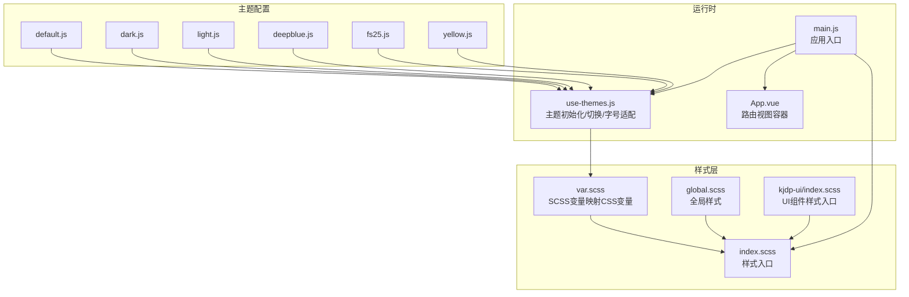
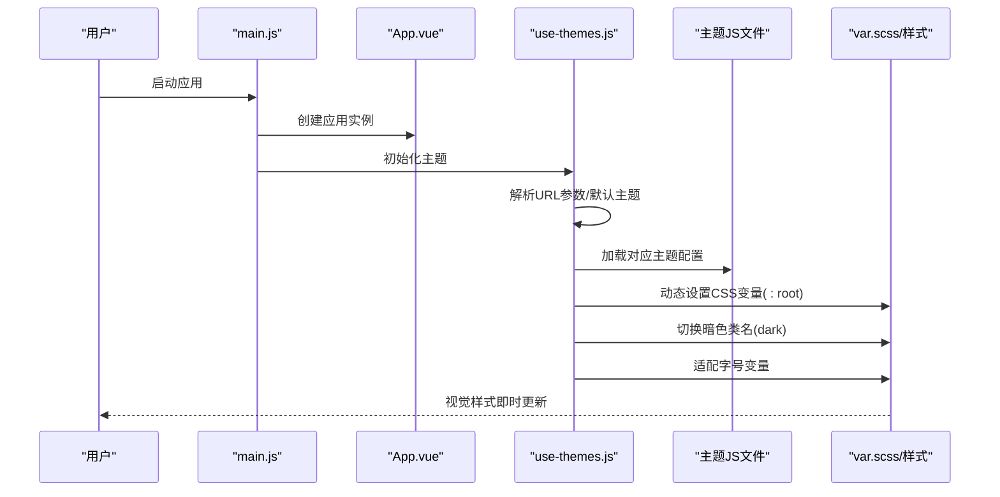
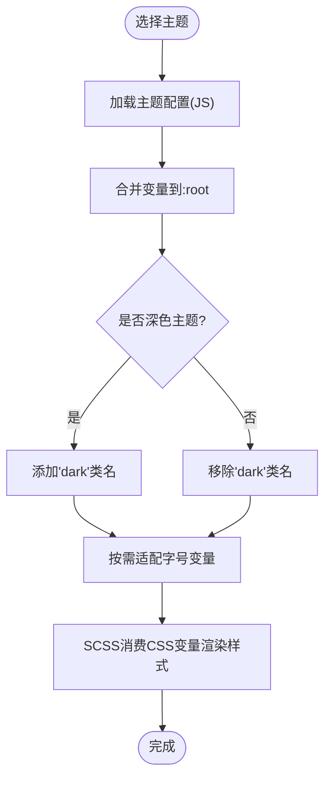
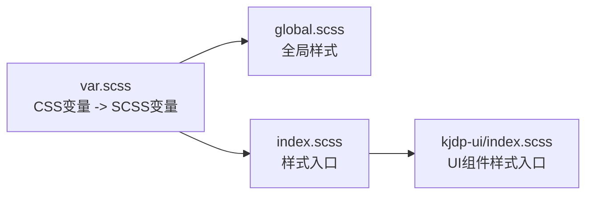
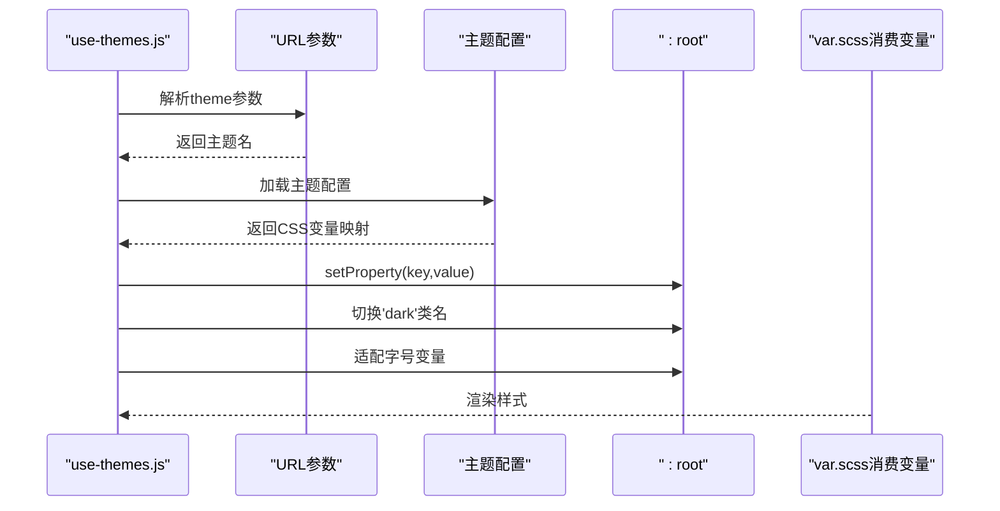
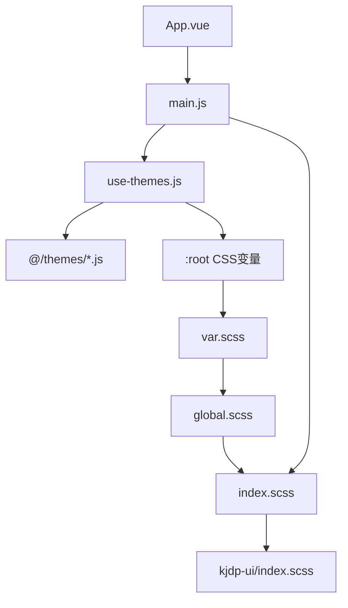

# 主题系统

<cite>
**本文引用的文件**
- [src/themes/default.js](file://src/themes/default.js)
- [src/themes/dark.js](file://src/themes/dark.js)
- [src/themes/light.js](file://src/themes/light.js)
- [src/themes/deepblue.js](file://src/themes/deepblue.js)
- [src/themes/fs25.js](file://src/themes/fs25.js)
- [src/themes/yellow.js](file://src/themes/yellow.js)
- [src/assets/styles/var.scss](file://src/assets/styles/var.scss)
- [src/assets/styles/global.scss](file://src/assets/styles/global.scss)
- [src/assets/styles/index.scss](file://src/assets/styles/index.scss)
- [src/assets/styles/kjdp-ui/index.scss](file://src/assets/styles/kjdp-ui/index.scss)
- [src/portal/hooks/use-themes.js](file://src/portal/hooks/use-themes.js)
- [src/main.js](file://src/main.js)
- [src/App.vue](file://src/App.vue)
- [src/config/index.js](file://src/config/index.js)
</cite>

## 目录
1. [简介](#简介)
2. [项目结构](#项目结构)
3. [核心组件](#核心组件)
4. [架构总览](#架构总览)
5. [详细组件分析](#详细组件分析)
6. [依赖关系分析](#依赖关系分析)
7. [性能考量](#性能考量)
8. [故障排查指南](#故障排查指南)
9. [结论](#结论)
10. [附录](#附录)

## 简介
本文件为 FS-AOI-WEB 的主题系统技术文档，围绕设计理念与实现架构进行系统化说明。主题系统以 CSS 变量为核心，结合 SCSS 变量映射与运行时动态注入，实现主题配置文件结构、动态主题切换机制与样式变量管理。文档覆盖默认主题、深色主题、浅色主题、深蓝主题、FS25 主题与黄色主题等风格差异，并给出主题切换触发机制、样式更新流程、用户体验优化建议以及自定义主题开发指南与扩展方法。

## 项目结构
主题系统主要由以下部分组成：
- 主题配置：位于 src/themes 下的各主题 JS 文件，统一导出键值对形式的 CSS 变量映射。
- 样式层：SCSS 变量层（var.scss）将 CSS 变量映射为 SCSS 变量，供全局样式与组件样式使用；全局样式入口（index.scss）组织样式加载顺序。
- 运行时主题钩子：use-themes.js 负责主题发现、解析 URL 参数、动态设置 CSS 变量、字号适配与暗色类名切换。
- 应用入口：main.js 引入样式与 UI 组件库，App.vue 承载路由视图，确保主题在应用启动阶段生效。

**图表来源**
- [src/themes/default.js](file://src/themes/default.js#L1-L113)
- [src/themes/dark.js](file://src/themes/dark.js#L1-L24)
- [src/themes/light.js](file://src/themes/light.js#L1-L24)
- [src/themes/deepblue.js](file://src/themes/deepblue.js#L1-L130)
- [src/themes/fs25.js](file://src/themes/fs25.js#L1-L124)
- [src/themes/yellow.js](file://src/themes/yellow.js#L1-L47)
- [src/assets/styles/var.scss](file://src/assets/styles/var.scss#L1-L163)
- [src/assets/styles/global.scss](file://src/assets/styles/global.scss#L1-L98)
- [src/assets/styles/index.scss](file://src/assets/styles/index.scss#L1-L4)
- [src/assets/styles/kjdp-ui/index.scss](file://src/assets/styles/kjdp-ui/index.scss#L1-L12)
- [src/portal/hooks/use-themes.js](file://src/portal/hooks/use-themes.js#L1-L197)
- [src/main.js](file://src/main.js#L1-L40)
- [src/App.vue](file://src/App.vue#L1-L8)

**章节来源**
- [src/themes/default.js](file://src/themes/default.js#L1-L113)
- [src/themes/dark.js](file://src/themes/dark.js#L1-L24)
- [src/themes/light.js](file://src/themes/light.js#L1-L24)
- [src/themes/deepblue.js](file://src/themes/deepblue.js#L1-L130)
- [src/themes/fs25.js](file://src/themes/fs25.js#L1-L124)
- [src/themes/yellow.js](file://src/themes/yellow.js#L1-L47)
- [src/assets/styles/var.scss](file://src/assets/styles/var.scss#L1-L163)
- [src/assets/styles/global.scss](file://src/assets/styles/global.scss#L1-L98)
- [src/assets/styles/index.scss](file://src/assets/styles/index.scss#L1-L4)
- [src/assets/styles/kjdp-ui/index.scss](file://src/assets/styles/kjdp-ui/index.scss#L1-L12)
- [src/portal/hooks/use-themes.js](file://src/portal/hooks/use-themes.js#L1-L197)
- [src/main.js](file://src/main.js#L1-L40)
- [src/App.vue](file://src/App.vue#L1-L8)

## 核心组件
- 主题配置文件：每个主题以 JS 导出对象形式提供 CSS 变量键值对，覆盖颜色、字号、阴影、圆角、背景、头部、左侧菜单、内容区 Tabs 等维度。
- SCSS 变量映射：var.scss 将 CSS 变量映射为 SCSS 变量，便于在样式中直接使用，提升可维护性与一致性。
- 主题钩子 use-themes：负责主题发现与选择、动态设置 CSS 变量、字号适配、暗色类名切换与运行时变量更新。
- 应用入口与视图：main.js 引入样式与 UI 组件库，App.vue 承载路由视图，保证主题在应用启动时即刻生效。

**章节来源**
- [src/themes/default.js](file://src/themes/default.js#L1-L113)
- [src/themes/dark.js](file://src/themes/dark.js#L1-L24)
- [src/themes/light.js](file://src/themes/light.js#L1-L24)
- [src/themes/deepblue.js](file://src/themes/deepblue.js#L1-L130)
- [src/themes/fs25.js](file://src/themes/fs25.js#L1-L124)
- [src/themes/yellow.js](file://src/themes/yellow.js#L1-L47)
- [src/assets/styles/var.scss](file://src/assets/styles/var.scss#L1-L163)
- [src/portal/hooks/use-themes.js](file://src/portal/hooks/use-themes.js#L1-L197)
- [src/main.js](file://src/main.js#L1-L40)
- [src/App.vue](file://src/App.vue#L1-L8)

## 架构总览
主题系统采用“配置驱动 + 运行时注入”的架构：
- 配置驱动：各主题 JS 文件集中管理 CSS 变量，形成可枚举的主题集合。
- 运行时注入：use-themes 在应用启动时读取 URL 或默认配置，动态将主题变量写入 :root，同时根据需要设置暗色类名与字号。
- 样式消费：SCSS 层通过 var.scss 将 CSS 变量映射为 SCSS 变量，全局样式与组件样式统一消费这些变量，实现一致的视觉风格。

**图表来源**
- [src/main.js](file://src/main.js#L1-L40)
- [src/App.vue](file://src/App.vue#L1-L8)
- [src/portal/hooks/use-themes.js](file://src/portal/hooks/use-themes.js#L140-L163)
- [src/assets/styles/var.scss](file://src/assets/styles/var.scss#L1-L163)

**章节来源**
- [src/portal/hooks/use-themes.js](file://src/portal/hooks/use-themes.js#L140-L163)
- [src/main.js](file://src/main.js#L1-L40)
- [src/App.vue](file://src/App.vue#L1-L8)

## 详细组件分析

### 主题配置文件结构与视觉要点
- 默认主题（default.js）
  - 覆盖主色、成功/警告/危险/错误/提示色、字号体系、卡片导航背景、内容区背景、对话框头部、门户头部、菜单项、左侧菜单、Tabs、内容主视图等关键区域的变量。
  - 特点：强调品牌蓝色主色与较丰富的头部/菜单/内容区层次。
- 深色主题（dark.js）
  - 覆盖基础字体色、阴影、圆角、背景色系列（基础/对比/填充/选中），适合夜间或低光环境。
  - 特点：高对比度与柔和阴影，降低视觉疲劳。
- 浅色主题（light.js）
  - 与深色主题相反，强调明亮与简洁，适合日间或高亮环境。
  - 特点：浅色背景与清晰的前景色对比。
- 深蓝主题（deepblue.js）
  - 在默认主题基础上调整头部背景、菜单项颜色、Tabs 样式、圆角与边框等，突出深蓝基底。
  - 特点：更沉稳的品牌色调与更扁平化的界面元素。
- FS25 主题（fs25.js）
  - 与深蓝主题类似，但对头部文字色、菜单激活色、Tabs 边框与圆角等做了差异化处理，体现企业风格。
  - 特点：强调企业级一致性与可读性。
- 黄色主题（yellow.js）
  - 以暖色系为主，强调头部、菜单、Tabs 与内容区的暖色调搭配，适合特定业务场景。
  - 特点：高识别度与亲和力。

**图表来源**
- [src/portal/hooks/use-themes.js](file://src/portal/hooks/use-themes.js#L146-L163)
- [src/themes/default.js](file://src/themes/default.js#L1-L113)
- [src/themes/dark.js](file://src/themes/dark.js#L1-L24)
- [src/themes/light.js](file://src/themes/light.js#L1-L24)
- [src/themes/deepblue.js](file://src/themes/deepblue.js#L1-L130)
- [src/themes/fs25.js](file://src/themes/fs25.js#L1-L124)
- [src/themes/yellow.js](file://src/themes/yellow.js#L1-L47)

**章节来源**
- [src/themes/default.js](file://src/themes/default.js#L1-L113)
- [src/themes/dark.js](file://src/themes/dark.js#L1-L24)
- [src/themes/light.js](file://src/themes/light.js#L1-L24)
- [src/themes/deepblue.js](file://src/themes/deepblue.js#L1-L130)
- [src/themes/fs25.js](file://src/themes/fs25.js#L1-L124)
- [src/themes/yellow.js](file://src/themes/yellow.js#L1-L47)

### SCSS 变量映射与样式消费
- var.scss 将 CSS 变量映射为 SCSS 变量，如颜色、字号、阴影、圆角、背景、头部/菜单/Tabs 等，便于在全局样式与组件样式中统一引用。
- global.scss 定义全局排版、盒模型与基础元素样式，确保主题变量在全局层面生效。
- index.scss 作为样式入口，组织引入全局样式与 UI 组件样式。
- kjdp-ui/index.scss 为 UI 组件样式的入口，统一设置组件的基础圆角等变量。

**图表来源**
- [src/assets/styles/var.scss](file://src/assets/styles/var.scss#L1-L163)
- [src/assets/styles/global.scss](file://src/assets/styles/global.scss#L1-L98)
- [src/assets/styles/index.scss](file://src/assets/styles/index.scss#L1-L4)
- [src/assets/styles/kjdp-ui/index.scss](file://src/assets/styles/kjdp-ui/index.scss#L1-L12)

**章节来源**
- [src/assets/styles/var.scss](file://src/assets/styles/var.scss#L1-L163)
- [src/assets/styles/global.scss](file://src/assets/styles/global.scss#L1-L98)
- [src/assets/styles/index.scss](file://src/assets/styles/index.scss#L1-L4)
- [src/assets/styles/kjdp-ui/index.scss](file://src/assets/styles/kjdp-ui/index.scss#L1-L12)

### 主题钩子 use-themes 的工作流
- 主题发现与选择：优先从 URL 参数解析主题名，否则回退到默认主题配置。
- 主题加载：通过 import.meta.glob 预加载所有主题 JS 文件，构建主题名到配置的映射。
- 变量注入：将所选主题的 CSS 变量写入 :root，同时根据主题类型切换 'dark' 类名。
- 字号适配：若主题包含基础字号变量，则按比例推导其他字号变量并写入 :root。
- 运行时更新：提供 setCssVarValue 接口，允许运行时局部更新 CSS 变量。

**图表来源**
- [src/portal/hooks/use-themes.js](file://src/portal/hooks/use-themes.js#L35-L48)
- [src/portal/hooks/use-themes.js](file://src/portal/hooks/use-themes.js#L102-L115)
- [src/portal/hooks/use-themes.js](file://src/portal/hooks/use-themes.js#L117-L121)
- [src/portal/hooks/use-themes.js](file://src/portal/hooks/use-themes.js#L146-L163)

**章节来源**
- [src/portal/hooks/use-themes.js](file://src/portal/hooks/use-themes.js#L1-L197)

### 应用入口与视图承载
- main.js 引入 Pinia、KJDP 核心与 UI 组件库，加载全局样式入口，随后挂载应用。
- App.vue 使用 KeepAlive 包裹 RouterView，确保路由切换时组件缓存与主题状态稳定。

**章节来源**
- [src/main.js](file://src/main.js#L1-L40)
- [src/App.vue](file://src/App.vue#L1-L8)

## 依赖关系分析
- use-themes 依赖主题配置文件集合（通过 import.meta.glob 预加载），并在运行时将其注入到 :root。
- 样式层依赖 var.scss 将 CSS 变量映射为 SCSS 变量，从而被全局样式与组件样式消费。
- 应用入口依赖 use-themes 在挂载前完成主题初始化，确保样式在首屏生效。

**图表来源**
- [src/portal/hooks/use-themes.js](file://src/portal/hooks/use-themes.js#L4-L4)
- [src/portal/hooks/use-themes.js](file://src/portal/hooks/use-themes.js#L146-L163)
- [src/assets/styles/var.scss](file://src/assets/styles/var.scss#L1-L163)
- [src/assets/styles/global.scss](file://src/assets/styles/global.scss#L1-L98)
- [src/assets/styles/index.scss](file://src/assets/styles/index.scss#L1-L4)
- [src/assets/styles/kjdp-ui/index.scss](file://src/assets/styles/kjdp-ui/index.scss#L1-L12)
- [src/main.js](file://src/main.js#L1-L40)
- [src/App.vue](file://src/App.vue#L1-L8)

**章节来源**
- [src/portal/hooks/use-themes.js](file://src/portal/hooks/use-themes.js#L1-L197)
- [src/assets/styles/var.scss](file://src/assets/styles/var.scss#L1-L163)
- [src/main.js](file://src/main.js#L1-L40)
- [src/App.vue](file://src/App.vue#L1-L8)

## 性能考量
- 主题预加载：通过 import.meta.glob(eager:true) 预加载主题配置，减少运行时 IO 开销，提高首次切换速度。
- 变量注入最小化：仅在主题切换时批量 setProperty，避免逐项频繁操作 DOM。
- 字号适配：按需适配，避免重复计算与无效写入。
- 样式缓存：App.vue 使用 KeepAlive 缓存路由组件，减少主题切换导致的重复渲染成本。

[本节为通用指导，不涉及具体文件分析]

## 故障排查指南
- 主题未生效
  - 检查 URL 参数 theme 是否正确传递，或确认默认主题配置是否存在。
  - 确认 use-themes.init 是否在应用挂载前执行。
- 变量缺失或异常
  - 检查主题 JS 文件是否导出 default 对象且键值合法。
  - 确认 var.scss 中是否存在对应的 CSS 变量映射。
- 暗色模式未启用
  - 确认所选主题在 use-themes 中被标记为深色主题，以便切换 'dark' 类名。
- 字号未适配
  - 确认主题 JS 中包含基础字号变量，以便 use-themes 自动推导其他字号。

**章节来源**
- [src/portal/hooks/use-themes.js](file://src/portal/hooks/use-themes.js#L35-L48)
- [src/portal/hooks/use-themes.js](file://src/portal/hooks/use-themes.js#L146-L163)
- [src/assets/styles/var.scss](file://src/assets/styles/var.scss#L1-L163)

## 结论
FS-AOI-WEB 主题系统通过“配置驱动 + 运行时注入”的方式，实现了灵活、可扩展且高性能的主题切换能力。主题配置文件集中管理 CSS 变量，SCSS 层提供稳定的变量映射，运行时钩子负责动态注入与适配，最终由全局样式与组件样式统一消费，形成一致的视觉体验。该架构既满足多主题风格需求，又便于后续扩展与维护。

[本节为总结性内容，不涉及具体文件分析]

## 附录

### 主题切换触发机制与样式更新流程
- 触发来源：URL 参数 theme 或默认主题配置。
- 更新流程：use-themes 加载主题配置 → 写入 :root → 切换 'dark' 类名 → 适配字号 → SCSS 消费变量渲染。

**章节来源**
- [src/portal/hooks/use-themes.js](file://src/portal/hooks/use-themes.js#L35-L48)
- [src/portal/hooks/use-themes.js](file://src/portal/hooks/use-themes.js#L146-L163)

### 样式变量管理与命名规范
- CSS 变量命名：统一以 --fs- 前缀，语义明确，覆盖颜色、字号、阴影、圆角、背景、头部、菜单、Tabs、内容区等维度。
- SCSS 变量映射：var.scss 将 CSS 变量映射为 SCSS 变量，便于在样式中直接使用。

**章节来源**
- [src/assets/styles/var.scss](file://src/assets/styles/var.scss#L1-L163)

### 自定义主题开发指南
- 新建主题文件：在 src/themes 下新增主题 JS 文件，导出包含 CSS 变量的默认对象。
- 变量覆盖策略：仅覆盖需要变更的变量，未覆盖的变量将沿用默认值。
- 主题命名：确保文件名唯一，use-themes 会基于文件名识别主题名。
- 样式消费：无需额外改动，var.scss 会自动将新变量映射为 SCSS 变量。

**章节来源**
- [src/themes/default.js](file://src/themes/default.js#L1-L113)
- [src/portal/hooks/use-themes.js](file://src/portal/hooks/use-themes.js#L102-L115)

### 主题扩展方法
- 扩展主题集合：新增主题 JS 文件即可纳入主题发现范围。
- 运行时变量更新：使用 setCssVarValue 接口进行局部变量更新，适用于动态交互场景。
- 字号适配：在主题 JS 中提供基础字号变量，即可自动适配其他字号变量。

**章节来源**
- [src/portal/hooks/use-themes.js](file://src/portal/hooks/use-themes.js#L185-L188)
- [src/portal/hooks/use-themes.js](file://src/portal/hooks/use-themes.js#L165-L183)