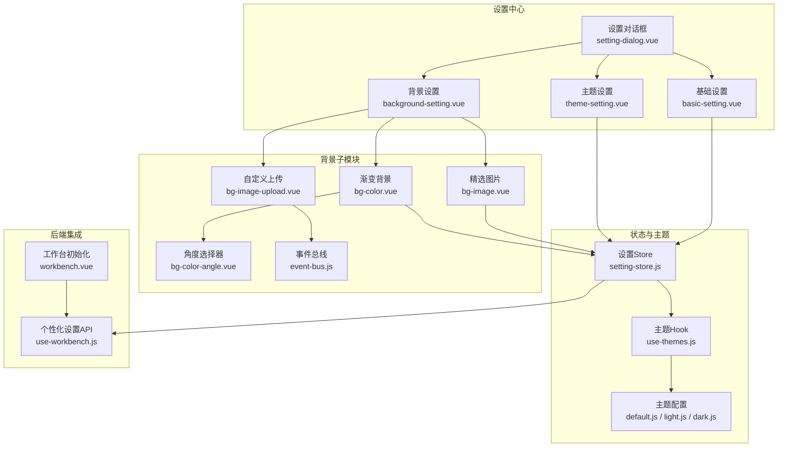
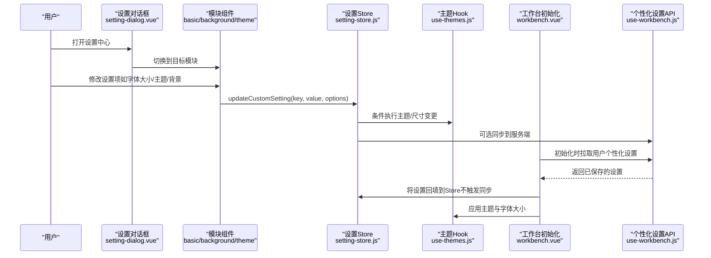
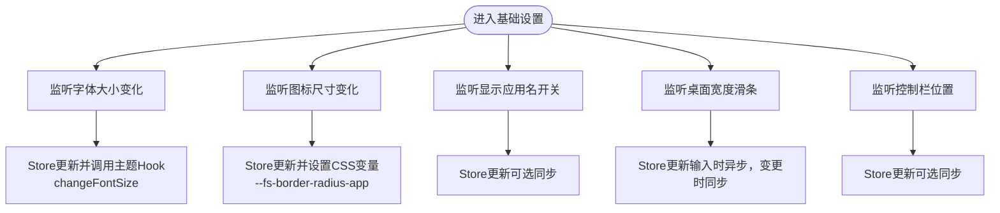
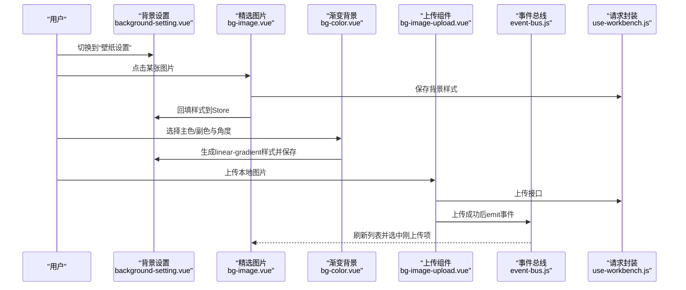
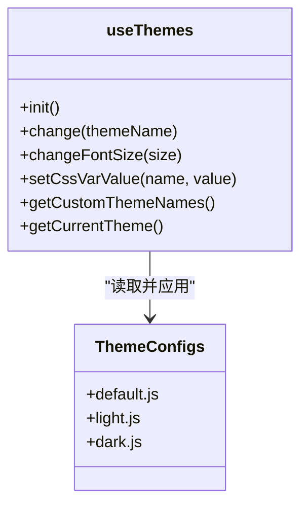
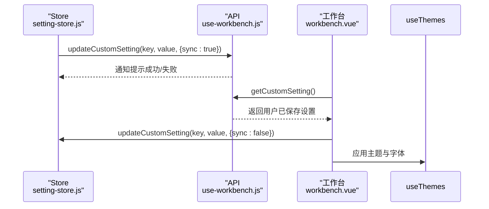
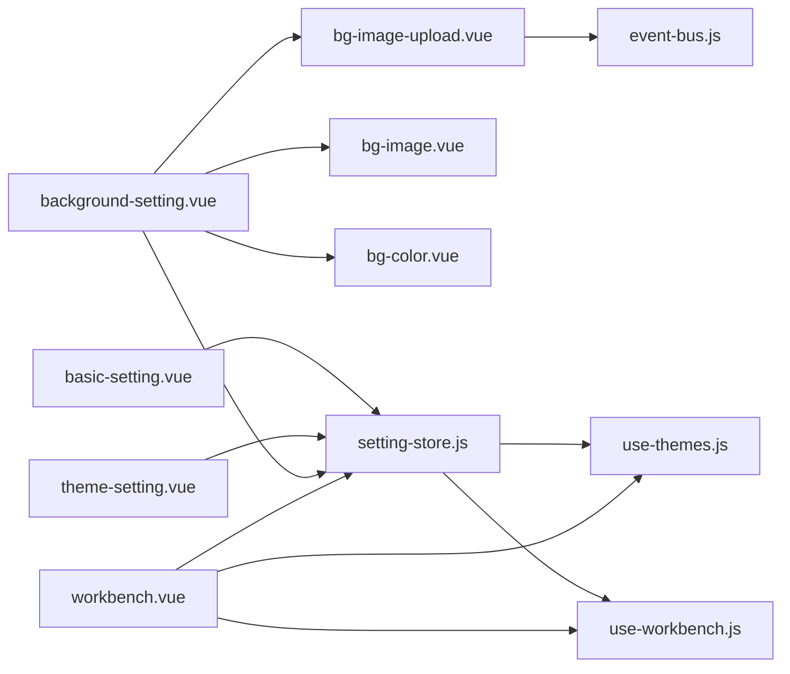

# 个性化设置

<cite>
**本文引用的文件**
- [setting-store.js](file://src/portal/views/workbench/setting-center/setting-store.js)
- [basic-setting.vue](file://src/portal/views/workbench/setting-center/basic/basic-setting.vue)
- [background-setting.vue](file://src/portal/views/workbench/setting-center/background/background-setting.vue)
- [bg-image.vue](file://src/portal/views/workbench/setting-center/background/bg-image.vue)
- [bg-color.vue](file://src/portal/views/workbench/setting-center/background/bg-color.vue)
- [bg-image-upload.vue](file://src/portal/views/workbench/setting-center/background/bg-image-upload.vue)
- [bg-color-angle.vue](file://src/portal/views/workbench/setting-center/background/bg-color-angle.vue)
- [event-bus.js](file://src/portal/views/workbench/setting-center/background/event-bus.js)
- [theme-setting.vue](file://src/portal/views/workbench/setting-center/theme/theme-setting.vue)
- [use-themes.js](file://src/portal/hooks/use-themes.js)
- [default.js](file://src/themes/default.js)
- [dark.js](file://src/themes/dark.js)
- [light.js](file://src/themes/light.js)
- [use-workbench.js](file://src/portal/views/workbench/use-workbench.js)
- [workbench.vue](file://src/portal/views/workbench/workbench.vue)
- [setting-dialog.vue](file://src/portal/views/workbench/setting-center/setting-dialog.vue)
- [export.js](file://src/portal/views/workbench/setting-center/export.js)
</cite>

## 目录
1. [简介](#简介)
2. [项目结构](#项目结构)
3. [核心组件](#核心组件)
4. [架构总览](#架构总览)
5. [组件详解](#组件详解)
6. [依赖关系分析](#依赖关系分析)
7. [性能考量](#性能考量)
8. [故障排查指南](#故障排查指南)
9. [结论](#结论)
10. [附录](#附录)

## 简介
本文件为 FS-AOI-WEB 个性化设置系统的技术文档，覆盖整体架构、核心功能（背景设置、主题配置、基础设置）、界面设计与分类管理、设置值持久化机制、实时预览与同步机制、主题切换动态效果、背景图片处理与字体大小调节等实现细节，并提供 API 接口、配置选项与扩展开发指南，帮助开发者快速理解并二次开发。

## 项目结构
个性化设置位于工作台“设置中心”，采用模块化组织：
- 设置对话框容器负责菜单导航与模块切换
- 基础设置：字体大小、应用图标尺寸、是否显示应用名、桌面区域宽度、控制栏位置等
- 背景设置：壁纸设置（精选图片、自定义上传、渐变背景）
- 主题设置：浅色/深色主题切换
- 存储与同步：Pinia Store 维护本地状态，通过 use-workbench 同步至服务端
- 主题系统：基于 CSS 变量的主题配置与运行时切换

**图表来源**
- [setting-dialog.vue](file://src/portal/views/workbench/setting-center/setting-dialog.vue#L1-L116)
- [basic-setting.vue](file://src/portal/views/workbench/setting-center/basic/basic-setting.vue#L1-L136)
- [background-setting.vue](file://src/portal/views/workbench/setting-center/background/background-setting.vue#L1-L64)
- [bg-image.vue](file://src/portal/views/workbench/setting-center/background/bg-image.vue#L1-L182)
- [bg-color.vue](file://src/portal/views/workbench/setting-center/background/bg-color.vue#L1-L241)
- [bg-image-upload.vue](file://src/portal/views/workbench/setting-center/background/bg-image-upload.vue#L1-L109)
- [bg-color-angle.vue](file://src/portal/views/workbench/setting-center/background/bg-color-angle.vue#L1-L115)
- [event-bus.js](file://src/portal/views/workbench/setting-center/background/event-bus.js#L1-L4)
- [theme-setting.vue](file://src/portal/views/workbench/setting-center/theme/theme-setting.vue#L1-L77)
- [setting-store.js](file://src/portal/views/workbench/setting-center/setting-store.js#L1-L44)
- [use-themes.js](file://src/portal/hooks/use-themes.js#L1-L197)
- [default.js](file://src/themes/default.js#L1-L113)
- [light.js](file://src/themes/light.js#L1-L24)
- [dark.js](file://src/themes/dark.js#L1-L24)
- [workbench.vue](file://src/portal/views/workbench/workbench.vue#L1-L235)
- [use-workbench.js](file://src/portal/views/workbench/use-workbench.js#L1-L222)

**章节来源**
- [setting-dialog.vue](file://src/portal/views/workbench/setting-center/setting-dialog.vue#L1-L116)
- [workbench.vue](file://src/portal/views/workbench/workbench.vue#L1-L235)

## 核心组件
- 设置 Store（Pinia）：集中维护个性化设置项与更新动作，支持实时预览与同步
- 主题 Hook：统一管理主题切换、字体大小变更、CSS 变量写入
- 背景子模块：精选图片、渐变背景、自定义上传与事件总线联动
- 基础设置模块：字体大小、图标尺寸、应用名显示、桌面区域宽度、控制栏位置
- 主题设置模块：浅色/深色主题预览与切换
- 工作台初始化：拉取用户个性化设置并应用到 Store 与主题系统

**章节来源**
- [setting-store.js](file://src/portal/views/workbench/setting-center/setting-store.js#L1-L44)
- [use-themes.js](file://src/portal/hooks/use-themes.js#L140-L197)
- [basic-setting.vue](file://src/portal/views/workbench/setting-center/basic/basic-setting.vue#L1-L136)
- [background-setting.vue](file://src/portal/views/workbench/setting-center/background/background-setting.vue#L1-L64)
- [theme-setting.vue](file://src/portal/views/workbench/setting-center/theme/theme-setting.vue#L1-L77)
- [workbench.vue](file://src/portal/views/workbench/workbench.vue#L63-L96)

## 架构总览
个性化设置系统采用“前端状态 + 主题系统 + 后端同步”的三层架构：
- 前端状态层：Pinia Store 维护当前个性化设置，组件通过响应式绑定与 actions 更新
- 主题系统层：use-themes 负责将设置映射为 CSS 变量，实现即时视觉变化
- 后端同步层：use-workbench 提供获取与保存个性化设置的 API，确保跨会话一致性

**图表来源**
- [setting-dialog.vue](file://src/portal/views/workbench/setting-center/setting-dialog.vue#L1-L116)
- [basic-setting.vue](file://src/portal/views/workbench/setting-center/basic/basic-setting.vue#L1-L136)
- [background-setting.vue](file://src/portal/views/workbench/setting-center/background/background-setting.vue#L1-L64)
- [theme-setting.vue](file://src/portal/views/workbench/setting-center/theme/theme-setting.vue#L1-L77)
- [setting-store.js](file://src/portal/views/workbench/setting-center/setting-store.js#L29-L41)
- [use-themes.js](file://src/portal/hooks/use-themes.js#L146-L183)
- [workbench.vue](file://src/portal/views/workbench/workbench.vue#L63-L96)
- [use-workbench.js](file://src/portal/views/workbench/use-workbench.js#L167-L195)

## 组件详解

### 设置对话框与模块导航
- 负责设置中心的侧边菜单与主内容区切换
- 支持“常规设置”、“壁纸设置”、“主题切换”三类模块
- 使用 KeepAlive 缓存模块组件，提升交互体验

**章节来源**
- [setting-dialog.vue](file://src/portal/views/workbench/setting-center/setting-dialog.vue#L1-L116)

### 基础设置模块
- 字体大小：小/中/大三档，实时影响全局字号体系
- 应用图标尺寸：小/中/大，映射到 CSS 变量以调整圆角等
- 显示应用名称：开关控制
- 桌面区域宽度：滑条范围 792–1320，支持输入与变更事件
- 控制栏位置：桌面导航栏左右位置

**图表来源**
- [basic-setting.vue](file://src/portal/views/workbench/setting-center/basic/basic-setting.vue#L7-L35)
- [setting-store.js](file://src/portal/views/workbench/setting-center/setting-store.js#L29-L41)
- [use-themes.js](file://src/portal/hooks/use-themes.js#L165-L183)

**章节来源**
- [basic-setting.vue](file://src/portal/views/workbench/setting-center/basic/basic-setting.vue#L1-L136)
- [setting-store.js](file://src/portal/views/workbench/setting-center/setting-store.js#L1-L44)
- [use-themes.js](file://src/portal/hooks/use-themes.js#L165-L183)

### 背景设置模块
- 精选图片：从服务端列表加载，点击即设为背景
- 渐变背景：主色/副色 + 角度选择，生成线性渐变
- 自定义上传：拖拽上传至服务器，预览并回填到列表
- 事件总线：上传成功后通过事件通知精选图片模块刷新

**图表来源**
- [background-setting.vue](file://src/portal/views/workbench/setting-center/background/background-setting.vue#L1-L64)
- [bg-image.vue](file://src/portal/views/workbench/setting-center/background/bg-image.vue#L1-L182)
- [bg-color.vue](file://src/portal/views/workbench/setting-center/background/bg-color.vue#L1-L241)
- [bg-image-upload.vue](file://src/portal/views/workbench/setting-center/background/bg-image-upload.vue#L1-L109)
- [event-bus.js](file://src/portal/views/workbench/setting-center/background/event-bus.js#L1-L4)
- [use-workbench.js](file://src/portal/views/workbench/use-workbench.js#L167-L195)

**章节来源**
- [background-setting.vue](file://src/portal/views/workbench/setting-center/background/background-setting.vue#L1-L64)
- [bg-image.vue](file://src/portal/views/workbench/setting-center/background/bg-image.vue#L1-L182)
- [bg-color.vue](file://src/portal/views/workbench/setting-center/background/bg-color.vue#L1-L241)
- [bg-image-upload.vue](file://src/portal/views/workbench/setting-center/background/bg-image-upload.vue#L1-L109)
- [event-bus.js](file://src/portal/views/workbench/setting-center/background/event-bus.js#L1-L4)

### 主题设置模块
- 提供浅色/深色主题预览与切换
- 切换时调用主题 Hook，写入 CSS 变量并应用到根元素

**章节来源**
- [theme-setting.vue](file://src/portal/views/workbench/setting-center/theme/theme-setting.vue#L1-L77)
- [use-themes.js](file://src/portal/hooks/use-themes.js#L146-L163)

### 主题系统与配置
- 主题 Hook：初始化时根据 URL 参数或默认主题选择；切换主题时写入 CSS 变量并设置根元素类名
- 字体大小：统一设置多级字号变量，保证全局一致性
- 主题配置：default/light/dark 提供颜色与通用变量，按需扩展

**图表来源**
- [use-themes.js](file://src/portal/hooks/use-themes.js#L140-L197)
- [default.js](file://src/themes/default.js#L1-L113)
- [light.js](file://src/themes/light.js#L1-L24)
- [dark.js](file://src/themes/dark.js#L1-L24)

**章节来源**
- [use-themes.js](file://src/portal/hooks/use-themes.js#L1-L197)
- [default.js](file://src/themes/default.js#L1-L113)
- [light.js](file://src/themes/light.js#L1-L24)
- [dark.js](file://src/themes/dark.js#L1-L24)

### 设置值持久化与同步
- Store 层：updateCustomSetting 写入本地状态
- 主题/尺寸变更：自动应用到 CSS 变量，无需显式同步
- 后端同步：默认自动同步到服务端；可通过 options.sync=false 关闭同步
- 初始化：工作台启动时拉取用户个性化设置，回填 Store 并应用主题/字体

**图表来源**
- [setting-store.js](file://src/portal/views/workbench/setting-center/setting-store.js#L29-L41)
- [use-workbench.js](file://src/portal/views/workbench/use-workbench.js#L167-L195)
- [workbench.vue](file://src/portal/views/workbench/workbench.vue#L63-L96)

**章节来源**
- [setting-store.js](file://src/portal/views/workbench/setting-center/setting-store.js#L1-L44)
- [use-workbench.js](file://src/portal/views/workbench/use-workbench.js#L167-L195)
- [workbench.vue](file://src/portal/views/workbench/workbench.vue#L63-L96)

## 依赖关系分析
- 组件耦合
  - setting-dialog 作为容器，聚合基础/背景/主题模块
  - 各模块均依赖 setting-store 进行状态更新
  - 主题相关操作依赖 use-themes
  - 背景上传通过事件总线与精选图片模块解耦
- 外部依赖
  - 请求封装：use-workbench.js 提供服务端接口
  - 主题配置：themes/* 提供 CSS 变量映射
  - UI 组件库：KUI 组件用于表单、弹窗、滚动条等

**图表来源**
- [setting-dialog.vue](file://src/portal/views/workbench/setting-center/setting-dialog.vue#L1-L116)
- [basic-setting.vue](file://src/portal/views/workbench/setting-center/basic/basic-setting.vue#L1-L136)
- [background-setting.vue](file://src/portal/views/workbench/setting-center/background/background-setting.vue#L1-L64)
- [theme-setting.vue](file://src/portal/views/workbench/setting-center/theme/theme-setting.vue#L1-L77)
- [setting-store.js](file://src/portal/views/workbench/setting-center/setting-store.js#L1-L44)
- [use-themes.js](file://src/portal/hooks/use-themes.js#L1-L197)
- [bg-image.vue](file://src/portal/views/workbench/setting-center/background/bg-image.vue#L1-L182)
- [bg-color.vue](file://src/portal/views/workbench/setting-center/background/bg-color.vue#L1-L241)
- [bg-image-upload.vue](file://src/portal/views/workbench/setting-center/background/bg-image-upload.vue#L1-L109)
- [event-bus.js](file://src/portal/views/workbench/setting-center/background/event-bus.js#L1-L4)
- [use-workbench.js](file://src/portal/views/workbench/use-workbench.js#L1-L222)
- [workbench.vue](file://src/portal/views/workbench/workbench.vue#L1-L235)

**章节来源**
- [export.js](file://src/portal/views/workbench/setting-center/export.js#L1-L3)

## 性能考量
- 模块缓存：设置对话框使用 KeepAlive 缓存模块组件，减少重复渲染
- 异步同步：桌面宽度输入时异步更新，变更时再同步，降低频繁请求
- 主题应用：CSS 变量写入为纯前端操作，无重排重绘压力
- 图片加载：精选图片懒加载与缩略图展示，上传预览避免二次请求

[本节为通用建议，无需列出具体文件来源]

## 故障排查指南
- 设置未生效
  - 检查 Store 是否正确调用 updateCustomSetting
  - 确认 use-themes 是否被调用（字体/图标尺寸/主题）
  - 查看工作台初始化是否回填了服务端设置
- 背景图片无法显示
  - 确认上传路径与访问权限
  - 检查事件总线是否正常触发刷新
- 同步失败
  - 查看通知提示与返回码
  - 确认网络与服务端接口可用

**章节来源**
- [setting-store.js](file://src/portal/views/workbench/setting-center/setting-store.js#L29-L41)
- [use-themes.js](file://src/portal/hooks/use-themes.js#L146-L183)
- [workbench.vue](file://src/portal/views/workbench/workbench.vue#L63-L96)
- [use-workbench.js](file://src/portal/views/workbench/use-workbench.js#L180-L195)

## 结论
个性化设置系统通过清晰的模块划分、Pinia 状态管理、主题 Hook 与服务端同步，实现了从界面到主题再到背景的完整个性化能力。其设计兼顾易用性与扩展性，便于后续新增设置项与主题配置。

## 附录

### API 接口清单（个性化设置）
- 获取用户个性化设置
  - 方法：GET
  - 路径：F092003917
  - 返回：用户已保存的设置键值对
- 保存个性化设置
  - 方法：POST
  - 路径：F092003918
  - 请求体：对应键值（见键映射）
  - 返回：状态码与消息
- 精选图片列表
  - 方法：GET
  - 路径：F092003920
  - 返回：图片列表
- 删除背景图片
  - 方法：POST
  - 路径：F092003921
  - 请求体：图片 ID
  - 返回：删除结果
- 上传背景图片
  - 方法：POST
  - 路径：F092003919
  - 请求体：上传结果数据
  - 返回：新图片信息

键映射（Store key → 服务端键）
- applicationIconSize → APP_ICO_SIZE
- showApplicationName → SHOW_APP_NAME
- fontSize → FONT_SIZE
- applicationBarPosition → APP_BAR_POSITION
- desktopBarPosition → DESK_BAR_POSITION
- desktopPadding → DESKTOP_PADDING
- desktopBackgroundStyle → DESKTOP_BG_STYLE
- theme → THEME

**章节来源**
- [use-workbench.js](file://src/portal/views/workbench/use-workbench.js#L167-L195)

### 配置选项与扩展开发指南
- 新增设置项
  - 在 Store 的 customSetting 中添加默认值
  - 在对应模块组件中绑定与监听
  - 在 updateCustomSetting 中增加分支处理（如需主题/尺寸联动）
  - 如需持久化，加入键映射并在服务端新增接口或复用现有键
- 新增主题
  - 在 themes 目录新增主题配置文件，导出 CSS 变量映射
  - 在主题 Hook 中自动加载，或在主题列表中注册
- 背景扩展
  - 可在背景模块中新增子页面（如视频背景、纯色背景）
  - 通过事件总线与上传模块解耦，保持低耦合高内聚

**章节来源**
- [setting-store.js](file://src/portal/views/workbench/setting-center/setting-store.js#L1-L44)
- [use-themes.js](file://src/portal/hooks/use-themes.js#L102-L115)
- [default.js](file://src/themes/default.js#L1-L113)
- [light.js](file://src/themes/light.js#L1-L24)
- [dark.js](file://src/themes/dark.js#L1-L24)