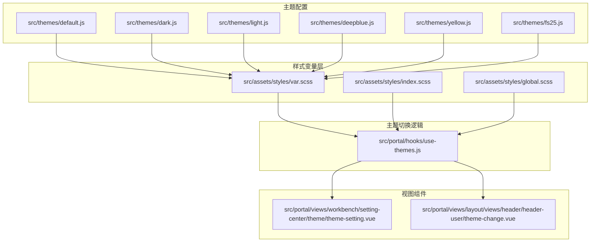
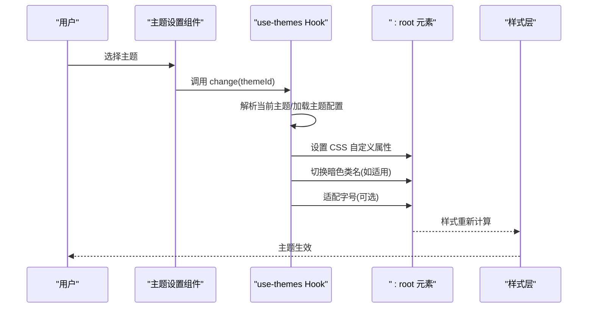
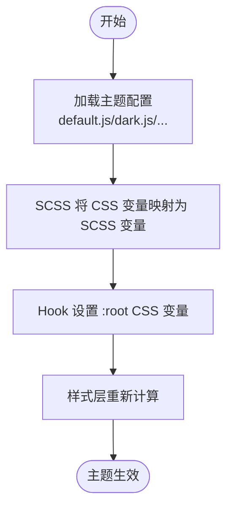
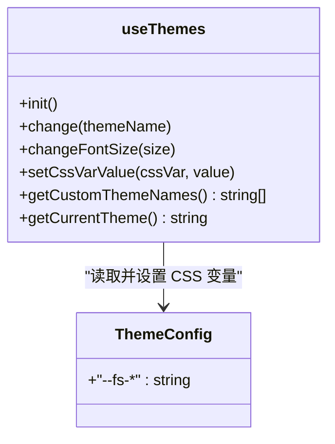
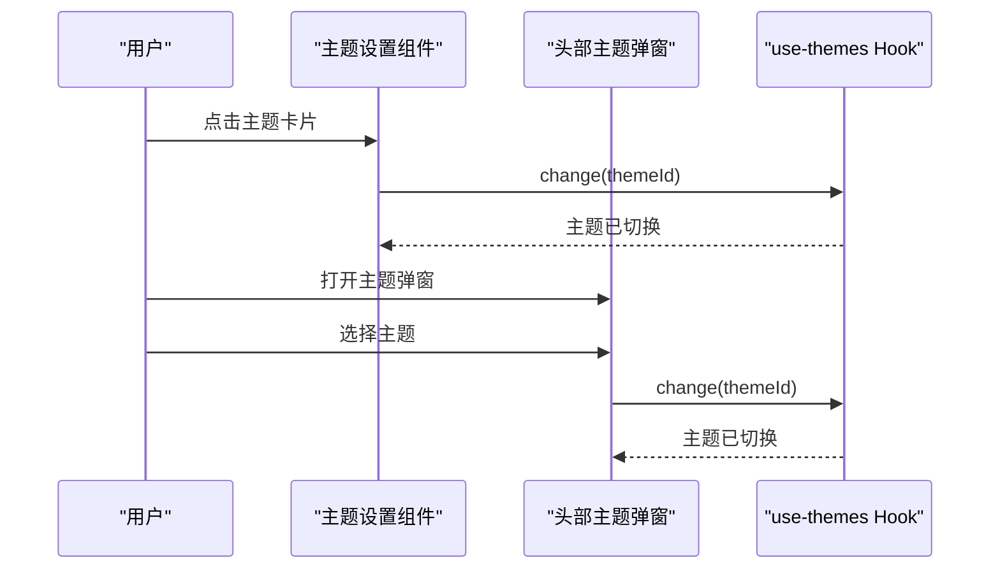
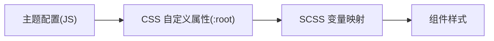
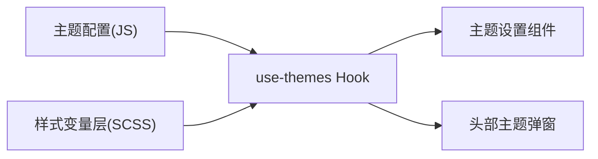

# 主题设置

<cite>
**本文引用的文件**
- [default.js](file://src/themes/default.js)
- [dark.js](file://src/themes/dark.js)
- [light.js](file://src/themes/light.js)
- [deepblue.js](file://src/themes/deepblue.js)
- [yellow.js](file://src/themes/yellow.js)
- [fs25.js](file://src/themes/fs25.js)
- [var.scss](file://src/assets/styles/var.scss)
- [index.scss](file://src/assets/styles/index.scss)
- [global.scss](file://src/assets/styles/global.scss)
- [use-themes.js](file://src/portal/hooks/use-themes.js)
- [theme-setting.vue](file://src/portal/views/workbench/setting-center/theme/theme-setting.vue)
- [theme-change.vue](file://src/portal/views/layout/views/header/header-user/theme-change.vue)
- [index.js](file://src/config/index.js)
</cite>

## 目录
1. [简介](#简介)
2. [项目结构](#项目结构)
3. [核心组件](#核心组件)
4. [架构总览](#架构总览)
5. [详细组件分析](#详细组件分析)
6. [依赖关系分析](#依赖关系分析)
7. [性能考量](#性能考量)
8. [故障排查指南](#故障排查指南)
9. [结论](#结论)
10. [附录](#附录)

## 简介
本技术文档围绕 FS-AOI-WEB 的主题设置模块进行系统性梳理，目标是帮助开发者快速理解并扩展主题系统。文档重点覆盖以下方面：
- 主题系统架构与主题切换机制
- 内置主题（默认、深色、浅色、深蓝、黄色、FS25）的配置与实现
- 主题配置文件结构、CSS 变量定义与覆盖机制
- 主题切换的调用链路与通知机制
- 主题数据存储与用户偏好持久化策略
- 扩展开发与自定义主题创建方法
- 主题设置的 API 接口与动态切换的技术实现

## 项目结构
主题系统由“主题配置文件 + 样式变量层 + 主题切换 Hook + 视图组件”四部分组成，采用“配置驱动 + CSS 自定义属性”的方式实现主题切换。

**图表来源**
- [default.js](file://src/themes/default.js#L1-L113)
- [dark.js](file://src/themes/dark.js#L1-L24)
- [light.js](file://src/themes/light.js#L1-L24)
- [deepblue.js](file://src/themes/deepblue.js#L1-L130)
- [yellow.js](file://src/themes/yellow.js#L1-L47)
- [fs25.js](file://src/themes/fs25.js#L1-L124)
- [var.scss](file://src/assets/styles/var.scss#L1-L163)
- [index.scss](file://src/assets/styles/index.scss#L1-L4)
- [global.scss](file://src/assets/styles/global.scss#L1-L98)
- [use-themes.js](file://src/portal/hooks/use-themes.js#L1-L197)
- [theme-setting.vue](file://src/portal/views/workbench/setting-center/theme/theme-setting.vue#L1-L77)
- [theme-change.vue](file://src/portal/views/layout/views/header/header-user/theme-change.vue#L1-L139)

**章节来源**
- [default.js](file://src/themes/default.js#L1-L113)
- [dark.js](file://src/themes/dark.js#L1-L24)
- [light.js](file://src/themes/light.js#L1-L24)
- [deepblue.js](file://src/themes/deepblue.js#L1-L130)
- [yellow.js](file://src/themes/yellow.js#L1-L47)
- [fs25.js](file://src/themes/fs25.js#L1-L124)
- [var.scss](file://src/assets/styles/var.scss#L1-L163)
- [index.scss](file://src/assets/styles/index.scss#L1-L4)
- [global.scss](file://src/assets/styles/global.scss#L1-L98)
- [use-themes.js](file://src/portal/hooks/use-themes.js#L1-L197)
- [theme-setting.vue](file://src/portal/views/workbench/setting-center/theme/theme-setting.vue#L1-L77)
- [theme-change.vue](file://src/portal/views/layout/views/header/header-user/theme-change.vue#L1-L139)

## 核心组件
- 主题配置文件：以 JS 导出键值对形式的 CSS 变量映射，覆盖主色、字体、背景、边框、阴影等维度。
- 样式变量层：通过 SCSS 使用 CSS 自定义属性作为默认值，形成“SCSS 变量 → CSS 变量 → 主题配置”的链路。
- 主题切换 Hook：负责加载内置主题、解析当前主题、设置 CSS 自定义属性、字号适配、暗色类名切换等。
- 视图组件：提供主题选择入口与交互，触发主题切换并持久化用户偏好。

**章节来源**
- [use-themes.js](file://src/portal/hooks/use-themes.js#L140-L194)
- [var.scss](file://src/assets/styles/var.scss#L1-L163)
- [theme-setting.vue](file://src/portal/views/workbench/setting-center/theme/theme-setting.vue#L1-L77)
- [theme-change.vue](file://src/portal/views/layout/views/header/header-user/theme-change.vue#L1-L139)

## 架构总览
主题系统采用“配置驱动 + CSS 自定义属性 + SCSS 变量层”的三层架构：
- 配置层：各主题 JS 文件导出一组 CSS 变量键值对。
- 变量层：SCSS 将 CSS 变量映射为 SCSS 变量，供全局样式使用。
- 控制层：Hook 动态设置 :root 的 CSS 变量，完成主题切换；同时维护字号适配与暗色类名。

**图表来源**
- [use-themes.js](file://src/portal/hooks/use-themes.js#L146-L163)
- [theme-setting.vue](file://src/portal/views/workbench/setting-center/theme/theme-setting.vue#L13-L16)
- [theme-change.vue](file://src/portal/views/layout/views/header/header-user/theme-change.vue#L62-L64)

## 详细组件分析

### 主题配置文件与变量体系
- 主题配置文件：每个主题以 JS 导出对象的形式提供 CSS 变量映射，覆盖主色、状态色、字体尺寸、背景、边框、阴影、头部/菜单/内容区等 UI 组件的配色。
- 变量映射：SCSS 层将 CSS 变量映射为 SCSS 变量，形成默认值来源；组件样式直接使用 SCSS 变量，从而受主题配置影响。
- 变量覆盖：Hook 在运行时通过设置 :root 的 CSS 自定义属性，实现对默认值的覆盖。

**图表来源**
- [default.js](file://src/themes/default.js#L1-L113)
- [dark.js](file://src/themes/dark.js#L1-L24)
- [light.js](file://src/themes/light.js#L1-L24)
- [deepblue.js](file://src/themes/deepblue.js#L1-L130)
- [yellow.js](file://src/themes/yellow.js#L1-L47)
- [fs25.js](file://src/themes/fs25.js#L1-L124)
- [var.scss](file://src/assets/styles/var.scss#L1-L163)
- [use-themes.js](file://src/portal/hooks/use-themes.js#L117-L121)

**章节来源**
- [default.js](file://src/themes/default.js#L1-L113)
- [dark.js](file://src/themes/dark.js#L1-L24)
- [light.js](file://src/themes/light.js#L1-L24)
- [deepblue.js](file://src/themes/deepblue.js#L1-L130)
- [yellow.js](file://src/themes/yellow.js#L1-L47)
- [fs25.js](file://src/themes/fs25.js#L1-L124)
- [var.scss](file://src/assets/styles/var.scss#L1-L163)

### use-themes Hook：主题切换与变量设置
- 主题发现与选择：从 URL 参数或默认配置获取当前主题；若无则扫描主题目录选择首个可用主题。
- 主题加载：通过动态导入收集所有主题配置，生成主题名到配置的映射。
- 变量设置：遍历主题配置，逐项设置 :root 的 CSS 自定义属性。
- 暗色支持：根据主题名切换 HTML 的暗色类名。
- 字号适配：当主题提供基础字号时，按比例推导其他字号并设置。
- API 暴露：提供 change、changeFontSize、setCssVarValue、getCustomThemeNames、getCurrentTheme 等方法。

**图表来源**
- [use-themes.js](file://src/portal/hooks/use-themes.js#L140-L194)

**章节来源**
- [use-themes.js](file://src/portal/hooks/use-themes.js#L1-L197)

### 视图组件：主题设置与头部切换
- 设置中心主题设置：展示主题列表，点击后调用 Hook 切换主题，并更新用户自定义设置。
- 头部用户菜单弹窗：在弹窗中列出可用主题，选择后调用 Hook 切换主题。

**图表来源**
- [theme-setting.vue](file://src/portal/views/workbench/setting-center/theme/theme-setting.vue#L13-L16)
- [theme-change.vue](file://src/portal/views/layout/views/header/header-user/theme-change.vue#L62-L64)
- [use-themes.js](file://src/portal/hooks/use-themes.js#L146-L163)

**章节来源**
- [theme-setting.vue](file://src/portal/views/workbench/setting-center/theme/theme-setting.vue#L1-L77)
- [theme-change.vue](file://src/portal/views/layout/views/header/header-user/theme-change.vue#L1-L139)

### 样式层与变量覆盖机制
- SCSS 变量默认值：SCSS 中使用 CSS 自定义属性作为默认值，确保未被主题覆盖时有合理回退。
- 变量覆盖链路：主题配置 → CSS 自定义属性 → SCSS 变量 → 组件样式。
- 全局样式：全局样式统一引入变量层，保证主题切换后全局一致生效。

**图表来源**
- [var.scss](file://src/assets/styles/var.scss#L1-L163)
- [index.scss](file://src/assets/styles/index.scss#L1-L4)
- [global.scss](file://src/assets/styles/global.scss#L1-L98)

**章节来源**
- [var.scss](file://src/assets/styles/var.scss#L1-L163)
- [index.scss](file://src/assets/styles/index.scss#L1-L4)
- [global.scss](file://src/assets/styles/global.scss#L1-L98)

## 依赖关系分析
- 主题配置文件之间无直接依赖，彼此独立。
- 样式变量层依赖于 CSS 自定义属性，不直接依赖主题配置。
- use-themes Hook 依赖主题配置与 DOM API，向视图组件暴露 API。
- 视图组件依赖 use-themes Hook 与用户设置存储。

**图表来源**
- [use-themes.js](file://src/portal/hooks/use-themes.js#L1-L197)
- [var.scss](file://src/assets/styles/var.scss#L1-L163)
- [theme-setting.vue](file://src/portal/views/workbench/setting-center/theme/theme-setting.vue#L1-L77)
- [theme-change.vue](file://src/portal/views/layout/views/header/header-user/theme-change.vue#L1-L139)

**章节来源**
- [use-themes.js](file://src/portal/hooks/use-themes.js#L1-L197)
- [var.scss](file://src/assets/styles/var.scss#L1-L163)
- [theme-setting.vue](file://src/portal/views/workbench/setting-center/theme/theme-setting.vue#L1-L77)
- [theme-change.vue](file://src/portal/views/layout/views/header/header-user/theme-change.vue#L1-L139)

## 性能考量
- 主题加载：通过动态导入一次性收集所有主题配置，避免重复 IO。
- 变量设置：批量设置 CSS 自定义属性，减少重排/重绘次数。
- 字号适配：仅在主题提供基础字号时执行，避免不必要的计算。
- 暗色类名：按需切换，降低样式分支复杂度。

[本节为通用建议，无需特定文件来源]

## 故障排查指南
- 主题未生效
  - 检查主题配置是否正确导出且包含有效 CSS 变量。
  - 确认 Hook 是否成功设置 :root 的 CSS 自定义属性。
  - 核对 SCSS 变量是否正确映射至 CSS 变量。
- 字号未适配
  - 确认主题配置提供基础字号键值。
  - 检查 Hook 的字号适配逻辑是否执行。
- 暗色模式异常
  - 检查主题名是否为“dark”，以触发暗色类名切换。
- 用户偏好未持久化
  - 确认设置中心组件是否调用设置存储并写入主题偏好。
  - 头部弹窗组件是否使用本地存储保存当前主题。

**章节来源**
- [use-themes.js](file://src/portal/hooks/use-themes.js#L146-L163)
- [theme-setting.vue](file://src/portal/views/workbench/setting-center/theme/theme-setting.vue#L13-L16)
- [theme-change.vue](file://src/portal/views/layout/views/header/header-user/theme-change.vue#L48-L50)

## 结论
FS-AOI-WEB 的主题系统通过“配置驱动 + CSS 自定义属性 + SCSS 变量层”的架构，实现了灵活的主题切换与一致的样式覆盖。开发者可通过新增主题配置文件快速扩展主题，结合 Hook 的 API 实现动态切换与持久化，满足多场景下的主题需求。

[本节为总结性内容，无需特定文件来源]

## 附录

### 内置主题清单与关键变量
- 默认(default)：覆盖主色、状态色、字体尺寸、头部/菜单/内容区配色等。
- 深色(dark)：覆盖基础字体色、背景色、阴影、圆角等。
- 浅色(light)：覆盖基础字体色、背景色、阴影、圆角等。
- 深蓝(deepblue)：覆盖头部/菜单/内容区配色、圆角、阴影、Tabs 样式等。
- 黄色(yellow)：覆盖主色与头部/菜单/内容区配色。
- FS25(fs25)：覆盖主色、字体尺寸、头部/菜单/内容区配色、Tabs 样式等。

**章节来源**
- [default.js](file://src/themes/default.js#L1-L113)
- [dark.js](file://src/themes/dark.js#L1-L24)
- [light.js](file://src/themes/light.js#L1-L24)
- [deepblue.js](file://src/themes/deepblue.js#L1-L130)
- [yellow.js](file://src/themes/yellow.js#L1-L47)
- [fs25.js](file://src/themes/fs25.js#L1-L124)

### 主题配置文件结构与字段说明
- 结构：JS 对象，键为 CSS 变量名，值为十六进制颜色或数值字符串。
- 字段类别：
  - 基础色：主色、成功、警告、危险、错误、信息。
  - 字体：最大/加/大/中/基/小/最小号。
  - 背景与边框：背景色、边框色、圆角半径、阴影。
  - 头部/菜单/内容区：头部背景、菜单项背景/悬停/激活、内容区 Tabs、主视图背景等。

**章节来源**
- [default.js](file://src/themes/default.js#L1-L113)
- [deepblue.js](file://src/themes/deepblue.js#L1-L130)
- [fs25.js](file://src/themes/fs25.js#L1-L124)
- [var.scss](file://src/assets/styles/var.scss#L1-L163)

### 主题切换 API 一览
- useThemes.change(themeName)
  - 功能：切换到指定主题，设置 CSS 变量、暗色类名、字号适配。
  - 输入：主题名字符串。
- useThemes.changeFontSize(size)
  - 功能：按基础字号推导并设置各级字号。
  - 输入：基础字号数值（不含单位）。
- useThemes.setCssVarValue(cssVar, value)
  - 功能：直接设置某个 CSS 变量值。
- useThemes.getCustomThemeNames()
  - 功能：返回可用主题名数组。
- useThemes.getCurrentTheme()
  - 功能：返回当前主题名。

**章节来源**
- [use-themes.js](file://src/portal/hooks/use-themes.js#L146-L194)

### 用户偏好与持久化
- 设置中心组件：点击主题卡片后调用 Hook 切换主题，并通过设置存储更新用户偏好。
- 头部弹窗组件：初始化时从默认配置与本地存储读取当前主题，选择后调用 Hook 切换主题。

**章节来源**
- [theme-setting.vue](file://src/portal/views/workbench/setting-center/theme/theme-setting.vue#L13-L16)
- [theme-change.vue](file://src/portal/views/layout/views/header/header-user/theme-change.vue#L48-L50)

### 扩展开发与自定义主题
- 新增主题步骤
  - 在主题目录新增一个 JS 文件，导出一组 CSS 变量映射。
  - 在样式变量层确认相关 SCSS 变量存在或新增映射。
  - 在视图组件中注册该主题（如需要）。
- 继承与覆盖规则
  - 仅覆盖需要变更的变量，未覆盖的变量沿用默认值。
  - 若需与第三方 UI 库变量联动，可在 Hook 中补充设置（当前预留了设置 Element Plus 变量的逻辑位置）。

**章节来源**
- [use-themes.js](file://src/portal/hooks/use-themes.js#L102-L115)
- [var.scss](file://src/assets/styles/var.scss#L1-L163)