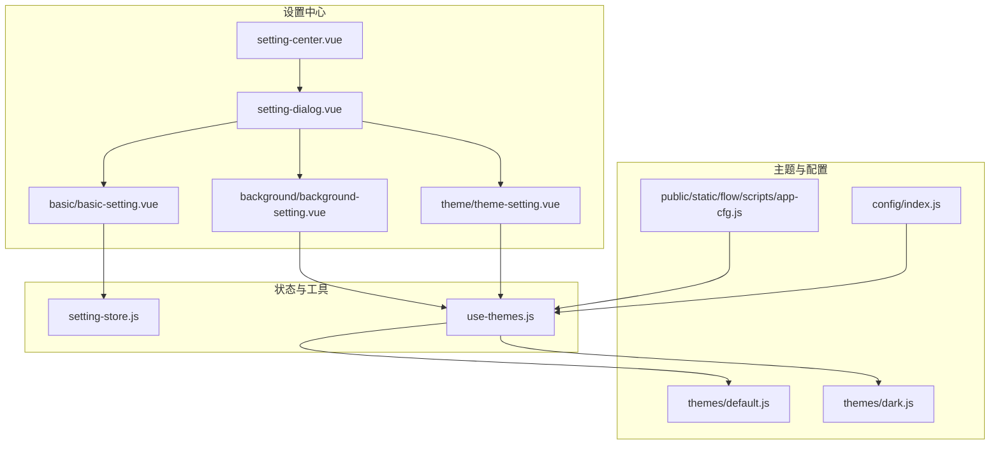
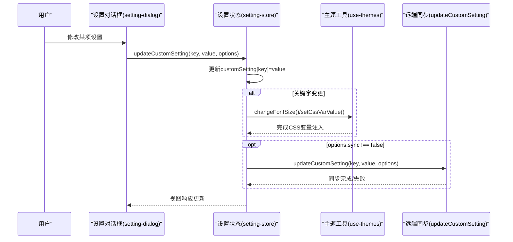
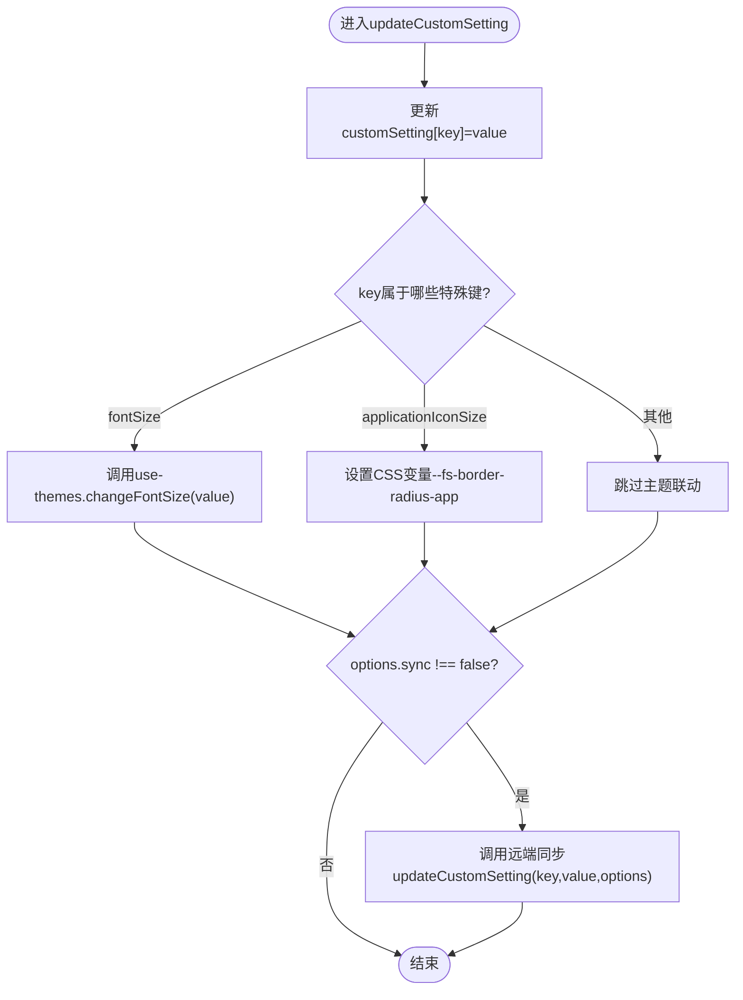
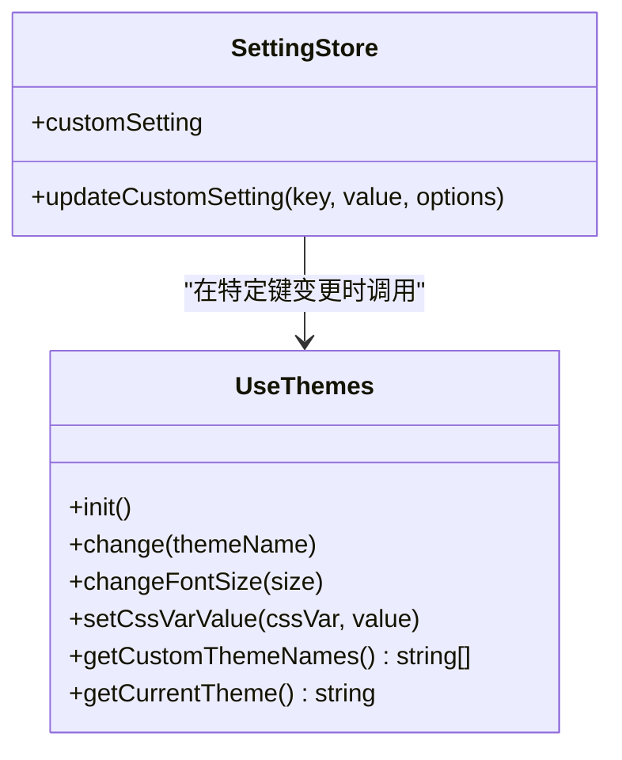
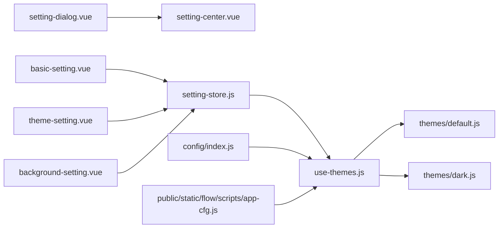

# 基础设置

<cite>
**本文引用的文件**
- [setting-store.js](file://src/portal/views/workbench/setting-center/setting-store.js)
- [setting-center.vue](file://src/portal/views/workbench/setting-center/setting-center.vue)
- [setting-dialog.vue](file://src/portal/views/workbench/setting-center/setting-dialog.vue)
- [basic-setting.vue](file://src/portal/views/workbench/setting-center/basic/basic-setting.vue)
- [theme-setting.vue](file://src/portal/views/workbench/setting-center/theme/theme-setting.vue)
- [background-setting.vue](file://src/portal/views/workbench/setting-center/background/background-setting.vue)
- [use-themes.js](file://src/portal/hooks/use-themes.js)
- [default.js](file://src/themes/default.js)
- [dark.js](file://src/themes/dark.js)
- [index.js](file://src/config/index.js)
- [app-cfg.js](file://public/static/flow/scripts/app-cfg.js)
- [workbench.vue](file://src/portal/views/workbench/workbench.vue)
- [workbench-store.js](file://src/portal/views/workbench/workbench-store.js)
</cite>

## 目录
1. [简介](#简介)
2. [项目结构](#项目结构)
3. [核心组件](#核心组件)
4. [架构总览](#架构总览)
5. [详细组件分析](#详细组件分析)
6. [依赖分析](#依赖分析)
7. [性能考虑](#性能考虑)
8. [故障排查指南](#故障排查指南)
9. [结论](#结论)
10. [附录](#附录)

## 简介
本文件面向FS-AOI-WEB“基础设置”模块，提供从数据模型、配置项、验证规则、应用范围到与主题系统集成、国际化与本地化、设置同步与备份恢复、API与扩展开发的完整技术参考与定制指南。重点覆盖以下方面：
- 基础设置的配置项：字号、应用图标尺寸、是否显示应用名、应用栏位置、桌面栏位置、桌面内边距、桌面背景样式、主题等
- 设置项的验证与应用范围（如字号变更影响全局字体体系）
- 与主题系统的集成：主题切换、CSS变量注入、字号联动
- 国际化与本地化：当前代码库中未发现直接的语言与时区设置入口；建议通过主题与业务层扩展实现
- 设置同步与持久化：本地Pinia状态与远端同步的调用点
- 扩展开发：如何新增配置项、如何接入主题系统、如何扩展背景与主题能力

## 项目结构
基础设置模块位于门户工作台的设置中心子目录，采用按功能域划分的组织方式：
- setting-center：设置中心主入口与对话框、基础设置、主题设置、背景设置
- hooks/use-themes.js：主题初始化与切换、字号调整、CSS变量注入
- themes：内置主题配置（default、dark等），作为CSS变量来源
- config：应用配置聚合导出
- 公共脚本：app-cfg.js提供运行期上下文根路径等基础配置

**图示来源**
- [setting-center.vue](file://src/portal/views/workbench/setting-center/setting-center.vue)
- [setting-dialog.vue](file://src/portal/views/workbench/setting-center/setting-dialog.vue)
- [basic-setting.vue](file://src/portal/views/workbench/setting-center/basic/basic-setting.vue)
- [theme-setting.vue](file://src/portal/views/workbench/setting-center/theme/theme-setting.vue)
- [background-setting.vue](file://src/portal/views/workbench/setting-center/background/background-setting.vue)
- [setting-store.js](file://src/portal/views/workbench/setting-center/setting-store.js)
- [use-themes.js](file://src/portal/hooks/use-themes.js)
- [default.js](file://src/themes/default.js)
- [dark.js](file://src/themes/dark.js)
- [index.js](file://src/config/index.js)
- [app-cfg.js](file://public/static/flow/scripts/app-cfg.js)

**章节来源**
- [setting-center.vue](file://src/portal/views/workbench/setting-center/setting-center.vue)
- [setting-dialog.vue](file://src/portal/views/workbench/setting-center/setting-dialog.vue)
- [basic-setting.vue](file://src/portal/views/workbench/setting-center/basic/basic-setting.vue)
- [theme-setting.vue](file://src/portal/views/workbench/setting-center/theme/theme-setting.vue)
- [background-setting.vue](file://src/portal/views/workbench/setting-center/background/background-setting.vue)
- [setting-store.js](file://src/portal/views/workbench/setting-center/setting-store.js)
- [use-themes.js](file://src/portal/hooks/use-themes.js)
- [default.js](file://src/themes/default.js)
- [dark.js](file://src/themes/dark.js)
- [index.js](file://src/config/index.js)
- [app-cfg.js](file://public/static/flow/scripts/app-cfg.js)

## 核心组件
- 设置状态管理（Pinia）：集中保存并更新用户自定义设置，负责与主题系统联动以及可选的远端同步
- 主题工具：负责主题切换、字号适配、CSS变量注入
- 主题配置：以CSS变量形式提供颜色、字号、圆角等视觉规范
- 设置中心UI：提供基础设置、主题设置、背景设置的交互入口

关键职责与边界：
- setting-store.js：维护customSetting对象，提供updateCustomSetting动作，并在特定键变更时触发主题工具的联动
- use-themes.js：根据主题名加载对应主题配置，注入CSS变量，提供字号调整与CSS变量写入能力
- theme配置：default.js、dark.js等为主题变量集合，供use-themes.js消费
- setting-center与setting-dialog：承载UI与交互，调用store进行状态变更

**章节来源**
- [setting-store.js](file://src/portal/views/workbench/setting-center/setting-store.js)
- [use-themes.js](file://src/portal/hooks/use-themes.js)
- [default.js](file://src/themes/default.js)
- [dark.js](file://src/themes/dark.js)
- [setting-center.vue](file://src/portal/views/workbench/setting-center/setting-center.vue)
- [setting-dialog.vue](file://src/portal/views/workbench/setting-center/setting-dialog.vue)

## 架构总览
基础设置的运行时流程如下：
- 用户在设置对话框中修改某项设置
- setting-store.updateCustomSetting接收键值对，更新customSetting
- 对于字号与应用图标尺寸等键，use-themes执行相应CSS变量注入或字号适配
- 可选地，updateCustomSetting会调用远端同步函数（由外部传入options.sync控制）

**图示来源**
- [setting-dialog.vue](file://src/portal/views/workbench/setting-center/setting-dialog.vue)
- [setting-store.js](file://src/portal/views/workbench/setting-center/setting-store.js)
- [use-themes.js](file://src/portal/hooks/use-themes.js)

## 详细组件分析

### 设置状态与联动（setting-store）
- 数据结构
  - dialogVisible：控制设置对话框显隐
  - customSetting：包含以下字段
    - fontSize：字符串型字号（如"14"）
    - applicationIconSize：应用图标尺寸枚举（如"small/middle/large"）
    - showApplicationName：是否显示应用名（如"1"/"0"）
    - applicationBarPosition：应用栏位置（如"top"/"bottom"）
    - desktopBarPosition：桌面栏位置（如"left"/"right"）
    - desktopPadding：桌面内边距（数值字符串）
    - desktopBackgroundStyle：桌面背景样式（字符串）
    - theme：当前主题名（如"default"/"dark"）
- 动作
  - clearStore：重置状态
  - setDialogVisible：切换对话框可见性
  - updateCustomSetting：更新指定键值，并在必要时调用主题工具进行联动，最后可选地调用远端同步

- 关键联动逻辑
  - 当fontSize变更时，调用use-themes.changeFontSize以批量更新字号CSS变量
  - 当applicationIconSize变更时，基于映射表设置CSS变量--fs-border-radius-app
  - 默认情况下会尝试同步至远端（可通过options.sync=false禁用）

- 应用范围
  - fontSize：影响全局字号体系，作用于根元素CSS变量，进而影响组件库与业务组件的字号
  - applicationIconSize：影响应用图标圆角等视觉属性
  - theme：影响主题类名与CSS变量，决定整体视觉风格

- 验证规则（基于现有实现）
  - 字符串型数值（如fontSize、desktopPadding）未见显式校验，建议在UI层或store中增加类型与范围校验
  - 枚举型值（如applicationIconSize、applicationBarPosition、desktopBarPosition、theme）未见显式校验，建议在updateCustomSetting中加入白名单校验
  - showApplicationName建议限制为"0"/"1"

- 同步与持久化
  - updateCustomSetting内部调用updateCustomSetting(key, value, options)，该函数由外部传入，用于与后端同步
  - 本地持久化未在store中体现，建议结合浏览器存储或后端回写实现

**图示来源**
- [setting-store.js](file://src/portal/views/workbench/setting-center/setting-store.js)
- [use-themes.js](file://src/portal/hooks/use-themes.js)

**章节来源**
- [setting-store.js](file://src/portal/views/workbench/setting-center/setting-store.js)

### 主题系统（use-themes）
- 初始化与切换
  - init：解析URL参数或默认主题，调用change
  - change：加载主题配置，注入CSS变量，设置根元素dark类名，必要时适配字号
- 字号适配
  - changeFontSize：批量设置多个字号CSS变量，确保组件库与业务字号一致
- CSS变量写入
  - setCssVarValue：动态设置任意CSS变量
- 主题枚举
  - getCustomThemeNames：获取可用主题名列表
  - getCurrentTheme：获取当前主题名

- 与基础设置的集成
  - 基础设置中的fontSize与applicationIconSize变更会通过store触发use-themes的相应动作
  - theme变更通过store触发use-themes.change，从而应用主题变量

- 主题配置来源
  - default.js、dark.js等为主题变量集合，供use-themes消费
  - 通过import.meta.glob自动扫描@/themes下的主题文件

**图示来源**
- [use-themes.js](file://src/portal/hooks/use-themes.js)
- [setting-store.js](file://src/portal/views/workbench/setting-center/setting-store.js)

**章节来源**
- [use-themes.js](file://src/portal/hooks/use-themes.js)
- [default.js](file://src/themes/default.js)
- [dark.js](file://src/themes/dark.js)

### 基础设置UI（basic-setting）
- 职责
  - 展示并编辑基础设置项：fontSize、applicationIconSize、showApplicationName、applicationBarPosition、desktopBarPosition、desktopPadding、desktopBackgroundStyle、theme
- 交互
  - 通过绑定到store的customSetting实现双向数据绑定
  - 在用户确认时调用store.updateCustomSetting进行提交与联动

- 验证与扩展
  - 建议在此层增加输入校验（如fontSize范围、枚举值白名单）
  - 支持新增配置项时，同步扩展store与UI

**章节来源**
- [basic-setting.vue](file://src/portal/views/workbench/setting-center/basic/basic-setting.vue)
- [setting-store.js](file://src/portal/views/workbench/setting-center/setting-store.js)

### 主题设置UI（theme-setting）
- 职责
  - 提供主题选择入口，触发use-themes.change
- 与store的关系
  - 通常通过store.updateCustomSetting("theme", ...)触发主题切换

**章节来源**
- [theme-setting.vue](file://src/portal/views/workbench/setting-center/theme/theme-setting.vue)
- [use-themes.js](file://src/portal/hooks/use-themes.js)

### 背景设置UI（background-setting）
- 职责
  - 提供桌面背景设置入口，如背景色、背景图、角度等
- 与store的关系
  - 通过store.updateCustomSetting更新desktopBackgroundStyle等键

**章节来源**
- [background-setting.vue](file://src/portal/views/workbench/setting-center/background/background-setting.vue)
- [setting-store.js](file://src/portal/views/workbench/setting-center/setting-store.js)

### 设置中心与对话框（setting-center、setting-dialog）
- setting-center：工作台设置中心入口，承载各设置面板
- setting-dialog：设置对话框容器，负责打开/关闭与内容渲染
- 两者共同驱动设置流程：打开对话框 -> 编辑设置 -> 提交 -> 触发联动与同步

**章节来源**
- [setting-center.vue](file://src/portal/views/workbench/setting-center/setting-center.vue)
- [setting-dialog.vue](file://src/portal/views/workbench/setting-center/setting-dialog.vue)

## 依赖分析
- 组件耦合
  - setting-dialog依赖setting-center提供的设置面板
  - basic-setting、theme-setting、background-setting依赖setting-store进行状态管理
  - setting-store依赖use-themes进行主题与字号联动
  - use-themes依赖themes下的主题配置文件
- 外部依赖
  - app-cfg.js提供运行期上下文根路径等基础配置
  - config/index.js聚合导出各类配置

**图示来源**
- [setting-dialog.vue](file://src/portal/views/workbench/setting-center/setting-dialog.vue)
- [setting-center.vue](file://src/portal/views/workbench/setting-center/setting-center.vue)
- [basic-setting.vue](file://src/portal/views/workbench/setting-center/basic/basic-setting.vue)
- [theme-setting.vue](file://src/portal/views/workbench/setting-center/theme/theme-setting.vue)
- [background-setting.vue](file://src/portal/views/workbench/setting-center/background/background-setting.vue)
- [setting-store.js](file://src/portal/views/workbench/setting-center/setting-store.js)
- [use-themes.js](file://src/portal/hooks/use-themes.js)
- [default.js](file://src/themes/default.js)
- [dark.js](file://src/themes/dark.js)
- [index.js](file://src/config/index.js)
- [app-cfg.js](file://public/static/flow/scripts/app-cfg.js)

**章节来源**
- [setting-store.js](file://src/portal/views/workbench/setting-center/setting-store.js)
- [use-themes.js](file://src/portal/hooks/use-themes.js)
- [default.js](file://src/themes/default.js)
- [dark.js](file://src/themes/dark.js)
- [index.js](file://src/config/index.js)
- [app-cfg.js](file://public/static/flow/scripts/app-cfg.js)

## 性能考虑
- CSS变量注入成本低，但频繁批量设置可能引发重排/重绘，建议合并更新或节流
- 主题切换涉及DOM类名与大量CSS变量写入，建议在空闲时段或用户操作后异步执行
- 远端同步应避免高频触发，建议在用户停止编辑一段时间后统一提交

## 故障排查指南
- 设置不生效
  - 检查store.updateCustomSetting是否被调用且options.sync未被设为false
  - 确认use-themes.changeFontSize或setCssVarValue是否正确执行
- 主题切换异常
  - 检查主题文件是否存在且导出默认配置对象
  - 确认根元素:root的CSS变量是否成功写入
- 字号不一致
  - 确认fontSize是否为合法数值字符串
  - 检查use-themes.changeFontSize是否被调用
- 同步失败
  - 检查updateCustomSetting的实现与网络状态
  - 确认后端接口返回与错误处理

**章节来源**
- [setting-store.js](file://src/portal/views/workbench/setting-center/setting-store.js)
- [use-themes.js](file://src/portal/hooks/use-themes.js)

## 结论
基础设置模块通过Pinia集中管理用户偏好，借助use-themes实现主题与字号的即时生效，并通过可选的远端同步实现跨设备一致性。当前实现聚焦于视觉与布局层面的个性化，语言与时区等系统级设置尚未在仓库中出现。后续可在UI层补充输入校验，在store层引入持久化与备份恢复策略，并在主题系统中扩展语言与时区的本地化能力。

## 附录

### 配置项清单与建议
- fontSize
  - 类型：字符串数值
  - 建议范围：12–20（可根据default.js的字号范围调整）
  - 影响：全局字号体系
- applicationIconSize
  - 类型：枚举字符串
  - 建议取值："small"|"middle"|"large"
  - 影响：应用图标圆角等视觉属性
- showApplicationName
  - 类型：布尔字符串
  - 建议取值："0"|"1"
- applicationBarPosition
  - 类型：枚举字符串
  - 建议取值："top"|"bottom"
- desktopBarPosition
  - 类型：枚举字符串
  - 建议取值："left"|"right"
- desktopPadding
  - 类型：字符串数值
  - 建议范围：依据设计约束（如最小/最大内边距）
- desktopBackgroundStyle
  - 类型：字符串
  - 建议：遵循背景样式约定（如颜色/图片URL/角度）
- theme
  - 类型：字符串
  - 建议：取值来自use-themes.getCustomThemeNames()

### API与扩展开发指引
- 新增配置项步骤
  - 在setting-store.js的customSetting中添加字段与默认值
  - 在basic-setting.vue中添加输入控件并绑定到store
  - 在updateCustomSetting中增加键值判断与联动逻辑
  - 如需主题联动，调用use-themes的相应方法
  - 如需远端同步，确保updateCustomSetting被调用
- 主题扩展
  - 在@/themes下新增主题文件，导出CSS变量集合
  - 使用use-themes.getCustomThemeNames()自动发现新主题
- 国际化与本地化
  - 当前仓库未发现语言与时区设置入口；建议在业务层或主题层扩展
  - 可通过主题变量与组件文案的本地化策略实现
- 备份与恢复
  - 建议在store层或浏览器存储中持久化customSetting
  - 提供导入/导出接口，结合后端实现跨设备同步

**章节来源**
- [setting-store.js](file://src/portal/views/workbench/setting-center/setting-store.js)
- [basic-setting.vue](file://src/portal/views/workbench/setting-center/basic/basic-setting.vue)
- [use-themes.js](file://src/portal/hooks/use-themes.js)
- [default.js](file://src/themes/default.js)
- [dark.js](file://src/themes/dark.js)