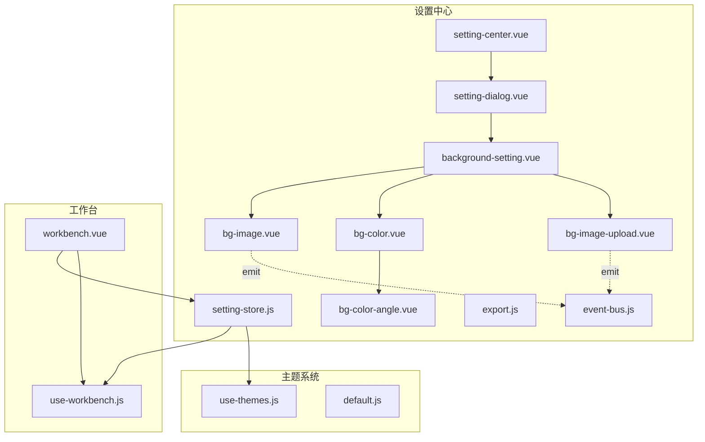
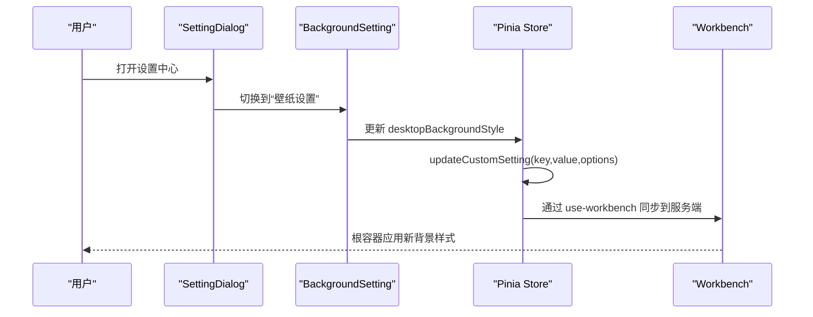
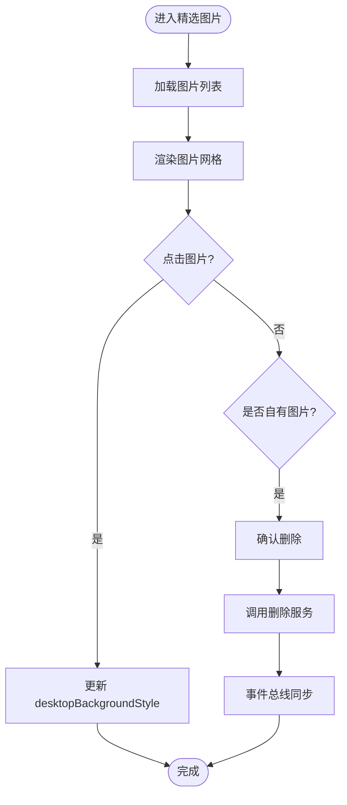
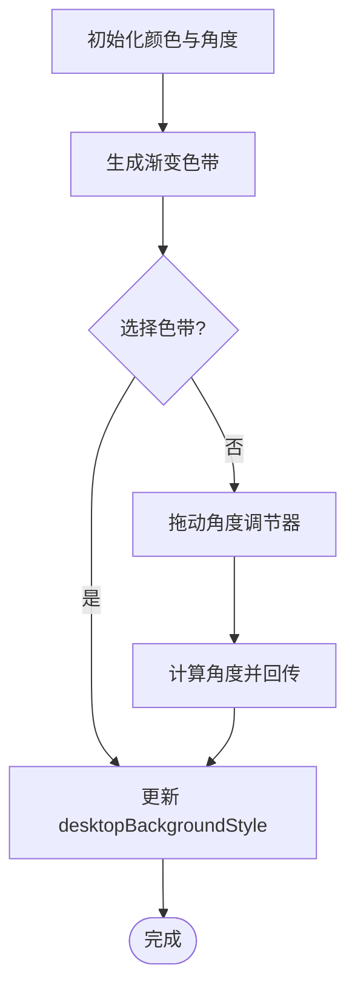
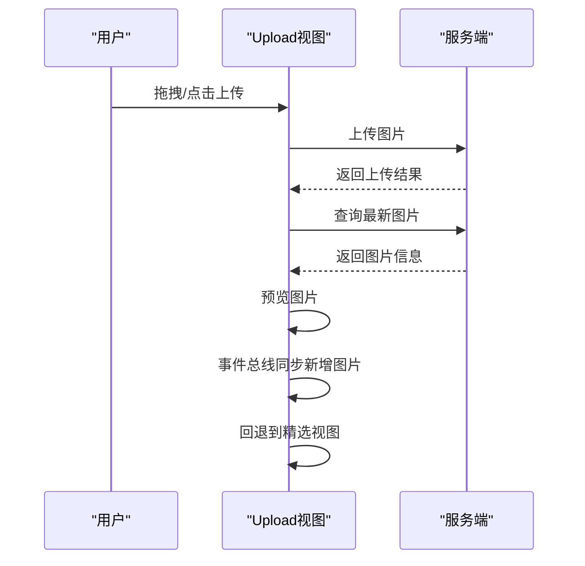
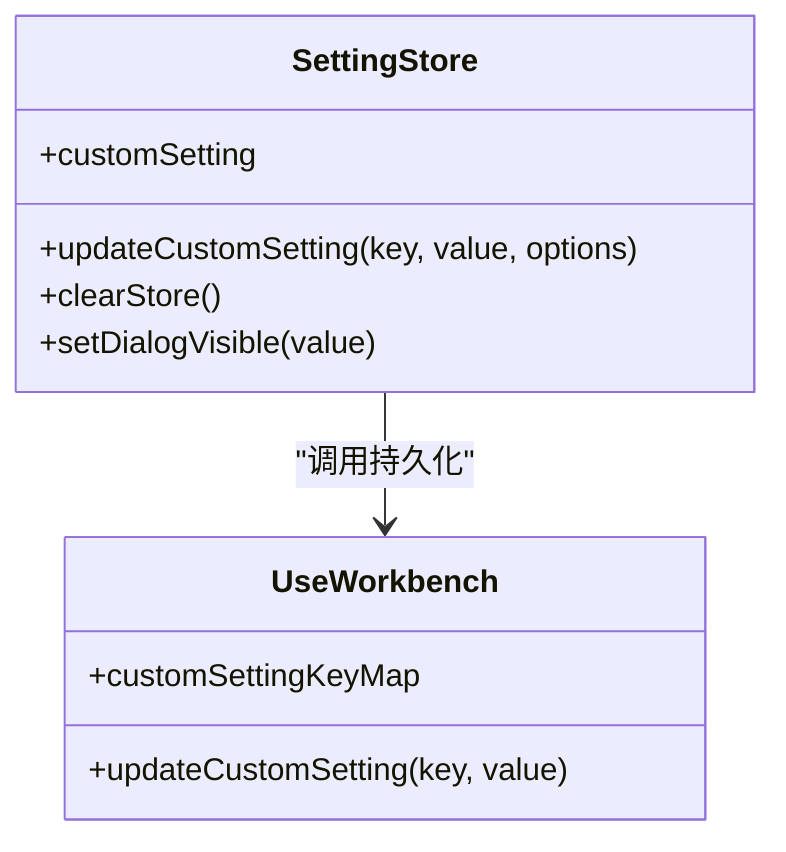
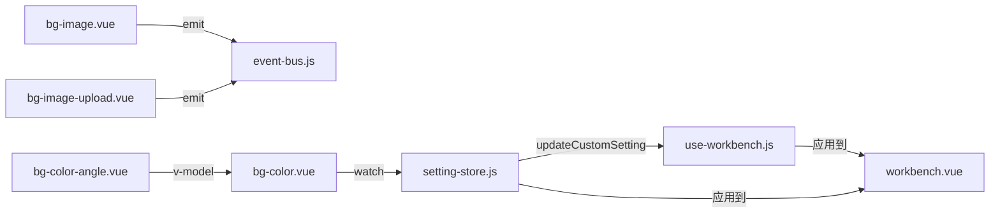

# 背景设置

<cite>
**本文引用的文件**
- [background-setting.vue](file://src/portal/views/workbench/setting-center/background/background-setting.vue)
- [bg-image.vue](file://src/portal/views/workbench/setting-center/background/bg-image.vue)
- [bg-color.vue](file://src/portal/views/workbench/setting-center/background/bg-color.vue)
- [bg-color-angle.vue](file://src/portal/views/workbench/setting-center/background/bg-color-angle.vue)
- [bg-image-upload.vue](file://src/portal/views/workbench/setting-center/background/bg-image-upload.vue)
- [event-bus.js](file://src/portal/views/workbench/setting-center/background/event-bus.js)
- [export.js](file://src/portal/views/workbench/setting-center/export.js)
- [setting-store.js](file://src/portal/views/workbench/setting-center/setting-store.js)
- [setting-dialog.vue](file://src/portal/views/workbench/setting-center/setting-dialog.vue)
- [setting-center.vue](file://src/portal/views/workbench/setting-center/setting-center.vue)
- [use-workbench.js](file://src/portal/views/workbench/use-workbench.js)
- [workbench.vue](file://src/portal/views/workbench/workbench.vue)
- [default.js](file://src/themes/default.js)
- [use-themes.js](file://src/portal/hooks/use-themes.js)
- [uploader.js](file://src/pages/idm/plugin/uploader.js)
</cite>

## 目录
1. [简介](#简介)
2. [项目结构](#项目结构)
3. [核心组件](#核心组件)
4. [架构总览](#架构总览)
5. [组件详解](#组件详解)
6. [依赖关系分析](#依赖关系分析)
7. [性能与体验](#性能与体验)
8. [故障排查指南](#故障排查指南)
9. [结论](#结论)
10. [附录](#附录)

## 简介
本文件面向FS-AOI-WEB“背景设置”模块，提供从功能到实现、从数据流到交互机制的完整技术文档。重点覆盖以下能力：
- 纯色背景与渐变背景的可视化选择与角度调节
- 背景图片的展示、删除与自定义上传
- 实时预览与即时生效
- 数据存储与持久化（本地Pinia Store + 远程服务）
- 事件通信机制（mitt）与跨组件协作
- 多浏览器兼容性与可扩展性建议
- API接口说明与配置参数
- 可定制扩展点与最佳实践

## 项目结构
背景设置位于“设置中心”下的“壁纸设置”模块，采用“主视图 + 子组件”的组合式设计，并通过Pinia Store集中管理设置项，最终由工作台根组件应用到全局背景。

**图表来源**
- [setting-center.vue](file://src/portal/views/workbench/setting-center/setting-center.vue#L1-L46)
- [setting-dialog.vue](file://src/portal/views/workbench/setting-center/setting-dialog.vue#L1-L59)
- [background-setting.vue](file://src/portal/views/workbench/setting-center/background/background-setting.vue#L1-L63)
- [bg-image.vue](file://src/portal/views/workbench/setting-center/background/bg-image.vue#L1-L181)
- [bg-color.vue](file://src/portal/views/workbench/setting-center/background/bg-color.vue#L1-L241)
- [bg-color-angle.vue](file://src/portal/views/workbench/setting-center/background/bg-color-angle.vue#L1-L115)
- [bg-image-upload.vue](file://src/portal/views/workbench/setting-center/background/bg-image-upload.vue#L1-L85)
- [event-bus.js](file://src/portal/views/workbench/setting-center/background/event-bus.js#L1-L4)
- [export.js](file://src/portal/views/workbench/setting-center/export.js#L1-L4)
- [setting-store.js](file://src/portal/views/workbench/setting-center/setting-store.js#L1-L43)
- [workbench.vue](file://src/portal/views/workbench/workbench.vue#L1-L235)
- [use-workbench.js](file://src/portal/views/workbench/use-workbench.js#L1-L222)
- [use-themes.js](file://src/portal/hooks/use-themes.js#L92-L196)
- [default.js](file://src/themes/default.js#L1-L113)

**章节来源**
- [background-setting.vue](file://src/portal/views/workbench/setting-center/background/background-setting.vue#L1-L63)
- [setting-dialog.vue](file://src/portal/views/workbench/setting-center/setting-dialog.vue#L1-L59)
- [setting-center.vue](file://src/portal/views/workbench/setting-center/setting-center.vue#L1-L46)

## 核心组件
- 背景设置主视图：负责标签页切换与上传视图的显隐控制
- 图片背景视图：加载并展示精选背景图，支持删除自有图片
- 渐变背景视图：主色/辅色选择、渐变色生成、角度调节
- 角度调节器：鼠标拖动计算角度并回传
- 图片上传视图：拖拽上传、进度提示、预览与回退
- 事件总线：用于跨组件数据同步（新增/删除图片）
- 设置Store：集中管理自定义设置项并持久化
- 工作台根组件：读取Store中的背景样式并应用到全局容器

**章节来源**
- [bg-image.vue](file://src/portal/views/workbench/setting-center/background/bg-image.vue#L1-L181)
- [bg-color.vue](file://src/portal/views/workbench/setting-center/background/bg-color.vue#L1-L241)
- [bg-color-angle.vue](file://src/portal/views/workbench/setting-center/background/bg-color-angle.vue#L1-L115)
- [bg-image-upload.vue](file://src/portal/views/workbench/setting-center/background/bg-image-upload.vue#L1-L85)
- [event-bus.js](file://src/portal/views/workbench/setting-center/background/event-bus.js#L1-L4)
- [setting-store.js](file://src/portal/views/workbench/setting-center/setting-store.js#L1-L43)
- [workbench.vue](file://src/portal/views/workbench/workbench.vue#L1-L235)

## 架构总览
背景设置的端到端流程如下：
- 用户在设置中心打开“壁纸设置”
- 选择“精选图片”或“渐变背景”，或进入“自定义上传”
- 通过Store更新“desktopBackgroundStyle”，并同步至远程
- 工作台根组件读取该样式并应用到根容器，实现全局背景变更

**图表来源**
- [setting-dialog.vue](file://src/portal/views/workbench/setting-center/setting-dialog.vue#L1-L59)
- [background-setting.vue](file://src/portal/views/workbench/setting-center/background/background-setting.vue#L1-L63)
- [setting-store.js](file://src/portal/views/workbench/setting-center/setting-store.js#L1-L43)
- [use-workbench.js](file://src/portal/views/workbench/use-workbench.js#L169-L195)
- [workbench.vue](file://src/portal/views/workbench/workbench.vue#L129-L162)

## 组件详解

### 背景设置主视图（background-setting.vue）
- 功能要点
  - 标签页：“精选图片”“渐变背景”
  - 上传视图显隐控制
  - 上传入口悬浮图标
- 关键交互
  - 切换标签页时，隐藏/显示对应面板
  - 点击上传图标进入上传视图

**章节来源**
- [background-setting.vue](file://src/portal/views/workbench/setting-center/background/background-setting.vue#L1-L63)

### 精选图片背景（bg-image.vue）
- 功能要点
  - 拉取精选图片列表并渲染
  - 点击图片即刻应用为桌面背景
  - 删除自有图片（仅限非公开）
- 数据与交互
  - 使用请求服务加载图片列表
  - 删除操作调用服务并提示结果
  - 通过事件总线同步新增/删除的图片数据，避免频繁刷新

**图表来源**
- [bg-image.vue](file://src/portal/views/workbench/setting-center/background/bg-image.vue#L68-L76)
- [bg-image.vue](file://src/portal/views/workbench/setting-center/background/bg-image.vue#L17-L22)
- [bg-image.vue](file://src/portal/views/workbench/setting-center/background/bg-image.vue#L30-L47)
- [event-bus.js](file://src/portal/views/workbench/setting-center/background/event-bus.js#L1-L4)

**章节来源**
- [bg-image.vue](file://src/portal/views/workbench/setting-center/background/bg-image.vue#L1-L181)

### 渐变背景（bg-color.vue）
- 功能要点
  - 主色/辅色选择器
  - 自动生成渐变色带
  - 角度调节器联动
- 计算逻辑
  - 通过颜色工具类生成中间色
  - 生成多组色带，点击任一组应用为背景
  - 角度变化时实时更新样式

**图表来源**
- [bg-color.vue](file://src/portal/views/workbench/setting-center/background/bg-color.vue#L105-L112)
- [bg-color.vue](file://src/portal/views/workbench/setting-center/background/bg-color.vue#L137-L147)
- [bg-color-angle.vue](file://src/portal/views/workbench/setting-center/background/bg-color-angle.vue#L13-L30)

**章节来源**
- [bg-color.vue](file://src/portal/views/workbench/setting-center/background/bg-color.vue#L1-L241)
- [bg-color-angle.vue](file://src/portal/views/workbench/setting-center/background/bg-color-angle.vue#L1-L115)

### 角度调节器（bg-color-angle.vue）
- 功能要点
  - 鼠标按下拖动，实时计算角度
  - 抬起时触发回调，将角度传递给父组件
- 数学计算
  - 基于鼠标偏移量计算弧度，再转角度
  - 限制角度范围并四舍五入

**章节来源**
- [bg-color-angle.vue](file://src/portal/views/workbench/setting-center/background/bg-color-angle.vue#L1-L115)

### 自定义上传（bg-image-upload.vue）
- 功能要点
  - 支持拖拽上传，显示进度与预览
  - 上传成功后拉取最新图片并自动应用
  - 回退到精选图片视图
- 上传路径
  - 目标服务端路径在组件内硬编码

**图表来源**
- [bg-image-upload.vue](file://src/portal/views/workbench/setting-center/background/bg-image-upload.vue#L14-L35)
- [bg-image-upload.vue](file://src/portal/views/workbench/setting-center/background/bg-image-upload.vue#L25-L30)
- [event-bus.js](file://src/portal/views/workbench/setting-center/background/event-bus.js#L1-L4)

**章节来源**
- [bg-image-upload.vue](file://src/portal/views/workbench/setting-center/background/bg-image-upload.vue#L1-L85)

### 事件通信机制（mitt）
- 作用
  - 在“精选图片”与“自定义上传”之间进行轻量数据同步
  - 避免重复拉取列表，提升交互流畅度
- 使用
  - 发送：在新增/删除图片后通过事件总线广播
  - 接收：在精选图片组件中订阅事件并更新本地列表

**章节来源**
- [event-bus.js](file://src/portal/views/workbench/setting-center/background/event-bus.js#L1-L4)
- [bg-image.vue](file://src/portal/views/workbench/setting-center/background/bg-image.vue#L62-L66)
- [bg-image-upload.vue](file://src/portal/views/workbench/setting-center/background/bg-image-upload.vue#L28-L30)

### 设置Store与持久化（setting-store.js + use-workbench.js）
- Store职责
  - 维护自定义设置项（含desktopBackgroundStyle）
  - 提供updateCustomSetting，支持同步到服务端
- 持久化映射
  - key到服务端字段的映射集中管理
  - updateCustomSetting统一调用服务端接口

**图表来源**
- [setting-store.js](file://src/portal/views/workbench/setting-center/setting-store.js#L1-L43)
- [use-workbench.js](file://src/portal/views/workbench/use-workbench.js#L169-L195)

**章节来源**
- [setting-store.js](file://src/portal/views/workbench/setting-center/setting-store.js#L1-L43)
- [use-workbench.js](file://src/portal/views/workbench/use-workbench.js#L169-L195)

### 工作台应用（workbench.vue）
- 背景应用
  - 从Store读取desktopBackgroundStyle
  - 直接作为根容器的内联样式应用
- 初始化
  - 启动时拉取用户自定义设置并写入Store
  - 同步当前主题与字号

**章节来源**
- [workbench.vue](file://src/portal/views/workbench/workbench.vue#L36-L78)
- [workbench.vue](file://src/portal/views/workbench/workbench.vue#L129-L162)

## 依赖关系分析
- 组件耦合
  - 背景设置主视图与各子组件松耦合，通过标签页切换组织
  - 事件总线承担“上传视图 ↔ 精选图片”之间的弱耦合数据通道
- 外部依赖
  - 请求服务：加载/删除/上传图片，更新自定义设置
  - 主题系统：字体大小等主题相关变量
- 循环依赖
  - 未发现直接循环；事件总线为单向广播

**图表来源**
- [bg-image.vue](file://src/portal/views/workbench/setting-center/background/bg-image.vue#L62-L66)
- [bg-image-upload.vue](file://src/portal/views/workbench/setting-center/background/bg-image-upload.vue#L28-L30)
- [bg-color.vue](file://src/portal/views/workbench/setting-center/background/bg-color.vue#L137-L147)
- [bg-color-angle.vue](file://src/portal/views/workbench/setting-center/background/bg-color-angle.vue#L8-L30)
- [setting-store.js](file://src/portal/views/workbench/setting-center/setting-store.js#L29-L41)
- [use-workbench.js](file://src/portal/views/workbench/use-workbench.js#L180-L195)
- [workbench.vue](file://src/portal/views/workbench/workbench.vue#L36-L78)

**章节来源**
- [bg-image.vue](file://src/portal/views/workbench/setting-center/background/bg-image.vue#L1-L181)
- [bg-color.vue](file://src/portal/views/workbench/setting-center/background/bg-color.vue#L1-L241)
- [bg-color-angle.vue](file://src/portal/views/workbench/setting-center/background/bg-color-angle.vue#L1-L115)
- [bg-image-upload.vue](file://src/portal/views/workbench/setting-center/background/bg-image-upload.vue#L1-L85)
- [setting-store.js](file://src/portal/views/workbench/setting-center/setting-store.js#L1-L43)
- [use-workbench.js](file://src/portal/views/workbench/use-workbench.js#L169-L195)
- [workbench.vue](file://src/portal/views/workbench/workbench.vue#L1-L235)

## 性能与体验
- 性能优化建议
  - 图片列表渲染：使用虚拟滚动或分页加载，避免一次性渲染过多DOM
  - 渐变色生成：缓存中间色结果，减少重复计算
  - 角度调节：节流/防抖鼠标移动事件，降低重绘频率
  - 上传预览：仅在上传成功后拉取最新图片，避免频繁请求
- 交互体验
  - 实时预览：Store更新即刻生效，无需刷新页面
  - 删除确认：使用气泡确认框，避免误删
  - 上传反馈：显示进度与成功提示，增强用户信心

[本节为通用指导，不直接分析具体文件]

## 故障排查指南
- 无法加载图片列表
  - 检查服务端接口返回结构与字段名一致性
  - 确认网络请求是否被拦截或跨域问题
- 删除图片失败
  - 校验删除参数（如BG_IMG_ID）是否正确传递
  - 查看服务端返回码与消息提示
- 上传后未应用
  - 确认上传成功回调是否触发查询最新图片
  - 检查事件总线是否正确广播新增图片
- 角度调节无效
  - 检查鼠标事件绑定与坐标计算逻辑
  - 确认v-model双向绑定是否正常

**章节来源**
- [bg-image.vue](file://src/portal/views/workbench/setting-center/background/bg-image.vue#L30-L47)
- [bg-image-upload.vue](file://src/portal/views/workbench/setting-center/background/bg-image-upload.vue#L14-L30)
- [bg-color-angle.vue](file://src/portal/views/workbench/setting-center/background/bg-color-angle.vue#L18-L30)

## 结论
背景设置模块以“设置中心 + 工作台根容器”的架构实现了从选择到应用的闭环。通过Pinia Store集中管理、mitt事件总线协调、use-workbench统一持久化，以及workbench实时应用，形成了高内聚、低耦合且体验友好的背景配置体系。后续可在图片懒加载、渐变色缓存、上传进度优化等方面进一步增强。

[本节为总结性内容，不直接分析具体文件]

## 附录

### API接口说明（服务端）
- 获取精选图片列表
  - 服务编号：F092003920
  - 返回：图片列表数据
- 删除自选图片
  - 服务编号：F092003921
  - 参数：BG_IMG_ID
- 上传图片并获取最新列表
  - 服务编号：F092003919
  - 参数：上传成功后的数据标识
- 获取用户自定义设置
  - 服务编号：F092003917
  - 返回：键值对形式的用户偏好
- 更新自定义设置
  - 服务编号：F092003918
  - 参数：按customSettingKeyMap映射的键值

**章节来源**
- [use-workbench.js](file://src/portal/views/workbench/use-workbench.js#L68-L73)
- [use-workbench.js](file://src/portal/views/workbench/use-workbench.js#L169-L195)
- [bg-image.vue](file://src/portal/views/workbench/setting-center/background/bg-image.vue#L68-L71)
- [bg-image-upload.vue](file://src/portal/views/workbench/setting-center/background/bg-image-upload.vue#L14-L29)

### 配置参数与映射
- desktopBackgroundStyle
  - 纯色/渐变：通过CSS linear-gradient与角度
  - 图片：通过background-url与cover属性
- customSettingKeyMap
  - desktopBackgroundStyle → DESKTOP_BG_STYLE

**章节来源**
- [setting-store.js](file://src/portal/views/workbench/setting-center/setting-store.js#L169-L178)
- [use-workbench.js](file://src/portal/views/workbench/use-workbench.js#L169-L178)

### 自定义扩展方法
- 新增背景类型
  - 在background-setting.vue中添加标签页与子组件
  - 在Store中扩展customSetting字段并在updateCustomSetting中处理
- 上传策略扩展
  - 替换或扩展上传组件的action与校验规则
  - 若需断点续传，可结合本地上传插件（uploader.js）进行二次封装
- 主题联动
  - 在updateCustomSetting中根据key触发use-themes相关逻辑（如字体大小）

**章节来源**
- [background-setting.vue](file://src/portal/views/workbench/setting-center/background/background-setting.vue#L20-L27)
- [setting-store.js](file://src/portal/views/workbench/setting-center/setting-store.js#L29-L41)
- [uploader.js](file://src/pages/idm/plugin/uploader.js#L1-L85)
- [use-themes.js](file://src/portal/hooks/use-themes.js#L165-L183)