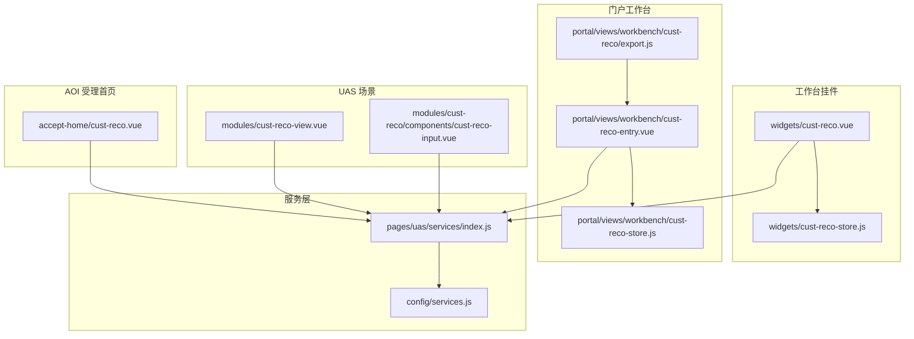
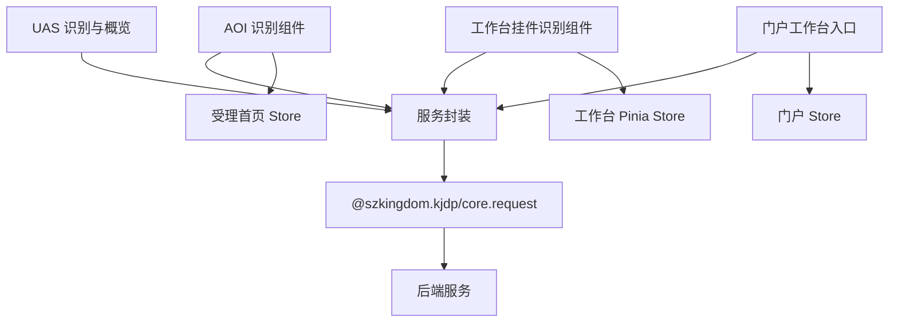
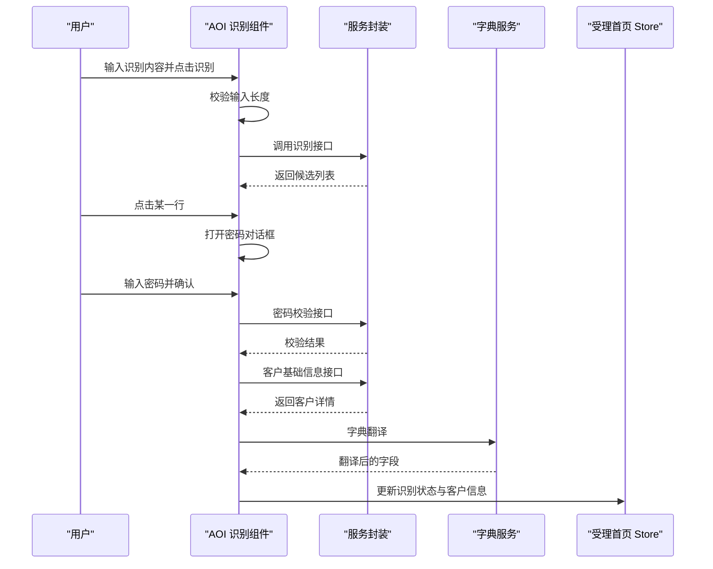
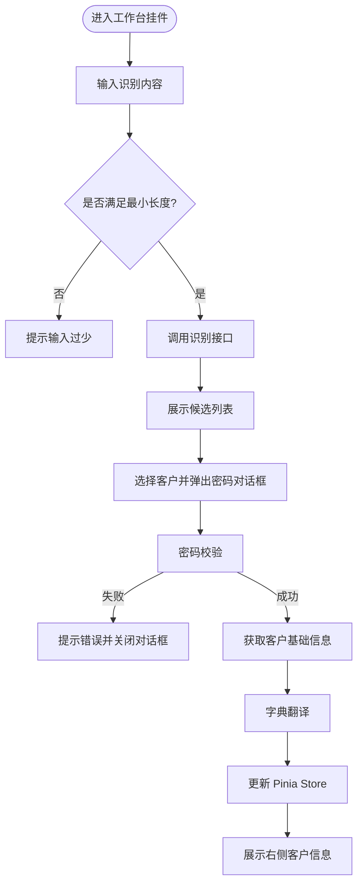
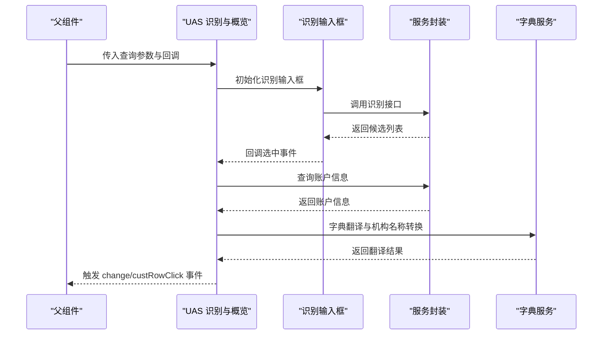
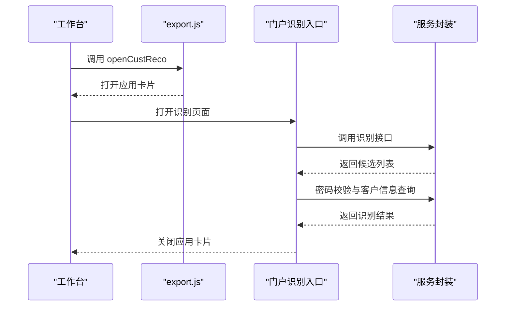
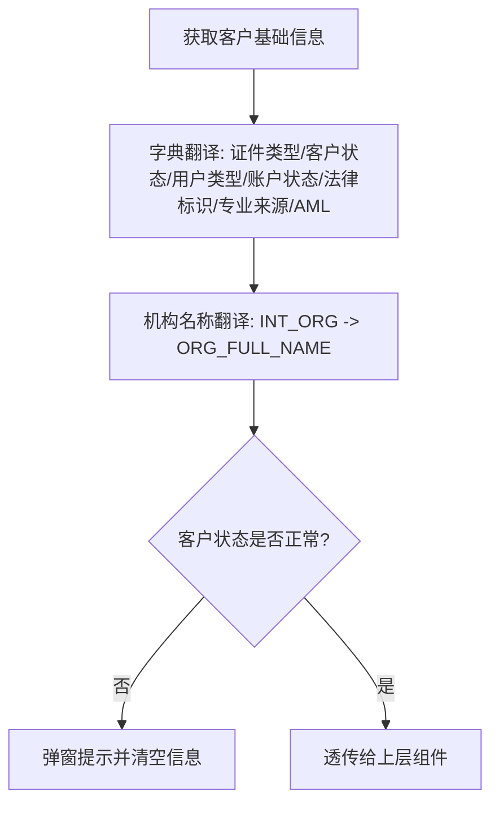
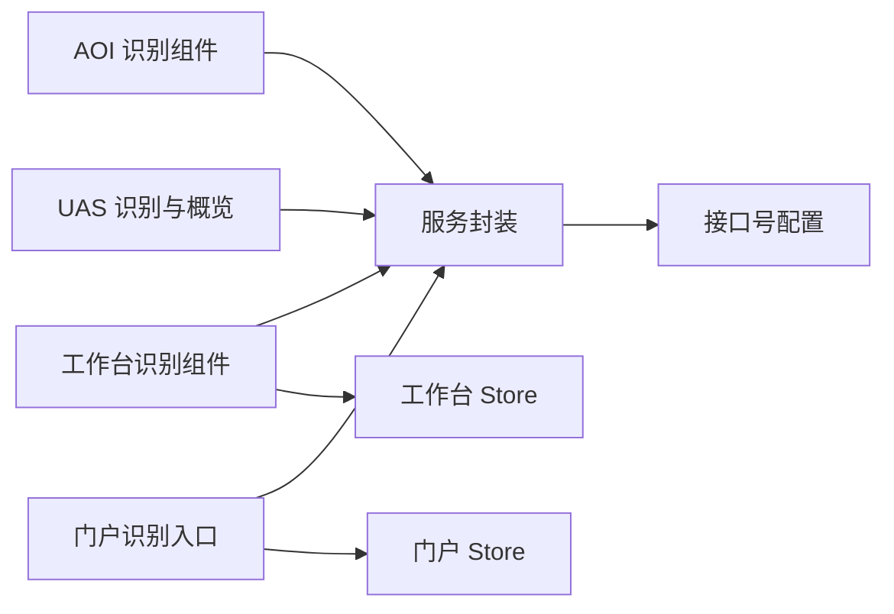

# 客户推荐

<cite>
**本文引用的文件**
- [src/pages/aoi/busi-frame/cust-reco/cust-reco.vue](file://src/pages/aoi/busi-frame/cust-reco/cust-reco.vue)
- [src/pages/frame/workbench-views/widgets/cust-reco/cust-reco.vue](file://src/pages/frame/workbench-views/widgets/cust-reco/cust-reco.vue)
- [src/pages/frame/workbench-views/widgets/cust-reco/cust-reco-store.js](file://src/pages/frame/workbench-views/widgets/cust-reco/cust-reco-store.js)
- [src/pages/aoi/busi-frame/accept-home/cust-reco/cust-reco.vue](file://src/pages/aoi/busi-frame/accept-home/cust-reco/cust-reco.vue)
- [src/pages/uas/modules/cust-reco-view.vue](file://src/pages/uas/modules/cust-reco-view.vue)
- [src/pages/uas/modules/cust-reco/components/cust-reco-input.vue](file://src/pages/uas/modules/cust-reco/components/cust-reco-input.vue)
- [src/pages/uas/services/index.js](file://src/pages/uas/services/index.js)
- [src/portal/views/workbench/cust-reco/cust-reco-entry.vue](file://src/portal/views/workbench/cust-reco/cust-reco-entry.vue)
- [src/portal/views/workbench/cust-reco/cust-reco-store.js](file://src/portal/views/workbench/cust-reco/cust-reco-store.js)
- [src/portal/views/workbench/cust-reco/export.js](file://src/portal/views/workbench/cust-reco/export.js)
- [src/pages/aoi/busi-frame/accept-home/cust-reco/cust-reco-store.js](file://src/pages/aoi/busi-frame/accept-home/cust-reco/cust-reco-store.js)
- [src/pages/aoi/busi-frame/accept-home/accept-home.vue](file://src/pages/aoi/busi-frame/accept-home/accept-home.vue)
- [src/config/services.js](file://src/config/services.js)
</cite>

## 目录
1. [引言](#引言)
2. [项目结构](#项目结构)
3. [核心组件](#核心组件)
4. [架构总览](#架构总览)
5. [详细组件分析](#详细组件分析)
6. [依赖分析](#依赖分析)
7. [性能考虑](#性能考虑)
8. [故障排查指南](#故障排查指南)
9. [结论](#结论)
10. [附录](#附录)

## 引言
本技术文档面向 FS-AOI-WEB 的“客户推荐”能力，聚焦于客户识别、信息概览与推荐结果呈现的端到端流程。系统通过统一的客户识别组件在不同场景（受理首页、工作台挂件、门户应用）中复用，结合 Pinia Store 实现跨视图的状态共享，并通过服务层封装与后端交互，完成客户基础信息与账户信息的查询与翻译，最终在界面中以描述项与表格形式展示，支撑后续业务流程的开展。

## 项目结构
围绕客户识别与信息概览的关键目录与文件如下：
- AOI 受理首页客户识别：src/pages/aoi/busi-frame/accept-home/cust-reco/
- 工作台挂件客户识别：src/pages/frame/workbench-views/widgets/cust-reco/
- UAS 场景下的识别与概览：src/pages/uas/modules/cust-reco-view.vue 与 src/pages/uas/modules/cust-reco/components/cust-reco-input.vue
- 门户工作台入口：src/portal/views/workbench/cust-reco/
- 服务封装与接口号配置：src/pages/uas/services/index.js、src/config/services.js

图表来源
- [src/pages/aoi/busi-frame/accept-home/cust-reco/cust-reco.vue](file://src/pages/aoi/busi-frame/accept-home/cust-reco/cust-reco.vue#L1-L353)
- [src/pages/frame/workbench-views/widgets/cust-reco/cust-reco.vue](file://src/pages/frame/workbench-views/widgets/cust-reco/cust-reco.vue#L1-L381)
- [src/pages/frame/workbench-views/widgets/cust-reco/cust-reco-store.js](file://src/pages/frame/workbench-views/widgets/cust-reco/cust-reco-store.js#L1-L21)
- [src/pages/uas/modules/cust-reco-view.vue](file://src/pages/uas/modules/cust-reco-view.vue#L1-L220)
- [src/pages/uas/modules/cust-reco/components/cust-reco-input.vue](file://src/pages/uas/modules/cust-reco/components/cust-reco-input.vue#L1-L220)
- [src/portal/views/workbench/cust-reco/cust-reco-entry.vue](file://src/portal/views/workbench/cust-reco/cust-reco-entry.vue#L1-L292)
- [src/portal/views/workbench/cust-reco/cust-reco-store.js](file://src/portal/views/workbench/cust-reco/cust-reco-store.js#L1-L21)
- [src/portal/views/workbench/cust-reco/export.js](file://src/portal/views/workbench/cust-reco/export.js#L1-L12)
- [src/pages/uas/services/index.js](file://src/pages/uas/services/index.js#L1-L596)
- [src/config/services.js](file://src/config/services.js#L1-L28)

章节来源
- [src/pages/aoi/busi-frame/accept-home/cust-reco/cust-reco.vue](file://src/pages/aoi/busi-frame/accept-home/cust-reco/cust-reco.vue#L1-L353)
- [src/pages/frame/workbench-views/widgets/cust-reco/cust-reco.vue](file://src/pages/frame/workbench-views/widgets/cust-reco/cust-reco.vue#L1-L381)
- [src/pages/uas/modules/cust-reco-view.vue](file://src/pages/uas/modules/cust-reco-view.vue#L1-L220)
- [src/pages/uas/modules/cust-reco/components/cust-reco-input.vue](file://src/pages/uas/modules/cust-reco/components/cust-reco-input.vue#L1-L220)
- [src/portal/views/workbench/cust-reco/cust-reco-entry.vue](file://src/portal/views/workbench/cust-reco/cust-reco-entry.vue#L1-L292)
- [src/pages/uas/services/index.js](file://src/pages/uas/services/index.js#L1-L596)
- [src/config/services.js](file://src/config/services.js#L1-L28)

## 核心组件
- 客户识别组件（AOI 受理首页）：负责输入识别、结果列表展示、密码校验与客户信息拉取，支持跳转至“客户360”概览。
- 客户识别组件（工作台挂件）：与 AOI 版本类似，但集成 Pinia Store 统一状态管理，支持“客户360”快捷入口与规范性检查区域。
- 客户识别组件（UAS 场景）：提供可复用的识别输入框与信息概览展示，支持状态校验与字典翻译。
- 门户工作台入口：以应用卡片形式打开客户识别页面，完成后关闭应用并回填状态。
- 服务层：封装账户系统与通用查询接口，统一请求与响应格式。

章节来源
- [src/pages/aoi/busi-frame/accept-home/cust-reco/cust-reco.vue](file://src/pages/aoi/busi-frame/accept-home/cust-reco/cust-reco.vue#L1-L353)
- [src/pages/frame/workbench-views/widgets/cust-reco/cust-reco.vue](file://src/pages/frame/workbench-views/widgets/cust-reco/cust-reco.vue#L1-L381)
- [src/pages/uas/modules/cust-reco-view.vue](file://src/pages/uas/modules/cust-reco-view.vue#L1-L220)
- [src/pages/uas/modules/cust-reco/components/cust-reco-input.vue](file://src/pages/uas/modules/cust-reco/components/cust-reco-input.vue#L1-L220)
- [src/portal/views/workbench/cust-reco/cust-reco-entry.vue](file://src/portal/views/workbench/cust-reco/cust-reco-entry.vue#L1-L292)

## 架构总览
系统采用“组件 + Store + 服务层”的分层架构：
- 视图层：各场景下的客户识别组件负责用户交互与结果展示。
- 状态层：Pinia Store 统一保存已识别客户信息，供其他视图共享。
- 服务层：封装请求方法，屏蔽具体接口号差异，便于替换与扩展。
- 配置层：集中管理平台/门户相关接口号与参数。

图表来源
- [src/pages/aoi/busi-frame/accept-home/cust-reco/cust-reco.vue](file://src/pages/aoi/busi-frame/accept-home/cust-reco/cust-reco.vue#L1-L353)
- [src/pages/frame/workbench-views/widgets/cust-reco/cust-reco.vue](file://src/pages/frame/workbench-views/widgets/cust-reco/cust-reco.vue#L1-L381)
- [src/pages/uas/modules/cust-reco-view.vue](file://src/pages/uas/modules/cust-reco-view.vue#L1-L220)
- [src/pages/uas/services/index.js](file://src/pages/uas/services/index.js#L1-L596)
- [src/portal/views/workbench/cust-reco/cust-reco-entry.vue](file://src/portal/views/workbench/cust-reco/cust-reco-entry.vue#L1-L292)

## 详细组件分析

### AOI 受理首页客户识别组件
- 输入与触发：支持输入客户名称、代码、证件号、资金账号等；最小输入长度校验；防重复触发。
- 结果展示：点击识别后返回候选列表，点击行触发密码对话框与二次校验。
- 信息拉取：密码校验通过后调用客户基础信息接口，进行字典翻译并更新 Store。
- 流程控制：识别成功后隐藏识别区，进入客户信息概览；支持打开“客户360”。

图表来源
- [src/pages/aoi/busi-frame/accept-home/cust-reco/cust-reco.vue](file://src/pages/aoi/busi-frame/accept-home/cust-reco/cust-reco.vue#L1-L353)
- [src/pages/uas/services/index.js](file://src/pages/uas/services/index.js#L1-L596)

章节来源
- [src/pages/aoi/busi-frame/accept-home/cust-reco/cust-reco.vue](file://src/pages/aoi/busi-frame/accept-home/cust-reco/cust-reco.vue#L1-L353)

### 工作台挂件客户识别组件
- 状态管理：使用 Pinia Store 统一保存识别状态与客户信息，支持“客户360”快捷入口。
- 交互增强：密码对话框、加载提示、点击空白关闭结果列表。
- 信息展示：右侧展示客户基础信息描述项，包含证件类型、客户状态、风险等级等。

图表来源
- [src/pages/frame/workbench-views/widgets/cust-reco/cust-reco.vue](file://src/pages/frame/workbench-views/widgets/cust-reco/cust-reco.vue#L1-L381)
- [src/pages/frame/workbench-views/widgets/cust-reco/cust-reco-store.js](file://src/pages/frame/workbench-views/widgets/cust-reco/cust-reco-store.js#L1-L21)

章节来源
- [src/pages/frame/workbench-views/widgets/cust-reco/cust-reco.vue](file://src/pages/frame/workbench-views/widgets/cust-reco/cust-reco.vue#L1-L381)
- [src/pages/frame/workbench-views/widgets/cust-reco/cust-reco-store.js](file://src/pages/frame/workbench-views/widgets/cust-reco/cust-reco-store.js#L1-L21)

### UAS 场景识别与信息概览
- 识别输入框：支持输入客户代码、主资金账号等；调用识别接口并展示候选列表。
- 信息概览：点击行后查询账户信息，进行字典翻译与状态校验，展示在描述项中。
- 对外暴露：提供 clear、getCustInfo、showCustInfo 等方法，便于上层业务调用。

图表来源
- [src/pages/uas/modules/cust-reco-view.vue](file://src/pages/uas/modules/cust-reco-view.vue#L1-L220)
- [src/pages/uas/modules/cust-reco/components/cust-reco-input.vue](file://src/pages/uas/modules/cust-reco/components/cust-reco-input.vue#L1-L220)
- [src/pages/uas/services/index.js](file://src/pages/uas/services/index.js#L1-L596)

章节来源
- [src/pages/uas/modules/cust-reco-view.vue](file://src/pages/uas/modules/cust-reco-view.vue#L1-L220)
- [src/pages/uas/modules/cust-reco/components/cust-reco-input.vue](file://src/pages/uas/modules/cust-reco/components/cust-reco-input.vue#L1-L220)
- [src/pages/uas/services/index.js](file://src/pages/uas/services/index.js#L1-L596)

### 门户工作台入口
- 应用打开：通过 export.js 打开客户识别应用卡片。
- 识别流程：与工作台挂件一致，密码校验通过后关闭应用并回填状态。
- Store 管理：使用独立的 Store 保存识别结果。

图表来源
- [src/portal/views/workbench/cust-reco/export.js](file://src/portal/views/workbench/cust-reco/export.js#L1-L12)
- [src/portal/views/workbench/cust-reco/cust-reco-entry.vue](file://src/portal/views/workbench/cust-reco/cust-reco-entry.vue#L1-L292)
- [src/portal/views/workbench/cust-reco/cust-reco-store.js](file://src/portal/views/workbench/cust-reco/cust-reco-store.js#L1-L21)

章节来源
- [src/portal/views/workbench/cust-reco/export.js](file://src/portal/views/workbench/cust-reco/export.js#L1-L12)
- [src/portal/views/workbench/cust-reco/cust-reco-entry.vue](file://src/portal/views/workbench/cust-reco/cust-reco-entry.vue#L1-L292)
- [src/portal/views/workbench/cust-reco/cust-reco-store.js](file://src/portal/views/workbench/cust-reco/cust-reco-store.js#L1-L21)

### 数据模型与字典翻译
- 客户基础信息字段：证件类型、客户状态、用户类型、账户状态、法律标识、专业投资者来源、AML 等。
- 机构名称翻译：通过机构服务获取内部机构映射，将 INT_ORG 映射为完整机构名称。
- 状态校验：当客户状态非正常时，阻断后续业务流程并提示。

图表来源
- [src/pages/frame/workbench-views/widgets/cust-reco/cust-reco.vue](file://src/pages/frame/workbench-views/widgets/cust-reco/cust-reco.vue#L109-L125)
- [src/pages/uas/modules/cust-reco-view.vue](file://src/pages/uas/modules/cust-reco-view.vue#L113-L131)

章节来源
- [src/pages/frame/workbench-views/widgets/cust-reco/cust-reco.vue](file://src/pages/frame/workbench-views/widgets/cust-reco/cust-reco.vue#L109-L125)
- [src/pages/uas/modules/cust-reco-view.vue](file://src/pages/uas/modules/cust-reco-view.vue#L113-L131)

## 依赖分析
- 组件耦合：各场景识别组件均依赖服务封装与字典服务，避免重复实现。
- 状态共享：工作台与门户场景使用 Pinia Store 统一状态，减少跨组件通信成本。
- 接口号管理：服务层集中封装接口号，配置层提供平台/门户默认值，便于替换与扩展。

图表来源
- [src/pages/aoi/busi-frame/accept-home/cust-reco/cust-reco.vue](file://src/pages/aoi/busi-frame/accept-home/cust-reco/cust-reco.vue#L1-L353)
- [src/pages/frame/workbench-views/widgets/cust-reco/cust-reco.vue](file://src/pages/frame/workbench-views/widgets/cust-reco/cust-reco.vue#L1-L381)
- [src/pages/uas/modules/cust-reco-view.vue](file://src/pages/uas/modules/cust-reco-view.vue#L1-L220)
- [src/portal/views/workbench/cust-reco/cust-reco-entry.vue](file://src/portal/views/workbench/cust-reco/cust-reco-entry.vue#L1-L292)
- [src/pages/uas/services/index.js](file://src/pages/uas/services/index.js#L1-L596)
- [src/config/services.js](file://src/config/services.js#L1-L28)

章节来源
- [src/pages/uas/services/index.js](file://src/pages/uas/services/index.js#L1-L596)
- [src/config/services.js](file://src/config/services.js#L1-L28)

## 性能考虑
- 防抖与去重：识别按钮在请求进行中禁用，避免重复触发。
- 最小输入长度：对中文按双字符计算，确保输入质量，减少无效请求。
- 列表渲染：候选列表采用虚拟滚动与固定列宽，降低 DOM 压力。
- 字典翻译：按需异步翻译，避免阻塞主线程。
- 加载提示：在关键步骤显示加载提示，提升用户体验。

## 故障排查指南
- 识别无结果：检查最小输入长度与接口号配置；确认候选列表为空时的提示信息。
- 密码校验失败：检查加密算法与参数传递；查看返回头信息中的错误原因。
- 客户信息不存在：确认客户是否存在且状态正常；检查字典翻译是否缺失对应键值。
- 状态异常：当客户状态非正常时，组件会弹窗提示并清空信息，需根据提示调整业务流程。

章节来源
- [src/pages/frame/workbench-views/widgets/cust-reco/cust-reco.vue](file://src/pages/frame/workbench-views/widgets/cust-reco/cust-reco.vue#L65-L125)
- [src/pages/uas/modules/cust-reco-view.vue](file://src/pages/uas/modules/cust-reco-view.vue#L96-L102)

## 结论
该客户推荐体系通过统一的识别组件与服务封装，在 AOI、工作台、UAS、门户等多个场景中实现了高复用与一致性。借助 Pinia Store 实现跨视图状态共享，配合字典翻译与状态校验，保障了客户信息的准确性与业务流程的合规性。未来可在识别算法、缓存策略与多因子匹配方面进一步优化，以提升推荐精度与响应速度。

## 附录

### API 接口与服务封装
- 客户基础信息查询：封装为 getCustBaseInfo，供 AOI 与 UAS 使用。
- 账户系统客户资产账户信息查询：封装为 getCustCuacctInfo，用于 UAS 场景的信息概览。
- 通用查询与平台配置：通过 config/services.js 管理平台/门户相关接口号。

章节来源
- [src/pages/uas/services/index.js](file://src/pages/uas/services/index.js#L1-L596)
- [src/config/services.js](file://src/config/services.js#L1-L28)

### 配置选项与扩展建议
- 接口号替换：在 config/services.js 中修改对应模块的接口号，即可全局替换。
- 识别规则扩展：在识别输入框组件中增加输入规则与提示文案，适配不同业务场景。
- 状态校验：在 UAS 场景中可根据业务需要扩展状态校验逻辑，确保业务合规。

章节来源
- [src/pages/uas/modules/cust-reco/components/cust-reco-input.vue](file://src/pages/uas/modules/cust-reco/components/cust-reco-input.vue#L1-L220)
- [src/pages/uas/modules/cust-reco-view.vue](file://src/pages/uas/modules/cust-reco-view.vue#L96-L102)
- [src/config/services.js](file://src/config/services.js#L1-L28)