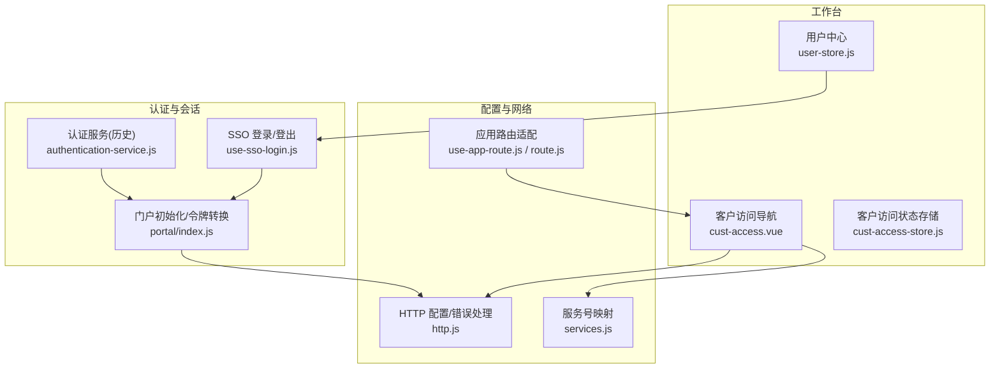
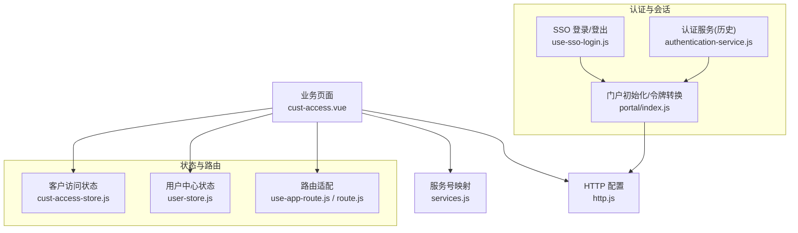
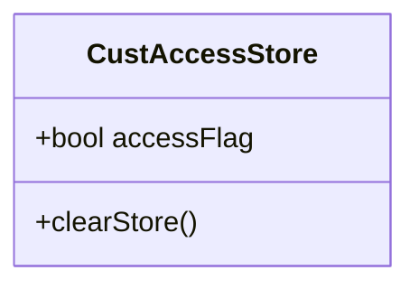
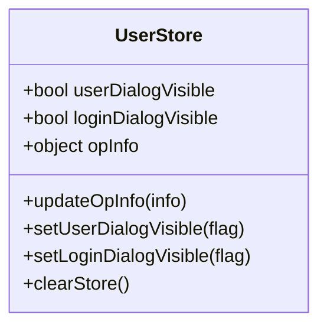
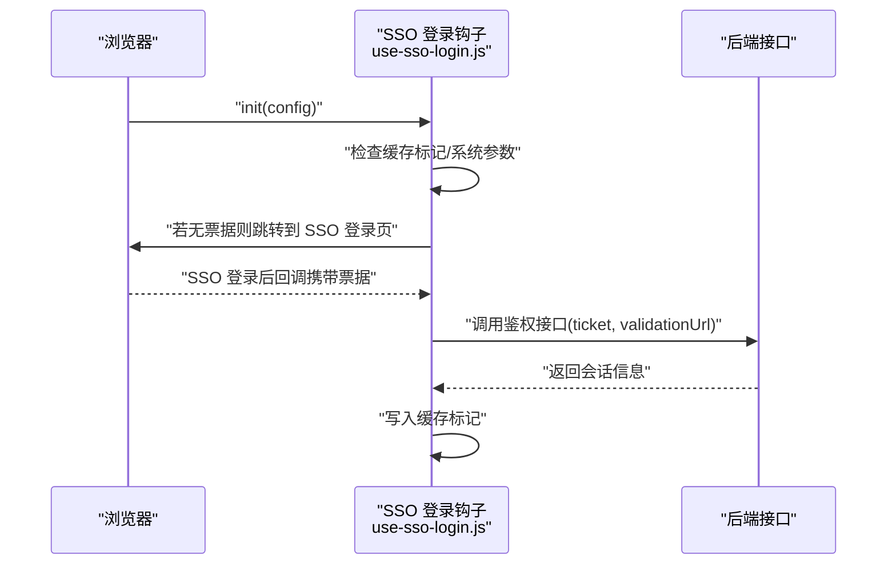
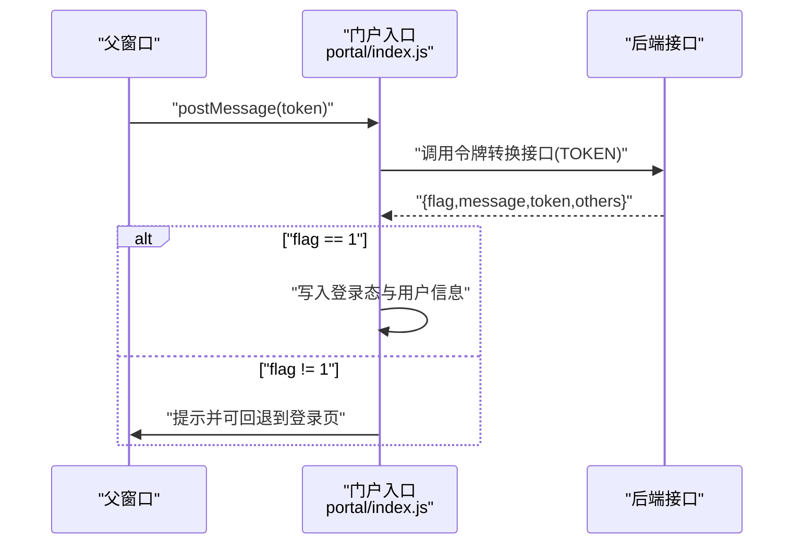
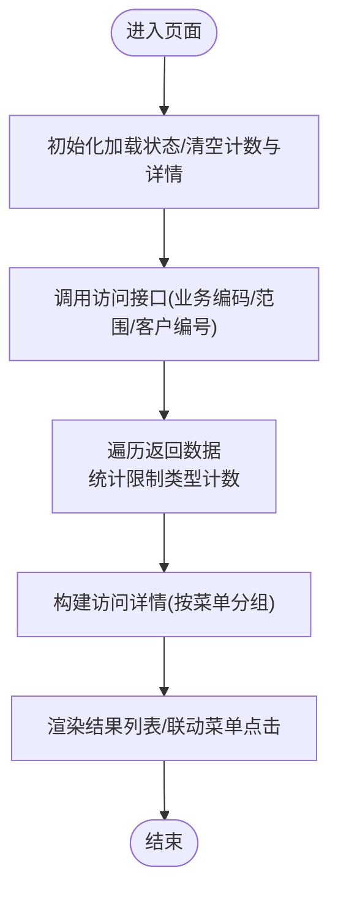
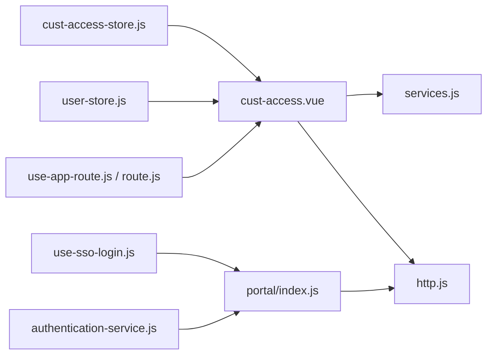

# 客户访问

<cite>
**本文引用的文件**
- [src/portal/views/workbench/cust-access/cust-access-store.js](file://src/portal/views/workbench/cust-access/cust-access-store.js)
- [src/portal/views/workbench/cust-access/export.js](file://src/portal/views/workbench/cust-access/export.js)
- [src/portal/views/workbench/user-center/user-store.js](file://src/portal/views/workbench/user-center/user-store.js)
- [src/portal/hooks/use-sso-login.js](file://src/portal/hooks/use-sso-login.js)
- [src/portal/index.js](file://src/portal/index.js)
- [src/config/http.js](file://src/config/http.js)
- [src/config/services.js](file://src/config/services.js)
- [src/portal/router/use-app-route.js](file://src/portal/router/use-app-route.js)
- [src/portal/views/workbench/route.js](file://src/portal/views/workbench/route.js)
- [public/static/flow/scripts/common/services/authentication-service.js](file://public/static/flow/scripts/common/services/authentication-service.js)
- [public/static/flow/scripts/landing-app.js](file://public/static/flow/scripts/landing-app.js)
- [src/pages/aoi/busi-frame/accept-home/cust-reco/busi-nav/cust-access.vue](file://src/pages/aoi/busi-frame/accept-home/cust-reco/busi-nav/cust-access.vue)
</cite>

## 目录
1. [引言](#引言)
2. [项目结构](#项目结构)
3. [核心组件](#核心组件)
4. [架构总览](#架构总览)
5. [详细组件分析](#详细组件分析)
6. [依赖关系分析](#依赖关系分析)
7. [性能考虑](#性能考虑)
8. [故障排查指南](#故障排查指南)
9. [结论](#结论)
10. [附录](#附录)

## 引言
本技术文档围绕 FS-AOI-WEB 客户访问系统展开，聚焦客户访问控制、访问权限管理、访问日志记录等客户相关能力。文档从系统架构、组件职责、数据与控制流、安全与异常处理、API 与配置、扩展开发等方面进行深入解析，并提供可视化图示帮助读者快速理解与落地实施。

## 项目结构
FS-AOI-WEB 采用前端多页面与工作台路由结合的组织方式，客户访问相关能力主要分布在以下区域：
- 工作台视图与路由：工作台下的用户中心、客户访问导航与业务入口
- 认证与会话：SSO 单点登录、门户会话与令牌管理
- 配置层：HTTP 请求封装、服务号映射、错误处理策略
- 业务页面：客户访问结果展示、权限判定与菜单联动

图表来源
- [src/portal/views/workbench/user-center/user-store.js](file://src/portal/views/workbench/user-center/user-store.js#L1-L32)
- [src/pages/aoi/busi-frame/accept-home/cust-reco/busi-nav/cust-access.vue](file://src/pages/aoi/busi-frame/accept-home/cust-reco/busi-nav/cust-access.vue#L1-L54)
- [src/portal/views/workbench/cust-access/cust-access-store.js](file://src/portal/views/workbench/cust-access/cust-access-store.js#L1-L15)
- [src/portal/hooks/use-sso-login.js](file://src/portal/hooks/use-sso-login.js#L1-L83)
- [src/portal/index.js](file://src/portal/index.js#L34-L60)
- [public/static/flow/scripts/common/services/authentication-service.js](file://public/static/flow/scripts/common/services/authentication-service.js#L151-L235)
- [src/config/http.js](file://src/config/http.js#L1-L124)
- [src/config/services.js](file://src/config/services.js#L1-L28)
- [src/portal/router/use-app-route.js](file://src/portal/router/use-app-route.js#L1-L13)
- [src/portal/views/workbench/route.js](file://src/portal/views/workbench/route.js#L1-L18)

章节来源
- [src/portal/views/workbench/user-center/user-store.js](file://src/portal/views/workbench/user-center/user-store.js#L1-L32)
- [src/pages/aoi/busi-frame/accept-home/cust-reco/busi-nav/cust-access.vue](file://src/pages/aoi/busi-frame/accept-home/cust-reco/busi-nav/cust-access.vue#L1-L54)
- [src/portal/views/workbench/cust-access/cust-access-store.js](file://src/portal/views/workbench/cust-access/cust-access-store.js#L1-L15)
- [src/portal/hooks/use-sso-login.js](file://src/portal/hooks/use-sso-login.js#L1-L83)
- [src/portal/index.js](file://src/portal/index.js#L34-L60)
- [public/static/flow/scripts/common/services/authentication-service.js](file://public/static/flow/scripts/common/services/authentication-service.js#L151-L235)
- [src/config/http.js](file://src/config/http.js#L1-L124)
- [src/config/services.js](file://src/config/services.js#L1-L28)
- [src/portal/router/use-app-route.js](file://src/portal/router/use-app-route.js#L1-L13)
- [src/portal/views/workbench/route.js](file://src/portal/views/workbench/route.js#L1-L18)

## 核心组件
- 客户访问状态存储：集中维护访问开关与清理动作，便于跨页面共享与重置
- 用户中心与登录态：封装登录对话框可见性、操作人信息持久化与事件派发
- SSO 登录与会话：统一处理 SSO 登录、票据校验、后端会话建立与登出
- 门户初始化与令牌转换：接收 iframe 回传 token，完成本地会话与用户信息缓存
- HTTP 配置与错误处理：统一错误提示、追踪 ID、请求扩展字段、加密开关
- 服务号映射：集中管理平台/门户/字典/系统参数等服务号，支持子系统开关
- 应用路由适配：根据工作台模式切换路由上下文，保证导航与参数一致性

章节来源
- [src/portal/views/workbench/cust-access/cust-access-store.js](file://src/portal/views/workbench/cust-access/cust-access-store.js#L1-L15)
- [src/portal/views/workbench/user-center/user-store.js](file://src/portal/views/workbench/user-center/user-store.js#L1-L32)
- [src/portal/hooks/use-sso-login.js](file://src/portal/hooks/use-sso-login.js#L1-L83)
- [src/portal/index.js](file://src/portal/index.js#L34-L60)
- [src/config/http.js](file://src/config/http.js#L1-L124)
- [src/config/services.js](file://src/config/services.js#L1-L28)
- [src/portal/router/use-app-route.js](file://src/portal/router/use-app-route.js#L1-L13)
- [src/portal/views/workbench/route.js](file://src/portal/views/workbench/route.js#L1-L18)

## 架构总览
客户访问系统以“工作台 + 业务页面 + 认证/会话 + 配置层”为核心，形成清晰的分层与职责边界。业务页面通过服务号调用后端接口，统一经 HTTP 层处理错误与追踪；SSO 与门户初始化负责登录态与令牌转换；状态存储与用户中心提供 UI 与会话支撑。

图表来源
- [src/pages/aoi/busi-frame/accept-home/cust-reco/busi-nav/cust-access.vue](file://src/pages/aoi/busi-frame/accept-home/cust-reco/busi-nav/cust-access.vue#L1-L54)
- [src/config/services.js](file://src/config/services.js#L1-L28)
- [src/config/http.js](file://src/config/http.js#L1-L124)
- [src/portal/hooks/use-sso-login.js](file://src/portal/hooks/use-sso-login.js#L1-L83)
- [src/portal/index.js](file://src/portal/index.js#L34-L60)
- [public/static/flow/scripts/common/services/authentication-service.js](file://public/static/flow/scripts/common/services/authentication-service.js#L151-L235)
- [src/portal/views/workbench/cust-access/cust-access-store.js](file://src/portal/views/workbench/cust-access/cust-access-store.js#L1-L15)
- [src/portal/views/workbench/user-center/user-store.js](file://src/portal/views/workbench/user-center/user-store.js#L1-L32)
- [src/portal/router/use-app-route.js](file://src/portal/router/use-app-route.js#L1-L13)
- [src/portal/views/workbench/route.js](file://src/portal/views/workbench/route.js#L1-L18)

## 详细组件分析

### 客户访问状态存储（Pinia Store）
- 职责：维护访问开关标志位，提供清理动作以便重置状态
- 关键点：集中式状态，避免重复初始化；可扩展为更细粒度的访问状态（如“已授权/受限/提示”）

图表来源
- [src/portal/views/workbench/cust-access/cust-access-store.js](file://src/portal/views/workbench/cust-access/cust-access-store.js#L1-L15)

章节来源
- [src/portal/views/workbench/cust-access/cust-access-store.js](file://src/portal/views/workbench/cust-access/cust-access-store.js#L1-L15)

### 用户中心与登录态（Pinia Store + 事件派发）
- 职责：控制登录对话框显隐、持久化操作人信息、监听登录/登出事件并同步状态
- 关键点：与门户子系统模式联动；基于会话存储恢复登录态

图表来源
- [src/portal/views/workbench/user-center/user-store.js](file://src/portal/views/workbench/user-center/user-store.js#L1-L32)

章节来源
- [src/portal/views/workbench/user-center/user-store.js](file://src/portal/views/workbench/user-center/user-store.js#L1-L32)

### SSO 登录与会话（SSO 初始化/票据校验/登出）
- 职责：检测系统参数开启 SSO 后，从 URL 获取票据并调用后端接口换取会话；支持登出跳转
- 关键点：票据来源支持 query/hash；登录成功写入缓存标记；可按需扩展鉴权参数

图表来源
- [src/portal/hooks/use-sso-login.js](file://src/portal/hooks/use-sso-login.js#L1-L83)

章节来源
- [src/portal/hooks/use-sso-login.js](file://src/portal/hooks/use-sso-login.js#L1-L83)

### 门户初始化与令牌转换（iframe 场景）
- 职责：接收来自父窗口的 token，调用后端接口转换为本地会话，设置登录态与用户信息
- 关键点：根据返回标志位决定是否弹窗提示；支持回退到登录页

图表来源
- [src/portal/index.js](file://src/portal/index.js#L34-L60)

章节来源
- [src/portal/index.js](file://src/portal/index.js#L34-L60)

### 客户访问业务页面（权限判定与菜单联动）
- 职责：根据客户编号与业务范围调用访问接口，统计限制类型计数，构建访问详情与菜单映射
- 关键点：支持不同业务编码走不同接口；对无菜单项做兜底处理；与点击回调联动

图表来源
- [src/pages/aoi/busi-frame/accept-home/cust-reco/busi-nav/cust-access.vue](file://src/pages/aoi/busi-frame/accept-home/cust-reco/busi-nav/cust-access.vue#L1-L54)

章节来源
- [src/pages/aoi/busi-frame/accept-home/cust-reco/busi-nav/cust-access.vue](file://src/pages/aoi/busi-frame/accept-home/cust-reco/busi-nav/cust-access.vue#L1-L54)

### HTTP 配置与错误处理
- 职责：统一错误提示、追踪 ID、请求扩展字段、加密开关；支持 KONE 环境下 Token 刷新拦截
- 关键点：基于服务号映射的基础路径；可扩展为动态密钥、统一加密等

章节来源
- [src/config/http.js](file://src/config/http.js#L1-L124)

### 服务号映射与子系统
- 职责：集中管理门户、菜单、字典、系统参数、机构等服务号；支持子系统开关
- 关键点：便于替换与扩展；与业务页面请求号解耦

章节来源
- [src/config/services.js](file://src/config/services.js#L1-L28)

### 应用路由适配
- 职责：根据工作台模式切换路由上下文，保证导航与参数一致性
- 关键点：与工作台路由映射配合使用

章节来源
- [src/portal/router/use-app-route.js](file://src/portal/router/use-app-route.js#L1-L13)
- [src/portal/views/workbench/route.js](file://src/portal/views/workbench/route.js#L1-L18)

## 依赖关系分析
- 页面依赖配置层：业务页面通过服务号映射与 HTTP 配置发起请求
- 认证链路：SSO → 门户初始化 → HTTP 配置；历史认证服务仍可作为兼容层
- 状态与路由：客户访问状态与用户中心状态被业务页面与导航组件共享；路由适配确保参数一致

图表来源
- [src/pages/aoi/busi-frame/accept-home/cust-reco/busi-nav/cust-access.vue](file://src/pages/aoi/busi-frame/accept-home/cust-reco/busi-nav/cust-access.vue#L1-L54)
- [src/config/services.js](file://src/config/services.js#L1-L28)
- [src/config/http.js](file://src/config/http.js#L1-L124)
- [src/portal/hooks/use-sso-login.js](file://src/portal/hooks/use-sso-login.js#L1-L83)
- [src/portal/index.js](file://src/portal/index.js#L34-L60)
- [public/static/flow/scripts/common/services/authentication-service.js](file://public/static/flow/scripts/common/services/authentication-service.js#L151-L235)
- [src/portal/views/workbench/cust-access/cust-access-store.js](file://src/portal/views/workbench/cust-access/cust-access-store.js#L1-L15)
- [src/portal/views/workbench/user-center/user-store.js](file://src/portal/views/workbench/user-center/user-store.js#L1-L32)
- [src/portal/router/use-app-route.js](file://src/portal/router/use-app-route.js#L1-L13)
- [src/portal/views/workbench/route.js](file://src/portal/views/workbench/route.js#L1-L18)

## 性能考虑
- 请求合并与去重：对相同业务范围与客户编号的访问请求进行去重与缓存
- 分页与懒加载：访问详情列表支持分页与懒加载，减少首屏压力
- 图标与文案：使用轻量级图标与文案，避免大体积资源阻塞渲染
- 加密与网络：按需开启加密与动态密钥，平衡安全与性能

## 故障排查指南
- 登录态异常
  - 检查 SSO 登录是否成功写入缓存标记
  - 核对门户初始化是否收到 token 并正确转换
  - 查看 HTTP 层错误提示与追踪 ID
- 权限判定异常
  - 核对业务编码与接口号映射
  - 检查访问接口返回结构与菜单映射逻辑
- 路由参数丢失
  - 确认工作台模式下使用路由适配器
  - 校验路由映射表是否正确设置

章节来源
- [src/portal/hooks/use-sso-login.js](file://src/portal/hooks/use-sso-login.js#L1-L83)
- [src/portal/index.js](file://src/portal/index.js#L34-L60)
- [src/config/http.js](file://src/config/http.js#L1-L124)
- [src/pages/aoi/busi-frame/accept-home/cust-reco/busi-nav/cust-access.vue](file://src/pages/aoi/busi-frame/accept-home/cust-reco/busi-nav/cust-access.vue#L1-L54)
- [src/portal/router/use-app-route.js](file://src/portal/router/use-app-route.js#L1-L13)
- [src/portal/views/workbench/route.js](file://src/portal/views/workbench/route.js#L1-L18)

## 结论
FS-AOI-WEB 客户访问系统通过清晰的分层与组件化设计，实现了从认证、会话、状态管理到业务页面的完整闭环。依托统一的 HTTP 配置与服务号映射，系统具备良好的可维护性与扩展性；结合 SSO 与门户初始化，满足复杂场景下的登录与令牌转换需求。建议后续在权限判定、访问日志与审计方面进一步完善，以提升系统的合规性与可观测性。

## 附录

### API 接口与配置要点
- 访问接口
  - 支持两种业务编码分支，分别调用不同接口号
  - 请求参数包含客户编号、业务编码、业务范围等
- 服务号映射
  - 门户、菜单、字典、系统参数、机构等服务号集中管理
- HTTP 配置
  - 错误提示、追踪 ID、请求扩展字段、加密开关
  - KONE 环境下 Token 刷新拦截

章节来源
- [src/pages/aoi/busi-frame/accept-home/cust-reco/busi-nav/cust-access.vue](file://src/pages/aoi/busi-frame/accept-home/cust-reco/busi-nav/cust-access.vue#L1-L54)
- [src/config/services.js](file://src/config/services.js#L1-L28)
- [src/config/http.js](file://src/config/http.js#L1-L124)

### 扩展开发指南
- 新增业务页面
  - 在工作台路由下新增页面，复用服务号映射与 HTTP 配置
  - 使用状态存储与用户中心状态进行登录态与参数管理
- 新增权限规则
  - 在访问接口返回结构中扩展限制类型与菜单映射
  - 更新统计与渲染逻辑
- 新增认证方式
  - 在 SSO 登录钩子中扩展票据来源与鉴权参数
  - 在门户初始化中增加令牌转换逻辑

章节来源
- [src/portal/views/workbench/route.js](file://src/portal/views/workbench/route.js#L1-L18)
- [src/portal/router/use-app-route.js](file://src/portal/router/use-app-route.js#L1-L13)
- [src/portal/hooks/use-sso-login.js](file://src/portal/hooks/use-sso-login.js#L1-L83)
- [src/portal/index.js](file://src/portal/index.js#L34-L60)
- [src/pages/aoi/busi-frame/accept-home/cust-reco/busi-nav/cust-access.vue](file://src/pages/aoi/busi-frame/accept-home/cust-reco/busi-nav/cust-access.vue#L1-L54)