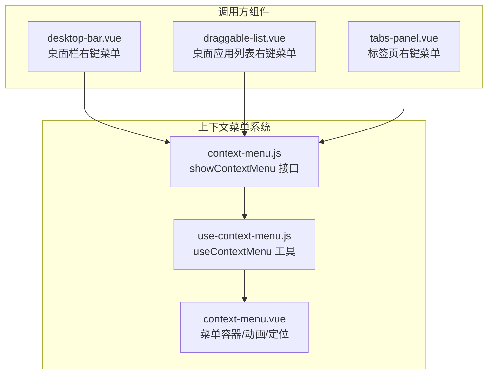
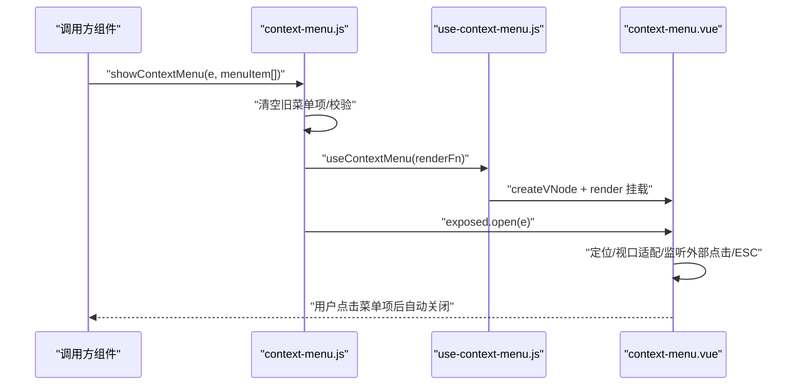
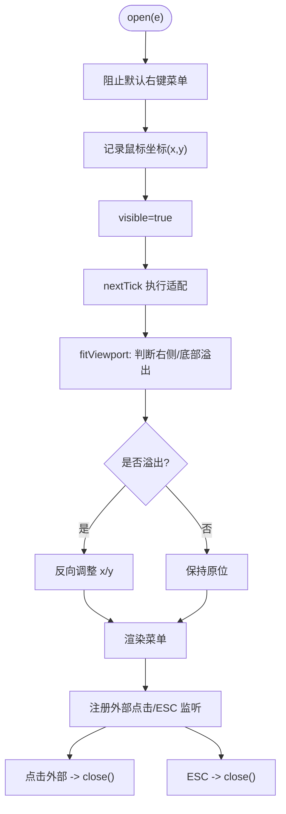
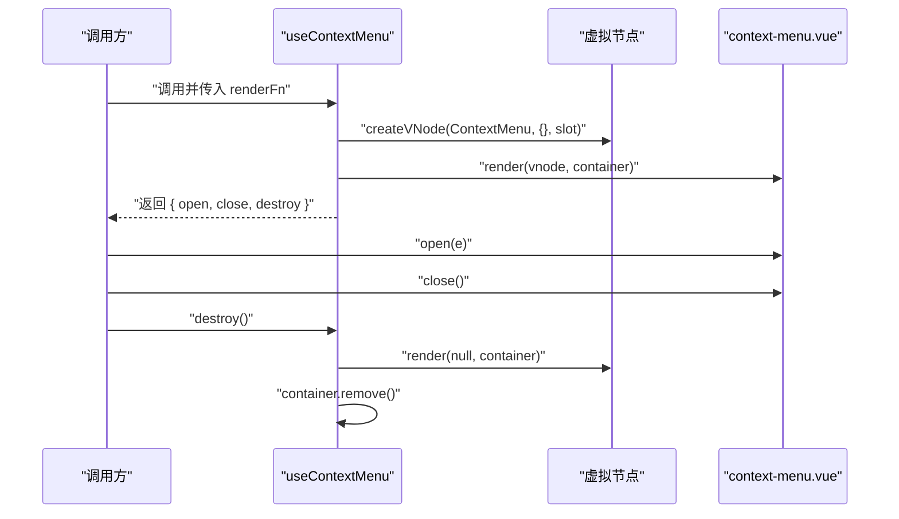
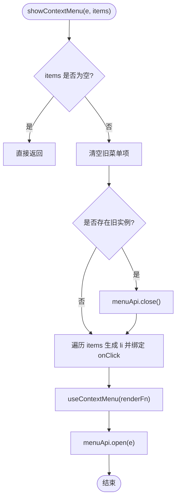
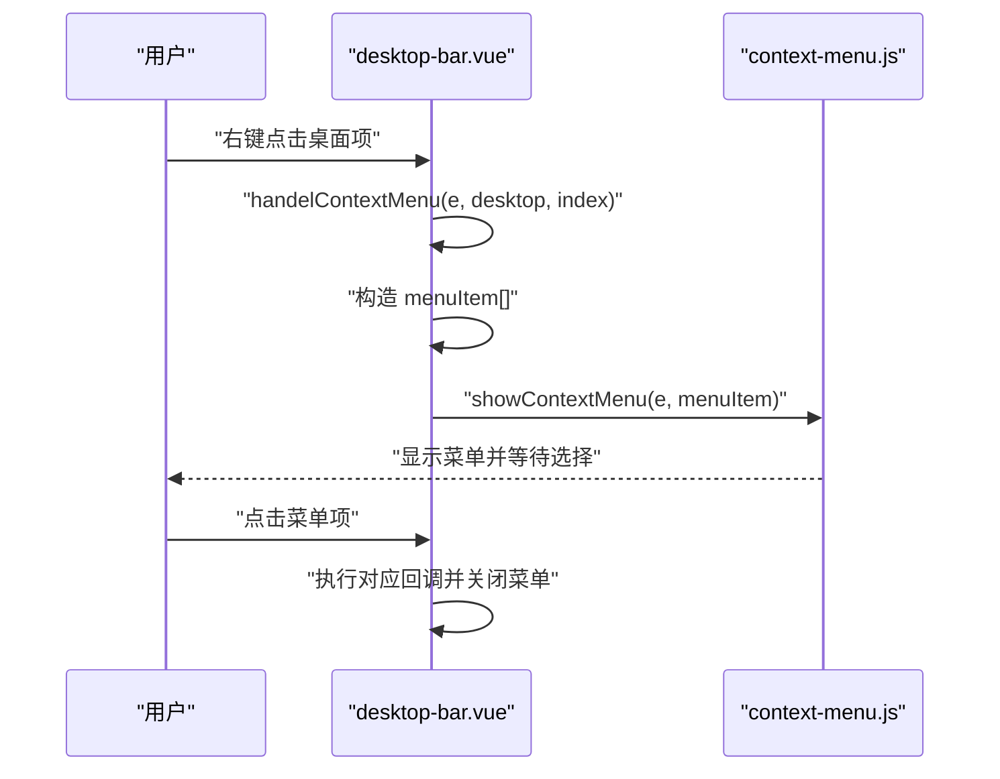
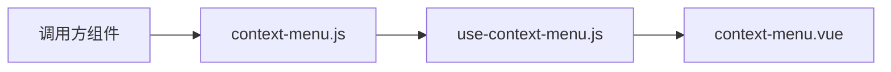

# 上下文菜单

<cite>
**本文引用的文件**
- [context-menu.js](file://src/portal/views/workbench/components/context-menu.js)
- [use-context-menu.js](file://src/portal/views/workbench/components/use-context-menu.js)
- [context-menu.vue](file://src/portal/views/workbench/components/context-menu.vue)
- [desktop-bar.vue](file://src/portal/views/workbench/desktop-bar/desktop-bar.vue)
- [draggable-list.vue](file://src/portal/views/workbench/desktop-view/draggable-list.vue)
- [tabs-panel.vue](file://src/portal/modules/tabs/tabs-panel.vue)
</cite>

## 目录
1. [简介](#简介)
2. [项目结构](#项目结构)
3. [核心组件](#核心组件)
4. [架构总览](#架构总览)
5. [详细组件分析](#详细组件分析)
6. [依赖关系分析](#依赖关系分析)
7. [性能考量](#性能考量)
8. [故障排查指南](#故障排查指南)
9. [结论](#结论)
10. [附录](#附录)

## 简介
本文件为 FS-AOI-WEB 的上下文菜单系统提供完整技术参考，覆盖设计原理、实现机制、触发方式、显示/隐藏逻辑、动态配置、权限控制、状态管理、样式定制、动画效果与键盘导航等。通过 Vue 组合式 API 与 Teleport 实现无 DOM 泄漏的弹出菜单，支持自动适配视口边界，提供可扩展的菜单项生成与事件绑定能力。

## 项目结构
上下文菜单系统由三层协作构成：
- 组件层：context-menu.vue 提供可复用的菜单容器与渲染插槽
- 工具层：use-context-menu.js 封装生命周期与挂载/卸载逻辑
- 调用层：context-menu.js 暴露 showContextMenu 接口，负责接收菜单项并驱动组件展示

调用方在需要右键菜单的页面组件中引入 showContextMenu，并在相应元素上绑定 contextmenu 事件，传入动态菜单项数组即可。

图表来源
- [context-menu.js](file://src/portal/views/workbench/components/context-menu.js#L1-L42)
- [use-context-menu.js](file://src/portal/views/workbench/components/use-context-menu.js#L1-L20)
- [context-menu.vue](file://src/portal/views/workbench/components/context-menu.vue#L1-L87)
- [desktop-bar.vue](file://src/portal/views/workbench/desktop-bar/desktop-bar.vue#L82-L102)
- [draggable-list.vue](file://src/portal/views/workbench/desktop-view/draggable-list.vue#L412-L451)
- [tabs-panel.vue](file://src/portal/modules/tabs/tabs-panel.vue#L9-L34)

章节来源
- [context-menu.js](file://src/portal/views/workbench/components/context-menu.js#L1-L42)
- [use-context-menu.js](file://src/portal/views/workbench/components/use-context-menu.js#L1-L20)
- [context-menu.vue](file://src/portal/views/workbench/components/context-menu.vue#L1-L87)
- [desktop-bar.vue](file://src/portal/views/workbench/desktop-bar/desktop-bar.vue#L82-L102)
- [draggable-list.vue](file://src/portal/views/workbench/desktop-view/draggable-list.vue#L412-L451)
- [tabs-panel.vue](file://src/portal/modules/tabs/tabs-panel.vue#L9-L34)

## 核心组件
- context-menu.vue
  - 负责定位（基于鼠标坐标）、视口适配（溢出自动反向）、点击外部关闭、ESC 关闭、Teleport 渲染到 body、过渡动画
  - 暴露 open/close 暴露给调用方，内部通过 ref 控制可见性与样式
- use-context-menu.js
  - 使用 createVNode + render 在 body 动态挂载 context-menu.vue，返回 open/close/destroy 方法
  - destroy 时移除 DOM，避免内存泄漏
- context-menu.js
  - 接收事件对象与菜单项数组，清空旧项、构建新项、调用 useContextMenu 打开菜单

章节来源
- [context-menu.vue](file://src/portal/views/workbench/components/context-menu.vue#L1-L87)
- [use-context-menu.js](file://src/portal/views/workbench/components/use-context-menu.js#L1-L20)
- [context-menu.js](file://src/portal/views/workbench/components/context-menu.js#L1-L42)

## 架构总览
上下文菜单采用“接口层 + 工具层 + 容器组件”的分层设计，调用方仅需关心传入菜单项与事件，无需处理 DOM 生命周期与定位细节。

图表来源
- [context-menu.js](file://src/portal/views/workbench/components/context-menu.js#L26-L41)
- [use-context-menu.js](file://src/portal/views/workbench/components/use-context-menu.js#L4-L18)
- [context-menu.vue](file://src/portal/views/workbench/components/context-menu.vue#L9-L32)

## 详细组件分析

### 组件 A：context-menu.vue（菜单容器）
- 触发与定位
  - open(e) 阻止默认右键菜单，记录鼠标坐标，设置可见并延后执行视口适配
- 视口适配
  - fitViewport 计算菜单尺寸，若右侧或底部越界则反向左对齐或上对齐，保证完全在可视区内
- 交互行为
  - 点击外部区域或按 ESC 自动关闭
  - 内部点击不冒泡，避免触发外部关闭
- 插槽与暴露
  - 通过 <slot :close="close" /> 向调用方注入关闭函数，便于菜单项回调后自动关闭
  - defineExpose 暴露 open/close 供工具层调用
- 样式与动画
  - 固定定位、阴影、圆角、hover 背景色
  - Transition fade 实现淡入淡出

图表来源
- [context-menu.vue](file://src/portal/views/workbench/components/context-menu.vue#L9-L41)

章节来源
- [context-menu.vue](file://src/portal/views/workbench/components/context-menu.vue#L1-L87)

### 组件 B：use-context-menu.js（生命周期与挂载）
- 动态挂载
  - 在 body 创建容器，使用 createVNode + render 渲染 context-menu.vue
- 生命周期
  - 返回 open/close/destroy；destroy 会卸载并移除容器节点
- 与容器通信
  - 通过 vnode.component.exposed 获取容器组件暴露的方法

图表来源
- [use-context-menu.js](file://src/portal/views/workbench/components/use-context-menu.js#L4-L18)
- [context-menu.vue](file://src/portal/views/workbench/components/context-menu.vue#L43-L43)

章节来源
- [use-context-menu.js](file://src/portal/views/workbench/components/use-context-menu.js#L1-L20)

### 组件 C：context-menu.js（接口层）
- 菜单项生成
  - 接收 menuItem 数组，每个元素包含 name 与 callback
  - 内部通过 h('li') 动态生成列表项，点击后先执行回调再关闭菜单
- 打开流程
  - 清空旧菜单项
  - 若存在旧实例则先关闭
  - 逐项构建菜单项
  - 调用 useContextMenu 并 open(e)

图表来源
- [context-menu.js](file://src/portal/views/workbench/components/context-menu.js#L26-L41)

章节来源
- [context-menu.js](file://src/portal/views/workbench/components/context-menu.js#L1-L42)

### 调用示例：桌面栏右键菜单（desktop-bar.vue）
- 事件绑定
  - 在桌面项上绑定 @contextmenu.prevent="handelContextMenu(...)"
- 菜单项构造
  - 编辑：打开编辑面板
  - 删除：从列表移除该项并更新数据
- 打开菜单
  - 调用 showContextMenu(e, menuItem)

图表来源
- [desktop-bar.vue](file://src/portal/views/workbench/desktop-bar/desktop-bar.vue#L82-L102)
- [context-menu.js](file://src/portal/views/workbench/components/context-menu.js#L26-L41)

章节来源
- [desktop-bar.vue](file://src/portal/views/workbench/desktop-bar/desktop-bar.vue#L82-L102)

### 调用示例：桌面应用列表右键菜单（draggable-list.vue）
- 事件绑定
  - 在应用项上绑定 @contextmenu.prevent="handelContextMenu(...)"
- 菜单项构造
  - 根据 isFolder 参数区分文件夹/应用项，构造不同操作菜单
- 打开菜单
  - 调用 showContextMenu(e, menuItem)

章节来源
- [draggable-list.vue](file://src/portal/views/workbench/desktop-view/draggable-list.vue#L412-L451)
- [context-menu.js](file://src/portal/views/workbench/components/context-menu.js#L26-L41)

### 调用示例：标签页右键菜单（tabs-panel.vue）
- 事件绑定
  - 在标签项上绑定 @contextmenu.prevent="handleEvent"
  - 支持 trigger="contextmenu" 的弹层触发
- 菜单项构造
  - 可根据当前标签动态生成“关闭”、“关闭其他”、“刷新”等操作
- 打开菜单
  - 调用 showContextMenu(e, menuItem)

章节来源
- [tabs-panel.vue](file://src/portal/modules/tabs/tabs-panel.vue#L9-L34)
- [context-menu.js](file://src/portal/views/workbench/components/context-menu.js#L26-L41)

## 依赖关系分析
- 组件耦合
  - 调用方仅依赖 context-menu.js 的 showContextMenu 接口，低耦合
  - context-menu.vue 作为纯展示组件，无业务逻辑，高内聚
- 外部依赖
  - Vue 3 组合式 API（ref、nextTick、onMounted、onBeforeUnmount）
  - Teleport 将菜单渲染到 body，避免定位受父级 overflow 影响
  - Transition 提供淡入淡出动画
- 可能的循环依赖
  - 当前结构为单向依赖：调用方 -> context-menu.js -> use-context-menu.js -> context-menu.vue，无循环

图表来源
- [context-menu.js](file://src/portal/views/workbench/components/context-menu.js#L1-L42)
- [use-context-menu.js](file://src/portal/views/workbench/components/use-context-menu.js#L1-L20)
- [context-menu.vue](file://src/portal/views/workbench/components/context-menu.vue#L1-L87)

章节来源
- [context-menu.js](file://src/portal/views/workbench/components/context-menu.js#L1-L42)
- [use-context-menu.js](file://src/portal/views/workbench/components/use-context-menu.js#L1-L20)
- [context-menu.vue](file://src/portal/views/workbench/components/context-menu.vue#L1-L87)

## 性能考量
- 渲染策略
  - 使用 Teleport 直接挂载到 body，减少层级嵌套带来的布局抖动
  - 动态生成菜单项，避免预渲染大量静态菜单
- 事件监听
  - 仅在组件挂载时注册 click/keydown 监听，在卸载时移除，防止内存泄漏
- 视口适配
  - fitViewport 仅在首次可见时计算一次，避免频繁重排
- 动画
  - Transition fade 过渡时间短（0.15s），保证流畅体验且开销小

## 故障排查指南
- 菜单不显示
  - 检查是否传入了空的 menuItem 数组
  - 确认调用 showContextMenu 时传入的是原生 MouseEvent（含 clientX/clientY）
- 菜单位置异常
  - 检查父级是否有 transform/overflow 导致定位偏差；建议使用 Teleport 到 body
  - 确认 fitViewport 是否正确执行（确保 visible=true 后再计算尺寸）
- 点击外部未关闭
  - 确保 onClickOutside 未被拦截；检查是否有阻止冒泡的元素
- ESC 无效
  - 确认 document 上的 keydown 监听是否生效
- 内存泄漏
  - 使用 destroy 或在组件卸载时手动销毁；确认容器节点已被移除

章节来源
- [context-menu.vue](file://src/portal/views/workbench/components/context-menu.vue#L34-L41)
- [use-context-menu.js](file://src/portal/views/workbench/components/use-context-menu.js#L14-L18)

## 结论
FS-AOI-WEB 的上下文菜单系统以“接口层 + 工具层 + 容器组件”的清晰分层实现了高内聚、低耦合、易扩展的右键菜单能力。通过 Teleport、Transition、响应式与生命周期钩子，系统在功能完整性与性能表现之间取得良好平衡。调用方只需关注菜单项的动态生成与回调逻辑，即可快速集成一致的右键体验。

## 附录

### 配置参数与事件处理
- showContextMenu(e, menuItem[])
  - e: 原生 MouseEvent（必须包含 clientX/clientY）
  - menuItem[]: 菜单项数组，每项包含 name 与 callback
- context-menu.vue 暴露方法
  - open(e): 显示并定位
  - close(): 隐藏
  - destroy(): 卸载并移除容器
- 插槽参数
  - :close: 用于菜单项回调后主动关闭菜单

章节来源
- [context-menu.js](file://src/portal/views/workbench/components/context-menu.js#L26-L41)
- [context-menu.vue](file://src/portal/views/workbench/components/context-menu.vue#L43-L53)

### 扩展开发指南
- 新增菜单项
  - 在调用方构造 menuItem[]，传入 name 与 callback
- 权限控制
  - 在构造 menuItem[] 时按用户角色/权限过滤，仅生成可访问项
- 状态管理
  - 可结合 store 在回调中更新全局状态，如当前选中项、激活标签页等
- 样式定制
  - 修改 context-menu.vue 中的 SCSS 变量与类名，或在调用方通过作用域样式覆盖
- 键盘导航
  - 当前支持 ESC 关闭；如需方向键导航，可在容器内增加键盘事件监听并在插槽中暴露 navigate/close

章节来源
- [context-menu.vue](file://src/portal/views/workbench/components/context-menu.vue#L56-L86)
- [context-menu.js](file://src/portal/views/workbench/components/context-menu.js#L10-L24)