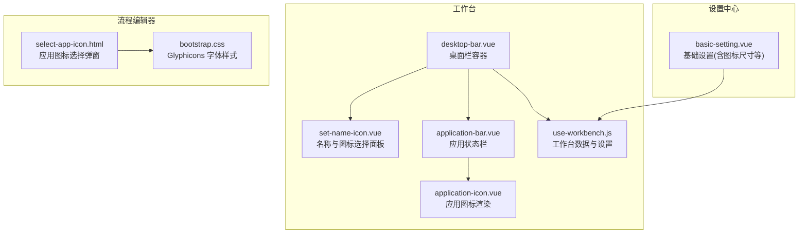
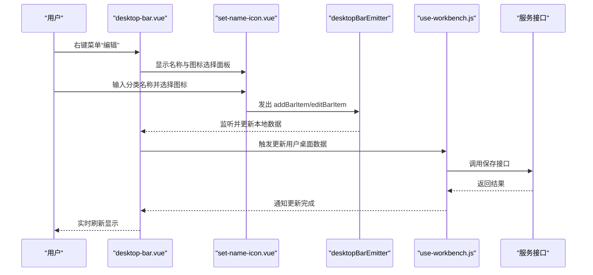
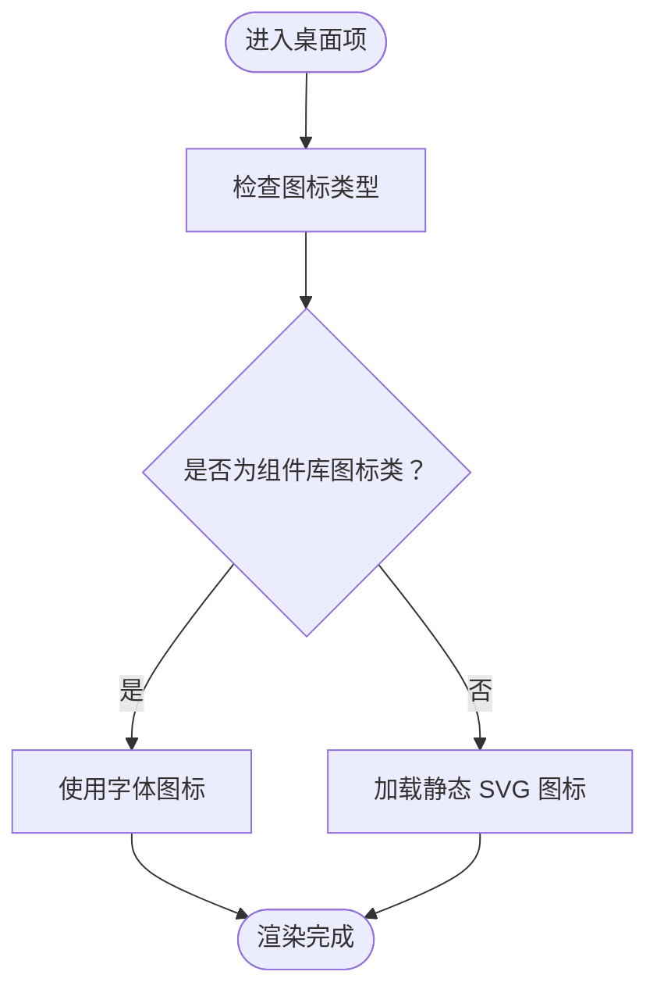
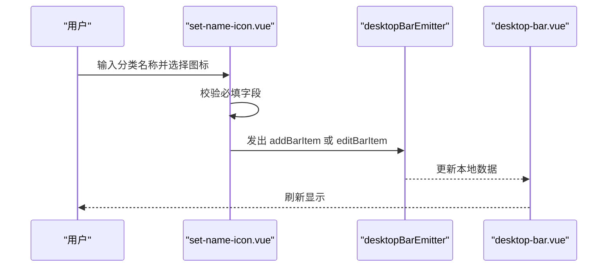
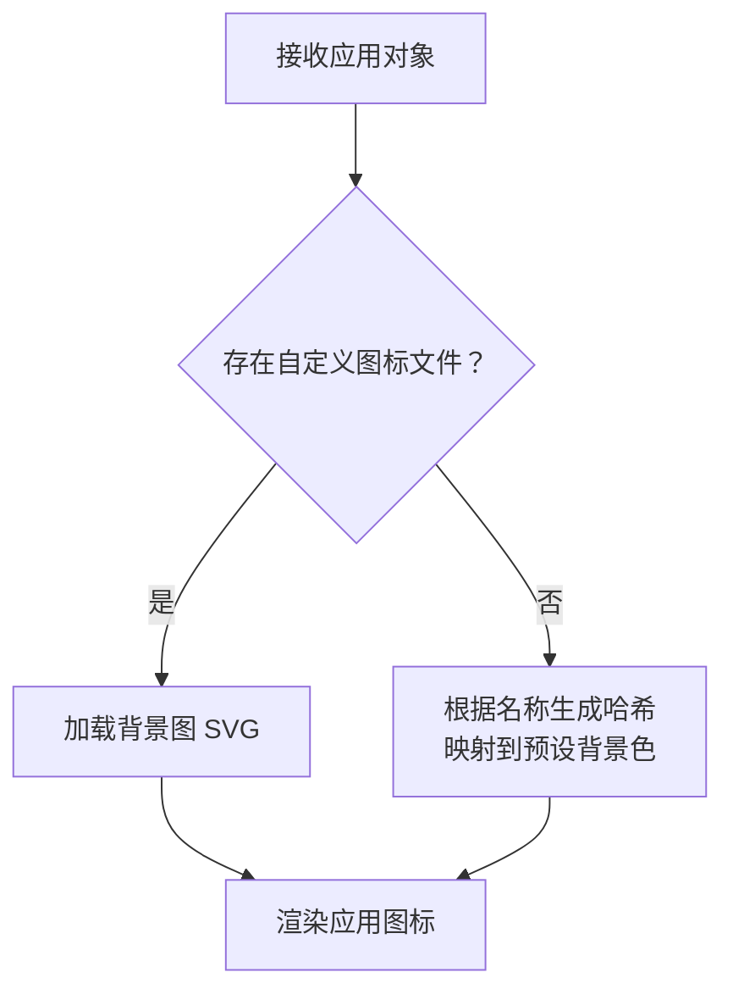
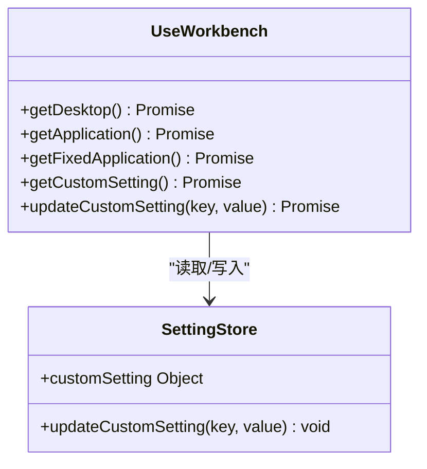
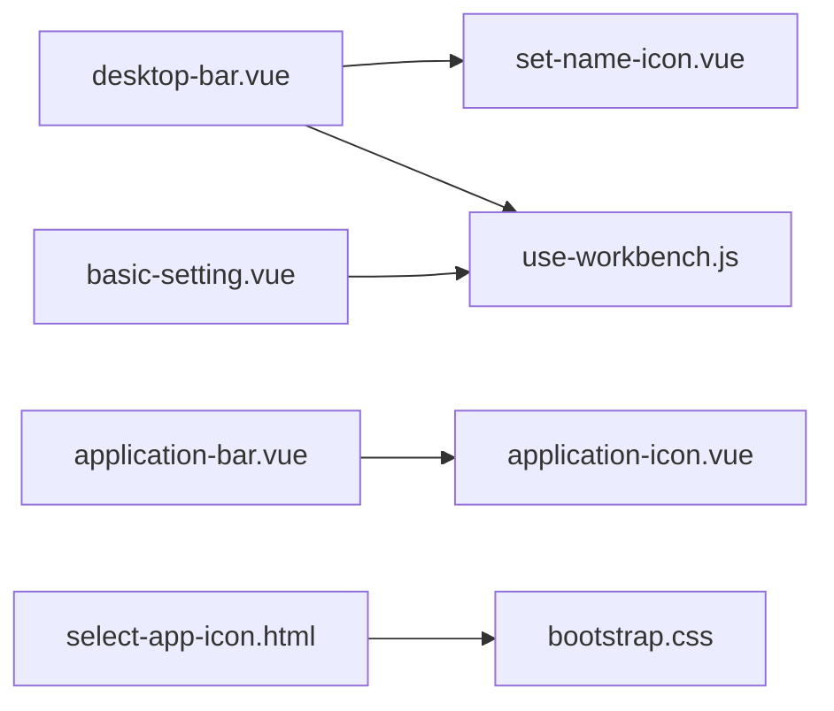

# 图标管理

<cite>
**本文引用的文件**   
- [src/portal/views/workbench/desktop-bar/desktop-bar.vue](file://src/portal/views/workbench/desktop-bar/desktop-bar.vue)
- [src/portal/views/workbench/desktop-bar/set-name-icon.vue](file://src/portal/views/workbench/desktop-bar/set-name-icon.vue)
- [src/portal/views/workbench/desktop-view/application-icon.vue](file://src/portal/views/workbench/desktop-view/application-icon.vue)
- [src/portal/views/workbench/application-bar/application-bar.vue](file://src/portal/views/workbench/application-bar/application-bar.vue)
- [src/portal/views/workbench/use-workbench.js](file://src/portal/views/workbench/use-workbench.js)
- [public/static/flow/editor/views/popover/select-app-icon.html](file://public/static/flow/editor/views/popover/select-app-icon.html)
- [public/static/flow/libs/bootstrap_3.1.1/css/bootstrap.css](file://public/static/flow/libs/bootstrap_3.1.1/css/bootstrap.css)
- [src/pages/uas/components/default-home/menu-card.vue](file://src/pages/uas/components/default-home/menu-card.vue)
- [src/portal/views/layout/views/content/template/default-home/menu-card.vue](file://src/portal/views/layout/views/content/template/default-home/menu-card.vue)
- [src/portal/views/workbench/setting-center/basic/basic-setting.vue](file://src/portal/views/workbench/setting-center/basic/basic-setting.vue)
</cite>

## 目录
1. [简介](#简介)
2. [项目结构](#项目结构)
3. [核心组件](#核心组件)
4. [架构总览](#架构总览)
5. [详细组件分析](#详细组件分析)
6. [依赖关系分析](#依赖关系分析)
7. [性能考虑](#性能考虑)
8. [故障排查指南](#故障排查指南)
9. [结论](#结论)
10. [附录](#附录)

## 简介
本技术文档围绕 FS-AOI-WEB 的图标管理系统展开，系统性阐述图标显示、名称设置、图标替换、数据结构、存储机制、缓存策略、用户交互、批量操作、实时更新、样式定制、尺寸适配与格式支持，并提供配置项、API 接口与扩展开发指南。目标是帮助开发者快速理解并高效维护与扩展图标管理能力。

## 项目结构
图标管理涉及工作台桌面栏、应用栏、应用图标渲染、设置中心以及流程编辑器中的图标选择弹窗等模块。整体采用基于 Vue 组件的分层设计，通过事件总线在组件间传递状态与指令，结合后端服务进行持久化。

**图表来源**
- [src/portal/views/workbench/desktop-bar/desktop-bar.vue](file://src/portal/views/workbench/desktop-bar/desktop-bar.vue#L1-L409)
- [src/portal/views/workbench/desktop-bar/set-name-icon.vue](file://src/portal/views/workbench/desktop-bar/set-name-icon.vue#L1-L168)
- [src/portal/views/workbench/desktop-view/application-icon.vue](file://src/portal/views/workbench/desktop-view/application-icon.vue#L1-L69)
- [src/portal/views/workbench/application-bar/application-bar.vue](file://src/portal/views/workbench/application-bar/application-bar.vue#L1-L135)
- [src/portal/views/workbench/use-workbench.js](file://src/portal/views/workbench/use-workbench.js#L1-L222)
- [src/portal/views/workbench/setting-center/basic/basic-setting.vue](file://src/portal/views/workbench/setting-center/basic/basic-setting.vue#L1-L30)
- [public/static/flow/editor/views/popover/select-app-icon.html](file://public/static/flow/editor/views/popover/select-app-icon.html#L1-L18)
- [public/static/flow/libs/bootstrap_3.1.1/css/bootstrap.css](file://public/static/flow/libs/bootstrap_3.1.1/css/bootstrap.css#L2391-L2951)

**章节来源**
- [src/portal/views/workbench/desktop-bar/desktop-bar.vue](file://src/portal/views/workbench/desktop-bar/desktop-bar.vue#L1-L409)
- [src/portal/views/workbench/desktop-bar/set-name-icon.vue](file://src/portal/views/workbench/desktop-bar/set-name-icon.vue#L1-L168)
- [src/portal/views/workbench/desktop-view/application-icon.vue](file://src/portal/views/workbench/desktop-view/application-icon.vue#L1-L69)
- [src/portal/views/workbench/application-bar/application-bar.vue](file://src/portal/views/workbench/application-bar/application-bar.vue#L1-L135)
- [src/portal/views/workbench/use-workbench.js](file://src/portal/views/workbench/use-workbench.js#L1-L222)
- [src/portal/views/workbench/setting-center/basic/basic-setting.vue](file://src/portal/views/workbench/setting-center/basic/basic-setting.vue#L1-L30)
- [public/static/flow/editor/views/popover/select-app-icon.html](file://public/static/flow/editor/views/popover/select-app-icon.html#L1-L18)
- [public/static/flow/libs/bootstrap_3.1.1/css/bootstrap.css](file://public/static/flow/libs/bootstrap_3.1.1/css/bootstrap.css#L2391-L2951)

## 核心组件
- 桌面栏容器：负责桌面分类项的展示、拖拽排序、右键菜单、图标与名称的显示与更新。
- 名称与图标选择面板：提供分类名称输入与图标选择，支持从图标库中选择并保存。
- 应用图标渲染：根据应用配置决定使用图片图标或字体图标（含首字母占位）。
- 应用状态栏：展示已打开应用的状态与图标，支持悬浮提示。
- 工作台数据与设置：封装桌面、应用、固定应用、自定义设置的获取与更新逻辑。
- 设置中心基础设置：暴露图标尺寸、应用栏位置等可调参数。
- 流程编辑器图标选择弹窗：提供 Glyphicons 图标集合供选择。

**章节来源**
- [src/portal/views/workbench/desktop-bar/desktop-bar.vue](file://src/portal/views/workbench/desktop-bar/desktop-bar.vue#L1-L409)
- [src/portal/views/workbench/desktop-bar/set-name-icon.vue](file://src/portal/views/workbench/desktop-bar/set-name-icon.vue#L1-L168)
- [src/portal/views/workbench/desktop-view/application-icon.vue](file://src/portal/views/workbench/desktop-view/application-icon.vue#L1-L69)
- [src/portal/views/workbench/application-bar/application-bar.vue](file://src/portal/views/workbench/application-bar/application-bar.vue#L1-L135)
- [src/portal/views/workbench/use-workbench.js](file://src/portal/views/workbench/use-workbench.js#L1-L222)
- [src/portal/views/workbench/setting-center/basic/basic-setting.vue](file://src/portal/views/workbench/setting-center/basic/basic-setting.vue#L1-L30)
- [public/static/flow/editor/views/popover/select-app-icon.html](file://public/static/flow/editor/views/popover/select-app-icon.html#L1-L18)

## 架构总览
图标管理采用“组件-事件-服务”的分层架构：
- 组件层：桌面栏、图标选择面板、应用图标、应用栏、设置面板。
- 事件层：桌面栏事件总线用于跨组件通信（如新增/编辑分类项、选中/位置变更）。
- 服务层：工作台数据服务负责从后端拉取/更新桌面、应用、固定应用与自定义设置；设置中心通过服务写回设置。

**图表来源**
- [src/portal/views/workbench/desktop-bar/desktop-bar.vue](file://src/portal/views/workbench/desktop-bar/desktop-bar.vue#L81-L141)
- [src/portal/views/workbench/desktop-bar/set-name-icon.vue](file://src/portal/views/workbench/desktop-bar/set-name-icon.vue#L18-L33)
- [src/portal/views/workbench/use-workbench.js](file://src/portal/views/workbench/use-workbench.js#L167-L195)

**章节来源**
- [src/portal/views/workbench/desktop-bar/desktop-bar.vue](file://src/portal/views/workbench/desktop-bar/desktop-bar.vue#L81-L141)
- [src/portal/views/workbench/desktop-bar/set-name-icon.vue](file://src/portal/views/workbench/desktop-bar/set-name-icon.vue#L18-L33)
- [src/portal/views/workbench/use-workbench.js](file://src/portal/views/workbench/use-workbench.js#L167-L195)

## 详细组件分析

### 桌面栏容器（desktop-bar）
职责与特性：
- 展示桌面分类项，支持悬停显示名称、点击进入对应桌面。
- 支持拖拽排序与右键菜单（编辑/删除）。
- 动态加载图标库，优先使用组件库图标类，否则回退到静态 SVG 图片。
- 通过事件总线接收“选中/位置/新增/编辑”等指令，实时更新本地数据并通知用户中心持久化。

关键交互流程（图标显示与替换）：
- 图标显示：若图标属于组件库图标类则使用字体图标，否则加载静态 SVG。
- 图标替换：通过名称与图标选择面板发出事件，桌面栏监听并更新本地数据，随后触发用户中心更新。

**图表来源**
- [src/portal/views/workbench/desktop-bar/desktop-bar.vue](file://src/portal/views/workbench/desktop-bar/desktop-bar.vue#L202-L211)

**章节来源**
- [src/portal/views/workbench/desktop-bar/desktop-bar.vue](file://src/portal/views/workbench/desktop-bar/desktop-bar.vue#L1-L409)

### 名称与图标选择面板（set-name-icon）
职责与特性：
- 提供分类名称输入框与图标网格选择区。
- 初始化时从组件库枚举所有可用图标类，支持滚动定位到当前选中图标。
- 保存时根据是否存在名称判断新增或编辑，向桌面栏事件总线发送相应事件。

**图表来源**
- [src/portal/views/workbench/desktop-bar/set-name-icon.vue](file://src/portal/views/workbench/desktop-bar/set-name-icon.vue#L18-L33)
- [src/portal/views/workbench/desktop-bar/desktop-bar.vue](file://src/portal/views/workbench/desktop-bar/desktop-bar.vue#L112-L128)

**章节来源**
- [src/portal/views/workbench/desktop-bar/set-name-icon.vue](file://src/portal/views/workbench/desktop-bar/set-name-icon.vue#L1-L168)
- [src/portal/views/workbench/desktop-bar/desktop-bar.vue](file://src/portal/views/workbench/desktop-bar/desktop-bar.vue#L112-L128)

### 应用图标渲染（application-icon）
职责与特性：
- 若应用配置了图标文件，则以背景图方式加载 SVG；否则根据应用名称生成哈希映射到一组预设渐变背景色，首字符作为占位符显示。
- 该组件统一了应用图标在不同场景下的渲染策略，保证一致性与可读性。

**图表来源**
- [src/portal/views/workbench/desktop-view/application-icon.vue](file://src/portal/views/workbench/desktop-view/application-icon.vue#L11-L32)

**章节来源**
- [src/portal/views/workbench/desktop-view/application-icon.vue](file://src/portal/views/workbench/desktop-view/application-icon.vue#L1-L69)

### 应用状态栏（application-bar）
职责与特性：
- 展示已打开应用的状态与图标，支持悬浮提示显示应用名称。
- 通过设置中心控制应用栏的位置（顶部/底部），并响应应用切换事件。

**章节来源**
- [src/portal/views/workbench/application-bar/application-bar.vue](file://src/portal/views/workbench/application-bar/application-bar.vue#L1-L135)

### 工作台数据与设置（use-workbench）
职责与特性：
- 获取桌面列表、应用列表、固定应用列表。
- 获取与更新用户自定义设置（如应用图标尺寸、应用栏位置、桌面栏位置等）。
- 通过服务接口与后端交互，提供统一的通知反馈。

**图表来源**
- [src/portal/views/workbench/use-workbench.js](file://src/portal/views/workbench/use-workbench.js#L167-L195)
- [src/portal/views/workbench/setting-center/basic/basic-setting.vue](file://src/portal/views/workbench/setting-center/basic/basic-setting.vue#L1-L30)

**章节来源**
- [src/portal/views/workbench/use-workbench.js](file://src/portal/views/workbench/use-workbench.js#L1-L222)
- [src/portal/views/workbench/setting-center/basic/basic-setting.vue](file://src/portal/views/workbench/setting-center/basic/basic-setting.vue#L1-L30)

### 流程编辑器图标选择弹窗（select-app-icon）
职责与特性：
- 在流程编辑器中提供应用图标选择弹窗，使用 Glyphicons 图标集。
- 通过翻译键显示标题与关闭按钮，支持点击外部区域关闭。

**章节来源**
- [public/static/flow/editor/views/popover/select-app-icon.html](file://public/static/flow/editor/views/popover/select-app-icon.html#L1-L18)
- [public/static/flow/libs/bootstrap_3.1.1/css/bootstrap.css](file://public/static/flow/libs/bootstrap_3.1.1/css/bootstrap.css#L2391-L2951)

## 依赖关系分析
- 组件耦合：
  - desktop-bar 与 set-name-icon 通过事件总线解耦，便于复用与扩展。
  - application-icon 与 application-bar 通过应用对象解耦，渲染策略独立。
- 外部依赖：
  - 组件库图标类（kui-icon-*）用于桌面与应用图标。
  - Glyphicons 字体样式用于流程编辑器图标选择。
  - 后端服务接口用于桌面、应用与自定义设置的持久化。

**图表来源**
- [src/portal/views/workbench/desktop-bar/desktop-bar.vue](file://src/portal/views/workbench/desktop-bar/desktop-bar.vue#L1-L409)
- [src/portal/views/workbench/desktop-bar/set-name-icon.vue](file://src/portal/views/workbench/desktop-bar/set-name-icon.vue#L1-L168)
- [src/portal/views/workbench/desktop-view/application-icon.vue](file://src/portal/views/workbench/desktop-view/application-icon.vue#L1-L69)
- [src/portal/views/workbench/application-bar/application-bar.vue](file://src/portal/views/workbench/application-bar/application-bar.vue#L1-L135)
- [src/portal/views/workbench/use-workbench.js](file://src/portal/views/workbench/use-workbench.js#L1-L222)
- [src/portal/views/workbench/setting-center/basic/basic-setting.vue](file://src/portal/views/workbench/setting-center/basic/basic-setting.vue#L1-L30)
- [public/static/flow/editor/views/popover/select-app-icon.html](file://public/static/flow/editor/views/popover/select-app-icon.html#L1-L18)
- [public/static/flow/libs/bootstrap_3.1.1/css/bootstrap.css](file://public/static/flow/libs/bootstrap_3.1.1/css/bootstrap.css#L2391-L2951)

**章节来源**
- [src/portal/views/workbench/desktop-bar/desktop-bar.vue](file://src/portal/views/workbench/desktop-bar/desktop-bar.vue#L1-L409)
- [src/portal/views/workbench/desktop-bar/set-name-icon.vue](file://src/portal/views/workbench/desktop-bar/set-name-icon.vue#L1-L168)
- [src/portal/views/workbench/desktop-view/application-icon.vue](file://src/portal/views/workbench/desktop-view/application-icon.vue#L1-L69)
- [src/portal/views/workbench/application-bar/application-bar.vue](file://src/portal/views/workbench/application-bar/application-bar.vue#L1-L135)
- [src/portal/views/workbench/use-workbench.js](file://src/portal/views/workbench/use-workbench.js#L1-L222)
- [src/portal/views/workbench/setting-center/basic/basic-setting.vue](file://src/portal/views/workbench/setting-center/basic/basic-setting.vue#L1-L30)
- [public/static/flow/editor/views/popover/select-app-icon.html](file://public/static/flow/editor/views/popover/select-app-icon.html#L1-L18)
- [public/static/flow/libs/bootstrap_3.1.1/css/bootstrap.css](file://public/static/flow/libs/bootstrap_3.1.1/css/bootstrap.css#L2391-L2951)

## 性能考虑
- 图标加载优化：
  - 优先使用组件库图标类（CSS 类名），避免额外网络请求。
  - 自定义图标采用背景图加载，建议统一尺寸与格式，减少重排与重绘。
- 渲染优化：
  - 使用虚拟滚动或分页加载大量图标时，可降低 DOM 节点数量。
  - 对于频繁切换的桌面项，可缓存图标资源以减少重复请求。
- 事件与状态：
  - 使用事件总线进行跨组件通信，避免深层嵌套与重复订阅。
  - 设置中心的响应式更新应配合防抖，避免频繁写回后端。

## 故障排查指南
- 图标不显示或显示异常
  - 检查图标类名是否正确匹配组件库命名规范。
  - 若使用自定义 SVG，请确认路径与文件存在且可访问。
- 图标选择面板无法滚动到选中项
  - 确认初始化时已正确填充图标列表并设置选中项。
  - 检查滚动容器的偏移计算逻辑是否与实际布局一致。
- 设置未生效
  - 确认设置中心的响应式绑定与写回接口调用成功。
  - 查看通知反馈与后端返回码，定位保存失败原因。
- 拖拽排序异常
  - 检查拖拽组配置与事件回调，确保仅允许必要的放置行为。

**章节来源**
- [src/portal/views/workbench/desktop-bar/desktop-bar.vue](file://src/portal/views/workbench/desktop-bar/desktop-bar.vue#L163-L170)
- [src/portal/views/workbench/desktop-bar/set-name-icon.vue](file://src/portal/views/workbench/desktop-bar/set-name-icon.vue#L43-L52)
- [src/portal/views/workbench/use-workbench.js](file://src/portal/views/workbench/use-workbench.js#L180-L195)

## 结论
FS-AOI-WEB 的图标管理系统通过清晰的组件边界与事件驱动机制，实现了桌面分类图标与应用图标的灵活管理。系统支持多种图标来源（组件库、自定义 SVG）、丰富的用户交互（选择、编辑、拖拽、悬浮提示）以及可配置的样式与尺寸。通过后端服务与设置中心的协同，实现了数据持久化与实时更新。未来可在图标缓存、批量操作与国际化方面进一步增强。

## 附录

### 数据结构与存储机制
- 桌面项数据结构（简化）
  - id: 分类唯一标识
  - name: 分类名称
  - icon: 图标类名或文件名
  - order: 排序字段
- 应用项数据结构（简化）
  - id: 应用唯一标识
  - name: 应用名称
  - icon: 图标文件名（可选）
  - desktopId: 所属桌面
  - 其他业务字段...

存储与更新：
- 通过工作台数据服务的获取与更新方法与后端交互，设置中心通过统一接口写回用户偏好。

**章节来源**
- [src/portal/views/workbench/use-workbench.js](file://src/portal/views/workbench/use-workbench.js#L4-L122)
- [src/portal/views/workbench/use-workbench.js](file://src/portal/views/workbench/use-workbench.js#L167-L195)

### 缓存策略
- 组件内缓存：桌面与应用列表在组件内缓存，避免重复请求。
- 设置缓存：设置中心通过响应式更新，减少不必要的后端调用。
- 图标缓存：建议对自定义 SVG 进行浏览器缓存与 CDN 加速。

**章节来源**
- [src/portal/views/workbench/use-workbench.js](file://src/portal/views/workbench/use-workbench.js#L1-L222)
- [src/portal/views/workbench/setting-center/basic/basic-setting.vue](file://src/portal/views/workbench/setting-center/basic/basic-setting.vue#L1-L30)

### 用户交互与批量操作
- 单项操作：右键菜单支持编辑与删除桌面分类。
- 批量操作：拖拽排序支持多分类重新排列；设置中心可批量调整图标尺寸与显示策略。
- 实时更新：事件总线驱动本地状态变更，随后持久化至后端。

**章节来源**
- [src/portal/views/workbench/desktop-bar/desktop-bar.vue](file://src/portal/views/workbench/desktop-bar/desktop-bar.vue#L81-L141)
- [src/portal/views/workbench/setting-center/basic/basic-setting.vue](file://src/portal/views/workbench/setting-center/basic/basic-setting.vue#L1-L30)

### 样式定制与尺寸适配
- 桌面栏图标尺寸：通过设置中心的 applicationIconSize 控制。
- 应用栏位置：支持 top/bottom 两种布局。
- 图标颜色与渐变：应用图标采用预设背景色，保持视觉一致性。

**章节来源**
- [src/portal/views/workbench/setting-center/basic/basic-setting.vue](file://src/portal/views/workbench/setting-center/basic/basic-setting.vue#L1-L30)
- [src/portal/views/workbench/desktop-view/application-icon.vue](file://src/portal/views/workbench/desktop-view/application-icon.vue#L34-L68)

### 格式支持
- 字体图标：组件库图标类（kui-icon-*）。
- 自定义图标：SVG 背景图。
- 流程编辑器：Glyphicons 字体图标。

**章节来源**
- [src/portal/views/workbench/desktop-bar/desktop-bar.vue](file://src/portal/views/workbench/desktop-bar/desktop-bar.vue#L202-L211)
- [public/static/flow/editor/views/popover/select-app-icon.html](file://public/static/flow/editor/views/popover/select-app-icon.html#L1-L18)
- [public/static/flow/libs/bootstrap_3.1.1/css/bootstrap.css](file://public/static/flow/libs/bootstrap_3.1.1/css/bootstrap.css#L2391-L2951)

### 配置选项与 API 接口
- 配置项
  - applicationIconSize：应用图标尺寸
  - showApplicationName：是否显示应用名称
  - fontSize：文字大小
  - applicationBarPosition：应用状态栏位置（top/bottom）
  - desktopBarPosition：桌面导航栏位置（left/right）
  - desktopPadding：桌面应用列表宽度
  - desktopBackgroundStyle：桌面壁纸设置
  - theme：主题设置
- 接口
  - 获取桌面列表：F092003901
  - 获取应用列表：F092003905
  - 获取固定应用：F092003913
  - 获取自定义设置：F092003917
  - 更新自定义设置：F092003918

**章节来源**
- [src/portal/views/workbench/use-workbench.js](file://src/portal/views/workbench/use-workbench.js#L167-L195)

### 扩展开发指南
- 新增图标源
  - 在 set-name-icon 中扩展图标枚举来源，确保命名规范与组件库一致。
- 自定义渲染
  - 在 application-icon 中扩展条件分支，支持新的图标格式或占位策略。
- 批量操作
  - 在 desktop-bar 中增加批量选择与批量更新逻辑，结合事件总线进行状态同步。
- 国际化
  - 引导流程编辑器弹窗中的文案使用翻译键，确保多语言支持。

**章节来源**
- [src/portal/views/workbench/desktop-bar/set-name-icon.vue](file://src/portal/views/workbench/desktop-bar/set-name-icon.vue#L35-L53)
- [src/portal/views/workbench/desktop-view/application-icon.vue](file://src/portal/views/workbench/desktop-view/application-icon.vue#L11-L32)
- [public/static/flow/editor/views/popover/select-app-icon.html](file://public/static/flow/editor/views/popover/select-app-icon.html#L1-L18)