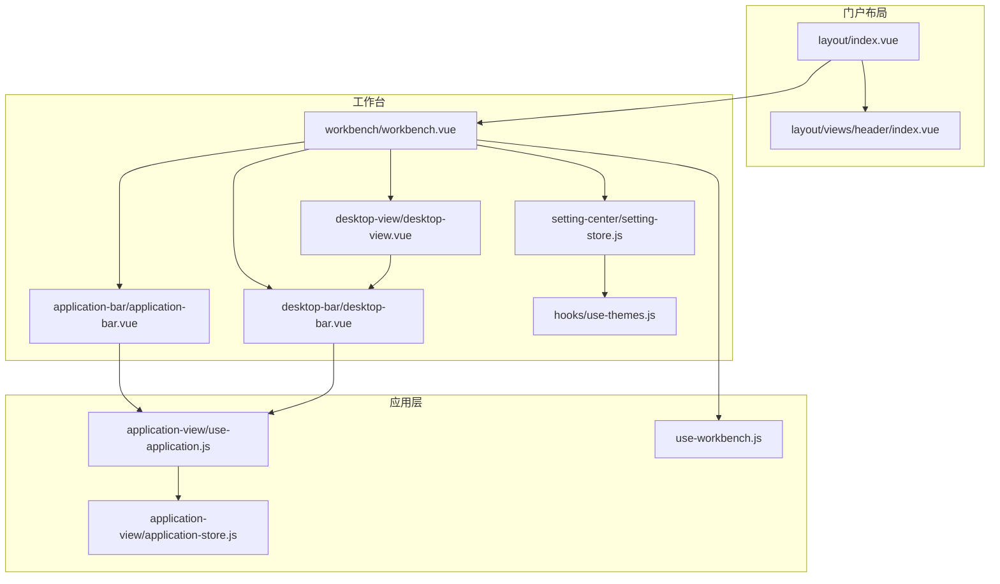
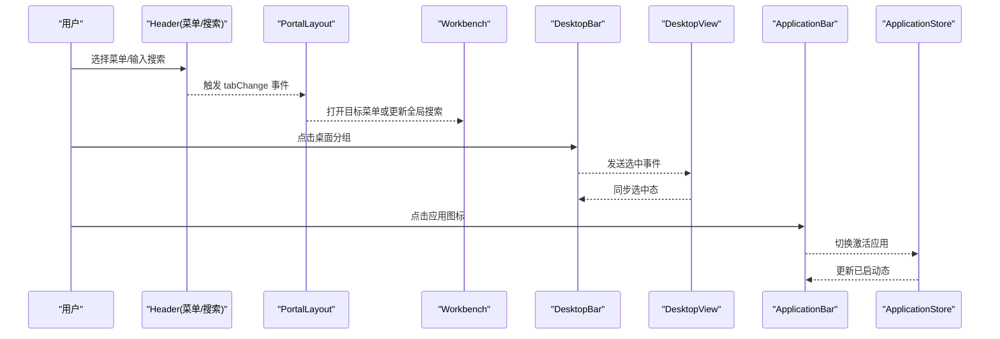
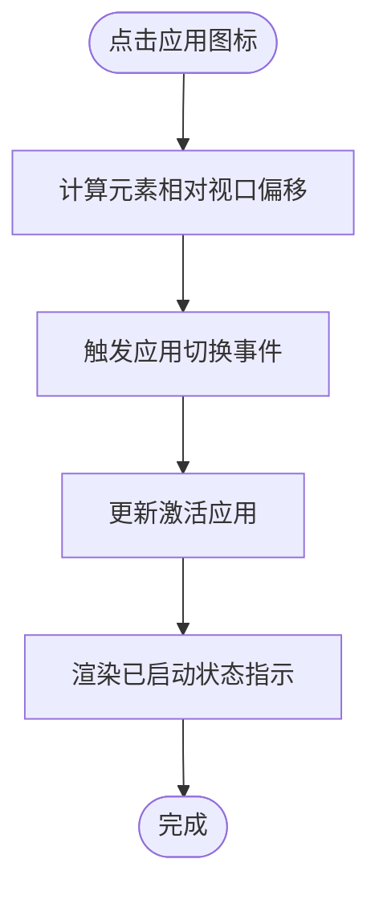
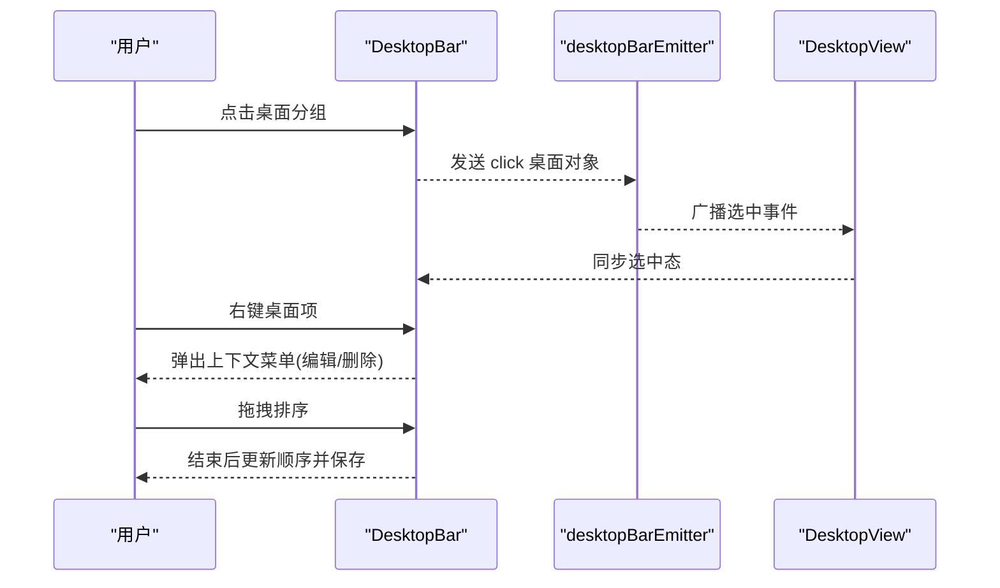
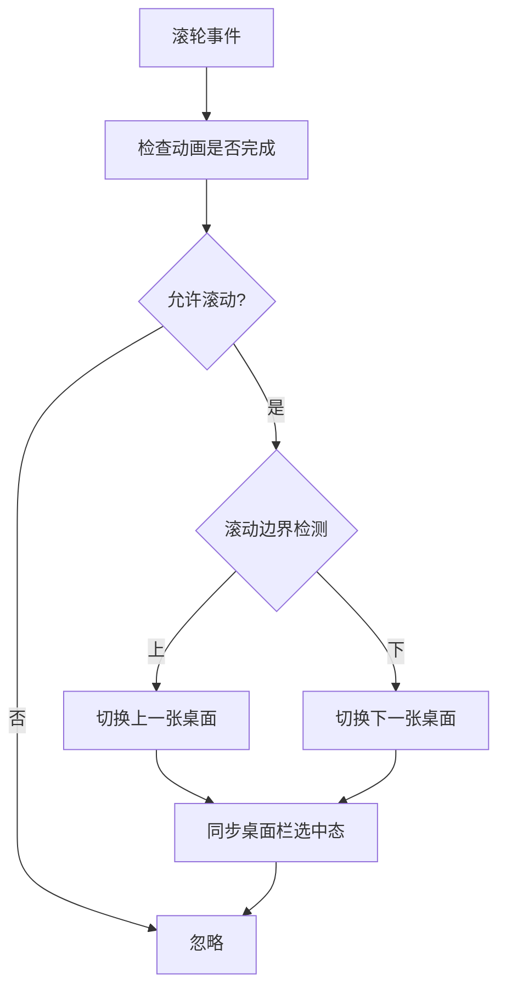
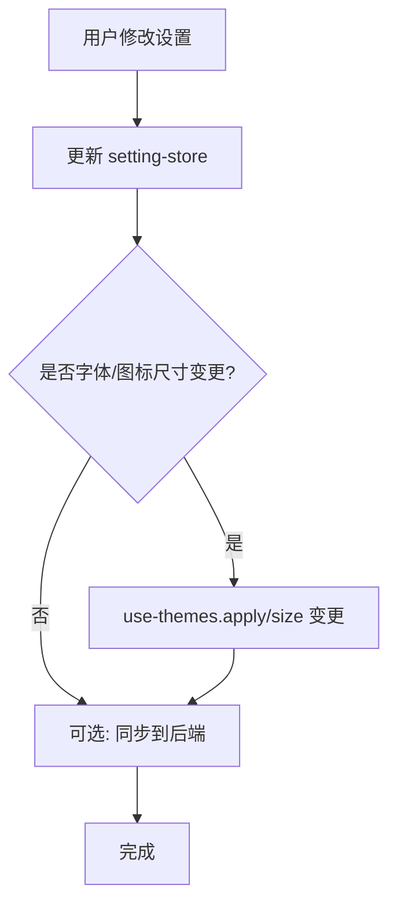
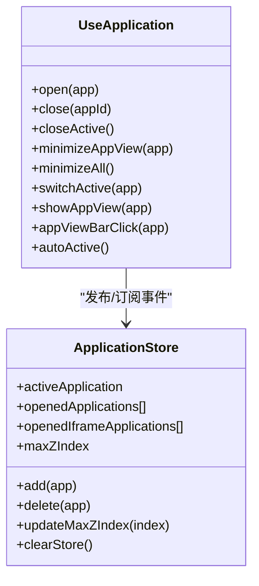
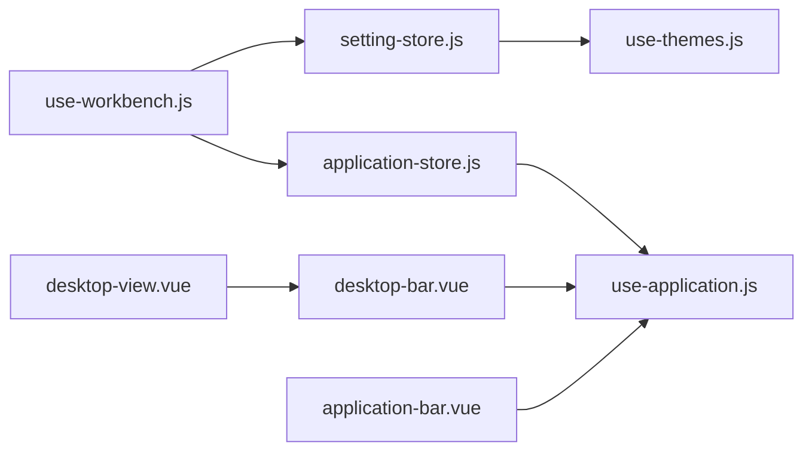

# 导航栏系统

<cite>
**本文引用的文件**
- [src/portal/views/workbench/workbench.vue](file://src/portal/views/workbench/workbench.vue)
- [src/portal/views/workbench/application-bar/application-bar.vue](file://src/portal/views/workbench/application-bar/application-bar.vue)
- [src/portal/views/workbench/desktop-bar/desktop-bar.vue](file://src/portal/views/workbench/desktop-bar/desktop-bar.vue)
- [src/portal/views/workbench/desktop-view/desktop-view.vue](file://src/portal/views/workbench/desktop-view/desktop-view.vue)
- [src/portal/views/workbench/application-view/application-store.js](file://src/portal/views/workbench/application-view/application-store.js)
- [src/portal/views/workbench/application-view/use-application.js](file://src/portal/views/workbench/application-view/use-application.js)
- [src/portal/views/workbench/setting-center/setting-store.js](file://src/portal/views/workbench/setting-center/setting-store.js)
- [src/portal/views/workbench/use-workbench.js](file://src/portal/views/workbench/use-workbench.js)
- [src/portal/views/layout/index.vue](file://src/portal/views/layout/index.vue)
- [src/portal/views/layout/views/header/index.vue](file://src/portal/views/layout/views/header/index.vue)
- [src/portal/hooks/use-themes.js](file://src/portal/hooks/use-themes.js)
- [src/pages/cop/components/menu-search.vue](file://src/pages/cop/components/menu-search.vue)
- [src/pages/aoi/views/manage/emp/component/menu-search.vue](file://src/pages/aoi/views/manage/emp/component/menu-search.vue)
</cite>

## 目录
1. [简介](#简介)
2. [项目结构](#项目结构)
3. [核心组件](#核心组件)
4. [架构总览](#架构总览)
5. [详细组件分析](#详细组件分析)
6. [依赖关系分析](#依赖关系分析)
7. [性能考量](#性能考量)
8. [故障排查指南](#故障排查指南)
9. [结论](#结论)
10. [附录](#附录)

## 简介
本文件为 FS-AOI-WEB 导航栏系统的完整技术文档，覆盖应用栏、桌面栏、搜索栏、上下文菜单等导航组件的设计与实现。内容包含布局与交互逻辑、菜单管理机制、响应式设计、动态菜单生成、快捷操作、状态管理、用户偏好与主题适配、配置项与事件处理机制，以及面向开发者的自定义扩展指南。

## 项目结构
导航系统位于门户工作台（workbench）视图中，由顶层布局与工作台容器协调组织，核心导航组件包括：
- 应用栏：固定与已打开应用的快速入口
- 桌面栏：桌面分组的横向导航与拖拽排序
- 桌面视图：按桌面分页展示应用网格
- 设置中心：主题、字体、图标尺寸、位置等个性化配置
- 头部导航与搜索：顶部菜单树与全局搜索入口
- 上下文菜单：桌面项的右键编辑/删除等操作

图表来源
- [src/portal/views/layout/index.vue](file://src/portal/views/layout/index.vue#L1-L188)
- [src/portal/views/layout/views/header/index.vue](file://src/portal/views/layout/views/header/index.vue#L1-L184)
- [src/portal/views/workbench/workbench.vue](file://src/portal/views/workbench/workbench.vue#L1-L235)
- [src/portal/views/workbench/application-bar/application-bar.vue](file://src/portal/views/workbench/application-bar/application-bar.vue#L1-L135)
- [src/portal/views/workbench/desktop-bar/desktop-bar.vue](file://src/portal/views/workbench/desktop-bar/desktop-bar.vue#L1-L409)
- [src/portal/views/workbench/desktop-view/desktop-view.vue](file://src/portal/views/workbench/desktop-view/desktop-view.vue#L1-L137)
- [src/portal/views/workbench/setting-center/setting-store.js](file://src/portal/views/workbench/setting-center/setting-store.js#L1-L44)
- [src/portal/hooks/use-themes.js](file://src/portal/hooks/use-themes.js#L140-L175)
- [src/portal/views/workbench/application-view/application-store.js](file://src/portal/views/workbench/application-view/application-store.js#L1-L65)
- [src/portal/views/workbench/application-view/use-application.js](file://src/portal/views/workbench/application-view/use-application.js#L1-L30)
- [src/portal/views/workbench/use-workbench.js](file://src/portal/views/workbench/use-workbench.js#L1-L222)

章节来源
- [src/portal/views/layout/index.vue](file://src/portal/views/layout/index.vue#L1-L188)
- [src/portal/views/layout/views/header/index.vue](file://src/portal/views/layout/views/header/index.vue#L1-L184)
- [src/portal/views/workbench/workbench.vue](file://src/portal/views/workbench/workbench.vue#L1-L235)

## 核心组件
- 应用栏（Application Bar）
  - 展示固定应用与已打开应用的图标入口，支持提示气泡与“已启动”状态指示
  - 通过事件驱动在应用栏与应用视图之间联动
- 桌面栏（Desktop Bar）
  - 横向工具栏，支持桌面分组拖拽排序、右键上下文菜单、浮动面板添加图标
  - 通过事件总线与桌面视图同步选中状态
- 桌面视图（Desktop View）
  - 多桌面分页容器，支持鼠标滚轮切换桌面，滚动边界控制
  - 与桌面栏联动，保持选中态一致
- 设置中心（Setting Center）
  - 统一的状态存储，支持字体大小、图标尺寸、应用栏/桌面栏位置、背景样式、主题等
  - 变更时同步到主题系统与后端持久化
- 应用状态管理（Application Store）
  - 维护当前激活应用、已打开应用列表、iframe 应用列表及最大 z-index
  - 提供新增、删除路由与应用生命周期管理
- 工作台数据加载（use-workbench）
  - 从服务端拉取桌面、应用、固定应用与用户自定义设置
  - 将服务端键映射到前端 store，并触发主题初始化

章节来源
- [src/portal/views/workbench/application-bar/application-bar.vue](file://src/portal/views/workbench/application-bar/application-bar.vue#L1-L135)
- [src/portal/views/workbench/desktop-bar/desktop-bar.vue](file://src/portal/views/workbench/desktop-bar/desktop-bar.vue#L1-L409)
- [src/portal/views/workbench/desktop-view/desktop-view.vue](file://src/portal/views/workbench/desktop-view/desktop-view.vue#L1-L137)
- [src/portal/views/workbench/setting-center/setting-store.js](file://src/portal/views/workbench/setting-center/setting-store.js#L1-L44)
- [src/portal/views/workbench/application-view/application-store.js](file://src/portal/views/workbench/application-view/application-store.js#L1-L65)
- [src/portal/views/workbench/use-workbench.js](file://src/portal/views/workbench/use-workbench.js#L1-L222)

## 架构总览
导航系统采用“事件总线 + Pinia 状态”的解耦架构：
- 事件总线用于跨组件通信（如桌面栏点击、应用栏点击、上下文菜单）
- Pinia store 负责持久化用户偏好与应用状态
- 主题系统集中管理 CSS 变量与字号映射
- 顶部头部负责菜单树与搜索入口，向下提供事件给布局层

图表来源
- [src/portal/views/layout/views/header/index.vue](file://src/portal/views/layout/views/header/index.vue#L46-L70)
- [src/portal/views/layout/index.vue](file://src/portal/views/layout/index.vue#L75-L89)
- [src/portal/views/workbench/desktop-bar/desktop-bar.vue](file://src/portal/views/workbench/desktop-bar/desktop-bar.vue#L48-L65)
- [src/portal/views/workbench/desktop-view/desktop-view.vue](file://src/portal/views/workbench/desktop-view/desktop-view.vue#L28-L32)
- [src/portal/views/workbench/application-bar/application-bar.vue](file://src/portal/views/workbench/application-bar/application-bar.vue#L33-L39)
- [src/portal/views/workbench/application-view/application-store.js](file://src/portal/views/workbench/application-view/application-store.js#L28-L62)

## 详细组件分析

### 应用栏（Application Bar）
- 功能要点
  - 合并固定应用与已打开应用，去重后渲染
  - 支持通过事件总线触发应用视图点击，实现跨组件联动
  - 读取设置中心的应用栏位置（top/bottom），动态类名控制定位
- 交互逻辑
  - 计算图标点击坐标，传递给应用切换器
  - 使用 Tooltip 提示应用名称
- 状态与配置
  - 依赖应用状态 store 的已打开应用集合
  - 依赖设置 store 的应用栏位置

图表来源
- [src/portal/views/workbench/application-bar/application-bar.vue](file://src/portal/views/workbench/application-bar/application-bar.vue#L33-L39)
- [src/portal/views/workbench/application-view/use-application.js](file://src/portal/views/workbench/application-view/use-application.js#L10-L14)
- [src/portal/views/workbench/application-view/application-store.js](file://src/portal/views/workbench/application-view/application-store.js#L17-L65)

章节来源
- [src/portal/views/workbench/application-bar/application-bar.vue](file://src/portal/views/workbench/application-bar/application-bar.vue#L1-L135)
- [src/portal/views/workbench/application-view/use-application.js](file://src/portal/views/workbench/application-view/use-application.js#L1-L30)
- [src/portal/views/workbench/setting-center/setting-store.js](file://src/portal/views/workbench/setting-center/setting-store.js#L1-L44)

### 桌面栏（Desktop Bar）
- 功能要点
  - 桌面分组横向排列，支持悬停展开名称
  - 拖拽排序：使用可拖拽库，结束拖拽后更新顺序并同步到用户数据
  - 右键菜单：支持编辑与删除桌面项
  - 浮动面板：点击“+”弹出图标选择面板，支持定位与点击外部关闭
- 事件与联动
  - 监听桌面栏事件，设置当前选中桌面并广播给桌面视图
  - 通过用户事件总线同步桌面数据到后端

图表来源
- [src/portal/views/workbench/desktop-bar/desktop-bar.vue](file://src/portal/views/workbench/desktop-bar/desktop-bar.vue#L48-L65)
- [src/portal/views/workbench/desktop-bar/desktop-bar.vue](file://src/portal/views/workbench/desktop-bar/desktop-bar.vue#L81-L102)
- [src/portal/views/workbench/desktop-bar/desktop-bar.vue](file://src/portal/views/workbench/desktop-bar/desktop-bar.vue#L139-L147)

章节来源
- [src/portal/views/workbench/desktop-bar/desktop-bar.vue](file://src/portal/views/workbench/desktop-bar/desktop-bar.vue#L1-L409)

### 桌面视图（Desktop View）
- 功能要点
  - 多桌面垂直分页容器，高度随桌面数量动态调整
  - 鼠标滚轮在滚动边界处切换桌面，避免无效滚动
  - 与桌面栏联动，根据索引同步选中态
- 性能与体验
  - 使用 transform 实现平滑过渡，减少重排
  - 控制滚动开关，避免滚动穿透

图表来源
- [src/portal/views/workbench/desktop-view/desktop-view.vue](file://src/portal/views/workbench/desktop-view/desktop-view.vue#L53-L87)
- [src/portal/views/workbench/desktop-view/desktop-view.vue](file://src/portal/views/workbench/desktop-view/desktop-view.vue#L28-L32)

章节来源
- [src/portal/views/workbench/desktop-view/desktop-view.vue](file://src/portal/views/workbench/desktop-view/desktop-view.vue#L1-L137)

### 设置中心与主题系统
- 设置中心（Pinia Store）
  - 存储字体大小、应用图标尺寸、应用栏/桌面栏位置、桌面内边距、背景样式、主题等
  - 支持变更回调：当字体变化时调用主题系统更新字号变量；当图标尺寸变化时更新圆角变量
  - 支持与后端同步保存用户偏好
- 主题系统
  - 初始化主题类名，切换主题时设置根节点 CSS 变量
  - 根据主题配置批量设置字号系列变量，保证全局一致性

图表来源
- [src/portal/views/workbench/setting-center/setting-store.js](file://src/portal/views/workbench/setting-center/setting-store.js#L29-L41)
- [src/portal/hooks/use-themes.js](file://src/portal/hooks/use-themes.js#L140-L175)
- [src/portal/views/workbench/use-workbench.js](file://src/portal/views/workbench/use-workbench.js#L180-L195)

章节来源
- [src/portal/views/workbench/setting-center/setting-store.js](file://src/portal/views/workbench/setting-center/setting-store.js#L1-L44)
- [src/portal/hooks/use-themes.js](file://src/portal/hooks/use-themes.js#L140-L175)
- [src/portal/views/workbench/use-workbench.js](file://src/portal/views/workbench/use-workbench.js#L167-L195)

### 应用状态管理
- 应用 Store
  - 维护激活应用、已打开应用列表、iframe 应用列表、最大 z-index
  - 新增应用时格式化组件异步加载、设置路由参数；删除应用时清理路由与列表
- 应用控制器
  - 通过事件总线封装 open/close/minimize/switch 等动作
  - 监听窗口消息，支持外部触发应用操作

图表来源
- [src/portal/views/workbench/application-view/application-store.js](file://src/portal/views/workbench/application-view/application-store.js#L17-L65)
- [src/portal/views/workbench/application-view/use-application.js](file://src/portal/views/workbench/application-view/use-application.js#L3-L27)

章节来源
- [src/portal/views/workbench/application-view/application-store.js](file://src/portal/views/workbench/application-view/application-store.js#L1-L65)
- [src/portal/views/workbench/application-view/use-application.js](file://src/portal/views/workbench/application-view/use-application.js#L1-L30)

### 顶部头部与搜索
- 头部导航
  - 提供左侧系统信息、主菜单区、右侧搜索与用户中心
  - 通过事件总线向上抛出菜单选择与搜索结果事件
- 搜索组件（多处复用）
  - 支持拼音首字母检索、历史记录、高亮匹配片段
  - 顶部头部与业务模块均提供搜索组件实现

章节来源
- [src/portal/views/layout/views/header/index.vue](file://src/portal/views/layout/views/header/index.vue#L1-L184)
- [src/pages/cop/components/menu-search.vue](file://src/pages/cop/components/menu-search.vue#L55-L87)
- [src/pages/aoi/views/manage/emp/component/menu-search.vue](file://src/pages/aoi/views/manage/emp/component/menu-search.vue#L174-L218)

## 依赖关系分析
- 组件耦合
  - DesktopBar 与 DesktopView 通过事件总线强关联，确保选中态一致
  - ApplicationBar 与 ApplicationStore 通过事件与 store 协同
  - Workbench 作为容器，统一初始化数据与主题
- 外部依赖
  - 事件总线 mitt 用于跨组件通信
  - Pinia 用于状态持久化
  - 主题系统集中管理 CSS 变量
- 数据流
  - use-workbench 从服务端获取桌面/应用/设置，写入 store
  - 设置中心变更触发主题系统与后端同步
  - 应用状态变更影响应用栏与桌面视图

图表来源
- [src/portal/views/workbench/use-workbench.js](file://src/portal/views/workbench/use-workbench.js#L1-L222)
- [src/portal/views/workbench/setting-center/setting-store.js](file://src/portal/views/workbench/setting-center/setting-store.js#L1-L44)
- [src/portal/hooks/use-themes.js](file://src/portal/hooks/use-themes.js#L140-L175)
- [src/portal/views/workbench/application-view/application-store.js](file://src/portal/views/workbench/application-view/application-store.js#L1-L65)
- [src/portal/views/workbench/application-view/use-application.js](file://src/portal/views/workbench/application-view/use-application.js#L1-L30)
- [src/portal/views/workbench/desktop-bar/desktop-bar.vue](file://src/portal/views/workbench/desktop-bar/desktop-bar.vue#L1-L409)
- [src/portal/views/workbench/desktop-view/desktop-view.vue](file://src/portal/views/workbench/desktop-view/desktop-view.vue#L1-L137)
- [src/portal/views/workbench/application-bar/application-bar.vue](file://src/portal/views/workbench/application-bar/application-bar.vue#L1-L135)

章节来源
- [src/portal/views/workbench/use-workbench.js](file://src/portal/views/workbench/use-workbench.js#L1-L222)
- [src/portal/views/workbench/setting-center/setting-store.js](file://src/portal/views/workbench/setting-center/setting-store.js#L1-L44)
- [src/portal/views/workbench/application-view/application-store.js](file://src/portal/views/workbench/application-view/application-store.js#L1-L65)
- [src/portal/views/workbench/application-view/use-application.js](file://src/portal/views/workbench/application-view/use-application.js#L1-L30)
- [src/portal/views/workbench/desktop-bar/desktop-bar.vue](file://src/portal/views/workbench/desktop-bar/desktop-bar.vue#L1-L409)
- [src/portal/views/workbench/desktop-view/desktop-view.vue](file://src/portal/views/workbench/desktop-view/desktop-view.vue#L1-L137)
- [src/portal/views/workbench/application-bar/application-bar.vue](file://src/portal/views/workbench/application-bar/application-bar.vue#L1-L135)

## 性能考量
- 渲染优化
  - 应用栏与桌面栏使用绝对定位与 backdrop-filter，避免频繁重排
  - 桌面视图使用 transform 进行分页切换，配合过渡时间降低卡顿
- 事件与滚动
  - 桌面视图对滚轮事件增加动画时间戳校验，避免连续触发
  - 在滚动边界处提前拦截，减少无效滚动
- 状态与网络
  - use-workbench 并行拉取桌面、应用、设置，减少初始化等待
  - 设置变更仅在必要时同步后端，避免频繁请求

## 故障排查指南
- 桌面切换异常
  - 检查桌面栏是否正确发送选中事件；确认桌面视图接收并更新索引
  - 排查滚轮事件是否被其他组件拦截
- 应用栏无响应
  - 确认事件总线监听是否生效；检查应用切换函数是否被调用
  - 核对应用状态 store 是否存在目标应用
- 设置不生效
  - 检查 setting-store 的 updateCustomSetting 是否被调用
  - 确认 use-themes 的 change/changeFontSize 是否执行
  - 查看后端保存接口返回码与提示
- 主题样式异常
  - 确认根节点 CSS 变量是否正确设置
  - 检查主题配置是否存在缺失字段

章节来源
- [src/portal/views/workbench/desktop-bar/desktop-bar.vue](file://src/portal/views/workbench/desktop-bar/desktop-bar.vue#L104-L118)
- [src/portal/views/workbench/desktop-view/desktop-view.vue](file://src/portal/views/workbench/desktop-view/desktop-view.vue#L49-L51)
- [src/portal/views/workbench/application-view/use-application.js](file://src/portal/views/workbench/application-view/use-application.js#L22-L27)
- [src/portal/views/workbench/setting-center/setting-store.js](file://src/portal/views/workbench/setting-center/setting-store.js#L29-L41)
- [src/portal/views/workbench/use-workbench.js](file://src/portal/views/workbench/use-workbench.js#L180-L195)
- [src/portal/hooks/use-themes.js](file://src/portal/hooks/use-themes.js#L140-L175)

## 结论
FS-AOI-WEB 导航栏系统以事件总线与 Pinia 状态为核心，实现了应用栏、桌面栏、桌面视图、设置中心与主题系统的协同工作。系统具备良好的响应式布局、动态菜单生成能力与用户偏好持久化机制，同时提供上下文菜单与快捷操作，满足复杂业务场景下的导航需求。开发者可在现有事件与 store 基础上进行扩展，实现自定义菜单、快捷入口与主题风格。

## 附录

### 配置项与键映射
- 自定义设置键映射（服务端字段 → 前端键）
  - 应用图标尺寸：APP_ICO_SIZE → applicationIconSize
  - 显示应用名称：SHOW_APP_NAME → showApplicationName
  - 字体大小：FONT_SIZE → fontSize
  - 应用栏位置：APP_BAR_POSITION → applicationBarPosition
  - 桌面栏位置：DESK_BAR_POSITION → desktopBarPosition
  - 桌面内边距：DESKTOP_PADDING → desktopPadding
  - 桌面背景样式：DESKTOP_BG_STYLE → desktopBackgroundStyle
  - 主题：THEME → theme

章节来源
- [src/portal/views/workbench/use-workbench.js](file://src/portal/views/workbench/use-workbench.js#L169-L178)

### 事件总线清单
- 桌面栏事件
  - click：选中桌面
  - setSelected：设置选中态
  - setPosition：更新桌面栏位置
  - addBarItem/editBarItem：增删改桌面项
  - setIndex：拖拽结束后的索引更新
- 应用栏事件
  - appViewBarClick：触发应用视图点击
- 应用事件
  - open/close/closeActive/minimizeAppView/minimizeAll/switchActive/showAppView/autoActive
- 用户事件
  - updateBarData：更新桌面应用数据
  - login/logout：登录/登出刷新

章节来源
- [src/portal/views/workbench/desktop-bar/desktop-bar.vue](file://src/portal/views/workbench/desktop-bar/desktop-bar.vue#L104-L147)
- [src/portal/views/workbench/application-bar/application-bar.vue](file://src/portal/views/workbench/application-bar/application-bar.vue#L25-L31)
- [src/portal/views/workbench/application-view/use-application.js](file://src/portal/views/workbench/application-view/use-application.js#L3-L14)
- [src/portal/views/workbench/workbench.vue](file://src/portal/views/workbench/workbench.vue#L100-L117)