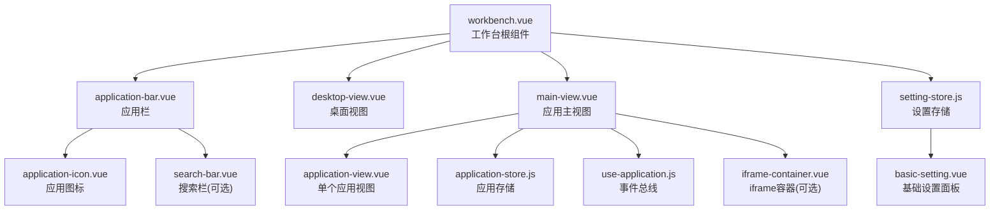
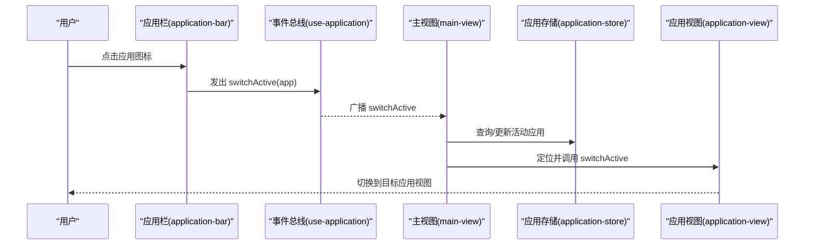
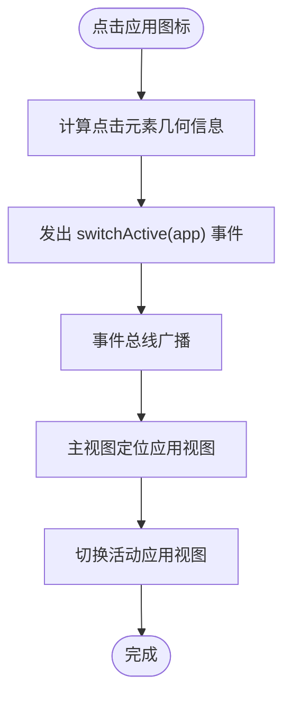
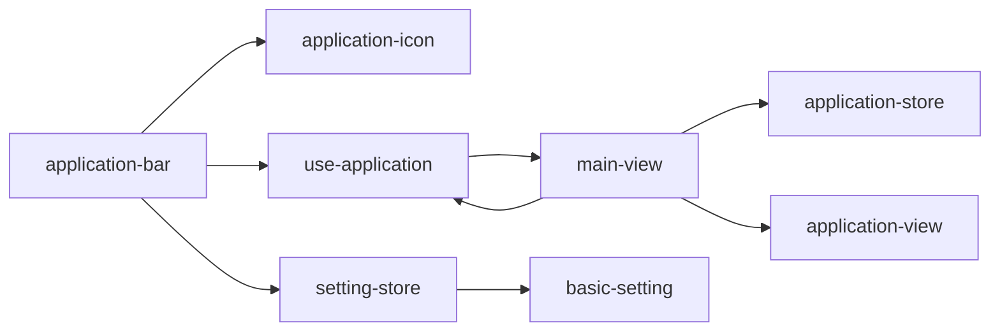

# 应用栏组件

<cite>
**本文引用的文件**
- [workbench.vue](file://src/portal/views/workbench/workbench.vue)
- [application-bar.vue](file://src/portal/views/workbench/application-bar/application-bar.vue)
- [search-bar.vue](file://src/portal/views/workbench/application-bar/search-bar.vue)
- [use-application.js](file://src/portal/views/workbench/application-view/use-application.js)
- [application-store.js](file://src/portal/views/workbench/application-view/application-store.js)
- [main-view.vue](file://src/portal/views/workbench/application-view/main-view.vue)
- [application-view.vue](file://src/portal/views/workbench/application-view/application-view.vue)
- [application-icon.vue](file://src/portal/views/workbench/desktop-view/application-icon.vue)
- [desktop-view.vue](file://src/portal/views/workbench/desktop-view/desktop-view.vue)
- [setting-store.js](file://src/portal/views/workbench/setting-center/setting-store.js)
- [basic-setting.vue](file://src/portal/views/workbench/setting-center/basic/basic-setting.vue)
- [iframe-container.vue](file://src/portal/views/workbench/application-view/iframe-container/iframe-container.vue)
</cite>

## 目录
1. [简介](#简介)
2. [项目结构](#项目结构)
3. [核心组件](#核心组件)
4. [架构总览](#架构总览)
5. [详细组件分析](#详细组件分析)
6. [依赖关系分析](#依赖关系分析)
7. [性能考量](#性能考量)
8. [故障排查指南](#故障排查指南)
9. [结论](#结论)
10. [附录](#附录)

## 简介
本文件为 FS-AOI-WEB 应用栏组件的技术文档，聚焦于工作台中“应用栏”的核心功能与实现原理，包括应用图标渲染、应用状态管理、点击事件处理、状态指示器、应用切换机制、事件总线通信、布局与响应式适配、位置配置（顶部/底部）、样式定制与主题适配、动画效果等。文档同时提供配置项说明、事件监听方式与扩展开发指引，帮助开发者快速理解并高效使用该组件。

## 项目结构
应用栏位于工作台视图中，作为顶层 UI 组件之一，与桌面视图、应用主视图、设置中心协同工作。其关键文件分布如下：
- 工作台根组件：负责初始化应用列表、固定应用列表、自定义设置加载与主题切换，并挂载应用栏。
- 应用栏组件：展示应用图标、应用状态指示、支持工具提示与点击事件；根据设置中心的配置决定位置（顶部/底部）。
- 应用图标组件：负责应用图标渲染（SVG 图标或基于名称哈希生成的渐变背景）。
- 应用事件总线：统一管理应用的打开、关闭、最小化、激活等事件。
- 应用存储：集中管理已打开的应用集合、活动应用与最大层级。
- 应用主视图：承载多个应用视图实例，负责事件分发与拖拽交互。
- 设置中心：提供主题、字体大小、应用栏位置等配置项。

图表来源
- [workbench.vue](file://src/portal/views/workbench/workbench.vue#L129-L162)
- [application-bar.vue](file://src/portal/views/workbench/application-bar/application-bar.vue#L45-L65)
- [application-icon.vue](file://src/portal/views/workbench/desktop-view/application-icon.vue#L20-L33)
- [search-bar.vue](file://src/portal/views/workbench/application-bar/search-bar.vue#L80-L121)
- [main-view.vue](file://src/portal/views/workbench/application-view/main-view.vue#L168-L181)
- [application-store.js](file://src/portal/views/workbench/application-view/application-store.js#L17-L64)
- [use-application.js](file://src/portal/views/workbench/application-view/use-application.js#L1-L30)
- [iframe-container.vue](file://src/portal/views/workbench/application-view/iframe-container/iframe-container.vue#L11-L15)
- [setting-store.js](file://src/portal/views/workbench/setting-center/setting-store.js#L5-L44)
- [basic-setting.vue](file://src/portal/views/workbench/setting-center/basic/basic-setting.vue#L1-L30)

章节来源
- [workbench.vue](file://src/portal/views/workbench/workbench.vue#L129-L162)

## 核心组件
- 应用栏 application-bar
  - 负责渲染应用图标、应用状态指示器、工具提示与点击事件；监听事件总线以响应外部触发的点击。
  - 依据设置中心的 applicationBarPosition 决定显示在顶部或底部。
- 应用图标 application-icon
  - 支持两种图标来源：SVG 图标资源与基于应用名称哈希生成的渐变背景。
- 应用事件总线 use-application
  - 使用 mitt 实现轻量事件总线，统一发出应用生命周期与交互事件（打开、关闭、激活、最小化等），并监听窗口消息进行跨页通信。
- 应用存储 application-store
  - 使用 Pinia 管理已打开应用集合、活动应用与最大层级，提供新增、删除与清理方法。
- 应用主视图 main-view
  - 承载多个应用视图实例，订阅事件总线并分发到具体应用视图；实现拖拽交互与层级管理。
- 设置中心 setting-store / basic-setting
  - 提供主题、字体大小、应用栏位置、图标尺寸等配置项的读写与同步。

章节来源
- [application-bar.vue](file://src/portal/views/workbench/application-bar/application-bar.vue#L1-L135)
- [application-icon.vue](file://src/portal/views/workbench/desktop-view/application-icon.vue#L1-L69)
- [use-application.js](file://src/portal/views/workbench/application-view/use-application.js#L1-L30)
- [application-store.js](file://src/portal/views/workbench/application-view/application-store.js#L1-L64)
- [main-view.vue](file://src/portal/views/workbench/application-view/main-view.vue#L1-L194)
- [setting-store.js](file://src/portal/views/workbench/setting-center/setting-store.js#L1-L44)
- [basic-setting.vue](file://src/portal/views/workbench/setting-center/basic/basic-setting.vue#L1-L135)

## 架构总览
应用栏通过事件总线与应用主视图解耦协作，应用图标组件负责 UI 展示，设置中心提供运行期配置。整体采用“事件驱动 + 存储驱动”的模式，保证模块间低耦合与高内聚。

图表来源
- [application-bar.vue](file://src/portal/views/workbench/application-bar/application-bar.vue#L33-L39)
- [use-application.js](file://src/portal/views/workbench/application-view/use-application.js#L10-L14)
- [main-view.vue](file://src/portal/views/workbench/application-view/main-view.vue#L73-L76)
- [application-store.js](file://src/portal/views/workbench/application-view/application-store.js#L17-L64)
- [application-view.vue](file://src/portal/views/workbench/application-view/application-view.vue#L1-L219)

## 详细组件分析

### 应用栏组件（application-bar）
- 功能要点
  - 渲染应用图标与状态指示器：每个应用项包含一个图标与一个“是否已启动”的小圆点指示器。
  - 工具提示：鼠标悬停显示应用名称。
  - 点击事件：记录点击元素的几何信息并调用事件总线切换活动应用。
  - 外部点击桥接：监听事件总线中的 appViewBarClick，自动触发对应应用条目的点击。
  - 位置配置：根据设置中心的 applicationBarPosition 自动切换 top 或 bottom 类名。
- 关键数据流
  - 固定应用列表与已打开应用列表合并，形成最终渲染列表。
  - 状态指示器通过比对已打开应用集合判断是否显示“已启动”状态。
- 样式与动画
  - 使用模糊背景与圆角边框，悬停时图标有阴影与上移动画。
  - 位置由类名 bottom/top 控制，支持绝对定位在页面顶部或底部。

图表来源
- [application-bar.vue](file://src/portal/views/workbench/application-bar/application-bar.vue#L33-L39)
- [use-application.js](file://src/portal/views/workbench/application-view/use-application.js#L10-L14)
- [main-view.vue](file://src/portal/views/workbench/application-view/main-view.vue#L73-L76)

章节来源
- [application-bar.vue](file://src/portal/views/workbench/application-bar/application-bar.vue#L1-L135)

### 应用图标组件（application-icon）
- 功能要点
  - 若应用提供 icon 字段，则使用静态 SVG 图标资源渲染。
  - 否则根据应用名称生成哈希值映射到一组预设渐变背景，显示应用名称首字母。
- 样式特性
  - 使用伪元素展示首字母，配合圆角与字号控制，确保在不同尺寸下清晰可读。
  - 多组渐变背景提升视觉区分度。

章节来源
- [application-icon.vue](file://src/portal/views/workbench/desktop-view/application-icon.vue#L1-L69)

### 应用事件总线（use-application）
- 功能要点
  - 暴露 open/close/minimize/showAppView/switchActive/autoActive 等事件方法。
  - 通过 window.message 接收外部消息并转发到对应事件。
  - 提供 applicationEmitter 供其他组件订阅。
- 事件类型
  - open/close/closeActive/minimizeAppView/minimizeAll/switchActive/showAppView/appViewBarClick/autoActive。

章节来源
- [use-application.js](file://src/portal/views/workbench/application-view/use-application.js#L1-L30)

### 应用存储（application-store）
- 功能要点
  - 维护 activeApplication、openedApplications、openedIframeApplications、maxZIndex。
  - 提供 add/delete/updateMaxZIndex/clearStore 等动作。
  - 在添加应用时同步路由参数，删除应用时清理路由。
- 复杂度
  - 查找与过滤操作基于数组遍历，时间复杂度 O(n)，n 为已打开应用数量。

章节来源
- [application-store.js](file://src/portal/views/workbench/application-view/application-store.js#L1-L64)

### 应用主视图（main-view）
- 功能要点
  - 订阅事件总线，处理 open/autoActive/showAppView/switchActive/minimizeAll/close 等事件。
  - 管理应用视图实例的引用与层级索引，实现自动激活与最小化全量处理。
  - 提供拖拽交互：记录起始位置与边界，限制拖拽范围，实时更新 transform。
- 与应用视图的交互
  - 通过引用调用具体应用视图的 showAppView/switchActive/minimizeAppView/close 方法。

章节来源
- [main-view.vue](file://src/portal/views/workbench/application-view/main-view.vue#L1-L194)

### 应用视图（application-view）
- 功能要点
  - 根据应用类型选择渲染方式：组件直出或页面动态导入。
  - 提供最小化、关闭、切换活动等能力，并暴露给父级主视图调用。
  - 通过动画器与容器实现视图切换动画。

章节来源
- [application-view.vue](file://src/portal/views/workbench/application-view/application-view.vue#L1-L219)

### 搜索栏（search-bar）
- 功能要点
  - 将多桌面的应用列表拍平后进行检索，支持键盘上下导航与回车确认。
  - 输入防抖与结果高亮，点击后触发应用点击处理。
- 适用场景
  - 当应用栏需要提供快捷搜索入口时启用。

章节来源
- [search-bar.vue](file://src/portal/views/workbench/application-bar/search-bar.vue#L1-L229)

### 设置中心（setting-store / basic-setting）
- 功能要点
  - 提供字体大小、应用栏位置、应用图标尺寸、是否显示应用名、桌面背景样式、主题等配置项。
  - 更新配置时可同步到远端并触发主题变更。
- 与应用栏的关系
  - applicationBarPosition 决定应用栏在顶部或底部显示。

章节来源
- [setting-store.js](file://src/portal/views/workbench/setting-center/setting-store.js#L1-L44)
- [basic-setting.vue](file://src/portal/views/workbench/setting-center/basic/basic-setting.vue#L1-L135)

### iframe 容器（iframe-container）
- 功能要点
  - 条件渲染 iframe 包装器，仅当应用为 iframe 类型且为活动应用时显示。
  - 与应用存储联动，确保只渲染当前活动应用的 iframe。

章节来源
- [iframe-container.vue](file://src/portal/views/workbench/application-view/iframe-container/iframe-container.vue#L1-L23)

## 依赖关系分析
- 组件耦合
  - application-bar 依赖 application-icon 与 use-application；依赖 setting-store 决定位置。
  - main-view 依赖 application-store 与 use-application；依赖 application-view 引用。
  - application-view 依赖应用存储与动画器；可按需加载页面组件。
  - setting-store 与 basic-setting 单向影响 UI 表现。
- 事件链路
  - 用户点击 -> application-bar -> use-application -> main-view -> application-view。
- 外部通信
  - use-application 通过 window.message 接受外部指令，实现跨页应用控制。

图表来源
- [application-bar.vue](file://src/portal/views/workbench/application-bar/application-bar.vue#L1-L43)
- [use-application.js](file://src/portal/views/workbench/application-view/use-application.js#L1-L30)
- [main-view.vue](file://src/portal/views/workbench/application-view/main-view.vue#L1-L29)
- [application-store.js](file://src/portal/views/workbench/application-view/application-store.js#L1-L26)
- [setting-store.js](file://src/portal/views/workbench/setting-center/setting-store.js#L1-L18)
- [basic-setting.vue](file://src/portal/views/workbench/setting-center/basic/basic-setting.vue#L1-L30)

章节来源
- [application-bar.vue](file://src/portal/views/workbench/application-bar/application-bar.vue#L1-L43)
- [use-application.js](file://src/portal/views/workbench/application-view/use-application.js#L1-L30)
- [main-view.vue](file://src/portal/views/workbench/application-view/main-view.vue#L1-L29)
- [application-store.js](file://src/portal/views/workbench/application-view/application-store.js#L1-L26)
- [setting-store.js](file://src/portal/views/workbench/setting-center/setting-store.js#L1-L18)
- [basic-setting.vue](file://src/portal/views/workbench/setting-center/basic/basic-setting.vue#L1-L30)

## 性能考量
- 列表渲染
  - 应用栏与桌面视图均采用 v-for 渲染，建议保持应用数量在合理范围内，避免过度渲染。
- 事件总线
  - 使用 mitt 轻量事件分发，注意在组件卸载时及时 off 事件，避免内存泄漏。
- 图标渲染
  - SVG 图标直接渲染，渐变背景通过 CSS 生成，开销较低；若图标过多可考虑懒加载策略。
- 拖拽交互
  - 拖拽过程仅更新 transform，避免重排；注意在组件卸载时移除全局事件监听。
- 存储与查找
  - 已打开应用集合的查找与过滤为 O(n)，n 较大时可考虑引入 Map 结构优化。

## 故障排查指南
- 点击应用图标无响应
  - 检查 application-bar 是否正确发出 switchActive 事件；确认 use-application 的事件监听是否生效。
  - 确认 main-view 是否收到事件并调用对应应用视图的方法。
- 应用栏位置不生效
  - 检查 setting-store 中 applicationBarPosition 的值是否正确；确认模板类名绑定是否生效。
- 应用状态指示器不显示
  - 确认 applicationStore.openedApplications 中是否存在对应应用；检查 is-launched 类名绑定逻辑。
- iframe 应用未显示
  - 检查应用 renderType 是否为 iframe 类型；确认 activeApplication 与当前应用匹配。
- 主题或字体大小未变化
  - 确认 setting-store.updateCustomSetting 是否被调用；检查 useThemes 的变更逻辑。

章节来源
- [application-bar.vue](file://src/portal/views/workbench/application-bar/application-bar.vue#L25-L31)
- [use-application.js](file://src/portal/views/workbench/application-view/use-application.js#L22-L27)
- [main-view.vue](file://src/portal/views/workbench/application-view/main-view.vue#L156-L166)
- [setting-store.js](file://src/portal/views/workbench/setting-center/setting-store.js#L29-L41)
- [iframe-container.vue](file://src/portal/views/workbench/application-view/iframe-container/iframe-container.vue#L11-L15)

## 结论
应用栏组件通过事件总线与存储驱动，实现了应用图标展示、状态指示、点击切换与外部桥接等核心能力。结合设置中心的配置，可灵活控制应用栏位置与样式表现。在实际开发中，建议关注事件监听的生命周期管理、存储查找性能与渲染规模控制，以获得更佳的用户体验与维护性。

## 附录

### 配置选项清单
- applicationBarPosition
  - 取值：bottom（底部）、top（顶部）
  - 影响：决定应用栏在页面顶部或底部显示
- applicationIconSize
  - 取值：small/middle/large
  - 影响：通过 CSS 变量调整应用图标圆角半径
- fontSize
  - 影响：通过主题系统改变全局字体大小
- showApplicationName
  - 影响：是否在 UI 中显示应用名称（当前应用栏未直接使用此配置）

章节来源
- [setting-store.js](file://src/portal/views/workbench/setting-center/setting-store.js#L8-L17)
- [basic-setting.vue](file://src/portal/views/workbench/setting-center/basic/basic-setting.vue#L17-L30)

### 事件监听与扩展开发指南
- 监听应用栏点击
  - 通过 applicationEmitter.on('appViewBarClick', handler) 订阅外部触发的点击事件。
- 触发应用栏点击
  - 通过 applicationEmitter.emit('appViewBarClick', app) 触发指定应用的点击。
- 扩展应用切换流程
  - 在 main-view 中扩展事件处理逻辑，增加前置校验（如权限、客户状态等）后再调用 showAppView/switchActive。
- 新增应用图标样式
  - 在 application-icon 中扩展图标生成规则或引入更多渐变色方案。
- 增加搜索栏
  - 在 application-bar 中启用 search-bar，并根据需求扩展过滤与高亮逻辑。

章节来源
- [use-application.js](file://src/portal/views/workbench/application-view/use-application.js#L1-L30)
- [application-bar.vue](file://src/portal/views/workbench/application-bar/application-bar.vue#L25-L31)
- [main-view.vue](file://src/portal/views/workbench/application-view/main-view.vue#L30-L60)