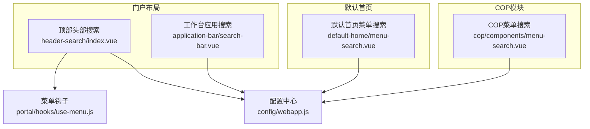
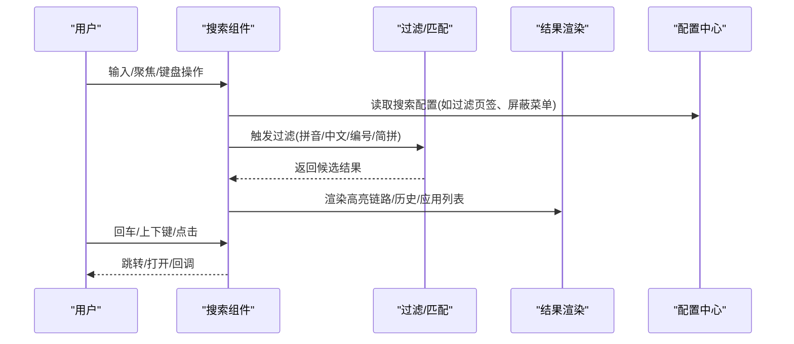
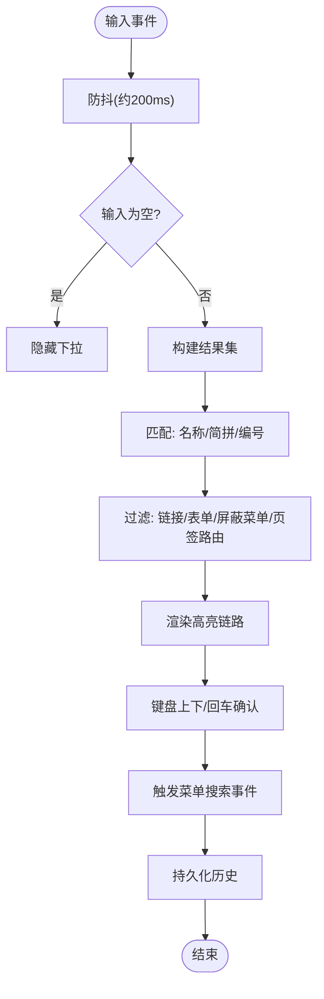
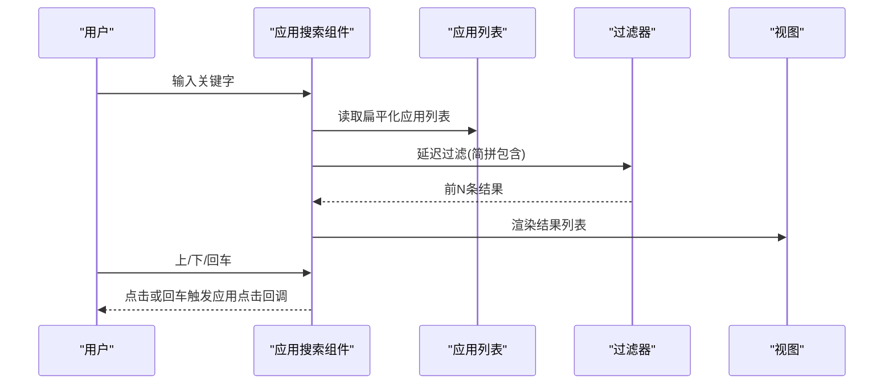
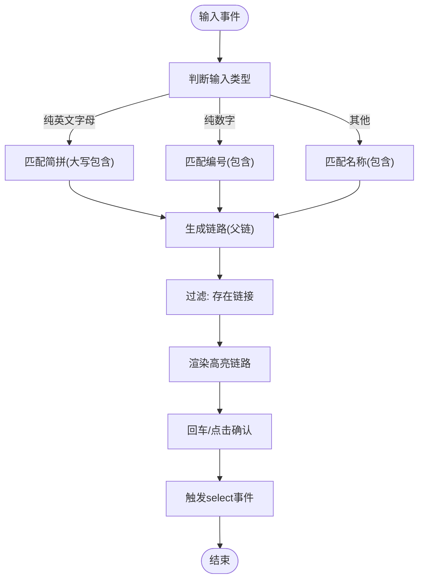
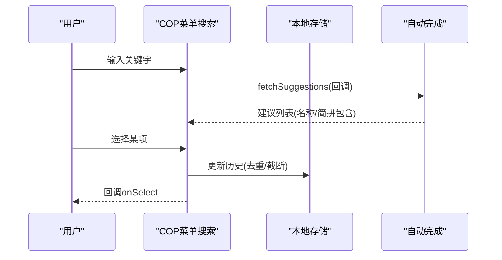
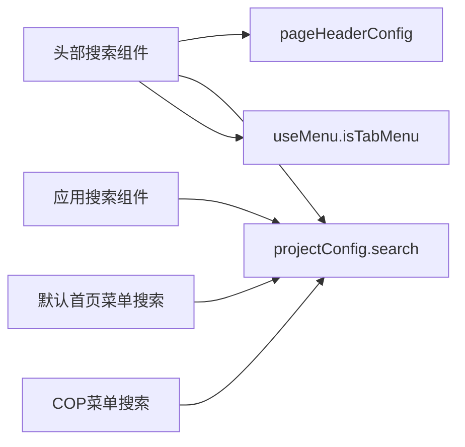

# 搜索栏组件

<cite>
**本文引用的文件**   
- [src/portal/views/layout/views/header/header-search/index.vue](file://src/portal/views/layout/views/header/header-search/index.vue)
- [src/pages/uas/components/default-home/menu-search.vue](file://src/pages/uas/components/default-home/menu-search.vue)
- [src/portal/views/workbench/application-bar/search-bar.vue](file://src/portal/views/workbench/application-bar/search-bar.vue)
- [src/pages/cop/components/menu-search.vue](file://src/pages/cop/components/menu-search.vue)
- [src/portal/hooks/use-menu.js](file://src/portal/hooks/use-menu.js)
- [src/config/webapp.js](file://src/config/webapp.js)
- [src/portal/hooks/index.js](file://src/portal/hooks/index.js)
</cite>

## 目录
1. [简介](#简介)
2. [项目结构](#项目结构)
3. [核心组件](#核心组件)
4. [架构总览](#架构总览)
5. [组件详解](#组件详解)
6. [依赖关系分析](#依赖关系分析)
7. [性能考量](#性能考量)
8. [故障排查指南](#故障排查指南)
9. [结论](#结论)
10. [附录](#附录)

## 简介
本文件面向FS-AOI-WEB的搜索栏组件，系统性梳理其设计理念、核心功能与实现细节，覆盖应用搜索、快速导航、输入提示、输入处理、搜索算法、结果过滤、交互设计与键盘快捷键、自动完成、样式定制、搜索历史与热门搜索、配置参数、事件处理与性能优化等。文档以多组件并存的现状为基础，给出统一的分析视角与最佳实践建议，帮助开发者在不同场景下正确选择与扩展搜索能力。

## 项目结构
搜索栏组件在工程中以多形态存在，分别服务于不同页面与模块：
- 顶部头部搜索（菜单树搜索）：基于弹出层与本地菜单树，支持拼音/中文/编号匹配与高亮、历史记录、键盘导航。
- 应用搜索（工作台应用快速定位）：基于应用列表的模糊匹配与前N条结果展示，支持上下键选择与回车确认。
- 默认首页菜单搜索：基于传入菜单数据的本地搜索，支持简拼/编号/中文匹配与链路高亮。
- COP模块菜单搜索：基于KUI自动完成组件，支持历史记录与回调式建议生成。

图表来源
- [src/portal/views/layout/views/header/header-search/index.vue](file://src/portal/views/layout/views/header/header-search/index.vue#L1-L424)
- [src/portal/views/workbench/application-bar/search-bar.vue](file://src/portal/views/workbench/application-bar/search-bar.vue#L1-L229)
- [src/pages/uas/components/default-home/menu-search.vue](file://src/pages/uas/components/default-home/menu-search.vue#L1-L281)
- [src/pages/cop/components/menu-search.vue](file://src/pages/cop/components/menu-search.vue#L1-L137)
- [src/config/webapp.js](file://src/config/webapp.js#L108-L189)
- [src/portal/hooks/use-menu.js](file://src/portal/hooks/use-menu.js#L1-L130)

章节来源
- [src/portal/views/layout/views/header/header-search/index.vue](file://src/portal/views/layout/views/header/header-search/index.vue#L1-L424)
- [src/portal/views/workbench/application-bar/search-bar.vue](file://src/portal/views/workbench/application-bar/search-bar.vue#L1-L229)
- [src/pages/uas/components/default-home/menu-search.vue](file://src/pages/uas/components/default-home/menu-search.vue#L1-L281)
- [src/pages/cop/components/menu-search.vue](file://src/pages/cop/components/menu-search.vue#L1-L137)
- [src/config/webapp.js](file://src/config/webapp.js#L108-L189)
- [src/portal/hooks/use-menu.js](file://src/portal/hooks/use-menu.js#L1-L130)

## 核心组件
- 顶部头部搜索（菜单树搜索）：支持拼音/中文/编号三通道匹配、链路高亮、历史记录、键盘上下选择与回车确认、可配置过滤页签路由与屏蔽菜单。
- 工作台应用搜索：对应用列表进行简拼匹配，延迟过滤与前N条展示，支持上下键循环选择与点击确认。
- 默认首页菜单搜索：对传入菜单数据进行本地匹配，支持简拼/编号/中文，链路高亮，键盘上下选择。
- COP模块菜单搜索：基于自动完成组件，支持历史记录与最大记录数配置，回调式建议生成。

章节来源
- [src/portal/views/layout/views/header/header-search/index.vue](file://src/portal/views/layout/views/header/header-search/index.vue#L100-L321)
- [src/portal/views/workbench/application-bar/search-bar.vue](file://src/portal/views/workbench/application-bar/search-bar.vue#L24-L78)
- [src/pages/uas/components/default-home/menu-search.vue](file://src/pages/uas/components/default-home/menu-search.vue#L80-L175)
- [src/pages/cop/components/menu-search.vue](file://src/pages/cop/components/menu-search.vue#L62-L86)

## 架构总览
搜索栏组件围绕“输入 -> 过滤/匹配 -> 结果渲染 -> 交互确认”的闭环构建，同时通过配置中心与菜单钩子实现跨组件的一致行为与数据来源。

图表来源
- [src/portal/views/layout/views/header/header-search/index.vue](file://src/portal/views/layout/views/header/header-search/index.vue#L100-L321)
- [src/portal/views/workbench/application-bar/search-bar.vue](file://src/portal/views/workbench/application-bar/search-bar.vue#L24-L78)
- [src/pages/uas/components/default-home/menu-search.vue](file://src/pages/uas/components/default-home/menu-search.vue#L80-L175)
- [src/pages/cop/components/menu-search.vue](file://src/pages/cop/components/menu-search.vue#L62-L86)
- [src/config/webapp.js](file://src/config/webapp.js#L108-L189)

## 组件详解

### 顶部头部搜索（菜单树搜索）
- 功能要点
  - 输入处理：防抖触发，空值隐藏；聚焦时可请求菜单树或加载历史。
  - 搜索算法：递归遍历菜单树，按名称、简拼、编号匹配；支持屏蔽父级/自身菜单ID与过滤页签路由。
  - 结果过滤：仅保留具备链接或表单的菜单节点；链路高亮匹配片段。
  - 交互设计：上下键循环选择，回车确认；自动滚动至选中项；支持清空历史与删除单项历史。
  - 历史记录：基于用户代码区分本地存储，最多10条，支持删除与一键清空。
- 关键流程（输入到结果）

图表来源
- [src/portal/views/layout/views/header/header-search/index.vue](file://src/portal/views/layout/views/header/header-search/index.vue#L100-L321)

章节来源
- [src/portal/views/layout/views/header/header-search/index.vue](file://src/portal/views/layout/views/header/header-search/index.vue#L100-L321)
- [src/config/webapp.js](file://src/config/webapp.js#L108-L189)
- [src/portal/hooks/use-menu.js](file://src/portal/hooks/use-menu.js#L85-L87)

### 工作台应用搜索
- 功能要点
  - 输入处理：输入变更触发查询，带延迟（约100ms）以降低频繁计算。
  - 搜索算法：对应用列表进行简拼匹配，取前N条结果（默认10）。
  - 交互设计：上下键循环选择，回车确认；失焦延时隐藏结果。
- 关键流程（输入到应用跳转）

图表来源
- [src/portal/views/workbench/application-bar/search-bar.vue](file://src/portal/views/workbench/application-bar/search-bar.vue#L24-L78)

章节来源
- [src/portal/views/workbench/application-bar/search-bar.vue](file://src/portal/views/workbench/application-bar/search-bar.vue#L24-L78)

### 默认首页菜单搜索
- 功能要点
  - 输入处理：输入为空隐藏；聚焦触发一次查询。
  - 搜索算法：根据输入类型（纯英文字母/纯数字/其他）分别匹配简拼/编号/名称；生成链路高亮位置。
  - 交互设计：上下键选择，回车确认；点击触发选择事件。
- 关键流程（本地菜单数据匹配）

图表来源
- [src/pages/uas/components/default-home/menu-search.vue](file://src/pages/uas/components/default-home/menu-search.vue#L80-L175)

章节来源
- [src/pages/uas/components/default-home/menu-search.vue](file://src/pages/uas/components/default-home/menu-search.vue#L80-L175)

### COP模块菜单搜索
- 功能要点
  - 使用自动完成组件，支持触发时机、去抖、建议回调。
  - 历史记录：基于localStorage，按recordKey分组存储，支持最大记录数与一键清空。
  - 选择处理：更新历史、清空输入、回调通知。
- 关键流程（建议生成与历史维护）

图表来源
- [src/pages/cop/components/menu-search.vue](file://src/pages/cop/components/menu-search.vue#L62-L86)

章节来源
- [src/pages/cop/components/menu-search.vue](file://src/pages/cop/components/menu-search.vue#L62-L86)

## 依赖关系分析
- 配置中心
  - pageHeaderConfig：定义搜索屏蔽的父级/自身菜单ID与可搜索父级菜单ID，影响菜单树搜索的可见性与范围。
  - projectConfig.search：控制是否过滤页签路由、失去焦点是否清空、历史记录是否可删除等行为。
- 菜单钩子
  - useMenu.isTabMenu：用于过滤页签类菜单，避免被菜单树搜索命中。
- 组件间耦合
  - 顶部头部搜索与菜单树强关联，依赖配置中心与菜单钩子。
  - 应用搜索与菜单搜索分别独立，前者面向应用列表，后者面向菜单数据。

图表来源
- [src/config/webapp.js](file://src/config/webapp.js#L108-L189)
- [src/portal/hooks/use-menu.js](file://src/portal/hooks/use-menu.js#L85-L87)

章节来源
- [src/config/webapp.js](file://src/config/webapp.js#L108-L189)
- [src/portal/hooks/use-menu.js](file://src/portal/hooks/use-menu.js#L85-L87)

## 性能考量
- 防抖与延迟
  - 头部搜索采用约200ms防抖，减少高频输入带来的计算压力。
  - 应用搜索采用约100ms延迟过滤，平衡响应与性能。
- 结果上限
  - 应用搜索默认取前10条，避免渲染过多DOM节点。
- 匹配策略
  - 优先按输入类型分流（简拼/编号/名称），减少全量扫描。
  - 菜单树搜索在遍历时结合屏蔽菜单与页签过滤，缩小候选集。
- DOM与滚动
  - 头部搜索在选中项变化后通过下一帧滚动至可视区域，避免频繁重排。
- 历史记录
  - 限制最多10条，避免localStorage膨胀；COP模块支持按recordKey分组，避免全局冲突。

章节来源
- [src/portal/views/layout/views/header/header-search/index.vue](file://src/portal/views/layout/views/header/header-search/index.vue#L121-L129)
- [src/portal/views/workbench/application-bar/search-bar.vue](file://src/portal/views/workbench/application-bar/search-bar.vue#L28-L40)
- [src/pages/uas/components/default-home/menu-search.vue](file://src/pages/uas/components/default-home/menu-search.vue#L93-L103)
- [src/pages/cop/components/menu-search.vue](file://src/pages/cop/components/menu-search.vue#L76-L81)

## 故障排查指南
- 搜索无结果
  - 检查pageHeaderConfig.searchMaskMenu与searchParentMenu是否误屏蔽目标菜单。
  - 确认projectConfig.search.filterTabMenu是否导致页签路由被过滤。
  - 确认菜单数据是否已加载（头部搜索聚焦时会尝试向iframe发送获取菜单消息）。
- 历史记录异常
  - 确认localStorage键是否包含用户代码区分（头部搜索）。
  - COP模块需正确传入recordKey，否则不会写入历史。
- 键盘导航无效
  - 确认事件绑定是否生效（回车/上下键）。
  - 确认当前组件处于可见状态且有候选结果。
- 应用搜索不显示结果
  - 确认应用列表已扁平化并传入组件。
  - 确认简拼匹配逻辑符合预期（大小写处理）。

章节来源
- [src/config/webapp.js](file://src/config/webapp.js#L108-L189)
- [src/portal/views/layout/views/header/header-search/index.vue](file://src/portal/views/layout/views/header/header-search/index.vue#L135-L151)
- [src/pages/cop/components/menu-search.vue](file://src/pages/cop/components/menu-search.vue#L58-L61)

## 结论
FS-AOI-WEB的搜索栏组件在不同场景下提供了多样化的实现方案：顶部头部搜索侧重菜单树的链路高亮与历史记录，应用搜索强调快速定位应用，而默认首页与COP模块搜索则针对本地菜单数据与自动完成组件进行了适配。通过配置中心与菜单钩子，组件实现了行为一致性与可扩展性。建议在新场景中优先复用现有模式，并结合性能参数与交互体验进行微调。

## 附录

### 配置参数一览
- pageHeaderConfig.searchMaskMenu：搜索屏蔽的父级/自身菜单ID数组
- pageHeaderConfig.searchParentMenu：可搜索父级菜单ID数组
- projectConfig.search.filterTabMenu：是否过滤页签路由
- projectConfig.search.clearOnBlur：失去焦点是否清空
- projectConfig.search.removeHistory：历史记录是否可删除
- 应用搜索topNum：默认取前N条结果（默认10）

章节来源
- [src/config/webapp.js](file://src/config/webapp.js#L108-L189)