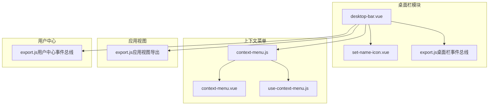
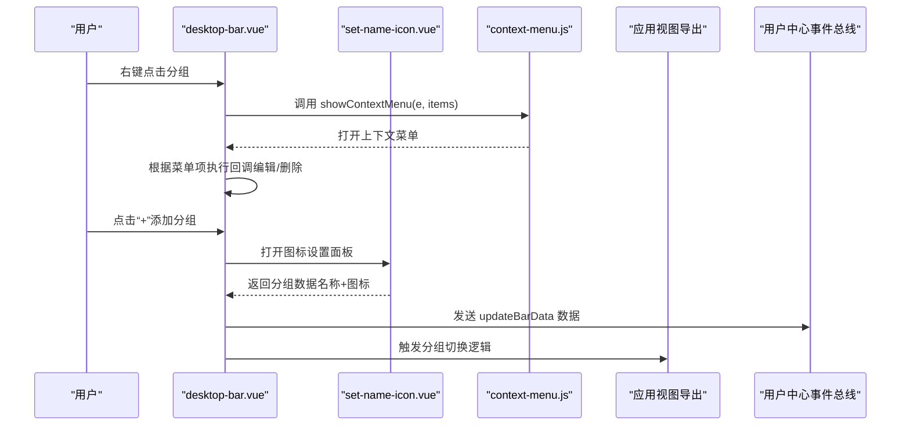
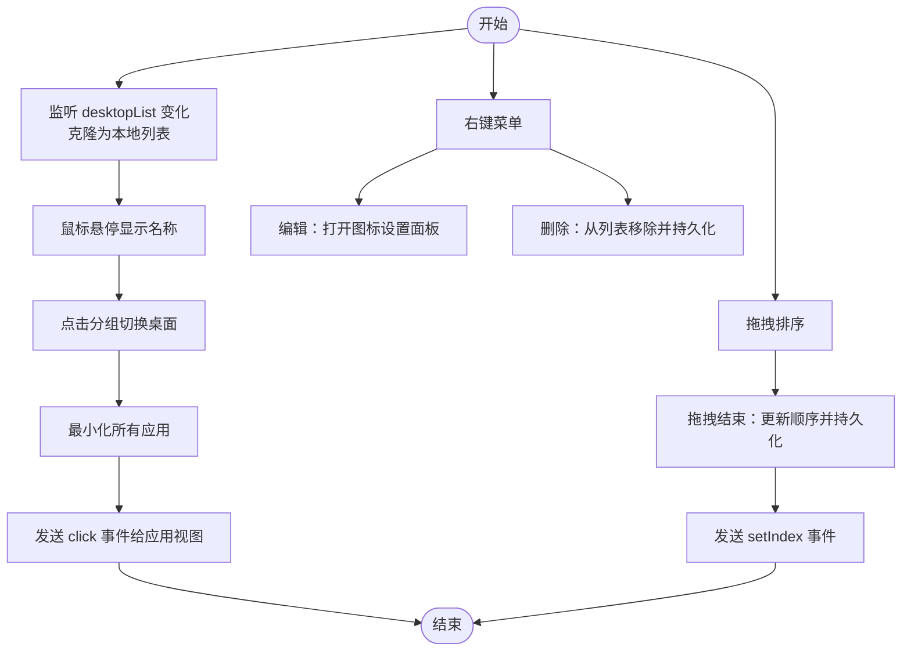
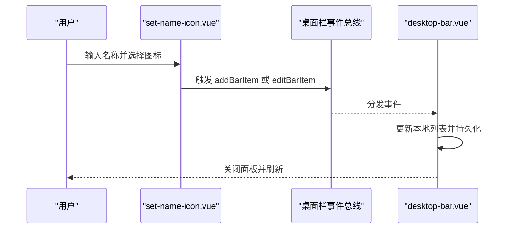
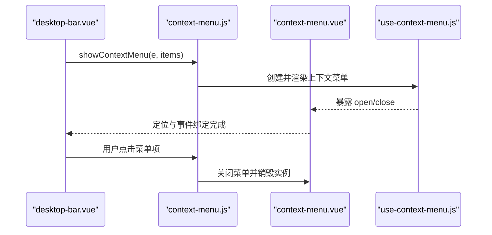
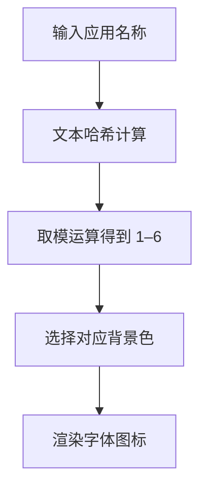
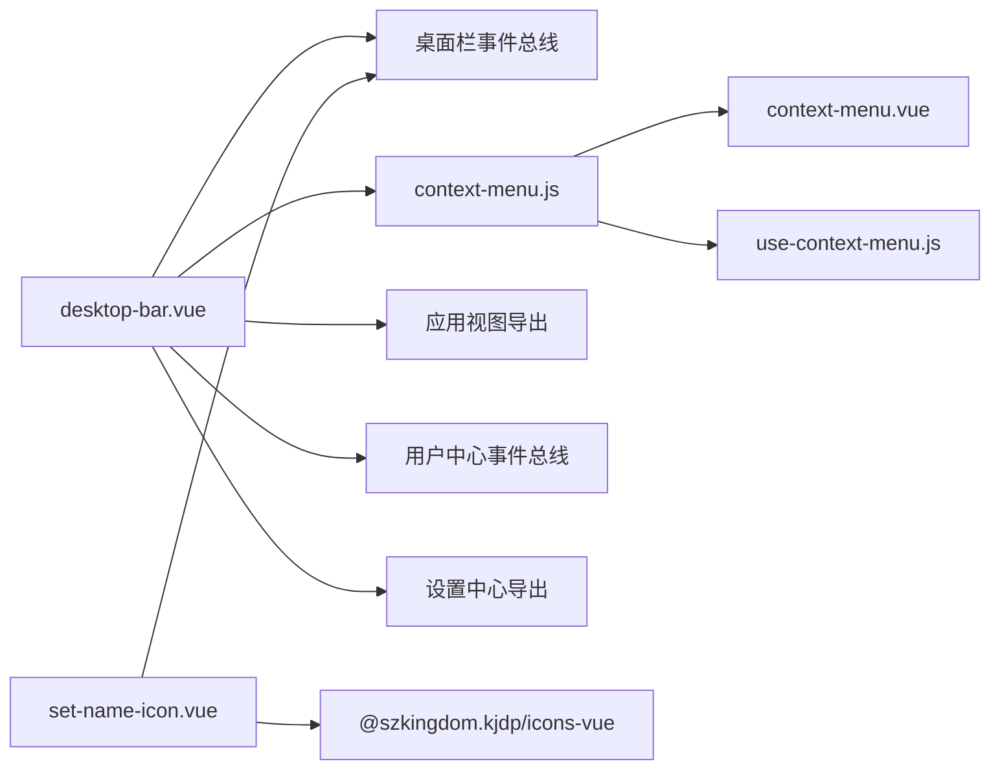

# 桌面栏组件

<cite>
**本文引用的文件**
- [desktop-bar.vue](file://src/portal/views/workbench/desktop-bar/desktop-bar.vue)
- [set-name-icon.vue](file://src/portal/views/workbench/desktop-bar/set-name-icon.vue)
- [export.js（桌面栏事件总线）](file://src/portal/views/workbench/desktop-bar/export.js)
- [application-icon.vue](file://src/portal/views/workbench/desktop-view/application-icon.vue)
- [context-menu.js](file://src/portal/views/workbench/components/context-menu.js)
- [context-menu.vue](file://src/portal/views/workbench/components/context-menu.vue)
- [use-context-menu.js](file://src/portal/views/workbench/components/use-context-menu.js)
- [export.js（用户中心事件总线）](file://src/portal/views/workbench/user-center/export.js)
- [export.js（设置中心导出）](file://src/portal/views/workbench/setting-center/export.js)
- [export.js（应用视图导出）](file://src/portal/views/workbench/application-view/export.js)
</cite>

## 目录
1. [简介](#简介)
2. [项目结构](#项目结构)
3. [核心组件](#核心组件)
4. [架构总览](#架构总览)
5. [详细组件分析](#详细组件分析)
6. [依赖关系分析](#依赖关系分析)
7. [性能与交互特性](#性能与交互特性)
8. [故障排查指南](#故障排查指南)
9. [结论](#结论)
10. [附录：配置与扩展指南](#附录配置与扩展指南)

## 简介
本文件面向 FS-AOI-WEB 的“桌面栏”组件，系统性梳理其整体设计、核心功能与实现细节，覆盖以下主题：
- 桌面栏布局与图标展示
- 右键上下文菜单与菜单项配置
- 图标设置与名称修改流程
- 拖拽排序与事件传播链路
- 配置项、事件监听与自定义扩展建议

## 项目结构
桌面栏位于工作台视图中，作为侧边栏容器承载多个“桌面分组”，每个分组可包含若干应用图标。其关键文件如下：
- 桌面栏主组件：负责渲染分组列表、图标选择面板、右键菜单、拖拽排序与位置控制
- 图标设置面板：用于设置分组名称与图标
- 上下文菜单：统一的右键菜单实现
- 事件总线：桌面栏与用户中心、应用视图之间的通信桥梁

图表来源
- [desktop-bar.vue](file://src/portal/views/workbench/desktop-bar/desktop-bar.vue#L1-L409)
- [set-name-icon.vue](file://src/portal/views/workbench/desktop-bar/set-name-icon.vue#L1-L168)
- [export.js（桌面栏事件总线）](file://src/portal/views/workbench/desktop-bar/export.js#L1-L6)
- [context-menu.js](file://src/portal/views/workbench/components/context-menu.js#L1-L41)
- [context-menu.vue](file://src/portal/views/workbench/components/context-menu.vue#L1-L87)
- [use-context-menu.js](file://src/portal/views/workbench/components/use-context-menu.js#L1-L20)
- [export.js（应用视图导出）](file://src/portal/views/workbench/application-view/export.js#L1-L5)
- [export.js（用户中心事件总线）](file://src/portal/views/workbench/user-center/export.js#L1-L26)

章节来源
- [desktop-bar.vue](file://src/portal/views/workbench/desktop-bar/desktop-bar.vue#L1-L409)
- [set-name-icon.vue](file://src/portal/views/workbench/desktop-bar/set-name-icon.vue#L1-L168)
- [context-menu.js](file://src/portal/views/workbench/components/context-menu.js#L1-L41)
- [context-menu.vue](file://src/portal/views/workbench/components/context-menu.vue#L1-L87)
- [use-context-menu.js](file://src/portal/views/workbench/components/use-context-menu.js#L1-L20)
- [export.js（桌面栏事件总线）](file://src/portal/views/workbench/desktop-bar/export.js#L1-L6)
- [export.js（应用视图导出）](file://src/portal/views/workbench/application-view/export.js#L1-L5)
- [export.js（用户中心事件总线）](file://src/portal/views/workbench/user-center/export.js#L1-L26)

## 核心组件
- 桌面栏主组件：负责渲染桌面分组列表、图标选择面板、右键菜单、拖拽排序与位置控制
- 图标设置面板：用于设置分组名称与图标
- 上下文菜单：统一的右键菜单实现
- 事件总线：桌面栏与用户中心、应用视图之间的通信桥梁

章节来源
- [desktop-bar.vue](file://src/portal/views/workbench/desktop-bar/desktop-bar.vue#L1-L409)
- [set-name-icon.vue](file://src/portal/views/workbench/desktop-bar/set-name-icon.vue#L1-L168)
- [context-menu.js](file://src/portal/views/workbench/components/context-menu.js#L1-L41)
- [context-menu.vue](file://src/portal/views/workbench/components/context-menu.vue#L1-L87)
- [use-context-menu.js](file://src/portal/views/workbench/components/use-context-menu.js#L1-L20)
- [export.js（桌面栏事件总线）](file://src/portal/views/workbench/desktop-bar/export.js#L1-L6)
- [export.js（应用视图导出）](file://src/portal/views/workbench/application-view/export.js#L1-L5)
- [export.js（用户中心事件总线）](file://src/portal/views/workbench/user-center/export.js#L1-L26)

## 架构总览
桌面栏采用“事件驱动 + 组件组合”的架构模式：
- 使用 mitt 事件总线在桌面栏与用户中心、应用视图之间传递消息
- 右键菜单通过独立的上下文菜单组件实现，支持动态注入菜单项
- 图标设置面板以浮层形式弹出，支持图标库选择与名称输入
- 拖拽排序基于 vue-draggable-plus，支持分组顺序调整与自动持久化

图表来源
- [desktop-bar.vue](file://src/portal/views/workbench/desktop-bar/desktop-bar.vue#L81-L102)
- [set-name-icon.vue](file://src/portal/views/workbench/desktop-bar/set-name-icon.vue#L18-L33)
- [context-menu.js](file://src/portal/views/workbench/components/context-menu.js#L26-L41)
- [export.js（桌面栏事件总线）](file://src/portal/views/workbench/desktop-bar/export.js#L1-L6)
- [export.js（用户中心事件总线）](file://src/portal/views/workbench/user-center/export.js#L1-L26)
- [export.js（应用视图导出）](file://src/portal/views/workbench/application-view/export.js#L1-L5)

## 详细组件分析

### 桌面栏主组件（desktop-bar.vue）
- 功能概览
  - 渲染桌面分组列表，支持悬停展开名称与图标
  - 支持右键菜单：编辑、删除
  - 支持拖拽排序：自动更新顺序并持久化
  - 支持位置控制：左/右侧吸附
  - 与应用视图联动：最小化所有应用后切换当前桌面
  - 与用户中心联动：更新桌面分组数据

- 关键实现要点
  - 响应式数据：当前选中桌面、克隆的桌面列表、图标集合
  - 事件处理：点击切换、右键菜单、拖拽结束、窗口点击收起面板
  - 图标渲染：优先使用图标库中的图标，否则回退到静态资源路径
  - 位置控制：根据设置中心的配置决定左右吸附位置

- 拖拽与排序
  - 使用 vue-draggable-plus 实现拖拽
  - 结束拖拽时触发更新与点击事件，确保选中状态同步

- 右键菜单
  - 动态生成菜单项，支持编辑与删除
  - 编辑打开图标设置面板；删除从列表移除并持久化

- 与应用视图联动
  - 切换桌面前最小化所有已打开应用
  - 通过事件总线通知应用视图切换当前桌面

- 与用户中心联动
  - 更新桌面分组数据通过用户中心事件总线广播

图表来源
- [desktop-bar.vue](file://src/portal/views/workbench/desktop-bar/desktop-bar.vue#L40-L147)

章节来源
- [desktop-bar.vue](file://src/portal/views/workbench/desktop-bar/desktop-bar.vue#L1-L409)

### 图标设置面板（set-name-icon.vue）
- 功能概览
  - 输入分组名称
  - 从图标库中选择图标
  - 保存或添加新分组
  - 自动滚动到已选图标位置

- 关键实现要点
  - 图标库加载：遍历图标库并将可用图标类名注入列表
  - 保存逻辑：根据是否存在目标分组决定新增或编辑事件
  - 面板关闭：清空输入并关闭面板

图表来源
- [set-name-icon.vue](file://src/portal/views/workbench/desktop-bar/set-name-icon.vue#L18-L33)
- [export.js（桌面栏事件总线）](file://src/portal/views/workbench/desktop-bar/export.js#L1-L6)
- [desktop-bar.vue](file://src/portal/views/workbench/desktop-bar/desktop-bar.vue#L112-L128)

章节来源
- [set-name-icon.vue](file://src/portal/views/workbench/desktop-bar/set-name-icon.vue#L1-L168)

### 上下文菜单（context-menu.js 与 context-menu.vue）
- 功能概览
  - 动态构建菜单项
  - 自适应定位：避免溢出屏幕边界
  - 外部点击与 ESC 键关闭
  - 通过 use-context-menu.js 提供生命周期管理

- 关键实现要点
  - showContextMenu 接受菜单项数组，内部构建虚拟节点并挂载
  - context-menu.vue 负责定位、动画与事件绑定
  - use-context-menu.js 提供 open/close/destroy 生命周期方法

图表来源
- [context-menu.js](file://src/portal/views/workbench/components/context-menu.js#L26-L41)
- [context-menu.vue](file://src/portal/views/workbench/components/context-menu.vue#L9-L43)
- [use-context-menu.js](file://src/portal/views/workbench/components/use-context-menu.js#L4-L19)

章节来源
- [context-menu.js](file://src/portal/views/workbench/components/context-menu.js#L1-L41)
- [context-menu.vue](file://src/portal/views/workbench/components/context-menu.vue#L1-L87)
- [use-context-menu.js](file://src/portal/views/workbench/components/use-context-menu.js#L1-L20)

### 应用图标组件（application-icon.vue）
- 功能概览
  - 支持两种图标来源：应用自带图标（SVG 文件）与字体图标（按名称哈希映射到固定背景色）
  - 字体图标通过名称哈希计算背景色，保证一致性与可辨识度

- 关键实现要点
  - 文本到 1–6 的映射函数：对菜单名进行哈希并取模，确保稳定的颜色映射
  - 字体图标样式：通过伪元素输出首字母，配合渐变背景色

图表来源
- [application-icon.vue](file://src/portal/views/workbench/desktop-view/application-icon.vue#L11-L18)

章节来源
- [application-icon.vue](file://src/portal/views/workbench/desktop-view/application-icon.vue#L1-L69)

## 依赖关系分析
- 组件耦合
  - desktop-bar.vue 依赖：事件总线、上下文菜单、应用视图导出、用户中心事件总线、设置中心导出
  - set-name-icon.vue 依赖：图标库、桌面栏事件总线
  - 上下文菜单组件相互协作，通过 use-context-menu.js 管理生命周期

- 外部依赖
  - vue-draggable-plus：提供拖拽排序能力
  - mitt：轻量级事件总线
  - @szkingdom.kjdp/icons-vue：图标库

图表来源
- [desktop-bar.vue](file://src/portal/views/workbench/desktop-bar/desktop-bar.vue#L1-L12)
- [set-name-icon.vue](file://src/portal/views/workbench/desktop-bar/set-name-icon.vue#L1-L11)
- [context-menu.js](file://src/portal/views/workbench/components/context-menu.js#L1-L3)
- [context-menu.vue](file://src/portal/views/workbench/components/context-menu.vue#L1-L3)
- [use-context-menu.js](file://src/portal/views/workbench/components/use-context-menu.js#L1-L3)
- [export.js（桌面栏事件总线）](file://src/portal/views/workbench/desktop-bar/export.js#L1-L6)
- [export.js（用户中心事件总线）](file://src/portal/views/workbench/user-center/export.js#L1-L3)
- [export.js（设置中心导出）](file://src/portal/views/workbench/setting-center/export.js#L1-L4)
- [export.js（应用视图导出）](file://src/portal/views/workbench/application-view/export.js#L1-L5)

章节来源
- [desktop-bar.vue](file://src/portal/views/workbench/desktop-bar/desktop-bar.vue#L1-L12)
- [set-name-icon.vue](file://src/portal/views/workbench/desktop-bar/set-name-icon.vue#L1-L11)
- [context-menu.js](file://src/portal/views/workbench/components/context-menu.js#L1-L3)
- [context-menu.vue](file://src/portal/views/workbench/components/context-menu.vue#L1-L3)
- [use-context-menu.js](file://src/portal/views/workbench/components/use-context-menu.js#L1-L3)
- [export.js（桌面栏事件总线）](file://src/portal/views/workbench/desktop-bar/export.js#L1-L6)
- [export.js（用户中心事件总线）](file://src/portal/views/workbench/user-center/export.js#L1-L3)
- [export.js（设置中心导出）](file://src/portal/views/workbench/setting-center/export.js#L1-L4)
- [export.js（应用视图导出）](file://src/portal/views/workbench/application-view/export.js#L1-L5)

## 性能与交互特性
- 拖拽性能
  - 使用 vue-draggable-plus 并设置动画时长，保证流畅体验
  - 拖拽结束才触发持久化，减少频繁写入

- 图标渲染
  - 图标库与静态资源双通道，优先使用图标库以提升一致性
  - 字体图标按名称哈希映射，避免重复计算开销

- 上下文菜单
  - 动态构建菜单项，避免冗余 DOM
  - 自适应定位，避免溢出屏幕导致重排

- 事件总线
  - mitt 轻量高效，避免大型组件树的复杂 props 传递

[本节为通用性能讨论，不直接分析具体文件]

## 故障排查指南
- 右键菜单不显示
  - 检查调用 showContextMenu 的参数是否为空
  - 确认 context-menu.js 是否正确创建并渲染上下文菜单

- 拖拽排序无效
  - 检查 vue-draggable-plus 的 group 配置与事件绑定
  - 确认拖拽结束后是否触发了更新与点击事件

- 图标未显示或显示异常
  - 检查图标库是否正确加载
  - 若使用静态资源，确认路径与文件存在

- 分组名称或图标未保存
  - 检查 set-name-icon.vue 的保存逻辑与事件总线分发
  - 确认用户中心事件总线是否收到 updateBarData

章节来源
- [context-menu.js](file://src/portal/views/workbench/components/context-menu.js#L26-L41)
- [desktop-bar.vue](file://src/portal/views/workbench/desktop-bar/desktop-bar.vue#L139-L147)
- [set-name-icon.vue](file://src/portal/views/workbench/desktop-bar/set-name-icon.vue#L18-L33)
- [export.js（用户中心事件总线）](file://src/portal/views/workbench/user-center/export.js#L1-L26)

## 结论
桌面栏组件通过清晰的职责划分与事件驱动架构，实现了稳定的分组管理、图标设置与上下文菜单功能，并结合拖拽排序与位置控制提供了良好的用户体验。其模块化设计便于扩展与维护。

[本节为总结性内容，不直接分析具体文件]

## 附录：配置与扩展指南
- 配置项
  - 桌面栏位置：通过设置中心的配置项控制左右吸附位置
  - 分组数据：由用户中心事件总线接收并持久化

- 事件监听
  - 桌面栏事件总线：支持 setSelected、setPosition、addBarItem、editBarItem 等事件
  - 用户中心事件总线：用于更新桌面分组数据
  - 应用视图导出：用于切换当前桌面与最小化应用

- 自定义开发建议
  - 新增菜单项：在桌面栏组件中扩展右键菜单项数组
  - 新增图标：在 set-name-icon.vue 中扩展图标库加载逻辑
  - 新增配置：在设置中心导出中增加新的配置项并通过计算属性暴露

章节来源
- [desktop-bar.vue](file://src/portal/views/workbench/desktop-bar/desktop-bar.vue#L14-L15)
- [export.js（桌面栏事件总线）](file://src/portal/views/workbench/desktop-bar/export.js#L1-L6)
- [export.js（用户中心事件总线）](file://src/portal/views/workbench/user-center/export.js#L1-L26)
- [export.js（设置中心导出）](file://src/portal/views/workbench/setting-center/export.js#L1-L4)
- [export.js（应用视图导出）](file://src/portal/views/workbench/application-view/export.js#L1-L5)