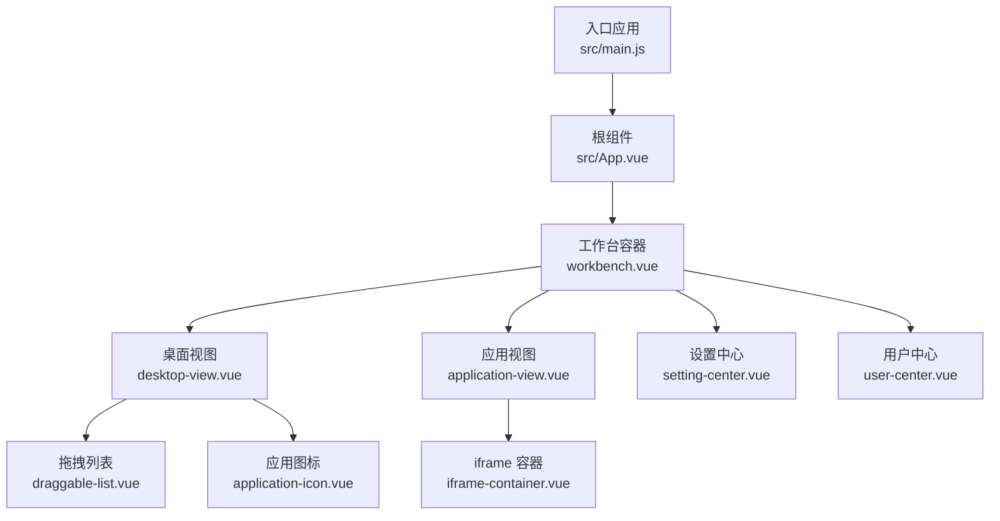
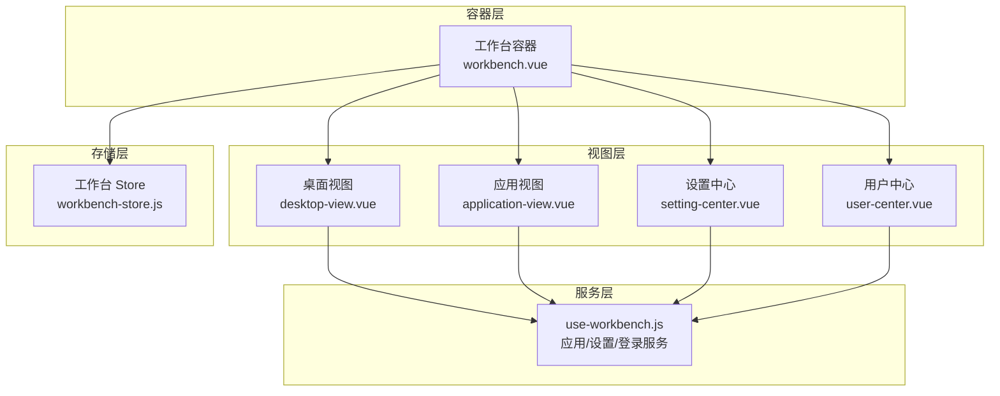
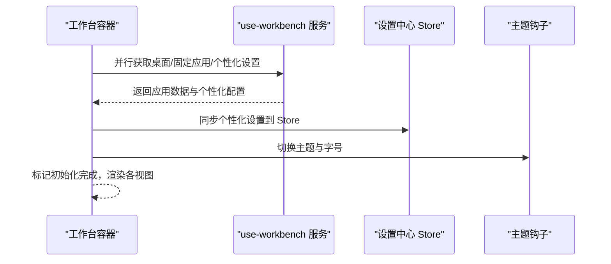
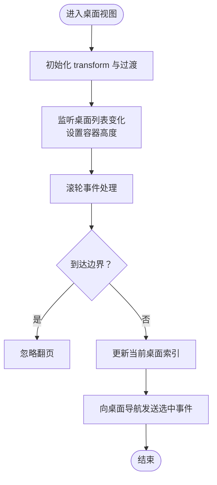
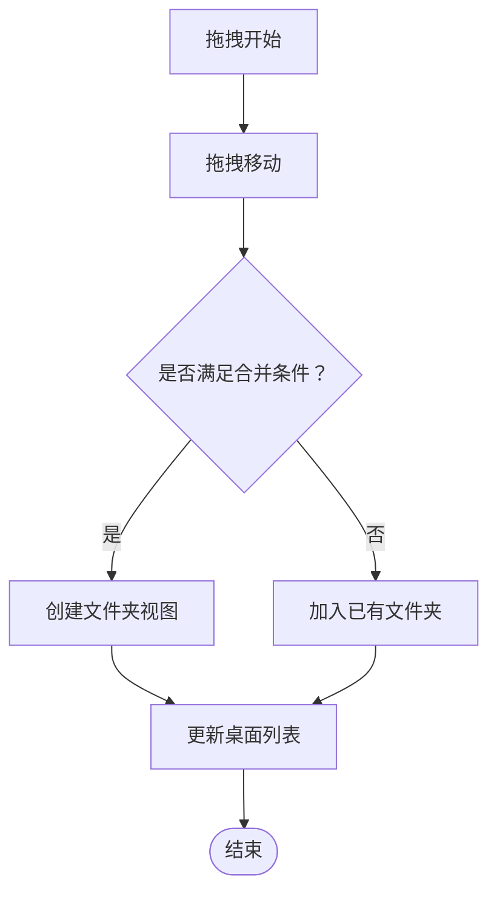
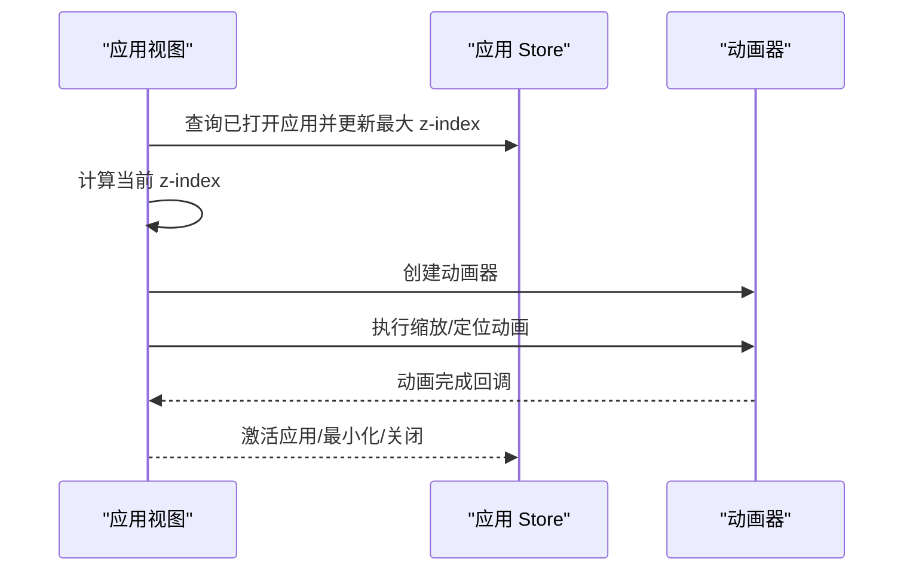
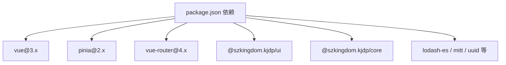

# 工作台系统

<cite>
**本文引用的文件**
- [README.md](file://README.md)
- [package.json](file://package.json)
- [src/main.js](file://src/main.js)
- [src/App.vue](file://src/App.vue)
- [src/portal/views/workbench/workbench.vue](file://src/portal/views/workbench/workbench.vue)
- [src/portal/views/workbench/use-workbench.js](file://src/portal/views/workbench/use-workbench.js)
- [src/portal/views/workbench/workbench-store.js](file://src/portal/views/workbench/workbench-store.js)
- [src/portal/views/workbench/desktop-view/desktop-view.vue](file://src/portal/views/workbench/desktop-view/desktop-view.vue)
- [src/portal/views/workbench/desktop-view/application-icon.vue](file://src/portal/views/workbench/desktop-view/application-icon.vue)
- [src/portal/views/workbench/desktop-view/draggable-list.vue](file://src/portal/views/workbench/desktop-view/draggable-list.vue)
- [src/portal/views/workbench/application-view/application-view.vue](file://src/portal/views/workbench/application-view/application-view.vue)
- [src/portal/views/workbench/application-view/iframe-container/iframe-container.vue](file://src/portal/views/workbench/application-view/iframe-container/iframe-container.vue)
- [src/portal/views/workbench/setting-center/setting-center.vue](file://src/portal/views/workbench/setting-center/setting-center.vue)
- [src/portal/views/workbench/user-center/user-center.vue](file://src/portal/views/workbench/user-center/user-center.vue)
</cite>

## 目录
1. [简介](#简介)
2. [项目结构](#项目结构)
3. [核心组件](#核心组件)
4. [架构总览](#架构总览)
5. [详细组件分析](#详细组件分析)
6. [依赖关系分析](#依赖关系分析)
7. [性能考量](#性能考量)
8. [故障排查指南](#故障排查指南)
9. [结论](#结论)
10. [附录](#附录)

## 简介
FS-AOI-WEB 工作台系统是一个基于 Vue 3 + Pinia 的前端工作台平台，提供桌面视图、应用中心、应用视图、个性化设置与用户中心等核心能力。系统通过统一的配置与主题机制，支持多桌面、文件夹化应用管理、拖拽排序、iframe 应用容器、应用动画过渡、以及个性化背景与主题切换。本文档面向开发者，系统性阐述设计理念、架构设计、组件结构、数据流与交互逻辑，并提供配置项、API 说明与扩展开发指南。

## 项目结构
工作台位于门户子系统中，采用按功能域划分的目录组织方式：
- 入口与全局配置：入口应用、路由与全局样式注入
- 工作台模块：桌面视图、应用视图、设置中心、用户中心、工具方法与状态管理
- 应用与视图：iframe 容器、应用动画、应用存储与视图生命周期
- 桌面与应用：图标渲染、拖拽列表、文件夹视图与上下文菜单
- 设置与用户：设置面板、登录/用户信息弹窗

图表来源
- [src/main.js](file://src/main.js#L1-L40)
- [src/App.vue](file://src/App.vue#L1-L8)
- [src/portal/views/workbench/workbench.vue](file://src/portal/views/workbench/workbench.vue#L1-L235)
- [src/portal/views/workbench/desktop-view/desktop-view.vue](file://src/portal/views/workbench/desktop-view/desktop-view.vue#L1-L137)
- [src/portal/views/workbench/application-view/application-view.vue](file://src/portal/views/workbench/application-view/application-view.vue#L1-L358)
- [src/portal/views/workbench/application-view/iframe-container/iframe-container.vue](file://src/portal/views/workbench/application-view/iframe-container/iframe-container.vue#L1-L23)
- [src/portal/views/workbench/setting-center/setting-center.vue](file://src/portal/views/workbench/setting-center/setting-center.vue#L1-L46)
- [src/portal/views/workbench/user-center/user-center.vue](file://src/portal/views/workbench/user-center/user-center.vue#L1-L41)

章节来源
- [README.md](file://README.md#L1-L55)
- [package.json](file://package.json#L1-L61)
- [src/main.js](file://src/main.js#L1-L40)
- [src/App.vue](file://src/App.vue#L1-L8)

## 核心组件
- 工作台容器：负责初始化应用列表、固定应用、个性化设置，协调桌面视图、应用视图与设置中心的渲染与事件联动
- 桌面视图：支持多桌面切换、滚轮切换、拖拽排序与文件夹合并
- 应用视图：支持应用打开/最小化/全屏/关闭、应用间层级管理与动画过渡
- iframe 容器：承载渲染类型为 iframe 的应用视图
- 设置中心：提供主题、字体、桌面背景、图标尺寸、显示名称等个性化配置
- 用户中心：登录/登出、头像展示与用户信息弹窗

章节来源
- [src/portal/views/workbench/workbench.vue](file://src/portal/views/workbench/workbench.vue#L1-L235)
- [src/portal/views/workbench/desktop-view/desktop-view.vue](file://src/portal/views/workbench/desktop-view/desktop-view.vue#L1-L137)
- [src/portal/views/workbench/application-view/application-view.vue](file://src/portal/views/workbench/application-view/application-view.vue#L1-L358)
- [src/portal/views/workbench/application-view/iframe-container/iframe-container.vue](file://src/portal/views/workbench/application-view/iframe-container/iframe-container.vue#L1-L23)
- [src/portal/views/workbench/setting-center/setting-center.vue](file://src/portal/views/workbench/setting-center/setting-center.vue#L1-L46)
- [src/portal/views/workbench/user-center/user-center.vue](file://src/portal/views/workbench/user-center/user-center.vue#L1-L41)

## 架构总览
工作台采用“容器-视图-存储-服务”的分层架构：
- 容器层：工作台容器负责初始化与事件总线
- 视图层：桌面视图、应用视图、设置中心、用户中心各自封装 UI 与交互
- 存储层：Pinia Store 管理应用状态、设置状态与工作台状态
- 服务层：use-workbench.js 封装请求与系统能力调用（登录、参数获取、个性化设置）

图表来源
- [src/portal/views/workbench/workbench.vue](file://src/portal/views/workbench/workbench.vue#L1-L235)
- [src/portal/views/workbench/desktop-view/desktop-view.vue](file://src/portal/views/workbench/desktop-view/desktop-view.vue#L1-L137)
- [src/portal/views/workbench/application-view/application-view.vue](file://src/portal/views/workbench/application-view/application-view.vue#L1-L358)
- [src/portal/views/workbench/setting-center/setting-center.vue](file://src/portal/views/workbench/setting-center/setting-center.vue#L1-L46)
- [src/portal/views/workbench/user-center/user-center.vue](file://src/portal/views/workbench/user-center/user-center.vue#L1-L41)
- [src/portal/views/workbench/workbench-store.js](file://src/portal/views/workbench/workbench-store.js#L1-L15)
- [src/portal/views/workbench/use-workbench.js](file://src/portal/views/workbench/use-workbench.js#L1-L222)

## 详细组件分析

### 工作台容器（workbench.vue）
- 初始化流程：并行拉取桌面列表、固定应用与个性化设置，完成主题与字号切换
- 事件联动：监听用户中心与应用中心事件，动态更新桌面与应用数据
- 渲染结构：桌面导航条、桌面视图、应用主视图、应用状态栏、设置中心与客户相关功能模块

图表来源
- [src/portal/views/workbench/workbench.vue](file://src/portal/views/workbench/workbench.vue#L52-L96)
- [src/portal/views/workbench/use-workbench.js](file://src/portal/views/workbench/use-workbench.js#L16-L122)
- [src/portal/views/workbench/use-workbench.js](file://src/portal/views/workbench/use-workbench.js#L167-L178)

章节来源
- [src/portal/views/workbench/workbench.vue](file://src/portal/views/workbench/workbench.vue#L1-L235)

### 桌面视图（desktop-view.vue）
- 多桌面切换：通过 transform 与 transition 实现平滑切换；滚轮事件在边界处阻止继续翻页
- 动态高度：根据桌面数量动态设置容器高度
- 与桌面导航联动：接收点击事件，定位到指定桌面索引

图表来源
- [src/portal/views/workbench/desktop-view/desktop-view.vue](file://src/portal/views/workbench/desktop-view/desktop-view.vue#L20-L91)

章节来源
- [src/portal/views/workbench/desktop-view/desktop-view.vue](file://src/portal/views/workbench/desktop-view/desktop-view.vue#L1-L137)

### 拖拽列表与应用图标（draggable-list.vue / application-icon.vue）
- 拖拽排序：使用可拖拽库实现网格布局下的拖拽排序与拖放
- 文件夹合并：支持将多个应用拖入形成文件夹，或在应用上创建新文件夹
- 图标渲染：优先使用 SVG 图标，否则根据应用名称生成带背景色的首字母占位图标
- 右键菜单：支持删除、释放（从文件夹中取出）等操作

图表来源
- [src/portal/views/workbench/desktop-view/draggable-list.vue](file://src/portal/views/workbench/desktop-view/draggable-list.vue#L144-L223)
- [src/portal/views/workbench/desktop-view/draggable-list.vue](file://src/portal/views/workbench/desktop-view/draggable-list.vue#L321-L363)
- [src/portal/views/workbench/desktop-view/application-icon.vue](file://src/portal/views/workbench/desktop-view/application-icon.vue#L1-L69)

章节来源
- [src/portal/views/workbench/desktop-view/draggable-list.vue](file://src/portal/views/workbench/desktop-view/draggable-list.vue#L1-L652)
- [src/portal/views/workbench/desktop-view/application-icon.vue](file://src/portal/views/workbench/desktop-view/application-icon.vue#L1-L69)

### 应用视图与动画（application-view.vue）
- 层级管理：通过 Store 维护最大 z-index，激活应用提升层级
- 动画过渡：使用自定义动画器实现缩放与定位动画，支持最小化/恢复/关闭
- 全屏模式：切换全屏时重置 transform，避免遮挡应用状态栏
- 视图类型：根据 renderType 决定使用组件渲染还是 iframe 容器

图表来源
- [src/portal/views/workbench/application-view/application-view.vue](file://src/portal/views/workbench/application-view/application-view.vue#L28-L196)

章节来源
- [src/portal/views/workbench/application-view/application-view.vue](file://src/portal/views/workbench/application-view/application-view.vue#L1-L358)

### iframe 容器（iframe-container.vue）
- 条件渲染：仅当应用为激活态时渲染 iframe
- 容器样式：占满父容器，隐藏溢出

章节来源
- [src/portal/views/workbench/application-view/iframe-container/iframe-container.vue](file://src/portal/views/workbench/application-view/iframe-container/iframe-container.vue#L1-L23)

### 设置中心（setting-center.vue）
- 触发方式：底部设置图标点击打开设置对话框
- 对话框内容：包含主题、字体、桌面背景、图标尺寸、显示名称等配置项
- 与 use-workbench 同步：通过 Store 与服务层联动，持久化个性化设置

章节来源
- [src/portal/views/workbench/setting-center/setting-center.vue](file://src/portal/views/workbench/setting-center/setting-center.vue#L1-L46)
- [src/portal/views/workbench/use-workbench.js](file://src/portal/views/workbench/use-workbench.js#L169-L195)

### 用户中心（user-center.vue）
- 登录态判断：根据系统能力判断是否已登录
- 头像点击：在线显示头像，离线显示默认头像；点击打开用户/登录弹窗
- 弹窗控制：根据登录状态切换用户信息弹窗或登录弹窗

章节来源
- [src/portal/views/workbench/user-center/user-center.vue](file://src/portal/views/workbench/user-center/user-center.vue#L1-L41)
- [src/portal/views/workbench/use-workbench.js](file://src/portal/views/workbench/use-workbench.js#L197-L207)

## 依赖关系分析
- 运行时依赖：Vue 3、Pinia、路由与 UI 组件库
- 构建与工具：Vite、ESLint、Prettier、压缩插件
- 门户与框架：@szkingdom.kjdp/core 与 @szkingdom.kjdp/ui 提供系统能力与主题配置

图表来源
- [package.json](file://package.json#L17-L39)

章节来源
- [package.json](file://package.json#L1-L61)

## 性能考量
- 懒加载与 KeepAlive：根路由对视图启用 KeepAlive，减少重复渲染开销
- 动画优化：应用视图使用 transform 与 will-change 提升动画性能
- 滚动与边界：桌面视图在滚轮事件中提前判断滚动边界，避免无效切换
- 拖拽节流：文件夹合并采用延时与标志位控制，降低频繁 DOM 更新

章节来源
- [src/App.vue](file://src/App.vue#L1-L8)
- [src/portal/views/workbench/application-view/application-view.vue](file://src/portal/views/workbench/application-view/application-view.vue#L264-L265)
- [src/portal/views/workbench/desktop-view/desktop-view.vue](file://src/portal/views/workbench/desktop-view/desktop-view.vue#L53-L87)
- [src/portal/views/workbench/desktop-view/draggable-list.vue](file://src/portal/views/workbench/desktop-view/draggable-list.vue#L70-L141)

## 故障排查指南
- 登录态问题：若登录/登出后页面未刷新，检查用户中心事件监听与页面刷新逻辑
- 应用动画异常：确认动画器实例创建与回调时机，确保 DOM 结构存在
- 桌面切换卡顿：检查滚轮事件边界判断与 transform 过渡时长
- 拖拽冲突：核对拖拽组配置与跨桌面拖拽的 desktopId 同步逻辑
- 设置不生效：确认个性化设置键值映射与服务端保存返回码

章节来源
- [src/portal/views/workbench/user-center/user-center.vue](file://src/portal/views/workbench/user-center/user-center.vue#L16-L27)
- [src/portal/views/workbench/application-view/application-view.vue](file://src/portal/views/workbench/application-view/application-view.vue#L92-L118)
- [src/portal/views/workbench/desktop-view/desktop-view.vue](file://src/portal/views/workbench/desktop-view/desktop-view.vue#L47-L87)
- [src/portal/views/workbench/desktop-view/draggable-list.vue](file://src/portal/views/workbench/desktop-view/draggable-list.vue#L275-L287)
- [src/portal/views/workbench/use-workbench.js](file://src/portal/views/workbench/use-workbench.js#L180-L195)

## 结论
FS-AOI-WEB 工作台系统以清晰的模块划分与事件驱动的方式实现了桌面管理、应用中心、个性化设置与用户中心的统一体验。通过 Pinia 管理状态、use-workbench 封装服务、以及丰富的动画与交互细节，系统在可用性与可扩展性之间取得良好平衡。后续可在应用商店集成、跨桌面拖拽校验、文件夹深度管理等方面进一步增强。

## 附录

### 配置选项
- 个性化设置键值映射（用于保存与读取）
  - 应用图标尺寸
  - 显示应用名称
  - 字体大小
  - 应用状态栏位置
  - 桌面导航栏位置
  - 桌面内边距宽度
  - 桌面背景样式
  - 主题

章节来源
- [src/portal/views/workbench/use-workbench.js](file://src/portal/views/workbench/use-workbench.js#L169-L178)

### API 接口说明
- 获取桌面列表
- 获取应用列表（含文件夹内的子应用）
- 获取固定应用
- 获取个性化设置
- 更新个性化设置
- 登录/登出
- 获取系统参数

章节来源
- [src/portal/views/workbench/use-workbench.js](file://src/portal/views/workbench/use-workbench.js#L4-L122)
- [src/portal/views/workbench/use-workbench.js](file://src/portal/views/workbench/use-workbench.js#L124-L167)
- [src/portal/views/workbench/use-workbench.js](file://src/portal/views/workbench/use-workbench.js#L167-L178)
- [src/portal/views/workbench/use-workbench.js](file://src/portal/views/workbench/use-workbench.js#L180-L207)
- [src/portal/views/workbench/use-workbench.js](file://src/portal/views/workbench/use-workbench.js#L207-L221)

### 扩展开发指南
- 新增应用类型：在桌面视图与应用视图中扩展 renderType 分支，选择组件渲染或 iframe 容器
- 自定义文件夹行为：在拖拽列表中扩展文件夹创建与更新逻辑
- 新增设置项：在设置中心新增配置项，并在 use-workbench 中维护键值映射与保存逻辑
- 事件总线：通过事件发射器在桌面视图与应用视图之间传递状态与指令

章节来源
- [src/portal/views/workbench/application-view/application-view.vue](file://src/portal/views/workbench/application-view/application-view.vue#L202-L218)
- [src/portal/views/workbench/desktop-view/draggable-list.vue](file://src/portal/views/workbench/desktop-view/draggable-list.vue#L172-L223)
- [src/portal/views/workbench/setting-center/setting-center.vue](file://src/portal/views/workbench/setting-center/setting-center.vue#L1-L46)
- [src/portal/views/workbench/desktop-view/desktop-view.vue](file://src/portal/views/workbench/desktop-view/desktop-view.vue#L49-L51)