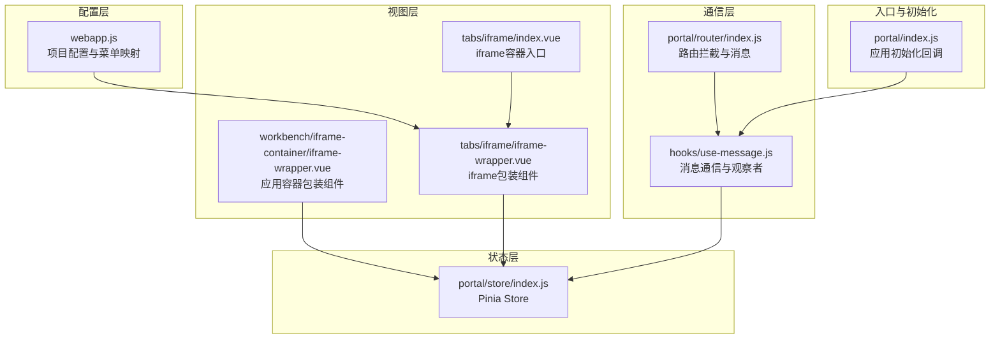
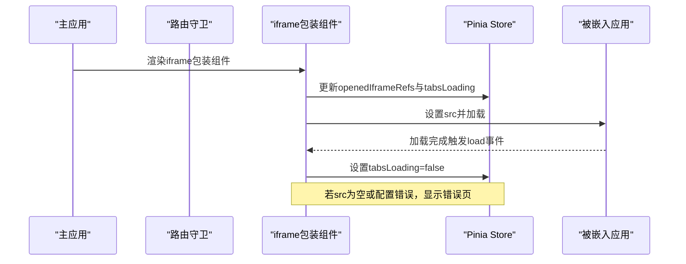
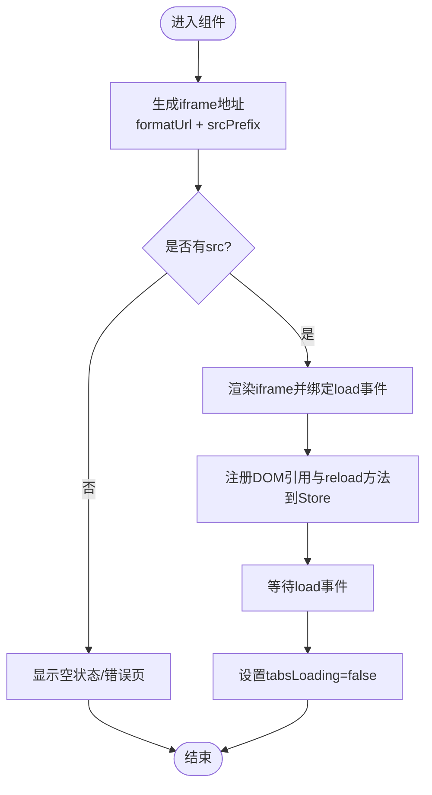
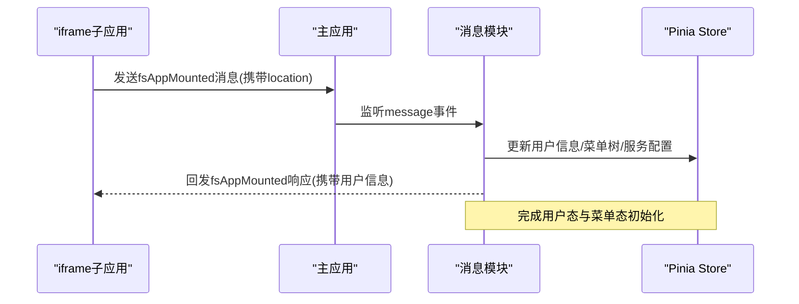
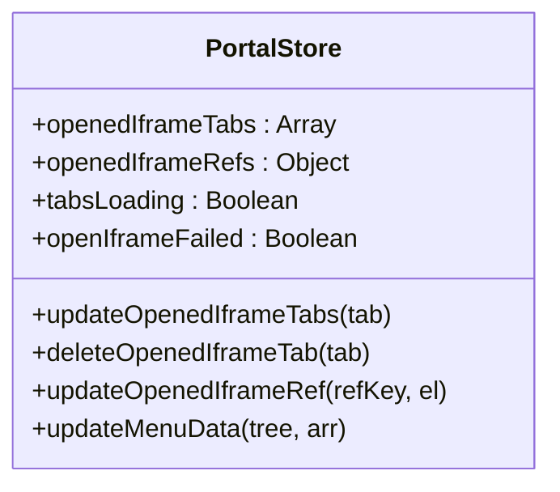
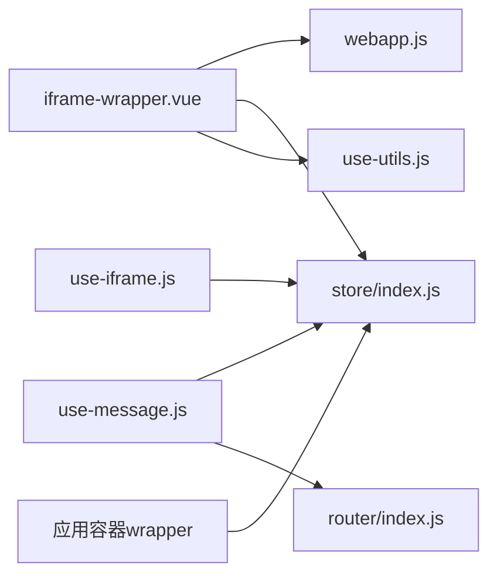

# iframe容器系统

<cite>
**本文档引用的文件**
- [iframe-wrapper.vue](file://src/portal/modules/tabs/iframe/iframe-wrapper.vue)
- [index.vue](file://src/portal/modules/tabs/iframe/index.vue)
- [use-iframe.js](file://src/portal/modules/tabs/iframe/use-iframe.js)
- [use-message.js](file://src/portal/hooks/use-message.js)
- [store/index.js](file://src/portal/store/index.js)
- [webapp.js](file://src/config/webapp.js)
- [common.js](file://src/portal/hooks/common.js)
- [iframe-container.vue](file://src/portal/views/workbench/application-view/iframe-container/iframe-container.vue)
- [iframe-wrapper.vue](file://src/portal/views/workbench/application-view/iframe-container/iframe-wrapper.vue)
- [index.js](file://src/portal/router/index.js)
- [index.js](file://src/portal/index.js)
</cite>

## 目录
1. [简介](#简介)
2. [项目结构](#项目结构)
3. [核心组件](#核心组件)
4. [架构总览](#架构总览)
5. [详细组件分析](#详细组件分析)
6. [依赖关系分析](#依赖关系分析)
7. [性能考虑](#性能考虑)
8. [故障排查指南](#故障排查指南)
9. [结论](#结论)

## 简介
本文件为 FS-AOI-WEB 的 iframe 容器系统提供完整技术文档。系统通过统一的 iframe 容器实现企业级外部应用的内嵌集成，支持动态地址生成、消息通信、生命周期管理、错误处理与超时控制，并提供安全策略与跨域访问控制方案。本文档面向开发者与架构师，既包含高层架构说明，也包含代码级细节与可视化图表。

## 项目结构
iframe 容器系统主要由以下层次构成：
- 配置层：项目配置与菜单映射，负责 iframe 地址格式化与前缀拼接
- 视图层：iframe 容器与包装组件，负责渲染与生命周期管理
- 通信层：基于 postMessage 的消息通道，负责主应用与 iframe 的双向通信
- 状态层：Pinia Store，负责已打开 iframe 的状态管理与引用维护
- 路由层：路由守卫与消息拦截，确保 iframe 模式下的路由一致性

**图表来源**
- [webapp.js](file://src/config/webapp.js#L131-L189)
- [index.vue](file://src/portal/modules/tabs/iframe/index.vue#L1-L21)
- [iframe-wrapper.vue](file://src/portal/modules/tabs/iframe/iframe-wrapper.vue#L1-L110)
- [iframe-wrapper.vue](file://src/portal/views/workbench/application-view/iframe-container/iframe-wrapper.vue#L1-L109)
- [use-message.js](file://src/portal/hooks/use-message.js#L1-L503)
- [index.js](file://src/portal/router/index.js#L46-L90)
- [store/index.js](file://src/portal/store/index.js#L1-L226)
- [index.js](file://src/portal/index.js#L103-L152)

**章节来源**
- [webapp.js](file://src/config/webapp.js#L131-L189)
- [index.vue](file://src/portal/modules/tabs/iframe/index.vue#L1-L21)
- [iframe-wrapper.vue](file://src/portal/modules/tabs/iframe/iframe-wrapper.vue#L1-L110)
- [iframe-wrapper.vue](file://src/portal/views/workbench/application-view/iframe-container/iframe-wrapper.vue#L1-L109)
- [use-message.js](file://src/portal/hooks/use-message.js#L1-L503)
- [index.js](file://src/portal/router/index.js#L46-L90)
- [store/index.js](file://src/portal/store/index.js#L1-L226)
- [index.js](file://src/portal/index.js#L103-L152)

## 核心组件
- iframe 包装组件：负责根据配置生成最终 src，监听加载完成事件，维护 reload 方法与 DOM 引用
- iframe 容器入口：根据已打开的 iframe 标签渲染对应包装组件
- 消息通信模块：封装主应用与 iframe 的双向通信，包括用户信息同步、内容节点获取、路由同步、激活/失活通知、重载指令等
- Pinia Store：维护已打开 iframe 的标签列表、DOM 引用、加载状态与失败标记
- 项目配置：统一管理 iframe 地址格式化函数、前缀拼接策略与登录态键名
- 路由拦截：在 iframe 模式下拦截路由跳转，向父窗口发送阻止消息并同步 routeTo 参数

**章节来源**
- [iframe-wrapper.vue](file://src/portal/modules/tabs/iframe/iframe-wrapper.vue#L36-L90)
- [index.vue](file://src/portal/modules/tabs/iframe/index.vue#L1-L21)
- [use-message.js](file://src/portal/hooks/use-message.js#L66-L205)
- [store/index.js](file://src/portal/store/index.js#L43-L54)
- [webapp.js](file://src/config/webapp.js#L138-L178)
- [index.js](file://src/portal/router/index.js#L46-L90)

## 架构总览
系统采用“配置驱动 + 统一容器 + 消息通信”的架构模式：
- 配置驱动：通过 projectConfig.iframe.formatUrl 与 srcPrefix 实现灵活的地址生成与前缀拼接
- 统一容器：iframe-wrapper.vue 作为通用包装组件，集中处理加载、重载、错误页等行为
- 消息通信：use-message.js 提供多类消息处理（用户信息、内容节点、路由同步、激活/失活、重载），并在 iframe 模式下通过 window.parent.postMessage 与父窗口交互
- 状态管理：Pinia Store 统一维护 openedIframeTabs、openedIframeRefs、tabsLoading、openIframeFailed 等状态
- 路由一致性：路由拦截确保 iframe 模式下所有跳转由父窗口统一处理，避免子窗口独立路由导致的状态不一致

**图表来源**
- [iframe-wrapper.vue](file://src/portal/modules/tabs/iframe/iframe-wrapper.vue#L71-L82)
- [store/index.js](file://src/portal/store/index.js#L213-L215)
- [index.js](file://src/portal/router/index.js#L46-L90)

**章节来源**
- [iframe-wrapper.vue](file://src/portal/modules/tabs/iframe/iframe-wrapper.vue#L1-L110)
- [store/index.js](file://src/portal/store/index.js#L1-L226)
- [index.js](file://src/portal/router/index.js#L46-L90)

## 详细组件分析

### iframe 包装组件（iframe-wrapper.vue）
职责与特性：
- 动态生成 src：优先使用 projectConfig.iframe.formatUrl，否则回退至工具方法；支持 srcPrefix 前缀拼接
- 生命周期管理：监听 load 事件，设置 tabsLoading=false；提供 reload 方法强制刷新
- DOM 引用注册：在 nextTick 中将 iframe DOM 与 reload 方法注册到 Store，便于外部调用
- 条件渲染与错误页：根据 isShow 控制显示；当 src 为空或配置错误时显示错误页

**图表来源**
- [iframe-wrapper.vue](file://src/portal/modules/tabs/iframe/iframe-wrapper.vue#L36-L90)
- [store/index.js](file://src/portal/store/index.js#L213-L215)

**章节来源**
- [iframe-wrapper.vue](file://src/portal/modules/tabs/iframe/iframe-wrapper.vue#L1-L110)

### iframe 容器入口（tabs/iframe/index.vue）
职责与特性：
- 根据 Store 中的 openedIframeTabs 渲染多个 iframe 包装组件
- 通过 v-for 循环与唯一 key 管理多个 iframe 的实例化与销毁

**章节来源**
- [index.vue](file://src/portal/modules/tabs/iframe/index.vue#L1-L21)

### 应用容器包装组件（workbench/iframe-container/iframe-wrapper.vue）
职责与特性：
- 面向应用视图的 iframe 包装，支持从应用对象动态拼接 BUSI_CODE、客户识别参数与自定义 query
- 与 Store 的 menuArr 协作，结合 projectConfig.iframe.formatUrl 生成最终地址
- 提供基础的加载事件处理与样式封装

**章节来源**
- [iframe-wrapper.vue](file://src/portal/views/workbench/application-view/iframe-container/iframe-wrapper.vue#L1-L109)

### 消息通信模块（hooks/use-message.js）
职责与特性：
- 用户信息同步：在 iframe 模式下向父窗口发送 fsAppMounted 消息，接收并解析用户信息、菜单树、服务配置等，写入 Store 与 SessionStorage
- 内容节点获取：向父窗口发送 fsAppContentNode 消息，收集内容节点高度与布局信息，返回给 iframe
- 路由同步：监听 routeTo 消息，结合本地缓存与当前路由，实现参数同步与刷新
- 激活/失活观察：定时检测页面尺寸变化，向父窗口发送 onActivated/onDeactivated 消息
- 重载指令：监听 reload 消息，触发 window.location.reload
- 选项卡控制：通过 postMessage 接收 openTab/closeActiveTab 等指令，委托 useTabs 执行

**图表来源**
- [use-message.js](file://src/portal/hooks/use-message.js#L66-L205)
- [store/index.js](file://src/portal/store/index.js#L73-L80)

**章节来源**
- [use-message.js](file://src/portal/hooks/use-message.js#L66-L205)
- [use-message.js](file://src/portal/hooks/use-message.js#L207-L307)
- [use-message.js](file://src/portal/hooks/use-message.js#L402-L425)
- [use-message.js](file://src/portal/hooks/use-message.js#L429-L493)

### Pinia Store（portal/store/index.js）
职责与特性：
- openedIframeTabs：维护已打开的 iframe 标签数组，支持去重与按 query 变更触发刷新
- openedIframeRefs：维护 iframe DOM 引用与 reload 方法，供外部调用
- tabsLoading/openIframeFailed：控制加载状态与错误页显示
- updateOpenedIframeTabs/deleteOpenedIframeTab/updateOpenedIframeRef：对 iframe 状态进行增删改查

**图表来源**
- [store/index.js](file://src/portal/store/index.js#L4-L54)
- [store/index.js](file://src/portal/store/index.js#L156-L215)

**章节来源**
- [store/index.js](file://src/portal/store/index.js#L1-L226)

### 项目配置（src/config/webapp.js）
职责与特性：
- projectConfig.iframe.formatUrl：统一的地址格式化函数，支持 http、ksot-sync/kotc-sync、相对路径等多种场景
- srcPrefix：支持字符串或函数形式的前缀拼接，可在 formatUrl 之后追加
- 登录态键名：login.loginDataKey/loginTokenKey 用于用户信息与令牌的持久化

**章节来源**
- [webapp.js](file://src/config/webapp.js#L138-L178)
- [webapp.js](file://src/config/webapp.js#L134-L137)

### 路由拦截（portal/router/index.js）
职责与特性：
- 在 iframe 模式下拦截路由 push，向父窗口发送 fsAppPreventRouterPush 消息，阻止子窗口独立路由
- 通过 localStorage 缓存 routeTo 参数，确保刷新后可恢复参数
- 首次进入时记录 firstInIframePath，保证后续跳转的一致性

**章节来源**
- [index.js](file://src/portal/router/index.js#L46-L90)

### 应用初始化（portal/index.js）
职责与特性：
- appBeforeMount 钩子中并行初始化：获取加密密钥、内容节点、同步数据、用户信息、观察者与重载事件
- appMounted 钩子中初始化 favicon 与主题

**章节来源**
- [index.js](file://src/portal/index.js#L103-L152)

## 依赖关系分析
- 组件依赖：tabs/iframe/index.vue 依赖 iframe-wrapper.vue；iframe-wrapper.vue 依赖 projectConfig、useUtils、usePortalStore
- 通信依赖：use-message.js 依赖 eventListen、isInIframe、usePortalStore、router；与 window.postMessage 密切相关
- 状态依赖：iframe-wrapper.vue 与 use-iframe.js 依赖 Pinia Store 的 openedIframeRefs 与 openedIframeTabs
- 路由依赖：router/index.js 依赖 isInIframe 与 localStorage，用于路由拦截与参数同步

**图表来源**
- [iframe-wrapper.vue](file://src/portal/modules/tabs/iframe/iframe-wrapper.vue#L26-L28)
- [use-iframe.js](file://src/portal/modules/tabs/iframe/use-iframe.js#L1-L16)
- [use-message.js](file://src/portal/hooks/use-message.js#L1-L11)
- [store/index.js](file://src/portal/store/index.js#L1-L226)
- [index.js](file://src/portal/router/index.js#L46-L90)

**章节来源**
- [iframe-wrapper.vue](file://src/portal/modules/tabs/iframe/iframe-wrapper.vue#L23-L34)
- [use-iframe.js](file://src/portal/modules/tabs/iframe/use-iframe.js#L1-L16)
- [use-message.js](file://src/portal/hooks/use-message.js#L1-L11)
- [store/index.js](file://src/portal/store/index.js#L1-L226)
- [index.js](file://src/portal/router/index.js#L46-L90)

## 性能考虑
- 按需渲染：通过 isShow 与 v-show 控制 iframe 显示，减少不必要的 DOM 开销
- 引用复用：openedIframeRefs 存储 DOM 与 reload 方法，避免重复查找与跨窗口调用成本
- 并行初始化：应用启动阶段通过 Promise.all 并行初始化多项能力，缩短首屏时间
- 路由拦截：在 iframe 模式下避免子窗口独立路由，降低状态同步与内存占用成本
- 图片与资源：在 iframe 模式下遵循同源策略与 CORS 配置，必要时通过代理或 CORS 降级策略加载资源

[本节为通用性能建议，无需特定文件引用]

## 故障排查指南
常见问题与定位方法：
- iframe 无法加载或空白页
  - 检查 src 生成逻辑：确认 projectConfig.iframe.formatUrl 与 srcPrefix 配置是否正确
  - 查看 Store 的 openIframeFailed 标志位与错误页显示
  - 确认路由拦截是否导致父窗口阻止了跳转
- 用户信息未同步
  - 检查 isInIframe 配置与 location 参数中 isIframe/isInIframe 标记
  - 确认父窗口是否发送 fsAppMounted 消息且包含用户信息
- 路由跳转无效或参数丢失
  - 检查路由拦截逻辑与 localStorage 中 routeTo 缓存
  - 确认首次进入路径 firstInIframePath 是否正确
- 激活/失活事件异常
  - 检查定时观察器是否运行，确认 body 尺寸变化检测逻辑
- 重载指令无效
  - 确认监听 topic 为 reload 的消息是否被正确接收

**章节来源**
- [iframe-wrapper.vue](file://src/portal/modules/tabs/iframe/iframe-wrapper.vue#L19-L20)
- [use-message.js](file://src/portal/hooks/use-message.js#L66-L205)
- [index.js](file://src/portal/router/index.js#L46-L90)
- [use-message.js](file://src/portal/hooks/use-message.js#L429-L493)

## 结论
FS-AOI-WEB 的 iframe 容器系统以配置驱动为核心，通过统一的包装组件与消息通信机制，实现了企业级外部应用的稳定内嵌集成。系统在安全性、一致性与可观测性方面提供了完善的保障：通过路由拦截与消息协议确保状态一致，通过 Store 与 DOM 引用管理提升可维护性，通过并行初始化与条件渲染优化性能。开发者可基于现有架构扩展更多通信协议与安全策略，满足复杂业务场景的需求。