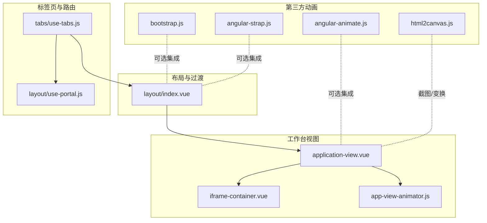
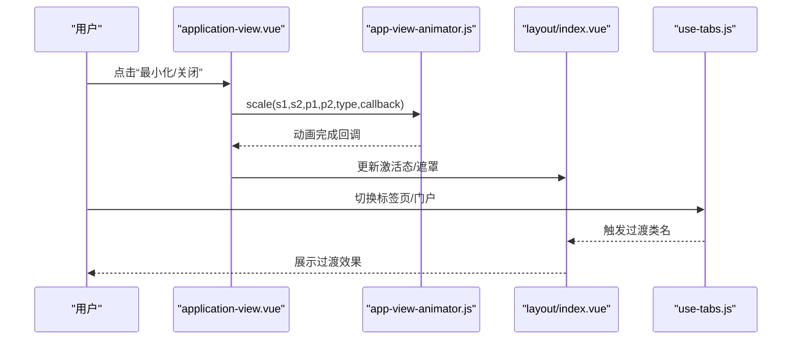
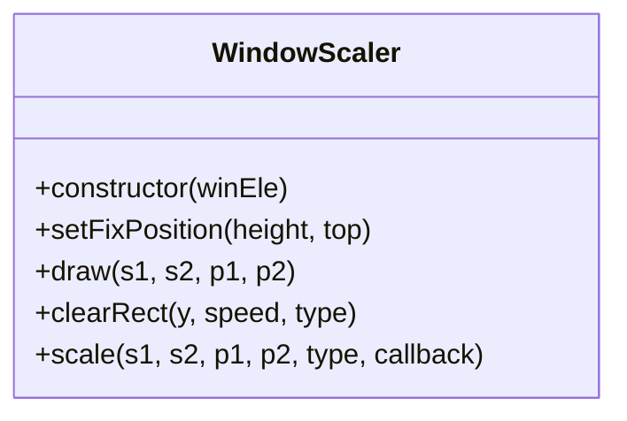
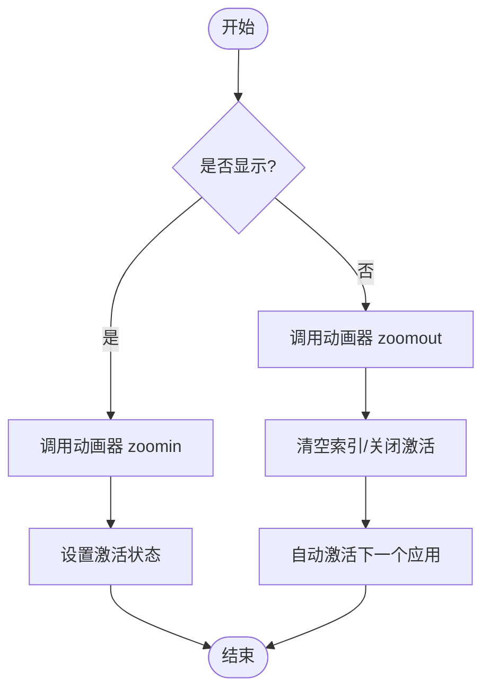
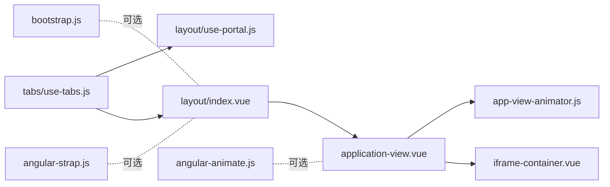

# 动画效果系统

<cite>
**本文引用的文件**
- [src/portal/views/workbench/application-view/app-view-animator.js](file://src/portal/views/workbench/application-view/app-view-animator.js)
- [src/portal/views/workbench/application-view/application-view.vue](file://src/portal/views/workbench/application-view/application-view.vue)
- [src/portal/views/workbench/application-view/iframe-container/iframe-container.vue](file://src/portal/views/workbench/application-view/iframe-container/iframe-container.vue)
- [src/portal/views/layout/index.vue](file://src/portal/views/layout/index.vue)
- [src/portal/modules/tabs/use-tabs.js](file://src/portal/modules/tabs/use-tabs.js)
- [src/portal/views/layout/use-portal.js](file://src/portal/views/layout/use-portal.js)
- [public/static/flow/libs/angular-animate_1.3.13/angular-animate.js](file://public/static/flow/libs/angular-animate_1.3.13/angular-animate.js)
- [public/static/flow/libs/bootstrap_3.1.1/js/bootstrap.js](file://public/static/flow/libs/bootstrap_3.1.1/js/bootstrap.js)
- [public/static/flow/libs/angular-strap_2.1.6/angular-strap.js](file://public/static/flow/libs/angular-strap_2.1.6/angular-strap.js)
- [public/static/flow/libs/html2canvas_0.4.1/html2canvas.js](file://public/static/flow/libs/html2canvas_0.4.1/html2canvas.js)
- [package.json](file://package.json)
</cite>

## 目录
1. [引言](#引言)
2. [项目结构](#项目结构)
3. [核心组件](#核心组件)
4. [架构总览](#架构总览)
5. [详细组件分析](#详细组件分析)
6. [依赖关系分析](#依赖关系分析)
7. [性能考量](#性能考量)
8. [故障排查指南](#故障排查指南)
9. [结论](#结论)
10. [附录](#附录)

## 引言
本技术文档聚焦于 FS-AOI-WEB 应用的“视图动画效果系统”，系统性阐述应用视图的打开、关闭与切换动画的实现架构与管理机制。文档覆盖以下关键点：
- 视图动画：基于 Canvas 的窗口缩放动画、基于 CSS 的进入/离开过渡、基于第三方库的过渡与动画
- 动画管理：动画序列控制、回调处理、异常恢复
- 性能优化：硬件加速、帧率控制、合成层优化
- 配置参数与扩展：动画参数化、自定义动画开发流程
- 实践指南：面向企业级开发者的最佳实践与调优建议

## 项目结构
围绕“视图动画效果系统”的相关模块主要分布在以下路径：
- 视图容器与动画执行：application-view（包含 Canvas 动画器与视图容器）
- 布局与过渡：layout（包含 Vue Transition 的 CSS 过渡）
- 标签页与路由切换：tabs/use-tabs（路由切换时的动画与回调）
- 第三方动画支持：angular-animate、bootstrap、angular-strap 等
- 依赖与构建：package.json

图表来源
- [src/portal/views/workbench/application-view/application-view.vue](file://src/portal/views/workbench/application-view/application-view.vue#L1-L358)
- [src/portal/views/workbench/application-view/app-view-animator.js](file://src/portal/views/workbench/application-view/app-view-animator.js#L1-L149)
- [src/portal/views/workbench/application-view/iframe-container/iframe-container.vue](file://src/portal/views/workbench/application-view/iframe-container/iframe-container.vue#L1-L23)
- [src/portal/views/layout/index.vue](file://src/portal/views/layout/index.vue#L82-L187)
- [src/portal/modules/tabs/use-tabs.js](file://src/portal/modules/tabs/use-tabs.js#L1-L597)
- [src/portal/views/layout/use-portal.js](file://src/portal/views/layout/use-portal.js#L1-L43)
- [public/static/flow/libs/angular-animate_1.3.13/angular-animate.js](file://public/static/flow/libs/angular-animate_1.3.13/angular-animate.js#L90-L1152)
- [public/static/flow/libs/bootstrap_3.1.1/js/bootstrap.js](file://public/static/flow/libs/bootstrap_3.1.1/js/bootstrap.js#L1740-L1806)
- [public/static/flow/libs/angular-strap_2.1.6/angular-strap.js](file://public/static/flow/libs/angular-strap_2.1.6/angular-strap.js#L3193-L3238)
- [public/static/flow/libs/html2canvas_0.4.1/html2canvas.js](file://public/static/flow/libs/html2canvas_0.4.1/html2canvas.js#L1983-L2011)

章节来源
- [src/portal/views/workbench/application-view/application-view.vue](file://src/portal/views/workbench/application-view/application-view.vue#L1-L358)
- [src/portal/views/layout/index.vue](file://src/portal/views/layout/index.vue#L82-L187)
- [src/portal/modules/tabs/use-tabs.js](file://src/portal/modules/tabs/use-tabs.js#L1-L597)

## 核心组件
- Canvas 窗口缩放动画器：基于 requestAnimationFrame 的贝塞尔曲线绘制与裁剪，实现“窗口缩小/放大”的视觉过渡
- 应用视图容器：负责视图的显示/隐藏、激活状态、全屏模式与遮罩层
- 布局过渡：基于 Vue Transition 的 slide-fade 过渡，实现头部与整体布局的进入/离开动画
- 标签页与路由切换：统一的路由格式化、前置回调、关闭与重载逻辑，配合 keep-alive 实现缓存与切换
- 第三方动画库：Angular Animate、Bootstrap Tabs、AngularStrap Tabs 等，提供结构化动画事件与过渡支持

章节来源
- [src/portal/views/workbench/application-view/app-view-animator.js](file://src/portal/views/workbench/application-view/app-view-animator.js#L1-L149)
- [src/portal/views/workbench/application-view/application-view.vue](file://src/portal/views/workbench/application-view/application-view.vue#L1-L358)
- [src/portal/views/layout/index.vue](file://src/portal/views/layout/index.vue#L82-L187)
- [src/portal/modules/tabs/use-tabs.js](file://src/portal/modules/tabs/use-tabs.js#L1-L597)

## 架构总览
系统采用“容器-动画器-过渡-路由”分层架构：
- 容器层：application-view.vue 负责视图生命周期与状态管理
- 动画层：app-view-animator.js 提供 Canvas 动画能力
- 过渡层：layout/index.vue 提供全局布局过渡
- 路由层：use-tabs.js 与 use-portal.js 协同完成路由切换与前置/后置回调

图表来源
- [src/portal/views/workbench/application-view/application-view.vue](file://src/portal/views/workbench/application-view/application-view.vue#L67-L168)
- [src/portal/views/workbench/application-view/app-view-animator.js](file://src/portal/views/workbench/application-view/app-view-animator.js#L44-L142)
- [src/portal/views/layout/index.vue](file://src/portal/views/layout/index.vue#L99-L103)
- [src/portal/modules/tabs/use-tabs.js](file://src/portal/modules/tabs/use-tabs.js#L294-L366)

## 详细组件分析

### 组件一：Canvas 窗口缩放动画器（WindowScaler）
- 职责：在目标窗口与任务栏之间绘制动态遮罩，通过贝塞尔曲线与逐帧裁剪实现“窗口缩小/放大”的视觉过渡
- 关键点：
  - 使用 Canvas 创建遮罩层，置于目标元素上方，避免影响布局
  - 通过 requestAnimationFrame 控制帧率，结合速度递增策略提升视觉流畅度
  - 支持 zoomin/zoomout 两种类型，分别对应“展开”和“收起”动画
  - 动画完成后清理 DOM 并触发回调，确保后续状态同步

图表来源
- [src/portal/views/workbench/application-view/app-view-animator.js](file://src/portal/views/workbench/application-view/app-view-animator.js#L2-L143)

章节来源
- [src/portal/views/workbench/application-view/app-view-animator.js](file://src/portal/views/workbench/application-view/app-view-animator.js#L1-L149)

### 组件二：应用视图容器（application-view.vue）
- 职责：承载业务视图或 iframe 内容；管理显示/隐藏、激活状态、全屏模式与遮罩层
- 关键点：
  - 通过 switchActive/handelShowView/handelHiddenView 控制视图状态与动画序列
  - 在隐藏时调用动画器进行 zoomout，在显示时进行 zoomin
  - 全屏模式下临时移除 transform，退出全屏时恢复
  - 结合 KeepAlive 缓存组件实例，减少重复渲染成本

图表来源
- [src/portal/views/workbench/application-view/application-view.vue](file://src/portal/views/workbench/application-view/application-view.vue#L67-L168)

章节来源
- [src/portal/views/workbench/application-view/application-view.vue](file://src/portal/views/workbench/application-view/application-view.vue#L1-L358)

### 组件三：布局过渡（layout/index.vue）
- 职责：提供全局布局的进入/离开过渡，增强头部与整体内容的切换体验
- 关键点：
  - 使用 Vue Transition 类名 slide-fade，分别定义进入/离开的持续时间与缓动曲线
  - 在 onUpdated 钩子中动态设置过渡类名，确保每次路由变化触发动画
  - 通过 CSS transition 实现平滑的透明度与位移动画

章节来源
- [src/portal/views/layout/index.vue](file://src/portal/views/layout/index.vue#L82-L187)

### 组件四：标签页与路由切换（tabs/use-tabs.js）
- 职责：统一路由格式化、前置回调、标签页打开/关闭/重载与栈管理
- 关键点：
  - open：格式化路由参数、前置回调、门户/卡片打开、路由跳转、keep-alive 更新与 iframe 打开
  - reload/close/closeOthers/closeLeft/closeRight/closeAll/clear/clearAll：提供丰富的关闭与导航能力
  - 通过 useCallback.call 触发 onBeforeTabOpen/onTabOpened/onBeforeTabClose/onTabClosed 回调，便于业务侧接入

章节来源
- [src/portal/modules/tabs/use-tabs.js](file://src/portal/modules/tabs/use-tabs.js#L292-L597)

### 组件五：门户打开（layout/use-portal.js）
- 职责：门户级别的路由打开与缓存，支持从缓存路径回退
- 关键点：
  - 将当前门户路由缓存至 store，下次直接跳转缓存路径
  - 若路由不存在，弹出提示并阻止跳转

章节来源
- [src/portal/views/layout/use-portal.js](file://src/portal/views/layout/use-portal.js#L1-L43)

### 组件六：第三方动画库集成
- Angular Animate：提供 CSS 过渡与 JS 动画事件，支持结构化动画与类名驱动
- Bootstrap Tabs：基于 CSS transition 的 fade/in 切换，利用 transition.end 事件保证动画完成
- AngularStrap Tabs：提供 bsTabs 指令与 $animate 集成，支持面板增删与活动面板变更监听

章节来源
- [public/static/flow/libs/angular-animate_1.3.13/angular-animate.js](file://public/static/flow/libs/angular-animate_1.3.13/angular-animate.js#L90-L1152)
- [public/static/flow/libs/bootstrap_3.1.1/js/bootstrap.js](file://public/static/flow/libs/bootstrap_3.1.1/js/bootstrap.js#L1740-L1806)
- [public/static/flow/libs/angular-strap_2.1.6/angular-strap.js](file://public/static/flow/libs/angular-strap_2.1.6/angular-strap.js#L3193-L3238)

## 依赖关系分析
- 视图容器依赖动画器：application-view.vue 在隐藏/显示时调用 createAppViewAnimator 返回的 WindowScaler 实例
- 布局过渡与标签页协同：layout/index.vue 的过渡类名与 use-tabs.js 的路由切换共同作用
- 第三方库可选集成：angular-animate、bootstrap、angular-strap 提供结构化动画事件与过渡支持
- 依赖声明：Vue 3、Vue Router、Pinia、@szkingdom.kjdp/ui 等

图表来源
- [src/portal/views/workbench/application-view/application-view.vue](file://src/portal/views/workbench/application-view/application-view.vue#L1-L358)
- [src/portal/views/workbench/application-view/iframe-container/iframe-container.vue](file://src/portal/views/workbench/application-view/iframe-container/iframe-container.vue#L1-L23)
- [src/portal/views/layout/index.vue](file://src/portal/views/layout/index.vue#L82-L187)
- [src/portal/modules/tabs/use-tabs.js](file://src/portal/modules/tabs/use-tabs.js#L1-L597)
- [src/portal/views/layout/use-portal.js](file://src/portal/views/layout/use-portal.js#L1-L43)
- [public/static/flow/libs/angular-animate_1.3.13/angular-animate.js](file://public/static/flow/libs/angular-animate_1.3.13/angular-animate.js#L90-L1152)
- [public/static/flow/libs/bootstrap_3.1.1/js/bootstrap.js](file://public/static/flow/libs/bootstrap_3.1.1/js/bootstrap.js#L1740-L1806)
- [public/static/flow/libs/angular-strap_2.1.6/angular-strap.js](file://public/static/flow/libs/angular-strap_2.1.6/angular-strap.js#L3193-L3238)

章节来源
- [package.json](file://package.json#L17-L40)

## 性能考量
- 硬件加速与合成层
  - 视图容器通过 will-change: transform 提示浏览器对变换进行加速
  - Canvas 动画器在动画过程中仅操作遮罩层，避免对主内容区的重排
- 帧率控制
  - 使用 requestAnimationFrame 控制动画帧，避免固定间隔导致的掉帧
  - 速度递增策略在动画末尾逐步减小步进，提升视觉平滑度
- 过渡与重绘
  - 布局过渡采用 CSS transition，尽量使用 transform/opacity，避免触发布局与重绘
  - KeepAlive 缓存组件实例，减少重复挂载/卸载带来的性能损耗
- 第三方库兼容
  - Angular Animate 会在检测到 transition/animation 时自动注入过渡类名，需注意与业务 CSS 的冲突
  - Bootstrap Tabs 在 transition.end 事件上绑定回调，确保动画结束后再执行状态切换

章节来源
- [src/portal/views/workbench/application-view/application-view.vue](file://src/portal/views/workbench/application-view/application-view.vue#L264-L264)
- [src/portal/views/workbench/application-view/app-view-animator.js](file://src/portal/views/workbench/application-view/app-view-animator.js#L44-L142)
- [src/portal/views/layout/index.vue](file://src/portal/views/layout/index.vue#L162-L174)
- [public/static/flow/libs/angular-animate_1.3.13/angular-animate.js](file://public/static/flow/libs/angular-animate_1.3.13/angular-animate.js#L161-L176)
- [public/static/flow/libs/bootstrap_3.1.1/js/bootstrap.js](file://public/static/flow/libs/bootstrap_3.1.1/js/bootstrap.js#L1740-L1775)

## 故障排查指南
- 动画未触发
  - 检查是否正确调用 createAppViewAnimator 并传入正确的 DOM 元素
  - 确认动画回调中是否正确更新 showView 与激活状态
- 动画卡顿或掉帧
  - 确认是否使用 requestAnimationFrame，避免使用定时器
  - 减少动画期间的 DOM 查询与复杂计算，必要时使用缓存
- 过渡类名无效
  - 确认 layout/index.vue 中的 transitionName 是否在 onUpdated 后被设置
  - 检查 CSS 类名拼写与作用域样式覆盖
- 路由切换异常
  - 检查 use-tabs.js 的前置回调返回值，确保没有阻断路由跳转
  - 确认 keep-alive 与缓存键是否正确，避免重复打开同一标签页
- 第三方库冲突
  - Angular Animate 与业务 CSS 的类名冲突可能导致动画不生效，建议统一命名规范
  - Bootstrap Tabs 的 transition.end 事件需确保只绑定一次，避免重复触发

章节来源
- [src/portal/views/workbench/application-view/application-view.vue](file://src/portal/views/workbench/application-view/application-view.vue#L92-L118)
- [src/portal/views/layout/index.vue](file://src/portal/views/layout/index.vue#L101-L103)
- [src/portal/modules/tabs/use-tabs.js](file://src/portal/modules/tabs/use-tabs.js#L320-L324)
- [public/static/flow/libs/angular-animate_1.3.13/angular-animate.js](file://public/static/flow/libs/angular-animate_1.3.13/angular-animate.js#L92-L127)
- [public/static/flow/libs/bootstrap_3.1.1/js/bootstrap.js](file://public/static/flow/libs/bootstrap_3.1.1/js/bootstrap.js#L1740-L1775)

## 结论
FS-AOI-WEB 的动画效果系统以“容器-动画器-过渡-路由”为核心，结合 Canvas 与 CSS 过渡实现了流畅且可控的视图动画体验。通过回调与缓存机制，系统在保证性能的同时提供了良好的扩展性。建议在企业级开发中遵循“硬件加速优先、帧率稳定、类名规范、回调解耦”的原则，持续优化动画体验。

## 附录
- 动画配置参数（示例）
  - Canvas 动画器：速度、步进递增、起止坐标、裁剪区域
  - 布局过渡：进入/离开持续时间、缓动曲线、透明度与位移
  - 标签页：前置回调、路由参数合并、keep-alive 缓存键
- 自定义动画开发流程
  - 明确动画场景与目标元素
  - 选择合适的技术栈（Canvas/CSS/JS）
  - 设计回调与异常恢复策略
  - 进行性能测试与兼容性验证
- 第三方库集成要点
  - Angular Animate：统一类名前缀，避免与业务样式冲突
  - Bootstrap Tabs：确保 transition.end 事件正确绑定与解绑
  - AngularStrap Tabs：利用 $animate 事件钩子实现复杂动画链路